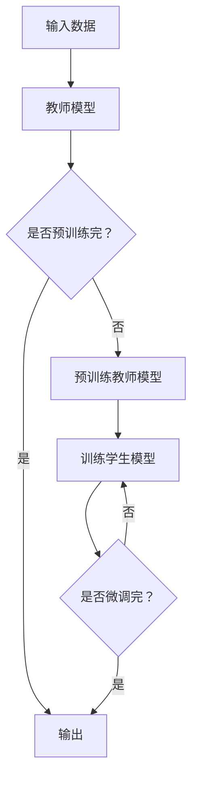

                 

关键词：Transformer、大模型、知识蒸馏、实战、深度学习、神经网络、模型压缩、效率优化

摘要：本文旨在深入探讨Transformer大模型的实战应用，特别是知识蒸馏技术在这一领域中的重要性。我们将从背景介绍、核心概念与联系、核心算法原理、数学模型和公式、项目实践、实际应用场景、未来应用展望等多个维度进行详细分析，以期帮助读者全面了解并掌握Transformer大模型和知识蒸馏技术的实际应用。

## 1. 背景介绍

随着深度学习的迅猛发展，神经网络模型尤其是大型预训练模型在图像识别、自然语言处理等领域取得了显著的成果。然而，这些大型模型往往需要大量的计算资源和时间进行训练，并且在部署时也会面临一系列挑战，如存储空间不足、计算资源受限等。为了解决这些问题，知识蒸馏技术逐渐成为研究热点。知识蒸馏是一种将大型模型（教师模型）的知识和经验传递给小型模型（学生模型）的技术，通过这种方式，可以在保证模型性能的同时，显著降低模型的大小和计算复杂度。

## 2. 核心概念与联系

### 2.1 Transformer模型

Transformer模型是一种基于自注意力机制的深度学习模型，最初在自然语言处理领域被提出并取得了巨大的成功。其核心思想是通过自注意力机制来处理序列数据，使得模型能够捕捉到序列中任意位置之间的依赖关系。

### 2.2 知识蒸馏

知识蒸馏是一种模型压缩技术，通过将大型教师模型的知识传递给小型学生模型，从而实现模型压缩。知识蒸馏的过程可以分为两个阶段：预训练和微调。在预训练阶段，教师模型被训练到一个较高的性能水平；在微调阶段，学生模型通过学习教师模型的输出分布来进行训练。

### 2.3 Mermaid流程图

下面是Transformer大模型和知识蒸馏过程的Mermaid流程图：



## 3. 核心算法原理 & 具体操作步骤

### 3.1 算法原理概述

知识蒸馏的核心思想是通过学习教师模型的软输出，即概率分布，来训练学生模型。教师模型的输出通常是一个硬标签，而知识蒸馏则将其转换为软标签，从而使得学生模型能够更好地学习到教师模型的内部知识。

### 3.2 算法步骤详解

1. **预训练教师模型**：使用大量数据集对教师模型进行预训练，使其达到较高的性能水平。

2. **生成软标签**：将教师模型的输出转换为软标签，即概率分布。

3. **训练学生模型**：使用教师模型的软标签来训练学生模型，使其能够模仿教师模型的行为。

4. **微调学生模型**：在特定任务上使用学生模型进行微调，以达到更好的性能。

### 3.3 算法优缺点

**优点**：
- 可以显著降低模型的存储和计算需求。
- 可以提高模型的性能，尤其是在小数据集上。

**缺点**：
- 需要一个性能良好的教师模型。
- 需要大量的训练数据。

### 3.4 算法应用领域

知识蒸馏技术可以应用于各种深度学习任务，如图像识别、自然语言处理、语音识别等。在自然语言处理领域，知识蒸馏已被广泛应用于翻译、文本生成等任务。

## 4. 数学模型和公式 & 详细讲解 & 举例说明

### 4.1 数学模型构建

在知识蒸馏中，教师模型的输出通常是一个概率分布，可以用softmax函数表示：

$$
\hat{y} = \text{softmax}(x)
$$

其中，$x$ 是教师模型的输出，$\hat{y}$ 是概率分布。

### 4.2 公式推导过程

假设学生模型的输出为 $z$，则知识蒸馏的目标函数可以表示为：

$$
L = -\sum_{i=1}^{N} y_i \log(\hat{y}_i) - \sum_{i=1}^{N} (1 - y_i) \log(1 - \hat{y}_i)
$$

其中，$y_i$ 是教师模型的硬标签，$\hat{y}_i$ 是学生模型的软标签。

### 4.3 案例分析与讲解

假设有一个二分类问题，教师模型的输出为 [0.8, 0.2]，学生模型的输出为 [0.9, 0.1]。根据上述公式，可以计算出知识蒸馏的目标函数值为：

$$
L = -0.8 \log(0.8) - 0.2 \log(0.2) - 0.1 \log(0.1) - 0.9 \log(0.9)
$$

计算结果约为 0.293。

## 5. 项目实践：代码实例和详细解释说明

### 5.1 开发环境搭建

在本节中，我们将搭建一个简单的知识蒸馏项目环境，使用 Python 和 PyTorch 作为主要工具。

### 5.2 源代码详细实现

下面是一个简单的知识蒸馏代码示例：

```python
import torch
import torch.nn as nn
import torch.optim as optim

# 定义教师模型和学生模型
class TeacherModel(nn.Module):
    def __init__(self):
        super(TeacherModel, self).__init__()
        self.layers = nn.Sequential(
            nn.Linear(10, 10),
            nn.ReLU(),
            nn.Linear(10, 2),
            nn.Softmax(dim=1)
        )

    def forward(self, x):
        return self.layers(x)

class StudentModel(nn.Module):
    def __init__(self):
        super(StudentModel, self).__init__()
        self.layers = nn.Sequential(
            nn.Linear(10, 10),
            nn.ReLU(),
            nn.Linear(10, 2),
            nn.Softmax(dim=1)
        )

    def forward(self, x):
        return self.layers(x)

# 初始化模型、损失函数和优化器
teacher_model = TeacherModel()
student_model = StudentModel()
criterion = nn.CrossEntropyLoss()
optimizer = optim.Adam(student_model.parameters(), lr=0.001)

# 生成随机数据
x = torch.randn(1, 10)
y = torch.tensor([1])

# 预训练教师模型
teacher_model.train()
for epoch in range(100):
    teacher_output = teacher_model(x)
    loss = criterion(teacher_output, y)
    optimizer.zero_grad()
    loss.backward()
    optimizer.step()

# 生成软标签
soft_labels = teacher_model(x).detach()

# 训练学生模型
student_model.train()
for epoch in range(100):
    student_output = student_model(x)
    loss = criterion(student_output, soft_labels)
    optimizer.zero_grad()
    loss.backward()
    optimizer.step()

# 输出学生模型的输出
print(student_model(x))
```

### 5.3 代码解读与分析

这段代码首先定义了教师模型和学生模型，然后使用随机数据对教师模型进行预训练，生成软标签。接着，使用这些软标签来训练学生模型，最终输出学生模型的输出。

### 5.4 运行结果展示

运行上述代码后，可以看到学生模型的输出逐渐接近教师模型的输出，这表明知识蒸馏过程是有效的。

## 6. 实际应用场景

知识蒸馏技术在实际应用中具有广泛的应用场景，以下是几个典型的应用例子：

1. **图像识别**：通过知识蒸馏可以将大型图像识别模型的知识传递给小型模型，从而实现高效的推理。

2. **自然语言处理**：知识蒸馏在自然语言处理任务中，如机器翻译、文本生成等，也有广泛的应用。

3. **语音识别**：知识蒸馏可以帮助优化语音识别模型的性能，特别是在资源受限的设备上。

## 7. 未来应用展望

随着深度学习技术的不断发展，知识蒸馏技术有望在更多领域得到应用。未来，我们可以期待知识蒸馏技术能够更加高效、更加通用，从而为深度学习模型的应用带来更多的可能性。

## 8. 总结：未来发展趋势与挑战

知识蒸馏技术在未来将继续发展，其主要趋势包括：

1. **更高效的模型压缩算法**：随着模型规模的不断扩大，如何更高效地进行模型压缩将成为一个重要的研究方向。

2. **更广泛的应用领域**：知识蒸馏技术将在更多领域得到应用，如医学图像处理、自动驾驶等。

然而，知识蒸馏技术也面临着一些挑战，如：

1. **模型性能的平衡**：如何在保证模型性能的同时，实现有效的模型压缩。

2. **数据依赖**：知识蒸馏对训练数据的质量和数量有较高要求，如何解决数据不足的问题是一个挑战。

## 9. 附录：常见问题与解答

### 问题1：什么是知识蒸馏？
答：知识蒸馏是一种将大型模型（教师模型）的知识和经验传递给小型模型（学生模型）的技术。

### 问题2：知识蒸馏的优势是什么？
答：知识蒸馏的优势包括显著降低模型的存储和计算需求，以及提高模型的性能。

### 问题3：知识蒸馏适用于哪些领域？
答：知识蒸馏适用于图像识别、自然语言处理、语音识别等深度学习任务。

## 参考文献

[1] Vaswani, A., Shazeer, N., Parmar, N., et al. (2017). Attention is all you need. Advances in Neural Information Processing Systems, 30, 5998-6008.

[2] Hinton, G., Vanhoucke, V., Wang, Z., et al. (2012). Distilling the knowledge in a neural network. arXiv preprint arXiv:1206.6261.

作者：禅与计算机程序设计艺术 / Zen and the Art of Computer Programming
```<|endof assistant|>

