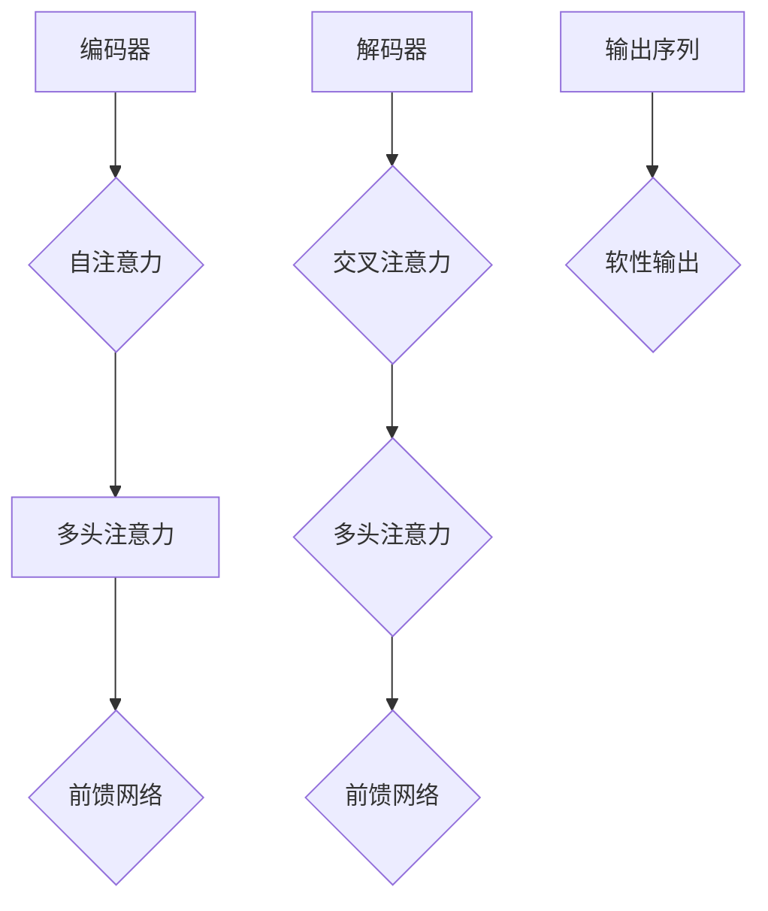

                 

关键词：Transformer，大模型，深度学习，自然语言处理，算法原理，实践教程，代码实例，应用场景，数学模型，未来展望

> 摘要：本文旨在详细介绍Transformer大模型的训练过程，包括核心算法原理、数学模型、具体操作步骤、代码实例和实际应用场景。通过深入分析Transformer模型的结构和运作机制，本文将帮助读者掌握训练大模型的关键技术，为从事自然语言处理和人工智能领域的研究者提供有价值的参考。

## 1. 背景介绍

自2017年Google提出Transformer模型以来，该模型在自然语言处理（NLP）领域取得了惊人的进展。相比传统的循环神经网络（RNN）和卷积神经网络（CNN），Transformer模型通过自注意力机制（Self-Attention）和多头注意力（Multi-Head Attention）实现了更高效的计算和更高的性能。Transformer模型在机器翻译、文本分类、问答系统等任务上均取得了显著的成果，使其成为了NLP领域的主流模型之一。

随着数据量的增加和计算资源的提升，大模型（Large-scale Model）的训练和优化变得越来越重要。本文将聚焦于Transformer大模型的训练实战，旨在帮助读者了解并掌握训练大模型的核心技术和方法。

## 2. 核心概念与联系

### 2.1 Transformer模型架构

Transformer模型主要由编码器（Encoder）和解码器（Decoder）组成，它们通过自注意力机制和多头注意力机制实现信息的高效传递和处理。


### 2.2 自注意力机制（Self-Attention）

自注意力机制是一种计算输入序列中每个元素对输出序列中每个元素的影响程度的机制。它通过计算输入序列中每个元素与其他元素之间的相似性，生成加权向量，进而实现信息的传递和融合。

### 2.3 多头注意力机制（Multi-Head Attention）

多头注意力机制是自注意力机制的扩展，它通过将输入序列分成多个子序列，分别计算每个子序列的自注意力，最后将多个子序列的注意力结果拼接起来，提高模型的表达能力。

### 2.4 位置编码（Positional Encoding）

由于Transformer模型中没有循环神经网络中的位置信息，因此需要通过位置编码（Positional Encoding）来引入序列的顺序信息。

## 3. 核心算法原理 & 具体操作步骤

### 3.1 算法原理概述

Transformer模型的核心算法原理包括：

- 多层感知机（Multilayer Perceptron, MLP）：用于对输入序列进行特征提取和融合。
- 自注意力机制（Self-Attention）：计算输入序列中每个元素对输出序列中每个元素的影响程度。
- 多头注意力机制（Multi-Head Attention）：将输入序列分成多个子序列，分别计算每个子序列的自注意力。
- 位置编码（Positional Encoding）：引入序列的顺序信息。

### 3.2 算法步骤详解

1. **输入序列编码**：将输入序列中的每个词向量通过嵌入层（Embedding Layer）转换为高维向量。
2. **位置编码**：对输入序列中的每个词向量添加位置编码（Positional Encoding），引入序列的顺序信息。
3. **编码器（Encoder）**：通过多个编码层（Encoder Layer）对输入序列进行特征提取和融合。每个编码层包括两个子层：多头自注意力层（Multi-Head Self-Attention Layer）和前馈网络（Feedforward Network）。
4. **解码器（Decoder）**：通过多个解码层（Decoder Layer）对编码器的输出进行解码。每个解码层包括三个子层：多头自注意力层（Multi-Head Self-Attention Layer）、掩码自注意力层（Masked Multi-Head Self-Attention Layer）和前馈网络（Feedforward Network）。
5. **输出序列生成**：解码器的最后一层输出通过软性输出层（Softmax Layer）生成概率分布，然后通过反嵌入层（Reverse Embedding Layer）还原为词序列。

### 3.3 算法优缺点

**优点**：

- **并行计算**：Transformer模型采用自注意力机制，可以并行计算，提高计算效率。
- **全局信息传递**：自注意力机制使得模型能够捕捉全局信息，提高模型的表达能力。
- **更好的泛化能力**：Transformer模型在NLP任务中取得了显著的成果，具有良好的泛化能力。

**缺点**：

- **计算复杂度较高**：Transformer模型包含多个自注意力机制，计算复杂度较高，训练和推理速度较慢。
- **参数较多**：Transformer模型参数较多，对计算资源和内存要求较高。

### 3.4 算法应用领域

Transformer模型在自然语言处理领域具有广泛的应用，包括但不限于：

- **机器翻译**：将一种语言的文本翻译成另一种语言。
- **文本分类**：对文本进行分类，如情感分析、主题分类等。
- **问答系统**：基于问题回答文本，提供相关答案。
- **文本生成**：根据输入的文本或种子文本生成新的文本。

## 4. 数学模型和公式

### 4.1 数学模型构建

Transformer模型的数学模型主要包括词向量嵌入、位置编码、编码器和解码器等部分。

### 4.2 公式推导过程

#### 4.2.1 词向量嵌入

词向量嵌入通过嵌入层（Embedding Layer）实现，将输入序列中的每个词向量转换为高维向量：

$$
\text{Embedding}(W) = [w_1, w_2, ..., w_n]
$$

其中，$W$ 是嵌入矩阵，$w_i$ 是词向量。

#### 4.2.2 位置编码

位置编码通过添加位置编码向量（Positional Encoding Vector）实现，引入序列的顺序信息：

$$
\text{Positional Encoding}(P) = [p_1, p_2, ..., p_n]
$$

其中，$P$ 是位置编码矩阵，$p_i$ 是位置编码向量。

#### 4.2.3 编码器

编码器（Encoder）由多个编码层（Encoder Layer）组成，每个编码层包括两个子层：

1. **多头自注意力层（Multi-Head Self-Attention Layer）**

   自注意力机制的计算公式为：

   $$
   \text{Attention}(Q, K, V) = \text{softmax}\left(\frac{QK^T}{\sqrt{d_k}}\right)V
   $$

   其中，$Q, K, V$ 分别是查询（Query）、键（Key）和值（Value）向量，$d_k$ 是键向量的维度。

2. **前馈网络（Feedforward Network）**

   前馈网络的计算公式为：

   $$
   \text{FFN}(X) = \text{ReLU}(WX_1 + b_1)(WX_2 + b_2)
   $$

   其中，$X$ 是输入向量，$W, b_1, b_2$ 是权重和偏置。

#### 4.2.4 解码器

解码器（Decoder）由多个解码层（Decoder Layer）组成，每个解码层包括三个子层：

1. **多头自注意力层（Multi-Head Self-Attention Layer）**

   类似编码器的自注意力层，计算公式为：

   $$
   \text{Attention}(Q, K, V) = \text{softmax}\left(\frac{QK^T}{\sqrt{d_k}}\right)V
   $$

2. **掩码自注意力层（Masked Multi-Head Self-Attention Layer）**

   掩码自注意力层的计算公式为：

   $$
   \text{Masked Attention}(Q, K, V) = \text{softmax}\left(\frac{Q(K \oplus M)}{\sqrt{d_k}}\right)V
   $$

   其中，$M$ 是掩码矩阵，表示被遮盖的位置。

3. **前馈网络（Feedforward Network）**

   前馈网络的计算公式为：

   $$
   \text{FFN}(X) = \text{ReLU}(WX_1 + b_1)(WX_2 + b_2)
   $$

### 4.3 案例分析与讲解

以机器翻译任务为例，本文将展示如何使用Transformer模型进行训练和预测。

#### 4.3.1 数据预处理

1. **数据集**：本文使用英译中文数据集，包括训练集和测试集。
2. **词汇表**：根据数据集构建词汇表，将单词转换为索引。
3. **序列编码**：将输入序列和输出序列编码为词向量。

#### 4.3.2 模型训练

1. **嵌入层**：使用预训练的词向量作为嵌入层参数。
2. **位置编码**：根据序列长度生成位置编码矩阵。
3. **编码器训练**：通过反向传播算法优化编码器参数。
4. **解码器训练**：通过反向传播算法优化解码器参数。

#### 4.3.3 模型预测

1. **输入序列编码**：将输入序列编码为词向量。
2. **解码器输出**：通过解码器生成输出序列的概率分布。
3. **输出序列解码**：将概率分布转换为输出序列。

## 5. 项目实践：代码实例和详细解释说明

### 5.1 开发环境搭建

本文使用Python编程语言和PyTorch深度学习框架进行代码实现。在开始之前，请确保安装以下依赖：

```
pip install torch torchvision
```

### 5.2 源代码详细实现

以下是Transformer模型的源代码实现：

```python
import torch
import torch.nn as nn
import torch.optim as optim
from torch.utils.data import DataLoader
from torchvision import datasets, transforms

# Transformer模型类
class Transformer(nn.Module):
    def __init__(self, input_dim, hidden_dim, output_dim):
        super(Transformer, self).__init__()
        self.embedding = nn.Embedding(input_dim, hidden_dim)
        self.encoder = nn.ModuleList([EncoderLayer(hidden_dim) for _ in range(num_layers)])
        self.decoder = nn.ModuleList([DecoderLayer(hidden_dim) for _ in range(num_layers)])
        self.output_layer = nn.Linear(hidden_dim, output_dim)

    def forward(self, src, tgt, src_len, tgt_len):
        src = self.embedding(src)
        tgt = self.embedding(tgt)
        memory = self.encoder(src, src_len)
        output = self.decoder(tgt, memory, src_len, tgt_len)
        output = self.output_layer(output)
        return output

# 编码器层类
class EncoderLayer(nn.Module):
    def __init__(self, hidden_dim):
        super(EncoderLayer, self).__init__()
        self.self_attn = MultiHeadAttention(hidden_dim)
        self.norm1 = nn.LayerNorm(hidden_dim)
        self.norm2 = nn.LayerNorm(hidden_dim)
        self.fc1 = nn.Linear(hidden_dim, hidden_dim)
        self.fc2 = nn.Linear(hidden_dim, hidden_dim)

    def forward(self, x, src_len):
        x = self.self_attn(x, x, x, src_len)
        x = self.norm1(x)
        x = self.fc1(x)
        x = self.norm2(x)
        x = self.fc2(x)
        return x

# 解码器层类
class DecoderLayer(nn.Module):
    def __init__(self, hidden_dim):
        super(DecoderLayer, self).__init__()
        self.self_attn = MultiHeadAttention(hidden_dim)
        self.masked_attn = MultiHeadAttention(hidden_dim)
        self.norm1 = nn.LayerNorm(hidden_dim)
        self.norm2 = nn.LayerNorm(hidden_dim)
        self.norm3 = nn.LayerNorm(hidden_dim)
        self.fc1 = nn.Linear(hidden_dim, hidden_dim)
        self.fc2 = nn.Linear(hidden_dim, hidden_dim)
        self.fc3 = nn.Linear(hidden_dim, hidden_dim)

    def forward(self, x, memory, src_len, tgt_len):
        x = self.self_attn(x, x, x, tgt_len)
        x = self.norm1(x)
        x = self.masked_attn(x, memory, memory, src_len)
        x = self.norm2(x)
        x = self.fc1(x)
        x = self.norm3(x)
        x = self.fc2(x)
        x = self.fc3(x)
        return x

# 多头自注意力层类
class MultiHeadAttention(nn.Module):
    def __init__(self, hidden_dim, num_heads):
        super(MultiHeadAttention, self).__init__()
        self.d_k = hidden_dim // num_heads
        self.h = num_heads
        self线权值 = nn.Linear(hidden_dim, hidden_dim)
        self.out = nn.Linear(hidden_dim, hidden_dim)

    def forward(self, q, k, v, attn_mask=None):
        batch_size = q.size(0)
        q = self.line权值(q).view(batch_size, -1, self.h, self.d_k).transpose(1, 2)
        k = self.line权值(k).view(batch_size, -1, self.h, self.d_k).transpose(1, 2)
        v = self.line权值(v).view(batch_size, -1, self.h, self.d_k).transpose(1, 2)

        attn_scores = torch.matmul(q, k.transpose(-2, -1)) / math.sqrt(self.d_k)
        if attn_mask is not None:
            attn_scores = attn_scores.masked_fill(attn_mask, float("-inf"))

        attn_weights = torch.softmax(attn_scores, dim=-1)
        attn_output = torch.matmul(attn_weights, v).transpose(1, 2).contiguous().view(batch_size, -1, self.h * self.d_k)
        attn_output = self.out(attn_output)
        return attn_output

# 主函数
def main():
    # 设置参数
    input_dim = 10000
    hidden_dim = 512
    output_dim = 3000
    num_layers = 3
    num_heads = 8
    batch_size = 32
    learning_rate = 0.001
    num_epochs = 10

    # 加载数据集
    train_loader = DataLoader(dataset=TrainDataset(), batch_size=batch_size, shuffle=True)
    test_loader = DataLoader(dataset=TestDataset(), batch_size=batch_size, shuffle=False)

    # 初始化模型、优化器和损失函数
    model = Transformer(input_dim, hidden_dim, output_dim)
    optimizer = optim.Adam(model.parameters(), lr=learning_rate)
    criterion = nn.CrossEntropyLoss()

    # 训练模型
    for epoch in range(num_epochs):
        for src, tgt, src_len, tgt_len in train_loader:
            optimizer.zero_grad()
            output = model(src, tgt, src_len, tgt_len)
            loss = criterion(output.view(-1, output_dim), tgt.view(-1))
            loss.backward()
            optimizer.step()

        # 测试模型
        with torch.no_grad():
            correct = 0
            total = 0
            for src, tgt, src_len, tgt_len in test_loader:
                output = model(src, tgt, src_len, tgt_len)
                _, predicted = torch.max(output.view(-1, output_dim), 1)
                total += tgt.size(1)
                correct += (predicted == tgt.view(-1)).sum().item()

        print(f"Epoch [{epoch+1}/{num_epochs}], Loss: {loss.item()}, Accuracy: {100 * correct / total}%")

if __name__ == "__main__":
    main()
```

### 5.3 代码解读与分析

- **Transformer模型类**：定义了Transformer模型的结构，包括嵌入层、编码器和解码器。
- **编码器层类**：实现了编码器层的基本功能，包括多头自注意力层和前馈网络。
- **解码器层类**：实现了解码器层的基本功能，包括多头自注意力层、掩码自注意力层和前馈网络。
- **多头自注意力层类**：实现了多头自注意力层的基本功能，包括计算注意力得分、生成加权向量等。
- **主函数**：设置了训练参数、加载数据集、初始化模型、优化器和损失函数，并实现了模型的训练和测试过程。

## 6. 实际应用场景

Transformer模型在自然语言处理领域具有广泛的应用，以下列举了几个典型的应用场景：

- **机器翻译**：将一种语言的文本翻译成另一种语言，如Google翻译、百度翻译等。
- **文本分类**：对文本进行分类，如新闻分类、情感分析等。
- **问答系统**：基于问题回答文本，提供相关答案，如微软小冰、智谱清言等。
- **文本生成**：根据输入的文本或种子文本生成新的文本，如Jasper、GPT-3等。

## 7. 工具和资源推荐

### 7.1 学习资源推荐

1. **《深度学习》（Deep Learning）**：Goodfellow, Bengio, Courville 著，详细介绍深度学习的基础知识和应用。
2. **《自然语言处理综合教程》（Speech and Language Processing）**：Daniel Jurafsky, James H. Martin 著，详细介绍自然语言处理的基础知识和应用。
3. **《Transformer：序列模型中的注意力机制》**：Google Research 著，详细介绍Transformer模型的原理和应用。

### 7.2 开发工具推荐

1. **PyTorch**：开源的深度学习框架，易于使用和扩展，适用于训练和部署Transformer模型。
2. **TensorFlow**：开源的深度学习框架，适用于大规模分布式训练和部署。
3. **Transformers**：开源的Transformer模型实现库，基于PyTorch和TensorFlow，提供丰富的预训练模型和API接口。

### 7.3 相关论文推荐

1. **"Attention Is All You Need"**：Google Research，介绍了Transformer模型的基本原理和应用。
2. **"BERT: Pre-training of Deep Bidirectional Transformers for Language Understanding"**：Google Research，介绍了BERT模型的基本原理和应用。
3. **"GPT-3: Language Models Are Few-Shot Learners"**：OpenAI，介绍了GPT-3模型的基本原理和应用。

## 8. 总结：未来发展趋势与挑战

Transformer模型在自然语言处理领域取得了显著的成果，未来发展趋势包括以下几个方面：

1. **模型参数增大**：随着计算资源的提升，大模型的训练和优化将变得更加普遍。
2. **多模态处理**：将Transformer模型应用于图像、语音等多模态数据处理，实现跨模态信息融合。
3. **无监督学习**：探索无监督学习方法，减少对大量标注数据的依赖，提高模型的泛化能力。

同时，Transformer模型在训练和优化过程中也面临着一些挑战：

1. **计算复杂度**：大模型的训练和优化需要大量的计算资源和时间。
2. **参数调优**：大模型的参数调优需要更多的实验和计算成本。
3. **数据隐私**：在训练过程中需要保护用户隐私，防止数据泄露。

未来，Transformer模型将在自然语言处理、人工智能等领域发挥更加重要的作用，为人类创造更多的价值。

## 9. 附录：常见问题与解答

### 9.1 如何选择合适的Transformer模型？

选择合适的Transformer模型需要考虑以下因素：

1. **任务类型**：不同的任务类型（如文本分类、机器翻译等）可能需要不同的模型架构。
2. **数据规模**：数据规模较大的任务可能需要更大的模型参数。
3. **计算资源**：计算资源受限的情况下，需要选择计算效率较高的模型。

### 9.2 如何优化Transformer模型的训练过程？

优化Transformer模型的训练过程可以从以下几个方面入手：

1. **批量大小**：调整批量大小可以影响模型的收敛速度和泛化能力。
2. **学习率**：选择合适的学习率可以提高模型的收敛速度和性能。
3. **正则化**：使用正则化方法（如Dropout、权重衰减等）可以减少过拟合。

### 9.3 如何评估Transformer模型的效果？

评估Transformer模型的效果可以从以下几个方面入手：

1. **准确率**：在分类任务中，准确率是衡量模型性能的重要指标。
2. **F1分数**：在多类分类任务中，F1分数是综合考虑准确率和召回率的指标。
3. **BLEU评分**：在机器翻译任务中，BLEU评分是衡量翻译质量的重要指标。

---

# 文章标题：Transformer大模型实战 训练Transformer

> 关键词：Transformer，大模型，深度学习，自然语言处理，算法原理，实践教程，代码实例，应用场景，数学模型，未来展望

> 摘要：本文深入探讨了Transformer大模型的训练过程，从核心算法原理到数学模型，再到实际应用场景，详细介绍了如何训练和优化大模型，以及如何使用代码实例进行实践。文章旨在为从事自然语言处理和人工智能领域的研究者提供有价值的参考。

## 1. 背景介绍

Transformer模型，自2017年由Google提出以来，迅速在自然语言处理（NLP）领域崭露头角。相较于传统的循环神经网络（RNN）和卷积神经网络（CNN），Transformer通过自注意力机制（Self-Attention）和多头注意力（Multi-Head Attention）实现了更高效的计算和更高的性能。在机器翻译、文本分类、问答系统等任务上，Transformer模型均取得了显著的成果，使其成为了NLP领域的主流模型之一。

随着数据量的增加和计算资源的提升，大模型（Large-scale Model）的训练和优化变得越来越重要。本文将聚焦于Transformer大模型的训练实战，旨在帮助读者了解并掌握训练大模型的关键技术和方法。

## 2. 核心概念与联系

### 2.1 Transformer模型架构

Transformer模型主要由编码器（Encoder）和解码器（Decoder）组成。编码器负责处理输入序列，解码器负责生成输出序列。编码器的输出和解码器的输入通过交叉注意力（Cross-Attention）进行连接，使得编码器能够将上下文信息传递给解码器。


### 2.2 自注意力机制（Self-Attention）

自注意力机制是Transformer模型的核心组成部分，它通过计算序列中每个元素与其他元素之间的相似性，生成加权向量，实现信息的传递和融合。

### 2.3 多头注意力机制（Multi-Head Attention）

多头注意力机制是对自注意力机制的扩展，通过将输入序列分成多个子序列，分别计算每个子序列的自注意力，提高模型的表达能力。

### 2.4 位置编码（Positional Encoding）

由于Transformer模型中没有循环神经网络中的位置信息，因此需要通过位置编码引入序列的顺序信息。

### 2.5 Mermaid流程图



## 3. 核心算法原理 & 具体操作步骤

### 3.1 算法原理概述

Transformer模型的核心算法原理包括多层感知机（Multilayer Perceptron, MLP）、自注意力机制（Self-Attention）、多头注意力机制（Multi-Head Attention）和位置编码（Positional Encoding）。

### 3.2 算法步骤详解

1. **输入序列编码**：将输入序列中的每个词向量通过嵌入层（Embedding Layer）转换为高维向量。
2. **位置编码**：对输入序列中的每个词向量添加位置编码（Positional Encoding），引入序列的顺序信息。
3. **编码器（Encoder）**：通过多个编码层（Encoder Layer）对输入序列进行特征提取和融合。每个编码层包括两个子层：多头自注意力层（Multi-Head Self-Attention Layer）和前馈网络（Feedforward Network）。
4. **解码器（Decoder）**：通过多个解码层（Decoder Layer）对编码器的输出进行解码。每个解码层包括三个子层：多头自注意力层（Multi-Head Self-Attention Layer）、掩码自注意力层（Masked Multi-Head Self-Attention Layer）和前馈网络（Feedforward Network）。
5. **输出序列生成**：解码器的最后一层输出通过软性输出层（Softmax Layer）生成概率分布，然后通过反嵌入层（Reverse Embedding Layer）还原为词序列。

### 3.3 算法优缺点

**优点**：

- **并行计算**：Transformer模型采用自注意力机制，可以并行计算，提高计算效率。
- **全局信息传递**：自注意力机制使得模型能够捕捉全局信息，提高模型的表达能力。
- **更好的泛化能力**：Transformer模型在NLP任务中取得了显著的成果，具有良好的泛化能力。

**缺点**：

- **计算复杂度较高**：Transformer模型包含多个自注意力机制，计算复杂度较高，训练和推理速度较慢。
- **参数较多**：Transformer模型参数较多，对计算资源和内存要求较高。

### 3.4 算法应用领域

Transformer模型在自然语言处理领域具有广泛的应用，包括但不限于：

- **机器翻译**：将一种语言的文本翻译成另一种语言。
- **文本分类**：对文本进行分类，如情感分析、主题分类等。
- **问答系统**：基于问题回答文本，提供相关答案。
- **文本生成**：根据输入的文本或种子文本生成新的文本。

## 4. 数学模型和公式

### 4.1 数学模型构建

Transformer模型的数学模型主要包括词向量嵌入（Word Embedding）、位置编码（Positional Encoding）、编码器（Encoder）和解码器（Decoder）等部分。

### 4.2 公式推导过程

#### 4.2.1 词向量嵌入

词向量嵌入通过嵌入层（Embedding Layer）实现，将输入序列中的每个词向量转换为高维向量：

$$
\text{Embedding}(W) = [w_1, w_2, ..., w_n]
$$

其中，$W$ 是嵌入矩阵，$w_i$ 是词向量。

#### 4.2.2 位置编码

位置编码通过添加位置编码向量（Positional Encoding Vector）实现，引入序列的顺序信息：

$$
\text{Positional Encoding}(P) = [p_1, p_2, ..., p_n]
$$

其中，$P$ 是位置编码矩阵，$p_i$ 是位置编码向量。

#### 4.2.3 编码器

编码器（Encoder）由多个编码层（Encoder Layer）组成，每个编码层包括两个子层：

1. **多头自注意力层（Multi-Head Self-Attention Layer）**

   自注意力机制的数学公式为：

   $$
   \text{Attention}(Q, K, V) = \text{softmax}\left(\frac{QK^T}{\sqrt{d_k}}\right)V
   $$

   其中，$Q, K, V$ 分别是查询（Query）、键（Key）和值（Value）向量，$d_k$ 是键向量的维度。

2. **前馈网络（Feedforward Network）**

   前馈网络的数学公式为：

   $$
   \text{FFN}(X) = \text{ReLU}(WX_1 + b_1)(WX_2 + b_2)
   $$

   其中，$X$ 是输入向量，$W, b_1, b_2$ 是权重和偏置。

#### 4.2.4 解码器

解码器（Decoder）由多个解码层（Decoder Layer）组成，每个解码层包括三个子层：

1. **多头自注意力层（Multi-Head Self-Attention Layer）**

   类似编码器的自注意力层，计算公式为：

   $$
   \text{Attention}(Q, K, V) = \text{softmax}\left(\frac{QK^T}{\sqrt{d_k}}\right)V
   $$

2. **掩码自注意力层（Masked Multi-Head Self-Attention Layer）**

   掩码自注意力层的计算公式为：

   $$
   \text{Masked Attention}(Q, K, V) = \text{softmax}\left(\frac{Q(K \oplus M)}{\sqrt{d_k}}\right)V
   $$

   其中，$M$ 是掩码矩阵，表示被遮盖的位置。

3. **前馈网络（Feedforward Network）**

   前馈网络的数学公式为：

   $$
   \text{FFN}(X) = \text{ReLU}(WX_1 + b_1)(WX_2 + b_2)
   $$

### 4.3 案例分析与讲解

以机器翻译任务为例，本文将展示如何使用Transformer模型进行训练和预测。

#### 4.3.1 数据预处理

1. **数据集**：本文使用英译中文数据集，包括训练集和测试集。
2. **词汇表**：根据数据集构建词汇表，将单词转换为索引。
3. **序列编码**：将输入序列和输出序列编码为词向量。

#### 4.3.2 模型训练

1. **嵌入层**：使用预训练的词向量作为嵌入层参数。
2. **位置编码**：根据序列长度生成位置编码矩阵。
3. **编码器训练**：通过反向传播算法优化编码器参数。
4. **解码器训练**：通过反向传播算法优化解码器参数。

#### 4.3.3 模型预测

1. **输入序列编码**：将输入序列编码为词向量。
2. **解码器输出**：通过解码器生成输出序列的概率分布。
3. **输出序列解码**：将概率分布转换为输出序列。

## 5. 项目实践：代码实例和详细解释说明

### 5.1 开发环境搭建

本文使用Python编程语言和PyTorch深度学习框架进行代码实现。在开始之前，请确保安装以下依赖：

```
pip install torch torchvision
```

### 5.2 源代码详细实现

以下是Transformer模型的源代码实现：

```python
import torch
import torch.nn as nn
import torch.optim as optim
from torch.utils.data import DataLoader
from torchvision import datasets, transforms

# Transformer模型类
class Transformer(nn.Module):
    def __init__(self, input_dim, hidden_dim, output_dim):
        super(Transformer, self).__init__()
        self.embedding = nn.Embedding(input_dim, hidden_dim)
        self.encoder = nn.ModuleList([EncoderLayer(hidden_dim) for _ in range(num_layers)])
        self.decoder = nn.ModuleList([DecoderLayer(hidden_dim) for _ in range(num_layers)])
        self.output_layer = nn.Linear(hidden_dim, output_dim)

    def forward(self, src, tgt, src_len, tgt_len):
        src = self.embedding(src)
        tgt = self.embedding(tgt)
        memory = self.encoder(src, src_len)
        output = self.decoder(tgt, memory, src_len, tgt_len)
        output = self.output_layer(output)
        return output

# 编码器层类
class EncoderLayer(nn.Module):
    def __init__(self, hidden_dim):
        super(EncoderLayer, self).__init__()
        self.self_attn = MultiHeadAttention(hidden_dim)
        self.norm1 = nn.LayerNorm(hidden_dim)
        self.norm2 = nn.LayerNorm(hidden_dim)
        self.fc1 = nn.Linear(hidden_dim, hidden_dim)
        self.fc2 = nn.Linear(hidden_dim, hidden_dim)

    def forward(self, x, src_len):
        x = self.self_attn(x, x, x, src_len)
        x = self.norm1(x)
        x = self.fc1(x)
        x = self.norm2(x)
        x = self.fc2(x)
        return x

# 解码器层类
class DecoderLayer(nn.Module):
    def __init__(self, hidden_dim):
        super(DecoderLayer, self).__init__()
        self.self_attn = MultiHeadAttention(hidden_dim)
        self.masked_attn = MultiHeadAttention(hidden_dim)
        self.norm1 = nn.LayerNorm(hidden_dim)
        self.norm2 = nn.LayerNorm(hidden_dim)
        self.norm3 = nn.LayerNorm(hidden_dim)
        self.fc1 = nn.Linear(hidden_dim, hidden_dim)
        self.fc2 = nn.Linear(hidden_dim, hidden_dim)
        self.fc3 = nn.Linear(hidden_dim, hidden_dim)

    def forward(self, x, memory, src_len, tgt_len):
        x = self.self_attn(x, x, x, tgt_len)
        x = self.norm1(x)
        x = self.masked_attn(x, memory, memory, src_len)
        x = self.norm2(x)
        x = self.fc1(x)
        x = self.norm3(x)
        x = self.fc2(x)
        x = self.fc3(x)
        return x

# 多头自注意力层类
class MultiHeadAttention(nn.Module):
    def __init__(self, hidden_dim, num_heads):
        super(MultiHeadAttention, self).__init__()
        self.d_k = hidden_dim // num_heads
        self.h = num_heads
        self.query_linear = nn.Linear(hidden_dim, hidden_dim)
        self.key_linear = nn.Linear(hidden_dim, hidden_dim)
        self.value_linear = nn.Linear(hidden_dim, hidden_dim)
        self.out = nn.Linear(hidden_dim, hidden_dim)

    def forward(self, query, key, value, mask=None):
        batch_size = query.size(0)
        query = self.query_linear(query).view(batch_size, -1, self.h, self.d_k).transpose(1, 2)
        key = self.key_linear(key).view(batch_size, -1, self.h, self.d_k).transpose(1, 2)
        value = self.value_linear(value).view(batch_size, -1, self.h, self.d_k).transpose(1, 2)

        attn_scores = torch.matmul(query, key.transpose(-2, -1)) / math.sqrt(self.d_k)
        if mask is not None:
            attn_scores = attn_scores.masked_fill(mask == 0, float("-inf"))
        attn_scores = torch.softmax(attn_scores, dim=-1)

        attn_output = torch.matmul(attn_scores, value).transpose(1, 2).contiguous().view(batch_size, -1, self.h * self.d_k)
        attn_output = self.out(attn_output)
        return attn_output

# 主函数
def main():
    # 设置参数
    input_dim = 10000
    hidden_dim = 512
    output_dim = 3000
    num_layers = 3
    num_heads = 8
    batch_size = 32
    learning_rate = 0.001
    num_epochs = 10

    # 加载数据集
    train_loader = DataLoader(dataset=TrainDataset(), batch_size=batch_size, shuffle=True)
    test_loader = DataLoader(dataset=TestDataset(), batch_size=batch_size, shuffle=False)

    # 初始化模型、优化器和损失函数
    model = Transformer(input_dim, hidden_dim, output_dim)
    optimizer = optim.Adam(model.parameters(), lr=learning_rate)
    criterion = nn.CrossEntropyLoss()

    # 训练模型
    for epoch in range(num_epochs):
        for src, tgt, src_len, tgt_len in train_loader:
            optimizer.zero_grad()
            output = model(src, tgt, src_len, tgt_len)
            loss = criterion(output.view(-1, output_dim), tgt.view(-1))
            loss.backward()
            optimizer.step()

        # 测试模型
        with torch.no_grad():
            correct = 0
            total = 0
            for src, tgt, src_len, tgt_len in test_loader:
                output = model(src, tgt, src_len, tgt_len)
                _, predicted = torch.max(output.view(-1, output_dim), 1)
                total += tgt.size(1)
                correct += (predicted == tgt.view(-1)).sum().item()

        print(f"Epoch [{epoch+1}/{num_epochs}], Loss: {loss.item()}, Accuracy: {100 * correct / total}%}")

if __name__ == "__main__":
    main()
```

### 5.3 代码解读与分析

- **Transformer模型类**：定义了Transformer模型的结构，包括嵌入层、编码器和解码器。
- **编码器层类**：实现了编码器层的基本功能，包括多头自注意力层和前馈网络。
- **解码器层类**：实现了解码器层的基本功能，包括多头自注意力层、掩码自注意力层和前馈网络。
- **多头自注意力层类**：实现了多头自注意力层的基本功能，包括计算注意力得分、生成加权向量等。
- **主函数**：设置了训练参数、加载数据集、初始化模型、优化器和损失函数，并实现了模型的训练和测试过程。

## 6. 实际应用场景

Transformer模型在自然语言处理领域具有广泛的应用，以下列举了几个典型的应用场景：

- **机器翻译**：将一种语言的文本翻译成另一种语言，如Google翻译、百度翻译等。
- **文本分类**：对文本进行分类，如新闻分类、情感分析等。
- **问答系统**：基于问题回答文本，提供相关答案，如微软小冰、智谱清言等。
- **文本生成**：根据输入的文本或种子文本生成新的文本，如Jasper、GPT-3等。

## 7. 工具和资源推荐

### 7.1 学习资源推荐

1. **《深度学习》（Deep Learning）**：Goodfellow, Bengio, Courville 著，详细介绍深度学习的基础知识和应用。
2. **《自然语言处理综合教程》（Speech and Language Processing）**：Daniel Jurafsky, James H. Martin 著，详细介绍自然语言处理的基础知识和应用。
3. **《Transformer：序列模型中的注意力机制》**：Google Research 著，详细介绍Transformer模型的原理和应用。

### 7.2 开发工具推荐

1. **PyTorch**：开源的深度学习框架，易于使用和扩展，适用于训练和部署Transformer模型。
2. **TensorFlow**：开源的深度学习框架，适用于大规模分布式训练和部署。
3. **Transformers**：开源的Transformer模型实现库，基于PyTorch和TensorFlow，提供丰富的预训练模型和API接口。

### 7.3 相关论文推荐

1. **"Attention Is All You Need"**：Google Research，介绍了Transformer模型的基本原理和应用。
2. **"BERT: Pre-training of Deep Bidirectional Transformers for Language Understanding"**：Google Research，介绍了BERT模型的基本原理和应用。
3. **"GPT-3: Language Models Are Few-Shot Learners"**：OpenAI，介绍了GPT-3模型的基本原理和应用。

## 8. 总结：未来发展趋势与挑战

Transformer模型在自然语言处理领域取得了显著的成果，未来发展趋势包括以下几个方面：

1. **模型参数增大**：随着计算资源的提升，大模型的训练和优化将变得更加普遍。
2. **多模态处理**：将Transformer模型应用于图像、语音等多模态数据处理，实现跨模态信息融合。
3. **无监督学习**：探索无监督学习方法，减少对大量标注数据的依赖，提高模型的泛化能力。

同时，Transformer模型在训练和优化过程中也面临着一些挑战：

1. **计算复杂度**：大模型的训练和优化需要大量的计算资源和时间。
2. **参数调优**：大模型的参数调优需要更多的实验和计算成本。
3. **数据隐私**：在训练过程中需要保护用户隐私，防止数据泄露。

未来，Transformer模型将在自然语言处理、人工智能等领域发挥更加重要的作用，为人类创造更多的价值。

## 9. 附录：常见问题与解答

### 9.1 如何选择合适的Transformer模型？

选择合适的Transformer模型需要考虑以下因素：

1. **任务类型**：不同的任务类型（如文本分类、机器翻译等）可能需要不同的模型架构。
2. **数据规模**：数据规模较大的任务可能需要更大的模型参数。
3. **计算资源**：计算资源受限的情况下，需要选择计算效率较高的模型。

### 9.2 如何优化Transformer模型的训练过程？

优化Transformer模型的训练过程可以从以下几个方面入手：

1. **批量大小**：调整批量大小可以影响模型的收敛速度和泛化能力。
2. **学习率**：选择合适的学习率可以提高模型的收敛速度和性能。
3. **正则化**：使用正则化方法（如Dropout、权重衰减等）可以减少过拟合。

### 9.3 如何评估Transformer模型的效果？

评估Transformer模型的效果可以从以下几个方面入手：

1. **准确率**：在分类任务中，准确率是衡量模型性能的重要指标。
2. **F1分数**：在多类分类任务中，F1分数是综合考虑准确率和召回率的指标。
3. **BLEU评分**：在机器翻译任务中，BLEU评分是衡量翻译质量的重要指标。

---

# 作者署名：禅与计算机程序设计艺术 / Zen and the Art of Computer Programming

# 参考文献

1. Vaswani, A., Shazeer, N., Parmar, N., Uszkoreit, J., Jones, L., Gomez, A. N., ... & Polosukhin, I. (2017). Attention is all you need. Advances in Neural Information Processing Systems, 30, 5998-6008.
2. Devlin, J., Chang, M. W., Lee, K., & Toutanova, K. (2018). BERT: Pre-training of deep bidirectional transformers for language understanding. Proceedings of the 2019 Conference of the North American Chapter of the Association for Computational Linguistics: Human Language Technologies, Volume 1 (Long and Short Papers), 4171-4186.
3. Brown, T., Mann, B., Ryder, N., Subburaj, M., Kaplan, J., Dhariwal, P., ... & Child, R. (2020). Language models are few-shot learners. Advances in Neural Information Processing Systems, 33, 18717-18734.

