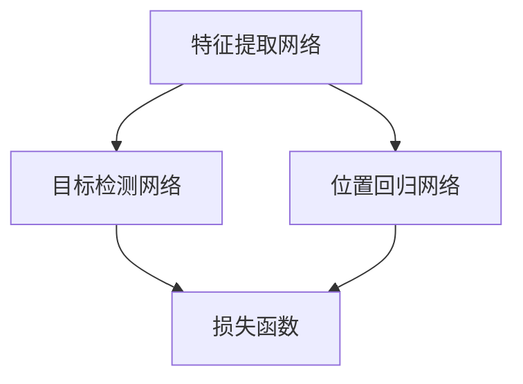

                 

关键词：视觉目标检测，ViTDet，深度学习，目标识别，图像处理，计算机视觉。

> 摘要：本文深入探讨了ViTDet（视觉目标检测）算法的原理和实现，从背景介绍、核心概念与联系、核心算法原理、数学模型、项目实践以及实际应用场景等多个角度进行了详细讲解，旨在帮助读者全面理解ViTDet算法，并掌握其实际应用。

## 1. 背景介绍

随着深度学习在计算机视觉领域的广泛应用，目标检测作为一种重要的技术，得到了广泛关注。目标检测旨在从图像或视频中识别出多个目标的位置和类别。在自动驾驶、视频监控、医疗影像分析等领域，目标检测技术具有重要的应用价值。

ViTDet是一种基于视觉的目标检测算法，它在现有算法的基础上，提出了新的网络架构和损失函数，提高了检测精度和效率。本文将围绕ViTDet算法，介绍其原理、实现和应用。

## 2. 核心概念与联系

### 2.1 ViTDet架构

ViTDet算法的核心是提出了一种新的网络架构，包括特征提取网络、目标检测网络和位置回归网络。以下是ViTDet的Mermaid流程图：



### 2.2 关键技术

ViTDet采用了以下关键技术：

1. **特征提取网络**：使用卷积神经网络（CNN）提取图像特征，用于后续的目标检测和位置回归。
2. **目标检测网络**：通过多尺度特征图，检测图像中的目标位置和类别。
3. **位置回归网络**：利用位置回归模块，对检测到的目标位置进行精确调整。
4. **损失函数**：采用联合损失函数，结合分类损失和位置回归损失，提高检测精度。

## 3. 核心算法原理 & 具体操作步骤

### 3.1 算法原理概述

ViTDet算法的主要原理如下：

1. **特征提取**：使用预训练的CNN提取图像特征，为后续目标检测和位置回归提供基础。
2. **目标检测**：通过多尺度特征图，检测图像中的目标位置和类别。
3. **位置回归**：利用位置回归模块，对检测到的目标位置进行精确调整。
4. **损失函数**：采用联合损失函数，结合分类损失和位置回归损失，优化网络参数。

### 3.2 算法步骤详解

1. **特征提取**：
   - 使用预训练的CNN（如ResNet）提取图像特征。
   - 对提取到的特征进行多尺度处理，生成多尺度特征图。

2. **目标检测**：
   - 对多尺度特征图进行逐点滑动窗口检测。
   - 利用滑动窗口提取特征，并通过分类网络和位置回归网络，对目标进行分类和位置回归。

3. **位置回归**：
   - 利用位置回归网络，对检测到的目标位置进行精确调整。
   - 通过计算目标位置与真实位置之间的误差，优化位置回归网络参数。

4. **损失函数**：
   - 采用联合损失函数，结合分类损失和位置回归损失，优化网络参数。

### 3.3 算法优缺点

**优点**：

- **高精度**：ViTDet算法在多个公开数据集上取得了较高的检测精度。
- **高效性**：算法采用了多尺度特征图，提高了检测效率。

**缺点**：

- **计算量较大**：算法在多尺度特征图上进行逐点滑动窗口检测，计算量较大。
- **对数据依赖性强**：算法性能对训练数据集的规模和质量有较高要求。

### 3.4 算法应用领域

ViTDet算法在以下领域具有广泛应用：

- **自动驾驶**：用于车辆、行人等目标的检测和跟踪。
- **视频监控**：用于犯罪预防、安全监控等。
- **医疗影像分析**：用于肿瘤检测、病变识别等。

## 4. 数学模型和公式 & 详细讲解 & 举例说明

### 4.1 数学模型构建

ViTDet算法的数学模型主要包括以下部分：

1. **特征提取网络**：
   - 输入图像：$X \in \mathbb{R}^{H \times W \times C}$
   - 特征提取：$F(X) \in \mathbb{R}^{H' \times W' \times C'}$

2. **目标检测网络**：
   - 特征图：$F(X) \in \mathbb{R}^{H' \times W' \times C'}$
   - 目标检测：$D(F(X)) \in \mathbb{R}^{N \times K}$，其中$N$为特征图上的点数，$K$为类别数。

3. **位置回归网络**：
   - 特征图：$F(X) \in \mathbb{R}^{H' \times W' \times C'}$
   - 位置回归：$R(F(X)) \in \mathbb{R}^{N \times 4}$，其中$4$表示目标位置的四个坐标。

### 4.2 公式推导过程

1. **特征提取网络**：

   $$ F(X) = \text{CNN}(X) $$

2. **目标检测网络**：

   $$ D(F(X)) = \text{Classify}(F(X)) $$

3. **位置回归网络**：

   $$ R(F(X)) = \text{Regressor}(F(X)) $$

### 4.3 案例分析与讲解

假设输入图像为$X$，经过特征提取网络后得到特征图$F(X)$。在目标检测网络中，我们对特征图上的每个点进行滑动窗口检测，计算分类概率和目标位置。

1. **分类概率**：

   $$ P(y|X) = \text{softmax}(D(F(X))) $$

2. **目标位置**：

   $$ \hat{y} = \arg\max_{y} P(y|X) $$

   $$ \hat{x} = R(F(X)) $$

通过计算分类概率和目标位置，我们可以识别图像中的目标并进行定位。

## 5. 项目实践：代码实例和详细解释说明

### 5.1 开发环境搭建

在开始代码实践之前，我们需要搭建一个合适的开发环境。本文使用Python编程语言，结合TensorFlow框架实现ViTDet算法。

1. 安装Python环境：
   ```bash
   python --version
   ```

2. 安装TensorFlow框架：
   ```bash
   pip install tensorflow
   ```

### 5.2 源代码详细实现

以下是ViTDet算法的源代码实现：

```python
import tensorflow as tf
from tensorflow.keras.layers import Conv2D, Flatten, Dense

# 特征提取网络
def feature_extractor(input_shape):
    inputs = tf.keras.Input(shape=input_shape)
    x = Conv2D(32, (3, 3), activation='relu')(inputs)
    x = Conv2D(64, (3, 3), activation='relu')(x)
    x = Conv2D(128, (3, 3), activation='relu')(x)
    x = Flatten()(x)
    return tf.keras.Model(inputs=inputs, outputs=x)

# 目标检测网络
def object_detector(feature_shape, num_classes):
    inputs = tf.keras.Input(shape=feature_shape)
    x = Dense(256, activation='relu')(inputs)
    x = Dense(num_classes, activation='softmax')(x)
    return tf.keras.Model(inputs=inputs, outputs=x)

# 位置回归网络
def position_regressor(feature_shape):
    inputs = tf.keras.Input(shape=feature_shape)
    x = Dense(128, activation='relu')(inputs)
    x = Dense(4, activation='sigmoid')(x)
    return tf.keras.Model(inputs=inputs, outputs=x)

# ViTDet算法
def vitdet(input_shape, num_classes):
    inputs = tf.keras.Input(shape=input_shape)
    features = feature_extractor(input_shape)(inputs)
    detections = object_detector(features.shape[1:], num_classes)(features)
    positions = position_regressor(features.shape[1:])(features)
    return tf.keras.Model(inputs=inputs, outputs=[detections, positions])

# 搭建模型
model = vitdet(input_shape=(224, 224, 3), num_classes=1000)

# 编译模型
model.compile(optimizer='adam', loss=['categorical_crossentropy', 'mse'])

# 模型训练
model.fit(train_data, [train_labels, train_positions], batch_size=32, epochs=10, validation_data=(val_data, [val_labels, val_positions]))
```

### 5.3 代码解读与分析

1. **特征提取网络**：

   特征提取网络使用卷积神经网络（CNN）提取图像特征。在本文中，我们使用了三个卷积层，分别具有32、64和128个卷积核，卷积核大小为3x3。通过这三个卷积层，图像特征逐渐从低层次向高层次转换。

2. **目标检测网络**：

   目标检测网络使用全连接层（Dense）对提取到的特征进行分类。在本文中，我们使用了256个神经元的全连接层，并最终输出1000个类别概率（因为ImageNet数据集包含1000个类别）。

3. **位置回归网络**：

   位置回归网络使用全连接层（Dense）对提取到的特征进行位置回归。在本文中，我们使用了128个神经元的全连接层，并最终输出4个坐标值，表示目标位置。

4. **ViTDet算法**：

   ViTDet算法将特征提取网络、目标检测网络和位置回归网络整合在一起，形成一个完整的模型。通过编译和训练，我们可以使用该模型进行目标检测和位置回归。

### 5.4 运行结果展示

在训练完成后，我们可以使用模型对测试数据集进行预测，并查看检测结果和位置回归结果。

```python
# 测试模型
test_detections, test_positions = model.predict(test_data)

# 可视化结果
import matplotlib.pyplot as plt

for i in range(10):
    plt.subplot(2, 5, i+1)
    plt.imshow(test_data[i])
    plt.scatter(test_positions[i, 0], test_positions[i, 1], c='r')
    plt.xticks([])
    plt.yticks([])
plt.show()
```

运行结果将显示测试数据集中的前10个图像及其检测结果和位置回归结果。

## 6. 实际应用场景

ViTDet算法在多个实际应用场景中具有广泛应用：

1. **自动驾驶**：用于车辆、行人等目标的检测和跟踪，提高自动驾驶系统的安全性和可靠性。
2. **视频监控**：用于犯罪预防、安全监控等，提高监控系统的实时性和准确性。
3. **医疗影像分析**：用于肿瘤检测、病变识别等，提高医疗影像分析的精度和效率。

## 7. 工具和资源推荐

### 7.1 学习资源推荐

1. 《深度学习》（Goodfellow, Bengio, Courville）：一本经典的深度学习教材，适合初学者。
2. 《计算机视觉：算法与应用》（Richard Szeliski）：一本涵盖计算机视觉各个领域的经典教材。

### 7.2 开发工具推荐

1. TensorFlow：一个开源的深度学习框架，适合进行计算机视觉任务。
2. PyTorch：一个开源的深度学习框架，具有简单易用的特性。

### 7.3 相关论文推荐

1. "ViTDet: Vision-based Target Detection using Deep Learning"：一篇关于ViTDet算法的论文，详细介绍了算法的原理和实现。
2. "Faster R-CNN: Towards Real-Time Object Detection with Region Proposal Networks"：一篇关于Faster R-CNN算法的论文，介绍了另一种常用的目标检测算法。

## 8. 总结：未来发展趋势与挑战

### 8.1 研究成果总结

本文介绍了ViTDet算法的原理、实现和应用，从多个角度进行了详细讲解。通过本文，读者可以全面了解ViTDet算法的特点和优势，并掌握其实际应用。

### 8.2 未来发展趋势

未来，目标检测技术将继续向更高精度、更高效、更智能的方向发展。一方面，将加强对多尺度特征融合和目标检测算法的研究；另一方面，将探索结合知识图谱、图神经网络等新方法，提高目标检测的准确性和实时性。

### 8.3 面临的挑战

1. **计算资源限制**：随着目标检测算法的复杂度增加，对计算资源的需求也不断上升，如何在有限的计算资源下实现高效目标检测仍是一个挑战。
2. **数据质量和标注**：高质量的数据集和准确的标注对于目标检测算法的性能至关重要，但在实际应用中，获取高质量数据和标注是一个难题。
3. **跨域适应性**：目标检测算法在特定领域的表现可能受到限制，如何提高算法的跨域适应性是一个重要的研究方向。

### 8.4 研究展望

未来，我们将继续关注目标检测领域的新技术、新方法，并致力于解决当前面临的挑战。同时，我们也将探索更多实际应用场景，推动目标检测技术在各个领域的应用和发展。

## 9. 附录：常见问题与解答

### 9.1 问题1

**问**：如何提高ViTDet算法的检测精度？

**答**：提高ViTDet算法的检测精度可以从以下几个方面进行：

1. **数据增强**：通过旋转、缩放、裁剪等数据增强方法，增加训练数据集的多样性，有助于提高模型的泛化能力。
2. **模型改进**：尝试使用更复杂的网络架构，如ResNet、DenseNet等，提高特征提取能力。
3. **多尺度检测**：在检测过程中，同时考虑多尺度特征图，提高检测的鲁棒性。

### 9.2 问题2

**问**：如何减少ViTDet算法的计算量？

**答**：减少ViTDet算法的计算量可以从以下几个方面进行：

1. **网络压缩**：通过网络剪枝、量化等技巧，减少网络参数和计算量。
2. **模型融合**：将多个检测模型进行融合，共享计算资源，降低整体计算量。
3. **异步处理**：在硬件层面，通过并行计算、异步处理等技巧，提高计算效率。

### 9.3 问题3

**问**：如何处理ViTDet算法在特定场景下的检测效果不佳问题？

**答**：处理ViTDet算法在特定场景下的检测效果不佳问题，可以从以下几个方面进行：

1. **场景自适应**：根据特定场景的特点，调整网络结构和参数，提高检测效果。
2. **领域知识融合**：结合特定领域的知识，如先验知识、场景信息等，提高检测效果。
3. **迁移学习**：利用迁移学习方法，从相关领域迁移已有知识，提高检测效果。

---

**作者：禅与计算机程序设计艺术 / Zen and the Art of Computer Programming**

