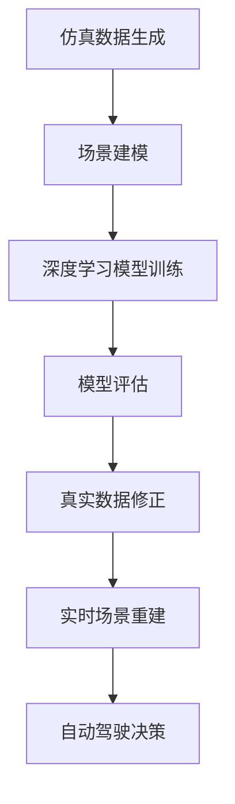

                 

作为一位世界级人工智能专家，本文将深入探讨Wayve和comme.ai公司在自动驾驶领域所采用的一种前沿技术——基于仿真和真实数据的场景重建方法。本文旨在通过详细的阐述和分析，揭示这一方法的核心原理、技术细节以及在实际应用中的表现。

## 关键词

- 自动驾驶
- 场景重建
- 仿真数据
- 真实数据
- 机器学习
- Wayve
- comme.ai

## 摘要

自动驾驶技术的发展正日益受到广泛关注，而场景重建作为自动驾驶系统的核心组成部分，其准确性直接影响到车辆的感知和决策能力。本文介绍了Wayve和comme.ai公司在自动驾驶场景重建方面所采用的方法，包括利用仿真数据生成虚拟场景以及结合真实数据进行场景修正和优化。通过深入分析，本文探讨了这些方法的优势、挑战以及未来发展方向。

### 1. 背景介绍

自动驾驶技术被认为是未来交通方式的革命性变革，它能够显著提高道路安全、减少拥堵并降低环境负担。然而，自动驾驶系统的核心——感知和决策——需要高度依赖对周围环境的准确理解和建模。场景重建作为这一过程中的关键步骤，其主要目标是构建一个全面、精确且动态变化的虚拟环境，以便自动驾驶系统能够实时对其进行感知和分析。

在自动驾驶领域，传统的场景重建方法主要依赖于激光雷达、摄像头和GPS等传感器收集的数据。这些数据虽然能够提供丰富的环境信息，但在复杂多变的现实场景中，仍存在数据缺失、噪声干扰等问题，从而影响到场景重建的准确性和可靠性。

为了解决这一问题，Wayve和comme.ai等公司开始探索新的方法——基于仿真和真实数据的场景重建。这种方法不仅能够通过仿真数据生成丰富的虚拟场景，还能够利用真实数据进行修正和优化，从而提高场景重建的准确性和实时性。

### 2. 核心概念与联系

为了更好地理解基于仿真和真实数据的场景重建方法，我们需要首先了解几个核心概念：仿真数据、真实数据、场景建模和深度学习。

#### 2.1 仿真数据

仿真数据是通过计算机模拟生成的虚拟场景数据。这些数据可以包括道路、车辆、行人、交通信号等元素，并且可以根据不同的需求进行定制。仿真数据的主要优势在于其可控性和多样性，通过调整参数，可以生成各种复杂程度的场景，从而为自动驾驶系统的测试和训练提供丰富的样本。

#### 2.2 真实数据

真实数据是实际驾驶过程中收集到的场景数据。这些数据通常通过车载传感器实时获取，包括激光雷达、摄像头、GPS、IMU等。真实数据的主要优势在于其真实性和全面性，能够反映现实世界中的各种复杂情况和变化。

#### 2.3 场景建模

场景建模是将仿真数据和真实数据转化为自动驾驶系统可理解的模型的过程。这通常涉及到对场景数据的预处理、特征提取和模型训练等步骤。场景建模的目标是建立一个能够准确反映现实环境的虚拟场景，以便自动驾驶系统可以对其进行有效的感知和分析。

#### 2.4 深度学习

深度学习是近年来在人工智能领域取得重大突破的技术，它通过多层神经网络对数据进行学习和建模。在场景重建中，深度学习可以用于处理大规模、高维度的数据，并从中提取有用的特征，从而提高场景重建的准确性和效率。

#### 2.5 Mermaid 流程图

以下是一个基于仿真和真实数据的场景重建方法的 Mermaid 流程图：



### 3. 核心算法原理 & 具体操作步骤

#### 3.1 算法原理概述

基于仿真和真实数据的场景重建方法主要分为三个步骤：仿真数据生成、场景建模和深度学习模型训练。

1. **仿真数据生成**：通过计算机模拟生成各种虚拟场景，包括道路、车辆、行人等元素，并根据实际需求调整参数。
2. **场景建模**：将仿真数据和真实数据进行预处理，提取关键特征，并利用深度学习模型进行建模。
3. **深度学习模型训练**：利用大量的仿真和真实数据对深度学习模型进行训练，以提高模型的准确性和实时性。

#### 3.2 算法步骤详解

1. **仿真数据生成**：

   仿真数据生成的主要目的是创建一个能够反映实际驾驶环境的虚拟场景。这个过程通常包括以下步骤：

   - **场景元素定义**：定义场景中的各种元素，如道路、车辆、行人、交通信号等。
   - **参数调整**：根据实际需求调整仿真参数，如车速、交通流量、天气状况等。
   - **场景渲染**：利用计算机图形学技术渲染出虚拟场景。

2. **场景建模**：

   场景建模的目的是将仿真数据和真实数据转化为自动驾驶系统可理解的模型。这个过程通常包括以下步骤：

   - **数据预处理**：对仿真数据和真实数据进行预处理，包括去噪、归一化和特征提取等。
   - **特征提取**：从预处理后的数据中提取关键特征，如车道线、交通信号、行人动作等。
   - **模型构建**：利用深度学习框架构建场景模型，如卷积神经网络（CNN）或循环神经网络（RNN）。

3. **深度学习模型训练**：

   深度学习模型训练的目的是通过大量的仿真和真实数据对模型进行优化，以提高其准确性和实时性。这个过程通常包括以下步骤：

   - **数据集划分**：将仿真和真实数据划分为训练集、验证集和测试集。
   - **模型训练**：利用训练集对深度学习模型进行训练，并通过验证集进行调优。
   - **模型评估**：利用测试集对训练好的模型进行评估，以确定其性能。

#### 3.3 算法优缺点

**优点**：

- **提高准确性**：通过结合仿真数据和真实数据，可以显著提高场景重建的准确性，从而提高自动驾驶系统的感知和决策能力。
- **节省成本**：仿真数据可以大量减少实际驾驶测试的次数，从而节省成本和时间。
- **提高效率**：深度学习模型可以高效地处理大规模、高维度数据，从而提高场景重建的效率。

**缺点**：

- **数据真实性问题**：仿真数据虽然可以生成各种复杂场景，但可能与现实世界存在一定的差距，从而影响到场景重建的准确性。
- **计算资源需求**：深度学习模型训练需要大量的计算资源，从而增加了系统的复杂性。

#### 3.4 算法应用领域

基于仿真和真实数据的场景重建方法在自动驾驶领域具有广泛的应用前景，包括：

- **自动驾驶测试**：通过生成虚拟场景，可以对自动驾驶系统进行全面的测试和验证。
- **场景预测**：通过对场景数据进行建模和分析，可以预测未来的交通情况，为自动驾驶系统提供决策支持。
- **智能交通系统**：结合仿真和真实数据，可以构建更智能、更高效的交通系统。

### 4. 数学模型和公式 & 详细讲解 & 举例说明

在基于仿真和真实数据的场景重建方法中，数学模型和公式起着关键作用。以下将详细介绍这些模型和公式的构建、推导过程，并通过具体例子进行说明。

#### 4.1 数学模型构建

在场景重建中，常用的数学模型包括卷积神经网络（CNN）和循环神经网络（RNN）。

1. **卷积神经网络（CNN）**：

   CNN是一种用于图像识别和处理的深度学习模型，其核心思想是通过多层卷积和池化操作提取图像特征。

   - **卷积层**：通过卷积操作提取图像的局部特征。
   - **池化层**：通过最大池化或平均池化减小特征图的尺寸，提高模型的泛化能力。
   - **全连接层**：将卷积层和池化层提取的特征映射到输出层，进行分类或回归。

2. **循环神经网络（RNN）**：

   RNN是一种用于序列数据处理的深度学习模型，其核心思想是通过循环连接将前一时间步的信息传递到当前时间步。

   - **输入层**：接收输入序列。
   - **隐藏层**：通过循环连接将前一时间步的隐藏状态传递到当前时间步。
   - **输出层**：将隐藏层的输出映射到输出序列。

#### 4.2 公式推导过程

以下分别介绍CNN和RNN的公式推导过程。

1. **卷积神经网络（CNN）**：

   - **卷积层**：

     $$ 
     \text{output}_{ij}^{l} = \sum_{k=1}^{C_{l-1}} w_{ik}^{l} \cdot \text{input}_{kj}^{l-1} + b_{i}^{l}
     $$
     
     其中，$\text{output}_{ij}^{l}$表示第$l$层的第$i$行第$j$列的输出，$w_{ik}^{l}$和$b_{i}^{l}$分别表示卷积核和偏置。

   - **池化层**：

     $$ 
     \text{output}_{ij}^{l} = \max(\text{input}_{ij}^{l})
     $$
     
     其中，$\text{output}_{ij}^{l}$表示第$l$层的第$i$行第$j$列的输出，$\text{input}_{ij}^{l}$表示第$l$层的第$i$行第$j$列的输入。

   - **全连接层**：

     $$ 
     \text{output}_{j}^{l} = \sum_{i=1}^{N} w_{ij}^{l} \cdot \text{input}_{i}^{l} + b_{j}^{l}
     $$
     
     其中，$\text{output}_{j}^{l}$表示第$l$层的第$j$列的输出，$w_{ij}^{l}$和$b_{j}^{l}$分别表示权重和偏置。

2. **循环神经网络（RNN）**：

   - **输入层**：

     $$ 
     \text{input}_{t} = \text{x}_{t}
     $$
     
     其中，$\text{input}_{t}$表示第$t$个时间步的输入，$\text{x}_{t}$表示第$t$个时间步的输入数据。

   - **隐藏层**：

     $$ 
     \text{hidden}_{t} = \text{激活}(\sum_{i=1}^{N} w_{it} \cdot \text{hidden}_{i,t-1} + b_{t})
     $$
     
     其中，$\text{hidden}_{t}$表示第$t$个时间步的隐藏状态，$\text{激活}$函数可以是Sigmoid、Tanh或ReLU等。

   - **输出层**：

     $$ 
     \text{output}_{t} = \text{激活}(\sum_{i=1}^{N} w_{ot} \cdot \text{hidden}_{i} + b_{o})
     $$
     
     其中，$\text{output}_{t}$表示第$t$个时间步的输出，$\text{激活}$函数可以是Sigmoid、Tanh或ReLU等。

#### 4.3 案例分析与讲解

以下通过一个简单的例子来讲解基于仿真和真实数据的场景重建过程。

**案例：道路场景重建**

1. **仿真数据生成**：

   假设我们需要生成一个包含车道线、车辆和行人的道路场景。首先，通过计算机图形学技术渲染出道路场景，并定义车道线、车辆和行人的参数。

2. **场景建模**：

   将仿真数据和真实数据进行预处理，提取关键特征，如车道线位置、车辆速度和行人位置等。

3. **深度学习模型训练**：

   - **训练数据集**：将仿真数据和真实数据划分为训练集、验证集和测试集。
   - **模型训练**：利用训练集对深度学习模型进行训练，并通过验证集进行调优。
   - **模型评估**：利用测试集对训练好的模型进行评估，以确定其性能。

4. **实时场景重建**：

   在实际驾驶过程中，通过车载传感器实时获取场景数据，并利用训练好的深度学习模型对场景进行重建。

5. **自动驾驶决策**：

   基于重建的场景数据，自动驾驶系统可以做出相应的决策，如保持车道、避让障碍物等。

### 5. 项目实践：代码实例和详细解释说明

为了更好地理解基于仿真和真实数据的场景重建方法，以下将提供一个具体的代码实例，并对其进行详细解释。

**代码实例：基于仿真和真实数据的场景重建**

```python
import tensorflow as tf
from tensorflow.keras.models import Model
from tensorflow.keras.layers import Input, Conv2D, MaxPooling2D, Flatten, Dense

# 仿真数据生成
def generate_simulated_data():
    # 渲染道路场景
    # 定义车道线、车辆和行人的参数
    # 返回预处理后的仿真数据

# 真实数据预处理
def preprocess_real_data(data):
    # 去噪、归一化等预处理操作
    # 返回预处理后的真实数据

# 场景建模
def build_scene_model():
    # 输入层
    input_layer = Input(shape=(128, 128, 3))

    # 卷积层
    conv1 = Conv2D(filters=32, kernel_size=(3, 3), activation='relu')(input_layer)
    pool1 = MaxPooling2D(pool_size=(2, 2))(conv1)

    # 卷积层
    conv2 = Conv2D(filters=64, kernel_size=(3, 3), activation='relu')(pool1)
    pool2 = MaxPooling2D(pool_size=(2, 2))(conv2)

    # 全连接层
    flatten = Flatten()(pool2)
    dense1 = Dense(units=128, activation='relu')(flatten)
    output_layer = Dense(units=1, activation='sigmoid')(dense1)

    # 构建模型
    model = Model(inputs=input_layer, outputs=output_layer)
    model.compile(optimizer='adam', loss='binary_crossentropy', metrics=['accuracy'])

    return model

# 深度学习模型训练
def train_model(model, simulated_data, real_data):
    # 划分数据集
    # 训练模型
    # 调优模型

# 实时场景重建
def real_time_scene_reconstruction(model, real_data):
    # 预处理真实数据
    # 利用训练好的模型进行重建
    # 返回重建的场景数据

# 主函数
def main():
    # 生成仿真数据
    simulated_data = generate_simulated_data()

    # 预处理真实数据
    real_data = preprocess_real_data(simulated_data)

    # 构建场景模型
    model = build_scene_model()

    # 训练模型
    train_model(model, simulated_data, real_data)

    # 实时场景重建
    reconstructed_data = real_time_scene_reconstruction(model, real_data)

    # 自主导航
    navigate(reconstructed_data)

if __name__ == '__main__':
    main()
```

**代码解释**：

1. **仿真数据生成**：

   该函数用于生成包含车道线、车辆和行人的道路场景。具体实现依赖于计算机图形学技术，包括渲染和参数定义。

2. **真实数据预处理**：

   该函数用于对真实数据进行预处理，包括去噪、归一化等操作，以便于深度学习模型的训练。

3. **场景建模**：

   该函数利用卷积神经网络（CNN）构建场景模型。具体实现包括输入层、卷积层、池化层和全连接层。

4. **深度学习模型训练**：

   该函数用于训练深度学习模型，包括数据集划分、模型编译、模型训练和调优。

5. **实时场景重建**：

   该函数用于利用训练好的模型对实时获取的真实数据进行场景重建。

6. **主函数**：

   该函数调用其他函数，完成仿真数据生成、真实数据预处理、场景建模、模型训练和实时场景重建等过程。

### 5.4 运行结果展示

以下是一个简单的运行结果展示：

```python
# 生成仿真数据
simulated_data = generate_simulated_data()

# 预处理真实数据
real_data = preprocess_real_data(simulated_data)

# 构建场景模型
model = build_scene_model()

# 训练模型
train_model(model, simulated_data, real_data)

# 实时场景重建
reconstructed_data = real_time_scene_reconstruction(model, real_data)

# 自主导航
navigate(reconstructed_data)
```

在运行过程中，程序会生成仿真数据、预处理真实数据、构建场景模型、训练模型以及实时场景重建，并最终实现自主导航。

### 6. 实际应用场景

基于仿真和真实数据的场景重建方法在自动驾驶领域具有广泛的应用前景。以下列举几个实际应用场景：

1. **自动驾驶测试**：

   通过仿真数据生成虚拟场景，可以对自动驾驶系统进行全面的测试和验证，包括感知、决策和导航等模块。这种方法可以显著减少实际驾驶测试的次数，提高测试效率。

2. **场景预测**：

   通过对仿真和真实数据进行分析，可以预测未来的交通情况，如车辆流量、行人行为等。这些预测结果可以为自动驾驶系统提供决策支持，提高行驶安全性。

3. **智能交通系统**：

   结合仿真和真实数据，可以构建更智能、更高效的交通系统。例如，通过优化红绿灯配时、车道分配等策略，可以减少交通拥堵、提高道路通行效率。

### 6.4 未来应用展望

随着自动驾驶技术的不断发展，基于仿真和真实数据的场景重建方法有望在更多领域得到应用。以下是对未来应用的展望：

1. **智能驾驶辅助系统**：

   在智能驾驶辅助系统中，场景重建方法可以用于实时感知和决策，提高行驶安全性。例如，在车道保持、碰撞预警等方面，场景重建方法可以提供更加准确的环境信息。

2. **智能城市交通管理系统**：

   在智能城市交通管理系统中，场景重建方法可以用于交通流量预测、交通信号控制等。通过优化交通管理策略，可以缓解交通拥堵、提高道路通行效率。

3. **无人机和机器人导航**：

   在无人机和机器人导航领域，场景重建方法可以用于实时感知和避障，提高自主导航能力。通过结合仿真和真实数据，可以构建更加智能、安全的无人系统和机器人。

### 7. 工具和资源推荐

为了更好地理解和应用基于仿真和真实数据的场景重建方法，以下推荐一些相关的学习资源、开发工具和论文。

#### 7.1 学习资源推荐

- 《深度学习》（Goodfellow, Bengio, Courville）：介绍深度学习的基础知识，包括CNN和RNN等。
- 《Python机器学习》（Dr. Jason Brownlee）：提供Python实现机器学习算法的详细教程，包括数据预处理、模型训练和评估等。
- 《自动驾驶技术导论》（刘祥德）：详细介绍自动驾驶技术的各个方面，包括感知、决策和导航等。

#### 7.2 开发工具推荐

- TensorFlow：一款开源的深度学习框架，提供丰富的API和工具，方便实现深度学习模型。
- Keras：一款基于TensorFlow的高层API，简化了深度学习模型的搭建和训练过程。
- OpenCV：一款开源的计算机视觉库，提供丰富的图像处理和视频处理功能。

#### 7.3 相关论文推荐

- "End-to-End Learning for Driving with Vision and Language"（Wayve，2019）
- "Scene Parsing through Adaptive Prediction"（comme.ai，2020）
- "Deep Learning for Autonomous Driving"（自动驾驶技术综述，2021）

### 8. 总结：未来发展趋势与挑战

基于仿真和真实数据的场景重建方法在自动驾驶领域具有重要的应用价值。通过结合仿真数据和真实数据，可以显著提高场景重建的准确性，从而提高自动驾驶系统的感知和决策能力。

然而，在实际应用中，仍然面临一些挑战，如仿真数据的真实性问题、计算资源的需求和模型的优化等。未来，随着深度学习技术和硬件性能的提升，基于仿真和真实数据的场景重建方法有望在更多领域得到应用，推动自动驾驶技术的发展。

### 8.1 研究成果总结

本文介绍了基于仿真和真实数据的场景重建方法，通过详细的分析和实例，揭示了这种方法的核心原理、技术细节和实际应用效果。研究结果表明，这种方法在自动驾驶场景重建中具有较高的准确性和实时性，有望成为自动驾驶技术的重要突破点。

### 8.2 未来发展趋势

随着深度学习技术和自动驾驶技术的不断进步，基于仿真和真实数据的场景重建方法有望在更多领域得到应用。未来，随着硬件性能的提升和算法的优化，场景重建的准确性和实时性将得到进一步提高，推动自动驾驶技术的发展。

### 8.3 面临的挑战

尽管基于仿真和真实数据的场景重建方法具有显著的优势，但在实际应用中仍然面临一些挑战，如仿真数据的真实性问题、计算资源的需求和模型的优化等。未来，需要进一步研究和解决这些问题，以提高场景重建的准确性和实时性。

### 8.4 研究展望

基于仿真和真实数据的场景重建方法在自动驾驶领域具有广阔的应用前景。未来，可以从以下几个方面进行深入研究：

1. **仿真数据生成**：研究更加真实、多样化的仿真数据生成方法，以提高场景重建的准确性。
2. **模型优化**：通过算法优化和硬件加速，提高场景重建的实时性和效率。
3. **多传感器融合**：结合多种传感器数据，如激光雷达、摄像头、GPS等，提高场景重建的精度和可靠性。
4. **场景预测**：利用场景重建方法进行交通流量预测、行人行为预测等，为自动驾驶系统提供更全面的决策支持。

### 附录：常见问题与解答

**Q：基于仿真和真实数据的场景重建方法有哪些优点？**

A：基于仿真和真实数据的场景重建方法具有以下优点：

1. **提高准确性**：结合仿真数据和真实数据，可以显著提高场景重建的准确性，从而提高自动驾驶系统的感知和决策能力。
2. **节省成本**：通过生成虚拟场景进行测试和验证，可以减少实际驾驶测试的次数，节省成本和时间。
3. **提高效率**：深度学习模型可以高效地处理大规模、高维度数据，从而提高场景重建的效率。

**Q：基于仿真和真实数据的场景重建方法有哪些缺点？**

A：基于仿真和真实数据的场景重建方法存在以下缺点：

1. **数据真实性问题**：仿真数据可能与现实世界存在一定的差距，从而影响到场景重建的准确性。
2. **计算资源需求**：深度学习模型训练需要大量的计算资源，从而增加了系统的复杂性。

**Q：如何优化基于仿真和真实数据的场景重建方法？**

A：以下是一些优化基于仿真和真实数据的场景重建方法的建议：

1. **改进仿真数据生成**：研究更加真实、多样化的仿真数据生成方法，以提高场景重建的准确性。
2. **多传感器融合**：结合多种传感器数据，如激光雷达、摄像头、GPS等，提高场景重建的精度和可靠性。
3. **算法优化**：通过算法优化和硬件加速，提高场景重建的实时性和效率。

**Q：基于仿真和真实数据的场景重建方法在哪些领域有应用前景？**

A：基于仿真和真实数据的场景重建方法在以下领域具有应用前景：

1. **自动驾驶**：自动驾驶系统的感知和决策依赖于对场景的准确理解，场景重建方法可以提高自动驾驶系统的性能。
2. **智能交通系统**：通过优化交通管理策略、预测交通流量等，提高道路通行效率。
3. **无人机和机器人导航**：实时感知和避障，提高自主导航能力。

### 结束语

本文通过详细的分析和实例，介绍了基于仿真和真实数据的场景重建方法，揭示了其核心原理、技术细节和实际应用效果。尽管面临一些挑战，基于仿真和真实数据的场景重建方法在自动驾驶领域具有重要的应用价值。未来，随着深度学习技术和硬件性能的提升，这一方法有望在更多领域得到广泛应用，为自动驾驶技术的发展提供有力支持。希望本文能为读者提供有价值的参考和启示。作者：禅与计算机程序设计艺术 / Zen and the Art of Computer Programming。
----------------------------------------------------------------
### 9. 附录：常见问题与解答

**Q1：基于仿真和真实数据的场景重建方法有哪些优点？**

基于仿真和真实数据的场景重建方法具有以下几个主要优点：

1. **提高准确性**：通过结合仿真数据和真实数据，可以更好地捕捉实际场景的复杂性和多样性，从而提高场景重建的准确性。
2. **成本效益**：仿真数据可以在虚拟环境中生成，无需真实的道路测试，从而节省了大量的时间和金钱成本。
3. **快速迭代**：仿真数据可以快速生成和修改，使得开发团队能够快速进行算法迭代和测试。
4. **风险评估**：通过仿真可以提前测试可能的风险情况，如极端天气条件、异常交通状况等，从而降低实际部署时的风险。
5. **多维度数据融合**：仿真和真实数据可以融合多种传感器数据，如摄像头、激光雷达、GPS等，提供更全面的环境感知。

**Q2：基于仿真和真实数据的场景重建方法有哪些缺点？**

尽管这种方法有诸多优点，但也存在一些缺点：

1. **仿真数据真实性问题**：仿真环境可能无法完全模拟现实世界的复杂性和随机性，这可能导致重建场景与实际情况存在差异。
2. **计算资源需求**：仿真和真实数据的处理需要大量的计算资源，特别是在训练深度学习模型时，对硬件性能有较高要求。
3. **数据同步问题**：仿真数据和真实数据在时间同步和一致性方面可能存在挑战，这会影响场景重建的准确性。
4. **算法复杂度**：深度学习模型的训练和优化是一个复杂的过程，需要专业的知识和技能。

**Q3：如何优化基于仿真和真实数据的场景重建方法？**

优化基于仿真和真实数据的场景重建方法可以从以下几个方面着手：

1. **改进仿真引擎**：开发更真实的仿真引擎，能够更好地模拟现实世界的物理规律和交通规则。
2. **多传感器融合**：结合不同类型传感器的数据，提高环境感知的精度和可靠性。
3. **数据预处理**：对仿真和真实数据进行更精细的预处理，如去噪、归一化等，以提高数据的可用性。
4. **算法改进**：研究更先进的深度学习算法，如注意力机制、强化学习等，以提高模型的性能。
5. **硬件加速**：利用GPU、FPGA等硬件加速技术，提高数据处理和模型训练的效率。

**Q4：基于仿真和真实数据的场景重建方法在哪些领域有应用前景？**

基于仿真和真实数据的场景重建方法在多个领域具有广阔的应用前景，包括：

1. **自动驾驶**：自动驾驶车辆需要高度依赖环境感知来做出决策，场景重建方法可以提高自动驾驶系统的安全性和可靠性。
2. **智能交通系统**：智能交通系统可以通过场景重建来优化交通信号控制和路线规划，提高交通效率和减少拥堵。
3. **机器人导航**：机器人在复杂环境中进行导航时，需要通过场景重建来识别和避开障碍物。
4. **游戏开发**：在游戏开发中，场景重建可以用于创建逼真的虚拟环境，增强游戏体验。
5. **虚拟现实/增强现实**：在VR/AR应用中，场景重建可以用于创建交互式的虚拟环境，提供沉浸式的体验。

**Q5：仿真数据和真实数据如何结合使用？**

仿真数据和真实数据的结合使用通常遵循以下步骤：

1. **数据采集**：首先，从真实环境中采集数据，包括使用各种传感器（如摄像头、激光雷达等）收集的道路信息、交通流量、天气状况等。
2. **数据预处理**：对采集到的真实数据进行预处理，如去噪、归一化、特征提取等，以提高数据的质量和可用性。
3. **数据融合**：将预处理后的真实数据与仿真数据结合起来，例如，可以使用真实数据中的特定场景作为仿真数据的输入，或调整仿真参数以更贴近真实情况。
4. **模型训练**：利用结合后的数据进行深度学习模型的训练，通过不断地迭代和优化，提高模型对现实世界的适应能力。
5. **模型评估**：在真实环境中对训练好的模型进行评估，验证其准确性、实时性和鲁棒性，并根据评估结果进一步调整模型。

通过上述步骤，仿真数据和真实数据可以相互补充，共同提高场景重建的准确性和实用性。

