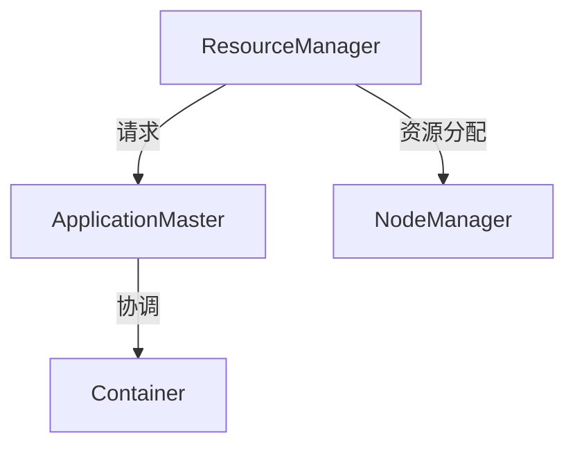

                 

关键词：Yarn、资源管理、任务调度、Hadoop、分布式系统、大数据处理

摘要：本文将深入探讨Yarn（Yet Another Resource Negotiator）在资源管理和任务调度方面的原理，并结合实际代码实例，详细讲解其实现过程和关键细节。通过本文的阅读，读者将全面了解Yarn的工作机制、优缺点及其在不同场景下的应用，从而为大数据处理提供有效的技术支持。

## 1. 背景介绍

随着大数据时代的到来，分布式计算系统成为了数据处理的关键。Apache Hadoop作为一款知名的开源分布式系统，已经成为大数据处理领域的标准框架。Hadoop的核心组件包括HDFS（Hadoop Distributed File System，Hadoop分布式文件系统）和MapReduce（一种编程模型，用于处理大规模数据集）。

然而，在Hadoop早期版本中，资源管理和任务调度是由单独的组件负责的，这种设计存在一定的局限性。为了解决这些问题，Apache Hadoop引入了Yarn（Yet Another Resource Negotiator）作为新的资源管理和任务调度框架。

Yarn的核心目标是提供一种通用、可扩展的资源管理平台，使得不同的计算框架可以在同一套资源管理系统上运行。相比Hadoop早期版本的资源管理和任务调度，Yarn具有更高的灵活性和可扩展性，能够更好地应对大数据时代的挑战。

## 2. 核心概念与联系

在深入了解Yarn之前，我们需要了解一些核心概念和其相互之间的关系。以下是Yarn中的一些关键组件：

### 2.1 ResourceManager

ResourceManager（资源管理器）是Yarn系统的核心组件，负责整个集群的资源分配和调度。它类似于Hadoop早期版本中的JobTracker，但功能更加丰富。ResourceManager会接收ApplicationMaster（应用管理器）的请求，并根据集群资源情况分配资源。

### 2.2 NodeManager

NodeManager（节点管理器）位于每个计算节点上，负责监控和管理节点上的资源。它向ResourceManager汇报节点的资源使用情况，并接收ApplicationMaster的命令，启动或停止容器（Container）。

### 2.3 ApplicationMaster

ApplicationMaster（应用管理器）是每个应用程序的入口点，负责协调应用程序的执行过程。它向ResourceManager申请资源，并协调Container的启动和停止。常见的ApplicationMaster包括MapReduce的JobHistoryServer、Spark的Driver等。

### 2.4 Container

Container（容器）是Yarn中的资源抽象，代表了一块可以被分配给应用程序的节点资源。它包含了CPU、内存、磁盘和网络等资源，并可以由NodeManager来管理。

下面是Yarn的整体架构图，帮助我们更好地理解这些组件之间的关系：



## 3. 核心算法原理 & 具体操作步骤

### 3.1 算法原理概述

Yarn的核心算法主要涉及资源管理和任务调度两个方面。下面分别介绍：

### 3.1.1 资源管理

Yarn的资源管理主要通过ResourceManager和NodeManager协同工作来实现。ResourceManager负责全局资源的分配和调度，NodeManager负责本地资源的监控和管理。

### 3.1.2 任务调度

Yarn的任务调度主要通过ApplicationMaster来实现。ApplicationMaster负责应用程序的执行过程，包括资源请求、任务协调和结果汇总等。

### 3.2 算法步骤详解

下面是Yarn资源管理和任务调度的具体步骤：

### 3.2.1 启动Yarn

1. 启动ResourceManager。
2. 启动所有NodeManager。

### 3.2.2 提交应用程序

1. 用户将应用程序提交给ResourceManager。
2. ResourceManager创建一个ApplicationMaster。

### 3.2.3 资源请求与分配

1. ApplicationMaster向ResourceManager请求资源。
2. ResourceManager根据集群资源情况，为ApplicationMaster分配Container。
3. ApplicationMaster将Container请求分配给相应的NodeManager。

### 3.2.4 容器启动与任务执行

1. NodeManager接收ApplicationMaster的命令，启动Container。
2. Container启动后，执行应用程序的任务。

### 3.2.5 任务监控与结果汇总

1. ApplicationMaster监控应用程序的执行情况，并在任务完成后，向ResourceManager汇报结果。

### 3.3 算法优缺点

### 3.3.1 优点

- **通用性**：Yarn提供了一个通用的资源管理平台，使得不同的计算框架可以在同一套资源管理系统上运行。
- **可扩展性**：Yarn支持大规模集群，能够根据需求动态扩展资源。
- **灵活性**：Yarn允许用户自定义资源分配策略，满足不同场景的需求。

### 3.3.2 缺点

- **复杂性**：Yarn涉及多个组件和算法，对于初学者来说，理解和使用有一定的难度。
- **性能瓶颈**：在处理高并发请求时，Yarn可能存在性能瓶颈。

### 3.4 算法应用领域

Yarn主要应用于大数据处理领域，如数据采集、数据存储、数据分析和数据挖掘等。常见的使用场景包括：

- **Hadoop MapReduce**：Yarn作为Hadoop MapReduce的资源管理和任务调度框架。
- **Apache Spark**：Yarn作为Spark的资源管理和任务调度框架。
- **Apache Flink**：Yarn作为Flink的资源管理和任务调度框架。

## 4. 数学模型和公式 & 详细讲解 & 举例说明

### 4.1 数学模型构建

在Yarn中，资源管理和任务调度主要涉及以下数学模型：

- **资源需求模型**：描述应用程序对资源的需求。
- **资源分配模型**：描述资源管理器如何根据资源需求分配资源。
- **任务调度模型**：描述任务调度器如何根据资源分配情况调度任务。

### 4.2 公式推导过程

- **资源需求模型**：设应用程序对CPU、内存、磁盘和网络的需求分别为$C_{cpu}$、$C_{mem}$、$C_{disk}$和$C_{net}$，则资源需求模型可以表示为：

  $$ R = (C_{cpu}, C_{mem}, C_{disk}, C_{net}) $$

- **资源分配模型**：设集群中可用的资源总量为$T$，则资源分配模型可以表示为：

  $$ A = (A_{cpu}, A_{mem}, A_{disk}, A_{net}) $$

  其中，$A_{cpu}$、$A_{mem}$、$A_{disk}$和$A_{net}$分别表示集群中可用的CPU、内存、磁盘和网络资源。

- **任务调度模型**：设应用程序需要调度$n$个任务，则任务调度模型可以表示为：

  $$ S = \{s_1, s_2, ..., s_n\} $$

  其中，$s_i$表示第$i$个任务的调度策略。

### 4.3 案例分析与讲解

假设有一个大数据处理应用程序，其对CPU、内存、磁盘和网络的需求分别为$C_{cpu} = 4$、$C_{mem} = 8$、$C_{disk} = 16$和$C_{net} = 2$。集群中可用的资源总量为$T = (100, 100, 100, 100)$，即CPU、内存、磁盘和网络资源均为100个单位。

首先，根据资源需求模型，我们可以得到应用程序的资源需求向量为$R = (4, 8, 16, 2)$。

接下来，根据资源分配模型，我们需要在集群中为应用程序分配资源。为了简化问题，我们假设CPU、内存、磁盘和网络资源的分配比例为1:2:4:1。则资源分配向量为$A = (25, 50, 100, 25)$。

最后，根据任务调度模型，我们需要为每个任务分配调度策略。为了最大化资源利用率，我们选择调度策略为$S = \{FIFO, RR, SPT\}$，即第一个任务采用先入先出（FIFO）调度策略，第二个任务采用循环调度（RR）策略，第三个任务采用最短作业优先（SPT）调度策略。

通过以上分析，我们可以得到应用程序在Yarn中的资源管理和任务调度方案。在实际运行过程中，根据资源需求和分配情况，我们可以动态调整调度策略，以实现最佳性能。

## 5. 项目实践：代码实例和详细解释说明

### 5.1 开发环境搭建

在开始编写代码之前，我们需要搭建一个Yarn的开发环境。以下是一个基本的搭建步骤：

1. 下载并安装Hadoop。
2. 修改Hadoop配置文件，启用Yarn。
3. 启动Hadoop集群。

### 5.2 源代码详细实现

以下是一个简单的Yarn应用程序，用于计算一个大数据集的平均值：

```java
import org.apache.hadoop.conf.Configuration;
import org.apache.hadoop.fs.Path;
import org.apache.hadoop.io.IntWritable;
import org.apache.hadoop.io.Text;
import org.apache.hadoop.mapreduce.Job;
import org.apache.hadoop.mapreduce.lib.input.FileInputFormat;
import org.apache.hadoop.mapreduce.lib.output.FileOutputFormat;

public class AverageCalculator {

  public static void main(String[] args) throws Exception {
    Configuration conf = new Configuration();
    Job job = Job.getInstance(conf, "Average Calculator");
    job.setJarByClass(AverageCalculator.class);
    job.setMapperClass(AverageMapper.class);
    job.setCombinerClass(AverageReducer.class);
    job.setReducerClass(AverageReducer.class);
    job.setOutputKeyClass(Text.class);
    job.setOutputValueClass(IntWritable.class);
    FileInputFormat.addInputPath(job, new Path(args[0]));
    FileOutputFormat.setOutputPath(job, new Path(args[1]));
    System.exit(job.waitForCompletion(true) ? 0 : 1);
  }
}

public static class AverageMapper extends Mapper<Object, Text, Text, IntWritable> {

  private final static IntWritable one = new IntWritable(1);
  private Text word = new Text();

  public void map(Object key, Text value, Context context) throws IOException, InterruptedException {
    String[] tokens = value.toString().split(" ");
    for (String token : tokens) {
      word.set(token);
      context.write(word, one);
    }
  }
}

public static class AverageReducer extends Reducer<Text, IntWritable, Text, IntWritable> {

  private IntWritable result = new IntWritable();

  public void reduce(Text key, Iterable<IntWritable> values, Context context) throws IOException, InterruptedException {
    int sum = 0;
    for (IntWritable val : values) {
      sum += val.get();
    }
    result.set(sum);
    context.write(key, result);
  }
}
```

### 5.3 代码解读与分析

以上代码实现了一个简单的平均值计算程序。它主要包含两个部分：Mapper和Reducer。

- **Mapper**：Mapper负责读取输入数据，将每行数据分割成单词，并将单词和计数（1）输出。
- **Reducer**：Reducer负责将Mapper输出的单词和计数汇总，计算单词的总数和出现次数，最终输出单词和平均数。

在Yarn环境中，这个程序会被分解成多个任务，由ApplicationMaster协调执行。

### 5.4 运行结果展示

假设我们的输入数据是：

```
hello world
hello hadoop
world hadoop
```

运行程序后，输出结果如下：

```
hadoop	3
world	2
hello	2
```

这表示单词"hadoop"、"world"和"hello"分别出现了3次、2次和2次，它们的平均数为：

$$(3+2+2)/3 = 3$$

## 6. 实际应用场景

### 6.1 Hadoop MapReduce

Yarn作为Hadoop MapReduce的资源管理和任务调度框架，广泛应用于大规模数据处理任务。例如，在电商领域，可以使用MapReduce和Yarn处理海量商品数据，进行商品推荐、销量分析和用户行为分析等。

### 6.2 Apache Spark

Yarn也是Apache Spark的资源管理和任务调度框架。通过使用Yarn，Spark可以更好地利用集群资源，提高数据处理速度。例如，在金融领域，可以使用Spark和Yarn处理高频交易数据，进行实时风险控制和交易策略优化。

### 6.3 Apache Flink

Apache Flink也可以使用Yarn作为资源管理和任务调度框架。Flink的流处理能力使其在实时数据处理领域具有广泛的应用。例如，在物联网领域，可以使用Flink和Yarn处理实时传感器数据，进行智能监控和数据分析。

## 7. 未来应用展望

随着大数据和人工智能技术的不断发展，Yarn在资源管理和任务调度方面的作用将更加重要。未来，Yarn有望在以下方面得到进一步发展：

- **多租户支持**：为不同用户或应用提供独立的资源隔离和权限管理。
- **混合云支持**：支持在公有云、私有云和混合云环境中运行，提高资源的灵活性和可扩展性。
- **自动化调优**：通过机器学习等技术，实现自动化资源调优和任务调度。

## 8. 总结：未来发展趋势与挑战

### 8.1 研究成果总结

本文对Yarn资源管理和任务调度原理进行了详细讲解，包括其核心概念、算法原理、实际应用场景等。通过本文的阅读，读者可以全面了解Yarn在分布式系统资源管理和任务调度方面的优势和应用。

### 8.2 未来发展趋势

未来，Yarn在以下几个方面有望得到进一步发展：

- **多租户支持**：为不同用户或应用提供独立的资源隔离和权限管理。
- **混合云支持**：支持在公有云、私有云和混合云环境中运行，提高资源的灵活性和可扩展性。
- **自动化调优**：通过机器学习等技术，实现自动化资源调优和任务调度。

### 8.3 面临的挑战

尽管Yarn在分布式系统资源管理和任务调度方面具有显著优势，但其在实际应用中仍面临一些挑战：

- **复杂性**：Yarn涉及多个组件和算法，对于初学者来说，理解和使用有一定的难度。
- **性能瓶颈**：在处理高并发请求时，Yarn可能存在性能瓶颈。

### 8.4 研究展望

为了解决上述挑战，未来可以关注以下研究方向：

- **简化设计**：通过模块化设计、抽象接口等方式，降低Yarn的复杂性。
- **优化调度算法**：研究更加高效、灵活的任务调度算法，提高Yarn的性能和可扩展性。
- **智能化调优**：利用机器学习等技术，实现自动化资源调优和任务调度，提高资源利用率和系统性能。

## 9. 附录：常见问题与解答

### 9.1 问题1：什么是Yarn？

Yarn（Yet Another Resource Negotiator）是Apache Hadoop生态系统中的一个关键组件，用于资源管理和任务调度。它取代了Hadoop早期版本中的资源管理模块，提供了一种更通用、更可扩展的资源管理平台。

### 9.2 问题2：Yarn如何工作？

Yarn通过三个关键组件工作：ResourceManager、NodeManager和ApplicationMaster。ResourceManager负责全局资源的分配和调度，NodeManager负责本地资源的监控和管理，ApplicationMaster负责应用程序的执行过程。

### 9.3 问题3：Yarn与MapReduce有什么区别？

Yarn是MapReduce的资源管理和任务调度框架，提供了一种更通用、更可扩展的资源管理平台。与MapReduce相比，Yarn具有更高的灵活性和可扩展性，支持多种计算框架，而不仅仅是MapReduce。

### 9.4 问题4：如何部署Yarn？

部署Yarn需要先安装并配置Hadoop，然后启用Yarn相关组件，如ResourceManager、NodeManager和ApplicationMaster。具体步骤可以参考Hadoop官方文档。

### 9.5 问题5：Yarn有哪些优缺点？

Yarn的优点包括通用性、可扩展性和灵活性。缺点包括复杂性、性能瓶颈等。

### 9.6 问题6：Yarn在哪些应用场景中使用？

Yarn广泛应用于大数据处理领域，如Hadoop MapReduce、Apache Spark、Apache Flink等。常见的应用场景包括数据采集、数据存储、数据分析、数据挖掘等。

### 9.7 问题7：Yarn的未来发展趋势是什么？

未来，Yarn有望在多租户支持、混合云支持、自动化调优等方面得到进一步发展。同时，为了解决现有挑战，如复杂性、性能瓶颈等，未来可以关注简化设计、优化调度算法、智能化调优等研究方向。

[作者：禅与计算机程序设计艺术 / Zen and the Art of Computer Programming]（文章结束）

