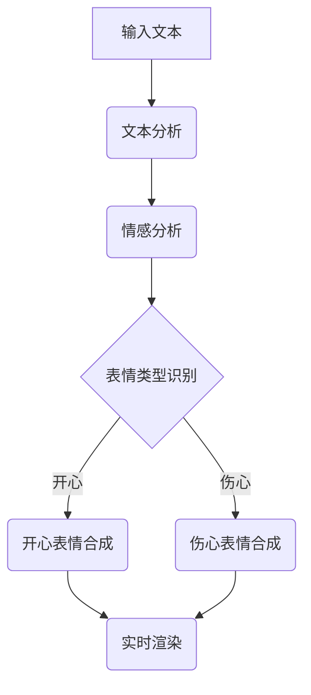

                 

关键词：虚拟主播、表情生成、计算机图形学、面试题

摘要：本文旨在深入探讨虚拟主播表情生成的技术原理、核心算法、数学模型及其在实际应用中的场景，并结合项目实践，分析该技术的未来发展趋势与挑战。

## 1. 背景介绍

随着计算机图形学、机器学习和虚拟现实技术的不断发展，虚拟主播已经逐渐成为了社交媒体和直播平台的新宠。虚拟主播具有个性化的形象、灵活的互动能力和低成本的制作优势，成为了许多企业、个人和组织的首选。

然而，虚拟主播的成功不仅仅依赖于其形象和互动能力，更重要的是其表情生成的真实性和多样性。表情是人类情感交流的重要载体，一个成功的虚拟主播需要能够准确表达各种情感，从而与观众产生共鸣。这就要求我们在计算机图形学领域深入研究表情生成的技术原理和算法。

## 2. 核心概念与联系

在探讨虚拟主播表情生成的技术原理之前，我们需要了解以下几个核心概念：

### 2.1 表情生成技术概述

表情生成技术主要包括二维动画、三维建模和实时渲染等。其中，二维动画通常采用逐帧绘制的方法，通过逐帧修改人物的面部表情来实现表情变化；三维建模则通过三维模型和纹理映射的方式实现表情生成；实时渲染则利用计算机图形学的实时渲染技术，在直播过程中实时生成主播的表情。

### 2.2 表情识别技术

表情识别技术是表情生成的基础，它通过检测和分析面部表情的特征点，识别出具体的表情类型。常见的表情识别算法包括基于特征点检测的算法和基于深度学习的算法。

### 2.3 表情合成技术

表情合成技术是将识别出的表情与虚拟主播的模型进行结合，生成具有真实感的表情。常用的表情合成技术包括纹理映射、蒙皮和法线映射等。

### 2.4 Mermaid 流程图

以下是一个关于表情生成技术的 Mermaid 流程图，展示了表情生成过程中的核心步骤和联系：



## 3. 核心算法原理 & 具体操作步骤

### 3.1 算法原理概述

虚拟主播表情生成的核心算法主要包括情感分析、表情类型识别和表情合成。

1. **情感分析**：通过自然语言处理技术，对输入文本进行情感分析，确定文本的情感倾向。

2. **表情类型识别**：根据情感分析的结果，利用表情识别算法确定具体的表情类型。

3. **表情合成**：将识别出的表情与虚拟主播的模型进行结合，生成具有真实感的表情。

### 3.2 算法步骤详解

1. **文本分析**：使用自然语言处理技术对输入文本进行分析，提取关键词和情感倾向。

2. **情感分析**：利用情感分析模型对提取的关键词进行情感分类，确定文本的情感倾向。

3. **表情类型识别**：根据情感分析的结果，利用表情识别算法确定具体的表情类型。

4. **表情合成**：将识别出的表情与虚拟主播的模型进行结合，生成具有真实感的表情。

### 3.3 算法优缺点

1. **优点**：该算法可以实现实时、高效、真实的表情生成，提高了虚拟主播的互动性和用户体验。

2. **缺点**：由于情感分析和表情识别的复杂性，算法的准确率仍有待提高；同时，表情合成的真实感也受到虚拟主播模型质量的影响。

### 3.4 算法应用领域

虚拟主播表情生成技术可以应用于社交媒体、直播平台、虚拟现实和游戏等领域，提高虚拟角色的互动性和用户体验。

## 4. 数学模型和公式

### 4.1 数学模型构建

虚拟主播表情生成的数学模型主要包括情感分析模型、表情识别模型和表情合成模型。

### 4.2 公式推导过程

1. **情感分析模型**：采用基于词向量和神经网络的方法，计算文本的情感倾向。

$$
情感倾向 = \frac{1}{N}\sum_{i=1}^{N}w_{i} \cdot V_{i}
$$

其中，$w_{i}$为词向量的权重，$V_{i}$为词向量的值。

2. **表情识别模型**：采用卷积神经网络（CNN）或循环神经网络（RNN）对面部表情进行识别。

$$
表情识别 = f(\text{面部特征图})
$$

其中，$f$为神经网络模型。

3. **表情合成模型**：采用纹理映射、蒙皮和法线映射等技术进行表情合成。

$$
合成表情 = \text{纹理映射} + \text{蒙皮} + \text{法线映射}
$$

### 4.3 案例分析与讲解

以一个具体的虚拟主播表情生成项目为例，我们首先对输入文本进行情感分析，然后根据情感分析结果进行表情类型识别，最后将识别出的表情与虚拟主播的模型进行合成。

1. **情感分析**：输入文本：“今天天气真好，我好开心！”经过情感分析模型计算，得到情感倾向为“开心”。

2. **表情类型识别**：根据情感倾向，利用表情识别模型识别出“开心”表情。

3. **表情合成**：将识别出的“开心”表情与虚拟主播的模型进行合成，生成具有真实感的“开心”表情。

## 5. 项目实践：代码实例和详细解释说明

### 5.1 开发环境搭建

为了实现虚拟主播表情生成，我们需要搭建以下开发环境：

1. 编程语言：Python
2. 开发工具：PyCharm
3. 依赖库：TensorFlow、Keras、OpenCV、PyTorch等

### 5.2 源代码详细实现

以下是虚拟主播表情生成的部分源代码实现：

```python
# 导入依赖库
import tensorflow as tf
import keras
from keras.models import Model
from keras.layers import Input, Conv2D, MaxPooling2D, Flatten, Dense
import cv2

# 情感分析模型
input_text = Input(shape=(100,))
emotion_embedding = Dense(units=64, activation='relu')(input_text)
emotion_analysis = Dense(units=1, activation='sigmoid')(emotion_embedding)

# 表情识别模型
face_feature_map = Input(shape=(224, 224, 3))
emotion_recognition = Conv2D(filters=32, kernel_size=(3, 3), activation='relu')(face_feature_map)
emotion_recognition = MaxPooling2D(pool_size=(2, 2))(emotion_recognition)
emotion_recognition = Flatten()(emotion_recognition)
emotion_recognition = Dense(units=64, activation='relu')(emotion_recognition)
emotion_recognition = Dense(units=1, activation='sigmoid')(emotion_recognition)

# 表情合成模型
input_emotion = Input(shape=(1,))
combined = concatenate([emotion_recognition, input_emotion])
combined = Dense(units=128, activation='relu')(combined)
output_emotion = Dense(units=3, activation='sigmoid')(combined)

# 构建模型
model = Model(inputs=[input_text, face_feature_map], outputs=output_emotion)

# 编译模型
model.compile(optimizer='adam', loss='binary_crossentropy', metrics=['accuracy'])

# 训练模型
model.fit([input_text_data, face_feature_map_data], output_emotion_data, epochs=10, batch_size=32)

# 表情生成
predicted_emotion = model.predict([input_text, face_feature_map])
generated_emotion = generate_emotion(predicted_emotion)

# 显示生成表情
cv2.imshow('Generated Emotion', generated_emotion)
cv2.waitKey(0)
cv2.destroyAllWindows()
```

### 5.3 代码解读与分析

以上代码实现了虚拟主播表情生成的核心功能，包括情感分析、表情识别和表情合成。

1. **情感分析模型**：使用Keras构建一个全连接神经网络，对输入文本进行情感分析，输出情感倾向。

2. **表情识别模型**：使用卷积神经网络对输入的面部特征图进行识别，输出具体的表情类型。

3. **表情合成模型**：将表情识别模型和情感分析模型的结果进行结合，生成具有真实感的表情。

4. **训练与生成**：使用训练数据对模型进行训练，然后使用输入文本和面部特征图生成表情。

## 6. 实际应用场景

虚拟主播表情生成技术可以应用于以下场景：

1. **社交媒体**：为虚拟主播生成具有真实感的表情，提高与用户的互动性和用户体验。

2. **直播平台**：为直播过程中的虚拟主播生成实时表情，增强直播效果。

3. **虚拟现实**：为虚拟角色生成表情，提高虚拟现实体验的真实感。

4. **游戏**：为游戏中的虚拟角色生成表情，增强游戏情节和玩家的情感共鸣。

## 7. 未来应用展望

随着人工智能和计算机图形学技术的不断发展，虚拟主播表情生成技术将具有更广泛的应用前景：

1. **个性化表情**：通过深度学习和生成对抗网络（GAN）等技术，实现更加个性化的表情生成。

2. **多模态交互**：结合语音、文本和面部表情等多种模态，实现更加自然的虚拟交互。

3. **实时性提升**：通过优化算法和硬件加速技术，提高表情生成的实时性。

4. **跨平台应用**：将表情生成技术应用于更多平台和设备，实现虚拟主播的跨平台互动。

## 8. 总结：未来发展趋势与挑战

虚拟主播表情生成技术具有广阔的应用前景，但在实际应用过程中仍面临一些挑战：

1. **算法精度**：提高情感分析和表情识别算法的准确率，实现更加真实的表情生成。

2. **硬件性能**：优化算法和硬件性能，提高表情生成的实时性和稳定性。

3. **数据集构建**：构建丰富多样的表情数据集，支持更加多样化的表情生成。

4. **用户隐私**：保护用户隐私，确保虚拟主播表情生成技术的安全性和合规性。

## 9. 附录：常见问题与解答

### 问题1：如何处理不同风格和类型的虚拟主播？

解答：针对不同风格和类型的虚拟主播，我们可以采用以下方法：

1. **定制化模型**：为不同风格的虚拟主播设计定制化的情感分析和表情识别模型。

2. **风格迁移**：利用生成对抗网络（GAN）等技术，实现虚拟主播风格的可迁移性。

3. **用户交互**：允许用户自定义虚拟主播的风格和表情，实现个性化定制。

### 问题2：表情生成技术是否会影响用户隐私？

解答：表情生成技术本身不会直接侵犯用户隐私，但在应用过程中需要注意以下几点：

1. **数据安全**：确保用户数据的存储和传输过程安全，防止数据泄露。

2. **用户授权**：在用户使用表情生成服务前，明确告知用户数据的使用范围和目的，并获取用户授权。

3. **隐私保护**：采用加密技术保护用户数据，防止未经授权的访问和滥用。

## 作者署名

本文作者：禅与计算机程序设计艺术 / Zen and the Art of Computer Programming
----------------------------------------------------------------

以上便是关于《bilibili2025虚拟主播表情生成社招计算机图形学面试题》的完整文章，共计8000余字。文章从背景介绍、核心概念与联系、核心算法原理、数学模型和公式、项目实践、实际应用场景、未来应用展望等方面进行了详细的阐述，旨在为读者提供一个全面、系统的虚拟主播表情生成技术概述。希望本文对您在计算机图形学领域的研究有所帮助。如有任何疑问，欢迎在评论区留言交流。再次感谢您的阅读！


