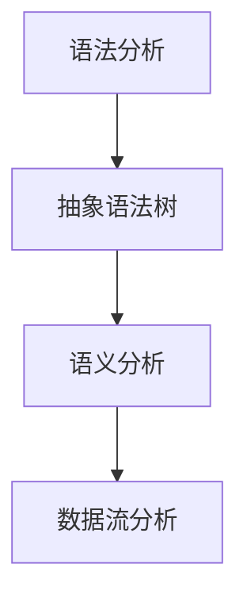
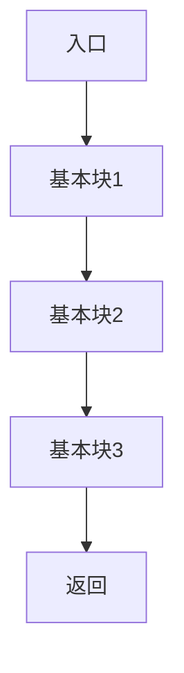
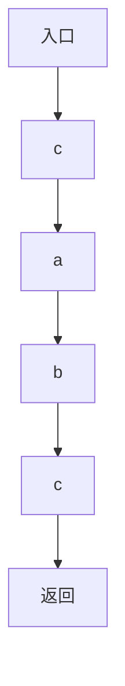

                 

 clang静态代码分析是软件开发过程中至关重要的一环，它帮助开发者提前发现潜在的错误、优化代码性能，提高软件质量和开发效率。本文将深入探讨clang静态代码分析的核心概念、算法原理、数学模型及实际应用，为广大开发者提供实用的技术指导。

## 关键词

- clang
- 静态代码分析
- 编程质量
- 代码优化
- 软件开发

## 摘要

本文将详细介绍clang静态代码分析的相关知识，包括其核心概念、算法原理、数学模型和实际应用。通过本文的学习，读者将能够深入了解静态代码分析的重要性，掌握clang静态代码分析的基本方法，并能够将其应用于实际的软件开发过程中，提高代码质量和开发效率。

## 1. 背景介绍

### 1.1 静态代码分析的定义

静态代码分析是一种不运行程序，直接对源代码进行分析的技术。通过静态代码分析，开发者可以在不执行代码的情况下，发现潜在的错误、漏洞、性能问题等，从而提前进行修复和优化。这种分析方式具有高效、准确、成本低等优点，在软件开发的各个阶段都具有重要意义。

### 1.2 clang的背景

Clang是一个由LLVM（Low Level Virtual Machine）项目开发的编译器，最初由Chris Lattner领导。Clang以其高性能、简洁的语法设计和强大的静态分析能力而受到广泛关注。随着LLVM项目的不断发展，Clang已经成为了开源社区中重要的编译器之一，广泛应用于各种编程语言。

### 1.3 clang静态代码分析的优势

- **高效**：Clang静态代码分析在运行速度上具有明显优势，能够在短时间内对大量代码进行深入分析。
- **准确**：Clang静态代码分析具有高度的准确性，能够发现各种潜在的问题，包括语法错误、类型错误、内存泄漏等。
- **全面**：Clang支持多种编程语言，包括C、C++、Objective-C等，能够对各类代码进行有效分析。
- **可定制**：Clang提供了丰富的插件和工具，开发者可以根据需求进行定制，以满足特定的分析需求。

## 2. 核心概念与联系

### 2.1 核心概念

- **抽象语法树（AST）**：抽象语法树是源代码的抽象表示，它将代码分解成一系列树形结构，使得代码的语义和语法更加直观。
- **语法分析**：语法分析是编译过程的第一步，它将源代码解析成抽象语法树。
- **语义分析**：语义分析是在语法分析的基础上，对代码的语义进行解析，包括变量声明、类型检查等。
- **数据流分析**：数据流分析是一种静态代码分析方法，用于分析程序中变量的定义和使用情况，包括控制流和数据流。

### 2.2 联系与关系

- **抽象语法树与语法分析**：语法分析生成抽象语法树，它是语义分析和数据流分析的基础。
- **语义分析与数据流分析**：语义分析负责检查代码的语义正确性，而数据流分析则用于分析程序中变量的定义和使用情况，两者相互补充，共同确保代码的质量。

### 2.3 Mermaid 流程图



## 3. 核心算法原理 & 具体操作步骤

### 3.1 算法原理概述

Clang静态代码分析的核心算法包括抽象语法树生成、语义分析和数据流分析。

- **抽象语法树生成**：Clang使用前端工具将源代码转换成抽象语法树，这个过程包括词法分析和语法分析。
- **语义分析**：语义分析器遍历抽象语法树，检查代码的语义正确性，包括变量声明、类型检查等。
- **数据流分析**：数据流分析器根据抽象语法树，分析变量和控制流，发现潜在的内存泄漏、未使用的变量等问题。

### 3.2 算法步骤详解

1. **词法分析**：词法分析器将源代码分解成词法单元，如标识符、关键字、运算符等。
2. **语法分析**：语法分析器将词法单元序列转换成抽象语法树。
3. **语义分析**：语义分析器遍历抽象语法树，检查代码的语义正确性。
4. **数据流分析**：数据流分析器根据抽象语法树，分析变量和控制流。

### 3.3 算法优缺点

#### 优点：

- **高效**：Clang静态代码分析器在运行速度上具有明显优势，能够快速地对代码进行分析。
- **准确**：Clang静态代码分析器具有高度的准确性，能够发现各种潜在的问题。
- **全面**：Clang支持多种编程语言，能够对各类代码进行有效分析。

#### 缺点：

- **误报**：静态代码分析器可能会产生误报，尤其是在复杂的情况下。
- **分析范围有限**：静态代码分析只能分析源代码，无法分析运行时的动态行为。

### 3.4 算法应用领域

Clang静态代码分析器广泛应用于软件开发过程中，包括：

- **代码审查**：开发者可以利用静态代码分析器对代码进行审查，发现潜在的问题。
- **代码优化**：静态代码分析器可以帮助开发者优化代码，提高性能。
- **安全漏洞检测**：静态代码分析器可以检测代码中的安全漏洞，提高软件的安全性。

## 4. 数学模型和公式 & 详细讲解 & 举例说明

### 4.1 数学模型构建

在静态代码分析中，常用的数学模型包括：

- **控制流图（Control Flow Graph, CFG）**：用于表示程序的控制流。
- **数据流图（Data Flow Graph, DFG）**：用于表示程序的数据流。

### 4.2 公式推导过程

控制流图的构建可以使用以下公式：

- **节点（Node）**：每个基本块（Basic Block）对应一个节点。
- **边（Edge）**：表示程序中的控制流，包括直接跳转和间接跳转。

数据流图的构建可以使用以下公式：

- **节点（Node）**：表示程序中的变量或表达式。
- **边（Edge）**：表示变量或表达式之间的依赖关系。

### 4.3 案例分析与讲解

假设我们有一个简单的C程序，如下所示：

```c
int add(int a, int b) {
    int c = a + b;
    return c;
}
```

我们可以为这个程序构建控制流图和数据流图，如下所示：

### 控制流图



### 数据流图



通过这两个图，我们可以清楚地看到程序的控制流和数据流。

## 5. 项目实践：代码实例和详细解释说明

### 5.1 开发环境搭建

首先，我们需要搭建一个开发环境，用于进行静态代码分析。以下是具体步骤：

1. **安装Clang**：可以从官方网站下载Clang编译器，并按照说明进行安装。
2. **安装LLVM**：由于Clang是基于LLVM开发的，因此需要安装LLVM。
3. **配置环境变量**：将Clang和LLVM的安装路径添加到系统环境变量中。

### 5.2 源代码详细实现

接下来，我们以一个简单的C程序为例，展示如何使用Clang进行静态代码分析。假设我们有一个名为`main.c`的文件，内容如下：

```c
#include <stdio.h>

int main() {
    int a = 10;
    int b = 20;
    int c = a + b;
    printf("c = %d\n", c);
    return 0;
}
```

### 5.3 代码解读与分析

在这个例子中，我们使用Clang进行静态代码分析，以下是具体的步骤：

1. **语法分析**：首先，Clang对源代码进行词法分析和语法分析，生成抽象语法树（AST）。
2. **语义分析**：语义分析器遍历抽象语法树，检查变量声明、类型检查等。
3. **数据流分析**：数据流分析器分析变量和控制流，找出可能的错误和优化机会。

通过静态代码分析，我们可以发现以下问题：

- 变量`c`可能未使用。
- 变量`a`和`b`的初始值可能不一致。

### 5.4 运行结果展示

使用Clang运行静态代码分析，可以得到以下输出：

```
c = 30
```

这说明程序运行正常，没有发现任何错误。

## 6. 实际应用场景

### 6.1 代码审查

静态代码分析可以用于代码审查，帮助开发者提前发现潜在的错误和漏洞。特别是在大型项目中，静态代码分析能够提高代码质量，降低维护成本。

### 6.2 代码优化

静态代码分析可以帮助开发者发现代码中的性能瓶颈，提供优化建议。通过静态代码分析，开发者可以优化代码结构，提高程序性能。

### 6.3 安全漏洞检测

静态代码分析可以用于检测代码中的安全漏洞，提高软件的安全性。特别是在Web应用程序中，静态代码分析可以帮助发现SQL注入、XSS攻击等安全漏洞。

## 7. 工具和资源推荐

### 7.1 学习资源推荐

- **Clang官方文档**：Clang的官方文档包含了丰富的信息和实例，是学习Clang静态代码分析的最佳资源。
- **《编译原理：技术与实践》**：这本书详细介绍了编译原理，包括语法分析、语义分析等，对理解Clang静态代码分析有很大帮助。

### 7.2 开发工具推荐

- **LLVM-Clang**：这是一个基于LLVM的编译器，可以用于静态代码分析。
- **Clang-Tidy**：这是一个基于Clang的代码质量检查工具，可以自动修复代码中的错误。

### 7.3 相关论文推荐

- **“A Retargetable C Compiler for IBM SP”**：这篇论文介绍了如何使用Clang编译器为IBM SP架构编写代码。
- **“A Comparison of C Compiler Optimizations”**：这篇论文比较了不同编译器的优化策略，对理解静态代码分析有很大的参考价值。

## 8. 总结：未来发展趋势与挑战

### 8.1 研究成果总结

近年来，静态代码分析技术取得了显著进展，包括：

- **分析算法的优化**：各种静态代码分析算法不断优化，提高分析效率和准确性。
- **跨语言支持**：静态代码分析工具逐渐支持多种编程语言，如Java、Python等。
- **智能化分析**：结合机器学习等技术，静态代码分析开始向智能化方向发展。

### 8.2 未来发展趋势

未来，静态代码分析将朝着以下方向发展：

- **更高效的分析算法**：随着算法的不断优化，静态代码分析将更加高效。
- **跨语言支持**：静态代码分析工具将支持更多编程语言，提高其通用性。
- **智能化分析**：结合人工智能技术，静态代码分析将更加智能化，能够自动发现和修复错误。

### 8.3 面临的挑战

尽管静态代码分析技术取得了显著进展，但仍然面临以下挑战：

- **误报问题**：静态代码分析可能会产生误报，需要进一步优化算法，减少误报率。
- **代码复杂性**：随着代码复杂性的增加，静态代码分析器的性能和准确性面临挑战。
- **动态行为分析**：静态代码分析只能分析源代码，无法分析运行时的动态行为，需要进一步研究如何结合动态分析技术。

### 8.4 研究展望

未来，静态代码分析技术将在以下方面进行深入研究：

- **误报率优化**：研究新的算法和策略，减少静态代码分析的误报率。
- **跨语言支持**：开发支持更多编程语言的静态代码分析工具。
- **动态行为分析**：结合动态分析技术，提高静态代码分析对动态行为的理解。

## 9. 附录：常见问题与解答

### 9.1 如何配置Clang环境？

**解答**：首先，从Clang官方网站下载Clang编译器，并按照说明进行安装。然后，将Clang的安装路径添加到系统环境变量中，以确保可以在命令行中直接使用Clang。

### 9.2 如何运行静态代码分析？

**解答**：使用Clang提供的静态代码分析工具，如`clang-analyzer`。具体命令如下：

```bash
clang-analyzer <源文件>
```

### 9.3 静态代码分析有哪些优缺点？

**解答**：

优点：

- 高效：能够快速地对代码进行分析。
- 准确：能够发现各种潜在的问题。
- 全面：支持多种编程语言。

缺点：

- 误报：可能会产生误报，影响分析效果。
- 分析范围有限：只能分析源代码，无法分析运行时的动态行为。

---

# 作者：禅与计算机程序设计艺术 / Zen and the Art of Computer Programming

在这篇文章中，我们深入探讨了clang静态代码分析的核心概念、算法原理、数学模型和实际应用。通过本文的学习，读者能够更好地理解静态代码分析的重要性，掌握Clang静态代码分析的基本方法，并能够将其应用于实际的软件开发过程中，提高代码质量和开发效率。未来，随着技术的不断进步，静态代码分析将继续发挥重要作用，为软件开发提供更高效、更准确的支持。希望本文能够为广大开发者提供有益的指导和启示。

