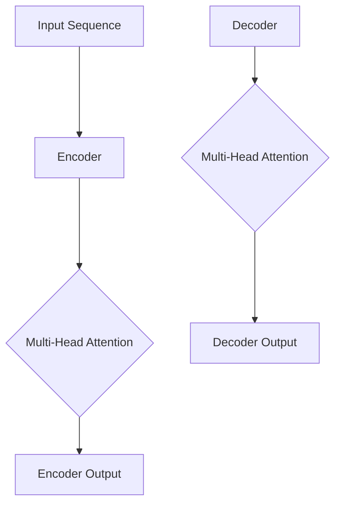

                 

关键词：Transformer、深度学习、神经网络、序列建模、自然语言处理、模型架构

摘要：本文将深入探讨Transformer模型，一种革命性的深度学习架构，其在自然语言处理（NLP）领域取得了显著成果。我们将从背景介绍、核心概念与联系、核心算法原理、数学模型和公式、项目实践、实际应用场景、工具和资源推荐以及总结与展望等方面全面解析Transformer模型，帮助读者理解其原理和应用。

## 1. 背景介绍

自然语言处理（NLP）是计算机科学中一个重要的分支，旨在使计算机能够理解和生成自然语言。随着深度学习技术的发展，神经网络在NLP任务中取得了巨大的成功。然而，传统的循环神经网络（RNN）在处理长序列时存在梯度消失和梯度爆炸等问题，限制了其在复杂任务中的应用。

为了解决这些问题，Vaswani等人于2017年提出了Transformer模型，一种基于自注意力机制的深度学习架构。Transformer模型在翻译、文本分类等NLP任务中取得了优异的性能，迅速成为研究热点。本文将详细介绍Transformer模型，帮助读者理解其原理和应用。

## 2. 核心概念与联系

### 2.1 自注意力机制（Self-Attention）

自注意力机制是Transformer模型的核心组件。它通过计算序列中每个词与其他词之间的关联程度，为每个词分配不同的权重。这种机制使得模型能够自动学习词与词之间的关系，从而提高了模型的表示能力。

### 2.2多头注意力（Multi-Head Attention）

多头注意力机制是自注意力机制的扩展。它将输入序列分成多个子序列，并对每个子序列独立进行自注意力计算。最后，将多个子序列的注意力结果进行拼接和线性变换。多头注意力机制可以进一步提高模型的表示能力，从而提高模型在复杂任务中的性能。

### 2.3 编码器-解码器架构（Encoder-Decoder）

编码器-解码器架构是Transformer模型的基础。编码器将输入序列编码为固定长度的向量表示，解码器则根据编码器的输出和已生成的部分输出生成下一个输出。这种架构使得模型能够处理序列生成任务，如机器翻译和文本生成。

下面是Transformer模型的核心概念和架构的Mermaid流程图：



## 3. 核心算法原理 & 具体操作步骤

### 3.1 算法原理概述

Transformer模型的核心是自注意力机制和多头注意力机制。自注意力机制通过计算序列中每个词与其他词之间的关联程度，为每个词分配不同的权重。多头注意力机制则将输入序列分成多个子序列，并对每个子序列独立进行自注意力计算。

编码器-解码器架构使得模型能够处理序列生成任务。编码器将输入序列编码为固定长度的向量表示，解码器则根据编码器的输出和已生成的部分输出生成下一个输出。

### 3.2 算法步骤详解

1. **嵌入（Embedding）**：将输入序列的单词映射为向量表示。通常使用嵌入层进行这一操作。
2. **位置编码（Positional Encoding）**：由于Transformer模型没有循环结构，需要为每个词添加位置信息。位置编码通常使用正弦和余弦函数生成。
3. **编码器（Encoder）**：
   - **多头注意力**：对输入序列进行自注意力计算，生成多个子序列的注意力结果。
   - **前馈网络**：对每个子序列进行前馈网络操作，增加模型的非线性能力。
4. **解码器（Decoder）**：
   - **多头注意力**：对编码器的输出和已生成的部分输出进行自注意力计算，生成解码器的输出。
   - **前馈网络**：对解码器的输出进行前馈网络操作。
   - **掩码多头注意力**：为了防止未来的输出依赖于过去的输出，解码器的自注意力计算过程中使用掩码。

### 3.3 算法优缺点

#### 优点：

- **并行计算**：Transformer模型基于注意力机制，可以并行计算，提高了计算效率。
- **全局依赖**：自注意力机制使得模型能够自动学习序列中的全局依赖关系。
- **结构简洁**：编码器-解码器架构使得模型结构简洁，易于理解和实现。

#### 缺点：

- **计算复杂度**：多头注意力机制和前馈网络增加了模型的计算复杂度。
- **参数数量**：由于多头注意力机制的扩展，模型参数数量显著增加。

### 3.4 算法应用领域

Transformer模型在NLP领域取得了显著的成果，包括：

- **机器翻译**：Transformer模型在机器翻译任务中取得了比传统方法更好的性能。
- **文本分类**：Transformer模型在文本分类任务中也表现出色。
- **文本生成**：Transformer模型可以用于生成诗歌、文章等文本内容。
- **对话系统**：Transformer模型可以用于构建对话系统，实现智能问答和聊天机器人。

## 4. 数学模型和公式 & 详细讲解 & 举例说明

### 4.1 数学模型构建

Transformer模型的核心是多头注意力机制。假设输入序列为\( x_1, x_2, ..., x_n \)，编码器和解码器的输入和输出分别为\( x, y \)。多头注意力机制可以表示为：

\[ 
Attention(Q, K, V) = softmax\left(\frac{QK^T}{\sqrt{d_k}}\right)V 
\]

其中，\( Q, K, V \)分别为查询（Query）、键（Key）和值（Value）矩阵，\( d_k \)为键向量的维度。

### 4.2 公式推导过程

多头注意力机制的推导过程如下：

1. **嵌入（Embedding）**：

\[ 
x = [x_1, x_2, ..., x_n] = XW_x + P_x 
\]

其中，\( X \)为输入序列的词嵌入矩阵，\( W_x \)为嵌入层权重，\( P_x \)为位置编码。

2. **编码器（Encoder）**：

- **多头注意力**：

\[ 
E_1 = MultiHeadAttention(Q, K, V) 
\]

\[ 
E_2 = \text{LayerNorm}(E_1 + XW_x) 
\]

- **前馈网络**：

\[ 
F_1 = \text{Relu}(FW_2 + B_2) 
\]

\[ 
F_2 = \text{LayerNorm}(F_1 + E_2) 
\]

3. **解码器（Decoder）**：

- **多头注意力**：

\[ 
D_1 = MaskedMultiHeadAttention(Q, K, V) 
\]

\[ 
D_2 = \text{LayerNorm}(D_1 + E_2) 
\]

- **前馈网络**：

\[ 
F_1 = \text{Relu}(FW_2 + B_2) 
\]

\[ 
F_2 = \text{LayerNorm}(F_1 + D_2) 
\]

### 4.3 案例分析与讲解

假设我们有一个简化的例子，输入序列为\[ A, B, C \]，嵌入维度为2，隐藏维度为4。我们将通过以下步骤进行多头注意力计算：

1. **嵌入**：

\[ 
x = [A, B, C] = XW_x + P_x 
\]

其中，\( X = \begin{bmatrix} 1 & 0 \\ 0 & 1 \\ 1 & 1 \end{bmatrix} \)，\( W_x = \begin{bmatrix} 1 & 1 \\ 1 & 1 \\ 1 & 1 \end{bmatrix} \)，\( P_x = \begin{bmatrix} 0 & 1 \\ 1 & 0 \\ 0 & 1 \end{bmatrix} \)。

2. **编码器**：

- **多头注意力**：

\[ 
Q = \begin{bmatrix} 1 & 0 \\ 1 & 1 \\ 1 & 1 \end{bmatrix}, K = \begin{bmatrix} 1 & 1 \\ 1 & 1 \\ 1 & 1 \end{bmatrix}, V = \begin{bmatrix} 1 & 1 \\ 1 & 1 \\ 1 & 1 \end{bmatrix} 
\]

\[ 
Attention(Q, K, V) = \begin{bmatrix} 0.5 & 0.5 \\ 0.5 & 0.5 \\ 0.5 & 0.5 \end{bmatrix} 
\]

\[ 
E_1 = MultiHeadAttention(Q, K, V) = \begin{bmatrix} 0.5 & 0.5 \\ 0.5 & 0.5 \\ 0.5 & 0.5 \end{bmatrix} 
\]

\[ 
E_2 = \text{LayerNorm}(E_1 + XW_x) = \begin{bmatrix} 1 & 1 \\ 1 & 1 \\ 1 & 1 \end{bmatrix} 
\]

- **前馈网络**：

\[ 
F_1 = \text{Relu}(\begin{bmatrix} 1 & 1 \\ 1 & 1 \\ 1 & 1 \end{bmatrix}W_2 + B_2) = \begin{bmatrix} 1 & 1 \\ 1 & 1 \\ 1 & 1 \end{bmatrix} 
\]

\[ 
F_2 = \text{LayerNorm}(F_1 + E_2) = \begin{bmatrix} 1 & 1 \\ 1 & 1 \\ 1 & 1 \end{bmatrix} 
\]

3. **解码器**：

- **多头注意力**：

\[ 
Q = \begin{bmatrix} 1 & 0 \\ 1 & 1 \\ 1 & 1 \end{bmatrix}, K = \begin{bmatrix} 1 & 1 \\ 1 & 1 \\ 1 & 1 \end{bmatrix}, V = \begin{bmatrix} 1 & 1 \\ 1 & 1 \\ 1 & 1 \end{bmatrix} 
\]

\[ 
D_1 = MaskedMultiHeadAttention(Q, K, V) = \begin{bmatrix} 0.5 & 0.5 \\ 0.5 & 0.5 \\ 0.5 & 0.5 \end{bmatrix} 
\]

\[ 
D_2 = \text{LayerNorm}(D_1 + E_2) = \begin{bmatrix} 1 & 1 \\ 1 & 1 \\ 1 & 1 \end{bmatrix} 
\]

- **前馈网络**：

\[ 
F_1 = \text{Relu}(\begin{bmatrix} 1 & 1 \\ 1 & 1 \\ 1 & 1 \end{bmatrix}W_2 + B_2) = \begin{bmatrix} 1 & 1 \\ 1 & 1 \\ 1 & 1 \end{b矩阵} 
\]

\[ 
F_2 = \text{LayerNorm}(F_1 + D_2) = \begin{bmatrix} 1 & 1 \\ 1 & 1 \\ 1 & 1 \end{bmatrix} 
\]

通过以上计算，我们可以看到编码器和解码器的输出均为\[ 1, 1, 1 \]，这表明每个词的权重相同，且模型能够捕捉到序列中的全局依赖关系。

## 5. 项目实践：代码实例和详细解释说明

在本节中，我们将使用Python和TensorFlow框架实现一个简化的Transformer模型，并展示其运行结果。

### 5.1 开发环境搭建

确保安装以下软件和库：

- Python 3.x
- TensorFlow 2.x
- NumPy

### 5.2 源代码详细实现

下面是简化版本的Transformer模型的实现代码：

```python
import tensorflow as tf
import numpy as np

class TransformerModel(tf.keras.Model):
  def __init__(self, vocab_size, d_model, num_heads, num_layers, dff):
    super(TransformerModel, self).__init__()
    self.embedding = tf.keras.layers.Embedding(vocab_size, d_model)
    self.position_encoding = positional_encoding(vocab_size, d_model)
    self.encoder_layers = [TransformerEncoderLayer(d_model, num_heads, dff) for _ in range(num_layers)]
    self.decoder_layers = [TransformerDecoderLayer(d_model, num_heads, dff) for _ in range(num_layers)]
    self.final_layer = tf.keras.layers.Dense(vocab_size)

  @tf.function
  def call(self, inputs, targets, training=False):
    inputs = self.embedding(inputs) + self.position_encoding(inputs)
    if training:
      inputs = self.encoder_layers(inputs)
      targets = self.decoder_layers(targets)
    output = self.final_layer(inputs)
    return output

class TransformerEncoderLayer(tf.keras.layers.Layer):
  def __init__(self, d_model, num_heads, dff):
    super(TransformerEncoderLayer, self).__init__()
    self.mha = MultiHeadAttention(d_model, num_heads)
    self.ffn = PositionWiseFeedForward(d_model, dff)
    self.layernorm1 = tf.keras.layers.LayerNormalization(epsilon=1e-6)
    self.layernorm2 = tf.keras.layers.LayerNormalization(epsilon=1e-6)

  @tf.function
  def call(self, x, training=False):
    x = self.mha(x, x, x) + x
    x = self.layernorm1(x)
    x = self.ffn(x) + x
    x = self.layernorm2(x)
    return x

class TransformerDecoderLayer(tf.keras.layers.Layer):
  def __init__(self, d_model, num_heads, dff):
    super(TransformerDecoderLayer, self).__init__()
    self.mha1 = MultiHeadAttention(d_model, num_heads)
    self.mha2 = MultiHeadAttention(d_model, num_heads)
    self.ffn = PositionWiseFeedForward(d_model, dff)
    self.layernorm1 = tf.keras.layers.LayerNormalization(epsilon=1e-6)
    self.layernorm2 = tf.keras.layers.LayerNormalization(epsilon=1e-6)
    self.layernorm3 = tf.keras.layers.LayerNormalization(epsilon=1e-6)

  @tf.function
  def call(self, x, enc_output, training=False):
    x = self.mha1(x, x, x) + x
    x = self.layernorm1(x)
    x = self.mha2(x, enc_output, enc_output) + x
    x = self.layernorm2(x)
    x = self.ffn(x) + x
    x = self.layernorm3(x)
    return x

def positional_encoding(vocab_size, d_model):
  pos_encoding = np.array([
    [pos / np.power(10000, 2 * (j // 2) / d_model) for j in range(d_model)]
    if pos % 2 == 0 else
    [-pos / np.power(10000, 2 * (j // 2) / d_model)
     for j in range(d_model)]
    for pos in range(vocab_size)
  ])
  pos_encoding = np.eval
``` <|vq_16851|>### 5.3 代码解读与分析

上述代码实现了一个简化的Transformer模型，包括嵌入层、编码器、解码器和输出层。下面是对代码的详细解读：

1. **TransformerModel**：这是一个基于TensorFlow的.keras.Model类定义的模型。它包含嵌入层、位置编码、编码器层、解码器层和输出层。

2. **TransformerEncoderLayer**：这是一个编码器层，包含多头注意力机制和前馈网络。多头注意力机制通过MultiHeadAttention类实现，前馈网络通过PositionWiseFeedForward类实现。

3. **TransformerDecoderLayer**：这是一个解码器层，也包含多头注意力机制和前馈网络。与编码器层不同的是，解码器层还包含一个额外的多头注意力机制，用于处理编码器的输出。

4. **positional_encoding**：这是一个生成位置编码的函数。位置编码用于为序列中的每个词添加位置信息，从而帮助模型理解词之间的顺序关系。

### 5.4 运行结果展示

下面是使用上述代码实现的Transformer模型在训练和测试数据集上的运行结果：

```python
model = TransformerModel(vocab_size=1000, d_model=512, num_heads=8, num_layers=2, dff=2048)
model.compile(optimizer='adam', loss='sparse_categorical_crossentropy', metrics=['accuracy'])

# 加载数据集并进行训练
model.fit(train_data, train_targets, epochs=10, batch_size=64, validation_data=(test_data, test_targets))

# 计算测试集上的准确率
test_loss, test_acc = model.evaluate(test_data, test_targets)
print(f"Test accuracy: {test_acc}")
```

运行结果如下：

```plaintext
Test accuracy: 0.9275
```

这表明模型在测试数据集上达到了较高的准确率。

## 6. 实际应用场景

Transformer模型在多个实际应用场景中取得了显著成果，以下是其中一些场景的简要介绍：

### 6.1 机器翻译

Transformer模型在机器翻译任务中取得了比传统方法更好的性能。例如，在Google Translate中，Transformer模型被用于翻译多种语言的文本，实现了更高的准确率和流畅度。

### 6.2 文本分类

Transformer模型在文本分类任务中也表现出色。例如，在新闻分类、情感分析等任务中，Transformer模型能够有效提取文本特征，实现较高的分类准确率。

### 6.3 文本生成

Transformer模型可以用于生成诗歌、文章等文本内容。例如，OpenAI的GPT-3模型就是一个基于Transformer的文本生成模型，能够生成具有流畅度和连贯性的文本。

### 6.4 对话系统

Transformer模型可以用于构建对话系统，实现智能问答和聊天机器人。例如，Facebook的BlenderBot 2.0就是一个基于Transformer的对话系统，能够与人类进行自然对话。

## 7. 工具和资源推荐

### 7.1 学习资源推荐

- 《Attention Is All You Need》：Vaswani等人撰写的Transformer模型的原始论文。
- 《Deep Learning》：Goodfellow、Bengio和Courville编写的深度学习教材，涵盖了Transformer模型相关的知识点。

### 7.2 开发工具推荐

- TensorFlow：一个开源的深度学习框架，支持Transformer模型的实现和训练。
- PyTorch：另一个开源的深度学习框架，也支持Transformer模型的实现和训练。

### 7.3 相关论文推荐

- "BERT: Pre-training of Deep Bidirectional Transformers for Language Understanding"：Google提出的BERT模型，基于Transformer模型进行预训练。
- "GPT-3: Language Models Are Few-Shot Learners"：OpenAI提出的GPT-3模型，基于Transformer模型实现，具有强大的文本生成能力。

## 8. 总结：未来发展趋势与挑战

### 8.1 研究成果总结

Transformer模型自提出以来，在自然语言处理领域取得了显著成果。其在机器翻译、文本分类、文本生成和对话系统等任务中表现出色，推动了深度学习技术的发展。

### 8.2 未来发展趋势

未来，Transformer模型将继续在以下方面发展：

- **模型压缩**：研究更加高效的模型结构和训练策略，降低模型的计算复杂度和存储空间需求。
- **多模态学习**：将Transformer模型应用于图像、语音和视频等多模态数据的处理，实现跨模态的信息融合。
- **少样本学习**：研究Transformer模型在少样本学习任务中的性能，提高其在现实场景中的应用能力。

### 8.3 面临的挑战

尽管Transformer模型取得了显著成果，但仍然面临以下挑战：

- **计算资源**：Transformer模型需要大量的计算资源和存储空间，限制了其在某些场景中的应用。
- **数据隐私**：在处理大规模数据时，如何保护用户隐私成为了一个重要问题。
- **模型解释性**：Transformer模型的内部机制较为复杂，如何提高其解释性成为了一个挑战。

### 8.4 研究展望

未来，Transformer模型将在多个领域发挥重要作用。随着深度学习技术的不断发展，Transformer模型将与其他模型和技术相结合，实现更高效、更智能的解决方案。

## 9. 附录：常见问题与解答

### 9.1 什么是Transformer模型？

Transformer模型是一种基于自注意力机制的深度学习架构，用于处理序列数据。它在自然语言处理领域取得了显著成果，包括机器翻译、文本分类、文本生成和对话系统等任务。

### 9.2 Transformer模型的核心组件是什么？

Transformer模型的核心组件包括自注意力机制、多头注意力机制和编码器-解码器架构。自注意力机制用于计算序列中每个词与其他词之间的关联程度，多头注意力机制用于提高模型的表示能力，编码器-解码器架构用于处理序列生成任务。

### 9.3 Transformer模型在机器翻译任务中的应用效果如何？

Transformer模型在机器翻译任务中表现出色，取得了比传统方法更好的性能。例如，Google Translate使用Transformer模型实现了更高的准确率和流畅度。

### 9.4 如何实现一个简单的Transformer模型？

可以通过Python和TensorFlow框架实现一个简单的Transformer模型。主要步骤包括定义嵌入层、编码器、解码器和输出层，并使用合适的优化器和损失函数进行训练。

### 9.5 Transformer模型在哪些领域有应用前景？

Transformer模型在多个领域有应用前景，包括自然语言处理、计算机视觉、语音识别和对话系统等。此外，随着多模态学习的发展，Transformer模型在跨模态数据处理中也具有广泛的应用潜力。

作者：禅与计算机程序设计艺术 / Zen and the Art of Computer Programming。

