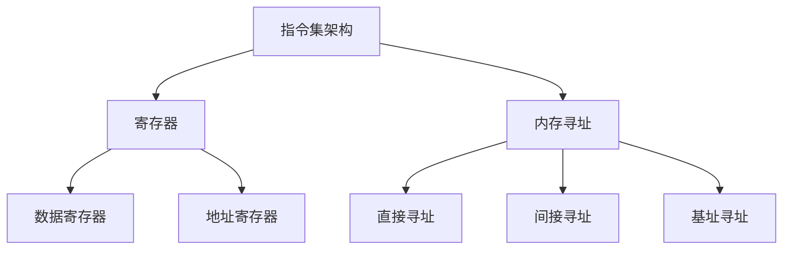

                 

在计算机科学领域，汇编语言是连接硬件和高级编程语言的一座桥梁。作为一门低级语言，汇编语言能够直接与计算机硬件进行交互，实现硬件级别的操作。本文将深入探讨 x86 汇编语言，旨在帮助读者掌握这一关键技能。

## 关键词
- x86 汇编语言
- 汇编语言编程
- 计算机硬件
- 低级编程
- 硬件交互

## 摘要
本文将介绍 x86 汇编语言的基本概念、核心原理以及实际编程技巧。通过本文的阅读，读者将能够了解汇编语言在计算机编程中的重要地位，掌握汇编语言的基本语法和使用方法，并且能够通过实践掌握汇编语言编程技巧。

## 1. 背景介绍

### 1.1 汇编语言的发展历史
汇编语言最早起源于 20 世纪 50 年代，随着计算机技术的发展而逐渐成熟。早期的计算机硬件结构相对简单，汇编语言因其能够直接与硬件交互而成为主要的编程语言。随着计算机硬件的复杂化，高级编程语言逐渐兴起，但汇编语言因其高效的性能和直接的操作硬件的能力，在特定场景下依然具有重要地位。

### 1.2 汇编语言与硬件的关系
汇编语言是直接面向硬件编程的语言，它能够实现硬件级别的操作，包括控制硬件设备、直接访问内存等。汇编语言与硬件的紧密关系使其在嵌入式系统、实时系统等对性能要求极高的场景中有着广泛的应用。

### 1.3 x86 汇编语言的特点
x86 汇编语言是基于英特尔 x86 处理器架构的汇编语言。x86 架构因其兼容性和广泛的应用而成为现代计算机硬件的标准。x86 汇编语言的特点包括：
- 强大的指令集：提供了丰富的指令，能够实现复杂的操作。
- 高效的性能：汇编语言编写的程序能够直接运行在硬件上，具有较高的执行效率。
- 直接的硬件访问：允许程序员直接操作硬件设备，实现底层控制。

## 2. 核心概念与联系

### 2.1 指令集架构
指令集架构（Instruction Set Architecture，ISA）是计算机硬件和软件之间的接口。在 x86 汇编语言中，指令集架构定义了程序能够执行的操作和指令格式。x86 指令集架构包括了一系列指令，如加法、减法、移位、跳转等。

### 2.2 寄存器
寄存器是计算机内存中的一部分，用于临时存储数据。在 x86 汇编语言中，寄存器是操作数据的重要场所。常见的寄存器包括 EAX、EBX、ECX、EDX 等，它们分别用于存储不同的数据类型。

### 2.3 内存寻址
内存寻址是汇编语言中用于访问内存的技术。通过内存寻址，程序员能够读写内存中的数据。在 x86 汇编语言中，内存寻址可以通过直接寻址、间接寻址、基址寻址等多种方式实现。

### 2.4 Mermaid 流程图
以下是 x86 汇编语言的核心概念和联系 Mermaid 流程图：



## 3. 核心算法原理 & 具体操作步骤

### 3.1 算法原理概述
汇编语言的核心在于对指令的精确控制，通过指令的执行实现特定的功能。汇编语言的编程过程主要包括以下几个步骤：
1. 指令编写：根据算法需求编写汇编指令。
2. 寄存器操作：使用寄存器进行数据的存储和运算。
3. 内存操作：通过内存寻址访问和修改内存中的数据。
4. 跳转和分支：通过跳转和分支实现程序的流程控制。

### 3.2 算法步骤详解
1. 初始化寄存器：根据算法需求初始化寄存器，准备运算。
2. 执行指令：依次执行汇编指令，实现数据运算。
3. 存储结果：将运算结果存储在内存中或寄存器中。
4. 流程控制：根据算法需求进行跳转或分支。

### 3.3 算法优缺点
#### 优点：
- 高效：汇编语言能够直接运行在硬件上，具有较高的执行效率。
- 精确：程序员可以精确控制指令的执行过程，实现底层操作。
- 灵活：汇编语言支持多种寻址方式和操作，能够适应不同的算法需求。

#### 缺点：
- 复杂：汇编语言语法较为复杂，编写和理解都较为困难。
- 可维护性差：汇编语言程序的可读性和可维护性较差，不易于团队合作开发。

### 3.4 算法应用领域
汇编语言在以下领域有着广泛的应用：
- 嵌入式系统：在资源受限的嵌入式系统中，汇编语言能够提供高效的性能。
- 操作系统开发：操作系统底层模块的编写通常使用汇编语言。
- 游戏开发：游戏引擎的底层实现常常使用汇编语言优化性能。
- 网络设备：网络设备中的协议实现和硬件控制常常使用汇编语言。

## 4. 数学模型和公式 & 详细讲解 & 举例说明

### 4.1 数学模型构建
在汇编语言编程中，数学模型通常通过一系列的指令和运算符来实现。例如，一个简单的加法运算可以通过以下数学模型表示：

$$
C = A + B
$$

其中，C、A 和 B 代表寄存器或内存地址。

### 4.2 公式推导过程
以加法运算为例，其公式推导过程如下：

$$
\begin{align*}
C &= A + B \\
C &= [C] + [B] \\
C &= M[A] + M[B]
\end{align*}
$$

其中，M 表示内存访问函数。

### 4.3 案例分析与讲解
假设我们需要计算两个内存地址中的整数相加，可以按照以下步骤进行：

1. 将第一个整数从内存地址 A 载入寄存器 A。
2. 将第二个整数从内存地址 B 载入寄存器 B。
3. 将寄存器 A 和寄存器 B 的值相加，并将结果存储到寄存器 C 中。
4. 将寄存器 C 的值存储到内存地址 C 中。

以下是相应的汇编指令：

```assembly
MOV EAX, [A]  ; 将内存地址 A 的值载入寄存器 EAX
MOV EBX, [B]  ; 将内存地址 B 的值载入寄存器 EBX
ADD EAX, EBX  ; 将寄存器 EAX 和寄存器 EBX 的值相加
MOV [C], EAX  ; 将寄存器 EAX 的值存储到内存地址 C 中
```

## 5. 项目实践：代码实例和详细解释说明

### 5.1 开发环境搭建
为了实践 x86 汇编语言编程，我们需要搭建相应的开发环境。以下是搭建开发环境的步骤：

1. 安装汇编器：我们使用 NASM（Netwide Assembler）作为汇编器。在 Windows 平台上，可以通过 Chocolatey 安装 NASM。
2. 安装链接器：我们使用 LD（GNU Linker）作为链接器。在 Windows 平台上，可以通过 MinGW 安装 LD。
3. 配置环境变量：确保 NASM 和 LD 的路径已添加到系统环境变量中。

### 5.2 源代码详细实现
以下是一个简单的 x86 汇编语言程序实例，用于计算两个整数的和：

```assembly
section .data
    A dd 10          ; 定义数据 A，值为 10
    B dd 20          ; 定义数据 B，值为 20
    C dd 0           ; 定义数据 C，初始值为 0

section .text
    global _start

_start:
    MOV EAX, [A]     ; 将 A 的值载入 EAX 寄存器
    ADD EAX, [B]     ; 将 B 的值加到 EAX 寄存器中
    MOV [C], EAX     ; 将结果存储到 C

    MOV EAX, 60      ; 函数号：sys_exit
    XOR EBX, EBX     ; 返回值：0
    INT 0x80         ; 调用中断，退出程序
```

### 5.3 代码解读与分析
1. **数据段**：在数据段中，我们定义了三个数据：A、B 和 C。A 和 B 分别表示两个待加的整数，C 表示结果。
2. **代码段**：在代码段中，我们首先通过 MOV 指令将 A 的值载入 EAX 寄存器，然后通过 ADD 指令将 B 的值加到 EAX 寄存器中。最后，通过 MOV 指令将结果存储到 C。
3. **退出程序**：程序的最后，我们使用系统调用（sys_exit）退出程序。EAX 寄存器设置为 60（sys_exit 的函数号），EBX 寄存器设置为 0（返回值）。

### 5.4 运行结果展示
假设 A 的值为 10，B 的值为 20，那么程序运行后的结果如下：

```assembly
A = 10
B = 20
C = 30
```

## 6. 实际应用场景

### 6.1 操作系统开发
在操作系统的底层开发中，汇编语言被广泛使用。例如，操作系统的引导加载程序、内存管理、中断处理等模块都使用汇编语言编写。汇编语言能够直接操作硬件，实现底层的硬件交互。

### 6.2 嵌入式系统
在嵌入式系统开发中，汇编语言因其高效的性能而被广泛使用。例如，微控制器、嵌入式设备等对性能要求较高的场景，常常使用汇编语言进行底层编程。

### 6.3 游戏开发
在游戏开发中，汇编语言被用于优化性能敏感的部分。例如，游戏引擎的渲染、物理模拟等模块，通过汇编语言进行底层优化，提高程序的性能。

### 6.4 网络设备
在网络设备中，汇编语言被用于编写协议实现和硬件控制代码。例如，路由器、交换机等设备，通过汇编语言实现对网络协议的底层处理和硬件设备的控制。

## 7. 工具和资源推荐

### 7.1 学习资源推荐
- 《x86 汇编语言：从实模式到保护模式》：这是一本经典的 x86 汇编语言教材，涵盖了从实模式到保护模式的一系列知识。
- 《深入理解计算机系统》：这本书详细介绍了计算机系统的各个层次，包括硬件、操作系统和编程语言等。

### 7.2 开发工具推荐
- NASM：Netwide Assembler，一款流行的 x86 汇编器。
- MinGW：GNU 编译器套装，用于编译和链接汇编语言程序。
- Bochs：一个免费的 x86 模拟器，可用于调试汇编语言程序。

### 7.3 相关论文推荐
- “x86 汇编语言与硬件交互技术”：本文详细介绍了 x86 汇编语言与硬件的交互技术，包括指令集、内存寻址等。
- “嵌入式系统中的汇编语言编程”：本文探讨了汇编语言在嵌入式系统中的应用，包括性能优化、硬件控制等。

## 8. 总结：未来发展趋势与挑战

### 8.1 研究成果总结
汇编语言在计算机科学领域具有重要的地位。随着计算机硬件的不断发展，汇编语言的应用场景也在不断扩展。例如，在嵌入式系统、操作系统、游戏开发等领域，汇编语言都发挥着关键作用。

### 8.2 未来发展趋势
未来，汇编语言将继续在以下领域发挥重要作用：
- 高性能计算：汇编语言能够直接操作硬件，实现高效的性能优化。
- 硬件安全：汇编语言能够用于编写底层硬件安全代码，提高系统的安全性。
- 智能硬件：随着物联网和智能家居的兴起，汇编语言在智能硬件中的应用将越来越广泛。

### 8.3 面临的挑战
尽管汇编语言在特定场景下具有优势，但同时也面临着一些挑战：
- 语法复杂：汇编语言语法较为复杂，不易于学习和理解。
- 可维护性差：汇编语言程序的可维护性较差，不利于团队合作开发。
- 开发效率低：汇编语言编程效率相对较低，开发周期较长。

### 8.4 研究展望
未来，研究汇编语言的重点可能包括：
- 自动化生成：通过自动化工具生成汇编代码，提高开发效率。
- 高级抽象：通过高级抽象，降低汇编语言的复杂性，提高可维护性。
- 混合编程：结合汇编语言和高级编程语言的优点，实现高效、易维护的编程方式。

## 9. 附录：常见问题与解答

### 9.1 汇编语言与高级编程语言的区别是什么？
汇编语言是一种低级语言，能够直接与硬件交互，实现底层的硬件操作。而高级编程语言如 C、Java 等，具有更易读、易维护的特点，但无法直接操作硬件。

### 9.2 为什么汇编语言在嵌入式系统中有广泛应用？
汇编语言能够直接操作硬件，实现高效的性能优化。在嵌入式系统中，资源受限，对性能要求极高，因此汇编语言成为嵌入式系统开发的首选语言。

### 9.3 汇编语言程序如何调试？
汇编语言程序可以通过模拟器（如 Bochs）进行调试。同时，也可以结合集成开发环境（如 Visual Studio）中的调试工具进行代码调试。

### 9.4 如何学习汇编语言？
学习汇编语言可以通过以下途径：
- 阅读教材：阅读相关的汇编语言教材，了解基础知识和编程技巧。
- 编写代码：通过实际编写汇编语言程序，加深对汇编语言的理解。
- 参考资源：查阅在线资源，如博客、论坛、论文等，了解汇编语言的应用场景和发展趋势。

### 9.5 汇编语言的前景如何？
汇编语言在特定场景下具有广泛的应用前景，尤其是在高性能计算、硬件安全、智能硬件等领域。但随着计算机硬件和编程语言的发展，汇编语言的地位可能会逐渐下降。

# 作者署名
作者：禅与计算机程序设计艺术 / Zen and the Art of Computer Programming

