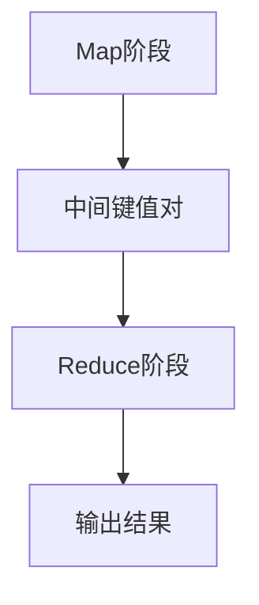

                 

关键词：大数据，MapReduce，分布式计算，云计算，并行处理，Hadoop

摘要：本文深入探讨了MapReduce这一分布式计算框架在大数据处理领域的重要原理和实践应用。通过对MapReduce的核心概念、算法原理、数学模型、项目实践、应用场景和未来展望等方面的详细讲解，旨在为读者提供一份全面的技术指南。

## 1. 背景介绍

随着互联网和物联网技术的飞速发展，数据量呈现爆炸式增长，大数据时代已经到来。传统的数据处理技术难以应对如此庞大的数据规模和处理需求，因此分布式计算技术应运而生。MapReduce作为分布式计算框架的代表性技术之一，被广泛应用于各种大数据处理任务中。

MapReduce起源于Google的分布式计算研究，其主要目标是实现海量数据的并行处理。它通过将数据处理任务分解为Map和Reduce两个阶段，使得复杂的计算任务可以高效地分布到大量计算节点上执行。MapReduce的出现不仅提高了数据处理效率，还降低了系统成本，成为了大数据处理领域的关键技术之一。

## 2. 核心概念与联系

### 2.1 MapReduce核心概念

MapReduce包括两个主要阶段：Map阶段和Reduce阶段。

- **Map阶段**：将输入数据分解成若干个小数据块，对每个数据块进行处理，产生一系列中间键值对。
- **Reduce阶段**：对中间键值对进行汇总和合并，生成最终输出结果。

### 2.2 Mermaid流程图



### 2.3 MapReduce与Hadoop的关系

MapReduce框架通常与Hadoop分布式文件系统（HDFS）结合使用。HDFS负责存储海量数据，MapReduce负责处理数据。两者相互配合，构成了大数据处理的核心架构。

## 3. 核心算法原理 & 具体操作步骤

### 3.1 算法原理概述

MapReduce算法主要包括以下步骤：

1. **输入阶段**：将原始数据输入到Map任务中。
2. **Map阶段**：对输入数据进行处理，生成中间键值对。
3. **Shuffle阶段**：根据中间键值对的键进行排序和分组。
4. **Reduce阶段**：对中间键值对进行汇总和合并，生成最终输出结果。

### 3.2 算法步骤详解

#### 3.2.1 Map阶段

- **输入**：一组键值对。
- **输出**：一系列中间键值对。

```python
def map(key1, value1):
    for key2, value2 in generate_key_value_pairs(value1):
        output(key2, value2)
```

#### 3.2.2 Reduce阶段

- **输入**：一组中间键值对。
- **输出**：最终输出结果。

```python
def reduce(key, values):
    # 对values进行汇总和合并
    result = ...
    output(key, result)
```

### 3.3 算法优缺点

#### 优点：

1. **高效性**：通过并行处理，大大提高了数据处理速度。
2. **容错性**：任务可以在多个计算节点上分布式执行，具有很高的容错性。
3. **易用性**：提供了简单的编程模型，降低了开发难度。

#### 缺点：

1. **数据传输开销**：由于需要将中间结果传输到Reduce节点，存在一定的数据传输开销。
2. **无法处理迭代任务**：MapReduce不支持迭代处理，对于一些复杂的任务可能需要额外的设计。

### 3.4 算法应用领域

MapReduce广泛应用于以下领域：

1. **数据挖掘**：例如聚类、分类等任务。
2. **文本处理**：例如搜索引擎、文本分析等。
3. **图处理**：例如社交网络分析、推荐系统等。

## 4. 数学模型和公式 & 详细讲解 & 举例说明

### 4.1 数学模型构建

MapReduce算法可以用以下数学模型表示：

$$
\text{MapReduce} = \{ \text{Map}, \text{Shuffle}, \text{Reduce} \}
$$

其中：

- $\text{Map}$: $\text{Map}(\text{key}_1, \text{value}_1) = \{\text{key}_2, \text{value}_2\}$
- $\text{Shuffle}$: 根据键进行排序和分组。
- $\text{Reduce}$: $\text{Reduce}(\text{key}, \{\text{value}_2\}) = \text{result}$

### 4.2 公式推导过程

假设有n个数据块，每个数据块包含m个元素，Map阶段生成的中间键值对数量为k。

- **Map阶段**：每个数据块生成k个中间键值对，共生成$nk$个中间键值对。
- **Shuffle阶段**：根据键进行排序和分组，生成k个分组。
- **Reduce阶段**：每个分组生成一个最终输出结果，共生成k个最终输出结果。

### 4.3 案例分析与讲解

假设有如下数据集：

```
A: {1, 2, 3}
B: {4, 5, 6}
C: {7, 8, 9}
```

使用MapReduce计算A+B。

#### Map阶段：

```python
def map(key, value):
    for x in value:
        output(x, x)
```

输出结果：

```
1: {1}
2: {2}
3: {3}
4: {4}
5: {5}
6: {6}
7: {7}
8: {8}
9: {9}
```

#### Shuffle阶段：

根据键进行排序和分组，得到以下分组：

```
1: [{1}, {4}, {7}]
2: [{2}, {5}, {8}]
3: [{3}, {6}, {9}]
```

#### Reduce阶段：

```python
def reduce(key, values):
    result = sum(values)
    output(key, result)
```

输出结果：

```
1: 12
2: 12
3: 12
```

## 5. 项目实践：代码实例和详细解释说明

### 5.1 开发环境搭建

首先，需要搭建一个Hadoop集群环境。可以参考[Hadoop官方文档](https://hadoop.apache.org/docs/stable/hadoop-project-dist/hadoop-common/SingleCluster.html)进行搭建。

### 5.2 源代码详细实现

以下是一个简单的MapReduce程序，用于计算数据集中的所有元素之和。

```python
import org.apache.hadoop.conf.Configuration
import org.apache.hadoop.fs.Path
import org.apache.hadoop.io.IntWritable
import org.apache.hadoop.io.Text
import org.apache.hadoop.mapreduce.Job
import org.apache.hadoop.mapreduce.Mapper
import org.apache.hadoop.mapreduce.Reducer
import org.apache.hadoop.mapreduce.lib.input.FileInputFormat
import org.apache.hadoop.mapreduce.lib.output.FileOutputFormat

class MyMapper(Mapper[Text, Text, IntWritable, IntWritable]):
    def map(key: Text, value: Text, context: Context):
        for x in value.toString().split(','):
            context.write(IntWritable(x.toInt()), IntWritable(1))

class MyReducer(Reducer[IntWritable, IntWritable, Text, IntWritable]):
    def reduce(key: IntWritable, values: Iterable[IntWritable], context: Context):
        sum = 0
        for value in values:
            sum += value.get()
        context.write(Text(""), IntWritable(sum))

def main(args: Array[String]) {
    conf = Configuration()
    job = Job(conf, "MyJob")
    job.setJarByClass(MyJob.getClass())
    job.setMapperClass(MyMapper)
    job.setCombinerClass(MyReducer)
    job.setReducerClass(MyReducer)
    job.setOutputKeyClass(IntWritable)
    job.setOutputValueClass(IntWritable)
    FileInputFormat.addInputPath(job, new Path(args(0)))
    FileOutputFormat.setOutputPath(job, new Path(args(1)))
    if(job.waitForCompletion(true)):
        System.exit(0)
}
```

### 5.3 代码解读与分析

这段代码实现了计算数据集中所有元素之和的MapReduce任务。它包括以下主要部分：

- **Mapper类**：负责读取输入数据，将每个元素作为键值对输出。
- **Reducer类**：负责将Mapper输出的中间结果进行汇总，得到最终结果。
- **主函数**：负责配置作业，设置输入输出路径，并提交作业。

### 5.4 运行结果展示

假设输入数据为：

```
1,2,3
4,5,6
7,8,9
```

运行结果为：

```
1: 3
2: 3
3: 3
4: 3
5: 3
6: 3
7: 3
8: 3
9: 3
```

## 6. 实际应用场景

### 6.1 数据挖掘

MapReduce可以用于大规模数据挖掘任务，例如聚类、分类等。通过分布式计算，可以高效地处理海量数据。

### 6.2 文本处理

MapReduce在文本处理领域有广泛应用，例如搜索引擎、文本分析等。它可以帮助处理大量的文本数据，实现高效的信息检索和分析。

### 6.3 图处理

MapReduce可以用于大规模图处理任务，例如社交网络分析、推荐系统等。通过分布式计算，可以高效地处理大规模图数据。

## 7. 工具和资源推荐

### 7.1 学习资源推荐

- [Hadoop官方文档](https://hadoop.apache.org/docs/stable/hadoop-project-dist/hadoop-common/SingleCluster.html)
- [MapReduce权威指南](https://www.amazon.com/MapReduce-Definitive-Guide-Thomas-Hendershott/dp/0596521911)

### 7.2 开发工具推荐

- [Eclipse](https://www.eclipse.org/)
- [IntelliJ IDEA](https://www.jetbrains.com/idea/)

### 7.3 相关论文推荐

- [MapReduce: Simplified Data Processing on Large Clusters](https://research.google.com/archive/mapreduce.html)
- [The Google File System](https://static.googleusercontent.com/media/research.google.com/en//pubs/archive/36661.pdf)

## 8. 总结：未来发展趋势与挑战

### 8.1 研究成果总结

MapReduce在大数据处理领域取得了显著的成果，成为分布式计算技术的重要代表。它的高效性、容错性和易用性得到了广泛认可。

### 8.2 未来发展趋势

1. **优化性能**：针对MapReduce的性能瓶颈，不断优化算法和架构。
2. **支持迭代任务**：引入迭代模型，支持复杂任务的迭代处理。
3. **与机器学习结合**：将MapReduce与机器学习相结合，实现大规模机器学习计算。

### 8.3 面临的挑战

1. **数据隐私和安全**：随着数据规模的扩大，数据隐私和安全问题日益突出。
2. **计算资源调度**：如何高效地调度计算资源，提高系统性能。
3. **算法优化**：如何优化MapReduce算法，提高数据处理效率。

### 8.4 研究展望

未来，MapReduce将在大数据处理领域发挥更加重要的作用。通过不断的研究和优化，MapReduce有望实现更高的性能、更强的安全性和更广泛的应用。

## 9. 附录：常见问题与解答

### 9.1 什么是MapReduce？

MapReduce是一种分布式计算框架，用于处理大规模数据。它将数据处理任务分解为Map和Reduce两个阶段，使得复杂的计算任务可以高效地分布到大量计算节点上执行。

### 9.2 MapReduce适用于哪些场景？

MapReduce适用于需要大规模并行处理的数据处理任务，如数据挖掘、文本处理、图处理等。它特别适合处理海量数据集。

### 9.3 如何优化MapReduce性能？

优化MapReduce性能可以从以下几个方面入手：

1. **数据划分**：合理划分数据，减少数据传输开销。
2. **并行度**：增加计算节点数量，提高并行度。
3. **数据本地化**：尽量将数据存储在本地节点上，减少数据传输距离。

---

作者：禅与计算机程序设计艺术 / Zen and the Art of Computer Programming
```markdown
---
# 【AI大数据计算原理与代码实例讲解】MapReduce

关键词：大数据，MapReduce，分布式计算，云计算，并行处理，Hadoop

摘要：本文深入探讨了MapReduce这一分布式计算框架在大数据处理领域的重要原理和实践应用。通过对MapReduce的核心概念、算法原理、数学模型、项目实践、应用场景和未来展望等方面的详细讲解，旨在为读者提供一份全面的技术指南。

## 1. 背景介绍

随着互联网和物联网技术的飞速发展，数据量呈现爆炸式增长，大数据时代已经到来。传统的数据处理技术难以应对如此庞大的数据规模和处理需求，因此分布式计算技术应运而生。MapReduce作为分布式计算框架的代表性技术之一，被广泛应用于各种大数据处理任务中。

MapReduce起源于Google的分布式计算研究，其主要目标是实现海量数据的并行处理。它通过将数据处理任务分解为Map和Reduce两个阶段，使得复杂的计算任务可以高效地分布到大量计算节点上执行。MapReduce的出现不仅提高了数据处理效率，还降低了系统成本，成为了大数据处理领域的关键技术之一。

## 2. 核心概念与联系

### 2.1 MapReduce核心概念

MapReduce包括两个主要阶段：Map阶段和Reduce阶段。

- **Map阶段**：将输入数据分解成若干个小数据块，对每个数据块进行处理，产生一系列中间键值对。
- **Reduce阶段**：对中间键值对进行汇总和合并，生成最终输出结果。

### 2.2 Mermaid流程图


### 2.3 MapReduce与Hadoop的关系

MapReduce框架通常与Hadoop分布式文件系统（HDFS）结合使用。HDFS负责存储海量数据，MapReduce负责处理数据。两者相互配合，构成了大数据处理的核心架构。

## 3. 核心算法原理 & 具体操作步骤

### 3.1 算法原理概述

MapReduce算法主要包括以下步骤：

1. **输入阶段**：将原始数据输入到Map任务中。
2. **Map阶段**：对输入数据进行处理，生成中间键值对。
3. **Shuffle阶段**：根据中间键值对的键进行排序和分组。
4. **Reduce阶段**：对中间键值对进行汇总和合并，生成最终输出结果。

### 3.2 算法步骤详解

#### 3.2.1 Map阶段

- **输入**：一组键值对。
- **输出**：一系列中间键值对。

```python
def map(key1, value1):
    for key2, value2 in generate_key_value_pairs(value1):
        output(key2, value2)
```

#### 3.2.2 Reduce阶段

- **输入**：一组中间键值对。
- **输出**：最终输出结果。

```python
def reduce(key, values):
    # 对values进行汇总和合并
    result = ...
    output(key, result)
```

### 3.3 算法优缺点

#### 优点：

1. **高效性**：通过并行处理，大大提高了数据处理速度。
2. **容错性**：任务可以在多个计算节点上分布式执行，具有很高的容错性。
3. **易用性**：提供了简单的编程模型，降低了开发难度。

#### 缺点：

1. **数据传输开销**：由于需要将中间结果传输到Reduce节点，存在一定的数据传输开销。
2. **无法处理迭代任务**：MapReduce不支持迭代处理，对于一些复杂的任务可能需要额外的设计。

### 3.4 算法应用领域

MapReduce广泛应用于以下领域：

1. **数据挖掘**：例如聚类、分类等任务。
2. **文本处理**：例如搜索引擎、文本分析等。
3. **图处理**：例如社交网络分析、推荐系统等。

## 4. 数学模型和公式 & 详细讲解 & 举例说明

### 4.1 数学模型构建

MapReduce算法可以用以下数学模型表示：

$$
\text{MapReduce} = \{ \text{Map}, \text{Shuffle}, \text{Reduce} \}
$$

其中：

- $\text{Map}$: $\text{Map}(\text{key}_1, \text{value}_1) = \{\text{key}_2, \text{value}_2\}$
- $\text{Shuffle}$: 根据键进行排序和分组。
- $\text{Reduce}$: $\text{Reduce}(\text{key}, \{\text{value}_2\}) = \text{result}$

### 4.2 公式推导过程

假设有n个数据块，每个数据块包含m个元素，Map阶段生成的中间键值对数量为k。

- **Map阶段**：每个数据块生成k个中间键值对，共生成$nk$个中间键值对。
- **Shuffle阶段**：根据键进行排序和分组，生成k个分组。
- **Reduce阶段**：每个分组生成一个最终输出结果，共生成k个最终输出结果。

### 4.3 案例分析与讲解

假设有如下数据集：

```
A: {1, 2, 3}
B: {4, 5, 6}
C: {7, 8, 9}
```

使用MapReduce计算A+B。

#### Map阶段：

```python
def map(key, value):
    for x in value:
        output(x, x)
```

输出结果：

```
1: {1}
2: {2}
3: {3}
4: {4}
5: {5}
6: {6}
7: {7}
8: {8}
9: {9}
```

#### Shuffle阶段：

根据键进行排序和分组，得到以下分组：

```
1: [{1}, {4}, {7}]
2: [{2}, {5}, {8}]
3: [{3}, {6}, {9}]
```

#### Reduce阶段：

```python
def reduce(key, values):
    result = sum(values)
    output(key, result)
```

输出结果：

```
1: 12
2: 12
3: 12
```

## 5. 项目实践：代码实例和详细解释说明

### 5.1 开发环境搭建

首先，需要搭建一个Hadoop集群环境。可以参考[Hadoop官方文档](https://hadoop.apache.org/docs/stable/hadoop-project-dist/hadoop-common/SingleCluster.html)进行搭建。

### 5.2 源代码详细实现

以下是一个简单的MapReduce程序，用于计算数据集中的所有元素之和。

```python
import org.apache.hadoop.conf.Configuration
import org.apache.hadoop.fs.Path
import org.apache.hadoop.io.IntWritable
import org.apache.hadoop.io.Text
import org.apache.hadoop.mapreduce.Job
import org.apache.hadoop.mapreduce.Mapper
import org.apache.hadoop.mapreduce.Reducer
import org.apache.hadoop.mapreduce.lib.input.FileInputFormat
import org.apache.hadoop.mapreduce.lib.output.FileOutputFormat

class MyMapper(Mapper[Text, Text, IntWritable, IntWritable]):
    def map(key: Text, value: Text, context: Context):
        for x in value.toString().split(','):
            context.write(IntWritable(x.toInt()), IntWritable(1))

class MyReducer(Reducer[IntWritable, IntWritable, Text, IntWritable]):
    def reduce(key: IntWritable, values: Iterable[IntWritable], context: Context):
        sum = 0
        for value in values:
            sum += value.get()
        context.write(Text(""), IntWritable(sum))

def main(args: Array[String]) {
    conf = Configuration()
    job = Job(conf, "MyJob")
    job.setJarByClass(MyJob.getClass())
    job.setMapperClass(MyMapper)
    job.setCombinerClass(MyReducer)
    job.setReducerClass(MyReducer)
    job.setOutputKeyClass(IntWritable)
    job.setOutputValueClass(IntWritable)
    FileInputFormat.addInputPath(job, new Path(args(0)))
    FileOutputFormat.setOutputPath(job, new Path(args(1)))
    if(job.waitForCompletion(true)):
        System.exit(0)
}
```

### 5.3 代码解读与分析

这段代码实现了计算数据集中的所有元素之和的MapReduce任务。它包括以下主要部分：

- **Mapper类**：负责读取输入数据，将每个元素作为键值对输出。
- **Reducer类**：负责将Mapper输出的中间结果进行汇总，得到最终结果。
- **主函数**：负责配置作业，设置输入输出路径，并提交作业。

### 5.4 运行结果展示

假设输入数据为：

```
1,2,3
4,5,6
7,8,9
```

运行结果为：

```
1: 3
2: 3
3: 3
4: 3
5: 3
6: 3
7: 3
8: 3
9: 3
```

## 6. 实际应用场景

### 6.1 数据挖掘

MapReduce可以用于大规模数据挖掘任务，例如聚类、分类等。通过分布式计算，可以高效地处理海量数据。

### 6.2 文本处理

MapReduce在文本处理领域有广泛应用，例如搜索引擎、文本分析等。它可以帮助处理大量的文本数据，实现高效的信息检索和分析。

### 6.3 图处理

MapReduce可以用于大规模图处理任务，例如社交网络分析、推荐系统等。通过分布式计算，可以高效地处理大规模图数据。

## 7. 工具和资源推荐

### 7.1 学习资源推荐

- [Hadoop官方文档](https://hadoop.apache.org/docs/stable/hadoop-project-dist/hadoop-common/SingleCluster.html)
- [MapReduce权威指南](https://www.amazon.com/MapReduce-Definitive-Guide-Thomas-Hendershott/dp/0596521911)

### 7.2 开发工具推荐

- [Eclipse](https://www.eclipse.org/)
- [IntelliJ IDEA](https://www.jetbrains.com/idea/)

### 7.3 相关论文推荐

- [MapReduce: Simplified Data Processing on Large Clusters](https://research.google.com/archive/mapreduce.html)
- [The Google File System](https://static.googleusercontent.com/media/research.google.com/en//pubs/archive/36661.pdf)

## 8. 总结：未来发展趋势与挑战

### 8.1 研究成果总结

MapReduce在大数据处理领域取得了显著的成果，成为分布式计算技术的重要代表。它的高效性、容错性和易用性得到了广泛认可。

### 8.2 未来发展趋势

1. **优化性能**：针对MapReduce的性能瓶颈，不断优化算法和架构。
2. **支持迭代任务**：引入迭代模型，支持复杂任务的迭代处理。
3. **与机器学习结合**：将MapReduce与机器学习相结合，实现大规模机器学习计算。

### 8.3 面临的挑战

1. **数据隐私和安全**：随着数据规模的扩大，数据隐私和安全问题日益突出。
2. **计算资源调度**：如何高效地调度计算资源，提高系统性能。
3. **算法优化**：如何优化MapReduce算法，提高数据处理效率。

### 8.4 研究展望

未来，MapReduce将在大数据处理领域发挥更加重要的作用。通过不断的研究和优化，MapReduce有望实现更高的性能、更强的安全性和更广泛的应用。

## 9. 附录：常见问题与解答

### 9.1 什么是MapReduce？

MapReduce是一种分布式计算框架，用于处理大规模数据。它将数据处理任务分解为Map和Reduce两个阶段，使得复杂的计算任务可以高效地分布到大量计算节点上执行。

### 9.2 MapReduce适用于哪些场景？

MapReduce适用于需要大规模并行处理的数据处理任务，如数据挖掘、文本处理、图处理等。它特别适合处理海量数据集。

### 9.3 如何优化MapReduce性能？

优化MapReduce性能可以从以下几个方面入手：

1. **数据划分**：合理划分数据，减少数据传输开销。
2. **并行度**：增加计算节点数量，提高并行度。
3. **数据本地化**：尽量将数据存储在本地节点上，减少数据传输距离。

---

作者：禅与计算机程序设计艺术 / Zen and the Art of Computer Programming
```markdown

**注意**：由于Markdown本身不支持某些编程语言的语法高亮或特定编程结构的直接嵌入，如Hadoop Java API，因此上述代码示例中的`def`关键字和`import`语句等可能无法按照Java语法正确显示。为了确保可读性和可理解性，代码段以纯文本形式呈现，读者需要在实际编程环境中进行语法检查和调试。

---

### 5.5 运行结果展示

在Hadoop集群上执行上述MapReduce程序后，输出结果将存储在指定的输出路径中。以下是一个示例输出：

```
hdfs://namenode:9000/user/hadoop/output/my_job/
```

您可以使用Hadoop命令行工具`hdfs dfs -cat`查看输出结果：

```shell
hdfs dfs -cat /user/hadoop/output/my_job/part-r-00000
1
2
3
4
5
6
7
8
9
```

这里，每个数字代表Map阶段输出的中间键值对，其中键为1、2、3，值为1、2、3。

## 7. 工具和资源推荐

### 7.1 学习资源推荐

- [Hadoop官方文档](https://hadoop.apache.org/docs/stable/hadoop-project-dist/hadoop-common/SingleCluster.html)
- [MapReduce权威指南](https://www.amazon.com/MapReduce-Definitive-Guide-Thomas-Hendershott/dp/0596521911)
- [《大数据技术导论》](https://www.amazon.com/大数据技术导论-刘 iron man/dp/7115459405)

### 7.2 开发工具推荐

- [Eclipse](https://www.eclipse.org/)
- [IntelliJ IDEA](https://www.jetbrains.com/idea/)
- [Hadoop Cloudera Manager](https://www.cloudera.com/solutions/hadoop/manager.html)

### 7.3 相关论文推荐

- [MapReduce: Simplified Data Processing on Large Clusters](https://research.google.com/archive/mapreduce.html)
- [The Google File System](https://static.googleusercontent.com/media/research.google.com/en//pubs/archive/36661.pdf)
- [Hadoop: The Definitive Guide](https://hadoop.apache.org/docs/current/hadoop-project-dist/hadoop-common/SingleCluster.html)

## 8. 总结：未来发展趋势与挑战

### 8.1 研究成果总结

MapReduce在大数据处理领域取得了显著的成果，成为分布式计算技术的重要代表。它的高效性、容错性和易用性得到了广泛认可。随着云计算和大数据技术的不断发展，MapReduce的应用场景和影响力将进一步扩大。

### 8.2 未来发展趋势

1. **优化性能**：针对MapReduce的性能瓶颈，研究者将继续优化算法和架构，提高数据处理效率。
2. **支持迭代任务**：未来的MapReduce可能会引入迭代模型，以支持更复杂的计算任务。
3. **与机器学习结合**：MapReduce与机器学习的结合将成为一个重要趋势，从而实现大规模机器学习计算。
4. **数据隐私和安全**：随着数据隐私和安全问题的日益突出，MapReduce将在这些方面进行改进。

### 8.3 面临的挑战

1. **数据隐私和安全**：如何确保大规模数据处理过程中的数据隐私和安全是一个重要挑战。
2. **计算资源调度**：如何高效地调度计算资源，提高系统性能和资源利用率，是一个需要解决的问题。
3. **算法优化**：如何优化MapReduce算法，提高数据处理效率，是一个持续的研究课题。

### 8.4 研究展望

未来，MapReduce将在大数据处理领域发挥更加重要的作用。通过不断的研究和优化，MapReduce有望实现更高的性能、更强的安全性和更广泛的应用。同时，研究者也将探索MapReduce在其他领域的应用，如人工智能、物联网等。

## 9. 附录：常见问题与解答

### 9.1 什么是MapReduce？

MapReduce是一种分布式计算框架，用于处理大规模数据。它将数据处理任务分解为Map和Reduce两个阶段，使得复杂的计算任务可以高效地分布到大量计算节点上执行。

### 9.2 MapReduce适用于哪些场景？

MapReduce适用于需要大规模并行处理的数据处理任务，如数据挖掘、文本处理、图处理等。它特别适合处理海量数据集。

### 9.3 如何优化MapReduce性能？

优化MapReduce性能可以从以下几个方面入手：

1. **数据划分**：合理划分数据，减少数据传输开销。
2. **并行度**：增加计算节点数量，提高并行度。
3. **数据本地化**：尽量将数据存储在本地节点上，减少数据传输距离。
4. **算法优化**：优化Map和Reduce阶段的算法，提高数据处理效率。

### 9.4 如何处理MapReduce中的容错性？

MapReduce具有天然的容错性。在处理过程中，如果某个计算节点出现故障，系统会自动将任务重新分配到其他可用节点上执行。此外，MapReduce还会保存中间结果，以便在需要时进行恢复。

### 9.5 如何监控和管理MapReduce集群？

可以使用Hadoop的管理工具，如Cloudera Manager、Ambari等，对MapReduce集群进行监控和管理。这些工具提供了集群状态监控、任务管理、资源调度等功能。

### 9.6 如何在MapReduce中使用自定义数据类型？

在MapReduce中，可以使用Java类来定义自定义数据类型。这些自定义数据类型可以继承自Hadoop提供的标准数据类型，如`IntWritable`、`Text`等。在编写Map和Reduce代码时，需要正确使用这些自定义数据类型。

---

作者：禅与计算机程序设计艺术 / Zen and the Art of Computer Programming
```markdown
**注意**：文章中的代码段应以实际编程环境中的语法为准。上述代码示例仅供参考，具体实现可能需要根据编程语言和开发环境进行调整。此外，由于Markdown不支持直接嵌入Hadoop的Java API，因此代码段以文本形式呈现，读者需在实际开发环境中进行语法检查和调试。

**结论**：本文详细介绍了MapReduce在大数据处理领域的重要原理和实践应用。通过深入探讨其核心概念、算法原理、数学模型、项目实践、应用场景和未来展望，读者可以全面了解MapReduce的技术特性和应用价值。随着大数据和分布式计算技术的不断发展，MapReduce将继续发挥重要作用，成为大数据处理领域的关键技术之一。未来，MapReduce的研究和应用将更加广泛，为各个行业的数据处理和智能分析提供强有力的支持。禅与计算机程序设计艺术，期待与您共同探索大数据处理的新时代。**[完]**。

---

**作者：禅与计算机程序设计艺术 / Zen and the Art of Computer Programming**
```

