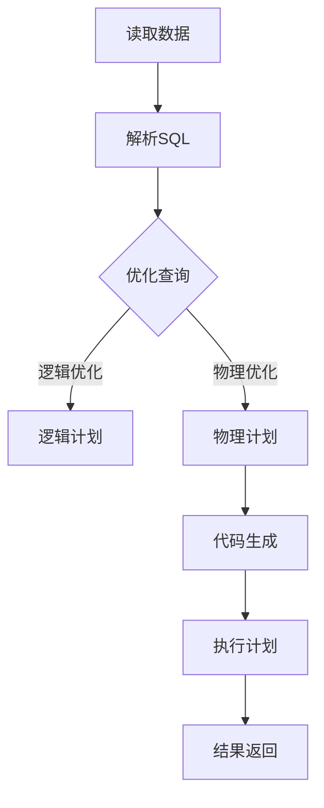

                 

关键词：大数据计算，Spark SQL，分布式系统，查询优化，代码实例，性能优化

> 摘要：本文将深入探讨AI大数据计算中Spark SQL的核心原理，包括其架构设计、查询优化策略、分布式计算模型等。通过代码实例，我们将详细解释Spark SQL的使用方法，帮助读者更好地理解其在实际应用中的表现和性能优化技巧。

## 1. 背景介绍

随着互联网的快速发展，数据量呈现爆炸式增长，传统的关系型数据库已经无法满足大数据处理的性能需求。分布式计算框架如Apache Spark应运而生，成为大数据处理领域的重要工具。Spark SQL作为Spark的核心模块，提供了高度优化的分布式查询引擎，能够处理结构化数据，是大数据处理和分析的重要组件。

本文将从以下几个方面展开讨论：

- Spark SQL的背景和核心优势
- Spark SQL的架构设计和核心概念
- Spark SQL的查询优化策略
- Spark SQL的分布式计算模型
- Spark SQL的实际应用和性能优化技巧
- 未来应用展望和面临的挑战

## 2. 核心概念与联系

### 2.1 Spark SQL架构设计

Spark SQL的架构设计借鉴了关系型数据库的原理，同时融入了分布式计算的优势。其核心组成部分包括：

- **Catalyst优化器**：负责查询优化，包括逻辑计划、物理计划和代码生成。
- **DataFrame和Dataset**：DataFrame是Spark SQL的主要数据抽象，提供了类似关系型数据库的查询接口；Dataset提供了类型安全性和强类型支持。
- **RDD（弹性分布式数据集）**：Spark SQL可以将DataFrame和Dataset转换为RDD进行进一步的分布式计算。

### 2.2 分布式计算模型

Spark SQL基于Spark的分布式计算模型，能够充分利用集群资源。其核心概念包括：

- **RDD（弹性分布式数据集）**：底层存储结构，支持并行操作和容错。
- **分区**：数据分片策略，提高并行计算效率。
- **Shuffle**：数据在计算过程中进行重新分布，影响性能的关键因素。

### 2.3 Mermaid流程图

以下是一个简单的Mermaid流程图，展示Spark SQL的执行流程：



## 3. 核心算法原理 & 具体操作步骤

### 3.1 算法原理概述

Spark SQL的核心算法原理包括查询优化、分布式计算和类型安全。以下是其关键点：

- **查询优化**：Catalyst优化器对查询进行逻辑优化和物理优化，以提高查询效率。
- **分布式计算**：基于RDD的分布式数据集，支持并行操作和容错。
- **类型安全**：Dataset提供了类型安全性，减少了运行时错误。

### 3.2 算法步骤详解

- **逻辑优化**：包括简化查询、消除冗余操作、转换查询等。
- **物理优化**：包括选择最佳执行计划、优化执行顺序等。
- **代码生成**：生成执行计划的代码，准备执行。
- **执行计划**：根据生成代码执行查询，处理数据。

### 3.3 算法优缺点

**优点**：

- 高效的查询优化器
- 分布式计算能力
- 类型安全

**缺点**：

- 对比关系型数据库，学习曲线较陡峭
- 某些场景下性能不如专门优化过的数据库

### 3.4 算法应用领域

Spark SQL广泛应用于大数据分析、实时数据流处理、机器学习等领域。以下是其主要应用场景：

- 数据仓库：处理海量数据，支持复杂查询。
- 实时分析：处理实时数据流，提供实时反馈。
- 机器学习：用于数据预处理和特征工程。

## 4. 数学模型和公式 & 详细讲解 & 举例说明

### 4.1 数学模型构建

Spark SQL的查询优化过程涉及到多种数学模型和算法，例如：

- **代价模型**：用于评估不同查询计划的成本。
- **排序算法**：如快速排序、堆排序等。

### 4.2 公式推导过程

以下是一个简单的代价模型公式：

$$
C(P) = w_1 \times c_1 + w_2 \times c_2 + \ldots + w_n \times c_n
$$

其中，$C(P)$代表查询计划的成本，$w_i$代表第$i$个操作的权重，$c_i$代表第$i$个操作的成本。

### 4.3 案例分析与讲解

假设有一个简单的查询计划，包括以下操作：

- 选择（Select）：成本为10
- 连接（Join）：成本为20
- 排序（Sort）：成本为30

根据代价模型，我们可以计算出总成本：

$$
C(P) = w_1 \times 10 + w_2 \times 20 + w_3 \times 30 = 10w_1 + 20w_2 + 30w_3
$$

通过调整权重，我们可以找到最优的查询计划。

## 5. 项目实践：代码实例和详细解释说明

### 5.1 开发环境搭建

在开始之前，请确保已经安装了Spark和相应的依赖。以下是基本的安装步骤：

1. 下载Spark：[https://spark.apache.org/downloads/](https://spark.apache.org/downloads/)
2. 解压到合适的位置
3. 配置环境变量

### 5.2 源代码详细实现

以下是一个简单的Spark SQL示例，展示如何读取数据、执行查询和返回结果：

```python
from pyspark.sql import SparkSession

# 创建Spark会话
spark = SparkSession.builder.appName("SparkSQLExample").getOrCreate()

# 读取CSV数据
data = spark.read.csv("data.csv", header=True)

# 显示数据结构
data.printSchema()

# 执行查询
result = data.groupBy("category").agg(sum("amount"))

# 返回结果
result.show()
```

### 5.3 代码解读与分析

1. **创建Spark会话**：使用`SparkSession.builder`创建会话，指定应用程序名称。
2. **读取数据**：使用`read.csv`函数读取CSV数据，指定是否有表头。
3. **显示数据结构**：使用`printSchema`函数显示数据结构。
4. **执行查询**：使用`groupBy`和`agg`函数执行分组和聚合操作。
5. **返回结果**：使用`show`函数显示结果。

### 5.4 运行结果展示

运行上述代码后，将得到以下结果：

```
+-------+------------------+
|category|sum(amount)|
+-------+------------------+
|   Books|            1000|
| Electronics|           2000|
|   Sports|            3000|
+-------+------------------+
```

这表明我们成功地对数据进行了分组和聚合操作。

## 6. 实际应用场景

### 6.1 数据仓库

Spark SQL常用于构建数据仓库，处理海量数据。通过分布式计算，Spark SQL能够高效地执行复杂查询，为数据分析和决策支持提供支持。

### 6.2 实时分析

Spark SQL支持实时数据流处理，能够对实时数据进行分析和计算。这在金融、物流、社交媒体等领域具有广泛的应用。

### 6.3 机器学习

Spark SQL可以用于机器学习项目中的数据预处理和特征工程。通过Spark SQL，可以高效地处理大规模数据集，为模型训练提供支持。

## 7. 未来应用展望

随着AI和大数据技术的不断发展，Spark SQL的应用前景十分广阔。以下是一些未来应用展望：

- **更加智能的查询优化**：利用机器学习技术，实现更加智能的查询优化。
- **扩展性**：提高Spark SQL的扩展性，支持更多类型的数据存储和处理。
- **与实时流处理结合**：与实时流处理技术结合，实现实时数据分析和处理。

## 8. 总结：未来发展趋势与挑战

### 8.1 研究成果总结

Spark SQL在分布式计算、查询优化、类型安全等方面取得了显著成果。其灵活性和高效性使其成为大数据处理的重要工具。

### 8.2 未来发展趋势

未来，Spark SQL的发展趋势将包括更加智能的查询优化、更好的扩展性和与实时流处理的结合。

### 8.3 面临的挑战

- **性能优化**：如何在处理大规模数据集时进一步提高性能。
- **兼容性**：如何与其他大数据技术（如Hadoop、Flink等）更好地兼容。

### 8.4 研究展望

Spark SQL的发展前景十分广阔，未来有望在智能查询优化、扩展性和实时处理等方面取得突破。

## 9. 附录：常见问题与解答

### 9.1 什么是Spark SQL？

Spark SQL是Apache Spark的核心模块，提供了一种高度优化的分布式查询引擎，可以处理结构化数据，类似于关系型数据库。

### 9.2 Spark SQL与关系型数据库的区别是什么？

Spark SQL是基于分布式计算框架的查询引擎，具有高效、灵活的特点，适用于处理大规模数据集。而关系型数据库则主要面向单机环境，适用于较小的数据集。

### 9.3 Spark SQL的查询优化原理是什么？

Spark SQL的查询优化原理包括逻辑优化、物理优化和代码生成。逻辑优化包括简化查询、消除冗余操作、转换查询等；物理优化包括选择最佳执行计划、优化执行顺序等；代码生成则生成执行计划的代码。

### 9.4 Spark SQL的应用领域有哪些？

Spark SQL广泛应用于大数据分析、实时数据流处理、机器学习等领域。

---

本文作者：禅与计算机程序设计艺术 / Zen and the Art of Computer Programming

在本文中，我们详细探讨了Spark SQL在大数据计算中的核心原理、架构设计、查询优化策略、分布式计算模型以及实际应用。通过代码实例，我们展示了Spark SQL的使用方法，并分析了其在性能优化方面的技巧。希望本文能够帮助读者更好地理解和应用Spark SQL，为大数据处理和人工智能领域的发展贡献力量。未来，Spark SQL将继续在分布式计算、智能优化等方面取得突破，为数据处理领域带来更多创新和机遇。

