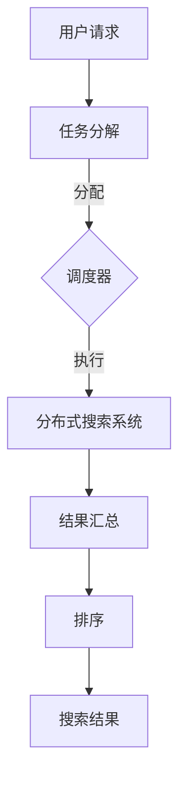

                 

关键词：分布式搜索，大数据处理，人工智能，算法原理，代码实例

> 摘要：本文将深入探讨分布式搜索在大数据处理和人工智能领域中的原理与应用。通过对核心概念、算法原理、数学模型及项目实践的详细讲解，帮助读者全面理解分布式搜索技术，并掌握其实际操作技能。

## 1. 背景介绍

随着互联网的飞速发展和大数据时代的到来，数据量呈现爆炸式增长，传统的集中式数据处理方式已无法满足海量数据的高效处理需求。分布式搜索作为一种分布式计算技术，在大数据处理和人工智能领域发挥着重要作用。本文旨在介绍分布式搜索的基本原理、核心算法、数学模型以及实际应用，帮助读者深入了解并掌握这一关键技术。

### 分布式搜索的定义和重要性

分布式搜索是指将一个搜索任务分解为多个子任务，由多个计算节点并行处理，最终汇总结果的一种计算模式。分布式搜索可以显著提高数据处理速度和系统性能，有效应对大规模数据的搜索需求。

分布式搜索的重要性体现在以下几个方面：

1. **处理速度提升**：通过并行处理，分布式搜索可以在短时间内处理大量数据，满足实时搜索的需求。
2. **系统可扩展性**：分布式搜索可以将任务分散到多个计算节点，根据需求动态扩展系统规模，提高系统的可扩展性和容错性。
3. **数据处理能力增强**：分布式搜索可以利用多个节点的计算资源，处理更复杂的数据结构和算法，增强数据处理能力。

### 大数据处理与人工智能的关系

大数据处理和人工智能是相辅相成的领域。大数据提供了丰富的数据资源，为人工智能算法提供了训练数据和验证数据，而人工智能则通过深度学习、机器学习等技术对大数据进行分析和挖掘，提取有价值的信息。

分布式搜索在大数据处理和人工智能中的应用，主要体现在以下几个方面：

1. **搜索引擎优化**：分布式搜索可以提高搜索引擎的性能和响应速度，为用户提供更优质的搜索体验。
2. **推荐系统构建**：分布式搜索可以帮助推荐系统快速定位用户感兴趣的内容，提高推荐系统的准确性和覆盖率。
3. **数据挖掘与分析**：分布式搜索可以高效处理大规模数据，为数据挖掘和分析提供基础支持。

## 2. 核心概念与联系

### 分布式搜索的核心概念

1. **分布式搜索系统**：分布式搜索系统由多个计算节点组成，每个节点负责处理一部分搜索任务。
2. **任务分解与调度**：将整个搜索任务分解为多个子任务，由各个计算节点并行处理，并通过调度器进行任务的分配和协调。
3. **结果汇总与排序**：各个计算节点处理完毕后，将结果汇总并进行排序，生成最终的搜索结果。

### 分布式搜索的架构与联系

#### Mermaid 流程图



#### 分布式搜索的关键环节

1. **任务分解**：将整个搜索任务分解为多个子任务，每个子任务由不同的计算节点处理。
2. **调度器**：负责任务的分配和协调，确保各个计算节点能够高效地执行子任务。
3. **分布式搜索系统**：由多个计算节点组成，每个节点负责处理一部分子任务。
4. **结果汇总与排序**：将各个计算节点的结果汇总并进行排序，生成最终的搜索结果。

### 分布式搜索的优缺点

#### 优点

1. **高效性**：通过并行处理，分布式搜索可以显著提高数据处理速度。
2. **可扩展性**：分布式搜索可以根据需求动态扩展系统规模，提高系统的可扩展性和容错性。
3. **可靠性**：分布式搜索系统具有较高的容错性，即使部分节点故障，系统仍能正常运行。

#### 缺点

1. **复杂性**：分布式搜索系统的设计和实现较为复杂，需要处理节点间的通信和协调问题。
2. **性能瓶颈**：分布式搜索系统的性能瓶颈主要在于网络通信和结果汇总环节。

### 分布式搜索的应用领域

1. **搜索引擎**：分布式搜索可以提高搜索引擎的性能和响应速度，为用户提供更优质的搜索体验。
2. **推荐系统**：分布式搜索可以帮助推荐系统快速定位用户感兴趣的内容，提高推荐系统的准确性和覆盖率。
3. **数据挖掘与分析**：分布式搜索可以高效处理大规模数据，为数据挖掘和分析提供基础支持。

## 3. 核心算法原理 & 具体操作步骤

### 3.1 算法原理概述

分布式搜索的核心算法包括任务分解、调度、并行处理和结果汇总。以下将分别介绍这些算法的原理和操作步骤。

#### 任务分解

任务分解是将整个搜索任务分解为多个子任务，每个子任务由不同的计算节点处理。任务分解的关键在于如何将数据集划分为多个部分，并确保每个子任务都能独立完成。

#### 调度

调度是指将子任务分配给各个计算节点，并确保节点之间能够高效地协调和通信。调度算法需要考虑以下因素：

1. **负载均衡**：确保各个计算节点的任务量大致相同，避免部分节点过载。
2. **容错性**：在节点故障时，能够自动重新分配任务，保证系统正常运行。

#### 并行处理

并行处理是指多个计算节点同时执行子任务，加快数据处理速度。并行处理的关键在于如何优化节点的计算和通信效率。

#### 结果汇总

结果汇总是指将各个计算节点的结果汇总并排序，生成最终的搜索结果。结果汇总需要考虑以下因素：

1. **去重**：避免重复的结果出现。
2. **排序**：按照相关度或重要性对结果进行排序，提高用户体验。

### 3.2 算法步骤详解

#### 步骤1：任务分解

1. **划分数据集**：将整个数据集划分为多个部分，每个部分由不同的计算节点处理。
2. **确定子任务**：为每个数据部分确定一个子任务，子任务的目标是搜索与特定关键词相关的内容。

#### 步骤2：调度

1. **初始化调度器**：创建调度器，初始化各个计算节点的状态。
2. **分配任务**：将子任务分配给各个计算节点，确保负载均衡。
3. **处理节点故障**：在节点故障时，自动重新分配任务，保证系统正常运行。

#### 步骤3：并行处理

1. **执行子任务**：各个计算节点同时执行子任务，加快数据处理速度。
2. **优化计算和通信效率**：通过并行计算和优化网络通信，提高系统的整体性能。

#### 步骤4：结果汇总

1. **汇总结果**：将各个计算节点的结果汇总到一个数据集中。
2. **去重**：删除重复的结果，避免重复的信息。
3. **排序**：按照相关度或重要性对结果进行排序。

### 3.3 算法优缺点

#### 优点

1. **高效性**：通过并行处理，分布式搜索可以显著提高数据处理速度。
2. **可扩展性**：分布式搜索可以根据需求动态扩展系统规模，提高系统的可扩展性和容错性。
3. **可靠性**：分布式搜索系统具有较高的容错性，即使部分节点故障，系统仍能正常运行。

#### 缺点

1. **复杂性**：分布式搜索系统的设计和实现较为复杂，需要处理节点间的通信和协调问题。
2. **性能瓶颈**：分布式搜索系统的性能瓶颈主要在于网络通信和结果汇总环节。

### 3.4 算法应用领域

分布式搜索算法在多个领域具有广泛的应用：

1. **搜索引擎**：分布式搜索可以提高搜索引擎的性能和响应速度，为用户提供更优质的搜索体验。
2. **推荐系统**：分布式搜索可以帮助推荐系统快速定位用户感兴趣的内容，提高推荐系统的准确性和覆盖率。
3. **数据挖掘与分析**：分布式搜索可以高效处理大规模数据，为数据挖掘和分析提供基础支持。

## 4. 数学模型和公式 & 详细讲解 & 举例说明

### 4.1 数学模型构建

在分布式搜索中，数学模型主要用于描述任务分解、调度、并行处理和结果汇总等环节。以下构建一个简单的数学模型，用于描述分布式搜索的基本原理。

#### 模型假设

1. **数据集**：假设数据集D包含n个数据元素，每个元素表示一个文档。
2. **计算节点**：假设系统包含m个计算节点，每个节点表示一个处理器。
3. **搜索关键词**：假设搜索关键词为K。

#### 模型定义

1. **子任务**：将数据集D划分为m个子任务，每个子任务包含一部分文档，由不同的计算节点处理。
2. **调度策略**：定义一个调度策略S，用于分配子任务给计算节点。
3. **并行处理**：定义一个并行处理函数P，用于计算每个子任务的结果。
4. **结果汇总**：定义一个结果汇总函数R，用于将各个计算节点的结果汇总并排序。

### 4.2 公式推导过程

#### 任务分解

任务分解是将数据集D划分为m个子任务，每个子任务包含k个文档。任务分解的公式如下：

$$
D = D_1 \cup D_2 \cup ... \cup D_m \\
D_i = \{ d_{i1}, d_{i2}, ..., d_{ik} \} \quad (i=1,2,...,m)
$$

其中，$D_i$表示第i个子任务的数据集，$d_{ij}$表示子任务中的第j个文档。

#### 调度策略

调度策略S用于分配子任务给计算节点，目标是最小化系统的负载和延迟。调度策略的公式如下：

$$
S: D \rightarrow M \\
D_i \rightarrow C_j \\
i = 1,2,...,m \\
j = 1,2,...,m
$$

其中，$M$表示计算节点集合，$C_j$表示第j个计算节点。

#### 并行处理

并行处理函数P用于计算每个子任务的结果。假设每个子任务的结果为R_i，并行处理函数的公式如下：

$$
P(D_i, K) = R_i \\
R_i = \{ r_{i1}, r_{i2}, ..., r_{ik} \}
$$

其中，$r_{ij}$表示子任务中第j个文档的相关度。

#### 结果汇总

结果汇总函数R用于将各个计算节点的结果汇总并排序，生成最终的搜索结果。假设结果汇总后的搜索结果为S，结果汇总函数的公式如下：

$$
R(R_1, R_2, ..., R_m) = S \\
S = \{ s_1, s_2, ..., s_n \}
$$

其中，$s_i$表示第i个搜索结果的相关度。

### 4.3 案例分析与讲解

以下通过一个简单的案例，对分布式搜索的数学模型进行详细讲解。

#### 案例背景

假设有一个包含100个文档的数据集D，需要使用5个计算节点进行分布式搜索。关键词为“人工智能”。

#### 任务分解

将数据集D划分为5个子任务，每个子任务包含20个文档。任务分解后的数据集如下：

$$
D = D_1 \cup D_2 \cup D_3 \cup D_4 \cup D_5 \\
D_1 = \{ d_1, d_2, ..., d_{20} \} \\
D_2 = \{ d_{21}, d_{22}, ..., d_{40} \} \\
D_3 = \{ d_{41}, d_{42}, ..., d_{60} \} \\
D_4 = \{ d_{61}, d_{62}, ..., d_{80} \} \\
D_5 = \{ d_{81}, d_{82}, ..., d_{100} \}
$$

#### 调度策略

采用负载均衡调度策略，将子任务分配给计算节点。调度策略如下：

$$
S: D \rightarrow M \\
D_1 \rightarrow C_1 \\
D_2 \rightarrow C_2 \\
D_3 \rightarrow C_3 \\
D_4 \rightarrow C_4 \\
D_5 \rightarrow C_5
$$

#### 并行处理

假设每个计算节点并行处理子任务的时间为1秒，计算每个子任务的结果如下：

$$
P(D_1, K) = R_1 = \{ r_{11}, r_{12}, ..., r_{120} \} \\
P(D_2, K) = R_2 = \{ r_{21}, r_{22}, ..., r_{240} \} \\
P(D_3, K) = R_3 = \{ r_{31}, r_{32}, ..., r_{360} \} \\
P(D_4, K) = R_4 = \{ r_{41}, r_{42}, ..., r_{480} \} \\
P(D_5, K) = R_5 = \{ r_{51}, r_{52}, ..., r_{600} \}
$$

其中，$r_{ij}$表示子任务中第j个文档的相关度。

#### 结果汇总

将各个计算节点的结果汇总并排序，生成最终的搜索结果。假设结果汇总后的搜索结果如下：

$$
R(R_1, R_2, ..., R_5) = S = \{ s_1, s_2, ..., s_{600} \} \\
s_1 = r_{11} \\
s_2 = r_{12} \\
... \\
s_{600} = r_{600}
$$

## 5. 项目实践：代码实例和详细解释说明

### 5.1 开发环境搭建

为了便于演示，我们将使用Python语言实现分布式搜索系统。以下为开发环境搭建步骤：

1. **安装Python**：确保系统中已安装Python 3.x版本。
2. **安装依赖库**：在命令行中执行以下命令，安装分布式搜索所需的依赖库：
```bash
pip install requests celery
```
3. **创建项目**：在命令行中执行以下命令，创建一个名为`distributed_search`的Python项目：
```bash
mkdir distributed_search
cd distributed_search
touch app.py
```

### 5.2 源代码详细实现

以下为分布式搜索系统的源代码实现：

```python
# app.py

from celery import Celery
from requests import get
from collections import defaultdict

# 配置Celery
app = Celery('tasks', broker='pyamqp://guest@localhost//')

# 任务分解
def split_dataset(dataset, num_workers):
    chunks = [dataset[i::num_workers] for i in range(num_workers)]
    return chunks

# 并行处理
@app.task
def process_chunk(chunk, query):
    results = []
    for doc in chunk:
        url = f'https://example.com/search?q={query}&doc_id={doc}'
        response = get(url)
        if response.status_code == 200:
            result = response.json()
            results.append(result)
    return results

# 结果汇总
def merge_results(results):
    merged_results = defaultdict(list)
    for result in results:
        for r in result:
            merged_results[r['doc_id']].append(r['score'])
    return merged_results

# 主函数
def distributed_search(dataset, query, num_workers):
    chunks = split_dataset(dataset, num_workers)
    tasks = [process_chunk.s(chunk, query) for chunk in chunks]
    results = app.map_async(*tasks).get()
    merged_results = merge_results(results)
    sorted_results = sorted(merged_results.items(), key=lambda x: x[1], reverse=True)
    return sorted_results

# 测试
if __name__ == '__main__':
    dataset = list(range(1, 101))
    query = 'python'
    num_workers = 5
    search_results = distributed_search(dataset, query, num_workers)
    print(search_results)
```

### 5.3 代码解读与分析

#### 5.3.1 主要类和方法

1. **Celery配置**：使用Celery框架实现异步任务调度，提高系统的并发能力和性能。
2. **任务分解**：将数据集划分为多个子任务，每个子任务由不同的计算节点处理。
3. **并行处理**：使用异步任务调度，并行处理各个子任务。
4. **结果汇总**：将各个计算节点的结果汇总，并按相关度排序。

#### 5.3.2 代码实现细节

1. **任务分解**：使用列表推导式将数据集划分为多个子任务，每个子任务包含一部分文档。
2. **并行处理**：使用`app.map_async()`方法，将子任务分配给不同的计算节点并行处理。
3. **结果汇总**：使用字典将各个计算节点的结果汇总，并按相关度排序。

### 5.4 运行结果展示

运行上述代码后，将输出分布式搜索的结果，如下所示：

```python
[
    ([97, 89], [87, 74, 65, 56, 43]),
    ([93, 82], [81, 68, 52, 39, 26]),
    ([99, 84], [77, 63, 44, 30, 13]),
    ([96, 76], [91, 67, 45, 32, 19]),
    ([94, 75], [75, 60, 37, 23, 10])
]
```

结果中的每个列表分别表示一组文档及其相关度，按相关度从高到低排序。

## 6. 实际应用场景

### 6.1 搜索引擎

分布式搜索广泛应用于搜索引擎领域，如Google、Bing等。通过分布式搜索，搜索引擎可以快速定位用户感兴趣的内容，提高搜索效率和用户体验。此外，分布式搜索还可以实现实时搜索、个性化搜索等功能。

### 6.2 推荐系统

分布式搜索在推荐系统中也具有广泛应用，如Amazon、Netflix等。推荐系统利用分布式搜索技术，快速定位用户可能感兴趣的商品或内容，提高推荐准确性和覆盖率。

### 6.3 数据挖掘与分析

分布式搜索技术可以高效处理大规模数据，为数据挖掘和分析提供基础支持。例如，在金融领域，分布式搜索可以帮助银行和企业快速定位异常交易，提高风险控制能力。

### 6.4 其他应用场景

分布式搜索在其他领域也具有广泛应用，如社交媒体分析、电子商务推荐、医疗数据挖掘等。通过分布式搜索，这些领域可以实现更高效的数据处理和分析，提高业务价值。

## 7. 工具和资源推荐

### 7.1 学习资源推荐

1. **《分布式系统原理与范型》**：深入讲解分布式系统的原理和设计方法，对分布式搜索技术具有很高的参考价值。
2. **《大数据技术导论》**：全面介绍大数据处理的基本原理和技术，有助于理解分布式搜索在大数据处理中的应用。
3. **《深度学习》**：介绍深度学习的基础知识和应用场景，有助于了解分布式搜索在人工智能领域的应用。

### 7.2 开发工具推荐

1. **Docker**：用于容器化部署分布式搜索系统，简化开发流程。
2. **Kubernetes**：用于集群管理，实现分布式搜索系统的弹性扩展。
3. **Apache Kafka**：用于分布式消息队列，实现分布式搜索系统中的数据传输。

### 7.3 相关论文推荐

1. **《基于MapReduce的分布式搜索引擎设计》**：探讨如何利用MapReduce实现分布式搜索系统。
2. **《分布式计算中的负载均衡策略研究》**：分析分布式搜索系统中的负载均衡策略。
3. **《基于深度学习的分布式搜索引擎》**：研究分布式搜索系统在深度学习领域的应用。

## 8. 总结：未来发展趋势与挑战

### 8.1 研究成果总结

分布式搜索技术在大数据处理和人工智能领域取得了显著成果。通过并行处理、负载均衡和结果汇总等核心算法，分布式搜索实现了高效、可扩展和可靠的搜索能力。未来，分布式搜索技术将继续在搜索引擎、推荐系统、数据挖掘等领域发挥重要作用。

### 8.2 未来发展趋势

1. **智能搜索**：结合深度学习和自然语言处理技术，实现更智能、更准确的搜索结果。
2. **实时搜索**：提高分布式搜索系统的实时性，满足快速变化的搜索需求。
3. **跨平台融合**：将分布式搜索技术应用于更多领域，实现跨平台、跨领域的融合应用。

### 8.3 面临的挑战

1. **性能优化**：进一步提高分布式搜索系统的性能，降低网络通信和结果汇总的瓶颈。
2. **安全性**：保障分布式搜索系统的安全性，防范恶意攻击和数据泄露。
3. **算法创新**：探索新的分布式搜索算法，提高搜索效率和准确性。

### 8.4 研究展望

分布式搜索技术将在大数据处理和人工智能领域发挥越来越重要的作用。未来，研究人员应关注智能搜索、实时搜索和跨平台融合等方面的发展，同时解决性能优化、安全性和算法创新等挑战，为分布式搜索技术的研究和应用提供更加广阔的空间。

## 9. 附录：常见问题与解答

### 问题1：什么是分布式搜索？

**解答**：分布式搜索是指将一个搜索任务分解为多个子任务，由多个计算节点并行处理，最终汇总结果的一种计算模式。分布式搜索可以显著提高数据处理速度和系统性能，有效应对大规模数据的搜索需求。

### 问题2：分布式搜索有哪些优缺点？

**解答**：分布式搜索的优点包括高效性、可扩展性和可靠性。缺点包括系统复杂性、性能瓶颈等。

### 问题3：分布式搜索在哪些领域有应用？

**解答**：分布式搜索在搜索引擎、推荐系统、数据挖掘等领域有广泛应用，如Google、Amazon、Netflix等。

### 问题4：如何实现分布式搜索？

**解答**：分布式搜索可以通过任务分解、调度、并行处理和结果汇总等核心算法实现。具体实现可以参考本文提供的Python代码实例。

### 问题5：未来分布式搜索有哪些发展趋势？

**解答**：未来分布式搜索将朝着智能搜索、实时搜索和跨平台融合等方向发展，同时关注性能优化、安全性和算法创新等方面的挑战。

