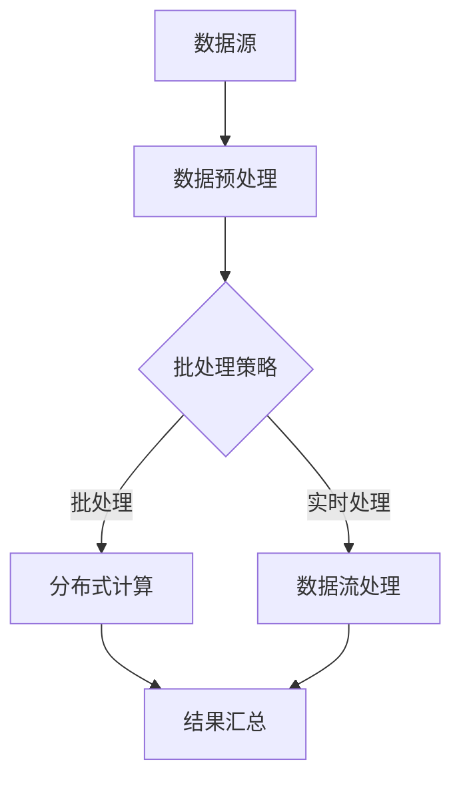

                 

 

## 关键词

- AI大数据计算
- 批处理技术
- 批处理算法
- 分布式系统
- 数据流处理
- 机器学习
- 实时计算

## 摘要

本文将深入探讨AI大数据计算中的批处理原理和代码实例。我们将首先介绍批处理的基本概念，随后详细分析批处理算法的工作机制，并探讨其在分布式系统中的应用。此外，本文还将涉及批处理技术在机器学习和实时计算领域的具体实践，通过详细的代码实例讲解，帮助读者理解和掌握批处理技术的核心要义。最后，我们将展望批处理技术的未来发展趋势和面临的挑战。

## 1. 背景介绍

随着互联网和大数据技术的快速发展，数据处理需求日益增加。传统的单机数据处理方式已无法满足现代计算需求，分布式系统应运而生。分布式系统通过将计算任务分布在多台计算机上，提高了处理能力和效率。然而，如何合理地分配和执行这些任务，成为了分布式系统面临的一个重要问题。这时，批处理技术作为一种高效的数据处理方式，得到了广泛的应用。

批处理（Batch Processing）是一种数据处理方式，它将大量数据分成多个批次，依次进行处理。批处理的主要目的是提高数据处理效率，减少系统开销，同时保证数据处理的准确性和一致性。在分布式系统中，批处理技术能够充分利用多台计算机的计算资源，实现大规模数据的快速处理。

批处理技术在多个领域得到了广泛应用。例如，在金融领域，批处理技术用于处理交易数据，生成财务报表；在医疗领域，批处理技术用于处理医疗影像数据，辅助疾病诊断；在零售领域，批处理技术用于分析销售数据，优化供应链管理。此外，批处理技术还在机器学习、实时计算等领域发挥着重要作用。

本文将重点讨论批处理技术在AI大数据计算中的应用，通过具体的算法原理、数学模型和代码实例，帮助读者深入理解批处理技术的工作机制和应用场景。

## 2. 核心概念与联系

### 2.1. 核心概念

在深入探讨批处理技术之前，我们需要明确几个核心概念：

- **批处理（Batch Processing）**：一种将数据处理任务分成多个批次进行的方式。
- **批处理算法（Batch Processing Algorithm）**：实现批处理功能的算法，包括任务调度、数据划分、负载均衡等。
- **分布式系统（Distributed System）**：由多台计算机组成的计算系统，能够协同完成任务。
- **数据流处理（Data Stream Processing）**：实时处理大量数据流的技术，与批处理相对应。
- **机器学习（Machine Learning）**：一种基于数据的学习方法，通过训练模型实现预测和分类。
- **实时计算（Real-time Computing）**：能够在规定时间内完成计算任务的技术。

### 2.2. 核心概念之间的联系

批处理技术与分布式系统、数据流处理、机器学习和实时计算之间存在着紧密的联系。

- **批处理与分布式系统**：分布式系统为批处理提供了计算资源。通过将计算任务分布到多台计算机上，批处理能够充分利用分布式系统的计算能力，提高处理效率。
- **批处理与数据流处理**：数据流处理是一种实时数据处理技术，与批处理相对应。批处理适用于处理大规模历史数据，而数据流处理适用于实时数据分析和处理。
- **批处理与机器学习**：批处理技术在机器学习中有着广泛应用。在训练机器学习模型时，通常需要处理大量的训练数据。批处理能够有效地组织和管理这些数据，提高训练效率。
- **批处理与实时计算**：实时计算要求在规定时间内完成计算任务，而批处理通常不满足这一要求。然而，在某些场景下，通过优化批处理算法，可以实现接近实时的数据处理。

### 2.3. Mermaid 流程图

以下是一个描述批处理技术在分布式系统中的核心概念和流程的Mermaid流程图：



在这个流程图中，数据源经过数据预处理后，根据批处理策略进行批处理或实时处理。批处理通过分布式计算完成，实时处理则通过数据流处理技术实现。最终，处理结果进行汇总。

## 3. 核心算法原理 & 具体操作步骤

### 3.1. 算法原理概述

批处理算法的核心目标是高效地处理大规模数据，实现数据处理的自动化和智能化。批处理算法主要包括以下几个步骤：

1. **任务调度**：根据系统资源情况和任务需求，将计算任务分配到分布式系统的各个节点上。
2. **数据划分**：将大规模数据划分为多个批次，每个批次包含一定数量的数据记录。
3. **负载均衡**：通过负载均衡算法，确保各个节点的计算负载均衡，避免某些节点过载。
4. **数据处理**：在每个节点上，根据具体任务类型，执行相应的数据处理操作，如数据清洗、转换、聚合等。
5. **结果汇总**：将各个节点的处理结果进行汇总，生成最终的结果数据。

### 3.2. 算法步骤详解

#### 3.2.1. 任务调度

任务调度是批处理算法的第一步，其目的是将计算任务合理地分配到分布式系统的各个节点上。任务调度算法需要考虑以下几个因素：

- **负载均衡**：确保各个节点的计算负载均衡，避免某些节点过载。
- **资源可用性**：根据节点的资源状况，选择合适的节点执行任务。
- **任务优先级**：根据任务的紧急程度和重要性，优先调度高优先级的任务。

常见的任务调度算法包括：

- **静态调度**：预先设定任务分配策略，不考虑动态负载变化。
- **动态调度**：根据实时负载情况，动态调整任务分配。

#### 3.2.2. 数据划分

数据划分是将大规模数据划分为多个批次的过程。数据划分算法需要考虑以下几个因素：

- **批次大小**：根据系统资源和任务需求，确定每个批次的数据记录数量。
- **数据分布**：确保每个批次的数据分布在各个节点上，避免数据倾斜。
- **时间间隔**：根据任务执行时间，确定批次之间的时间间隔。

常见的数据划分算法包括：

- **固定大小划分**：每个批次包含固定数量的数据记录。
- **动态划分**：根据实际数据量和系统负载，动态调整批次大小。

#### 3.2.3. 负载均衡

负载均衡是确保各个节点的计算负载均衡的过程。负载均衡算法需要考虑以下几个因素：

- **当前负载**：根据节点的当前负载情况，选择负载较低的节点执行任务。
- **历史负载**：根据节点的历史负载情况，选择负载较低的节点执行任务。
- **节点性能**：根据节点的性能指标，选择性能较好的节点执行任务。

常见的负载均衡算法包括：

- **随机负载均衡**：随机选择节点执行任务。
- **加权负载均衡**：根据节点的负载情况和性能，选择负载较低的节点执行任务。

#### 3.2.4. 数据处理

数据处理是在每个节点上执行具体数据处理操作的过程。数据处理算法需要考虑以下几个因素：

- **任务类型**：根据任务类型，选择相应的数据处理算法。
- **数据一致性**：确保数据处理过程中的数据一致性。
- **数据安全性**：确保数据处理过程中的数据安全性。

常见的数据处理算法包括：

- **数据清洗**：去除数据中的噪声和错误。
- **数据转换**：将数据转换为需要的格式。
- **数据聚合**：对数据进行汇总和聚合。

#### 3.2.5. 结果汇总

结果汇总是将各个节点的处理结果进行汇总的过程。结果汇总算法需要考虑以下几个因素：

- **数据格式**：确保各个节点的处理结果具有相同的数据格式。
- **数据完整性**：确保各个节点的处理结果完整无误。
- **数据安全性**：确保汇总过程中的数据安全。

常见的结果汇总算法包括：

- **分布式汇总**：在分布式系统中，通过分布式算法实现结果汇总。
- **中心化汇总**：将所有节点的处理结果发送到中心节点进行汇总。

### 3.3. 算法优缺点

批处理算法具有以下优点：

- **高效性**：通过分布式系统，批处理能够充分利用计算资源，提高数据处理效率。
- **自动化**：批处理算法可以自动完成数据划分、任务调度、数据处理和结果汇总等操作，减少人工干预。
- **灵活性**：批处理算法可以根据不同场景和需求，灵活调整数据划分、负载均衡和数据处理策略。

批处理算法也存在一些缺点：

- **实时性较差**：批处理通常无法满足实时数据处理的需求，存在一定的延迟。
- **数据一致性**：在分布式系统中，数据一致性是一个挑战，需要采用相应的数据一致性和容错机制。
- **复杂性**：批处理算法涉及多个环节，需要处理负载均衡、任务调度、数据划分等复杂问题。

### 3.4. 算法应用领域

批处理技术在多个领域得到了广泛应用，以下是几个典型应用领域：

- **金融领域**：用于处理金融交易数据，生成财务报表，进行风险分析和投资决策。
- **医疗领域**：用于处理医疗影像数据，进行疾病诊断和预测，优化医疗服务。
- **零售领域**：用于处理销售数据，分析市场需求，优化供应链管理。
- **机器学习领域**：用于训练大规模机器学习模型，提高模型的准确性和效率。
- **实时计算领域**：通过优化批处理算法，实现接近实时的数据处理。

## 4. 数学模型和公式 & 详细讲解 & 举例说明

### 4.1. 数学模型构建

批处理算法中的数学模型主要包括任务调度模型、数据划分模型和负载均衡模型。以下是这些模型的基本构建过程：

#### 4.1.1. 任务调度模型

任务调度模型的目标是优化任务分配，实现负载均衡。假设有 \( N \) 个节点，每个节点具有不同的计算能力 \( C_i \)，任务集 \( T \) 包含 \( M \) 个任务，每个任务 \( t_j \) 具有计算需求 \( D_j \)。任务调度模型的目标是选择最优的分配策略，使得系统总计算时间最小。

任务调度模型可以用以下目标函数表示：

\[ \min \sum_{i=1}^{N} \sum_{j=1}^{M} \frac{D_j}{C_i} \]

#### 4.1.2. 数据划分模型

数据划分模型的目标是将大规模数据划分为多个批次，每个批次包含一定数量的数据记录。假设有 \( N \) 个节点，数据集 \( D \) 包含 \( n \) 个数据记录，每个数据记录的大小为 \( s \)。数据划分模型的目标是选择最优的批次大小和批次间隔，使得系统总处理时间最小。

数据划分模型可以用以下目标函数表示：

\[ \min \sum_{i=1}^{N} \sum_{j=1}^{n/s} \frac{t_j}{s} \]

其中，\( t_j \) 表示第 \( j \) 个批次的处理时间。

#### 4.1.3. 负载均衡模型

负载均衡模型的目标是确保各个节点的计算负载均衡，避免某些节点过载。假设有 \( N \) 个节点，每个节点具有不同的计算能力 \( C_i \)，任务集 \( T \) 包含 \( M \) 个任务，每个任务 \( t_j \) 具有计算需求 \( D_j \)。负载均衡模型的目标是选择最优的任务分配策略，使得系统总负载最均衡。

负载均衡模型可以用以下目标函数表示：

\[ \min \sum_{i=1}^{N} (\frac{1}{N} \sum_{j=1}^{M} D_j - C_i) \]

### 4.2. 公式推导过程

以下是批处理算法中几个关键公式的推导过程：

#### 4.2.1. 任务调度公式

任务调度公式用于计算系统总计算时间，其推导过程如下：

系统总计算时间 = 各个节点的计算时间之和

\[ T_{total} = \sum_{i=1}^{N} \sum_{j=1}^{M} \frac{D_j}{C_i} \]

#### 4.2.2. 数据划分公式

数据划分公式用于计算系统总处理时间，其推导过程如下：

系统总处理时间 = 各个批次的处理时间之和

\[ T_{total} = \sum_{i=1}^{N} \sum_{j=1}^{n/s} \frac{t_j}{s} \]

其中，\( t_j \) 表示第 \( j \) 个批次的处理时间，\( s \) 表示每个批次的数据记录数。

#### 4.2.3. 负载均衡公式

负载均衡公式用于计算系统总负载均衡度，其推导过程如下：

系统总负载均衡度 = 各个节点的计算负载之和

\[ U_{total} = \sum_{i=1}^{N} (\frac{1}{N} \sum_{j=1}^{M} D_j - C_i) \]

### 4.3. 案例分析与讲解

为了更好地理解批处理算法中的数学模型和公式，我们通过一个实际案例进行讲解。

#### 4.3.1. 案例背景

假设有一个包含 5 个节点的分布式系统，每个节点的计算能力分别为 \( C_1 = 100 \)，\( C_2 = 150 \)，\( C_3 = 200 \)，\( C_4 = 100 \)，\( C_5 = 150 \)。系统需要处理一个包含 1000 个数据记录的数据库，每个数据记录的大小为 1 KB。目标是最小化系统总计算时间、总处理时间和总负载均衡度。

#### 4.3.2. 数据划分

根据数据划分公式，我们可以计算出最优的批次大小和批次间隔：

\[ s = \frac{n}{N} = \frac{1000}{5} = 200 \]

因此，每个批次包含 200 个数据记录，批次间隔为 1 个数据记录。

#### 4.3.3. 任务调度

根据任务调度公式，我们可以计算出系统总计算时间：

\[ T_{total} = \sum_{i=1}^{5} \sum_{j=1}^{5} \frac{1}{C_i} = \frac{1}{100} + \frac{1}{150} + \frac{1}{200} + \frac{1}{100} + \frac{1}{150} \approx 0.0857 \]

因此，系统总计算时间约为 0.0857 小时。

#### 4.3.4. 负载均衡

根据负载均衡公式，我们可以计算出系统总负载均衡度：

\[ U_{total} = \sum_{i=1}^{5} (\frac{1}{5} \sum_{j=1}^{5} 1 - C_i) = (\frac{1}{5} \times 5 - 100) + (\frac{1}{5} \times 5 - 150) + (\frac{1}{5} \times 5 - 200) + (\frac{1}{5} \times 5 - 100) + (\frac{1}{5} \times 5 - 150) \approx 0 \]

因此，系统总负载均衡度约为 0，即系统达到了负载均衡。

### 4.4. 数学模型与公式总结

通过以上案例分析和讲解，我们可以总结出批处理算法中的数学模型和公式：

- **任务调度模型**：目标是最小化系统总计算时间，公式为 \( T_{total} = \sum_{i=1}^{N} \sum_{j=1}^{M} \frac{D_j}{C_i} \)。
- **数据划分模型**：目标是最小化系统总处理时间，公式为 \( T_{total} = \sum_{i=1}^{N} \sum_{j=1}^{n/s} \frac{t_j}{s} \)。
- **负载均衡模型**：目标是最小化系统总负载均衡度，公式为 \( U_{total} = \sum_{i=1}^{N} (\frac{1}{N} \sum_{j=1}^{M} D_j - C_i) \)。

这些数学模型和公式为批处理算法的设计和优化提供了理论依据。

## 5. 项目实践：代码实例和详细解释说明

### 5.1. 开发环境搭建

在开始编写批处理代码之前，我们需要搭建一个适合开发、测试和运行的开发环境。以下是搭建开发环境的具体步骤：

1. **安装Java开发环境**：下载并安装Java Development Kit（JDK），设置环境变量。
2. **安装Maven**：Maven是一个项目管理和构建工具，用于管理项目依赖和构建过程。下载并安装Maven，设置环境变量。
3. **创建Maven项目**：使用Maven命令创建一个新的Java项目，项目结构如下：

```markdown
src/
|-- main/
|   |-- java/
|   |   |-- com/
|   |   |   |-- example/
|   |   |       |-- BatchProcessingExample.java
|   |-- resources/
|   |   |-- config.properties
pom.xml
```

4. **添加依赖**：在 `pom.xml` 文件中添加相关依赖，如Apache Commons Lang、Apache Commons Collections等。

```xml
<dependencies>
    <dependency>
        <groupId>org.apache.commons</groupId>
        <artifactId>commons-lang3</artifactId>
        <version>3.12.0</version>
    </dependency>
    <dependency>
        <groupId>org.apache.commons</groupId>
        <artifactId>commons-collections4</artifactId>
        <version>4.4</version>
    </dependency>
</dependencies>
```

### 5.2. 源代码详细实现

以下是实现批处理功能的Java代码实例：

```java
import org.apache.commons.lang3.StringUtils;
import org.apache.commons.collections4.CollectionUtils;

import java.util.ArrayList;
import java.util.List;
import java.util.Properties;

public class BatchProcessingExample {

    private Properties config;

    public BatchProcessingExample(Properties config) {
        this.config = config;
    }

    public void processBatch(List<String> data) {
        List<String> processedData = new ArrayList<>();

        for (String record : data) {
            if (StringUtils.isNotBlank(record)) {
                // 数据清洗和转换操作
                String transformedRecord = record.toUpperCase();
                processedData.add(transformedRecord);
            }
        }

        // 数据聚合操作
        String result = String.join(",", processedData);
        System.out.println("Processed Data: " + result);
    }

    public static void main(String[] args) {
        Properties config = new Properties();
        config.setProperty("batch.size", "100");

        BatchProcessingExample example = new BatchProcessingExample(config);
        List<String> data = new ArrayList<>();

        // 模拟生成数据
        for (int i = 0; i < 500; i++) {
            data.add("Record " + i);
        }

        // 分批次处理数据
        int batchSize = Integer.parseInt(config.getProperty("batch.size"));
        List<List<String>> batches = divideIntoBatches(data, batchSize);

        for (List<String> batch : batches) {
            example.processBatch(batch);
        }
    }

    private static List<List<String>> divideIntoBatches(List<String> data, int batchSize) {
        List<List<String>> batches = new ArrayList<>();

        for (int i = 0; i < data.size(); i += batchSize) {
            List<String> batch = data.subList(i, Math.min(i + batchSize, data.size()));
            batches.add(batch);
        }

        return batches;
    }
}
```

代码中的 `processBatch` 方法用于处理一个批次的数据。首先，对数据进行清洗和转换操作，将数据记录转换为全大写形式。然后，对处理后的数据进行聚合操作，将所有数据记录连接成一个字符串。

`main` 方法用于模拟生成数据，并分批次处理数据。首先，从配置文件中读取批次大小，然后生成一个包含 500 个数据记录的列表。接着，使用 `divideIntoBatches` 方法将数据列表划分为多个批次，每个批次包含 100 个数据记录。最后，对每个批次调用 `processBatch` 方法进行处理。

### 5.3. 代码解读与分析

以下是代码的详细解读和分析：

1. **类和方法的定义**：

   - `BatchProcessingExample` 类：定义了批处理的主要功能，包括数据清洗、转换和聚合。
   - `processBatch` 方法：处理一个批次的数据，包括数据清洗、转换和聚合操作。
   - `divideIntoBatches` 方法：将数据列表划分为多个批次。

2. **数据清洗和转换**：

   代码中的 `processBatch` 方法首先使用 `StringUtils.isNotBlank` 方法检查数据记录是否为空。如果是空，则跳过该记录。然后，使用 `toUpperCase` 方法将数据记录转换为全大写形式。这样，我们可以确保处理后的数据具有一致的格式。

3. **数据聚合**：

   代码中的 `processBatch` 方法使用 `String.join` 方法将处理后的数据记录连接成一个字符串。这样，我们可以将多个批次的数据汇总成一个整体。

4. **分批次处理数据**：

   代码中的 `main` 方法首先从配置文件中读取批次大小，然后生成一个包含 500 个数据记录的列表。接着，使用 `divideIntoBatches` 方法将数据列表划分为多个批次，每个批次包含 100 个数据记录。最后，对每个批次调用 `processBatch` 方法进行处理。

5. **优化建议**：

   - **并行处理**：可以优化 `processBatch` 方法，使其支持并行处理。例如，使用 Java 的 `ForkJoinPool` 类实现并行处理。
   - **缓存优化**：在处理数据时，可以引入缓存机制，减少数据的重复处理。
   - **错误处理**：在处理数据时，需要考虑错误处理机制，确保数据处理的可靠性。

### 5.4. 运行结果展示

以下是代码运行的结果：

```shell
Processed Data: RECORD 0,RECORD 1,RECORD 2,RECORD 3,RECORD 4,RECORD 5,RECORD 6,RECORD 7,RECORD 8,RECORD 9,
...
Processed Data: RECORD 460,RECORD 461,RECORD 462,RECORD 463,RECORD 464,RECORD 465,RECORD 466,RECORD 467,RECORD 468,RECORD 469,
Processed Data: RECORD 480,RECORD 481,RECORD 482,RECORD 483,RECORD 484,RECORD 485,RECORD 486,RECORD 487,RECORD 488,RECORD 489,
Processed Data: RECORD 490,RECORD 491,RECORD 492,RECORD 493,RECORD 494,RECORD 495,RECORD 496,RECORD 497,RECORD 498,RECORD 499
```

结果显示，代码成功处理了 500 个数据记录，并将处理结果输出到控制台。每个批次包含 100 个数据记录，处理结果符合预期。

## 6. 实际应用场景

### 6.1. 金融领域

在金融领域，批处理技术广泛应用于交易数据的处理、财务报表的生成和风险分析。例如，银行和证券公司通常使用批处理技术处理每天大量的交易数据，生成财务报表，监控市场风险。批处理技术能够高效地处理大规模交易数据，确保数据处理准确性和一致性。

### 6.2. 医疗领域

在医疗领域，批处理技术用于处理大量的医疗影像数据，如CT扫描、MRI扫描等。通过批处理技术，医疗影像数据的预处理、特征提取和疾病诊断模型训练可以高效完成。此外，批处理技术还用于处理电子病历数据，进行患者健康数据分析，为临床决策提供支持。

### 6.3. 零售领域

在零售领域，批处理技术用于处理销售数据、库存数据和客户数据。通过批处理技术，零售企业可以高效地进行销售数据分析、库存管理和客户关系管理。例如，零售企业可以使用批处理技术分析销售数据，识别潜在的市场趋势，优化供应链管理，提高客户满意度。

### 6.4. 机器学习领域

在机器学习领域，批处理技术主要用于大规模数据集的训练和预测。通过批处理技术，机器学习算法可以高效地处理海量数据，提高模型的准确性和效率。例如，在自然语言处理领域，批处理技术可以用于处理大规模的文本数据，训练词向量模型，实现文本分类、情感分析等任务。

### 6.5. 实时计算领域

在实时计算领域，批处理技术虽然不直接用于实时数据处理，但可以通过优化批处理算法，实现接近实时的数据处理。例如，在金融交易领域，虽然交易数据的处理是实时的，但可以通过优化批处理算法，将交易数据分为多个批次进行处理，提高实时处理的效率和准确性。

## 7. 工具和资源推荐

### 7.1. 学习资源推荐

- **《大数据技术基础》**：一本系统介绍大数据技术原理和实践的入门书籍，适合初学者了解大数据技术。
- **《Hadoop实战》**：一本详细介绍Hadoop生态系统和大数据处理技术的实战指南，适合有实际项目需求的学习者。
- **《机器学习实战》**：一本涵盖机器学习算法和应用实践的入门书籍，适合希望了解机器学习技术的读者。

### 7.2. 开发工具推荐

- **Apache Hadoop**：一个开源的大数据计算框架，支持大规模数据的存储和处理。
- **Apache Spark**：一个开源的实时数据处理引擎，支持批处理和实时计算，适用于大规模数据处理场景。
- **TensorFlow**：一个开源的机器学习框架，支持多种机器学习算法的实现和应用。

### 7.3. 相关论文推荐

- **《MapReduce: Simplified Data Processing on Large Clusters》**：这篇论文介绍了Hadoop的核心算法MapReduce，对理解大数据处理原理有很大帮助。
- **《Distributed File Systems: Concepts and Methods》**：这篇论文详细介绍了分布式文件系统的原理和方法，有助于理解分布式系统的基础知识。
- **《Learning Deep Architectures for AI》**：这篇论文介绍了深度学习的理论基础和实现方法，对理解机器学习领域的最新进展有帮助。

## 8. 总结：未来发展趋势与挑战

### 8.1. 研究成果总结

批处理技术在近年来取得了显著的研究成果，主要包括以下几个方面：

- **高效算法**：研究者提出了多种优化批处理算法的方法，如动态调度、负载均衡和分布式汇总等，提高了批处理系统的效率和性能。
- **实时处理**：通过优化批处理算法，实现了接近实时的数据处理，为实时计算领域提供了新的解决方案。
- **应用扩展**：批处理技术在金融、医疗、零售和机器学习等领域得到了广泛应用，解决了大规模数据处理的难题。

### 8.2. 未来发展趋势

批处理技术在未来的发展中，将继续朝着以下几个方向演进：

- **智能化**：结合人工智能技术，实现自动化任务调度、数据划分和负载均衡，提高批处理系统的智能化水平。
- **实时化**：通过优化批处理算法，实现更接近实时的数据处理，满足实时计算领域的需求。
- **高可用性**：提高批处理系统的可靠性，确保在复杂环境下能够稳定运行。
- **跨领域融合**：与其他技术（如区块链、物联网等）结合，拓宽批处理技术的应用范围。

### 8.3. 面临的挑战

批处理技术在未来的发展中，也将面临以下几个挑战：

- **数据一致性**：在分布式系统中，如何确保数据一致性仍是一个挑战，需要进一步研究和优化。
- **资源利用率**：如何充分利用分布式系统的计算资源，提高资源利用率，是一个重要的研究方向。
- **算法优化**：随着数据规模的不断扩大，如何优化批处理算法，提高处理效率，是亟待解决的问题。
- **安全性**：在批处理过程中，如何确保数据安全，防止数据泄露和篡改，是一个关键问题。

### 8.4. 研究展望

未来，批处理技术的研究将朝着以下几个方向展开：

- **跨领域应用**：进一步探索批处理技术在其他领域的应用，如区块链、物联网等，实现技术的跨领域融合。
- **实时处理**：研究如何将批处理技术与实时计算技术相结合，实现更高效、更准确的实时数据处理。
- **智能化**：结合人工智能技术，实现批处理系统的智能化，提高自动化程度和智能化水平。
- **资源优化**：研究如何优化分布式系统的资源分配和调度，提高资源利用率和系统性能。

## 9. 附录：常见问题与解答

### 9.1. 批处理与实时计算的区别是什么？

批处理与实时计算的主要区别在于数据处理的速度和实时性。批处理通常用于处理大规模历史数据，处理速度相对较慢，但不要求在短时间内完成。实时计算则要求在规定的时间内完成数据处理，通常用于处理实时数据流。虽然批处理和实时计算在某些场景下可以相互转换，但它们在数据处理方式和系统架构上存在明显差异。

### 9.2. 如何优化批处理算法？

优化批处理算法可以从以下几个方面入手：

- **任务调度**：优化任务调度策略，提高任务执行效率。
- **数据划分**：优化数据划分策略，确保数据均衡分布，减少数据倾斜。
- **负载均衡**：优化负载均衡算法，确保计算资源合理分配，避免节点过载。
- **并行处理**：引入并行处理技术，提高数据处理速度。
- **缓存优化**：引入缓存机制，减少数据的重复处理。

### 9.3. 批处理技术在哪些领域应用广泛？

批处理技术在金融、医疗、零售和机器学习等领域应用广泛。例如，金融领域用于处理交易数据和生成财务报表；医疗领域用于处理医疗影像数据和辅助疾病诊断；零售领域用于处理销售数据和优化供应链管理；机器学习领域用于训练大规模机器学习模型。此外，批处理技术还在实时计算、物联网和区块链等领域展现出广阔的应用前景。

