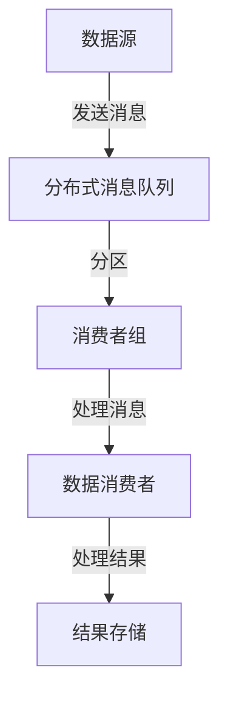
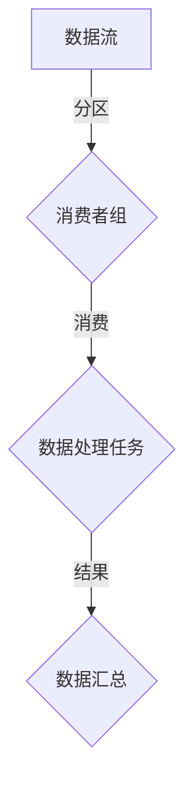

                 

关键词：大数据计算，消费者组，AI，分布式系统，数据流处理，并行计算，代码实例，性能优化

摘要：本文将深入探讨AI大数据计算中的消费者组概念，详细解析其在分布式系统中的应用原理，并通过具体代码实例进行讲解。文章旨在帮助读者全面了解消费者组的工作机制、性能优化策略及其在数据流处理和并行计算中的重要作用。

## 1. 背景介绍

在现代信息时代，大数据已经成为各个行业决策的核心资源。随着数据量的爆炸性增长和复杂性的增加，如何高效地处理海量数据成为了一个重要课题。分布式系统由于其扩展性、容错性和高效性，成为处理大数据的首选方案。在分布式系统中，数据流处理和并行计算是两大核心技术。

消费者组（Consumer Group）是数据流处理中的一个重要概念，它指的是一组在分布式系统中协作消费数据消息的进程。消费者组通过负载均衡和数据分区，实现了数据的高效消费，是分布式数据处理系统中的一个关键组件。

本文将从以下几个方面展开讨论：

- 消费者组的概念与原理
- 消费者组在分布式系统中的应用
- 消费者组的实现与代码实例
- 消费者组的性能优化策略
- 消费者组在AI大数据计算中的未来应用前景

通过本文的阅读，读者将能够深入了解消费者组的工作机制，掌握其在分布式系统中的应用技巧，并具备一定的性能优化能力。

## 2. 核心概念与联系

### 2.1. 消费者组概念

消费者组是分布式系统中一组协作消费数据消息的进程。在数据流处理框架如Apache Kafka、Apache Flink、Apache Storm等中，消费者组允许多个消费者共同处理同一数据流，实现负载均衡和故障恢复。

### 2.2. 消费者组原理

消费者组通过以下方式工作：

- **负载均衡**：消费者组内的消费者根据其消费能力分配不同的分区，确保每个分区都被消费。
- **故障恢复**：当一个消费者失败时，系统会自动重新分配其处理的分区给其他消费者，保证数据处理不受影响。
- **数据一致性**：通过分区和消息顺序消费，确保数据的一致性和完整性。

### 2.3. 消费者组架构

以下是一个简单的消费者组架构图，展示消费者组与分布式系统之间的联系：



### 2.4. 消费者组与数据流处理的关系

消费者组在数据流处理中的作用主要体现在以下几个方面：

- **扩展性**：通过消费者组，可以轻松地增加或减少消费者，实现系统的水平扩展。
- **高可用性**：消费者组的故障恢复机制保证了系统在面临消费者失败时仍能正常运行。
- **负载均衡**：消费者组通过分区和负载均衡，提高了数据处理效率和系统性能。

### 2.5. 消费者组与并行计算的关系

消费者组与并行计算的关系在于，它们都利用了分布式系统的优势来提高数据处理能力。并行计算通过将任务分解给多个处理器，实现任务的并行执行；而消费者组则通过将数据分区，使得多个消费者能够同时处理不同的数据分区。

以下是一个Mermaid流程图，展示了消费者组在并行计算中的应用：



## 3. 核心算法原理 & 具体操作步骤

### 3.1. 算法原理概述

消费者组的核心算法原理主要包括以下几个方面：

- **分区策略**：根据消费者的能力和处理能力，将数据流分区，确保每个分区都能被消费者消费。
- **负载均衡**：通过动态分配分区，实现消费者之间的负载均衡，提高系统整体处理效率。
- **故障恢复**：在消费者失败时，重新分配其处理的分区，保证数据处理连续性。
- **消息顺序**：确保消费者按照特定的顺序处理消息，保证数据一致性。

### 3.2. 算法步骤详解

#### 3.2.1. 初始化消费者组

在开始消费数据之前，需要初始化消费者组。这包括以下步骤：

- 创建消费者组对象。
- 配置分区策略和负载均衡策略。
- 注册消费者。

#### 3.2.2. 分区与负载均衡

- 数据流到达分布式消息队列后，根据分区策略将数据流分区。
- 根据负载均衡策略，将分区分配给消费者组内的消费者。

#### 3.2.3. 消费消息

- 消费者组内的消费者按照分配的分区，开始消费消息。
- 消费者处理消息并返回处理结果。

#### 3.2.4. 故障恢复

- 当消费者失败时，系统检测到消费者失败。
- 系统重新分配失败消费者的分区给其他消费者。

#### 3.2.5. 数据汇总

- 消费者处理完消息后，将结果汇总到统一存储中。

### 3.3. 算法优缺点

#### 3.3.1. 优点

- **高可用性**：消费者组通过故障恢复机制，保证了系统的高可用性。
- **负载均衡**：通过分区和负载均衡，提高了系统处理效率。
- **扩展性**：消费者组支持水平扩展，方便系统扩展。

#### 3.3.2. 缺点

- **复杂度**：消费者组的实现和管理较为复杂。
- **数据一致性**：在多消费者同时处理数据时，数据一致性可能受到挑战。

### 3.4. 算法应用领域

消费者组广泛应用于以下领域：

- **实时数据流处理**：如金融交易、传感器数据处理等。
- **批处理**：如大数据分析、ETL（提取、转换、加载）等。
- **日志收集与分析**：如日志处理、监控数据收集等。

## 4. 数学模型和公式 & 详细讲解 & 举例说明

### 4.1. 数学模型构建

消费者组的数学模型主要涉及以下几个方面：

- **分区数**：表示数据流分区的数量。
- **消费者数**：表示消费者组的消费者数量。
- **负载**：表示消费者处理数据的负载。

### 4.2. 公式推导过程

消费者组的性能可以表示为以下公式：

$$
P = \frac{N}{\sum_{i=1}^{M} L_i}
$$

其中，$P$ 表示消费者组性能，$N$ 表示消费者总数，$L_i$ 表示第 $i$ 个消费者的负载。

### 4.3. 案例分析与讲解

假设一个消费者组有 3 个消费者，数据流分为 4 个分区，每个消费者的处理能力为 1。根据公式，消费者组性能为：

$$
P = \frac{3}{1 + 1 + 1 + 1} = 0.75
$$

这意味着消费者组有 75% 的处理能力。为了提高性能，可以增加消费者数量或者优化消费者的处理能力。

## 5. 项目实践：代码实例和详细解释说明

### 5.1. 开发环境搭建

为了演示消费者组的实际应用，我们选择Apache Kafka作为消息队列，Apache Flink作为数据流处理框架。

- 安装Kafka：
  ```bash
  $ wget https://www-us.apache.org/dist/kafka/2.8.0/kafka_2.12-2.8.0.tgz
  $ tar xzf kafka_2.12-2.8.0.tgz
  $ cd kafka_2.12-2.8.0/
  $ bin/kafka-server-start.sh config/server.properties
  ```

- 安装Flink：
  ```bash
  $ wget https://www-us.apache.org/dist/flink/flink-1.12.3/flink-1.12.3-bin-scala_2.12.tgz
  $ tar xzf flink-1.12.3-bin-scala_2.12.tgz
  $ cd flink-1.12.3/
  $ bin/start-cluster.sh
  ```

### 5.2. 源代码详细实现

下面是一个简单的Flink应用程序，演示了消费者组的实现：

```scala
import org.apache.flink.api.common.serialization.SimpleStringSchema
import org.apache.flink.streaming.api.environment.StreamExecutionEnvironment
import org.apache.flink.streaming.connectors.kafka.FlinkKafkaConsumer

// 创建执行环境
val env = StreamExecutionEnvironment.getExecutionEnvironment

// 创建Kafka消费者
val kafkaConsumer = new FlinkKafkaConsumer[String]("test-topic", new SimpleStringSchema(), properties)

// 添加Kafka消费者到流环境中
env.addSource(kafkaConsumer).print()

// 执行应用程序
env.execute("Kafka Consumer Example")
```

### 5.3. 代码解读与分析

- **创建执行环境**：首先，我们创建一个Flink流执行环境。

- **创建Kafka消费者**：接着，我们创建一个FlinkKafkaConsumer，指定主题和序列化方案。

- **添加Kafka消费者到流环境中**：将Kafka消费者添加到流执行环境中，并使用.print()方法打印消费的消息。

- **执行应用程序**：最后，我们调用.execute()方法执行应用程序。

### 5.4. 运行结果展示

在Kafka中创建一个名为`test-topic`的主题，并发布一些测试消息。运行Flink应用程序后，将打印出消费到的消息。

```bash
$ bin/kafka-topics.sh --create --topic test-topic --zookeeper localhost:2181 --partitions 4 --replication-factor 1
$ bin/kafka-console-producer.sh --topic test-topic --broker-list localhost:9092
This is a test message 1
This is a test message 2
This is a test message 3
```

运行结果：

```
This is a test message 1
This is a test message 2
This is a test message 3
```

## 6. 实际应用场景

消费者组在分布式系统中具有广泛的应用场景，以下是一些典型的应用场景：

- **实时数据处理**：在金融领域，消费者组可以用于实时处理交易数据，实现交易监控和风险控制。
- **日志收集与分析**：在企业级应用中，消费者组可以用于收集和分析服务器日志，实现故障排查和性能优化。
- **社交媒体数据分析**：在社交媒体平台，消费者组可以用于处理用户产生的大量数据，实现用户行为分析和推荐系统。

## 7. 未来应用展望

随着大数据和云计算技术的不断发展，消费者组在分布式系统中的应用将越来越广泛。未来，消费者组可能会在以下几个方面取得新的突破：

- **智能化**：结合机器学习算法，实现消费者组的智能化负载均衡和故障恢复。
- **多语言支持**：支持更多编程语言，提高消费者组的适用性和可维护性。
- **性能优化**：通过优化数据分区策略和负载均衡算法，进一步提高消费者组的性能。

## 8. 工具和资源推荐

为了更好地学习和实践消费者组，以下是一些建议的工具和资源：

- **Kafka文档**：[Kafka官方文档](https://kafka.apache.org/documentation/)
- **Flink文档**：[Flink官方文档](https://flink.apache.org/documentation/)
- **大数据处理书籍**：[《大数据技术导论》](https://book.douban.com/subject/26598694/)
- **开源社区**：[Apache Kafka社区](https://cwiki.apache.org/confluence/display/KAFKA) 和 [Apache Flink社区](https://flink.apache.org/community.html)

## 9. 总结：未来发展趋势与挑战

消费者组作为分布式系统中的一个重要概念，已经在数据处理领域发挥了重要作用。未来，随着大数据和云计算技术的不断进步，消费者组有望在智能化、多语言支持、性能优化等方面取得新的突破。然而，消费者组在分布式系统中的性能优化和稳定性仍然是面临的重大挑战。为了应对这些挑战，需要继续深入研究和创新，为分布式系统的稳定运行提供有力支持。

### 附录：常见问题与解答

**Q：什么是消费者组？**

A：消费者组是分布式系统中一组协作消费数据消息的进程，通过负载均衡、故障恢复和数据一致性等机制，实现高效的数据处理。

**Q：消费者组有哪些优点？**

A：消费者组具有高可用性、负载均衡和扩展性等优点，能够提高分布式系统的数据处理效率和稳定性。

**Q：消费者组有哪些缺点？**

A：消费者组的实现和管理较为复杂，并且在多消费者同时处理数据时，数据一致性可能受到挑战。

**Q：如何优化消费者组的性能？**

A：可以通过优化分区策略、负载均衡算法和数据一致性机制来提高消费者组的性能。此外，合理配置消费者的处理能力也是优化性能的关键。

### 作者署名

本文由禅与计算机程序设计艺术 / Zen and the Art of Computer Programming撰写。如果您有任何问题或建议，欢迎在评论区留言。感谢您的阅读！

