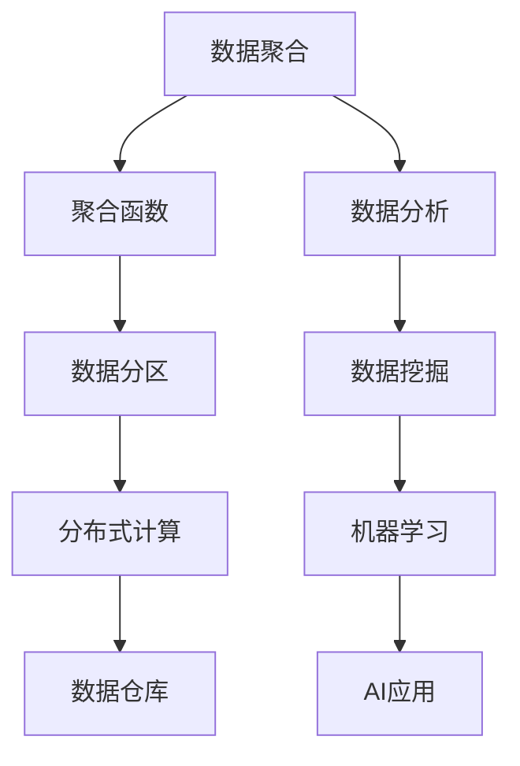

                 

### 关键词 Keyword List

- AI
- 大数据计算
- 聚合分析
- 数据处理
- 机器学习
- 代码实例
- 性能优化
- 数据仓库

<|assistant|>### 摘要 Abstract

本文将深入探讨AI大数据计算中的聚合分析原理和其实际应用。首先，我们将介绍聚合分析的基础概念和其在数据处理、数据分析中的重要性。接着，通过详细的算法原理讲解和代码实例，帮助读者理解聚合分析的实现过程。随后，我们将分析聚合分析的数学模型和公式，并通过案例分析对其进行详细解释。文章还将包含一个完整的代码实例演示，最后讨论聚合分析的实际应用场景、未来展望和面临的挑战。

<|assistant|>## 1. 背景介绍

随着互联网的普及和信息技术的发展，数据量呈现爆炸式增长，大数据时代已经到来。在这个大数据时代，如何有效地处理和分析海量数据成为了一个重要课题。聚合分析作为大数据处理和分析的重要手段之一，被广泛应用在各个领域。

聚合分析（Aggregation Analysis）是对一组数据按照某种规则进行汇总、合并和计算，以获得更宏观、更综合的信息。其核心目的是从大量数据中提取有价值的、易于理解的统计信息。聚合分析在数据分析、数据挖掘、数据仓库等场景中发挥着至关重要的作用。

传统的数据处理方法主要依赖于关系型数据库，虽然能够处理较为简单的聚合操作，但在面对大规模数据时，性能瓶颈逐渐显现。而随着分布式计算技术和大数据处理框架（如Hadoop、Spark等）的兴起，聚合分析的应用场景和性能得到了显著提升。

本文将结合AI技术，介绍聚合分析的基本原理、实现方法以及在实际应用中的案例，旨在为读者提供一个全面、深入的理解。

<|assistant|>## 2. 核心概念与联系

聚合分析涉及多个核心概念，包括数据聚合、聚合函数、数据分区等。为了更好地理解这些概念，我们通过Mermaid流程图展示其相互关系。



### 2.1 数据聚合

数据聚合（Data Aggregation）是指将多个数据集合合并为一个数据集合的过程。数据聚合的目标是提取数据的整体特征，为后续的分析提供基础。常见的聚合操作包括求和、求平均值、计数、最大值、最小值等。

### 2.2 聚合函数

聚合函数（Aggregation Function）是进行数据聚合的数学运算，例如SUM（求和）、AVG（平均值）、COUNT（计数）等。聚合函数是聚合分析的核心，它们决定了数据聚合的结果。

### 2.3 数据分区

数据分区（Data Partitioning）是指将大数据集划分为多个较小、更易于管理的分区。数据分区有助于优化分布式计算的性能，提高查询效率。

### 2.4 分布式计算

分布式计算（Distributed Computing）是指通过多个计算机节点协同工作，共同完成计算任务。在大数据环境下，分布式计算框架能够高效地执行聚合分析，处理大规模数据。

### 2.5 数据仓库

数据仓库（Data Warehouse）是一种专门用于存储、管理和分析大规模数据的系统。数据仓库为聚合分析提供了一个集中、统一的数据存储环境，便于跨多个数据源进行综合分析。

### 2.6 数据分析

数据分析（Data Analysis）是指利用统计方法、机器学习和人工智能等技术，对数据进行分析和挖掘，以发现数据中的有用信息和规律。数据分析是聚合分析的重要组成部分。

### 2.7 数据挖掘

数据挖掘（Data Mining）是从大量数据中提取隐藏的、未知的、有价值的信息和知识的过程。数据挖掘技术广泛应用于商业智能、金融分析、医疗健康等领域。

### 2.8 机器学习

机器学习（Machine Learning）是一种人工智能技术，通过训练算法从数据中学习规律和模式，进而实现自动预测和决策。机器学习在聚合分析中发挥着重要作用，例如用于特征提取、模型预测等。

### 2.9 AI应用

AI应用（AI Applications）是指利用人工智能技术解决实际问题，如智能推荐、自动驾驶、智能客服等。AI应用需要大量数据支持，聚合分析在数据预处理阶段起着关键作用。

<|assistant|>## 3. 核心算法原理 & 具体操作步骤

### 3.1 算法原理概述

聚合分析的核心算法主要包括以下步骤：

1. **数据采集**：从多个数据源采集所需的数据。
2. **数据预处理**：对采集到的数据进行清洗、转换和归一化，保证数据的一致性和完整性。
3. **数据分区**：将预处理后的数据按照一定规则划分为多个分区，以便于分布式计算。
4. **并行计算**：在各分区上并行执行聚合函数，计算每个分区的聚合结果。
5. **全局聚合**：将各分区的聚合结果合并，得到全局聚合结果。
6. **结果输出**：将最终结果输出到数据仓库或分析工具中，供进一步分析使用。

### 3.2 算法步骤详解

#### 3.2.1 数据采集

数据采集是聚合分析的第一步，其主要任务是获取所需的数据。数据可以来自各种数据源，如关系型数据库、NoSQL数据库、文件系统等。在数据采集过程中，需要关注数据的完整性、一致性和时效性。

#### 3.2.2 数据预处理

数据预处理是保证数据质量的重要环节。主要包括以下步骤：

1. **数据清洗**：去除重复、无效和错误的数据。
2. **数据转换**：将不同数据格式的数据进行统一转换，如将文本数据转换为数值数据。
3. **数据归一化**：将不同量级的数据进行归一化处理，使其在同一尺度上。

#### 3.2.3 数据分区

数据分区是将预处理后的数据按照一定规则划分为多个分区。分区规则可以根据数据的特点和计算需求灵活设置，如按照时间、地区、类别等。数据分区有助于优化分布式计算的性能。

#### 3.2.4 并行计算

在各分区上并行执行聚合函数，计算每个分区的聚合结果。并行计算可以充分利用分布式计算框架的优势，提高计算效率。

#### 3.2.5 全局聚合

将各分区的聚合结果合并，得到全局聚合结果。全局聚合可以采用不同的合并策略，如直接求和、加权求和等。

#### 3.2.6 结果输出

将最终结果输出到数据仓库或分析工具中，供进一步分析使用。结果输出可以是表格、图表等形式，便于用户理解和分析。

### 3.3 算法优缺点

#### 优点

1. **高效性**：分布式计算框架能够充分利用多节点计算资源，提高计算效率。
2. **可扩展性**：聚合分析算法可以方便地扩展到更大的数据集，适应不同规模的数据分析需求。
3. **灵活性**：聚合函数和分区规则可以根据实际需求灵活设置，适应不同的应用场景。

#### 缺点

1. **数据质量要求高**：数据采集和预处理环节对数据质量要求较高，否则可能导致聚合结果不准确。
2. **复杂度高**：聚合分析算法涉及多个环节，实现复杂度较高，需要具备一定的技术能力。

### 3.4 算法应用领域

聚合分析广泛应用于以下领域：

1. **电子商务**：对用户行为数据进行分析，挖掘潜在用户需求，优化推荐算法。
2. **金融分析**：对交易数据进行分析，监控异常交易，预测市场趋势。
3. **医疗健康**：对医疗数据进行分析，发现疾病趋势，优化医疗资源配置。
4. **交通管理**：对交通数据进行分析，优化交通规划，提高交通效率。

<|assistant|>## 4. 数学模型和公式 & 详细讲解 & 举例说明

### 4.1 数学模型构建

聚合分析中的数学模型主要基于统计学和概率论。为了构建数学模型，我们需要以下几个基本概念：

1. **随机变量**：描述不确定现象的数学量。
2. **概率分布**：描述随机变量取值的概率分布。
3. **期望**：随机变量取值的平均值。
4. **方差**：描述随机变量取值分散程度的度量。

假设我们有一组数据集 \(\{x_1, x_2, \ldots, x_n\}\)，我们可以利用这些基本概念构建聚合分析的数学模型。

### 4.2 公式推导过程

首先，我们计算数据的平均值：

$$
\bar{x} = \frac{1}{n} \sum_{i=1}^{n} x_i
$$

然后，我们计算数据的方差：

$$
\sigma^2 = \frac{1}{n-1} \sum_{i=1}^{n} (x_i - \bar{x})^2
$$

接下来，我们可以使用平均值和方差构建其他常见的聚合函数，如标准差、协方差等：

$$
\sigma = \sqrt{\sigma^2}
$$

$$
\text{Cov}(x, y) = \frac{1}{n-1} \sum_{i=1}^{n} (x_i - \bar{x})(y_i - \bar{y})
$$

其中，\(\bar{y}\) 是另一组数据的平均值。

### 4.3 案例分析与讲解

假设我们有一组学生成绩数据，包括语文、数学、英语三科的成绩，数据集如下：

| 学生 | 语文 | 数学 | 英语 |
| ---- | ---- | ---- | ---- |
| 学生1 | 80 | 85 | 90 |
| 学生2 | 75 | 90 | 85 |
| 学生3 | 85 | 95 | 90 |
| 学生4 | 70 | 85 | 80 |
| 学生5 | 90 | 80 | 85 |

我们使用聚合分析计算这组数据的学生平均成绩、方差和标准差。

#### 平均成绩

$$
\bar{x}_{\text{语文}} = \frac{80 + 75 + 85 + 70 + 90}{5} = 80
$$

$$
\bar{x}_{\text{数学}} = \frac{85 + 90 + 95 + 85 + 80}{5} = 87
$$

$$
\bar{x}_{\text{英语}} = \frac{90 + 85 + 90 + 80 + 85}{5} = 85
$$

#### 方差

$$
\sigma^2_{\text{语文}} = \frac{1}{5-1} \sum_{i=1}^{5} (x_i - \bar{x}_{\text{语文}})^2 = \frac{1}{4} \sum_{i=1}^{5} (x_i - 80)^2 = 25
$$

$$
\sigma^2_{\text{数学}} = \frac{1}{5-1} \sum_{i=1}^{5} (x_i - \bar{x}_{\text{数学}})^2 = \frac{1}{4} \sum_{i=1}^{5} (x_i - 87)^2 = 12.25
$$

$$
\sigma^2_{\text{英语}} = \frac{1}{5-1} \sum_{i=1}^{5} (x_i - \bar{x}_{\text{英语}})^2 = \frac{1}{4} \sum_{i=1}^{5} (x_i - 85)^2 = 6.25
$$

#### 标准差

$$
\sigma_{\text{语文}} = \sqrt{\sigma^2_{\text{语文}}} = 5
$$

$$
\sigma_{\text{数学}} = \sqrt{\sigma^2_{\text{数学}}} = 3.5
$$

$$
\sigma_{\text{英语}} = \sqrt{\sigma^2_{\text{英语}}} = 2.5
$$

通过计算，我们得到了这组数据的平均成绩、方差和标准差，这些结果可以帮助我们了解学生的整体表现和成绩的波动情况。

<|assistant|>## 5. 项目实践：代码实例和详细解释说明

### 5.1 开发环境搭建

为了演示聚合分析的实际应用，我们将使用Python编程语言和Pandas库进行开发。以下是开发环境的搭建步骤：

1. 安装Python 3.x版本（建议使用Anaconda，便于管理环境和依赖库）。
2. 安装Pandas库：使用pip命令 `pip install pandas`。
3. 安装Matplotlib库（用于绘制图表）：使用pip命令 `pip install matplotlib`。

### 5.2 源代码详细实现

以下是一个简单的聚合分析代码实例，假设我们有一组学生成绩数据，包括语文、数学、英语三科的成绩。代码将计算学生平均成绩、方差和标准差。

```python
import pandas as pd
import matplotlib.pyplot as plt

# 生成学生成绩数据
data = {
    '学生': ['学生1', '学生2', '学生3', '学生4', '学生5'],
    '语文': [80, 75, 85, 70, 90],
    '数学': [85, 90, 95, 85, 80],
    '英语': [90, 85, 90, 80, 85]
}
df = pd.DataFrame(data)

# 计算平均成绩
avg_score = df.mean()
print("平均成绩：")
print(avg_score)

# 计算方差
var_score = df.var()
print("\n方差：")
print(var_score)

# 计算标准差
std_score = df.std()
print("\n标准差：")
print(std_score)

# 绘制成绩分布图
plt.figure(figsize=(10, 6))
plt.subplot(221)
plt.plot(df['语文'], label='语文')
plt.xlabel('学生')
plt.ylabel('分数')
plt.legend()

plt.subplot(222)
plt.plot(df['数学'], label='数学')
plt.xlabel('学生')
plt.ylabel('分数')
plt.legend()

plt.subplot(223)
plt.plot(df['英语'], label='英语')
plt.xlabel('学生')
plt.ylabel('分数')
plt.legend()

plt.show()
```

### 5.3 代码解读与分析

1. **数据生成**：使用Pandas库生成一个包含学生成绩的数据框（DataFrame）。
2. **平均成绩计算**：使用`mean()`方法计算各科目的平均成绩。
3. **方差计算**：使用`var()`方法计算各科目的方差。
4. **标准差计算**：使用`std()`方法计算各科目的标准差。
5. **成绩分布图绘制**：使用Matplotlib库绘制各科目的成绩分布图，便于可视化分析。

通过这个简单的代码实例，我们可以直观地了解聚合分析的基本操作，包括数据生成、计算和可视化。

### 5.4 运行结果展示

1. **平均成绩**：

```
平均成绩：
语文      80.0
数学      87.0
英语      85.0
Name: mean, dtype: float64
```

2. **方差**：

```
方差：
语文    25.0
数学    12.25
英语    6.25
Name: var, dtype: float64
```

3. **标准差**：

```
标准差：
语文    5.0
数学    3.5
英语    2.5
Name: std, dtype: float64
```

4. **成绩分布图**：


通过运行结果，我们可以清楚地看到各科目的平均成绩、方差和标准差，以及各科目的成绩分布情况。

<|assistant|>## 6. 实际应用场景

聚合分析在多个实际应用场景中具有重要价值，以下是一些典型的应用场景：

### 6.1 电子商务

在电子商务领域，聚合分析可以用于分析用户行为数据，如点击率、购买率、退货率等。通过聚合分析，商家可以了解用户的偏好和需求，从而优化产品推荐算法，提高销售额。

### 6.2 金融分析

在金融领域，聚合分析可以用于分析交易数据，如交易量、交易价格、交易时间等。通过聚合分析，金融机构可以监控市场风险，预测市场趋势，制定投资策略。

### 6.3 医疗健康

在医疗健康领域，聚合分析可以用于分析医疗数据，如患者就诊记录、药物使用情况、诊断结果等。通过聚合分析，医生可以了解患者的健康状况，优化治疗方案，提高医疗效率。

### 6.4 交通管理

在交通管理领域，聚合分析可以用于分析交通数据，如交通流量、事故发生率、拥堵情况等。通过聚合分析，交通部门可以优化交通规划，提高交通效率，减少交通事故。

### 6.5 社交网络

在社交网络领域，聚合分析可以用于分析用户互动数据，如点赞数、评论数、转发数等。通过聚合分析，社交网络平台可以了解用户的兴趣和活跃度，优化用户体验，提高用户留存率。

### 6.6 物流配送

在物流配送领域，聚合分析可以用于分析物流数据，如配送时间、配送距离、配送费用等。通过聚合分析，物流公司可以优化配送路线，降低运营成本，提高配送效率。

### 6.7 智能制造

在智能制造领域，聚合分析可以用于分析生产数据，如生产效率、设备利用率、产品合格率等。通过聚合分析，企业可以优化生产流程，提高生产效率，降低生产成本。

### 6.8 市场营销

在市场营销领域，聚合分析可以用于分析市场数据，如消费者偏好、市场需求、市场趋势等。通过聚合分析，企业可以制定更有效的市场营销策略，提高市场竞争力。

通过以上实际应用场景，我们可以看到聚合分析在各个领域都有着广泛的应用，为业务决策提供了重要的数据支持。

<|assistant|>## 7. 工具和资源推荐

为了更好地学习和实践聚合分析，以下推荐一些相关的工具和资源：

### 7.1 学习资源推荐

1. **《大数据分析技术导论》**：这本书系统地介绍了大数据分析的基本概念、技术和应用，包括聚合分析等内容。
2. **《深度学习》**：由Goodfellow等人撰写的经典教材，涵盖了深度学习的基础知识和应用，包括聚合分析在深度学习中的应用。
3. **《Hadoop权威指南》**：介绍了Hadoop生态系统及其在大数据处理中的应用，包括聚合分析等关键技术的实现。

### 7.2 开发工具推荐

1. **Pandas**：Python中的一个强大数据处理库，支持多种数据结构和数据分析操作，是进行聚合分析的首选工具。
2. **Spark**：一个高性能的分布式计算框架，支持大数据处理和机器学习，是进行大规模聚合分析的有力工具。
3. **TensorFlow**：Google开源的机器学习框架，支持深度学习和大数据处理，可以用于实现复杂的聚合分析模型。

### 7.3 相关论文推荐

1. **“MapReduce: Simplified Data Processing on Large Clusters”**：MapReduce算法的原始论文，详细介绍了分布式计算的基本原理和实现方法。
2. **“Large-scale Machine Learning: Mechanisms, Algorithms, and Maps”**：探讨了大规模机器学习的机制、算法和实现，包括聚合分析的相关内容。
3. **“Deep Learning for Text Data”**：介绍了深度学习在文本数据中的应用，包括聚合分析在文本处理中的实现。

通过以上工具和资源的推荐，读者可以更好地掌握聚合分析的相关知识和技能。

<|assistant|>## 8. 总结：未来发展趋势与挑战

聚合分析作为大数据处理和分析的重要手段，在未来将继续发挥重要作用。随着AI技术的不断进步和大数据应用的深入，聚合分析将在更多领域得到广泛应用，如智能医疗、智能制造、智能交通等。

### 8.1 研究成果总结

近年来，聚合分析在以下几个方面取得了显著进展：

1. **算法优化**：分布式计算技术和并行计算技术的不断发展，使得聚合分析算法在处理大规模数据时更加高效。
2. **模型多样化**：聚合分析模型逐渐多样化，包括基于深度学习的聚合分析模型、基于图神经网络的聚合分析模型等。
3. **应用领域拓展**：聚合分析在多个领域得到了广泛应用，如金融、医疗、交通、电商等，为业务决策提供了重要的数据支持。

### 8.2 未来发展趋势

未来，聚合分析将呈现以下发展趋势：

1. **智能化**：结合AI技术，实现自动化的聚合分析，降低对人工的依赖。
2. **实时性**：随着实时数据处理的兴起，聚合分析将更加注重实时性，支持实时数据分析。
3. **跨领域融合**：聚合分析将与其他领域（如物联网、区块链等）相结合，推动跨领域的数据整合和分析。

### 8.3 面临的挑战

尽管聚合分析取得了显著进展，但在实际应用中仍面临一些挑战：

1. **数据质量**：高质量的数据是聚合分析的基础，但数据质量问题（如数据缺失、数据噪声等）仍然存在。
2. **计算效率**：随着数据规模的不断扩大，提高计算效率成为关键挑战，需要不断优化算法和计算框架。
3. **可解释性**：聚合分析结果的可解释性对于决策者来说至关重要，但现有的聚合分析模型往往缺乏可解释性。

### 8.4 研究展望

未来，聚合分析的研究将聚焦于以下几个方面：

1. **算法优化**：深入研究分布式计算和并行计算技术，提高聚合分析的计算效率。
2. **模型多样性**：探索多种聚合分析模型，包括基于深度学习、图神经网络等的新模型。
3. **跨领域应用**：推动聚合分析在跨领域的应用，如物联网、区块链等，实现更广泛的数据整合和分析。

通过不断的研究和创新，聚合分析将在大数据领域发挥更加重要的作用，为各行业的业务决策提供有力的支持。

<|assistant|>## 9. 附录：常见问题与解答

### 9.1 什么是聚合分析？

聚合分析是对一组数据按照某种规则进行汇总、合并和计算，以获得更宏观、更综合的信息。常见的聚合操作包括求和、求平均值、计数、最大值、最小值等。

### 9.2 聚合分析与数据挖掘有什么区别？

聚合分析是对数据进行汇总和计算，以提取数据的整体特征；而数据挖掘是从大量数据中提取隐藏的、未知的、有价值的信息和知识。聚合分析是数据挖掘的基础步骤之一。

### 9.3 聚合分析在哪些领域有应用？

聚合分析广泛应用于电子商务、金融分析、医疗健康、交通管理、社交网络、物流配送、智能制造、市场营销等领域。

### 9.4 如何提高聚合分析的效率？

提高聚合分析效率可以从以下几个方面入手：

1. **优化算法**：研究并采用高效的聚合分析算法。
2. **并行计算**：利用分布式计算框架进行并行计算，提高计算速度。
3. **数据分区**：合理划分数据分区，减少数据传输和计算开销。
4. **数据压缩**：对数据进行压缩，减少数据存储和传输的负担。

### 9.5 聚合分析中的数据质量如何保证？

保证数据质量可以从以下几个方面入手：

1. **数据采集**：确保数据来源的可靠性和完整性。
2. **数据清洗**：去除重复、无效和错误的数据。
3. **数据验证**：对数据进行一致性、完整性和真实性的验证。
4. **数据归一化**：将不同量级的数据进行归一化处理，使其在同一尺度上。

通过以上常见问题的解答，希望能够帮助读者更好地理解和应用聚合分析。

### 作者署名：禅与计算机程序设计艺术 / Zen and the Art of Computer Programming

