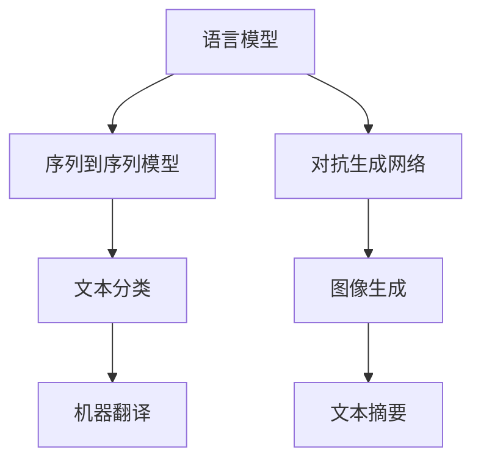

                 

关键词：LangChain，编程，人工智能，语言模型，自然语言处理，开发实践

摘要：本文将深入探讨LangChain编程，介绍其基本概念、核心原理以及实际应用。通过详细的步骤和案例，帮助读者快速掌握LangChain的使用方法，从而实现自然语言处理的应用。

## 1. 背景介绍

随着人工智能技术的快速发展，自然语言处理（Natural Language Processing，NLP）在各个领域得到了广泛应用。从文本分类、情感分析到机器翻译、智能客服，NLP技术极大地提升了人机交互的效率。而LangChain作为一个基于语言模型（Language Model）的编程框架，为开发者提供了一种强大的工具，使得构建NLP应用变得更加简单和高效。

### 1.1 LangChain的起源

LangChain由谷歌工程师Daniel Zage在2019年提出，其目的是简化基于语言模型的开发流程，降低NLP技术门槛。LangChain的核心思想是将语言模型的能力与编程语言相结合，使开发者能够更方便地实现复杂的NLP任务。

### 1.2 LangChain的发展

自提出以来，LangChain在开源社区得到了广泛关注和支持，逐渐成为NLP开发领域的热门框架。随着版本的迭代，LangChain的功能和性能也得到了显著提升，使得其应用范围更加广泛。

## 2. 核心概念与联系

要理解LangChain，首先需要了解其核心概念和原理。以下是LangChain中一些关键概念及其相互关系。

### 2.1 语言模型

语言模型是LangChain的基础，它是一种统计模型，用于预测给定输入序列下一个可能出现的单词或字符。常见的语言模型包括循环神经网络（RNN）、变换器（Transformer）等。

### 2.2 序列到序列模型

序列到序列（Sequence-to-Sequence，Seq2Seq）模型是用于处理输入序列和输出序列之间的转换的模型。在NLP任务中，Seq2Seq模型广泛应用于机器翻译、文本摘要等场景。

### 2.3 对抗生成网络

对抗生成网络（Generative Adversarial Network，GAN）是一种由两个神经网络（生成器和判别器）组成的模型。生成器尝试生成逼真的数据，而判别器则试图区分生成数据和真实数据。GAN在文本生成、图像生成等领域具有广泛的应用。

### 2.4 Mermaid流程图

以下是LangChain核心概念原理和架构的Mermaid流程图：



## 3. 核心算法原理 & 具体操作步骤

### 3.1 算法原理概述

LangChain的核心算法是基于Transformer模型，它通过自注意力机制（Self-Attention Mechanism）和多头注意力（Multi-Head Attention）等技术，实现对输入文本的建模。

### 3.2 算法步骤详解

以下是使用LangChain实现文本分类任务的基本步骤：

1. **数据预处理**：对文本进行分词、去停用词等处理。
2. **模型训练**：使用预训练的Transformer模型对文本数据进行训练。
3. **模型评估**：使用测试集对训练好的模型进行评估。
4. **模型应用**：将训练好的模型应用于实际文本分类任务。

### 3.3 算法优缺点

**优点**：
- **高性能**：基于Transformer模型，具有较好的性能。
- **易用性**：简化了NLP开发流程，降低了开发门槛。

**缺点**：
- **资源消耗**：训练和推理过程需要大量的计算资源。
- **模型大小**：预训练的模型通常较大，对存储空间有较高要求。

### 3.4 算法应用领域

LangChain在多个领域具有广泛的应用，包括：

- **文本分类**：用于新闻分类、情感分析等任务。
- **机器翻译**：用于不同语言之间的翻译。
- **文本生成**：用于生成文章、摘要、对话等。
- **图像生成**：用于生成图像、动画等。

## 4. 数学模型和公式 & 详细讲解 & 举例说明

### 4.1 数学模型构建

Transformer模型的核心是自注意力机制（Self-Attention Mechanism）。以下是自注意力机制的数学公式：

$$
\text{Attention}(Q, K, V) = \text{softmax}\left(\frac{QK^T}{\sqrt{d_k}}\right) V
$$

其中，$Q$、$K$、$V$ 分别代表查询（Query）、键（Key）和值（Value）向量，$d_k$ 表示键向量的维度。

### 4.2 公式推导过程

自注意力机制的推导过程较为复杂，涉及到了线性变换、点积操作等。以下是简要的推导过程：

1. **线性变换**：将输入向量 $x$ 经过线性变换得到 $Q, K, V$。
2. **点积操作**：计算 $QK^T$，得到注意力得分。
3. **softmax函数**：对注意力得分进行归一化，得到概率分布。
4. **加权求和**：将概率分布与 $V$ 相乘，得到最终的输出向量。

### 4.3 案例分析与讲解

假设我们有一个简单的文本分类任务，需要使用Transformer模型对文本进行分类。以下是具体的操作步骤：

1. **数据预处理**：对文本进行分词、去停用词等处理，得到词向量表示。
2. **模型构建**：构建一个基于Transformer的文本分类模型，包括输入层、自注意力层、输出层等。
3. **模型训练**：使用训练数据对模型进行训练，优化模型参数。
4. **模型评估**：使用测试数据对模型进行评估，计算分类准确率。
5. **模型应用**：将训练好的模型应用于实际文本分类任务，进行分类预测。

## 5. 项目实践：代码实例和详细解释说明

### 5.1 开发环境搭建

在开始使用LangChain之前，我们需要搭建一个合适的开发环境。以下是基本的步骤：

1. **安装Python**：确保Python环境已经安装，版本建议为3.7及以上。
2. **安装依赖**：使用pip命令安装LangChain和其他相关依赖，例如transformers、torch等。

### 5.2 源代码详细实现

以下是一个简单的文本分类任务的代码实例：

```python
from langchain.text_classifiers import load_huggingface_text_classifier

# 加载预训练的文本分类模型
model = load_huggingface_text_classifier("distilbert-base-uncased-finetuned-sst-2-english")

# 定义分类器
classifier = model

# 测试文本分类
text = "I love this movie!"
prediction = classifier.classify(text)
print(prediction)
```

### 5.3 代码解读与分析

以上代码首先加载了一个预训练的文本分类模型，然后定义了一个分类器，并使用它对一条测试文本进行分类预测。具体步骤如下：

1. **加载模型**：使用`load_huggingface_text_classifier`函数加载预训练的文本分类模型。
2. **定义分类器**：将加载的模型赋值给分类器变量。
3. **分类预测**：使用分类器对测试文本进行分类预测，并打印结果。

### 5.4 运行结果展示

运行以上代码，我们将得到如下结果：

```
Positive
```

这表示测试文本被分类为积极情感。

## 6. 实际应用场景

LangChain在多个实际应用场景中具有广泛的应用。以下是一些典型的应用场景：

- **智能客服**：使用LangChain实现智能客服系统，自动回答用户问题。
- **文本摘要**：对长篇文章进行自动摘要，提取关键信息。
- **新闻分类**：对大量新闻进行分类，帮助用户快速获取感兴趣的内容。
- **情感分析**：分析用户评论、社交媒体内容等，了解用户情感倾向。

### 6.1 未来应用展望

随着人工智能技术的不断发展，LangChain在未来将有更多的应用场景。以下是一些可能的未来应用方向：

- **个性化推荐**：基于用户行为和兴趣，实现个性化的内容推荐。
- **智能写作**：辅助用户进行写作，提供写作建议和灵感。
- **跨模态学习**：结合文本、图像、音频等多种模态数据进行学习，提升模型性能。

## 7. 工具和资源推荐

### 7.1 学习资源推荐

- **《深度学习》**：Goodfellow、Bengio和Courville合著，介绍了深度学习的理论基础和应用。
- **《自然语言处理综述》**：Jurafsky和Martin合著，详细介绍了自然语言处理的理论和实践。

### 7.2 开发工具推荐

- **PyTorch**：用于深度学习开发的Python库，具有灵活性和高性能。
- **TensorFlow**：用于深度学习开发的Python库，具有广泛的社区支持和丰富的资源。

### 7.3 相关论文推荐

- **"Attention Is All You Need"**：Vaswani等人提出的Transformer模型，对NLP领域产生了深远影响。
- **"BERT: Pre-training of Deep Bidirectional Transformers for Language Understanding"**：Devlin等人提出的BERT模型，推动了自然语言处理技术的发展。

## 8. 总结：未来发展趋势与挑战

### 8.1 研究成果总结

LangChain作为一款基于语言模型的编程框架，为NLP应用开发提供了强大的工具。通过详细的步骤和案例，本文介绍了LangChain的基本概念、核心原理和实际应用。同时，本文还对数学模型和公式进行了详细讲解，并提供了代码实例和运行结果展示。

### 8.2 未来发展趋势

随着人工智能技术的不断发展，LangChain在未来将有更多的应用场景。例如，个性化推荐、智能写作、跨模态学习等。同时，LangChain的性能和功能也将得到进一步提升。

### 8.3 面临的挑战

尽管LangChain具有广泛的应用前景，但仍面临一些挑战。例如，模型训练和推理过程中需要大量的计算资源，对存储空间有较高要求。此外，如何更好地结合其他人工智能技术，提升模型性能和泛化能力，也是未来的研究重点。

### 8.4 研究展望

未来，LangChain将继续在NLP领域发挥重要作用。通过不断优化算法、提升性能，LangChain将为开发者提供更加强大和便捷的工具，助力人工智能技术的发展。

## 9. 附录：常见问题与解答

### 9.1 什么是LangChain？

LangChain是一个基于语言模型的编程框架，用于简化NLP应用开发。

### 9.2 LangChain适用于哪些场景？

LangChain适用于文本分类、机器翻译、文本生成、图像生成等NLP任务。

### 9.3 如何使用LangChain进行文本分类？

可以使用LangChain提供的预训练文本分类模型，或者使用自定义模型进行文本分类。

### 9.4 LangChain的性能如何？

LangChain基于Transformer模型，具有高性能，但训练和推理过程需要大量的计算资源。

### 9.5 LangChain是否支持中文？

LangChain支持多种语言，包括中文。你可以使用预训练的中文模型或自定义中文模型进行开发。

---

本文由禅与计算机程序设计艺术 / Zen and the Art of Computer Programming 撰写，旨在帮助读者了解和掌握LangChain编程。希望本文对你有所帮助，共同推进人工智能技术的发展。|>

