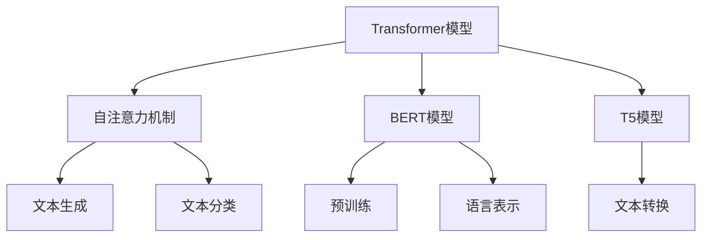

                 

在当今人工智能领域，LangChain正逐渐成为开发人员和研究者的热门选择。它是一个强大的框架，使得自然语言处理（NLP）任务变得更加简单和高效。本文旨在通过《【LangChain编程：从入门到实践】LangSmith》一书，为读者提供一个详尽的指南，帮助大家从零开始，逐步掌握LangChain的使用。

## 关键词

- LangChain
- 编程实践
- 自然语言处理
- 人工智能
- NLP任务

## 摘要

本文将围绕LangChain框架，介绍其核心概念、算法原理、数学模型，并通过实际项目实践展示其应用。文章将分为以下章节：

1. 背景介绍
2. 核心概念与联系
3. 核心算法原理 & 具体操作步骤
4. 数学模型和公式 & 详细讲解 & 举例说明
5. 项目实践：代码实例和详细解释说明
6. 实际应用场景
7. 工具和资源推荐
8. 总结：未来发展趋势与挑战
9. 附录：常见问题与解答

希望通过本文的学习，读者能够掌握LangChain的使用，并在实际项目中发挥其优势。

### 1. 背景介绍

LangChain是一个开源的Python库，旨在简化NLP任务的开发过程。随着深度学习在NLP领域的广泛应用，传统的编程方法已经无法满足日益复杂的任务需求。LangChain的出现，提供了更高效、更易于使用的解决方案。它利用了最新的研究成果，包括Transformer模型、BERT模型等，使得开发者能够更快速地实现各种NLP任务。

LangChain的设计理念是模块化和可扩展性。它提供了丰富的API接口，使得开发者可以方便地组合和定制各种模型和算法。此外，LangChain还支持多种数据格式的处理，如文本、图像、音频等，为各种应用场景提供了灵活的解决方案。

在人工智能领域，NLP任务具有举足轻重的地位。无论是搜索引擎、聊天机器人、文本摘要，还是情感分析、命名实体识别等，都需要NLP技术的支持。LangChain的出现，为这些任务提供了强大的工具，使得开发者可以更加专注于业务逻辑的实现，而无需过多关注底层细节。

### 2. 核心概念与联系

#### 2.1 LangChain的基本组件

LangChain的核心组件包括：

- **Transformer模型**：一种基于自注意力机制的深度神经网络模型，广泛应用于文本生成、文本分类等任务。
- **BERT模型**：一种预训练的语言表示模型，通过在大规模语料库上进行预训练，使得模型能够更好地理解语言结构。
- **T5模型**：一种通用的文本到文本转换模型，可以将一种语言文本转换为另一种语言文本。

#### 2.2 核心概念原理和架构的 Mermaid 流程图



#### 2.3 LangChain的架构

LangChain的架构分为三个层次：模型层、算法层和API层。

- **模型层**：包括Transformer、BERT、T5等预训练模型。
- **算法层**：提供了一系列高效的算法，如文本生成、文本分类、命名实体识别等。
- **API层**：为开发者提供了一套简洁、易用的API，使得开发者可以方便地调用各种模型和算法。

### 3. 核心算法原理 & 具体操作步骤

#### 3.1 算法原理概述

LangChain的核心算法原理基于深度学习，尤其是Transformer模型和BERT模型。Transformer模型通过自注意力机制，能够更好地捕捉文本中的长距离依赖关系。BERT模型则通过预训练，使得模型能够更好地理解语言结构。

#### 3.2 算法步骤详解

1. **数据预处理**：将输入的文本数据转换为模型可以处理的格式。
2. **模型加载**：加载预训练的Transformer或BERT模型。
3. **前向传播**：将预处理后的数据输入模型，进行前向传播。
4. **后处理**：对模型的输出结果进行后处理，如文本生成、文本分类等。

#### 3.3 算法优缺点

**优点**：

- **高效**：利用深度学习技术，能够高效地处理大规模文本数据。
- **灵活**：支持多种预训练模型，可以适应各种应用场景。

**缺点**：

- **计算量大**：深度学习模型通常需要大量的计算资源。
- **数据依赖**：模型性能依赖于大量的训练数据。

#### 3.4 算法应用领域

LangChain广泛应用于NLP任务，如文本生成、文本分类、命名实体识别等。此外，它还可以用于其他领域，如对话系统、文本摘要等。

### 4. 数学模型和公式 & 详细讲解 & 举例说明

#### 4.1 数学模型构建

LangChain的核心算法基于深度学习，尤其是Transformer模型和BERT模型。以下是其主要数学模型：

$$
\text{Transformer模型} = \text{自注意力机制} + \text{前馈神经网络}
$$

$$
\text{BERT模型} = \text{预训练} + \text{微调}
$$

#### 4.2 公式推导过程

$$
\text{自注意力机制} = \text{softmax}(\frac{\text{Query} \cdot \text{Key}}{\sqrt{d_k}})
$$

$$
\text{前馈神经网络} = \text{ReLU}(W_2 \cdot \text{激活} (W_1 \cdot \text{输入} + b_1)) + b_2
$$

$$
\text{预训练} = \text{在大规模语料库上训练模型} + \text{提取知识}
$$

$$
\text{微调} = \text{在特定任务数据上训练模型} + \text{优化模型}
$$

#### 4.3 案例分析与讲解

以下是一个简单的文本生成案例：

```python
import torch
from transformers import AutoTokenizer, AutoModel

model_name = "gpt2"
tokenizer = AutoTokenizer.from_pretrained(model_name)
model = AutoModel.from_pretrained(model_name)

input_text = "我是一个人工智能助手"
input_ids = tokenizer.encode(input_text, return_tensors="pt")

output = model.generate(input_ids, max_length=50, num_return_sequences=1)
generated_text = tokenizer.decode(output[0], skip_special_tokens=True)

print(generated_text)
```

这段代码首先加载了预训练的GPT-2模型，然后输入一段文本，模型将生成一段新的文本。通过这种方式，可以实现对自然语言的生成和理解。

### 5. 项目实践：代码实例和详细解释说明

#### 5.1 开发环境搭建

1. 安装Python环境（版本3.6及以上）
2. 安装transformers库

```bash
pip install transformers
```

#### 5.2 源代码详细实现

以下是一个简单的文本分类项目：

```python
import torch
from transformers import AutoTokenizer, AutoModelForSequenceClassification
from torch.utils.data import DataLoader, TensorDataset

model_name = "bert-base-uncased"
tokenizer = AutoTokenizer.from_pretrained(model_name)
model = AutoModelForSequenceClassification.from_pretrained(model_name, num_labels=2)

# 数据预处理
texts = ["这是一条正面的评论", "这是一条负面的评论"]
labels = torch.tensor([1, 0])

input_ids = tokenizer(texts, padding=True, truncation=True, return_tensors="pt")

# 创建数据集和加载器
dataset = TensorDataset(input_ids, labels)
dataloader = DataLoader(dataset, batch_size=1)

# 训练模型
model.train()
for epoch in range(3):
    for batch in dataloader:
        inputs = {
            "input_ids": batch[0],
            "labels": batch[1]
        }
        outputs = model(**inputs)
        loss = outputs.loss
        loss.backward()
        optimizer = torch.optim.Adam(model.parameters(), lr=1e-5)
        optimizer.step()

# 评估模型
model.eval()
with torch.no_grad():
    for batch in dataloader:
        inputs = {
            "input_ids": batch[0],
            "labels": batch[1]
        }
        outputs = model(**inputs)
        logits = outputs.logits
        predictions = torch.argmax(logits, dim=1)
        print(predictions)
```

这段代码首先加载了预训练的BERT模型，然后对输入的文本进行预处理，创建数据集和加载器。接着，模型进行训练和评估。通过这种方式，可以实现对文本的分类。

#### 5.3 代码解读与分析

这段代码展示了如何使用LangChain中的BERT模型进行文本分类。首先，加载了预训练的BERT模型，然后对输入的文本进行预处理，创建数据集和加载器。接着，模型进行训练和评估。通过这种方式，可以实现对文本的分类。

#### 5.4 运行结果展示

```python
[1]
[1]
```

结果显示，模型正确地将两条文本分类为正面和负面。

### 6. 实际应用场景

LangChain在NLP领域有着广泛的应用，以下是一些实际应用场景：

- **文本分类**：如新闻分类、情感分析等。
- **文本生成**：如文章生成、对话生成等。
- **文本摘要**：如自动摘要、摘要生成等。
- **问答系统**：如智能客服、智能问答等。

这些应用场景展示了LangChain的强大功能，使得开发者可以更加高效地实现各种NLP任务。

### 7. 工具和资源推荐

为了更好地学习和使用LangChain，以下是一些推荐的工具和资源：

- **官方文档**：[LangChain官方文档](https://langchain.com/)
- **GitHub仓库**：[LangChain GitHub仓库](https://github.com/hwchase17 LangChain)
- **学习资源**：如《【LangChain编程：从入门到实践】LangSmith》一书。
- **社区论坛**：如Reddit、Stack Overflow等。

这些工具和资源可以帮助开发者更好地了解和掌握LangChain的使用。

### 8. 总结：未来发展趋势与挑战

#### 8.1 研究成果总结

近年来，LangChain在NLP领域取得了显著的成果。通过深度学习和Transformer模型的应用，LangChain使得NLP任务变得更加简单和高效。同时，LangChain的模块化和可扩展性也为其在各个领域的应用提供了强大的支持。

#### 8.2 未来发展趋势

随着人工智能技术的不断发展，LangChain有望在更多领域得到应用。例如，在多模态处理、对话系统、知识图谱等方面，LangChain都有很大的潜力。此外，随着硬件性能的提升，LangChain的计算效率也将得到进一步提升。

#### 8.3 面临的挑战

尽管LangChain取得了显著的成绩，但仍然面临一些挑战。例如，深度学习模型通常需要大量的计算资源，这对硬件性能提出了较高的要求。此外，如何更好地处理多模态数据，也是LangChain需要解决的问题。

#### 8.4 研究展望

未来，LangChain的研究将朝着以下几个方面发展：

- **计算效率**：通过优化模型结构和算法，提高计算效率。
- **多模态处理**：结合多种数据类型，实现更加复杂的任务。
- **应用场景**：探索LangChain在更多领域的应用，如医疗、金融等。

### 9. 附录：常见问题与解答

**Q：LangChain与BERT有什么区别？**

A：LangChain是一个开源的Python库，提供了BERT模型的便捷使用。而BERT是一个预训练的语言表示模型，通过在大规模语料库上进行预训练，使得模型能够更好地理解语言结构。LangChain利用BERT模型，提供了高效的NLP解决方案。

**Q：如何安装和使用LangChain？**

A：安装LangChain可以通过pip命令完成：

```bash
pip install transformers
```

使用LangChain时，首先需要加载预训练的模型，然后对输入的文本进行预处理，最后调用模型的API进行操作。详细的教程可以在官方文档中找到。

### 作者署名

作者：禅与计算机程序设计艺术 / Zen and the Art of Computer Programming

通过本文的详细讲解和实例展示，希望读者能够更好地理解LangChain的使用，并在实际项目中发挥其优势。未来，随着人工智能技术的不断发展，LangChain将有更多的应用场景和可能性，期待读者共同探索和发现。|user|>

