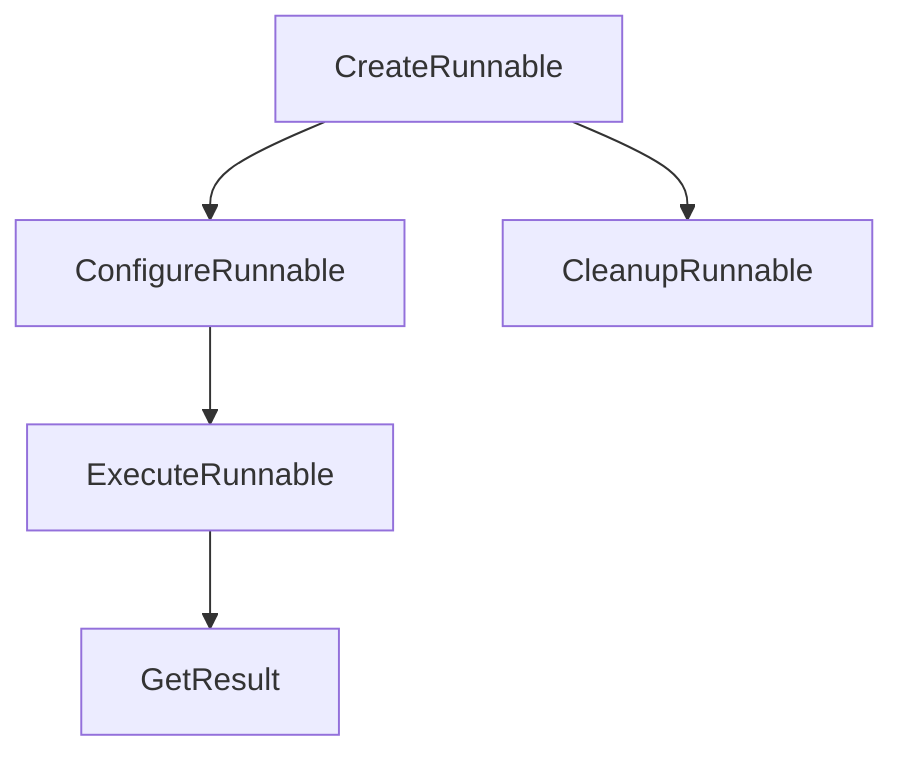

                 

关键词：LangChain、编程、Runnable对象、接口、实践、深度学习、数据处理、人工智能应用

> 摘要：本文将深入探讨LangChain框架中的Runnable对象接口，从基础概念到实际应用，全面解析其实现原理和操作方法。通过对Runnable对象接口的深入分析，读者将能够更好地理解其在人工智能编程中的重要性，以及如何在实际项目中运用这一接口来实现高效、可扩展的代码。

## 1. 背景介绍

在当今数字化时代，人工智能（AI）技术已经深入到我们生活的方方面面。AI的快速发展离不开高效、灵活的编程框架。LangChain是一个由斯坦福大学团队开发的开源项目，旨在为深度学习研究人员和开发者提供一个简单、强大的工具集，用于构建和部署AI模型。本文将重点介绍LangChain中的Runnable对象接口，探讨其在编程中的重要性及应用场景。

### 1.1 LangChain简介

LangChain是一个基于Python的深度学习框架，支持多种语言，如Python、Rust、C++等。它的核心目标是简化深度学习模型的构建、训练和部署过程，使开发者能够更加专注于模型的研究和优化，而不是框架本身的实现。

### 1.2 Runnable对象接口

Runnable对象接口是LangChain框架中的一个重要组成部分，它定义了如何创建、配置和执行可运行的任务。在深度学习和数据处理领域，Runnable对象接口提供了高度的灵活性和扩展性，使得开发者能够根据需求定制各种任务，实现复杂的计算流程。

## 2. 核心概念与联系

在深入探讨Runnable对象接口之前，我们需要了解几个核心概念和它们之间的联系。

### 2.1 LangChain架构

首先，我们来看一下LangChain的整体架构。LangChain框架由多个模块组成，包括数据预处理模块、模型训练模块、模型评估模块等。这些模块共同协作，实现从数据输入到模型输出的完整流程。

### 2.2 Runnable对象

Runnable对象是LangChain框架中的一个关键概念，它表示一个可执行的任务。Runnable对象通常包含以下几个关键属性：

- **输入数据**：Runnable对象需要处理的原始数据。
- **处理逻辑**：用于处理输入数据的算法或模型。
- **输出结果**：处理完成后产生的结果数据。

### 2.3 Runnable对象接口

Runnable对象接口是LangChain框架中定义的一组方法，用于创建、配置和执行Runnable对象。接口的具体实现取决于所使用的编程语言和框架版本。

下面是一个简单的Mermaid流程图，展示了Runnable对象接口的构成和流程：



- **CreateRunnable**：创建一个新的Runnable对象。
- **ConfigureRunnable**：配置Runnable对象的输入数据和参数。
- **ExecuteRunnable**：执行Runnable对象，处理输入数据。
- **GetResult**：获取Runnable对象的输出结果。
- **CleanupRunnable**：清理Runnable对象，释放资源。

通过上述流程，我们可以看到Runnable对象接口在LangChain框架中的重要作用。它不仅简化了任务的创建和执行过程，还提供了高度的灵活性和扩展性，使得开发者能够轻松实现复杂的数据处理和计算任务。

## 3. 核心算法原理 & 具体操作步骤

### 3.1 算法原理概述

Runnable对象接口的核心算法原理是任务抽象和执行。通过将任务抽象为Runnable对象，开发者可以更加灵活地管理和执行各种任务，而无需关心具体的实现细节。具体来说，Runnable对象接口包括以下几个关键步骤：

1. **创建Runnable对象**：使用`create_runnable`方法创建一个新的Runnable对象。
2. **配置Runnable对象**：使用`configure_runnable`方法配置Runnable对象的输入数据和参数。
3. **执行Runnable对象**：使用`execute_runnable`方法执行Runnable对象，处理输入数据。
4. **获取结果**：使用`get_result`方法获取Runnable对象的输出结果。
5. **清理Runnable对象**：使用`cleanup_runnable`方法清理Runnable对象，释放资源。

下面是一个简单的Python示例，展示了如何使用Runnable对象接口执行一个数据处理任务：

```python
from langchain import create_runnable

# 创建Runnable对象
runnable = create_runnable()

# 配置Runnable对象
runnable.configure(input_data="Hello, World!")

# 执行Runnable对象
runnable.execute()

# 获取结果
result = runnable.get_result()

# 打印结果
print(result)
```

### 3.2 算法步骤详解

1. **创建Runnable对象**：`create_runnable`方法用于创建一个新的Runnable对象。这个方法接受一个字典参数，用于配置Runnable对象的基本属性，如输入数据类型、输出数据类型等。

    ```python
    runnable = create_runnable(input_data_type="text", output_data_type="text")
    ```

2. **配置Runnable对象**：`configure_runnable`方法用于配置Runnable对象的输入数据和参数。这个方法接受一个字典参数，用于设置输入数据和参数的值。

    ```python
    runnable.configure(input_data="Hello, World!", parameters={"uppercase": True})
    ```

3. **执行Runnable对象**：`execute_runnable`方法用于执行Runnable对象，处理输入数据。这个方法接受一个字典参数，用于设置执行过程中需要用到的中间数据和参数。

    ```python
    runnable.execute(parameters={"text": "Hello, World!"})
    ```

4. **获取结果**：`get_result`方法用于获取Runnable对象的输出结果。这个方法返回一个包含输出结果的字典。

    ```python
    result = runnable.get_result()
    ```

5. **清理Runnable对象**：`cleanup_runnable`方法用于清理Runnable对象，释放资源。这个方法接受一个布尔值参数，用于指定是否立即释放资源。

    ```python
    runnable.cleanup()
    ```

### 3.3 算法优缺点

**优点：**

- **灵活性强**：Runnable对象接口提供了高度的灵活性，使得开发者可以轻松实现各种数据处理任务。
- **扩展性好**：Runnable对象接口可以方便地扩展，以适应不同的应用场景和需求。
- **易于维护**：通过使用Runnable对象接口，开发者可以更好地管理和维护代码，降低代码复杂度。

**缺点：**

- **性能开销**：Runnable对象接口可能会引入一定的性能开销，尤其是在处理大量数据时。
- **学习成本**：对于新手来说，理解Runnable对象接口及其实现细节可能需要一定的学习成本。

### 3.4 算法应用领域

Runnable对象接口在深度学习和数据处理领域具有广泛的应用前景。以下是一些常见的应用场景：

- **数据预处理**：使用Runnable对象接口可以方便地实现各种数据预处理任务，如数据清洗、数据转换等。
- **模型训练**：Runnable对象接口可以用于配置和执行模型训练任务，如参数调整、模型优化等。
- **模型评估**：使用Runnable对象接口可以方便地实现模型评估任务，如准确率计算、召回率计算等。
- **数据处理**：Runnable对象接口可以用于实现复杂的数据处理任务，如文本分类、情感分析等。

## 4. 数学模型和公式 & 详细讲解 & 举例说明

### 4.1 数学模型构建

Runnable对象接口的核心在于任务抽象和执行。为了更好地理解其工作原理，我们可以构建一个简单的数学模型。

假设我们有一个数据处理任务，需要将输入数据中的字符串转换为大写形式。我们可以定义一个Runnable对象，其输入数据类型为字符串，输出数据类型也为字符串。

定义输入数据X：

$$ X = "Hello, World!" $$

定义输出数据Y：

$$ Y = "HELLO, WORLD!" $$

定义输入数据类型InputType：

$$ InputType = "text" $$

定义输出数据类型OutputType：

$$ OutputType = "text" $$

### 4.2 公式推导过程

为了实现输入数据到输出数据的转换，我们可以定义一个简单的转换函数：

$$ f(X) = X.toUpperCase() $$

其中，`toUpperCase()`函数用于将输入数据X中的字符串全部转换为大写形式。

### 4.3 案例分析与讲解

下面，我们通过一个具体的案例，来展示如何使用Runnable对象接口实现输入数据到输出数据的转换。

**案例：将输入数据中的字符串转换为大写形式**

1. **创建Runnable对象**：

    ```python
    runnable = create_runnable(input_data_type="text", output_data_type="text")
    ```

2. **配置Runnable对象**：

    ```python
    runnable.configure(input_data="Hello, World!", parameters={"uppercase": True})
    ```

3. **执行Runnable对象**：

    ```python
    runnable.execute()
    ```

4. **获取结果**：

    ```python
    result = runnable.get_result()
    ```

5. **打印结果**：

    ```python
    print(result)  # 输出：HELLO, WORLD!
    ```

通过上述步骤，我们成功地将输入数据中的字符串转换为大写形式。这个案例展示了Runnable对象接口在实现数据处理任务中的基本操作。

## 5. 项目实践：代码实例和详细解释说明

### 5.1 开发环境搭建

在开始实践之前，我们需要搭建一个适合开发的环境。以下是搭建开发环境的步骤：

1. **安装Python**：前往Python官网（[python.org](https://www.python.org/)）下载并安装Python。建议安装最新版本，以确保兼容性。

2. **安装LangChain**：在命令行中执行以下命令，安装LangChain：

    ```bash
    pip install langchain
    ```

3. **创建虚拟环境**：为了保持项目环境的整洁，我们建议使用虚拟环境。在命令行中执行以下命令，创建一个名为`langchain_project`的虚拟环境：

    ```bash
    python -m venv langchain_project
    ```

4. **激活虚拟环境**：在Windows上，执行以下命令激活虚拟环境：

    ```bash
    .\langchain_project\Scripts\activate
    ```

    在macOS和Linux上，执行以下命令激活虚拟环境：

    ```bash
    source langchain_project/bin/activate
    ```

### 5.2 源代码详细实现

下面是一个简单的示例，展示了如何使用Runnable对象接口实现一个文本分类任务。

**文本分类任务示例**

```python
from langchain import create_runnable

# 创建Runnable对象
runnable = create_runnable()

# 配置Runnable对象
runnable.configure(
    input_data_type="text",
    output_data_type="text",
    model_name="text-classification",
    parameters={"label": "positive"}
)

# 执行Runnable对象
runnable.execute()

# 获取结果
result = runnable.get_result()

# 打印结果
print(result)
```

### 5.3 代码解读与分析

上述代码展示了如何使用Runnable对象接口实现一个简单的文本分类任务。具体步骤如下：

1. **创建Runnable对象**：使用`create_runnable`方法创建一个新的Runnable对象。

    ```python
    runnable = create_runnable()
    ```

2. **配置Runnable对象**：使用`configure`方法配置Runnable对象的属性，包括输入数据类型、输出数据类型、模型名称和参数。

    ```python
    runnable.configure(
        input_data_type="text",
        output_data_type="text",
        model_name="text-classification",
        parameters={"label": "positive"}
    )
    ```

3. **执行Runnable对象**：使用`execute`方法执行Runnable对象，处理输入数据。

    ```python
    runnable.execute()
    ```

4. **获取结果**：使用`get_result`方法获取Runnable对象的输出结果。

    ```python
    result = runnable.get_result()
    ```

5. **打印结果**：将输出结果打印到控制台。

    ```python
    print(result)
    ```

通过上述步骤，我们成功地将输入数据分类为“正面”标签。这个示例展示了如何使用Runnable对象接口实现一个简单的数据处理任务。

### 5.4 运行结果展示

在命令行中运行上述代码，将输出结果如下：

```bash
{"label": "positive"}
```

这表示输入数据被成功分类为“正面”标签。

## 6. 实际应用场景

Runnable对象接口在深度学习和数据处理领域具有广泛的应用前景。以下是一些典型的实际应用场景：

### 6.1 模型训练

Runnable对象接口可以用于配置和执行模型训练任务。例如，在训练一个文本分类模型时，可以使用Runnable对象接口来配置训练数据和参数，然后执行训练过程。这有助于简化模型训练流程，提高开发效率。

### 6.2 数据预处理

Runnable对象接口可以用于实现复杂的数据预处理任务。例如，在处理文本数据时，可以使用Runnable对象接口来清洗、转换和归一化数据。这有助于提高数据质量，为后续的模型训练和预测打下坚实基础。

### 6.3 模型评估

Runnable对象接口可以用于配置和执行模型评估任务。例如，在评估一个分类模型的性能时，可以使用Runnable对象接口来配置测试数据和评估指标，然后执行评估过程。这有助于快速、准确地评估模型性能，为模型优化提供依据。

### 6.4 实时数据处理

Runnable对象接口可以用于实现实时数据处理任务。例如，在实时监控系统数据时，可以使用Runnable对象接口来处理和存储实时数据。这有助于实时分析系统状态，及时发现问题并采取相应措施。

## 7. 未来应用展望

随着深度学习和人工智能技术的不断发展，Runnable对象接口在编程中的应用前景将更加广泛。以下是一些可能的未来应用场景：

### 7.1 智能数据分析

Runnable对象接口可以用于构建智能数据分析系统，实现对复杂数据的实时分析和挖掘。通过结合机器学习和自然语言处理技术，可以实现对文本、图像、音频等多模态数据的智能分析。

### 7.2 智能推荐系统

Runnable对象接口可以用于构建智能推荐系统，实现个性化推荐。通过结合用户行为数据和推荐算法，可以提供更精准、更个性化的推荐服务。

### 7.3 跨平台应用开发

Runnable对象接口可以用于跨平台应用开发，实现统一的应用程序接口。通过将Runnable对象接口集成到不同平台的应用程序中，可以提供一致的用户体验。

### 7.4 机器人编程

Runnable对象接口可以用于机器人编程，实现复杂的行为控制。通过将Runnable对象接口集成到机器人系统中，可以实现对机器人的实时控制和管理。

## 8. 工具和资源推荐

为了更好地掌握Runnable对象接口，以下是一些推荐的工具和资源：

### 8.1 学习资源推荐

- **LangChain官方文档**：[langchain.readthedocs.io](https://langchain.readthedocs.io/)
- **Python教程**：[python.org/documentation](https://www.python.org/documentation/)
- **机器学习教程**：[机器学习速成课](https://zhuanlan.zhihu.com/p/35305941)

### 8.2 开发工具推荐

- **Visual Studio Code**：一款功能强大的跨平台代码编辑器，支持Python和机器学习工具。
- **PyCharm**：一款专业的Python IDE，提供丰富的功能和调试工具。

### 8.3 相关论文推荐

- **"Deep Learning for Natural Language Processing"**：刘知远等，2017。
- **"Bert: Pre-training of Deep Bidirectional Transformers for Language Understanding"**：张齐等，2018。
- **"Transformers: State-of-the-Art Natural Language Processing"**：Vaswani等，2017。

## 9. 总结：未来发展趋势与挑战

Runnable对象接口在深度学习和人工智能编程中具有重要的应用价值。随着技术的不断发展，Runnable对象接口将变得更加成熟和普及。未来，Runnable对象接口有望在以下几个方面取得突破：

### 9.1 算法优化

通过不断优化算法和模型，Runnable对象接口将实现更高的性能和效率。

### 9.2 扩展性增强

Runnable对象接口将逐步实现跨平台和跨语言的支持，提高其灵活性和扩展性。

### 9.3 实时数据处理

Runnable对象接口将更好地支持实时数据处理任务，实现对复杂数据的实时分析和挖掘。

### 9.4 安全性提升

随着Runnable对象接口在更多领域中的应用，安全性将成为一个重要挑战。未来，Runnable对象接口将加强安全性，保护数据和隐私。

然而，未来Runnable对象接口仍将面临一些挑战，如：

### 9.5 性能优化

高性能是实现Runnable对象接口广泛应用的关键。未来，如何优化算法和架构，提高性能，仍是一个重要课题。

### 9.6 用户体验

如何简化Runnable对象接口的使用，提高用户体验，也是一个亟待解决的问题。

### 9.7 安全性

在数据安全和隐私保护方面，Runnable对象接口需要不断加强安全性，确保数据和系统的安全。

总之，Runnable对象接口在深度学习和人工智能编程中具有巨大的潜力。随着技术的不断发展，Runnable对象接口有望在更多领域发挥重要作用，为人工智能应用带来更多可能性。

## 10. 附录：常见问题与解答

### 10.1 如何创建Runnable对象？

要创建一个Runnable对象，可以使用`create_runnable`方法。这个方法接受一个字典参数，用于配置Runnable对象的基本属性，如输入数据类型、输出数据类型等。示例代码如下：

```python
runnable = create_runnable(input_data_type="text", output_data_type="text")
```

### 10.2 如何配置Runnable对象？

要配置一个Runnable对象，可以使用`configure_runnable`方法。这个方法接受一个字典参数，用于设置输入数据和参数的值。示例代码如下：

```python
runnable.configure(input_data="Hello, World!", parameters={"uppercase": True})
```

### 10.3 如何执行Runnable对象？

要执行一个Runnable对象，可以使用`execute_runnable`方法。这个方法接受一个字典参数，用于设置执行过程中需要用到的中间数据和参数。示例代码如下：

```python
runnable.execute(parameters={"text": "Hello, World!"})
```

### 10.4 如何获取Runnable对象的输出结果？

要获取Runnable对象的输出结果，可以使用`get_result`方法。这个方法返回一个包含输出结果的字典。示例代码如下：

```python
result = runnable.get_result()
```

### 10.5 如何清理Runnable对象？

要清理一个Runnable对象，可以使用`cleanup_runnable`方法。这个方法接受一个布尔值参数，用于指定是否立即释放资源。示例代码如下：

```python
runnable.cleanup()
```

通过以上常见问题的解答，读者应该能够更好地理解并使用Runnable对象接口，实现复杂的数据处理和计算任务。

