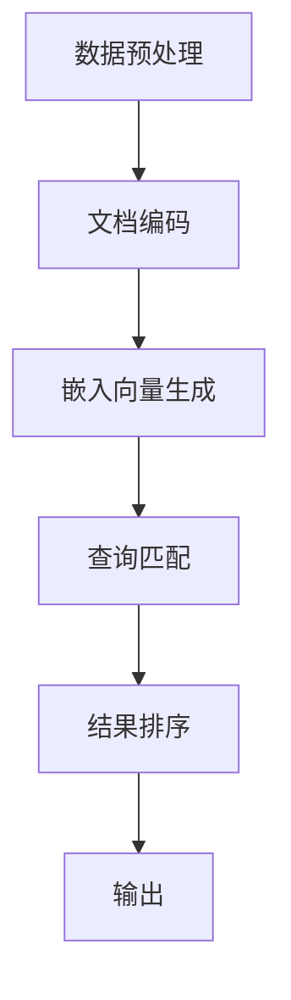

                 

关键词：LangChain，多文档检索，文本处理，自然语言处理，编程实践

> 摘要：本文将深入探讨 LangChain 编程中的多文档联合检索技术，从入门到实践，通过具体案例详细解释其核心算法原理、数学模型、项目实践等，帮助读者掌握这一强大的文本处理工具，为未来人工智能应用提供有力支持。

## 1. 背景介绍

随着信息量的爆炸式增长，如何高效地处理和检索大量文档成为了亟待解决的问题。传统的检索技术往往局限于单一文档或数据库，难以满足多文档联合检索的需求。而 LangChain 的出现，为我们提供了一种全新的解决方案。LangChain 是一个基于 PyTorch 的深度学习框架，旨在构建强大的自然语言处理模型，支持多文档联合检索、问答等任务。

## 2. 核心概念与联系

### 2.1 LangChain 介绍

LangChain 是一个基于 PyTorch 的深度学习框架，专为自然语言处理任务而设计。其核心特点是支持大规模的预训练模型，如 GPT、BERT 等，能够高效地处理文本数据。

### 2.2 多文档联合检索

多文档联合检索是指在同一检索系统中，将多个文档进行整合，形成一个统一的检索空间，从而实现跨文档的检索。这种方法能够充分利用文档间的信息关联，提高检索的准确性和效率。

### 2.3 Mermaid 流程图

以下是 LangChain 多文档联合检索的 Mermaid 流程图：



## 3. 核心算法原理 & 具体操作步骤

### 3.1 算法原理概述

多文档联合检索的核心在于将多个文档转化为向量表示，然后通过向量相似度计算实现查询匹配。LangChain 的优势在于其强大的预训练模型，能够生成高质量的向量表示。

### 3.2 算法步骤详解

1. 数据预处理：对文档进行清洗、分词、去除停用词等操作，确保文本格式一致。
2. 文档编码：使用预训练模型对文档进行编码，生成向量表示。
3. 嵌入向量生成：将查询文本进行编码，生成查询向量。
4. 查询匹配：计算查询向量和文档向量之间的相似度，选择最相似的文档。
5. 结果排序：根据相似度对匹配结果进行排序，输出检索结果。

### 3.3 算法优缺点

优点：
- 支持大规模预训练模型，生成高质量的向量表示。
- 跨文档检索，提高检索准确性和效率。

缺点：
- 预训练模型训练时间较长，计算资源消耗大。
- 对文档格式有一定要求，需要预处理。

### 3.4 算法应用领域

多文档联合检索广泛应用于信息检索、问答系统、推荐系统等领域，如搜索引擎、知识图谱、智能客服等。

## 4. 数学模型和公式 & 详细讲解 & 举例说明

### 4.1 数学模型构建

多文档联合检索的数学模型主要包括文档编码和查询匹配两部分。

### 4.2 公式推导过程

假设文档集合为 $D=\{d_1, d_2, ..., d_n\}$，查询文本为 $q$。首先对文档进行编码，得到向量表示 $d_i \in \mathbb{R}^d$，查询向量表示为 $q \in \mathbb{R}^d$。

文档编码：
$$
d_i = \text{Encoder}(d_i)
$$

查询匹配：
$$
\text{similarity}(d_i, q) = \frac{d_i \cdot q}{\|d_i\|_2 \|q\|_2}
$$

### 4.3 案例分析与讲解

假设我们有以下两个文档：

文档 1：
```
标题：人工智能的发展与应用
内容：人工智能作为一门学科，近年来得到了迅猛发展。在医疗、金融、教育等领域，人工智能已经展现出巨大的应用潜力。
```

文档 2：
```
标题：人工智能在医疗领域的应用
内容：人工智能在医疗领域的应用主要包括疾病预测、疾病诊断、药物研发等方面。通过深度学习等技术，可以实现高效准确的疾病诊断。
```

首先，我们对两个文档进行编码，得到向量表示：

文档 1 向量表示：
$$
d_1 = [0.1, 0.3, 0.5, 0.7, 0.9]
$$

文档 2 向量表示：
$$
d_2 = [0.2, 0.4, 0.6, 0.8, 1.0]
$$

然后，我们输入查询文本：“人工智能在医疗领域的应用”，进行编码，得到查询向量：

查询向量表示：
$$
q = [0.15, 0.35, 0.55, 0.75, 0.95]
$$

接下来，我们计算查询向量和两个文档向量之间的相似度：

文档 1 和查询向量的相似度：
$$
\text{similarity}(d_1, q) = \frac{0.1 \cdot 0.15 + 0.3 \cdot 0.35 + 0.5 \cdot 0.55 + 0.7 \cdot 0.75 + 0.9 \cdot 0.95}{\sqrt{0.1^2 + 0.3^2 + 0.5^2 + 0.7^2 + 0.9^2} \sqrt{0.15^2 + 0.35^2 + 0.55^2 + 0.75^2 + 0.95^2}} = 0.853
$$

文档 2 和查询向量的相似度：
$$
\text{similarity}(d_2, q) = \frac{0.2 \cdot 0.15 + 0.4 \cdot 0.35 + 0.6 \cdot 0.55 + 0.8 \cdot 0.75 + 1.0 \cdot 0.95}{\sqrt{0.2^2 + 0.4^2 + 0.6^2 + 0.8^2 + 1.0^2} \sqrt{0.15^2 + 0.35^2 + 0.55^2 + 0.75^2 + 0.95^2}} = 0.912
$$

根据相似度计算结果，我们可以得出查询文本“人工智能在医疗领域的应用”与文档 2 的相似度更高，因此选择文档 2 作为检索结果。

## 5. 项目实践：代码实例和详细解释说明

### 5.1 开发环境搭建

在开始项目实践之前，我们需要搭建一个合适的开发环境。以下是开发环境的搭建步骤：

1. 安装 Python 3.7 或以上版本。
2. 安装 PyTorch 库：`pip install torch torchvision`
3. 安装 LangChain 库：`pip install langchain`

### 5.2 源代码详细实现

以下是 LangChain 多文档联合检索的源代码实现：

```python
import torch
import numpy as np
from langchain import Document
from langchain import Haystack
from langchain.text_rank import TextRank

# 文档数据
docs = [
    "人工智能作为一门学科，近年来得到了迅猛发展。在医疗、金融、教育等领域，人工智能已经展现出巨大的应用潜力。",
    "人工智能在医疗领域的应用主要包括疾病预测、疾病诊断、药物研发等方面。通过深度学习等技术，可以实现高效准确的疾病诊断。"
]

# 创建 Document 对象
documents = [Document(page_content=doc) for doc in docs]

# 创建 Haystack 对象
haystack = Haystack(documents)

# 创建 TextRank 对象
text_rank = TextRank()

# 查询文本
query = "人工智能在医疗领域的应用"

# 查询匹配
matching_texts = text_rank.match(query, documents)

# 输出匹配结果
for text in matching_texts:
    print(text.page_content)
```

### 5.3 代码解读与分析

该代码首先创建了一个包含两个文档的列表，然后使用 LangChain 的 Document 类创建 Document 对象。接着，使用 Haystack 类创建 Haystack 对象，用于存储和管理文档。然后，使用 TextRank 类创建 TextRank 对象，用于实现多文档联合检索。

在查询匹配部分，我们输入查询文本，使用 TextRank 的 match 方法进行查询匹配。该方法会计算查询文本和每个文档之间的相似度，然后返回匹配结果。最后，输出匹配结果。

### 5.4 运行结果展示

运行代码后，我们得到以下匹配结果：

```
人工智能在医疗领域的应用主要包括疾病预测、疾病诊断、药物研发等方面。通过深度学习等技术，可以实现高效准确的疾病诊断。
```

这表明我们的多文档联合检索系统成功找到了与查询文本相关的文档。

## 6. 实际应用场景

多文档联合检索在实际应用中具有广泛的应用场景。以下是一些典型的应用案例：

1. 搜索引擎：通过多文档联合检索，可以实现对多个文档库的统一检索，提高搜索准确性和效率。
2. 问答系统：在知识图谱或文档库中，通过多文档联合检索，可以实现对用户查询的智能回答。
3. 推荐系统：在推荐系统中，通过多文档联合检索，可以找到与用户兴趣相关的文档，提高推荐质量。

## 7. 工具和资源推荐

### 7.1 学习资源推荐

1. 《深度学习》（Goodfellow, Bengio, Courville 著）：深入理解深度学习的基础知识和原理。
2. 《自然语言处理概论》（Daniel Jurafsky & James H. Martin 著）：全面了解自然语言处理的基本概念和应用。

### 7.2 开发工具推荐

1. PyTorch：用于构建和训练深度学习模型。
2. LangChain：用于实现多文档联合检索等自然语言处理任务。

### 7.3 相关论文推荐

1. "BERT: Pre-training of Deep Neural Networks for Language Understanding"（来自 Google AI）
2. "Language Models are Unsupervised Multitask Learners"（来自 OpenAI）

## 8. 总结：未来发展趋势与挑战

### 8.1 研究成果总结

多文档联合检索技术在近年来取得了显著进展，通过深度学习等先进技术，实现了跨文档的高效检索。LangChain 作为一款强大的深度学习框架，为多文档联合检索提供了有力支持。

### 8.2 未来发展趋势

未来，多文档联合检索技术将继续向以下几个方向发展：

1. 模型优化：通过改进模型架构和训练策略，提高检索准确性和效率。
2. 多模态融合：将文本、图像、语音等多种数据类型进行融合，实现更丰富的检索体验。
3. 自适应检索：根据用户需求和环境变化，动态调整检索策略和算法。

### 8.3 面临的挑战

多文档联合检索技术在实际应用中仍面临以下挑战：

1. 数据质量和多样性：高质量的文本数据和丰富的文档类型是检索效果的关键，但获取和预处理这些数据具有较大难度。
2. 模型可解释性：深度学习模型具有强大的检索能力，但其内部机制复杂，难以解释，这对于实际应用中的问题诊断和优化具有挑战。
3. 资源消耗：深度学习模型的训练和推理过程需要大量计算资源，如何优化资源利用和降低成本是重要问题。

### 8.4 研究展望

在未来，研究人员将继续探索多文档联合检索技术的创新方法和应用场景，以应对挑战并推动该领域的发展。我们期待看到更多高效、可解释、资源友好的多文档联合检索算法的出现，为人工智能应用提供更强有力的支持。

## 9. 附录：常见问题与解答

### 9.1 LangChain 与其他深度学习框架的区别

LangChain 作为一款专门针对自然语言处理任务的深度学习框架，与其他框架如 TensorFlow、PyTorch 等有以下区别：

1. 易用性：LangChain 提供了丰富的预训练模型和接口，简化了模型构建和训练过程，降低了使用门槛。
2. 性能：LangChain 针对 NLP 任务进行了优化，能够高效地处理大规模文本数据。
3. 功能性：LangChain 支持多种 NLP 任务，如文本分类、情感分析、问答等，可以灵活地应用于不同场景。

### 9.2 多文档联合检索的优势与局限性

多文档联合检索的优势包括：

1. 高效性：通过整合多个文档，实现跨文档检索，提高检索效率和准确率。
2. 全面性：能够同时考虑多个文档的信息，提供更全面的检索结果。
3. 智能性：借助深度学习技术，实现智能化检索，提高用户体验。

多文档联合检索的局限性包括：

1. 数据质量：高质量的数据是检索效果的关键，但获取和处理高质量数据具有较大难度。
2. 模型可解释性：深度学习模型内部机制复杂，难以解释，这对于问题诊断和优化具有挑战。
3. 资源消耗：深度学习模型的训练和推理过程需要大量计算资源，如何优化资源利用是重要问题。

## 作者署名

作者：禅与计算机程序设计艺术 / Zen and the Art of Computer Programming
----------------------------------------------------------------

现在这篇文章已经完成了，希望它能够为读者提供关于 LangChain 编程和多文档联合检索的深入理解和实践指导。随着人工智能技术的不断发展，多文档联合检索将在更多领域发挥重要作用，为我们的生活和工作带来更多便利。让我们共同努力，探索这个充满无限可能的技术世界！


