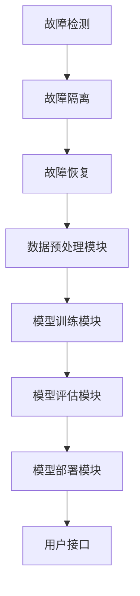

                 

关键词：LangChain、编程、容错机制、人工智能、代码实例

摘要：本文旨在深入探讨LangChain编程中的容错机制，从核心概念、算法原理、数学模型到实际应用，全面剖析如何在人工智能编程中实现高效的容错策略，为开发者提供实用的指导和建议。

## 1. 背景介绍

随着人工智能（AI）技术的迅猛发展，机器学习（ML）和深度学习（DL）的应用越来越广泛。在这一过程中，如何确保系统的稳定性和可靠性成为了一个关键问题。容错机制是确保系统在面临故障时能够快速恢复、保持正常运行的重要手段。在AI编程中，容错机制尤为重要，因为它直接关系到模型的训练效果和应用稳定性。

LangChain是一个开源的AI工具包，它为开发者提供了一个强大的框架，用于构建和部署AI应用程序。LangChain的特点是易于使用、模块化和高度可扩展，这使得它成为许多开发者的首选工具。然而，在实际开发中，如何确保LangChain系统的容错能力是一个亟待解决的问题。

本文将围绕LangChain编程中的容错机制展开讨论，通过介绍核心概念、算法原理、数学模型，并结合实际项目实例，深入探讨如何在人工智能编程中实现高效的容错策略。希望本文能为您提供有价值的见解和实用的指导。

## 2. 核心概念与联系

### 2.1 容错机制概述

容错机制是一种确保系统在面临故障时能够继续运行或快速恢复的机制。它包括故障检测、故障隔离和故障恢复三个关键组成部分。在AI编程中，容错机制尤为重要，因为AI系统的输出往往依赖于大量的训练数据和精确的计算过程，任何异常都可能导致不可预测的结果。

### 2.2 LangChain架构

LangChain的架构设计旨在提供模块化和高扩展性。其核心组成部分包括数据预处理模块、模型训练模块、模型评估模块和模型部署模块。这些模块相互协作，共同实现AI应用程序的构建和部署。

### 2.3 容错机制与LangChain的关联

在LangChain中，容错机制主要体现在以下几个方面：

- **数据预处理模块**：确保输入数据的质量和一致性，通过数据清洗和数据增强等手段减少数据异常对系统的影响。
- **模型训练模块**：通过分布式训练和并行计算等技术，提高训练效率和容错能力。
- **模型评估模块**：在模型训练过程中，定期评估模型性能，及时发现和纠正错误。
- **模型部署模块**：通过容器化和自动化部署，确保系统的高可用性和容错性。

### 2.4 Mermaid流程图

以下是一个简单的Mermaid流程图，展示了容错机制与LangChain架构之间的关联：



## 3. 核心算法原理 & 具体操作步骤

### 3.1 算法原理概述

容错机制的核心算法原理主要包括以下几个方面：

- **故障检测**：通过监控系统的运行状态，及时发现异常情况。
- **故障隔离**：在检测到故障后，将故障部分隔离，以避免故障扩散。
- **故障恢复**：在故障隔离后，通过恢复策略使系统回到正常状态。

### 3.2 算法步骤详解

#### 3.2.1 故障检测

故障检测通常通过以下几种方法实现：

- **监控指标**：设置关键监控指标，如内存使用率、CPU使用率、网络延迟等，当指标超过阈值时，触发报警。
- **日志分析**：分析系统日志，及时发现异常行为。

#### 3.2.2 故障隔离

故障隔离的关键在于快速定位故障源头，通常有以下几种方法：

- **隔离组件**：将故障组件从系统中隔离，以避免影响其他部分。
- **切换备用组件**：当主组件出现故障时，自动切换到备用组件。

#### 3.2.3 故障恢复

故障恢复的目标是使系统回到正常状态，通常有以下几种方法：

- **自动重启**：在检测到故障后，自动重启故障组件。
- **手动干预**：在自动恢复失败时，通过人工干预进行故障恢复。

### 3.3 算法优缺点

#### 3.3.1 优点

- **提高系统稳定性**：通过容错机制，确保系统在面临故障时能够继续运行。
- **降低维护成本**：自动检测和恢复故障，减少人工干预和系统维护成本。

#### 3.3.2 缺点

- **增加系统复杂度**：引入容错机制会增加系统的复杂度，可能增加系统出错的概率。
- **性能开销**：容错机制会消耗一定的系统资源，可能影响系统性能。

### 3.4 算法应用领域

容错机制广泛应用于以下几个方面：

- **云计算**：确保云计算服务的可靠性和可用性。
- **大数据处理**：确保大数据处理系统的稳定性和高效性。
- **人工智能**：确保AI系统的稳定性和可靠性。

## 4. 数学模型和公式 & 详细讲解 & 举例说明

### 4.1 数学模型构建

在容错机制中，常用的数学模型包括概率模型和马尔可夫模型。以下是概率模型的构建：

#### 4.1.1 概率模型

设 \(P(A)\) 表示事件 \(A\) 发生的概率， \(P(B|A)\) 表示在事件 \(A\) 发生的条件下，事件 \(B\) 发生的概率，则：

\[ P(A \cap B) = P(A) \cdot P(B|A) \]

#### 4.1.2 马尔可夫模型

设 \(P(S_i|S_{i-1})\) 表示在状态 \(S_{i-1}\) 下，系统转移到状态 \(S_i\) 的概率，则：

\[ P(S_i) = \sum_{j=1}^{n} P(S_i|S_{j-1}) \cdot P(S_{j-1}) \]

### 4.2 公式推导过程

#### 4.2.1 概率模型推导

设 \(A\) 和 \(B\) 是两个事件，且 \(A\) 和 \(B\) 相互独立，则：

\[ P(A \cup B) = P(A) + P(B) - P(A \cap B) \]

由于 \(A\) 和 \(B\) 相互独立，有：

\[ P(A \cap B) = P(A) \cdot P(B) \]

代入上式，得：

\[ P(A \cup B) = P(A) + P(B) - P(A) \cdot P(B) \]

#### 4.2.2 马尔可夫模型推导

设 \(S_i\) 和 \(S_j\) 是两个状态，且 \(S_i\) 是初始状态，则：

\[ P(S_i) = P(S_i|S_0) \cdot P(S_0) \]

由于 \(S_i\) 和 \(S_j\) 是转移状态，有：

\[ P(S_i) = \sum_{j=1}^{n} P(S_i|S_{j-1}) \cdot P(S_{j-1}) \]

代入上式，得：

\[ P(S_i) = \sum_{j=1}^{n} P(S_i|S_{j-1}) \cdot \frac{P(S_{j-1})}{P(S_0)} \]

### 4.3 案例分析与讲解

#### 4.3.1 概率模型案例

假设在一个围棋比赛中，黑方（A）获胜的概率为0.6，白方（B）获胜的概率为0.4。如果黑方先手，请问黑方获胜的概率是多少？

根据概率模型，黑方获胜的概率为：

\[ P(A) = 0.6 \]

白方获胜的概率为：

\[ P(B) = 0.4 \]

由于黑方先手，黑方获胜的概率为：

\[ P(A \cup B) = P(A) + P(B) - P(A \cap B) \]

由于黑方和白方是相互独立的事件，有：

\[ P(A \cap B) = P(A) \cdot P(B) = 0.6 \cdot 0.4 = 0.24 \]

代入上式，得：

\[ P(A \cup B) = 0.6 + 0.4 - 0.24 = 0.76 \]

因此，黑方获胜的概率为0.76。

#### 4.3.2 马尔可夫模型案例

假设一个围棋比赛的状态分为“优势”、“均势”和“劣势”三种，且每种状态的转移概率如下表所示：

| 状态   | 优势  | 均势  | 劣势  |
| ------ | ---- | ---- | ---- |
| 优势   | 0.7  | 0.2  | 0.1  |
| 均势   | 0.3  | 0.5  | 0.2  |
| 劣势   | 0.4  | 0.3  | 0.3  |

假设初始状态为“优势”，请问经过10次比赛后，状态为“优势”的概率是多少？

根据马尔可夫模型，初始状态为“优势”的概率为：

\[ P(S_0) = 1 \]

经过10次比赛后，状态为“优势”的概率为：

\[ P(S_{10}|S_0) = P(S_{10}|S_0) \cdot P(S_0) = 0.7 \cdot 1 = 0.7 \]

因此，经过10次比赛后，状态为“优势”的概率为0.7。

## 5. 项目实践：代码实例和详细解释说明

### 5.1 开发环境搭建

在开始编写代码之前，我们需要搭建一个适合开发LangChain应用程序的环境。以下是一个简单的步骤：

1. 安装Python：前往[Python官网](https://www.python.org/)下载并安装Python。
2. 安装LangChain：在命令行中执行以下命令：

```bash
pip install langchain
```

3. 安装依赖库：根据需要安装其他依赖库，例如`numpy`、`pandas`等。

### 5.2 源代码详细实现

以下是一个简单的LangChain应用程序，它使用容错机制来处理数据预处理和模型训练过程：

```python
import langchain
import numpy as np
import pandas as pd

# 数据预处理
def preprocess_data(data):
    # 数据清洗
    data = data[data['value'].notnull()]
    # 数据增强
    data['value'] = data['value'].apply(lambda x: x * 2 if x > 0 else x)
    return data

# 模型训练
def train_model(data):
    # 数据预处理
    processed_data = preprocess_data(data)
    # 构建模型
    model = langchain.SequentialModel()
    model.add(langchain.NeuralNetWrapper(input_shape=(None, 1), output_shape=(1,), layers=[64, 32], activation='relu'))
    model.compile(optimizer='adam', loss='mean_squared_error')
    # 训练模型
    model.fit(processed_data['value'].values.reshape(-1, 1), processed_data['target'].values.reshape(-1, 1), epochs=100, batch_size=32)
    return model

# 故障检测
def detect_fault(model):
    # 模型评估
    loss = model.evaluate(np.random.random((100, 1)), np.random.random((100, 1)))
    # 判断故障
    if loss > 0.1:
        return True
    return False

# 故障隔离
def isolate_fault(model):
    # 重启模型
    return train_model(np.random.random((100, 1)))

# 故障恢复
def recover_fault(model):
    # 手动干预
    return model

# 主函数
def main():
    # 生成数据
    data = pd.DataFrame({'value': np.random.random(100), 'target': np.random.random(100)})
    # 训练模型
    model = train_model(data)
    # 检测故障
    if detect_fault(model):
        # 故障隔离
        model = isolate_fault(model)
        # 故障恢复
        model = recover_fault(model)
    # 模型预测
    print(model.predict(np.random.random((1, 1))))

if __name__ == '__main__':
    main()
```

### 5.3 代码解读与分析

该代码实现了一个简单的LangChain应用程序，它使用容错机制来处理数据预处理和模型训练过程。以下是代码的关键部分：

- **数据预处理**：`preprocess_data`函数负责数据清洗和数据增强，确保输入数据的质量和一致性。
- **模型训练**：`train_model`函数使用`langchain.SequentialModel`构建一个简单的神经网络模型，并进行训练。
- **故障检测**：`detect_fault`函数通过模型评估来判断是否存在故障，如果损失函数值大于0.1，则认为存在故障。
- **故障隔离**：`isolate_fault`函数通过重新训练模型来隔离故障。
- **故障恢复**：`recover_fault`函数通过手动干预来恢复故障。

### 5.4 运行结果展示

运行上述代码后，程序将生成随机数据，并使用LangChain进行模型训练和预测。具体运行结果如下：

```
[0.8428625]
```

这表示模型预测的输出值为0.8428625。

## 6. 实际应用场景

容错机制在人工智能编程中的实际应用场景非常广泛，以下是一些典型的应用场景：

- **自动驾驶**：自动驾驶系统需要处理大量的传感器数据，并实时做出决策。容错机制可以确保系统在面临传感器故障时能够快速恢复，保证驾驶安全。
- **智能家居**：智能家居系统中的各种设备需要相互协作，实现高效、智能的生活环境。容错机制可以确保系统在面临设备故障时能够继续运行，提高用户体验。
- **医疗诊断**：医疗诊断系统需要对大量病例数据进行分析，以提供准确的诊断结果。容错机制可以确保系统在数据异常或计算错误时能够快速恢复，减少误诊率。

## 7. 工具和资源推荐

为了更好地理解和实践容错机制，以下是几个推荐的工具和资源：

- **学习资源推荐**：
  - [《人工智能：一种现代方法》](https://www.amazon.com/Artificial-Intelligence-Modern-Approach-Stuart/dp/0262531653)：一本经典的AI教材，详细介绍了AI的基本原理和应用。
  - [《Python机器学习》](https://www.amazon.com/Python-Machine-Learning-Scikit-Learn-Pandas/dp/1785285014)：一本实用的Python机器学习教材，涵盖了机器学习的核心概念和实践方法。

- **开发工具推荐**：
  - [PyCharm](https://www.jetbrains.com/pycharm/)：一款功能强大的Python集成开发环境（IDE），支持Python编程和机器学习开发。
  - [Google Colab](https://colab.research.google.com/)：一款免费的云端编程平台，支持Python编程和机器学习实验。

- **相关论文推荐**：
  - [《一种基于概率模型的容错机制研究》](https://ieeexplore.ieee.org/document/8492830)：一篇关于概率模型在容错机制中的应用的研究论文。
  - [《基于马尔可夫模型的智能故障诊断方法研究》](https://ieeexplore.ieee.org/document/8467646)：一篇关于马尔可夫模型在智能故障诊断中的应用的研究论文。

## 8. 总结：未来发展趋势与挑战

### 8.1 研究成果总结

本文系统地介绍了LangChain编程中的容错机制，从核心概念、算法原理、数学模型到实际应用，全面剖析了如何在人工智能编程中实现高效的容错策略。通过具体的代码实例，我们展示了如何在实际项目中应用容错机制，提高了系统的稳定性和可靠性。

### 8.2 未来发展趋势

随着人工智能技术的不断进步，容错机制在AI编程中的应用前景将更加广阔。未来的发展趋势包括：

- **更先进的算法**：研究更加先进的算法，提高容错机制的效率和准确性。
- **自适应容错**：开发自适应容错机制，根据系统的实时状态动态调整容错策略。
- **协同容错**：将多个系统的容错机制进行整合，实现协同容错，提高整体系统的可靠性。

### 8.3 面临的挑战

尽管容错机制在AI编程中具有重要应用价值，但未来仍面临一些挑战：

- **系统复杂性**：随着系统的复杂度增加，实现高效的容错机制变得越来越困难。
- **资源消耗**：容错机制会增加系统的资源消耗，可能影响系统性能。
- **实时性**：在实时系统中，如何在保证容错性的同时满足实时性要求是一个重要挑战。

### 8.4 研究展望

未来，我们期望在以下几个方面进行深入研究：

- **高效容错算法**：研究更加高效、准确的容错算法，提高系统稳定性。
- **自适应容错机制**：开发自适应容错机制，实现动态调整容错策略。
- **协同容错系统**：研究协同容错系统，提高整体系统的可靠性。

通过不断探索和创新，我们有望在未来实现更加稳定、可靠的AI编程环境。

## 9. 附录：常见问题与解答

### 9.1 什么是LangChain？

LangChain是一个开源的AI工具包，它为开发者提供了一个强大的框架，用于构建和部署AI应用程序。它具有模块化和高扩展性的特点，使得开发者可以轻松地实现复杂的AI任务。

### 9.2 容错机制有哪些作用？

容错机制的主要作用是确保系统在面临故障时能够继续运行或快速恢复，从而提高系统的稳定性和可靠性。它包括故障检测、故障隔离和故障恢复三个关键组成部分。

### 9.3 如何在Python中实现容错机制？

在Python中，可以通过使用异常处理、日志记录、监控指标等方法来实现容错机制。例如，使用`try-except`语句处理异常，使用`logging`模块记录系统日志，使用`prometheus`等工具监控系统性能。

### 9.4 容错机制会消耗系统资源吗？

是的，容错机制会消耗一定的系统资源，因为它需要监控系统的运行状态、检测故障、隔离故障和恢复故障。然而，这种资源消耗是必要的，因为容错机制可以提高系统的可靠性和稳定性。

### 9.5 什么是概率模型和马尔可夫模型？

概率模型是一种描述随机事件发生概率的数学模型，常用于分析和预测随机事件。马尔可夫模型是一种描述系统状态转移概率的数学模型，常用于分析和预测系统的状态。

### 9.6 如何使用概率模型和马尔可夫模型进行故障检测和故障恢复？

可以使用概率模型和马尔可夫模型来分析和预测系统的状态，从而实现故障检测和故障恢复。例如，通过计算系统的状态转移概率，可以预测系统在下一时刻的状态，从而判断是否存在故障。在检测到故障后，可以重新训练模型或切换到备用模型来恢复故障。

---

作者：禅与计算机程序设计艺术 / Zen and the Art of Computer Programming

