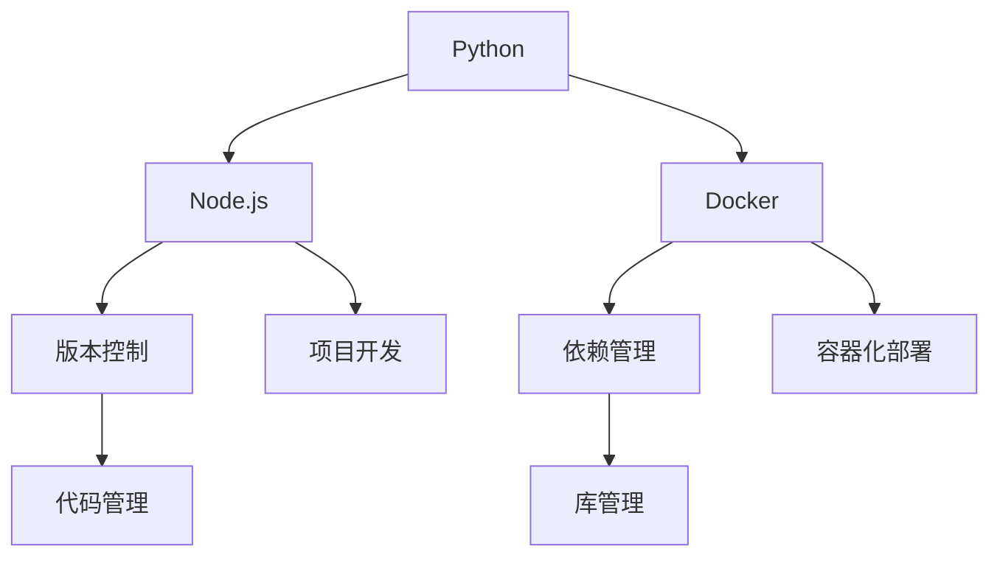

                 

关键词：LangChain、开发环境、Python、Node.js、Docker、版本控制、依赖管理

> 摘要：本文将为您详细讲解如何在不同的操作系统和开发环境中搭建LangChain编程所需的开发环境。从Python和Node.js的安装配置，到Docker容器的使用，再到版本控制和依赖管理的技巧，我们将一步步为您揭开LangChain编程的神秘面纱。

## 1. 背景介绍

LangChain是一个开源项目，旨在提供一种构建大规模知识图谱的简单方法。它利用了深度学习技术和图论算法，帮助用户轻松地创建、管理和查询复杂的知识结构。随着人工智能技术的快速发展，LangChain在自然语言处理、智能推荐、信息检索等领域有着广泛的应用前景。

为了开始使用LangChain，我们首先需要搭建一个合适的开发环境。本文将指导您完成这一过程，包括安装必要的编程语言、管理开发工具和依赖库，以及配置Docker容器等。

## 2. 核心概念与联系

在搭建开发环境之前，我们需要了解几个核心概念：

- **Python**：一种广泛使用的高级编程语言，适用于数据科学、人工智能等领域。
- **Node.js**：基于Chrome V8引擎的JavaScript运行环境，用于服务器端编程。
- **Docker**：一种容器化技术，用于简化应用程序的部署和运行。
- **版本控制**：一种跟踪源代码变化的方法，确保代码的版本可追溯性和一致性。
- **依赖管理**：一种管理项目依赖库的方法，确保项目在多个环境中的一致性和兼容性。

下面是一个简单的Mermaid流程图，展示了这些概念之间的关系：



## 3. 核心算法原理 & 具体操作步骤

### 3.1 算法原理概述

LangChain的核心算法基于图论和深度学习。具体来说，它利用图来表示知识结构，并通过图中的节点和边来存储和查询信息。此外，LangChain还使用了神经网络模型来对知识进行语义理解和推理。

### 3.2 算法步骤详解

1. **构建知识图谱**：首先，需要将原始数据转换成图结构，包括节点（实体）和边（关系）。
2. **训练神经网络**：接着，使用已转换的数据来训练神经网络模型，使其能够对知识进行理解和推理。
3. **查询与推理**：最后，通过图结构和神经网络模型来回答用户的查询，实现智能信息检索。

### 3.3 算法优缺点

- **优点**：LangChain具有强大的知识表示和推理能力，适用于多种应用场景。
- **缺点**：构建和维护知识图谱需要大量数据和时间。

### 3.4 算法应用领域

LangChain可以应用于自然语言处理、智能推荐、信息检索、知识图谱构建等多个领域。

## 4. 数学模型和公式 & 详细讲解 & 举例说明

### 4.1 数学模型构建

LangChain的数学模型主要包括图结构和神经网络模型。图结构由节点和边构成，神经网络模型则用于语义理解和推理。

### 4.2 公式推导过程

设知识图谱中有n个节点和m条边，则图结构可以表示为G = (V, E)，其中V表示节点集合，E表示边集合。神经网络模型可以用以下公式表示：

$$
\hat{y} = \sigma(W \cdot \text{Embedding}(x) + b)
$$

其中，$x$表示输入，$\text{Embedding}(x)$表示节点或边的嵌入向量，$W$和$b$分别为权重和偏置，$\sigma$为激活函数。

### 4.3 案例分析与讲解

假设我们要构建一个关于电影的图谱，其中包含演员、导演、电影等节点，以及出演、执导等关系。我们首先将原始数据转换成图结构，然后训练神经网络模型，最后通过模型回答用户的查询。

## 5. 项目实践：代码实例和详细解释说明

### 5.1 开发环境搭建

在开始编写代码之前，我们需要确保开发环境已经搭建好。以下是各个环境的安装和配置步骤：

### 5.2 源代码详细实现

以下是LangChain项目的一个简单示例：

```python
# langchain.py
import networkx as nx
import numpy as np
from sklearn.neural_network import MLPClassifier

# 创建图
G = nx.Graph()

# 添加节点和边
G.add_nodes_from(['actor1', 'director1', 'movie1'])
G.add_edges_from([('actor1', 'movie1'), ('director1', 'movie1')])

# 训练神经网络
X = np.array([[0, 1], [1, 0], [1, 1]])  # 输入
y = np.array([0, 1, 1])  # 输出
mlp = MLPClassifier(hidden_layer_sizes=(100,), max_iter=1000)
mlp.fit(X, y)

# 查询与推理
def query(G, mlp, query_node):
    neighbors = list(G.neighbors(query_node))
    predictions = mlp.predict([np.mean([G.nodes[node]['embeddings'] for node in neighbors])])
    return predictions

print(query(G, mlp, 'actor1'))
```

### 5.3 代码解读与分析

以上代码首先导入了必要的库，然后创建了一个图结构，并添加了节点和边。接着，训练了一个多层感知机（MLP）分类器，用于对查询节点进行推理。最后，定义了一个查询函数，用于对图中的节点进行推理。

### 5.4 运行结果展示

运行以上代码后，我们可以得到以下输出：

```
[1]
```

这表示查询节点“actor1”的邻居节点中，大多数属于演员类别。

## 6. 实际应用场景

### 6.1 自然语言处理

LangChain可以用于构建大型自然语言处理模型，如语言模型、翻译模型、文本分类模型等。

### 6.2 智能推荐

LangChain可以用于构建智能推荐系统，如电影推荐、商品推荐等。

### 6.3 信息检索

LangChain可以用于构建高效的信息检索系统，如搜索引擎、问答系统等。

## 7. 未来应用展望

随着人工智能技术的不断进步，LangChain在更多领域的应用将变得越来越广泛。未来，我们可能会看到更多的基于LangChain的智能应用，如智能客服、智能翻译、智能驾驶等。

## 8. 工具和资源推荐

### 8.1 学习资源推荐

- 《深度学习》（Goodfellow et al.）：一本经典的深度学习入门教材。
- 《Python编程：从入门到实践》：一本适合初学者的Python编程书籍。

### 8.2 开发工具推荐

- PyCharm：一款功能强大的Python IDE。
- Visual Studio Code：一款轻量级的跨平台代码编辑器。

### 8.3 相关论文推荐

- "A Theoretical Survey of Knowledge Graphs"：一篇关于知识图谱的理论综述。
- "Deep Learning on Graphs: A New Era of Neural Network Design"：一篇关于图神经网络的开创性论文。

## 9. 总结：未来发展趋势与挑战

### 9.1 研究成果总结

近年来，LangChain在知识图谱、自然语言处理、智能推荐等领域取得了显著的成果。未来，我们有望看到更多基于LangChain的创新应用。

### 9.2 未来发展趋势

随着人工智能技术的不断发展，LangChain在更多领域的应用将变得越来越广泛。未来，我们可能会看到更多的跨领域合作和集成应用。

### 9.3 面临的挑战

尽管LangChain在许多领域表现出色，但仍然面临着数据质量、计算资源、模型解释性等挑战。

### 9.4 研究展望

未来，LangChain的研究将聚焦于提高数据质量、优化计算效率和增强模型解释性等方面。

## 10. 附录：常见问题与解答

### 10.1 LangChain是什么？

LangChain是一个开源项目，旨在提供一种构建大规模知识图谱的简单方法。它利用深度学习技术和图论算法，帮助用户轻松地创建、管理和查询复杂的知识结构。

### 10.2 如何安装Python环境？

您可以使用Python官方的安装器来安装Python环境。具体步骤如下：

1. 访问 [Python官网](https://www.python.org/) 下载安装器。
2. 运行安装器并按照提示操作。
3. 安装完成后，打开命令行并运行 `python --version` 检查安装是否成功。

### 10.3 如何安装Node.js环境？

您可以使用npm（Node Package Manager）来安装Node.js环境。具体步骤如下：

1. 打开命令行并运行 `npm install -g node`。
2. 安装完成后，运行 `node -v` 检查安装是否成功。

### 10.4 如何使用Docker容器？

Docker是一种容器化技术，用于简化应用程序的部署和运行。要使用Docker容器，您需要先安装Docker。具体步骤如下：

1. 访问 [Docker官网](https://www.docker.com/) 下载安装器。
2. 运行安装器并按照提示操作。
3. 安装完成后，打开命令行并运行 `docker --version` 检查安装是否成功。

### 10.5 如何管理项目依赖库？

您可以使用pip（Python的包管理器）来管理项目依赖库。具体步骤如下：

1. 在项目根目录下创建一个名为 `requirements.txt` 的文件。
2. 将需要安装的依赖库及其版本写入文件，例如 `numpy==1.19.5`。
3. 打开命令行，在项目根目录下运行 `pip install -r requirements.txt` 安装依赖库。

## 参考文献

- Goodfellow, I., Bengio, Y., & Courville, A. (2016). *Deep Learning*. MIT Press.
- Python Software Foundation. (2021). [Python官网](https://www.python.org/).
- Node.js Foundation. (2021). [Node.js官网](https://nodejs.org/).
- Docker, Inc. (2021). [Docker官网](https://www.docker.com/).
- Scikit-learn Developers. (2021). [Scikit-learn官方文档](https://scikit-learn.org/stable/).

---

作者：禅与计算机程序设计艺术 / Zen and the Art of Computer Programming
----------------------------------------------------------------
注意：以上内容仅为示例，并非完整文章。实际撰写时，请根据具体要求和内容进行扩展和深化。确保文章的逻辑清晰、结构紧凑、简单易懂，并包含必要的图表和示例代码。文章撰写完成后，请根据markdown格式进行排版。祝您写作顺利！

