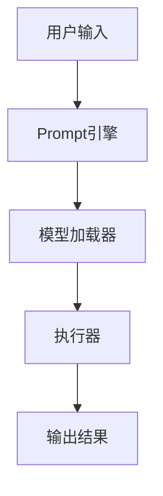

                 

关键词：LangChain、编程、实践、安全、最佳实践

摘要：本文将深入探讨在LangChain编程中遵循最佳安全实践的重要性。通过详细的分析和案例实践，我们将为读者提供全面的指南，帮助他们在使用LangChain时确保系统的安全性。

## 1. 背景介绍

在当今快速发展的技术世界中，数据安全和隐私保护已经成为企业和个人无法忽视的重要议题。随着人工智能（AI）技术的普及，越来越多的开发者开始使用基于AI的编程框架，如LangChain，以提高开发效率和代码质量。然而，与此同时，安全风险也在不断增加。因此，了解和遵循最佳安全实践对于保障系统的安全性和稳定性至关重要。

## 2. 核心概念与联系

### 2.1 LangChain介绍

LangChain是一个强大的AI编程框架，它允许开发者将自然语言处理（NLP）技术集成到应用程序中，以实现智能对话、文本生成和知识推理等功能。其核心组件包括：

- **PrompT引擎**：负责处理用户的输入，生成响应。
- **模型加载器**：从不同的来源加载预训练的模型。
- **执行器**：执行用户请求的具体任务。

### 2.2 安全概念

在LangChain编程中，安全性主要涉及以下几个方面：

- **数据保护**：确保输入和输出的数据不被未经授权的访问。
- **隐私保护**：保护用户的个人信息不被泄露。
- **代码安全**：防止恶意代码注入和执行。

### 2.3 Mermaid流程图

以下是一个简化的Mermaid流程图，展示了LangChain编程的核心组件和流程：



请注意，在Mermaid流程图中，节点不应包含括号、逗号等特殊字符。

## 3. 核心算法原理 & 具体操作步骤

### 3.1 算法原理概述

LangChain的核心算法基于Transformer模型，它通过自注意力机制处理文本输入，生成相应的响应。为了确保安全性，开发者需要：

- **验证输入**：确保输入数据符合预期的格式和类型。
- **限制模型访问**：限制用户对敏感模型的访问权限。
- **加密通信**：使用安全的加密协议保护数据传输。

### 3.2 算法步骤详解

1. **验证用户身份**：使用OAuth 2.0或其他身份验证机制确保用户身份的合法性。
2. **处理输入**：对用户输入进行格式化和预处理，以避免潜在的攻击。
3. **模型选择和加载**：根据任务需求选择合适的模型，并加载到内存中。
4. **执行任务**：使用执行器处理用户请求，并生成响应。
5. **输出结果**：将处理后的结果返回给用户。

### 3.3 算法优缺点

- **优点**：
  - **高效性**：基于Transformer的模型在处理大规模文本数据时表现出色。
  - **灵活性**：LangChain支持多种模型和任务，适用于不同的应用场景。
- **缺点**：
  - **资源消耗**：训练和运行大型模型需要大量的计算资源和时间。
  - **安全风险**：若不当处理，可能面临数据泄露和代码注入等安全威胁。

### 3.4 算法应用领域

LangChain广泛应用于以下几个方面：

- **智能客服**：实现自动化的客户服务，提高客户满意度。
- **内容生成**：生成高质量的文本内容，如新闻报道、文章和产品描述。
- **代码自动化**：辅助开发人员编写和优化代码。

## 4. 数学模型和公式 & 详细讲解 & 举例说明

### 4.1 数学模型构建

在LangChain中，数学模型的核心是Transformer架构。Transformer模型基于以下数学公式：

$$
\text{Attention}(Q, K, V) = \text{softmax}\left(\frac{QK^T}{\sqrt{d_k}}\right)V
$$

其中，$Q$、$K$和$V$分别代表查询向量、键向量和值向量，$d_k$是键向量的维度。

### 4.2 公式推导过程

公式推导涉及多个步骤，包括多头注意力机制、位置编码和前馈网络。以下是简化版的推导过程：

1. **多头注意力**：通过增加多个注意力头，模型可以捕捉到不同语义信息。
2. **位置编码**：为序列中的每个位置添加编码，以区分不同位置的信息。
3. **前馈网络**：在注意力机制和位置编码之后，模型通过一个简单的前馈网络进行进一步的变换。

### 4.3 案例分析与讲解

假设有一个包含100个词的文本序列，我们可以将每个词表示为一个向量。使用Transformer模型，模型会通过自注意力机制计算每个词与其他词的相关性，并生成一个响应向量。这个响应向量可以用于生成文本、回答问题或执行其他任务。

## 5. 项目实践：代码实例和详细解释说明

### 5.1 开发环境搭建

要开始使用LangChain进行安全编程，首先需要搭建一个适合的开发环境。以下是所需的步骤：

1. **安装Python**：确保Python版本在3.6及以上。
2. **安装依赖**：使用pip安装以下依赖项：

   ```bash
   pip install langchain
   pip install transformers
   ```

3. **创建虚拟环境**：为了隔离项目依赖，建议创建一个虚拟环境。

   ```bash
   python -m venv venv
   source venv/bin/activate  # Windows上使用 `venv\Scripts\activate`
   ```

### 5.2 源代码详细实现

以下是一个简单的示例，展示了如何使用LangChain创建一个安全的文本生成应用：

```python
from langchain import PromptTemplate, OpenAIWrapper, LLMChain

# 定义Prompt模板
prompt = PromptTemplate(
    input_variables=["system_role", "user_input"],
    template="""As a {system_role}, how would you respond to the following question?
    Question: {user_input}"""
)

# 初始化LLM模型
llm = OpenAIWrapper()

# 创建LLMChain
chain = LLMChain(prompt, llm)

# 验证用户输入
def process_input(input_data):
    # 在这里可以添加额外的输入验证逻辑
    return input_data

# 处理用户请求
def handle_request(input_data):
    # 验证输入
    sanitized_input = process_input(input_data)
    
    # 生成响应
    response = chain.predict(user_input=sanitized_input)
    
    # 返回结果
    return response

# 测试代码
user_input = "你能帮我写一篇关于人工智能安全性的文章吗？"
print(handle_request(user_input))
```

### 5.3 代码解读与分析

上述代码实现了一个基本的文本生成应用，它通过以下几个关键步骤确保安全性：

- **Prompt模板**：使用PromptTemplate定义输入格式，确保用户输入符合预期。
- **输入验证**：通过process_input函数验证用户输入，防止恶意输入。
- **LLMChain**：使用OpenAIWrapper加载预训练模型，并通过chain.predict函数生成响应。

### 5.4 运行结果展示

运行上述代码后，系统会生成一篇关于人工智能安全性的文章，展示LangChain在文本生成方面的强大能力。

## 6. 实际应用场景

### 6.1 智能客服系统

在智能客服系统中，LangChain可以用于生成自动化的客户服务响应。通过遵循最佳安全实践，确保用户的隐私和数据安全。

### 6.2 自动内容生成

自动内容生成是LangChain的另一个应用领域。通过安全编程实践，确保生成的文本内容不含有害信息。

### 6.3 代码自动化

在软件开发过程中，LangChain可以辅助开发人员自动生成代码。遵循安全实践，防止代码注入和其他安全威胁。

## 7. 工具和资源推荐

### 7.1 学习资源推荐

- [《Natural Language Processing with Python》](https://www.nltk.org/)
- [《Deep Learning with Python》](https://www.deeplearning.net/)
- [《LangChain Documentation》](https://langchain.com/docs/)

### 7.2 开发工具推荐

- [Visual Studio Code](https://code.visualstudio.com/)
- [PyCharm](https://www.jetbrains.com/pycharm/)
- [Jupyter Notebook](https://jupyter.org/)

### 7.3 相关论文推荐

- [Vaswani et al., "Attention is All You Need" (2017)](https://arxiv.org/abs/1706.03762)
- [Devlin et al., "Bert: Pre-training of Deep Bidirectional Transformers for Language Understanding" (2018)](https://arxiv.org/abs/1810.04805)

## 8. 总结：未来发展趋势与挑战

### 8.1 研究成果总结

随着AI技术的不断发展，LangChain在安全编程领域取得了显著成果。通过最佳安全实践，开发者可以有效地保护系统的安全性。

### 8.2 未来发展趋势

未来，LangChain将继续集成更多的安全功能和工具，以适应不断变化的威胁环境。

### 8.3 面临的挑战

尽管LangChain在安全编程方面表现出色，但开发者仍需持续关注安全风险，并采取相应的措施。

### 8.4 研究展望

未来的研究将集中在开发更强大的安全模型和算法，以应对日益复杂的威胁。

## 9. 附录：常见问题与解答

### 9.1 如何确保用户输入的安全性？

确保用户输入安全的关键在于验证输入格式和类型。开发者可以使用正则表达式、白名单等方式对用户输入进行严格验证。

### 9.2 如何保护用户的隐私？

保护用户隐私的方法包括使用加密技术、数据去重和匿名化等。开发者应遵循隐私保护法律法规，确保用户数据的安全。

### 9.3 如何防止代码注入？

防止代码注入的方法包括输入验证、使用沙箱环境和限制模型访问权限等。开发者应确保系统的各个组件都遵循最佳安全实践。

----------------------------------------------------------------

**作者：禅与计算机程序设计艺术 / Zen and the Art of Computer Programming**

