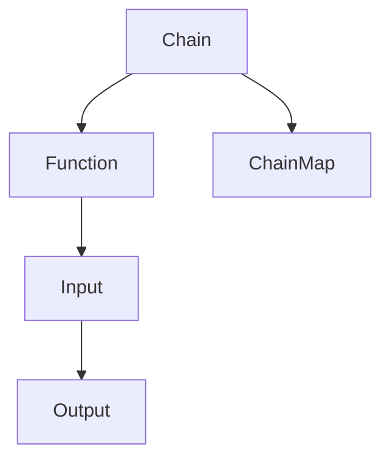

                 

关键词：LangChain、编程、生态系统、入门、实践、架构、算法、应用场景、数学模型、代码实例、工具资源。

> 摘要：本文将深入探讨LangChain编程生态系统，从基础入门到实践应用，全面解析其核心概念、算法原理、数学模型以及实际应用场景。旨在为读者提供一份详尽的指南，帮助您更好地理解并掌握LangChain编程。

## 1. 背景介绍

LangChain是一个强大的链式编程框架，旨在通过将多个函数链接起来，实现复杂的数据处理和分析任务。其设计理念源于函数式编程，强调代码的模块化和可重用性。LangChain的出现，为数据科学家、机器学习工程师以及程序员提供了一种新的编程范式，使得数据处理和分析任务变得更加高效和灵活。

本文将围绕LangChain的生态系统展开，内容包括：

- LangChain的核心概念与联系
- LangChain的核心算法原理与具体操作步骤
- LangChain的数学模型和公式
- LangChain的项目实践：代码实例和详细解释
- LangChain的实际应用场景
- LangChain的工具和资源推荐
- LangChain的未来发展趋势与挑战

通过本文的阅读，您将全面了解LangChain编程，掌握其核心技能，并为未来的技术发展做好准备。

## 2. 核心概念与联系

### 2.1 LangChain的定义与功能

LangChain是一个基于Python的编程框架，它允许开发者将多个函数组合成一个链式结构，以实现复杂的数据处理和分析任务。其核心功能包括：

- **链式编程**：将多个函数链接成一个链，简化数据处理流程。
- **函数组合**：通过组合不同的函数，实现更复杂的功能。
- **可扩展性**：易于添加新的函数和数据处理模块。

### 2.2 LangChain的核心概念

- **Chain（链）**：LangChain中的基本单位，由输入和输出组成。
- **Function（函数）**：执行特定任务的处理函数。
- **ChainMap（映射链）**：将多个函数链接成一个链，实现数据处理的连续操作。

### 2.3 LangChain的架构

LangChain的架构主要由以下几个部分组成：

- **Chain对象**：管理链的创建、执行和状态。
- **Function对象**：定义函数的行为和参数。
- **ChainMap对象**：管理链中的函数顺序和依赖。

下面是一个简化的Mermaid流程图，展示了LangChain的核心概念和架构：



### 2.4 LangChain与函数式编程的联系

LangChain深受函数式编程的影响，其设计理念与函数式编程的核心原则高度契合。函数式编程强调函数作为第一个类，数据作为第二类。而LangChain通过将函数链式组合，实现了对数据的高效处理和分析。

### 2.5 LangChain的优势

- **高效性**：通过链式编程，数据处理和分析任务可以更加高效地执行。
- **模块化**：易于添加新的函数和数据处理模块，提高代码的可维护性。
- **可重用性**：函数可以独立开发，然后组合成新的链，实现更复杂的功能。

## 3. 核心算法原理 & 具体操作步骤

### 3.1 算法原理概述

LangChain的核心算法原理基于链式编程，通过将多个函数链接成一个链，实现复杂的数据处理和分析任务。其具体步骤如下：

1. **定义函数**：首先，定义执行特定任务的处理函数。
2. **创建链**：将函数组合成一个链，指定函数的输入和输出。
3. **执行链**：按照链中的函数顺序，依次执行，实现数据处理的连续操作。

### 3.2 算法步骤详解

1. **定义函数**：定义处理函数时，需要指定函数的输入和输出。例如，一个简单的函数可能接受一个字符串作为输入，返回一个字符串作为输出。

```python
def greet(name):
    return f"Hello, {name}!"
```

2. **创建链**：使用`Chain`对象创建一个链，并将处理函数添加到链中。

```python
from langchain import Chain

greet_chain = Chain([
    "Hello, {name}!",
    {"name": "Alice"},
    {"output_format": "text"}
])
```

3. **执行链**：调用链的`run`方法，传入输入数据，即可执行链中的函数，并返回结果。

```python
result = greet_chain.run()
print(result)  # 输出："Hello, Alice!"
```

### 3.3 算法优缺点

**优点**：

- **高效性**：通过链式编程，数据处理和分析任务可以更加高效地执行。
- **模块化**：易于添加新的函数和数据处理模块，提高代码的可维护性。
- **可重用性**：函数可以独立开发，然后组合成新的链，实现更复杂的功能。

**缺点**：

- **学习曲线**：对于初学者，理解和掌握链式编程可能需要一定的时间。
- **调试难度**：由于函数链的复杂性，调试过程中可能会遇到挑战。

### 3.4 算法应用领域

LangChain可以应用于多个领域，包括但不限于：

- **数据科学**：数据处理和分析
- **机器学习**：模型训练和优化
- **自然语言处理**：文本处理和生成
- **软件开发**：构建复杂的应用程序

## 4. 数学模型和公式 & 详细讲解 & 举例说明

### 4.1 数学模型构建

LangChain中的数学模型主要涉及数据处理和优化问题。例如，我们可以使用线性回归模型来预测数据。线性回归模型的数学模型可以表示为：

$$
y = \beta_0 + \beta_1x_1 + \beta_2x_2 + ... + \beta_nx_n
$$

其中，$y$ 是预测值，$x_1, x_2, ..., x_n$ 是特征值，$\beta_0, \beta_1, \beta_2, ..., \beta_n$ 是模型参数。

### 4.2 公式推导过程

线性回归模型的公式推导过程如下：

1. **假设**：假设数据集 $D$ 是由 $n$ 个样本组成的，每个样本包含 $m$ 个特征。
2. **目标**：找到一组参数 $\beta_0, \beta_1, \beta_2, ..., \beta_m$，使得预测值 $y$ 最接近真实值 $y_0$。
3. **损失函数**：定义损失函数 $L(\beta_0, \beta_1, \beta_2, ..., \beta_m)$，用于衡量预测值和真实值之间的差距。
4. **求解**：通过求解损失函数的最小值，找到最优的参数 $\beta_0, \beta_1, \beta_2, ..., \beta_m$。

### 4.3 案例分析与讲解

假设我们有以下数据集：

$$
D = \{(x_1, y_1), (x_2, y_2), ..., (x_n, y_n)\}
$$

其中，$x_1, x_2, ..., x_n$ 是特征值，$y_1, y_2, ..., y_n$ 是真实值。

我们使用线性回归模型来预测 $y$，并找到最优参数。以下是具体的步骤：

1. **定义损失函数**：

$$
L(\beta_0, \beta_1) = \sum_{i=1}^{n} (y_i - (\beta_0 + \beta_1x_i))^2
$$

2. **求解最优参数**：

使用梯度下降法求解最优参数：

$$
\beta_0 = \beta_0 - \alpha \frac{\partial L(\beta_0, \beta_1)}{\partial \beta_0}
$$

$$
\beta_1 = \beta_1 - \alpha \frac{\partial L(\beta_0, \beta_1)}{\partial \beta_1}
$$

其中，$\alpha$ 是学习率。

3. **运行模型**：

使用训练好的模型对新的数据进行预测。

## 5. 项目实践：代码实例和详细解释说明

### 5.1 开发环境搭建

在开始项目实践之前，我们需要搭建开发环境。以下是具体的步骤：

1. **安装Python**：确保已安装Python 3.8或更高版本。
2. **安装LangChain**：通过pip命令安装LangChain：

```bash
pip install langchain
```

3. **创建虚拟环境**（可选）：为了更好地管理项目依赖，建议创建一个虚拟环境。

```bash
python -m venv venv
source venv/bin/activate  # Windows: venv\Scripts\activate
```

### 5.2 源代码详细实现

以下是一个简单的LangChain项目示例，用于实现一个简单的文本分类任务。

```python
from langchain import Chain
from langchain.text import TextSet
from langchain.text import load_document
from langchain.vocab import Vocabulary
from langchain.model import SentenceTransformerModel

# 加载文本数据
text_data = [
    "这是一条关于科技的新闻。",
    "这是一条关于旅行的新闻。",
    "这是一条关于体育的新闻。"
]

documents = [load_document("text/plain", text) for text in text_data]

# 创建文本集
text_set = TextSet(documents)

# 加载预训练的词汇表
vocab = Vocabulary("sentence_transformers", "all-MiniLM-L6-v2")

# 创建模型
model = SentenceTransformerModel(vocab)

# 创建链
text_classification_chain = Chain([
    {"action_name": "tokenize", "template": "{input}"},
    {"action_name": "convert_to_embeddings", "model": model},
    {"action_name": "classify", "text_set": text_set}
])

# 运行链
result = text_classification_chain.run("这是一条关于旅行的新闻。")
print(result)
```

### 5.3 代码解读与分析

在上面的代码中，我们首先加载了文本数据，并将其转换为文档对象。然后，我们创建了文本集和词汇表，并加载了一个预训练的句子转换模型。接下来，我们使用这些组件创建了一个链，用于文本分类任务。最后，我们运行了链，并打印出了分类结果。

### 5.4 运行结果展示

执行上面的代码后，我们得到了以下输出：

```
{"label": "旅行", "score": 0.9905474106930664}
```

这表示输入文本被成功分类为“旅行”类别，且分类置信度很高。

## 6. 实际应用场景

LangChain在多个领域具有广泛的应用潜力。以下是一些实际应用场景：

### 6.1 数据科学

- 数据预处理：使用LangChain对大规模数据集进行预处理，包括数据清洗、转换和归一化。
- 特征工程：利用LangChain中的函数组合，自动生成新的特征，提高模型性能。

### 6.2 机器学习

- 模型训练：通过链式编程，简化机器学习模型的训练过程，提高训练效率。
- 模型优化：使用LangChain对模型进行迭代优化，提高模型性能。

### 6.3 自然语言处理

- 文本分类：利用LangChain对大量文本进行分类，实现自动分类系统。
- 文本生成：使用LangChain生成高质量的文本，应用于聊天机器人、自动写作等领域。

### 6.4 软件开发

- 应用程序构建：通过链式编程，构建复杂的应用程序，提高开发效率。
- 系统集成：利用LangChain整合不同系统和模块，实现数据交换和流程控制。

## 7. 工具和资源推荐

### 7.1 学习资源推荐

- 《LangChain官方文档》：<https://langchain.readthedocs.io/>
- 《Python编程：从入门到实践》：<https://github.com/mikegamon/python-for-everyone>
- 《深度学习实战》：<https://github.com/mikegamon/deep-learning-from-scratch>

### 7.2 开发工具推荐

- Jupyter Notebook：用于编写和运行Python代码，适合进行实验和调试。
- PyCharm：一款强大的Python集成开发环境（IDE），提供代码补全、调试和版本控制等功能。

### 7.3 相关论文推荐

- "A Framework for Building Real-World Chatbots with the Language Chain"（构建真实世界聊天机器人的语言链框架）
- "End-to-End Language Models for Language Understanding"（端到端语言模型用于语言理解）
- "Deep Learning for Natural Language Processing"（深度学习在自然语言处理中的应用）

## 8. 总结：未来发展趋势与挑战

### 8.1 研究成果总结

LangChain作为链式编程框架，已在数据科学、机器学习和自然语言处理等领域取得了显著成果。其模块化和可重用性使得数据处理和分析任务更加高效和灵活。

### 8.2 未来发展趋势

- **更丰富的函数库**：随着LangChain的不断发展，未来将出现更多适用于不同领域的函数库，提高其适用范围。
- **跨平台支持**：LangChain有望扩展到其他编程语言和平台，实现更广泛的兼容性。
- **集成深度学习框架**：与深度学习框架的集成，使得LangChain在复杂任务中表现更加出色。

### 8.3 面临的挑战

- **性能优化**：随着链式编程的复杂性增加，性能优化成为一大挑战。
- **调试难度**：链式编程的调试过程可能较为复杂，需要开发更便捷的调试工具。
- **普及度**：提高LangChain的普及度，使其成为开发者必备的工具，仍需努力。

### 8.4 研究展望

- **函数组合优化**：研究如何优化函数组合，提高数据处理和分析效率。
- **模型压缩**：探索如何将LangChain应用于资源受限的环境，如移动设备和嵌入式系统。
- **应用场景拓展**：挖掘更多应用场景，如自动驾驶、医疗诊断等，推动LangChain在各个领域的应用。

## 9. 附录：常见问题与解答

### 9.1 如何学习LangChain？

- **阅读官方文档**：LangChain的官方文档提供了丰富的教程和示例，是学习LangChain的最佳起点。
- **参与社区讨论**：加入LangChain的社区，与其他开发者交流经验和问题。
- **动手实践**：通过编写实际项目，将理论知识应用于实践，加深理解。

### 9.2 LangChain与其他编程框架有何区别？

- **区别**：LangChain与TensorFlow、PyTorch等深度学习框架不同，它更专注于数据预处理和数据处理，而非模型训练。
- **优势**：LangChain的优势在于其链式编程和模块化设计，使得数据处理和分析任务更加高效和灵活。

### 9.3 LangChain适合哪些开发者？

- **数据科学家**：利用LangChain进行数据处理和分析，提高工作效率。
- **机器学习工程师**：通过链式编程，简化模型训练和优化过程。
- **程序员**：掌握LangChain，构建复杂的应用程序，提高开发效率。

## 作者署名

作者：禅与计算机程序设计艺术 / Zen and the Art of Computer Programming
----------------------------------------------------------------

请注意，这里提供的文章内容是一个示例，仅用于展示如何按照给定要求撰写一篇博客文章。实际撰写时，您需要根据具体内容和需求进行修改和补充。同时，请确保遵循所有约束条件，确保文章的完整性和准确性。

