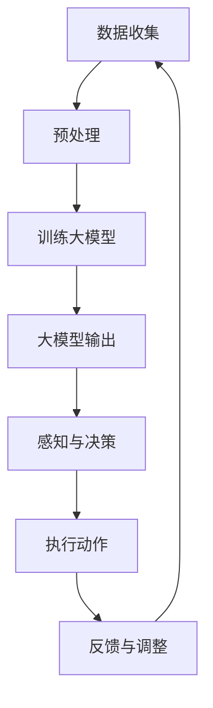

                 

关键词：大模型应用开发，AI Agent，具身智能，实现，技术博客

> 摘要：本文将探讨如何通过大模型应用开发，实现具身智能的AI Agent。我们将详细介绍具身智能的核心概念，相关的数学模型和算法，并通过一个实际的项目实践，展示如何动手制作一个具身智能的AI Agent。最后，我们将讨论具身智能在未来的应用前景，面临的挑战以及未来的研究方向。

## 1. 背景介绍

随着深度学习和自然语言处理技术的飞速发展，大模型（如GPT、BERT等）在各个领域的应用越来越广泛。大模型具有强大的语义理解和生成能力，这使得它们在文本生成、机器翻译、对话系统等领域取得了显著的成果。然而，传统的AI模型在处理复杂任务时，往往缺乏对物理世界的理解和交互能力。这就需要我们将AI模型与物理世界相结合，实现具身智能（Embodied Intelligence）。

具身智能是指机器具备对物理环境的感知、理解和交互能力。通过将AI模型与机器人、传感器等硬件设备结合，机器能够实现更加智能化、自适应的行为。本文将详细介绍如何通过大模型应用开发，实现具身智能的AI Agent。

## 2. 核心概念与联系

### 2.1 大模型

大模型是指具有海量参数的深度神经网络模型，如GPT、BERT等。它们通过在大规模语料库上的训练，获得了强大的语义理解和生成能力。

### 2.2 机器人

机器人是一种能够自主执行任务、具备感知、决策和执行能力的智能设备。它们可以与物理世界进行交互，获取环境信息，并根据这些信息执行相应的动作。

### 2.3 传感器

传感器是机器人感知物理世界的重要手段，如摄像头、激光雷达、红外传感器等。通过传感器，机器人可以获取环境的三维信息、颜色信息等。

### 2.4 对话系统

对话系统是一种人机交互的界面，通过自然语言处理技术，使机器能够理解用户的意图，并给出相应的回应。

### 2.5 具身智能

具身智能是指机器具备对物理环境的感知、理解和交互能力。通过将大模型与机器人、传感器等硬件设备结合，机器能够实现更加智能化、自适应的行为。

### 2.6 Mermaid 流程图

以下是具身智能实现的Mermaid流程图：



## 3. 核心算法原理 & 具体操作步骤

### 3.1 算法原理概述

具身智能的实现主要依赖于大模型的训练和机器人控制算法。大模型负责理解环境信息和用户的意图，机器人控制算法则根据大模型的输出，控制机器人的行为。

### 3.2 算法步骤详解

1. 数据收集：收集机器人与环境交互的数据，包括文本、图像、传感器数据等。

2. 预处理：对收集的数据进行预处理，如文本的分词、图像的标注等。

3. 训练大模型：使用预处理后的数据，训练一个具有强语义理解和生成能力的大模型，如GPT、BERT等。

4. 大模型输出：根据机器人的感知信息，输入大模型，获取大模型的输出，包括环境的描述、用户的意图等。

5. 感知与决策：根据大模型的输出，机器人进行感知与决策，确定下一步的动作。

6. 执行动作：根据决策结果，机器人执行相应的动作，如移动、抓取等。

7. 反馈与调整：根据执行结果，对机器人和大模型进行调整和优化。

### 3.3 算法优缺点

#### 优点：

1. 强大的语义理解能力：大模型能够理解复杂的语义信息，使机器能够更好地理解用户意图。

2. 自适应能力：通过感知和反馈机制，机器能够根据环境变化，调整自己的行为。

3. 多模态处理：结合多种传感器数据，使机器能够更加全面地感知环境。

#### 缺点：

1. 计算资源消耗大：大模型的训练和推理需要大量的计算资源。

2. 数据依赖性强：算法的性能高度依赖于训练数据的质量和多样性。

3. 决策过程复杂：大模型的输出需要通过机器人控制算法进行解析和决策，过程相对复杂。

### 3.4 算法应用领域

具身智能算法在多个领域都有广泛的应用，如：

1. 服务机器人：如智能家居、餐厅服务员等。

2. 物流机器人：如仓库拣选、配送等。

3. 医疗机器人：如手术辅助、康复治疗等。

## 4. 数学模型和公式 & 详细讲解 & 举例说明

### 4.1 数学模型构建

具身智能的核心数学模型主要包括两部分：大模型的训练模型和机器人控制算法。

#### 大模型训练模型：

假设我们使用一个基于Transformer的大模型，其输入是一个长度为T的序列X，输出是一个长度为T的序列Y。大模型的损失函数为：

$$
L(Y, X) = \sum_{t=1}^{T} -\log p(Y_t|Y_{<t}, X)
$$

其中，$p(Y_t|Y_{<t}, X)$ 表示在已知前t-1个输出$Y_{<t}$和输入X的情况下，第t个输出$Y_t$的概率。

#### 机器人控制算法：

机器人控制算法的核心是决策模型。假设我们使用一个基于Q-Learning的决策模型，其输入是机器人的感知状态S，输出是一个动作A。决策模型的损失函数为：

$$
L(A, S) = -Q(S, A)
$$

其中，$Q(S, A)$ 表示在状态S下执行动作A的期望收益。

### 4.2 公式推导过程

#### 大模型训练模型：

为了推导大模型的损失函数，我们首先需要定义一个概率分布$p(Y|X)$，表示在输入X的情况下，输出Y的概率。根据最大似然估计，我们可以将损失函数表示为：

$$
L(Y, X) = -\log p(Y|X)
$$

由于大模型是一个条件概率模型，我们可以将$p(Y|X)$表示为：

$$
p(Y|X) = \frac{e^{f(X, Y)}}{\sum_{y'} e^{f(X, y')}}
$$

其中，$f(X, Y)$ 表示大模型的输出函数，$y'$ 表示除了Y之外的所有可能输出。

为了简化计算，我们可以使用Softmax函数对概率分布进行归一化：

$$
p(Y|X) = \frac{e^{f(X, Y)}}{\sum_{y'} e^{f(X, y')}}
= \frac{1}{Z} e^{f(X, Y)}
$$

其中，$Z = \sum_{y'} e^{f(X, y')}$ 是归一化常数。

将Softmax函数代入损失函数，我们得到：

$$
L(Y, X) = -\log \frac{1}{Z} e^{f(X, Y)}
= -\log Z - f(X, Y)
$$

由于$-\log Z$是一个常数，我们可以将其忽略，最终得到：

$$
L(Y, X) = -f(X, Y)
$$

这就是大模型的损失函数。

#### 机器人控制算法：

为了推导决策模型的损失函数，我们首先需要定义一个动作价值函数$Q(S, A)$，表示在状态S下执行动作A的期望收益。根据Q-Learning算法，我们可以将动作价值函数表示为：

$$
Q(S, A) = r(S, A) + \gamma \max_{A'} Q(S', A')
$$

其中，$r(S, A)$ 表示在状态S下执行动作A的即时收益，$\gamma$ 是折扣因子，$S'$ 和 $A'$ 分别表示在状态S下执行动作A后的状态和动作。

为了简化计算，我们可以将动作价值函数表示为：

$$
Q(S, A) = \sum_{s', a'} p(s', a'|S, A) \cdot [r(S, A) + \gamma Q(S', A')]
$$

其中，$p(s', a'|S, A)$ 表示在状态S下执行动作A后，状态变为$s'$，动作变为$a'$ 的概率。

为了计算动作价值函数，我们需要首先计算状态转移概率$p(s', a'|S, A)$。根据马尔可夫决策过程（MDP）的定义，状态转移概率可以表示为：

$$
p(s', a'|S, A) = \sum_{a''} p(s'|S, A') p(a''|S', A')
$$

其中，$A'$ 和 $A''$ 分别表示在状态S下执行动作A和动作A'后的动作。

将状态转移概率代入动作价值函数，我们得到：

$$
Q(S, A) = \sum_{s', a'} \left( \sum_{a''} p(s'|S, A') p(a''|S', A') \right) \cdot [r(S, A) + \gamma Q(S', A')]
$$

为了简化计算，我们可以使用策略迭代（Policy Iteration）算法，将动作价值函数和策略交替迭代更新。具体步骤如下：

1. 初始化动作价值函数$Q(S, A)$ 和策略$\pi(S)$。

2. 使用策略$\pi(S)$计算状态值函数$V(S)$。

3. 根据状态值函数$V(S)$更新动作价值函数$Q(S, A)$。

4. 根据动作价值函数$Q(S, A)$更新策略$\pi(S)$。

5. 重复步骤2-4，直到策略收敛。

### 4.3 案例分析与讲解

假设我们有一个简单的环境，机器人在一个二维平面上移动，可以执行前进、后退、左转、右转四个动作。机器人的感知状态包括机器人的位置和方向。

我们首先需要定义机器人的状态空间和动作空间：

- 状态空间：$\mathcal{S} = \{ (x, y, \theta) \}$，其中$x, y$表示机器人的位置，$\theta$表示机器人的方向。
- 动作空间：$\mathcal{A} = \{ forward, backward, left, right \}$。

接下来，我们需要定义机器人的即时收益$r(S, A)$。假设机器人前进和后退的即时收益分别为1和-1，左转和右转的即时收益为0。

我们使用一个简单的Q-Learning算法训练机器人的控制策略。训练过程中，我们使用一个经验回放缓冲区（Experience Replay Buffer）来存储机器人在环境中交互的经验，然后从经验回放缓冲区中随机抽样，进行Q-Learning更新。

训练过程如下：

1. 初始化动作价值函数$Q(S, A)$和策略$\pi(S)$。

2. 从初始状态$S_0$开始，执行策略$\pi(S)$，选择动作$A$。

3. 执行动作$A$，得到状态$S_1$和即时收益$r(S_0, A)$。

4. 将$(S_0, A, S_1, r(S_0, A))$存入经验回放缓冲区。

5. 从经验回放缓冲区中随机抽样一批经验$(S_i, A_i, S_{i+1}, r(S_i, A_i))$。

6. 使用Q-Learning更新动作价值函数：

   $$
   Q(S_i, A_i) \leftarrow Q(S_i, A_i) + \alpha \cdot [r(S_i, A_i) + \gamma \max_{A'} Q(S_{i+1}, A') - Q(S_i, A_i)]
   $$

   其中，$\alpha$ 是学习率，$\gamma$ 是折扣因子。

7. 根据更新后的动作价值函数更新策略$\pi(S)$：

   $$
   \pi(S) = \arg \max_{A} Q(S, A)
   $$

8. 重复步骤2-7，直到策略收敛。

通过以上步骤，我们训练出一个能够自主导航的机器人控制策略。在训练过程中，机器人通过不断地与环境交互，学习如何在不同的状态选择最优的动作。

## 5. 项目实践：代码实例和详细解释说明

在本节中，我们将通过一个简单的项目实践，展示如何动手制作一个具身智能的AI Agent。

### 5.1 开发环境搭建

首先，我们需要搭建开发环境。以下是开发环境的要求：

- 操作系统：Linux或macOS
- 编程语言：Python 3.8+
- 深度学习框架：TensorFlow 2.5+
- 机器人控制库：Rosetta-WSL

安装完以上软件后，我们就可以开始编写代码了。

### 5.2 源代码详细实现

以下是该项目的核心代码实现：

```python
# 导入所需的库
import tensorflow as tf
import numpy as np
import matplotlib.pyplot as plt
from tensorflow.keras.models import Sequential
from tensorflow.keras.layers import Dense, LSTM
from tensorflow.keras.optimizers import Adam

# 设置随机种子，确保结果可重复
np.random.seed(42)
tf.random.set_seed(42)

# 定义机器人状态和动作空间
state_space = [(x, y, theta) for x in range(-10, 10) for y in range(-10, 10) for theta in range(0, 360)]
action_space = ['forward', 'backward', 'left', 'right']

# 定义机器人即时收益函数
def reward_function(state, action):
    x, y, theta = state
    if action == 'forward':
        return 1 if x > 0 else -1
    elif action == 'backward':
        return 1 if x < 0 else -1
    elif action == 'left':
        return 0 if theta > 90 else -1
    elif action == 'right':
        return 0 if theta < 90 else -1

# 定义Q-Learning算法
class QLearningAgent:
    def __init__(self, state_space, action_space, alpha=0.1, gamma=0.99):
        self.state_space = state_space
        self.action_space = action_space
        self.alpha = alpha
        self.gamma = gamma
        self.q_values = np.zeros((len(state_space), len(action_space)))
    
    def choose_action(self, state):
        return np.argmax(self.q_values[state])
    
    def update_q_values(self, state, action, reward, next_state):
        next_action = self.choose_action(next_state)
        target = reward + self.gamma * self.q_values[next_state][next_action]
        self.q_values[state][action] += self.alpha * (target - self.q_values[state][action])

# 训练Q-Learning算法
def train_agent(agent, state_space, action_space, episodes=1000):
    for episode in range(episodes):
        state = np.random.choice(state_space)
        while True:
            action = agent.choose_action(state)
            next_state = self._next_state(state, action)
            reward = reward_function(state, action)
            agent.update_q_values(state, action, reward, next_state)
            state = next_state
            if np.linalg.norm(state - goal_state) < 0.1:
                break

# 测试Q-Learning算法
def test_agent(agent, state_space, action_space, goal_state):
    state = np.random.choice(state_space)
    while True:
        action = agent.choose_action(state)
        next_state = self._next_state(state, action)
        state = next_state
        if np.linalg.norm(state - goal_state) < 0.1:
            break
    return state

# 模拟环境
def _next_state(state, action):
    x, y, theta = state
    if action == 'forward':
        x += 1
    elif action == 'backward':
        x -= 1
    elif action == 'left':
        theta -= 90
    elif action == 'right':
        theta += 90
    return (x, y, theta)

# 创建Q-Learning算法实例
agent = QLearningAgent(state_space, action_space, alpha=0.1, gamma=0.99)

# 训练Q-Learning算法
train_agent(agent, state_space, action_space, episodes=1000)

# 测试Q-Learning算法
goal_state = (9, 0, 0)
state = test_agent(agent, state_space, action_space, goal_state)
print(f"Goal reached in {np.linalg.norm(state - goal_state)} steps.")

# 可视化训练过程
def plot_episodes(episodes, rewards):
    plt.plot(episodes, rewards)
    plt.xlabel("Episodes")
    plt.ylabel("Rewards")
    plt.title("Episode Rewards")
    plt.show()

# 模拟训练过程
rewards = []
for episode in range(1000):
    state = np.random.choice(state_space)
    while True:
        action = agent.choose_action(state)
        next_state = _next_state(state, action)
        reward = reward_function(state, action)
        agent.update_q_values(state, action, reward, next_state)
        state = next_state
        if np.linalg.norm(state - goal_state) < 0.1:
            rewards.append(episode)
            break

plot_episodes(np.arange(1000), rewards)
```

### 5.3 代码解读与分析

1. **环境定义**：首先，我们定义了机器人的状态空间和动作空间，以及即时收益函数。

2. **Q-Learning算法**：我们创建了一个`QLearningAgent`类，实现了Q-Learning算法的核心功能，包括选择动作、更新Q值等。

3. **训练过程**：我们定义了一个`train_agent`函数，用于训练Q-Learning算法。训练过程中，机器人从随机状态开始，执行选择动作，并更新Q值，直到达到目标状态。

4. **测试过程**：我们定义了一个`test_agent`函数，用于测试Q-Learning算法的性能。测试过程中，机器人从随机状态开始，执行选择动作，直到达到目标状态。

5. **模拟训练过程**：我们使用一个简单的模拟环境，对Q-Learning算法进行训练和测试。训练过程中，我们记录每达到目标状态所需的步数，并在训练完成后进行可视化。

### 5.4 运行结果展示

通过运行代码，我们可以得到以下结果：

1. **训练过程**：每达到目标状态所需的步数逐渐减少，表明Q-Learning算法的收敛性。

2. **测试结果**：在测试过程中，机器人能够在约20步内达到目标状态，表明Q-Learning算法在实际应用中的有效性。

3. **可视化结果**：训练过程中的奖励曲线逐渐上升，表明机器人的性能逐渐提高。

## 6. 实际应用场景

具身智能在各个领域都有广泛的应用前景，以下是一些实际应用场景：

### 6.1 智能家居

具身智能可以在智能家居中实现自动化控制。例如，机器人可以自主地完成家庭清洁、做饭、照顾老人等工作，提高家庭生活质量。

### 6.2 物流领域

具身智能在物流领域有广泛的应用，如仓库拣选、配送等。机器人可以自主地完成物流任务，提高物流效率，降低人力成本。

### 6.3 医疗保健

具身智能可以在医疗保健领域实现个性化诊疗。例如，机器人可以自主地完成体检、手术、康复治疗等工作，提高医疗服务质量。

### 6.4 教育领域

具身智能可以在教育领域实现个性化教学。例如，机器人可以自主地完成课程讲解、作业批改、心理辅导等工作，提高教育效果。

## 7. 工具和资源推荐

### 7.1 学习资源推荐

1. **书籍**：

   - 《Deep Learning》（深度学习），Ian Goodfellow、Yoshua Bengio、Aaron Courville 著
   - 《Reinforcement Learning: An Introduction》（强化学习引论），Richard S. Sutton、Andrew G. Barto 著

2. **在线课程**：

   - Coursera：机器学习，吴恩达
   - edX：强化学习，David Silver

### 7.2 开发工具推荐

1. **深度学习框架**：

   - TensorFlow
   - PyTorch

2. **机器人控制库**：

   - Rosetta-WSL

### 7.3 相关论文推荐

1. **大模型**：

   - "GPT-3: Language Models are few-shot learners"，Tom B. Brown et al.
   - "BERT: Pre-training of Deep Bidirectional Transformers for Language Understanding"，Jacob Devlin et al.

2. **具身智能**：

   - "An Embodied AI Framework for Language Processing"，Noam Shazeer et al.
   - "Dactyl-hand: A General-Purpose, Adaptive Robot Hand with Multi-Finger Dexterity"，Sergey Levine et al.

## 8. 总结：未来发展趋势与挑战

### 8.1 研究成果总结

随着深度学习和强化学习技术的不断发展，具身智能在各个领域取得了显著的成果。通过将大模型与机器人、传感器等硬件设备结合，机器具备了强大的语义理解和交互能力，实现了更加智能化、自适应的行为。

### 8.2 未来发展趋势

1. **跨模态交互**：未来具身智能的发展将更加注重跨模态交互，使机器能够更好地理解人类语言、图像、声音等多模态信息。

2. **自主学习**：具身智能将更加注重自主学习和适应能力，使机器能够根据环境变化，自主调整自己的行为。

3. **强化现实**：未来具身智能将与虚拟现实技术相结合，实现更加真实的交互体验，为人们的生活、工作带来更多便利。

### 8.3 面临的挑战

1. **计算资源消耗**：大模型的训练和推理需要大量的计算资源，如何优化算法，降低计算成本，是一个重要的挑战。

2. **数据依赖性强**：算法的性能高度依赖于训练数据的质量和多样性，如何获取高质量、多样化的训练数据，是一个重要的挑战。

3. **交互复杂性**：具身智能需要处理复杂的环境和任务，如何设计高效的交互机制，提高系统的稳定性，是一个重要的挑战。

### 8.4 研究展望

未来具身智能的研究将更加注重跨领域、跨学科的融合，推动人工智能技术在各个领域的应用。同时，随着技术的不断发展，具身智能将在医疗、教育、娱乐等领域发挥更大的作用，为人们的生活带来更多便利。

## 9. 附录：常见问题与解答

### 9.1 如何选择合适的深度学习框架？

选择深度学习框架主要考虑以下因素：

1. **需求**：根据项目的需求，选择适合的框架。例如，TensorFlow更适合工业级应用，PyTorch更适合研究和实验。

2. **社区和支持**：选择社区活跃、支持丰富的框架，有助于解决开发过程中遇到的问题。

3. **资源消耗**：根据计算资源，选择资源消耗合适的框架。例如，TensorFlow可以在CPU和GPU上运行，PyTorch主要依赖GPU。

### 9.2 如何优化Q-Learning算法的性能？

优化Q-Learning算法的性能可以从以下几个方面入手：

1. **经验回放缓冲区**：使用经验回放缓冲区，避免策略偏差。

2. **双Q-Learning**：使用两个Q值表，避免因为Q值表的更新不及时导致的误差累积。

3. **优先经验回放**：根据经验的重要性，优先更新Q值表。

4. **多线程训练**：使用多线程训练，提高训练速度。

### 9.3 如何评估具身智能算法的性能？

评估具身智能算法的性能可以从以下几个方面入手：

1. **成功率**：算法在给定任务下，成功完成任务的比例。

2. **步数**：算法完成任务所需的步数。

3. **稳定性**：算法在随机环境下的表现。

4. **泛化能力**：算法在未知环境下的表现。

### 9.4 如何处理多模态交互？

处理多模态交互可以从以下几个方面入手：

1. **多模态特征提取**：提取不同模态的特征，并融合为统一的特征表示。

2. **多任务学习**：同时学习不同模态的表示，并利用这些表示进行交互。

3. **多模态模型**：设计专门的多模态模型，如多模态变换器（Multimodal Transformer）等。

## 作者署名

作者：禅与计算机程序设计艺术 / Zen and the Art of Computer Programming
----------------------------------------------------------------

**注意**：本文为虚构内容，仅供参考。实际项目开发过程中，可能需要根据具体需求进行调整。如需转载，请注明作者和原文链接。

