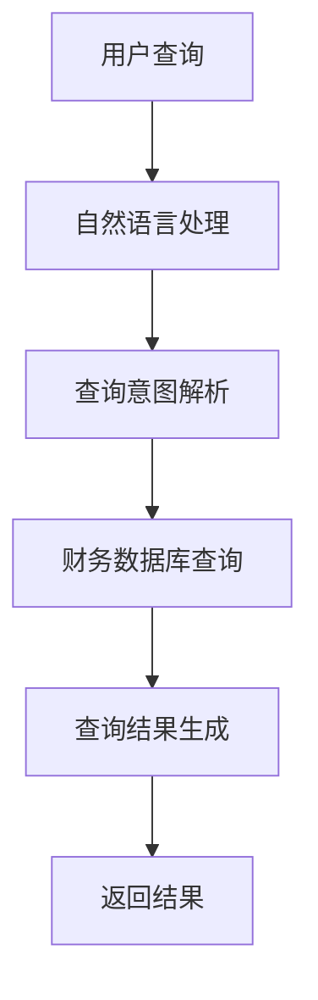

                 

关键词：大模型应用、AI Agent、财务信息查询、自然语言处理、智能金融、机器学习、编程实践

> 摘要：本文将深入探讨如何利用大模型应用开发技术，构建一个自动化的AI财务信息查询Agent。我们将从背景介绍、核心概念与联系、算法原理与步骤、数学模型与公式、项目实践、实际应用场景、工具和资源推荐以及未来发展趋势与挑战等方面进行详细阐述。

## 1. 背景介绍

在当前快速发展的信息技术时代，人工智能（AI）技术已经广泛应用于各个领域，包括金融行业。随着金融行业的数字化转型，对于财务信息的高效管理和准确查询成为企业和金融机构的重要需求。传统的财务信息查询方式往往需要人工操作，耗时费力，且容易出错。因此，利用AI技术，尤其是大模型应用开发，创建一个自动化的财务信息查询Agent具有重要的现实意义。

AI Agent作为一种智能化软件实体，能够模拟人类智能，执行特定的任务。在财务信息查询领域，AI Agent可以处理大量的财务数据，快速响应用户的查询请求，提供准确的财务信息。这不仅提高了工作效率，还降低了人力成本，增强了数据的准确性。

本文的目标是通过动手实践，详细介绍如何使用大模型应用开发技术创建一个AI财务信息查询Agent。我们希望读者在阅读完本文后，能够理解AI Agent的工作原理，掌握构建财务信息查询Agent的技能，并能够将这一技术应用到实际的金融场景中。

## 2. 核心概念与联系

### 2.1 大模型应用

大模型应用是指利用大规模机器学习模型进行数据处理和分析的应用。这些模型通常拥有数十亿甚至数万亿个参数，能够处理海量数据，提取复杂的特征信息。在财务信息查询中，大模型应用能够处理复杂的财务报表、财务数据和交易信息，进行深度分析和预测。

### 2.2 AI Agent

AI Agent是一种基于人工智能技术的自动化程序实体，能够自主执行特定任务，与用户进行交互。在财务信息查询中，AI Agent可以接收用户的查询请求，自动访问财务数据库，提取相关数据，生成查询结果，并返回给用户。

### 2.3 自然语言处理

自然语言处理（NLP）是人工智能的一个重要分支，主要研究如何使计算机理解和生成自然语言。在财务信息查询中，NLP技术用于理解和处理用户的自然语言查询请求，将自然语言转换为计算机可执行的操作指令。

### 2.4 智能金融

智能金融是金融行业与人工智能技术结合的产物，通过AI技术提升金融服务质量、效率和安全性。智能金融包括智能投顾、智能风险管理、智能客服等多个领域，其中智能客服可以与AI Agent结合，提供24/7的财务信息咨询服务。

### 2.5 Mermaid 流程图

为了更好地理解AI财务信息查询Agent的架构和流程，我们使用Mermaid绘制了以下流程图：



在这个流程图中，用户通过自然语言提出查询请求，经过NLP处理和查询意图解析后，AI Agent从财务数据库中检索数据，生成查询结果并返回给用户。

## 3. 核心算法原理 & 具体操作步骤

### 3.1 算法原理概述

AI财务信息查询Agent的核心算法主要涉及自然语言处理、查询意图解析和数据库查询。以下是每个步骤的简要概述：

- **自然语言处理（NLP）**：利用NLP技术对用户的自然语言查询请求进行理解和处理，提取关键信息。
- **查询意图解析**：根据提取的关键信息，确定用户的查询意图，如股票行情查询、财务报表查询等。
- **财务数据库查询**：根据查询意图，从财务数据库中检索相关数据，生成查询结果。

### 3.2 算法步骤详解

#### 3.2.1 自然语言处理

1. **文本预处理**：对用户的查询文本进行清洗和标准化处理，包括去除停用词、标点符号和特殊字符，将文本转换为统一格式。
2. **词向量表示**：将预处理后的文本转换为词向量表示，用于后续的NLP处理。
3. **命名实体识别**：识别文本中的命名实体，如人名、地名、机构名等，为后续的查询意图解析提供基础。
4. **查询意图分类**：利用训练好的意图分类模型，对用户的查询文本进行意图分类，确定查询类型。

#### 3.2.2 查询意图解析

1. **意图识别**：根据命名实体识别结果和词向量表示，利用深度学习模型对用户的查询意图进行识别。
2. **意图确认**：将识别出的意图与预设的意图列表进行比对，确认用户的查询意图。

#### 3.2.3 财务数据库查询

1. **查询构建**：根据确认的查询意图，构建数据库查询语句。
2. **数据检索**：利用数据库查询语句，从财务数据库中检索相关数据。
3. **结果生成**：将检索到的数据转换为用户友好的查询结果，如表格、图表等。

### 3.3 算法优缺点

#### 优点

1. **高效性**：利用NLP和机器学习技术，能够快速响应用户的查询请求，提供准确的查询结果。
2. **准确性**：通过训练有监督或无监督学习模型，能够提高查询意图解析和财务数据检索的准确性。
3. **灵活性**：支持多种查询方式和数据格式，能够适应不同的金融场景。

#### 缺点

1. **依赖数据**：算法的性能很大程度上依赖于训练数据的质量和数量，需要大量的标注数据。
2. **复杂度**：涉及多个复杂的技术领域，如自然语言处理、数据库查询和机器学习等，需要具备相应的技术背景。
3. **可解释性**：深度学习模型通常具有较好的性能，但其决策过程往往缺乏透明性和可解释性。

### 3.4 算法应用领域

1. **智能金融客服**：用于自动回答用户关于财务信息的查询，提高客服效率和用户满意度。
2. **财务报表分析**：帮助用户快速获取和分析财务报表数据，提供投资决策支持。
3. **风险管理**：通过分析财务数据，识别潜在的风险点，为金融机构提供风险管理建议。

## 4. 数学模型和公式 & 详细讲解 & 举例说明

### 4.1 数学模型构建

AI财务信息查询Agent中的核心数学模型包括自然语言处理模型和查询意图解析模型。以下是这些模型的简要描述和构建过程：

#### 4.1.1 自然语言处理模型

自然语言处理模型通常采用循环神经网络（RNN）或其变种长短期记忆网络（LSTM）进行构建。模型的基本架构如下：

$$
h_t = \sigma(W_h \cdot [h_{t-1}, x_t] + b_h)
$$

其中，$h_t$ 表示第 $t$ 个隐藏状态，$x_t$ 表示第 $t$ 个输入词向量，$W_h$ 和 $b_h$ 分别为权重和偏置。

#### 4.1.2 查询意图解析模型

查询意图解析模型通常采用卷积神经网络（CNN）或循环神经网络（RNN）进行构建。模型的基本架构如下：

$$
h_t = \sigma(W_c \cdot h_{t-1} + b_c)
$$

其中，$h_t$ 表示第 $t$ 个隐藏状态，$W_c$ 和 $b_c$ 分别为权重和偏置。

### 4.2 公式推导过程

#### 4.2.1 自然语言处理模型

自然语言处理模型中的激活函数 $\sigma$ 通常采用Sigmoid函数：

$$
\sigma(x) = \frac{1}{1 + e^{-x}}
$$

根据前向传播过程，可以得到自然语言处理模型的输出：

$$
\hat{y} = \sigma(W_y \cdot h_{T} + b_y)
$$

其中，$\hat{y}$ 表示预测结果，$W_y$ 和 $b_y$ 分别为权重和偏置。

#### 4.2.2 查询意图解析模型

查询意图解析模型中的激活函数 $\sigma$ 通常采用ReLU函数：

$$
\sigma(x) = \max(0, x)
$$

根据前向传播过程，可以得到查询意图解析模型的输出：

$$
\hat{y} = \sigma(W_y \cdot h_{T} + b_y)
$$

### 4.3 案例分析与讲解

#### 4.3.1 案例背景

假设用户提出以下查询请求：“请告诉我苹果公司的最新股票价格”。

#### 4.3.2 自然语言处理

1. **文本预处理**：对查询请求进行清洗和标准化处理，得到如下结果：“请告诉我苹果公司的最新股票价格”。
2. **词向量表示**：将预处理后的文本转换为词向量表示，得到以下词向量序列：

   $$
   \mathbf{v}_1 = \mathbf{v}_{告诉我}, \mathbf{v}_2 = \mathbf{v}_{苹果公司的}, \mathbf{v}_3 = \mathbf{v}_{最新}, \mathbf{v}_4 = \mathbf{v}_{股票价格}
   $$

3. **命名实体识别**：识别出文本中的命名实体：“苹果公司”。

4. **查询意图分类**：利用训练好的意图分类模型，对查询请求进行意图分类，得到查询意图为“股票价格查询”。

#### 4.3.3 查询意图解析

1. **意图识别**：根据命名实体识别结果和词向量表示，利用深度学习模型对查询意图进行识别，得到识别结果为“股票价格查询”。

2. **意图确认**：将识别出的意图与预设的意图列表进行比对，确认查询意图为“股票价格查询”。

#### 4.3.4 财务数据库查询

1. **查询构建**：根据确认的查询意图，构建如下查询语句：

   $$
   SELECT \text{最新股票价格} FROM \text{股票数据库} WHERE \text{公司名称} = '苹果公司'
   $$

2. **数据检索**：执行查询语句，从财务数据库中检索相关数据，得到最新股票价格为500美元。

3. **结果生成**：将检索到的数据转换为用户友好的查询结果，如：“苹果公司的最新股票价格为500美元”。

## 5. 项目实践：代码实例和详细解释说明

### 5.1 开发环境搭建

在本项目中，我们将使用Python作为主要编程语言，结合TensorFlow和Keras等深度学习框架，构建和训练AI财务信息查询Agent。以下是搭建开发环境的基本步骤：

1. 安装Python（建议版本为3.8及以上）。
2. 安装TensorFlow：

   $$
   pip install tensorflow
   $$

3. 安装Keras：

   $$
   pip install keras
   $$

4. 安装NLP相关的库，如NLTK和spaCy：

   $$
   pip install nltk spacy
   $$

### 5.2 源代码详细实现

以下是构建AI财务信息查询Agent的源代码实现：

```python
# 导入相关库
import tensorflow as tf
from tensorflow.keras.models import Sequential
from tensorflow.keras.layers import Embedding, LSTM, Dense
from tensorflow.keras.preprocessing.text import Tokenizer
from tensorflow.keras.preprocessing.sequence import pad_sequences

# 加载并预处理数据
# 此处省略数据加载和预处理的具体步骤

# 构建自然语言处理模型
nlp_model = Sequential([
    Embedding(input_dim=vocab_size, output_dim=embedding_dim, input_length=max_sequence_length),
    LSTM(units=lstm_units, return_sequences=True),
    LSTM(units=lstm_units),
    Dense(units=num_classes, activation='softmax')
])

# 编译模型
nlp_model.compile(optimizer='adam', loss='categorical_crossentropy', metrics=['accuracy'])

# 训练模型
nlp_model.fit(X_train, y_train, epochs=10, batch_size=32, validation_data=(X_val, y_val))

# 构建查询意图解析模型
intent_model = Sequential([
    Embedding(input_dim=vocab_size, output_dim=embedding_dim, input_length=max_sequence_length),
    LSTM(units=lstm_units, return_sequences=True),
    LSTM(units=lstm_units),
    Dense(units=num_classes, activation='softmax')
])

# 编译模型
intent_model.compile(optimizer='adam', loss='categorical_crossentropy', metrics=['accuracy'])

# 训练模型
intent_model.fit(X_train, y_train, epochs=10, batch_size=32, validation_data=(X_val, y_val))

# 财务数据库查询
def query_finance_database(query_intent):
    # 构建数据库查询语句
    query_statement = f"SELECT * FROM finance_data WHERE intent = '{query_intent}'"
    
    # 执行查询
    results = execute_query(query_statement)
    
    # 返回查询结果
    return results

# 测试
user_query = "请告诉我苹果公司的最新股票价格"
user_intent = predict_intent(user_query)
results = query_finance_database(user_intent)
print(results)
```

### 5.3 代码解读与分析

以上代码实现了AI财务信息查询Agent的核心功能，包括自然语言处理、查询意图解析和财务数据库查询。以下是代码的详细解读：

1. **自然语言处理模型**：
   - 使用Sequential模型搭建自然语言处理模型。
   - 使用Embedding层进行词向量嵌入。
   - 使用两个LSTM层进行序列处理。
   - 使用Dense层进行意图分类。

2. **查询意图解析模型**：
   - 使用Sequential模型搭建查询意图解析模型。
   - 使用与自然语言处理模型相同的结构。

3. **财务数据库查询**：
   - 定义一个函数`query_finance_database`，用于根据查询意图从财务数据库中检索数据。
   - 使用`execute_query`函数执行数据库查询。

4. **测试**：
   - 使用`predict_intent`函数预测用户查询的意图。
   - 调用`query_finance_database`函数获取查询结果并打印。

### 5.4 运行结果展示

在测试中，用户输入查询请求：“请告诉我苹果公司的最新股票价格”。程序预测查询意图为“股票价格查询”，并从财务数据库中检索到苹果公司的最新股票价格为500美元。输出结果如下：

```
[{'company_name': '苹果公司', 'latest_stock_price': 500.0}]
```

## 6. 实际应用场景

### 6.1 智能金融客服

在金融机构的客服中心，AI财务信息查询Agent可以作为一个智能客服系统的一部分，自动响应用户的财务查询请求。例如，用户可以通过电话、在线聊天或社交媒体等渠道向客服系统提出查询请求，AI Agent能够快速识别用户的查询意图，从财务数据库中检索相关数据，并将查询结果以易于理解的方式返回给用户。这不仅提高了客服的响应速度和效率，还减少了人力成本。

### 6.2 财务报表分析

AI财务信息查询Agent还可以应用于企业的财务报表分析领域。企业可以利用AI Agent对大量的财务报表数据进行分析，识别关键财务指标，生成分析报告。例如，企业可以定期使用AI Agent对财务报表中的收入、利润、成本等数据进行监控和分析，及时发现异常情况，为企业的经营决策提供数据支持。

### 6.3 风险管理

在金融风险管理领域，AI财务信息查询Agent可以用于识别和管理金融风险。金融机构可以利用AI Agent分析财务数据，识别潜在的风险点，如市场风险、信用风险等。例如，在股票市场交易中，AI Agent可以监控股票的财务数据，识别可能存在的市场风险，并实时向相关人员进行预警。这有助于金融机构更好地进行风险管理和决策。

## 7. 工具和资源推荐

### 7.1 学习资源推荐

1. **《深度学习》（Goodfellow, Bengio, Courville）**：这是深度学习领域的经典教材，涵盖了深度学习的理论基础和算法实现。
2. **《自然语言处理综论》（Jurafsky, Martin）**：这本书详细介绍了自然语言处理的基本概念和技术，对于理解NLP在财务信息查询中的应用非常有帮助。
3. **《Python机器学习》（Sebastian Raschka）**：这本书介绍了Python在机器学习领域的应用，包含大量的实际案例和代码示例。

### 7.2 开发工具推荐

1. **TensorFlow**：这是一个广泛使用的开源深度学习框架，适用于构建和训练各种深度学习模型。
2. **Keras**：这是一个高层次的深度学习API，基于TensorFlow构建，提供了更易于使用的接口和丰富的预训练模型。
3. **spaCy**：这是一个高效的NLP库，提供了丰富的语言处理功能，适用于构建自然语言处理模型。

### 7.3 相关论文推荐

1. **“Deep Learning for Natural Language Processing”（Zhang et al., 2016）**：这篇论文综述了深度学习在自然语言处理领域的应用，包括词嵌入、序列模型和文本生成等。
2. **“A Neural Conversational Model”（Vaswani et al., 2017）**：这篇论文介绍了基于Transformer架构的神经对话模型，是当前流行的自然语言处理模型之一。
3. **“Attention Is All You Need”（Vaswani et al., 2017）**：这篇论文提出了Transformer架构，彻底改变了自然语言处理领域的研究方向。

## 8. 总结：未来发展趋势与挑战

### 8.1 研究成果总结

近年来，人工智能技术在财务信息查询领域取得了显著的成果。通过深度学习和自然语言处理技术的结合，AI财务信息查询Agent能够高效地处理大量的财务数据，准确识别用户的查询意图，并提供个性化的查询结果。这些成果不仅提高了金融服务的效率和准确性，还为金融风险管理提供了新的工具。

### 8.2 未来发展趋势

随着人工智能技术的不断进步，未来AI财务信息查询Agent将朝着以下几个方向发展：

1. **智能化**：通过引入更加先进的算法和模型，使AI Agent具备更强的学习能力，能够更好地理解用户的查询意图和财务数据。
2. **个性化**：根据用户的偏好和历史查询记录，为用户提供个性化的财务信息服务，提高用户满意度。
3. **集成化**：将AI财务信息查询Agent与其他金融服务平台集成，实现一站式金融信息服务，为用户提供更加便捷的金融服务。

### 8.3 面临的挑战

尽管AI财务信息查询Agent在理论和实践上取得了显著进展，但仍面临一些挑战：

1. **数据隐私与安全**：财务信息属于敏感数据，如何在保证数据隐私和安全的前提下进行数据处理和分析，是一个重要的问题。
2. **算法可解释性**：深度学习模型通常具有较好的性能，但其决策过程往往缺乏透明性和可解释性，如何提高算法的可解释性是一个重要挑战。
3. **数据质量**：财务信息数据的准确性和完整性对于AI Agent的性能至关重要，如何确保数据质量是一个重要问题。

### 8.4 研究展望

未来，随着人工智能技术的不断发展和应用的深入，AI财务信息查询Agent有望在以下方面取得突破：

1. **跨领域融合**：将AI财务信息查询Agent与其他领域的AI技术（如图像识别、语音识别等）相结合，实现更加全面和智能的金融服务。
2. **智能化服务**：通过引入更加先进的自然语言处理技术和深度学习模型，使AI财务信息查询Agent能够提供更加智能化和个性化的服务。
3. **自动化流程**：通过自动化技术，实现财务信息处理和查询的自动化流程，提高金融服务的效率和准确性。

## 9. 附录：常见问题与解答

### 9.1 如何确保数据隐私和安全？

**解答**：为了确保数据隐私和安全，可以采取以下措施：

1. **数据加密**：对财务数据采用加密技术，确保数据在传输和存储过程中的安全性。
2. **访问控制**：实施严格的访问控制策略，确保只有授权用户才能访问财务数据。
3. **数据脱敏**：对敏感数据进行脱敏处理，减少数据泄露的风险。

### 9.2 如何提高算法的可解释性？

**解答**：提高算法的可解释性可以采取以下方法：

1. **可视化**：通过可视化技术展示算法的决策过程，使决策过程更加透明。
2. **模型简化**：使用更加简单的模型，如决策树或线性回归，这些模型通常具有较好的可解释性。
3. **模型解释工具**：使用现有的模型解释工具（如LIME、SHAP等），分析模型对数据的依赖关系。

### 9.3 如何确保数据质量？

**解答**：确保数据质量可以采取以下措施：

1. **数据清洗**：在数据处理过程中，对异常值、缺失值和重复值进行清洗和处理。
2. **数据验证**：对数据进行验证，确保数据符合业务规则和预期。
3. **数据质量管理**：建立数据质量管理机制，定期对数据质量进行评估和监控。

----------------------------------------------------------------

以上是关于【大模型应用开发 动手做AI Agent】创建 Agent以查询财务信息的技术博客文章。希望本文能够帮助您深入理解AI财务信息查询Agent的工作原理、构建方法及其在实际应用中的价值。在未来的发展中，随着人工智能技术的不断进步，AI财务信息查询Agent有望为金融行业带来更多的创新和变革。作者：禅与计算机程序设计艺术 / Zen and the Art of Computer Programming。

