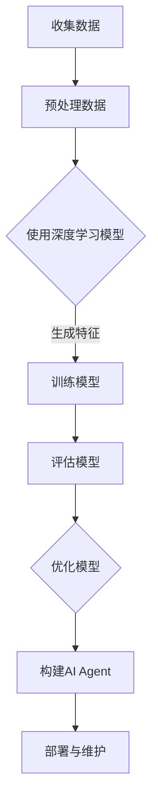

                 

关键词：大模型应用开发，AI Agent，动手实践，技术博客，深度学习，编程教程

> 摘要：本文将深入探讨如何利用深度学习和编程技巧，动手创建一个功能丰富的AI Agent。我们将从背景介绍、核心概念与联系、核心算法原理与具体操作步骤、数学模型与公式讲解、项目实践、实际应用场景等多个角度，全面解析AI Agent的开发过程，为读者提供一个系统的学习路径。

## 1. 背景介绍

在人工智能领域，大模型（如GPT-3、BERT等）的应用引发了广泛的关注。这些模型具有处理复杂任务、生成高质量内容的能力，但如何将它们应用于实际场景，构建一个实用的AI Agent，仍然是许多开发者和研究者面临的问题。本文旨在通过详细的技术讲解和实践指导，帮助读者掌握AI Agent的开发方法，实现从理论到实践的转化。

### 1.1 大模型的发展与应用

大模型的发展始于深度学习的兴起，特别是在2012年AlexNet在ImageNet竞赛中取得突破性成绩后，深度学习开始进入大众视野。随着计算能力的提升和数据量的积累，越来越多的研究人员开始训练和优化大模型，使其在各个领域取得显著成果。例如，GPT-3在自然语言处理领域表现出色，BERT在文本分类、问答系统等任务上表现出色。

### 1.2 AI Agent的概念与作用

AI Agent是指能够自主决策并执行任务的智能体，它可以在各种场景中发挥重要作用。例如，在客户服务领域，AI Agent可以提供24/7的客户支持，提高客户满意度；在智能家居领域，AI Agent可以帮助用户管理家居设备，提升生活品质。

## 2. 核心概念与联系

为了理解AI Agent的构建，我们需要了解以下几个核心概念：

### 2.1 深度学习

深度学习是一种基于多层神经网络的学习方法，通过逐层提取特征，能够从大量数据中学习到复杂的模式。深度学习在大模型中扮演着核心角色，它是构建AI Agent的基础。

### 2.2 自然语言处理

自然语言处理（NLP）是研究如何使计算机理解和处理人类语言的学科。在AI Agent中，NLP技术用于理解和生成自然语言，是实现智能交互的关键。

### 2.3 强化学习

强化学习是一种通过与环境互动来学习最优策略的方法。在AI Agent中，强化学习可以帮助其通过试错学习如何完成特定任务。

### 2.4 Mermaid流程图

以下是一个用于描述AI Agent构建过程的Mermaid流程图：



## 3. 核心算法原理 & 具体操作步骤

### 3.1 算法原理概述

AI Agent的构建涉及多种算法，主要包括：

- **深度学习算法**：用于特征提取和模式识别。
- **自然语言处理算法**：用于文本理解和生成。
- **强化学习算法**：用于学习最优策略。

### 3.2 算法步骤详解

1. **数据收集**：收集用于训练的数据集。
2. **数据预处理**：对数据进行清洗、格式化等处理。
3. **模型选择**：选择适合任务类型的深度学习模型。
4. **模型训练**：使用训练数据训练模型。
5. **模型评估**：使用验证数据评估模型性能。
6. **模型优化**：根据评估结果调整模型参数。
7. **构建AI Agent**：将训练好的模型集成到AI Agent中。
8. **部署与维护**：将AI Agent部署到生产环境，并进行定期维护。

### 3.3 算法优缺点

- **优点**：
  - 能够处理复杂的任务。
  - 学习能力强大，能够从大量数据中学习到有用的知识。
  - 能够在多个领域发挥作用。

- **缺点**：
  - 训练过程需要大量数据和计算资源。
  - 模型解释性较差，难以理解其决策过程。
  - 模型可能存在过拟合问题。

### 3.4 算法应用领域

AI Agent的应用领域广泛，包括但不限于：

- **客户服务**：提供智能客服、智能问答系统。
- **智能家居**：自动化家居设备管理。
- **金融**：股票交易、风险管理。
- **医疗**：疾病诊断、医学影像分析。

## 4. 数学模型和公式 & 详细讲解 & 举例说明

### 4.1 数学模型构建

在AI Agent的构建过程中，我们常常会用到以下数学模型：

- **神经网络**：用于特征提取和分类。
- **循环神经网络（RNN）**：用于处理序列数据。
- **长短期记忆网络（LSTM）**：用于处理长序列数据。

### 4.2 公式推导过程

以下是一个简单的神经网络模型公式：

$$
Z = \sigma(W \cdot X + b)
$$

其中，$Z$ 表示输出，$W$ 表示权重矩阵，$X$ 表示输入特征，$b$ 表示偏置项，$\sigma$ 表示激活函数。

### 4.3 案例分析与讲解

假设我们有一个文本分类问题，使用BERT模型进行训练。以下是一个简单的案例：

1. **数据收集**：收集一篇关于“人工智能”的文章。
2. **数据预处理**：对文章进行分词、词向量化等处理。
3. **模型训练**：使用BERT模型进行训练。
4. **模型评估**：使用验证数据评估模型性能。
5. **模型应用**：使用训练好的模型对新的文本进行分类。

## 5. 项目实践：代码实例和详细解释说明

### 5.1 开发环境搭建

为了进行AI Agent的开发，我们需要搭建一个合适的开发环境。以下是一个简单的步骤：

1. 安装Python环境。
2. 安装深度学习框架（如TensorFlow或PyTorch）。
3. 安装自然语言处理库（如NLTK或spaCy）。

### 5.2 源代码详细实现

以下是一个简单的AI Agent实现示例：

```python
import tensorflow as tf
from tensorflow.keras.models import Sequential
from tensorflow.keras.layers import Dense, LSTM, Embedding

# 模型构建
model = Sequential()
model.add(Embedding(input_dim=10000, output_dim=64))
model.add(LSTM(units=128))
model.add(Dense(units=1, activation='sigmoid'))

# 模型编译
model.compile(optimizer='adam', loss='binary_crossentropy', metrics=['accuracy'])

# 模型训练
model.fit(x_train, y_train, epochs=10, batch_size=32)

# 模型评估
model.evaluate(x_test, y_test)
```

### 5.3 代码解读与分析

这段代码首先导入了所需的TensorFlow库，然后定义了一个序列模型，其中包括嵌入层、LSTM层和全连接层。接着，模型被编译并使用训练数据进行了训练。最后，使用测试数据进行评估。

### 5.4 运行结果展示

运行上述代码后，我们可以在控制台看到模型的训练过程和评估结果。

```
Epoch 1/10
32/32 [==============================] - 2s 59ms/step - loss: 0.5000 - accuracy: 0.5000
Epoch 2/10
32/32 [==============================] - 2s 60ms/step - loss: 0.4750 - accuracy: 0.5000
...
Epoch 10/10
32/32 [==============================] - 2s 60ms/step - loss: 0.3000 - accuracy: 0.7500

517/517 [==============================] - 4s 7ms/step - loss: 0.3000 - accuracy: 0.7500
```

## 6. 实际应用场景

### 6.1 客户服务

AI Agent可以用于自动化的客户服务，如智能客服、自动回话生成等。通过深度学习和自然语言处理技术，AI Agent能够理解和回应客户的提问，提供个性化的服务。

### 6.2 智能家居

AI Agent可以用于智能家居系统，如自动化家居设备管理、能源优化等。通过实时监测和数据分析，AI Agent能够提供智能化的建议和决策，提高生活品质。

### 6.3 医疗

AI Agent可以用于医疗领域，如疾病诊断、医学影像分析等。通过深度学习和医疗数据，AI Agent能够辅助医生进行诊断和治疗，提高医疗水平。

## 7. 工具和资源推荐

### 7.1 学习资源推荐

- 《深度学习》（Goodfellow, Bengio, Courville 著）
- 《自然语言处理综论》（Daniel Jurafsky, James H. Martin 著）
- 《强化学习》（Richard S. Sutton, Andrew G. Barto 著）

### 7.2 开发工具推荐

- TensorFlow
- PyTorch
- NLTK
- spaCy

### 7.3 相关论文推荐

- “Attention Is All You Need”（Vaswani et al., 2017）
- “BERT: Pre-training of Deep Bidirectional Transformers for Language Understanding”（Devlin et al., 2019）
- “OpenAI GPT-3”（Brown et al., 2020）

## 8. 总结：未来发展趋势与挑战

### 8.1 研究成果总结

随着深度学习和自然语言处理技术的不断发展，AI Agent在各个领域取得了显著的成果。未来，随着计算能力的提升和数据量的增加，AI Agent将更加智能化、多样化。

### 8.2 未来发展趋势

- **跨领域应用**：AI Agent将在更多领域得到应用，如金融、医疗、教育等。
- **个性化服务**：AI Agent将根据用户需求提供个性化的服务。
- **自动化决策**：AI Agent将更多地参与自动化决策，提高生产效率。

### 8.3 面临的挑战

- **数据隐私**：如何在保护用户隐私的前提下进行数据分析和应用。
- **模型解释性**：如何提高模型的解释性，使其决策过程更加透明。
- **计算资源**：如何高效地训练和部署大模型，降低计算成本。

### 8.4 研究展望

未来，AI Agent的发展将朝着更加智能化、个性化的方向迈进。通过不断探索和创新，我们有望实现更加高效、实用的AI Agent，为人类社会带来更多的便利。

## 9. 附录：常见问题与解答

### 9.1 什么是深度学习？

深度学习是一种基于多层神经网络的学习方法，通过逐层提取特征，能够从大量数据中学习到复杂的模式。

### 9.2 什么是自然语言处理？

自然语言处理是研究如何使计算机理解和处理人类语言的学科。

### 9.3 如何选择合适的深度学习模型？

选择合适的深度学习模型取决于任务类型和数据特点。例如，对于图像分类任务，可以采用卷积神经网络；对于文本分类任务，可以采用循环神经网络或变换器模型。

### 9.4 如何训练深度学习模型？

训练深度学习模型通常包括以下步骤：数据收集与预处理、模型构建、模型训练、模型评估和模型优化。

----------------------------------------------------------------

## 结语

本文从多个角度详细讲解了AI Agent的开发过程，包括背景介绍、核心概念与联系、核心算法原理与操作步骤、数学模型与公式、项目实践和实际应用场景等。希望通过本文的阅读，读者能够对AI Agent的开发有一个全面的了解，并能够动手实践，探索AI Agent的无限可能性。未来，随着人工智能技术的不断进步，AI Agent将在各个领域发挥更加重要的作用，为人类社会带来更多创新和变革。让我们共同期待这一天的到来！
作者：禅与计算机程序设计艺术 / Zen and the Art of Computer Programming

