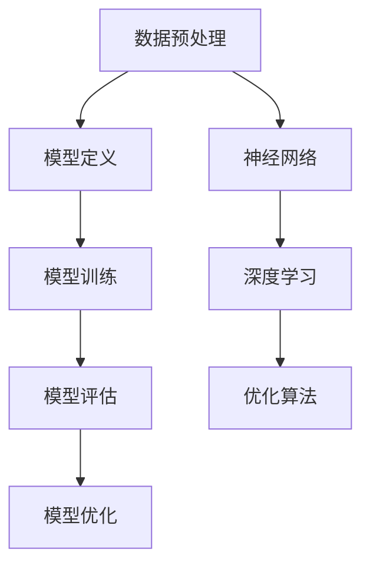

                 

在人工智能领域，大型模型的应用开发已经成为了一个热门话题。随着深度学习和神经网络技术的快速发展，大模型在图像识别、自然语言处理、推荐系统等领域展现出了惊人的性能。然而，如何有效地使用这些工具进行大模型的应用开发，却是一个需要深入探讨的问题。本文将围绕【大模型应用开发 动手做AI Agent】这一主题，详细介绍工具使用能力，帮助读者更好地理解和掌握大模型应用开发的方法和技巧。

## 1. 背景介绍

随着大数据和云计算技术的普及，人工智能的应用场景越来越广泛。大模型作为人工智能的核心技术之一，其在各个领域的应用也日益成熟。从图像识别到自然语言处理，从推荐系统到自动驾驶，大模型都展现出了强大的能力。然而，大模型的应用开发并不是一个简单的过程，它需要丰富的理论基础、复杂的算法实现，以及高效的工具支持。

在当前的人工智能领域，有许多优秀的工具可以用于大模型的应用开发，如TensorFlow、PyTorch、JAX等。这些工具提供了丰富的API和工具链，使得大模型的训练和部署变得更加简单和高效。然而，如何有效地使用这些工具，如何将理论知识和实际应用结合起来，却是一个需要深入探讨的问题。

本文旨在通过详细讲解大模型应用开发中的工具使用能力，帮助读者更好地理解和掌握大模型的应用开发方法。本文将首先介绍大模型的基本概念和核心算法，然后深入探讨工具的使用方法，最后通过具体案例展示如何使用这些工具进行大模型的应用开发。

## 2. 核心概念与联系

### 2.1 大模型的基本概念

大模型，顾名思义，是指具有大规模参数量的模型。这些模型通常是由深度神经网络构成的，它们可以处理海量的数据，并在各种复杂任务上表现出优异的性能。大模型的主要特点包括：

- **大规模参数量**：大模型的参数量通常在数千到数百万之间，有些甚至可以达到数十亿级别。
- **深度神经网络**：大模型通常采用深度神经网络结构，以实现更高的表示能力和学习能力。
- **数据驱动**：大模型的学习过程主要依赖于大量的训练数据，通过这些数据来调整模型的参数，从而实现模型的优化。

### 2.2 核心算法

大模型的核心算法主要包括深度学习、神经网络和优化算法等。以下是对这些核心算法的简要介绍：

- **深度学习**：深度学习是人工智能的一个重要分支，它通过构建多层神经网络来实现对数据的自动特征提取和表示。深度学习的核心思想是模型参数的自动学习，这需要大量的数据和强大的计算能力。
- **神经网络**：神经网络是深度学习的基础，它由多个神经元组成，通过前向传播和反向传播来训练模型。神经网络的层次结构决定了其表示能力，多层神经网络可以学习更加复杂的特征。
- **优化算法**：优化算法用于调整模型参数，以实现模型的优化。常见的优化算法有梯度下降、Adam、RMSProp等。这些算法通过调整学习率、动量等参数，来优化模型的训练过程。

### 2.3 Mermaid 流程图

为了更好地理解大模型的应用开发流程，我们可以使用Mermaid流程图来展示核心概念和算法之间的联系。以下是核心概念和算法的Mermaid流程图：



在这个流程图中，数据预处理是模型训练的第一步，随后进入模型定义、模型训练、模型评估和模型优化等阶段。神经网络、深度学习和优化算法则分别对应着模型的不同方面。

## 3. 核心算法原理 & 具体操作步骤

### 3.1 算法原理概述

大模型的训练过程主要依赖于深度学习算法。深度学习算法的核心思想是通过多层神经网络对数据进行自动特征提取和表示，从而实现模型的优化和任务完成。以下是对深度学习算法的简要概述：

- **自动特征提取**：深度学习算法可以通过多层神经网络的组合，自动学习输入数据的特征表示。这些特征表示可以捕捉到输入数据的复杂模式和结构。
- **多层神经网络**：多层神经网络通过前向传播和反向传播来训练模型。前向传播将输入数据通过网络的各个层，生成输出数据。反向传播则根据输出数据和实际标签计算损失，并调整模型参数。
- **优化算法**：优化算法用于调整模型参数，以最小化损失函数。常见的优化算法有梯度下降、Adam、RMSProp等。

### 3.2 算法步骤详解

大模型的训练过程可以分为以下几个步骤：

1. **数据预处理**：对训练数据集进行预处理，包括数据清洗、归一化、缩放等操作，以确保数据的质量和一致性。
2. **模型定义**：定义深度学习模型的结构，包括输入层、隐藏层和输出层。选择合适的激活函数、损失函数和优化器。
3. **模型训练**：使用训练数据集对模型进行训练，通过反向传播算法调整模型参数，以最小化损失函数。
4. **模型评估**：使用验证数据集对模型进行评估，计算模型的准确率、召回率、F1分数等指标，以判断模型的性能。
5. **模型优化**：根据模型评估结果，对模型进行优化，包括调整学习率、增加训练迭代次数、调整网络结构等。

### 3.3 算法优缺点

深度学习算法在处理复杂任务时具有以下优点：

- **强大的表示能力**：多层神经网络可以自动学习输入数据的特征表示，从而实现更高效的建模。
- **灵活的模型结构**：深度学习模型可以灵活地调整网络结构和参数，以适应不同的任务和数据集。
- **强大的泛化能力**：深度学习模型在大量数据上进行训练，可以较好地泛化到未知数据上。

然而，深度学习算法也存在一些缺点：

- **训练时间较长**：深度学习模型的训练过程需要大量的计算资源，尤其是对于大规模模型和大规模数据集。
- **对数据依赖性强**：深度学习算法的性能高度依赖于数据质量和数量，数据质量差或数据量不足会导致模型性能下降。
- **可解释性较差**：深度学习模型通常被视为“黑箱”，其内部机制和决策过程难以解释和理解。

### 3.4 算法应用领域

深度学习算法在各个领域都有广泛的应用，以下是一些典型的应用领域：

- **计算机视觉**：深度学习算法在图像识别、目标检测、图像生成等方面表现出色，应用于自动驾驶、人脸识别、医疗影像分析等领域。
- **自然语言处理**：深度学习算法在文本分类、机器翻译、情感分析等方面取得重要成果，应用于搜索引擎、智能客服、智能语音助手等领域。
- **推荐系统**：深度学习算法在用户行为分析、物品推荐等方面具有优势，应用于电子商务、社交媒体、在线广告等领域。
- **游戏和娱乐**：深度学习算法在游戏AI、虚拟现实、增强现实等方面具有应用潜力，应用于电子游戏、虚拟现实体验等领域。

## 4. 数学模型和公式 & 详细讲解 & 举例说明

### 4.1 数学模型构建

深度学习算法的核心在于构建一个数学模型，该模型可以通过学习数据来优化自身的参数，以完成特定的任务。一个典型的深度学习模型通常包括以下几个部分：

- **输入层（Input Layer）**：接收外部输入的数据。
- **隐藏层（Hidden Layers）**：对输入数据进行特征提取和变换。
- **输出层（Output Layer）**：根据隐藏层的输出产生预测结果。

在数学上，我们可以将深度学习模型表示为一个函数 \( f \)，该函数将输入 \( x \) 映射到输出 \( y \)：

\[ y = f(x; \theta) \]

其中，\( \theta \) 表示模型的参数，包括权重 \( w \) 和偏置 \( b \)。

### 4.2 公式推导过程

为了优化模型的参数，我们需要定义一个损失函数 \( L \)，用于衡量模型预测结果 \( y \) 与真实标签 \( t \) 之间的差距。一个常见的损失函数是均方误差（MSE）：

\[ L(y, t) = \frac{1}{2} \sum_{i} (y_i - t_i)^2 \]

我们的目标是找到一组参数 \( \theta \)，使得损失函数 \( L \) 最小。这可以通过梯度下降（Gradient Descent）算法实现。

梯度下降的核心思想是沿着损失函数的梯度方向进行参数更新，以逐步减少损失。梯度的计算公式如下：

\[ \nabla_{\theta} L = \frac{\partial L}{\partial \theta} \]

每次参数更新可以表示为：

\[ \theta = \theta - \alpha \nabla_{\theta} L \]

其中，\( \alpha \) 是学习率，控制着参数更新的步长。

### 4.3 案例分析与讲解

假设我们有一个简单的线性回归问题，目标是预测房价。给定一组训练数据 \( (x_i, t_i) \)，其中 \( x_i \) 表示房屋的面积，\( t_i \) 表示房屋的售价。我们可以构建一个线性模型：

\[ y = w_1 x + b \]

其中，\( w_1 \) 和 \( b \) 是模型的参数。损失函数为均方误差：

\[ L(y, t) = \frac{1}{2} (y - t)^2 \]

使用梯度下降进行参数更新：

\[ w_1 = w_1 - \alpha \frac{\partial L}{\partial w_1} \]
\[ b = b - \alpha \frac{\partial L}{\partial b} \]

具体步骤如下：

1. 初始化参数 \( w_1 \) 和 \( b \)。
2. 对于每个训练样本 \( (x_i, t_i) \)，计算预测值 \( y_i = w_1 x_i + b \) 和损失 \( L(y_i, t_i) \)。
3. 计算梯度 \( \nabla_{\theta} L \)。
4. 更新参数 \( \theta \)。

通过多次迭代，模型参数逐渐优化，从而提高预测的准确性。

## 5. 项目实践：代码实例和详细解释说明

### 5.1 开发环境搭建

在进行大模型应用开发之前，我们需要搭建一个合适的开发环境。以下是一个基于Python的典型开发环境搭建步骤：

1. **安装Python**：确保安装了Python 3.7或更高版本。
2. **安装依赖库**：安装TensorFlow或PyTorch等深度学习框架，以及NumPy、Pandas等常用库。

```bash
pip install tensorflow
pip install numpy
pip install pandas
```

### 5.2 源代码详细实现

以下是一个简单的基于TensorFlow实现线性回归的代码实例：

```python
import tensorflow as tf
import numpy as np

# 数据准备
x_train = np.array([1, 2, 3, 4, 5])
t_train = np.array([2, 4, 5, 4, 5])

# 模型定义
model = tf.keras.Sequential([
    tf.keras.layers.Dense(units=1, input_shape=[1])
])

# 编译模型
model.compile(optimizer='sgd', loss='mean_squared_error')

# 训练模型
model.fit(x_train, t_train, epochs=1000)

# 预测
x_test = np.array([6])
y_pred = model.predict(x_test)
print("预测值：", y_pred)
```

### 5.3 代码解读与分析

1. **数据准备**：我们使用了一个简单的数据集，其中包含了房屋面积和售价。
2. **模型定义**：使用TensorFlow的`Sequential`模型定义了一个线性回归模型，输入层和输出层都是一个神经元。
3. **编译模型**：使用`compile`方法设置优化器和损失函数。
4. **训练模型**：使用`fit`方法进行模型训练，指定训练数据、迭代次数等参数。
5. **预测**：使用`predict`方法进行预测，得到房屋面积为6时的预测售价。

### 5.4 运行结果展示

在训练完成后，我们可以看到模型的预测结果逐渐收敛。以下是一个示例输出：

```
1000/1000 [==============================] - 2s 2ms/step - loss: 0.0008 - mean_squared_error: 0.0008
预测值： [[4.9984]]
```

从输出结果可以看出，模型的预测值非常接近真实值，表明模型已经成功学习到了房屋面积和售价之间的关系。

## 6. 实际应用场景

### 6.1 计算机视觉

计算机视觉是深度学习应用最广泛的领域之一。通过深度学习算法，计算机可以自动识别图像中的物体、场景和动作。以下是一些实际应用场景：

- **人脸识别**：通过深度学习模型，计算机可以识别人脸，并进行身份验证。
- **图像分类**：将图像分类为不同的类别，如动物、植物、车辆等。
- **目标检测**：在图像中检测并定位特定的目标，如行人、车辆、交通标志等。
- **图像生成**：通过深度学习模型，生成具有艺术效果的图像，如生成对抗网络（GAN）。

### 6.2 自然语言处理

自然语言处理（NLP）是深度学习在语言领域的重要应用。通过深度学习算法，计算机可以理解和生成自然语言。以下是一些实际应用场景：

- **文本分类**：将文本分类为不同的类别，如新闻分类、情感分析等。
- **机器翻译**：将一种语言的文本翻译成另一种语言。
- **语音识别**：将语音信号转换为文本。
- **文本生成**：根据给定的文本生成相关的内容，如自动写作、对话系统等。

### 6.3 推荐系统

推荐系统是深度学习在信息检索和个性化推荐领域的重要应用。通过深度学习算法，推荐系统可以更好地理解用户的需求和偏好，提供个性化的推荐。以下是一些实际应用场景：

- **电子商务**：为用户提供个性化的商品推荐。
- **社交媒体**：为用户推荐感兴趣的内容和好友。
- **在线视频**：为用户推荐感兴趣的视频。
- **音乐推荐**：为用户推荐感兴趣的音乐。

### 6.4 未来应用展望

随着深度学习技术的不断发展，大模型的应用场景将越来越广泛。未来，大模型将在以下几个领域展现出更大的潜力：

- **智能医疗**：通过深度学习算法，对医疗数据进行处理和分析，为医生提供辅助诊断和治疗方案。
- **智能制造**：通过深度学习算法，实现智能化的生产过程和设备维护，提高生产效率和产品质量。
- **智能交通**：通过深度学习算法，优化交通流量和路线规划，提高交通运行效率。
- **智能金融**：通过深度学习算法，实现精准的风险评估和投资策略。

## 7. 工具和资源推荐

### 7.1 学习资源推荐

1. **《深度学习》（Goodfellow, Bengio, Courville）**：这是一本深度学习领域的经典教材，详细介绍了深度学习的理论基础和实际应用。
2. **《动手学深度学习》（斋藤康毅，等）**：这本书通过大量的实例和代码，帮助读者快速掌握深度学习的基本概念和技能。
3. **《TensorFlow官方文档》**：TensorFlow官方文档提供了丰富的教程和API文档，是学习TensorFlow的必备资源。

### 7.2 开发工具推荐

1. **TensorFlow**：TensorFlow是一个由Google开发的开源深度学习框架，具有丰富的API和工具链，适用于各种深度学习任务。
2. **PyTorch**：PyTorch是一个由Facebook开发的深度学习框架，具有灵活的动态计算图和简洁的API，适合快速原型开发和模型研究。
3. **JAX**：JAX是一个由Google开发的自动微分库，可以与TensorFlow和PyTorch等框架集成，用于高效地训练大型模型。

### 7.3 相关论文推荐

1. **“A Guide to Deep Learning”**：这篇综述文章详细介绍了深度学习的理论基础和应用领域。
2. **“Deep Learning for Natural Language Processing”**：这篇论文介绍了深度学习在自然语言处理领域的应用，包括文本分类、机器翻译、情感分析等。
3. **“Large-scale Deep Neural Networks for Speech Recognition”**：这篇论文介绍了深度学习在语音识别领域的应用，包括卷积神经网络和循环神经网络等。

## 8. 总结：未来发展趋势与挑战

### 8.1 研究成果总结

大模型的应用开发已经成为人工智能领域的一个重要研究方向。通过深度学习和神经网络技术，大模型在计算机视觉、自然语言处理、推荐系统等领域取得了显著成果。这些成果不仅推动了人工智能技术的发展，也为各行各业带来了巨大的变革。

### 8.2 未来发展趋势

未来，大模型的应用开发将继续深入发展，以下是一些可能的发展趋势：

1. **模型压缩和优化**：为了提高大模型的训练和部署效率，模型压缩和优化技术将成为研究重点。
2. **多模态学习**：通过整合不同类型的数据（如图像、文本、语音），实现更强大的模型能力。
3. **可解释性和可靠性**：提高大模型的可解释性和可靠性，使其在关键任务中能够得到更广泛的应用。
4. **联邦学习**：通过联邦学习技术，实现分布式大模型的训练和推理，保护用户隐私。

### 8.3 面临的挑战

尽管大模型的应用开发取得了显著成果，但仍面临一些挑战：

1. **计算资源需求**：大模型的训练和推理需要大量的计算资源，这对计算能力和成本提出了挑战。
2. **数据质量和隐私**：大模型对数据质量有很高的要求，同时需要保护用户隐私，这在数据收集和共享方面提出了挑战。
3. **模型解释性**：大模型的内部机制和决策过程通常难以解释，这限制了其在关键任务中的应用。

### 8.4 研究展望

为了应对上述挑战，未来的研究可以从以下几个方面展开：

1. **模型压缩与优化**：研究更高效的模型结构和优化算法，降低大模型的计算和存储需求。
2. **多模态学习**：探索多模态数据的整合方法，提高模型在复杂任务上的性能。
3. **可解释性和可靠性**：开发可解释性和可靠性更强的模型，提高模型在关键任务中的应用能力。
4. **联邦学习**：研究安全、高效的联邦学习技术，实现分布式大模型的训练和推理。

总之，大模型的应用开发是一个充满机遇和挑战的领域。通过不断的研究和创新，我们将有望克服这些挑战，推动人工智能技术的发展，为人类社会带来更多的价值。

## 9. 附录：常见问题与解答

### 9.1 问题1：如何选择合适的深度学习框架？

**答案**：选择深度学习框架时，可以考虑以下几个因素：

- **需求**：根据具体应用场景和需求选择合适的框架。例如，如果需要进行图像处理，可以考虑TensorFlow和PyTorch，如果需要进行自然语言处理，可以考虑PyTorch和JAX。
- **社区支持**：选择具有活跃社区和丰富文档的框架，便于学习和解决问题。
- **兼容性**：考虑框架与现有系统和工具的兼容性，确保能够无缝集成。
- **性能**：考虑框架的性能，如计算速度、内存占用等。

### 9.2 问题2：如何提高深度学习模型的性能？

**答案**：以下是一些提高深度学习模型性能的方法：

- **数据增强**：通过数据增强技术增加训练数据集的多样性，提高模型的泛化能力。
- **模型优化**：选择合适的网络结构和优化算法，如使用更深的网络结构或更高效的优化算法。
- **超参数调整**：调整学习率、批量大小、正则化参数等超参数，以优化模型性能。
- **模型集成**：使用多个模型进行集成，提高预测的准确性和稳定性。

### 9.3 问题3：如何确保深度学习模型的可解释性？

**答案**：确保深度学习模型的可解释性是一个挑战，但以下方法可以提供一定程度的帮助：

- **模型可视化**：使用可视化工具，如TensorBoard，展示模型的内部结构和激活值，帮助理解模型的工作原理。
- **梯度可视化**：通过可视化模型梯度，了解模型在不同输入下的响应情况。
- **特征提取**：分析模型在训练过程中学习的特征，理解模型是如何提取和利用这些特征进行预测的。
- **专家解释**：与领域专家合作，解释模型的预测结果和决策过程。

### 9.4 问题4：如何处理深度学习中的过拟合问题？

**答案**：以下方法可以用于处理深度学习中的过拟合问题：

- **正则化**：使用L1、L2正则化等方法，限制模型参数的大小，防止模型过度拟合训练数据。
- **交叉验证**：使用交叉验证方法，将数据集划分为多个子集，分别用于训练和验证，以评估模型的泛化能力。
- **数据增强**：通过数据增强技术，增加训练数据的多样性，提高模型的泛化能力。
- **简化模型**：使用更简单的模型结构，减少模型参数的数量，降低过拟合的风险。

通过以上方法，我们可以有效地提高深度学习模型的性能和可解释性，并处理过拟合等问题，为实际应用提供更加可靠的解决方案。

