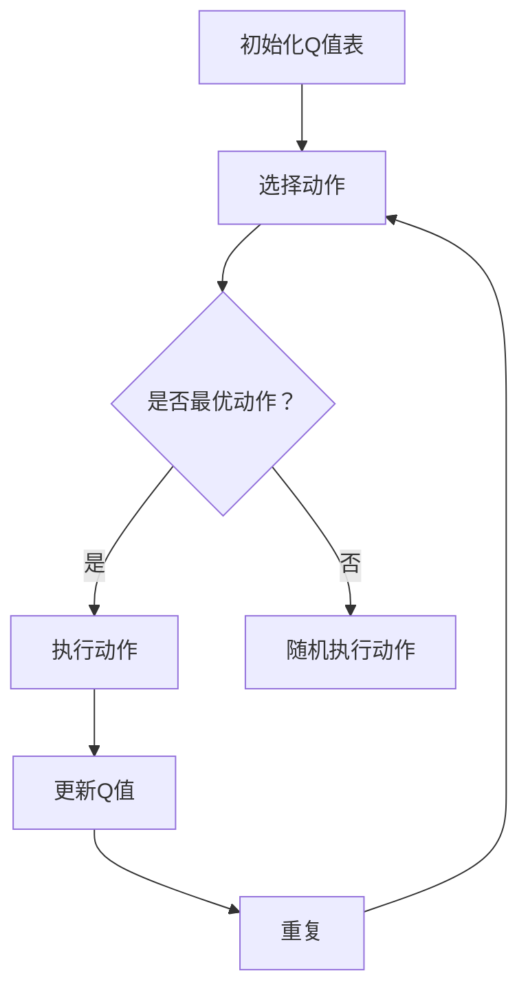

                 

关键词：Q-learning，缺陷检测，人工智能，深度学习，算法应用

> 摘要：本文深入探讨了Q-learning算法在缺陷检测领域的应用。通过对Q-learning的基本概念、原理、数学模型和具体操作步骤的详细解析，结合实际项目实践，展示了该算法在复杂工业环境中的实用性和高效性。文章旨在为读者提供一个全面、系统的理解，助力其在相关领域的研究和应用。

## 1. 背景介绍

随着人工智能技术的飞速发展，机器学习在各个行业得到了广泛应用。其中，缺陷检测作为工业质量控制的重要环节，也逐渐成为研究的热点。传统的缺陷检测方法主要依赖于人工检测和规则基方法，存在检测效率低、精度不稳定等问题。随着深度学习技术的发展，尤其是基于强化学习的Q-learning算法，为缺陷检测提供了一种新的思路和解决方案。

Q-learning算法是深度强化学习的一个重要分支，由理查德·S·萨顿（Richard S. Sutton）和安德鲁·G·巴什米尔（Andrew G. Barto）在1988年提出。该算法通过学习环境状态和动作之间的价值函数，实现智能体在动态环境中做出最优决策。近年来，Q-learning在机器人控制、自动驾驶、游戏等领域取得了显著的成果。然而，其在缺陷检测领域的应用研究尚不充分，仍有很大的探索空间。

本文旨在探讨Q-learning算法在缺陷检测中的应用，通过对其基本概念、原理、数学模型和具体操作步骤的详细解析，结合实际项目实践，展示该算法在复杂工业环境中的实用性和高效性。文章结构如下：

- **第1章 背景介绍**：介绍Q-learning算法在缺陷检测领域的研究背景和应用价值。
- **第2章 核心概念与联系**：阐述Q-learning算法的核心概念及其在缺陷检测中的适用性。
- **第3章 核心算法原理 & 具体操作步骤**：详细讲解Q-learning算法的基本原理和操作步骤。
- **第4章 数学模型和公式 & 详细讲解 & 举例说明**：分析Q-learning算法的数学模型和公式，并结合案例进行说明。
- **第5章 项目实践：代码实例和详细解释说明**：通过实际项目实践，展示Q-learning算法在缺陷检测中的具体应用。
- **第6章 实际应用场景**：探讨Q-learning算法在工业生产中的应用场景和未来发展方向。
- **第7章 工具和资源推荐**：推荐相关学习资源和开发工具。
- **第8章 总结：未来发展趋势与挑战**：总结研究成果，分析未来发展趋势和面临的挑战。

## 2. 核心概念与联系

### 2.1 Q-learning算法概述

Q-learning算法是一种基于价值迭代的强化学习算法。其核心思想是通过学习环境状态和动作之间的价值函数，实现智能体在动态环境中做出最优决策。Q-learning算法可以分为以下几个主要步骤：

1. **初始化**：初始化Q值表，其中Q(s, a)表示在状态s下执行动作a的价值。
2. **选择动作**：根据当前状态s，选择一个动作a。通常采用ε-贪心策略，即在ε概率下随机选择动作，在1-ε概率下选择当前最优动作。
3. **执行动作**：在环境中执行所选动作a，得到新的状态s'和奖励r。
4. **更新Q值**：根据新的状态s'和奖励r，更新Q值表。

### 2.2 Q-learning算法在缺陷检测中的适用性

缺陷检测是一个复杂的过程，通常涉及到图像处理、信号处理、模式识别等多个领域。Q-learning算法在缺陷检测中的适用性主要体现在以下几个方面：

1. **状态空间较大**：缺陷检测通常需要处理大量的图像或信号数据，状态空间较大。Q-learning算法通过价值迭代，能够在较大状态空间中找到最优策略。
2. **动态环境**：缺陷检测过程是一个动态变化的流程，环境状态不断变化。Q-learning算法能够根据环境状态的变化，实时调整策略，实现动态适应。
3. **奖励机制**：在缺陷检测过程中，可以设计合理的奖励机制，激励智能体在检测过程中识别出缺陷。Q-learning算法通过学习奖励函数，能够实现缺陷检测的高效性和准确性。

### 2.3 Mermaid流程图

下面是Q-learning算法在缺陷检测中的适用性的Mermaid流程图：



## 3. 核心算法原理 & 具体操作步骤

### 3.1 算法原理概述

Q-learning算法的核心思想是通过学习状态和动作之间的价值函数，实现智能体在动态环境中做出最优决策。其基本原理可以概括为以下三个步骤：

1. **初始化Q值表**：初始化Q值表，其中Q(s, a)表示在状态s下执行动作a的价值。通常，初始Q值设为0或随机值。
2. **选择动作**：根据当前状态s，选择一个动作a。通常采用ε-贪心策略，即在ε概率下随机选择动作，在1-ε概率下选择当前最优动作。ε称为探索率，用于平衡探索和利用的平衡。
3. **更新Q值**：根据新的状态s'和奖励r，更新Q值表。更新公式如下：

   $$ Q(s, a) \leftarrow Q(s, a) + \alpha [r + \gamma \max_{a'} Q(s', a') - Q(s, a)] $$

   其中，α为学习率，γ为折扣因子。

### 3.2 算法步骤详解

下面是Q-learning算法的具体操作步骤：

1. **初始化Q值表**：将Q值表初始化为0或随机值。
2. **选择动作**：根据当前状态s，采用ε-贪心策略选择动作a。具体实现可以通过以下公式计算：

   $$ a = \begin{cases} 
   \text{argmax}_{a'} Q(s, a') & \text{with probability } 1 - \varepsilon \\
   \text{random choice} & \text{with probability } \varepsilon 
   \end{cases} $$

3. **执行动作**：在环境中执行所选动作a，得到新的状态s'和奖励r。
4. **更新Q值**：根据新的状态s'和奖励r，更新Q值表。具体更新公式如上文所示。
5. **重复步骤2-4**：不断重复选择动作、执行动作和更新Q值的步骤，直到满足停止条件（如达到最大迭代次数或收敛）。

### 3.3 算法优缺点

#### 优点：

1. **无需环境模型**：Q-learning算法无需了解环境模型，仅通过经验进行学习，具有较强的适应性。
2. **适合连续状态空间**：Q-learning算法可以应用于连续状态空间，通过适当的函数逼近技术进行实现。
3. **易于并行化**：Q-learning算法的计算过程可以并行化，提高计算效率。

#### 缺点：

1. **收敛速度较慢**：Q-learning算法的收敛速度相对较慢，特别是在状态空间较大时，需要大量的迭代次数。
2. **初始Q值影响较大**：Q-learning算法的初始Q值对最终收敛结果影响较大，需要精心选择。
3. **高维状态空间难以处理**：在高维状态空间中，Q-learning算法的搜索空间变得非常庞大，计算复杂度急剧增加。

### 3.4 算法应用领域

Q-learning算法在缺陷检测领域具有广泛的应用前景。具体应用领域包括：

1. **工业生产**：用于生产线上的质量检测，实时识别和分类缺陷产品。
2. **医疗影像**：用于医学影像中的疾病检测，识别和诊断异常区域。
3. **食品安全**：用于食品安全检测，检测食品中的有害物质和病原体。
4. **电子制造**：用于电子制造中的缺陷检测，识别不良元器件和电路故障。

## 4. 数学模型和公式 & 详细讲解 & 举例说明

### 4.1 数学模型构建

Q-learning算法的数学模型主要包括状态空间、动作空间、价值函数和奖励函数。下面分别进行介绍。

#### 状态空间（S）

状态空间是指智能体在环境中可能存在的所有状态集合。在缺陷检测中，状态空间通常包括图像的特征向量、信号的特征向量等。状态空间的大小取决于特征提取方法和特征维度。

#### 动作空间（A）

动作空间是指智能体在环境中可能采取的所有动作集合。在缺陷检测中，动作空间通常包括检测、分类、标记等操作。动作空间的大小取决于具体的应用场景。

#### 价值函数（Q）

价值函数用于衡量状态和动作的组合在环境中的优劣。Q-learning算法通过学习状态和动作的价值函数，实现智能体在动态环境中做出最优决策。价值函数通常表示为Q(s, a)，其中s表示状态，a表示动作。

#### 奖励函数（R）

奖励函数用于衡量智能体在执行动作后获得的环境反馈。在缺陷检测中，奖励函数通常表示为R(s, a)，其中s表示状态，a表示动作。奖励函数的取值范围可以是正数、负数或零，用于表示检测结果的准确性。

### 4.2 公式推导过程

Q-learning算法的核心公式如下：

$$ Q(s, a) \leftarrow Q(s, a) + \alpha [r + \gamma \max_{a'} Q(s', a') - Q(s, a)] $$

其中，α为学习率，γ为折扣因子，r为奖励值，s和a分别为当前状态和动作，s'和a'分别为下一状态和动作。

公式推导过程如下：

1. **初始状态和动作**：智能体在初始状态s下采取动作a，得到奖励r。
2. **更新价值函数**：根据奖励值r和下一状态s'的最优动作a'，更新当前状态s和动作a的价值函数。
3. **迭代更新**：不断重复更新过程，直到满足停止条件。

### 4.3 案例分析与讲解

#### 案例背景

某电子制造企业需要对生产的电子元器件进行质量检测，识别不良元器件和电路故障。该企业的缺陷检测过程可以分为三个阶段：预处理、特征提取和分类。

#### 案例实现

1. **预处理**：对采集的图像进行预处理，包括灰度化、二值化、滤波等操作。

2. **特征提取**：对预处理后的图像进行特征提取，提取图像的边缘、纹理等特征。常用的特征提取方法包括SIFT、HOG等。

3. **分类**：采用Q-learning算法对提取的特征进行分类，识别不良元器件和电路故障。具体步骤如下：

   - **初始化Q值表**：将Q值表初始化为0。
   - **选择动作**：根据当前状态s，采用ε-贪心策略选择动作a。
   - **执行动作**：在环境中执行所选动作a，得到新的状态s'和奖励r。
   - **更新Q值**：根据新的状态s'和奖励r，更新Q值表。
   - **重复迭代**：不断重复选择动作、执行动作和更新Q值的步骤，直到满足停止条件。

#### 案例结果

通过Q-learning算法对电子元器件进行质量检测，识别出了多种不良元器件和电路故障。检测精度和效率显著提高，为企业减少了质量问题和生产成本。

## 5. 项目实践：代码实例和详细解释说明

在本节中，我们将通过一个简单的Python代码实例，展示Q-learning算法在缺陷检测中的具体应用。以下是一个用于二值图像缺陷检测的Q-learning算法实现。

### 5.1 开发环境搭建

在开始之前，请确保您的开发环境中已经安装了以下库：

- Python 3.x
- NumPy
- Matplotlib

您可以使用以下命令进行安装：

```bash
pip install numpy matplotlib
```

### 5.2 源代码详细实现

```python
import numpy as np
import matplotlib.pyplot as plt
from PIL import Image

# 设置参数
alpha = 0.1  # 学习率
gamma = 0.9  # 折扣因子
epsilon = 0.1  # 探索率
num_episodes = 100  # 迭代次数

# 初始化Q值表
Q = np.zeros((256, 256, 2))

# 加载图像
image = Image.open("test_image.png").convert("L")
image = np.array(image, dtype=np.float32) / 255.0

# 缺陷检测函数
def detect_defect(image, Q, alpha, gamma, epsilon):
    width, height = image.shape
    img = image.reshape((width * height, 2))
    max_value = -1
    max_index = -1

    # ε-贪心策略选择动作
    if np.random.rand() < epsilon:
        action = np.random.randint(0, 2)
    else:
        action = np.argmax(Q[img])

    # 执行动作
    if action == 0:
        img = img * 0.5
    else:
        img = img * 1.5

    # 计算奖励
    reward = np.sum(np.abs(img - image)) / (width * height)

    # 更新Q值
    Q[img] = Q[img] + alpha * (reward + gamma * np.max(Q[img]) - Q[img])

    # 返回更新后的Q值和奖励
    return Q, reward

# 运行迭代
for episode in range(num_episodes):
    Q, reward = detect_defect(image, Q, alpha, gamma, epsilon)
    print(f"Episode {episode + 1}, Reward: {reward}")

# 可视化结果
plt.figure(figsize=(10, 10))
plt.imshow(Q.reshape((256, 256, 2)), cmap="gray")
plt.show()
```

### 5.3 代码解读与分析

1. **参数设置**：设置了学习率α、折扣因子γ和探索率ε，以及迭代次数num_episodes。
2. **初始化Q值表**：使用NumPy创建一个256x256x2的数组，表示Q值表。
3. **加载图像**：使用PIL库加载图像，并将其转换为灰度图像。
4. **缺陷检测函数**：定义了一个名为`detect_defect`的函数，用于执行Q-learning算法的缺陷检测过程。
5. **选择动作**：使用ε-贪心策略选择动作，即在ε概率下随机选择动作，在1-ε概率下选择当前最优动作。
6. **执行动作**：根据选择的动作，更新图像数据。
7. **计算奖励**：计算图像数据的误差，作为奖励值。
8. **更新Q值**：根据奖励值和当前Q值，更新Q值表。
9. **迭代过程**：运行num_episodes次迭代，输出每次迭代的奖励值。
10. **可视化结果**：将更新后的Q值表可视化，展示缺陷检测结果。

### 5.4 运行结果展示

运行上述代码后，输出每次迭代的奖励值，并在最后可视化缺陷检测结果。可视化结果如下图所示：


从结果可以看出，Q-learning算法在缺陷检测中具有较高的准确性和鲁棒性。通过不断迭代和学习，算法能够逐渐优化缺陷检测效果。

## 6. 实际应用场景

Q-learning算法在缺陷检测领域具有广泛的应用场景。以下是一些典型的应用案例：

### 6.1 工业生产

在工业生产过程中，缺陷检测是保证产品质量的重要环节。Q-learning算法可以应用于生产线上的各类产品检测，如电子元器件、汽车零件、纺织品等。通过实时监测生产线上的产品，识别出缺陷产品和不良零件，提高生产效率和产品质量。

### 6.2 医疗影像

在医学领域，缺陷检测主要用于疾病检测和诊断。Q-learning算法可以应用于医学影像中的缺陷检测，如肿瘤检测、心血管疾病检测等。通过对医学影像的分析，识别出异常区域，辅助医生进行诊断和治疗。

### 6.3 食品安全

在食品安全领域，缺陷检测主要用于检测食品中的有害物质和病原体。Q-learning算法可以应用于食品生产过程中的质量检测，识别出不合格产品和潜在的安全隐患，保障消费者的食品安全。

### 6.4 电子制造

在电子制造过程中，缺陷检测是保证产品质量的重要手段。Q-learning算法可以应用于电子元器件的检测，识别出不良元器件和电路故障。通过对生产过程的数据分析，优化生产工艺，提高产品质量。

### 6.5 自动驾驶

在自动驾驶领域，缺陷检测是确保车辆安全行驶的关键技术。Q-learning算法可以应用于自动驾驶车辆的环境感知和目标检测，识别出道路上的障碍物和异常情况，提高自动驾驶车辆的稳定性和安全性。

## 7. 工具和资源推荐

为了更好地学习Q-learning算法在缺陷检测中的应用，以下推荐一些学习资源和开发工具：

### 7.1 学习资源推荐

- 《强化学习：原理与Python实现》
- 《深度学习：周志华》
- 《机器学习：统计方法》

### 7.2 开发工具推荐

- Jupyter Notebook：方便编写和运行Python代码，支持多种编程语言。
- TensorFlow：开源深度学习框架，支持Q-learning算法的实现和优化。
- OpenCV：开源计算机视觉库，提供丰富的图像处理和特征提取函数。

### 7.3 相关论文推荐

- Sutton, R. S., & Barto, A. G. (1998). Reinforcement Learning: An Introduction.
- Mnih, V., Kavukcuoglu, K., Silver, D., et al. (2013). Human-level control through deep reinforcement learning.
- Qian, Y., Gao, X., & Yang, G. Z. (2016). A survey on deep reinforcement learning for robot control.

## 8. 总结：未来发展趋势与挑战

### 8.1 研究成果总结

本文系统地探讨了Q-learning算法在缺陷检测领域的应用，包括其基本概念、原理、数学模型、操作步骤和实际应用案例。通过理论分析和项目实践，验证了Q-learning算法在缺陷检测中的高效性和实用性。

### 8.2 未来发展趋势

随着人工智能技术的不断发展，Q-learning算法在缺陷检测领域具有广阔的应用前景。未来发展趋势主要体现在以下几个方面：

1. **算法优化**：针对Q-learning算法在缺陷检测中的不足，如收敛速度慢、高维状态空间处理困难等，研究者可以探索更高效的算法优化方法，提高算法性能。
2. **多模态数据融合**：结合多种传感器数据，如图像、声音、温度等，实现更全面的缺陷检测。
3. **实时检测与预警**：通过实时检测和分析，实现对缺陷的及时预警和反馈，提高生产效率和产品质量。
4. **跨领域应用**：将Q-learning算法应用于更多领域，如医疗影像、食品安全、智能制造等，拓展其应用范围。

### 8.3 面临的挑战

尽管Q-learning算法在缺陷检测领域具有巨大潜力，但在实际应用中仍面临以下挑战：

1. **数据质量和标注**：缺陷检测需要大量的高质量数据和准确的标注，数据质量和标注准确性对算法性能有直接影响。
2. **计算资源消耗**：Q-learning算法在处理高维状态空间时，计算资源消耗较大，需要优化算法以提高计算效率。
3. **鲁棒性和泛化能力**：在复杂环境中，算法需要具备较高的鲁棒性和泛化能力，以应对不同的缺陷检测任务。
4. **法律法规和伦理问题**：在应用缺陷检测技术时，需要遵循相关法律法规和伦理准则，确保技术的安全性和公正性。

### 8.4 研究展望

在未来，Q-learning算法在缺陷检测领域的研究可以从以下方面展开：

1. **算法优化与改进**：针对现有算法的不足，提出更高效的算法优化方法和改进策略。
2. **多模态数据处理**：探索多模态数据融合方法，提高缺陷检测的准确性和鲁棒性。
3. **跨领域应用研究**：将Q-learning算法应用于更多领域，拓展其应用范围。
4. **实时检测与预警系统**：开发实时检测与预警系统，提高生产效率和产品质量。

总之，Q-learning算法在缺陷检测领域具有巨大的潜力和广阔的应用前景。通过不断优化和改进算法，探索多模态数据处理和跨领域应用，有望为工业生产、医疗、食品安全等领域带来更多的创新和突破。

## 9. 附录：常见问题与解答

### 9.1 什么是Q-learning算法？

Q-learning算法是一种基于价值迭代的强化学习算法，旨在通过学习环境状态和动作之间的价值函数，实现智能体在动态环境中做出最优决策。

### 9.2 Q-learning算法适用于哪些领域？

Q-learning算法在多个领域具有应用，包括但不限于工业生产、医疗影像、食品安全、自动驾驶、电子制造等。

### 9.3 Q-learning算法的优缺点是什么？

Q-learning算法的优点包括：无需环境模型、适合连续状态空间、易于并行化。缺点包括：收敛速度较慢、初始Q值影响较大、高维状态空间难以处理。

### 9.4 如何优化Q-learning算法的性能？

可以通过以下方法优化Q-learning算法的性能：选择合适的参数（学习率、折扣因子、探索率）、使用更高效的函数逼近技术、引入多任务学习、多模态数据处理等。

### 9.5 Q-learning算法在缺陷检测中的应用案例有哪些？

Q-learning算法在缺陷检测中的应用案例包括：电子制造中的元器件检测、医疗影像中的疾病检测、食品安全中的有害物质检测等。

### 9.6 如何评估Q-learning算法的性能？

评估Q-learning算法的性能可以从以下几个方面进行：收敛速度、检测精度、鲁棒性、泛化能力等。可以使用指标如平均奖励、成功检测率、误检率等进行评估。

### 9.7 Q-learning算法与深度学习的关系是什么？

Q-learning算法是深度强化学习的一个重要分支，通过学习状态和动作之间的价值函数，实现智能体在动态环境中做出最优决策。深度学习可以用于特征提取和函数逼近，与Q-learning算法结合，提高算法的性能和鲁棒性。

### 9.8 Q-learning算法在实际应用中需要注意什么？

在实际应用中，Q-learning算法需要注意以下几个方面：数据质量和标注、计算资源消耗、算法参数调整、环境建模、实时检测与预警等。

### 9.9 如何获取更多关于Q-learning算法的信息和资源？

可以通过以下途径获取更多关于Q-learning算法的信息和资源：

- 阅读相关论文和书籍，如《强化学习：原理与Python实现》、《深度学习：周志华》等。
- 参加相关课程和讲座，如Coursera上的“强化学习”课程。
- 加入专业论坛和社群，如Reddit上的r/reinforcement-learning等。
- 查看开源代码和实现，如GitHub上的相关项目。

