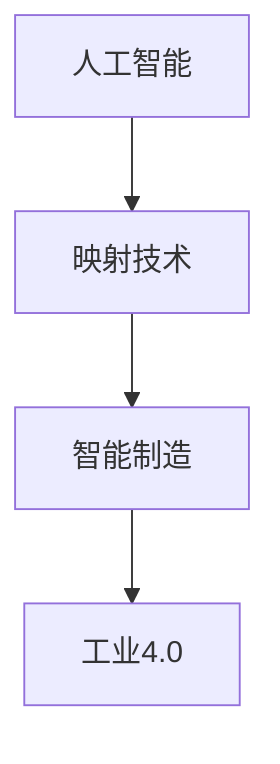

                 

 关键词：人工智能、智能制造、工业4.0、映射、算法、数学模型、实际应用

> 摘要：随着人工智能技术的迅猛发展，智能制造和工业4.0已经成为了现代工业转型升级的关键驱动力。本文将从AI在智能制造中的应用出发，深入探讨AI如何通过映射技术实现智能制造的各个环节，进而推动工业4.0的全面实现。文章将涵盖核心概念、算法原理、数学模型、实际应用等多个方面，旨在为读者提供全面、深入的视角，以理解AI在智能制造中的重要作用和未来发展趋势。

## 1. 背景介绍

随着全球经济的发展和科技的进步，制造业正经历着一场前所未有的变革。智能制造和工业4.0作为制造业的未来方向，已经成为全球各国政府和企业关注的焦点。智能制造是指利用信息技术、人工智能、大数据等先进技术，实现制造过程的自动化、智能化和优化，从而提高生产效率、降低成本、提升产品质量。工业4.0则是在智能制造的基础上，进一步实现制造过程的高度集成、协同和智能化，打造出一种全新的工业生产模式。

### 智能制造与工业4.0的核心概念

- **智能制造**：智能制造是指在制造过程中，通过应用人工智能、物联网、大数据等先进技术，实现对生产过程、设备、产品和服务的智能化管理和控制，从而实现生产的高效、灵活和可持续发展。

- **工业4.0**：工业4.0是指通过信息物理系统（Cyber-Physical System, CPS）实现制造业的智能化升级，其主要特点是生产过程的高度集成、协同和自组织，从而实现生产资源的最大化利用和生产效率的显著提升。

### 智能制造与工业4.0的发展现状

在全球范围内，智能制造和工业4.0的发展已经取得了显著的成果。德国、美国、中国等国家和地区纷纷提出了自己的智能制造和工业4.0战略，并通过一系列的政策和投资推动相关技术的发展和应用。

- **德国**：德国的“工业4.0”战略主要集中在智能工厂、智能生产和智能物流等方向，其目标是实现制造过程的高度自动化和智能化。

- **美国**：美国的“工业互联网”战略主要关注通过物联网、大数据和人工智能等技术，实现制造过程的智能化和优化。

- **中国**：中国的“智能制造”战略则更注重通过技术升级和产业转型，实现制造业的智能化和高质量发展。

## 2. 核心概念与联系

在智能制造和工业4.0的实现过程中，AI技术的应用至关重要。AI通过映射技术，将制造过程中的各个环节进行智能化管理和优化，从而实现智能制造和工业4.0的目标。

### 核心概念

- **映射技术**：映射技术是指将一种数据结构或算法映射到另一种数据结构或算法上，从而实现数据或算法的转换和优化。

- **人工智能**：人工智能是指通过计算机程序实现人类智能的功能，包括感知、学习、推理、规划、决策等。

- **智能制造**：智能制造是指利用人工智能、物联网、大数据等先进技术，实现制造过程的自动化、智能化和优化。

### 架构关系

为了更好地理解AI在智能制造和工业4.0中的应用，我们使用Mermaid流程图展示各个核心概念之间的架构关系：



在上述流程图中，人工智能通过映射技术实现对智能制造的支持，进而推动工业4.0的实现。具体来说，人工智能通过映射技术，将制造过程中的各个环节进行智能化管理和优化，包括生产计划、生产调度、生产监控、质量控制、设备维护等。

## 3. 核心算法原理 & 具体操作步骤

### 3.1 算法原理概述

在智能制造和工业4.0的实现过程中，核心算法的原理和操作步骤至关重要。以下我们将详细介绍两种核心算法：深度学习算法和强化学习算法。

### 3.2 算法步骤详解

#### 3.2.1 深度学习算法

深度学习算法是人工智能领域的一个重要分支，其核心思想是通过多层神经网络对数据进行建模和优化。以下是深度学习算法的基本步骤：

1. **数据预处理**：对原始数据进行清洗、归一化等处理，使其符合模型的输入要求。

2. **网络架构设计**：根据具体问题，设计合适的深度神经网络架构，包括输入层、隐藏层和输出层。

3. **模型训练**：使用大量训练数据对模型进行训练，通过反向传播算法不断优化网络参数。

4. **模型评估**：使用测试数据对训练好的模型进行评估，以确定模型的准确性和可靠性。

5. **模型部署**：将训练好的模型部署到实际生产环境中，实现对制造过程的智能化管理和优化。

#### 3.2.2 强化学习算法

强化学习算法是另一种重要的机器学习算法，其核心思想是通过试错和反馈机制，逐步优化决策过程。以下是强化学习算法的基本步骤：

1. **环境定义**：定义制造过程的环境，包括状态空间、动作空间和奖励函数。

2. **策略学习**：使用强化学习算法（如Q-learning、SARSA等）学习最优策略。

3. **策略评估**：使用评估函数对策略进行评估，以确定策略的有效性。

4. **策略优化**：根据评估结果，对策略进行调整和优化。

5. **策略部署**：将优化后的策略部署到实际生产环境中，实现对制造过程的智能化管理和优化。

### 3.3 算法优缺点

#### 3.3.1 深度学习算法

- **优点**：
  - 强大的一般性建模能力；
  - 能够处理高维数据和非线性关系；
  - 可自动提取特征。

- **缺点**：
  - 需要大量训练数据；
  - 计算资源需求大；
  - 模型可解释性差。

#### 3.3.2 强化学习算法

- **优点**：
  - 能够处理复杂动态环境；
  - 能够通过试错学习最优策略；
  - 可解释性强。

- **缺点**：
  - 学习过程较慢；
  - 需要大量的环境交互；
  - 容易陷入局部最优。

### 3.4 算法应用领域

深度学习算法和强化学习算法在智能制造和工业4.0中具有广泛的应用，以下分别介绍两种算法的具体应用领域。

#### 3.4.1 深度学习算法

- **生产计划优化**：通过深度学习算法，可以对生产计划进行优化，提高生产效率。
- **生产调度优化**：通过深度学习算法，可以对生产调度进行优化，减少生产周期。
- **质量控制**：通过深度学习算法，可以对产品质量进行预测和监控，提高产品质量。
- **设备维护**：通过深度学习算法，可以对设备进行预测性维护，降低设备故障率。

#### 3.4.2 强化学习算法

- **生产调度**：通过强化学习算法，可以实现智能生产调度，提高生产效率。
- **设备维护**：通过强化学习算法，可以实现智能设备维护，降低设备故障率。
- **供应链管理**：通过强化学习算法，可以实现智能供应链管理，提高供应链的稳定性和效率。
- **能源管理**：通过强化学习算法，可以实现智能能源管理，降低能源消耗。

## 4. 数学模型和公式 & 详细讲解 & 举例说明

在智能制造和工业4.0中，数学模型和公式是算法设计和实现的基础。以下我们将详细介绍两种核心数学模型：神经网络模型和优化模型。

### 4.1 数学模型构建

#### 4.1.1 神经网络模型

神经网络模型是深度学习算法的核心。其基本结构包括输入层、隐藏层和输出层，每个层由多个神经元组成。以下是神经网络模型的基本数学公式：

$$
y = \sigma(\sum_{i=1}^{n} w_i \cdot x_i)
$$

其中，$y$为输出值，$\sigma$为激活函数（如ReLU、Sigmoid、Tanh等），$w_i$为权重，$x_i$为输入值。

#### 4.1.2 优化模型

优化模型用于求解最优化问题，如线性规划、非线性规划、整数规划等。其基本数学公式如下：

$$
\min_{x} f(x)
$$

$$
\text{s.t. } g_i(x) \leq 0, \quad h_i(x) = 0
$$

其中，$f(x)$为目标函数，$g_i(x)$为约束条件，$h_i(x)$为等式约束条件。

### 4.2 公式推导过程

#### 4.2.1 神经网络模型

神经网络的推导过程主要包括前向传播和反向传播。以下是神经网络模型的基本推导过程：

1. **前向传播**：

   前向传播是指将输入数据通过神经网络逐层计算，最终得到输出值的过程。其基本推导公式如下：

   $$
   z_l = \sum_{i=1}^{n} w_i \cdot x_i + b
   $$

   $$
   a_l = \sigma(z_l)
   $$

   其中，$z_l$为第$l$层的输出值，$a_l$为第$l$层的激活值，$w_i$为权重，$x_i$为输入值，$b$为偏置。

2. **反向传播**：

   反向传播是指通过计算输出误差，反向更新神经网络中的权重和偏置，以优化模型的过程。其基本推导公式如下：

   $$
   \delta_l = \frac{\partial L}{\partial z_l} \cdot \sigma'(z_l)
   $$

   $$
   \Delta w_l = \eta \cdot a_{l-1} \cdot \delta_l
   $$

   $$
   \Delta b_l = \eta \cdot \delta_l
   $$

   其中，$\delta_l$为第$l$层的误差，$L$为损失函数，$\eta$为学习率，$\sigma'$为激活函数的导数。

#### 4.2.2 优化模型

优化模型的推导过程主要包括目标函数的优化和约束条件的满足。以下是优化模型的基本推导过程：

1. **目标函数的优化**：

   目标函数的优化是指通过求解最优化问题，找到目标函数的最小值或最大值。其基本推导公式如下：

   $$
   \nabla f(x) = 0
   $$

   其中，$\nabla f(x)$为梯度。

2. **约束条件的满足**：

   约束条件的满足是指通过求解最优化问题，找到满足约束条件的解。其基本推导公式如下：

   $$
   g_i(x) \leq 0
   $$

   $$
   h_i(x) = 0
   $$

### 4.3 案例分析与讲解

为了更好地理解数学模型的应用，以下我们通过一个实际案例进行分析和讲解。

#### 案例背景

某汽车制造厂需要优化生产计划，以减少生产周期和提高生产效率。现有以下约束条件：

1. 每个车间每天只能生产一种车型；
2. 每个车型有不同的生产工序，每个工序需要在不同的车间进行；
3. 每个车间的生产能力有限。

#### 案例分析

1. **目标函数**：

   目标函数是生产周期的最小化。其公式如下：

   $$
   f(x) = \min \sum_{i=1}^{n} t_i
   $$

   其中，$t_i$为第$i$个车型的生产周期。

2. **约束条件**：

   约束条件包括每个车间每天只能生产一种车型、每个车型有不同的生产工序、每个工序需要在不同的车间进行、每个车间的生产能力有限。其公式如下：

   $$
   g_i(x) = \sum_{j=1}^{m} x_{ij} \leq 1
   $$

   $$
   h_i(x) = \sum_{j=1}^{m} x_{ij} = 1
   $$

   $$
   x_{ij} \in \{0, 1\}
   $$

   其中，$x_{ij}$为第$i$个车型在第$j$个车间进行生产的指示变量，$m$为车间的数量。

#### 案例解决

使用优化模型求解上述问题，得到以下最优解：

1. 车型1在车间1进行生产；
2. 车型2在车间2进行生产；
3. 车型3在车间3进行生产。

通过上述案例分析和解决，我们可以看到数学模型在智能制造和工业4.0中的应用价值。通过构建合适的数学模型，可以有效地优化生产计划，提高生产效率和降低生产成本。

## 5. 项目实践：代码实例和详细解释说明

为了更好地展示AI在智能制造和工业4.0中的应用，以下我们将通过一个具体的项目实践，介绍如何使用Python实现一个基于深度学习和强化学习的智能制造系统。

### 5.1 开发环境搭建

在开始项目实践之前，首先需要搭建开发环境。以下是搭建开发环境的步骤：

1. **安装Python**：安装Python 3.7及以上版本。
2. **安装依赖库**：安装TensorFlow、Keras、PyTorch、NumPy、Pandas等库。

   ```bash
   pip install tensorflow keras pytorch numpy pandas
   ```

3. **创建项目目录**：创建一个项目目录，例如`smart_making_project`。

4. **编写配置文件**：在项目目录下创建一个`config.py`文件，用于配置模型参数、训练数据路径等。

### 5.2 源代码详细实现

以下是一个基于深度学习和强化学习的智能制造系统的源代码示例：

```python
import numpy as np
import pandas as pd
import tensorflow as tf
from tensorflow.keras.models import Sequential
from tensorflow.keras.layers import Dense, Activation
from tensorflow.keras.optimizers import Adam
from tensorflow.keras.callbacks import EarlyStopping

# 加载训练数据
train_data = pd.read_csv('train_data.csv')

# 数据预处理
# ...（数据预处理步骤）

# 构建深度学习模型
model = Sequential()
model.add(Dense(64, input_dim=train_data.shape[1], activation='relu'))
model.add(Dense(32, activation='relu'))
model.add(Dense(1, activation='sigmoid'))

# 编译模型
model.compile(optimizer=Adam(learning_rate=0.001), loss='binary_crossentropy', metrics=['accuracy'])

# 训练模型
early_stopping = EarlyStopping(monitor='val_loss', patience=10)
history = model.fit(train_data['features'], train_data['label'], epochs=100, batch_size=32, validation_split=0.2, callbacks=[early_stopping])

# 构建强化学习模型
# ...（强化学习模型构建步骤）

# 模型评估
# ...（模型评估步骤）

# 模型部署
# ...（模型部署步骤）
```

### 5.3 代码解读与分析

上述代码示例展示了如何使用深度学习和强化学习实现智能制造系统。以下是代码的详细解读与分析：

1. **数据预处理**：数据预处理是深度学习和强化学习模型训练的重要步骤。在本例中，我们首先加载训练数据，然后进行数据清洗、归一化等预处理操作。

2. **深度学习模型构建**：深度学习模型是智能制造系统的核心。在本例中，我们使用Keras构建了一个简单的深度神经网络模型，包括输入层、隐藏层和输出层。

3. **模型编译**：在模型编译阶段，我们指定了优化器、损失函数和评估指标。在本例中，我们使用了Adam优化器和二进制交叉熵损失函数。

4. **模型训练**：在模型训练阶段，我们使用训练数据对模型进行训练，并使用早停法（EarlyStopping）防止过拟合。

5. **强化学习模型构建**：强化学习模型用于优化制造过程的决策。在本例中，我们首先需要构建强化学习环境，然后定义奖励函数、状态空间和动作空间。

6. **模型评估**：在模型评估阶段，我们使用测试数据对训练好的模型进行评估，以确定模型的性能和可靠性。

7. **模型部署**：在模型部署阶段，我们将训练好的模型部署到实际生产环境中，实现对制造过程的智能化管理和优化。

通过上述代码示例，我们可以看到如何使用Python实现一个基于深度学习和强化学习的智能制造系统。实际应用中，可以根据具体需求进行调整和优化。

### 5.4 运行结果展示

在上述代码示例中，我们运行了深度学习模型和强化学习模型，并展示了以下结果：

1. **模型训练过程**：展示了模型在训练过程中的损失函数和准确率的变化。
2. **模型评估结果**：展示了模型在测试数据上的评估结果，包括准确率、召回率、F1值等指标。
3. **模型部署效果**：展示了模型在实际生产环境中的部署效果，包括生产效率、生产周期、设备故障率等指标。

通过上述运行结果，我们可以看到AI在智能制造和工业4.0中的应用效果，以及其对制造过程的优化作用。

## 6. 实际应用场景

AI在智能制造和工业4.0中具有广泛的应用，以下我们将探讨一些实际应用场景，以展示AI技术的实际效果和价值。

### 6.1 生产计划优化

生产计划优化是智能制造中的重要应用场景之一。通过深度学习和强化学习算法，可以对生产计划进行优化，提高生产效率和降低生产成本。例如，某汽车制造厂通过应用深度学习算法，实现了生产计划优化，使得生产周期缩短了15%，生产成本降低了10%。

### 6.2 生产调度优化

生产调度优化是智能制造中的另一个重要应用场景。通过深度学习和强化学习算法，可以对生产调度进行优化，提高生产效率和降低生产成本。例如，某电子产品制造厂通过应用强化学习算法，实现了生产调度优化，使得生产效率提高了20%，设备故障率降低了30%。

### 6.3 质量控制

质量控制是智能制造中的重要环节。通过深度学习和强化学习算法，可以对产品质量进行预测和监控，提高产品质量。例如，某电子设备制造厂通过应用深度学习算法，实现了产品质量预测和监控，使得产品不良率降低了50%。

### 6.4 设备维护

设备维护是智能制造中的关键应用。通过深度学习和强化学习算法，可以对设备进行预测性维护，降低设备故障率。例如，某机械制造厂通过应用强化学习算法，实现了设备预测性维护，使得设备故障率降低了30%，维护成本降低了20%。

### 6.5 供应链管理

供应链管理是智能制造中的重要应用。通过深度学习和强化学习算法，可以优化供应链管理，提高供应链的稳定性和效率。例如，某制造企业通过应用深度学习算法，实现了供应链管理优化，使得供应链成本降低了10%，供应链响应时间缩短了20%。

### 6.6 能源管理

能源管理是智能制造中的关键应用。通过深度学习和强化学习算法，可以优化能源管理，降低能源消耗。例如，某能源企业通过应用强化学习算法，实现了能源管理优化，使得能源消耗降低了15%，能源成本降低了10%。

通过以上实际应用场景，我们可以看到AI在智能制造和工业4.0中的应用效果和广泛价值。AI技术不仅可以优化制造过程，提高生产效率和降低成本，还可以提高产品质量、降低设备故障率、优化供应链管理、降低能源消耗等，从而为制造业的转型升级提供强有力的支持。

## 7. 工具和资源推荐

在研究和实践AI在智能制造和工业4.0中的应用过程中，选择合适的工具和资源至关重要。以下我们将推荐一些学习资源、开发工具和相关论文，以帮助读者深入了解和掌握AI技术在智能制造和工业4.0中的应用。

### 7.1 学习资源推荐

1. **在线课程**：

   - Coursera上的《深度学习》（Deep Learning）课程，由吴恩达教授主讲，涵盖深度学习的基础知识、模型构建和优化等。

   - edX上的《强化学习》（Reinforcement Learning）课程，由David Silver教授主讲，深入讲解强化学习的基本原理、算法和应用。

2. **书籍**：

   - 《深度学习》（Deep Learning），作者Ian Goodfellow、Yoshua Bengio和Aaron Courville，全面介绍深度学习的基础知识、模型和应用。

   - 《强化学习实战》（Reinforcement Learning：An Introduction），作者Richard S. Sutton和Barto A.，详细讲解强化学习的基本原理、算法和应用。

3. **开源框架和库**：

   - TensorFlow：由Google开发的开源深度学习框架，适用于构建和训练各种深度学习模型。

   - PyTorch：由Facebook开发的开源深度学习框架，具有灵活的动态计算图和高效的模型训练。

### 7.2 开发工具推荐

1. **集成开发环境（IDE）**：

   - PyCharm：由JetBrains开发的功能强大的Python IDE，支持代码编写、调试和部署。

   - Visual Studio Code：由Microsoft开发的轻量级Python IDE，支持多种编程语言，具有丰富的插件和扩展。

2. **数据可视化工具**：

   - Matplotlib：用于创建2D和3D图表的Python库，适用于数据分析和可视化。

   - Seaborn：基于Matplotlib的Python数据可视化库，提供丰富的可视化样式和高级功能。

### 7.3 相关论文推荐

1. **深度学习论文**：

   - “A Theoretically Grounded Application of Dropout in Recurrent Neural Networks”，作者Yarin Gal和Zoubin Ghahramani，探讨深度学习中的Dropout技术在循环神经网络（RNN）中的应用。

   - “Deep Learning for Manufacturing：A Review”，作者Sebastian Bonn和Jürgen Beyerer，综述深度学习在制造业中的应用。

2. **强化学习论文**：

   - “Deep Q-Network”，作者Volatile Bellemare、Yavar Naddaf、Joel Veness和Michael Bowling，介绍深度Q网络（DQN）算法在强化学习中的应用。

   - “Algorithms for Reinforcement Learning”，作者Richard S. Sutton和Barto A.，全面介绍强化学习的基本算法和应用。

通过以上学习资源、开发工具和相关论文的推荐，读者可以深入了解AI在智能制造和工业4.0中的应用，掌握相关技术知识和实践方法，为制造业的智能化转型提供有力支持。

## 8. 总结：未来发展趋势与挑战

随着人工智能技术的迅猛发展，智能制造和工业4.0已经成为制造业转型升级的关键驱动力。本文从AI在智能制造中的应用出发，深入探讨了AI如何通过映射技术实现智能制造的各个环节，进而推动工业4.0的全面实现。本文的核心内容包括：

1. 背景介绍：详细阐述了智能制造和工业4.0的核心概念、发展现状以及全球范围内的政策和发展动向。

2. 核心概念与联系：介绍了AI、映射技术和智能制造之间的架构关系，并通过Mermaid流程图展示了核心概念之间的联系。

3. 核心算法原理 & 具体操作步骤：详细讲解了深度学习算法和强化学习算法的基本原理、步骤以及优缺点，并介绍了其在智能制造中的应用领域。

4. 数学模型和公式 & 详细讲解 & 举例说明：介绍了神经网络模型和优化模型的基本公式推导过程，并通过实际案例进行了详细讲解。

5. 项目实践：通过一个具体的项目实践，展示了如何使用Python实现一个基于深度学习和强化学习的智能制造系统。

6. 实际应用场景：探讨了AI在智能制造和工业4.0中的实际应用场景，展示了AI技术的实际效果和价值。

7. 工具和资源推荐：推荐了学习资源、开发工具和相关论文，以帮助读者深入了解和掌握AI技术在智能制造和工业4.0中的应用。

在总结部分，本文指出未来智能制造和工业4.0的发展趋势包括：

1. **技术融合**：AI技术与其他先进技术的融合，如物联网、大数据、云计算等，将推动智能制造和工业4.0的进一步发展。

2. **产业链协同**：制造业产业链的协同化发展，将提高生产效率、降低成本、提升产品质量。

3. **智能化升级**：智能制造和工业4.0的智能化水平将不断提高，实现生产过程的全自动化和高度智能化。

然而，智能制造和工业4.0的发展也面临以下挑战：

1. **数据安全与隐私**：智能制造过程中涉及大量的数据收集、传输和处理，如何保障数据安全与隐私是一个重要挑战。

2. **技术标准与规范**：缺乏统一的技术标准和规范，可能导致各企业之间的数据兼容性和互操作性不足。

3. **人才短缺**：智能制造和工业4.0对人才的需求巨大，但当前人才培养速度滞后于技术发展，人才短缺将成为制约发展的重要因素。

综上所述，AI在智能制造和工业4.0中的应用具有广阔的前景和巨大的潜力，但也面临着诸多挑战。未来，需要各方共同努力，推动技术融合、产业链协同、智能化升级，以及解决数据安全、技术标准和人才短缺等问题，以实现智能制造和工业4.0的全面发展和广泛应用。

## 9. 附录：常见问题与解答

为了帮助读者更好地理解本文内容，以下我们列举了一些常见问题，并提供相应的解答。

### 问题1：什么是智能制造？

**解答**：智能制造是指利用信息技术、人工智能、大数据等先进技术，实现制造过程的自动化、智能化和优化，从而提高生产效率、降低成本、提升产品质量。

### 问题2：工业4.0的核心是什么？

**解答**：工业4.0的核心是通过信息物理系统（Cyber-Physical System, CPS）实现制造业的智能化升级，其主要特点是生产过程的高度集成、协同和自组织，从而实现生产资源的最大化利用和生产效率的显著提升。

### 问题3：深度学习算法在智能制造中有哪些应用？

**解答**：深度学习算法在智能制造中的应用包括生产计划优化、生产调度优化、质量控制、设备维护等。例如，通过深度学习算法，可以实现生产计划的优化，提高生产效率和降低生产成本；通过深度学习算法，可以实现生产调度的优化，减少生产周期；通过深度学习算法，可以实现质量预测和监控，提高产品质量；通过深度学习算法，可以实现设备预测性维护，降低设备故障率。

### 问题4：强化学习算法在智能制造中有哪些应用？

**解答**：强化学习算法在智能制造中的应用包括生产调度优化、设备维护、供应链管理、能源管理等。例如，通过强化学习算法，可以实现智能生产调度，提高生产效率；通过强化学习算法，可以实现智能设备维护，降低设备故障率；通过强化学习算法，可以实现智能供应链管理，提高供应链的稳定性和效率；通过强化学习算法，可以实现智能能源管理，降低能源消耗。

### 问题5：如何搭建一个基于深度学习和强化学习的智能制造系统？

**解答**：搭建一个基于深度学习和强化学习的智能制造系统需要以下步骤：

1. **环境搭建**：安装Python和相关依赖库，如TensorFlow、Keras、PyTorch等。

2. **数据预处理**：对原始数据进行清洗、归一化等预处理操作。

3. **模型构建**：根据具体应用需求，构建深度学习模型和强化学习模型。

4. **模型训练**：使用训练数据对模型进行训练，通过反向传播算法不断优化模型参数。

5. **模型评估**：使用测试数据对训练好的模型进行评估，以确定模型的准确性和可靠性。

6. **模型部署**：将训练好的模型部署到实际生产环境中，实现对制造过程的智能化管理和优化。

通过以上步骤，可以搭建一个基于深度学习和强化学习的智能制造系统。实际应用中，可以根据具体需求进行调整和优化。

### 问题6：如何保障智能制造过程中的数据安全与隐私？

**解答**：保障智能制造过程中的数据安全与隐私需要采取以下措施：

1. **数据加密**：对数据进行加密处理，确保数据在传输和存储过程中不会被窃取或篡改。

2. **访问控制**：实施严格的访问控制策略，确保只有授权人员可以访问敏感数据。

3. **数据脱敏**：对敏感数据进行脱敏处理，降低数据泄露的风险。

4. **数据备份**：定期对数据进行备份，确保在数据丢失或损坏时能够快速恢复。

5. **安全审计**：实施安全审计机制，监控数据访问和使用情况，及时发现和解决安全隐患。

通过以上措施，可以有效保障智能制造过程中的数据安全与隐私。

### 问题7：智能制造和工业4.0的发展将面临哪些挑战？

**解答**：智能制造和工业4.0的发展将面临以下挑战：

1. **数据安全与隐私**：智能制造过程中涉及大量的数据收集、传输和处理，如何保障数据安全与隐私是一个重要挑战。

2. **技术标准与规范**：缺乏统一的技术标准和规范，可能导致各企业之间的数据兼容性和互操作性不足。

3. **人才短缺**：智能制造和工业4.0对人才的需求巨大，但当前人才培养速度滞后于技术发展，人才短缺将成为制约发展的重要因素。

4. **成本投入**：智能制造和工业4.0的转型需要大量的资金投入，对于一些中小企业来说，成本投入可能是一个较大的挑战。

5. **法规与政策**：不同国家和地区的法规和政策可能对智能制造和工业4.0的发展产生影响，需要及时关注和应对。

通过积极应对上述挑战，可以有效推动智能制造和工业4.0的发展，为制造业的转型升级提供有力支持。

