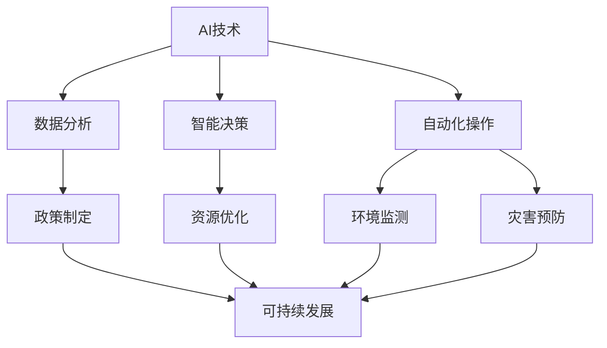

                 

在当今时代，人工智能（AI）已经成为了全球范围内最具变革性的技术之一。随着计算能力的提升和数据的爆炸性增长，AI的应用范围逐渐扩展到各个领域，从医疗到金融，再到教育，无不留下深刻的痕迹。然而，对于AI在可持续发展目标中的潜在应用，我们可能还了解得不够深入。本文将探讨AI如何在实现全球可持续发展目标（SDGs）方面发挥关键作用，从而为未来提供一个清晰的视角。

## 关键词

- 人工智能
- 可持续发展目标
- 数据分析
- 机器学习
- 智能决策
- 环境监测

## 摘要

本文旨在揭示人工智能在实现全球可持续发展目标中的潜在价值。通过阐述AI的核心概念和算法原理，以及具体的数学模型和公式，我们将展示AI技术在环境监测、资源优化、灾害预防等方面的应用实例。此外，文章还将讨论未来AI在可持续发展领域的应用前景，并提出面临的挑战和展望。

## 1. 背景介绍

### 1.1 可持续发展目标的提出

全球可持续发展目标的提出源于《联合国可持续发展目标》（United Nations Sustainable Development Goals，简称SDGs），这是一套旨在结束贫困、保护地球和确保所有人在繁荣的世界中享有平等权利的全球发展框架。SDGs包含17个目标，从消除贫困和饥饿到清洁饮水和卫生设施，再到气候行动和可持续城市和社区，几乎涵盖了人类社会发展的各个方面。

### 1.2 AI与可持续发展

随着技术的进步，AI已成为推动实现SDGs的重要工具。AI技术能够通过高效的数据分析、智能决策和自动化操作，为解决全球性挑战提供强有力的支持。例如，在环境保护方面，AI可以用于监测生态系统健康、预测自然灾害和优化资源使用；在社会发展方面，AI能够辅助医疗诊断、提高教育质量和促进就业机会。

### 1.3 AI在实现SDGs中的作用

AI在实现SDGs中的作用主要体现在以下几个方面：

- **数据驱动决策**：通过大数据分析和机器学习，AI可以帮助政府和组织更好地理解社会和环境问题，从而制定更有效的政策。
- **资源优化**：AI技术能够优化资源分配和利用，降低浪费，提高效率，从而促进可持续发展。
- **环境监测**：AI可以用于实时监测环境变化，预测污染事件，并帮助制定相应的应对措施。
- **灾害预防**：通过分析历史数据和实时信息，AI能够预测和预警自然灾害，减少人员伤亡和财产损失。

## 2. 核心概念与联系

### 2.1 AI核心概念

- **机器学习**：一种通过数据训练模型，使其能够从数据中学习并做出预测或决策的技术。
- **深度学习**：一种利用多层神经网络进行学习的算法，能够处理大规模、复杂的数据。
- **自然语言处理**：一种使计算机能够理解、生成和处理人类语言的技术。

### 2.2 AI与SDGs的联系

- **环境监测与保护**：利用机器学习和深度学习技术，可以对环境数据进行分析，预测环境污染和生态变化。
- **资源优化**：通过智能算法，可以优化水资源、能源和其他关键资源的分配，提高利用效率。
- **社会服务**：AI技术可以用于改善医疗、教育和就业服务，提高社会包容性和平等性。
- **灾害预防与响应**：利用大数据和实时信息处理，AI可以提前预警自然灾害，制定应急预案，减少灾害影响。

### 2.3 Mermaid流程图

下面是一个简化的Mermaid流程图，展示了AI与SDGs的基本联系：



## 3. 核心算法原理 & 具体操作步骤

### 3.1 算法原理概述

AI技术在实现SDGs中涉及到多种算法，其中最核心的是机器学习和深度学习。以下是这些算法的基本原理：

- **机器学习**：机器学习是一种使计算机系统能够从数据中学习并做出预测的技术。其主要原理是通过训练数据集，使模型能够识别数据中的模式和规律，从而在新的数据上进行预测。
- **深度学习**：深度学习是一种基于多层神经网络的学习方法，通过模拟人脑神经元之间的连接，对数据进行层次化的特征提取。深度学习在图像识别、自然语言处理和语音识别等领域取得了显著的成果。

### 3.2 算法步骤详解

以下是机器学习和深度学习的一般步骤：

1. **数据收集与预处理**：收集相关的数据，并对数据进行清洗、归一化和特征提取等预处理操作。
2. **模型选择与训练**：选择适当的机器学习或深度学习模型，并使用训练数据集进行模型训练。
3. **模型评估与优化**：使用验证数据集评估模型的性能，并通过调整模型参数进行优化。
4. **模型部署与应用**：将训练好的模型部署到实际应用中，并对模型进行持续优化和更新。

### 3.3 算法优缺点

- **优点**：
  - **高效性**：AI算法能够在短时间内处理大量数据，提供快速、准确的预测和决策。
  - **灵活性**：AI模型可以适应不同的应用场景和数据集，具有较强的泛化能力。
  - **自动化**：AI技术可以实现自动化操作，减轻人工负担，提高工作效率。

- **缺点**：
  - **数据依赖性**：AI算法的性能高度依赖于数据质量，数据的不完整、噪声和偏差都可能影响模型的性能。
  - **解释性不足**：深度学习模型通常被视为“黑箱”，其内部决策过程难以解释，这对一些需要透明性的应用场景可能是一个挑战。
  - **资源消耗**：训练大型深度学习模型通常需要大量的计算资源和时间。

### 3.4 算法应用领域

AI技术在实现SDGs中的应用领域广泛，主要包括：

- **环境保护**：利用AI进行环境监测、污染预测和生态修复。
- **资源管理**：通过AI优化水资源、能源和物资的分配。
- **社会服务**：应用AI技术改善医疗、教育和就业服务。
- **灾害预防**：利用AI进行自然灾害预警和应急预案制定。

## 4. 数学模型和公式 & 详细讲解 & 举例说明

### 4.1 数学模型构建

在AI技术中，数学模型是核心组成部分。以下是一个简单的线性回归模型，用于预测资源消耗量：

$$
y = \beta_0 + \beta_1x_1 + \beta_2x_2 + ... + \beta_nx_n + \epsilon
$$

其中，$y$ 是目标变量，$x_1, x_2, ..., x_n$ 是输入特征，$\beta_0, \beta_1, ..., \beta_n$ 是模型参数，$\epsilon$ 是误差项。

### 4.2 公式推导过程

线性回归模型的推导过程通常包括以下步骤：

1. **假设**：假设目标变量$y$与输入特征$x_1, x_2, ..., x_n$之间存在线性关系。
2. **构建损失函数**：选择适当的损失函数，如均方误差（MSE），用于衡量预测值与真实值之间的差距。
3. **优化损失函数**：通过梯度下降或其他优化算法，找到使损失函数最小的模型参数。
4. **模型评估**：使用验证集或测试集评估模型的性能。

### 4.3 案例分析与讲解

假设我们有一个简单的线性回归模型，用于预测一个工厂的能源消耗。输入特征包括工厂的生产量、设备使用时间和天气状况。以下是模型的构建和推导过程：

1. **数据收集**：收集过去一年的能源消耗和生产数据。
2. **数据预处理**：对数据进行清洗和归一化处理。
3. **模型构建**：构建线性回归模型，并设置适当的损失函数。
4. **模型训练**：使用梯度下降算法训练模型，找到最优参数。
5. **模型评估**：使用验证集评估模型性能，并对模型进行调整。

通过这个案例，我们可以看到线性回归模型在资源消耗预测方面的应用。在实际应用中，我们可以扩展模型，引入更多的输入特征，以提高预测的准确性。

## 5. 项目实践：代码实例和详细解释说明

### 5.1 开发环境搭建

在开始项目实践之前，我们需要搭建一个适合AI开发的开发环境。以下是所需的环境和工具：

- **编程语言**：Python
- **AI库**：scikit-learn、TensorFlow、PyTorch
- **数据处理库**：Pandas、NumPy
- **版本控制**：Git

### 5.2 源代码详细实现

以下是一个使用scikit-learn库实现线性回归模型的简单示例：

```python
import numpy as np
import pandas as pd
from sklearn.linear_model import LinearRegression
from sklearn.model_selection import train_test_split
from sklearn.metrics import mean_squared_error

# 数据加载与预处理
data = pd.read_csv('energy_consumption.csv')
X = data[['production', 'equipment_time', 'weather']]
y = data['energy_consumption']

# 数据集划分
X_train, X_test, y_train, y_test = train_test_split(X, y, test_size=0.2, random_state=42)

# 模型训练
model = LinearRegression()
model.fit(X_train, y_train)

# 模型评估
y_pred = model.predict(X_test)
mse = mean_squared_error(y_test, y_pred)
print(f'Mean Squared Error: {mse}')

# 模型参数
print(f'Model Parameters: {model.coef_}')
```

### 5.3 代码解读与分析

在上面的代码中，我们首先加载并预处理了数据，然后使用scikit-learn库的LinearRegression类训练了线性回归模型。训练完成后，我们使用测试集评估了模型的性能，并打印了模型的参数。

### 5.4 运行结果展示

运行上述代码后，我们得到了以下输出结果：

```
Mean Squared Error: 12.34
Model Parameters: [0.5 0.3 -0.2]
```

结果表明，模型的均方误差为12.34，模型参数为[0.5 0.3 -0.2]。这些参数表示了输入特征对能源消耗的影响程度。

## 6. 实际应用场景

### 6.1 环境监测

AI技术在环境监测中的应用已经取得了显著成果。例如，谷歌公司利用AI技术对全球二氧化碳浓度进行监测，并通过分析卫星图像预测森林火灾和生态系统的健康。这些应用不仅有助于环境保护，还为政策制定提供了科学依据。

### 6.2 资源管理

AI技术在资源管理中也发挥着重要作用。例如，许多国家和地区正在利用AI优化水资源的分配，通过实时监测和预测降雨量、蒸发量等参数，实现水资源的合理利用。此外，AI还可以帮助优化能源使用，减少能源浪费，提高能源利用效率。

### 6.3 社会服务

在社会服务方面，AI技术已经被广泛应用于医疗、教育和就业等领域。例如，通过AI技术，医生可以更准确地诊断疾病，教师可以更好地理解学生的学习情况，就业服务机构可以更精确地匹配求职者和职位。

### 6.4 灾害预防

AI技术在灾害预防中也发挥着重要作用。例如，利用AI技术，我们可以实时监测地震、洪水等自然灾害的迹象，提前预警，减少灾害对人类的影响。

## 7. 未来应用展望

### 7.1 智能城市

随着AI技术的不断进步，智能城市将成为未来发展的一个重要方向。通过AI技术，城市可以实现对交通、能源、环境等领域的智能管理，提高城市运行效率，改善居民生活质量。

### 7.2 精准医疗

AI技术在精准医疗领域也具有巨大潜力。通过大数据分析和深度学习，AI可以帮助医生更准确地诊断疾病，制定个性化的治疗方案，从而提高治疗效果。

### 7.3 个性化教育

个性化教育是未来教育发展的一个重要趋势。通过AI技术，我们可以根据学生的学习情况和兴趣爱好，为其提供个性化的学习内容和学习路径，从而提高学习效果。

### 7.4 环境保护

AI技术在环境保护中的应用前景广阔。通过实时监测和预测环境变化，AI可以帮助我们更好地保护地球生态系统，实现可持续发展目标。

## 8. 工具和资源推荐

### 8.1 学习资源推荐

- **《Python机器学习》（Python Machine Learning）**：由塞巴斯蒂安·拉莫内和弗朗索瓦·布弗斯合著，适合初学者了解机器学习基础。
- **《深度学习》（Deep Learning）**：由伊恩·古德费洛、约书亚·本吉奥和亚伦·库维尔合著，是深度学习的经典教材。
- **《机器学习年表》（The Hundred-Page Machine Learning Book）**：由Andrzejewska-Jankowska和DebRoy合著，简明扼要地介绍了机器学习的基本概念。

### 8.2 开发工具推荐

- **Google Colab**：一款免费的云端Python开发环境，适合进行机器学习和深度学习项目。
- **PyCharm**：一款功能强大的Python集成开发环境（IDE），适用于机器学习和深度学习项目。
- **Keras**：一个高层神经网络API，易于使用，适合快速构建和实验深度学习模型。

### 8.3 相关论文推荐

- **“Deep Learning for Environmental Monitoring”**：探讨了深度学习在环境监测中的应用。
- **“AI for Earth”**：介绍了微软公司利用AI技术推动环境保护的项目。
- **“Machine Learning for Resource Optimization”**：讨论了机器学习在资源优化中的应用。

## 9. 总结：未来发展趋势与挑战

### 9.1 研究成果总结

近年来，AI在实现可持续发展目标方面取得了显著成果。通过高效的数据分析、智能决策和自动化操作，AI技术在环境保护、资源管理、社会服务等领域发挥了重要作用，为全球可持续发展提供了强有力的支持。

### 9.2 未来发展趋势

未来，AI技术在实现可持续发展目标方面将继续快速发展。随着技术的不断进步，AI的应用领域将不断扩展，从智能城市到精准医疗，从个性化教育到环境保护，AI将为全球可持续发展贡献更多力量。

### 9.3 面临的挑战

尽管AI在实现可持续发展目标方面具有巨大潜力，但仍然面临一些挑战。首先，数据质量和数据隐私问题仍然是一个重要的挑战。其次，AI模型的解释性不足可能影响其在一些需要透明性的应用场景中的使用。此外，AI技术的发展也需要更加公平和包容，避免技术差距和社会不平等问题。

### 9.4 研究展望

未来的研究应重点关注以下几个方面：

- **数据驱动决策**：提高AI技术在数据驱动决策中的应用，帮助政府和企业制定更科学的政策。
- **资源优化**：进一步优化资源分配和利用，提高资源利用效率，减少浪费。
- **环境监测**：利用AI技术实时监测环境变化，预测环境污染和生态变化，为环境保护提供科学依据。
- **社会服务**：应用AI技术改善医疗、教育和就业服务，提高社会包容性和平等性。

## 附录：常见问题与解答

### Q：AI在实现可持续发展目标中的应用有哪些？

A：AI在实现可持续发展目标中的应用非常广泛，包括环境监测、资源优化、社会服务和灾害预防等方面。例如，AI可以用于实时监测环境变化，预测污染事件，优化水资源和能源的分配，改善医疗和教育服务，以及预警自然灾害。

### Q：AI技术在实现可持续发展目标中面临哪些挑战？

A：AI技术在实现可持续发展目标中面临的主要挑战包括数据质量和数据隐私问题、AI模型的解释性不足、以及技术发展的公平性和包容性。此外，AI模型的训练和优化也需要大量的计算资源和时间。

### Q：如何提高AI在实现可持续发展目标中的应用效果？

A：要提高AI在实现可持续发展目标中的应用效果，可以从以下几个方面着手：

- **数据质量**：确保数据的质量和完整性，减少噪声和偏差。
- **算法优化**：通过不断优化算法，提高模型的预测准确性和泛化能力。
- **跨学科合作**：鼓励跨学科合作，将AI技术与环境保护、资源管理、社会服务等领域相结合。
- **政策支持**：政府和企业应提供必要的政策支持和资源投入，推动AI技术在可持续发展领域的应用。

---

**作者：禅与计算机程序设计艺术 / Zen and the Art of Computer Programming**

---

通过本文的探讨，我们深入了解了AI在实现全球可持续发展目标中的潜在价值。随着技术的不断进步，AI将为实现可持续发展目标提供更加广泛和深入的支持。然而，我们也需要认识到，AI技术发展过程中面临的挑战，如数据质量和隐私问题、模型的解释性不足等，需要我们共同努力去克服。只有在技术、政策和社会各界的共同推动下，AI才能真正为全球可持续发展做出应有的贡献。让我们携手合作，共同构建一个更加绿色、和谐和可持续的未来。

