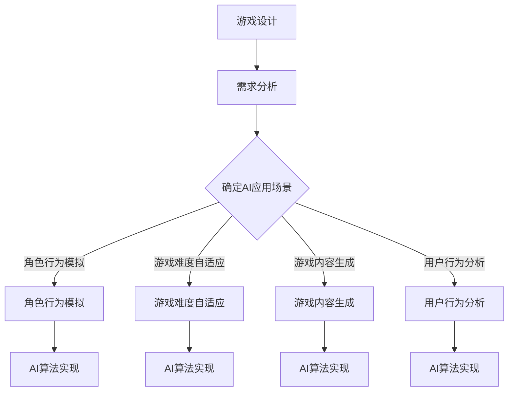

                 

关键词：AI、游戏开发、映射、应用、算法、模型

摘要：本文将探讨人工智能（AI）在游戏开发中的创新应用。通过分析AI的核心概念及其在游戏设计、开发、优化等多个环节的映射，我们揭示了AI如何改变传统游戏开发的模式，并展望了未来AI在游戏领域的潜力与挑战。

## 1. 背景介绍

### 1.1 游戏开发的发展历程

游戏作为数字娱乐的重要组成部分，自诞生以来经历了无数次的变革与发展。从最初的电子游戏机到如今的智能移动设备，游戏的形式与内容不断推陈出新。与此同时，游戏开发技术也在不断提升，尤其是近年来，人工智能（AI）技术的迅猛发展为游戏开发带来了前所未有的机遇。

### 1.2 AI在游戏开发中的早期应用

AI在游戏开发中的应用可以追溯到20世纪90年代，当时的游戏如《文明的崛起》（Civilization）和《英雄无敌》（Heroes of Might and Magic）就已经开始尝试利用简单的AI算法来增强游戏的人工智能对手。然而，由于计算能力和算法的限制，这些早期应用更多是作为一种噱头，而未能真正发挥AI的潜力。

### 1.3 当前AI在游戏开发中的角色

随着深度学习、强化学习等AI技术的不断发展，AI在游戏开发中的应用越来越深入和广泛。现代游戏如《星际争霸II》（StarCraft II）和《黑暗之魂III》（Dark Souls III）中的NPC（非玩家角色）AI已经可以展现出与人类玩家相当甚至超越的复杂行为和策略。

## 2. 核心概念与联系

### 2.1 AI的核心概念

人工智能（AI）是指计算机系统模拟人类智能行为的技术。它包括多个子领域，如机器学习、深度学习、自然语言处理、计算机视觉等。AI的目标是使计算机能够执行通常需要人类智能的任务，例如视觉识别、语音识别、决策制定等。

### 2.2 游戏开发中的AI映射

在游戏开发中，AI的映射体现在以下几个方面：

- **角色行为模拟**：通过AI算法模拟NPC的行为，使其具备自主决策能力和复杂行为。
- **游戏难度自适应**：根据玩家的表现动态调整游戏难度，提供个性化的游戏体验。
- **游戏内容生成**：利用AI生成新的游戏关卡、地图和剧情，增加游戏的可玩性和创新性。
- **用户行为分析**：通过分析玩家的行为数据，为游戏运营提供决策支持。

### 2.3 Mermaid流程图

下面是一个简单的Mermaid流程图，展示了AI在游戏开发中的核心应用流程：



## 3. 核心算法原理 & 具体操作步骤

### 3.1 算法原理概述

AI在游戏开发中的应用主要依赖于以下几种算法：

- **深度学习**：通过构建深度神经网络，使计算机能够通过大量数据学习并模拟复杂行为。
- **强化学习**：通过不断试错和奖励机制，使AI在特定环境中找到最优策略。
- **自然语言处理**：使计算机能够理解和生成自然语言，用于游戏剧情和对话生成。

### 3.2 算法步骤详解

#### 3.2.1 深度学习

1. **数据收集**：收集大量游戏数据，包括角色行为、游戏状态等。
2. **模型构建**：使用深度学习框架构建神经网络模型。
3. **模型训练**：使用训练数据对模型进行训练，调整模型参数。
4. **模型评估**：使用测试数据对模型进行评估，调整模型以达到预期效果。

#### 3.2.2 强化学习

1. **环境设定**：定义游戏环境，包括状态、动作和奖励。
2. **策略选择**：使用Q-learning或深度Q网络（DQN）等算法选择最优动作。
3. **策略评估**：通过试错和奖励机制，评估策略的有效性。
4. **策略更新**：根据评估结果更新策略。

#### 3.2.3 自然语言处理

1. **文本分析**：对游戏剧情和对话文本进行分析，提取关键词和语义。
2. **语言生成**：使用生成式模型（如GPT）或解码器-编码器模型（如BERT）生成自然语言。
3. **文本整合**：将生成的语言与游戏内容整合，形成完整的剧情和对话。

### 3.3 算法优缺点

- **深度学习**：优点是能够处理大量数据，模型复杂度高；缺点是训练时间较长，对计算资源要求高。
- **强化学习**：优点是能够在动态环境中找到最优策略；缺点是训练时间较长，可能陷入局部最优。
- **自然语言处理**：优点是能够生成自然流畅的语言；缺点是处理复杂文本时效果较差。

### 3.4 算法应用领域

- **角色行为模拟**：用于模拟NPC的行为，提高游戏的可玩性和挑战性。
- **游戏难度自适应**：用于根据玩家表现调整游戏难度，提供个性化游戏体验。
- **游戏内容生成**：用于自动生成游戏关卡、地图和剧情，增加游戏内容丰富性。
- **用户行为分析**：用于分析玩家行为数据，为游戏运营提供决策支持。

## 4. 数学模型和公式 & 详细讲解 & 举例说明

### 4.1 数学模型构建

在AI应用中，常见的数学模型包括：

- **深度学习模型**：如卷积神经网络（CNN）、循环神经网络（RNN）等。
- **强化学习模型**：如Q-learning、深度Q网络（DQN）等。
- **自然语言处理模型**：如生成对抗网络（GAN）、BERT等。

### 4.2 公式推导过程

以深度学习中的卷积神经网络（CNN）为例，其核心公式为：

$$
\text{激活函数} = \sigma(\text{加权求和}) = \sigma(\sum_{i=1}^{n} w_i \cdot x_i + b)
$$

其中，$\sigma$为激活函数（如ReLU函数），$w_i$为权重，$x_i$为输入特征，$b$为偏置。

### 4.3 案例分析与讲解

以游戏《星际争霸II》中的AI为例，其使用了强化学习算法来模拟NPC的行为。在游戏环境中，NPC会根据当前状态选择最佳动作，并通过试错和奖励机制不断优化策略。例如，在攻城战中，NPC会根据敌方防御位置、兵力等状态选择最佳的攻击路线和策略。

## 5. 项目实践：代码实例和详细解释说明

### 5.1 开发环境搭建

1. 安装Python环境。
2. 安装TensorFlow或PyTorch等深度学习框架。
3. 安装相关依赖库（如NumPy、Pandas等）。

### 5.2 源代码详细实现

以下是一个简单的基于TensorFlow实现的深度学习模型：

```python
import tensorflow as tf
from tensorflow.keras.models import Sequential
from tensorflow.keras.layers import Dense, Conv2D, Flatten

# 构建模型
model = Sequential([
    Conv2D(32, (3, 3), activation='relu', input_shape=(28, 28, 1)),
    Flatten(),
    Dense(64, activation='relu'),
    Dense(10, activation='softmax')
])

# 编译模型
model.compile(optimizer='adam',
              loss='sparse_categorical_crossentropy',
              metrics=['accuracy'])

# 加载数据
(x_train, y_train), (x_test, y_test) = tf.keras.datasets.mnist.load_data()

# 预处理数据
x_train = x_train.reshape(-1, 28, 28, 1).astype('float32') / 255
x_test = x_test.reshape(-1, 28, 28, 1).astype('float32') / 255

# 训练模型
model.fit(x_train, y_train, epochs=5)

# 评估模型
model.evaluate(x_test, y_test)
```

### 5.3 代码解读与分析

以上代码实现了一个简单的卷积神经网络（CNN），用于识别手写数字。具体步骤包括：

1. **构建模型**：使用Sequential模型堆叠多个层，包括卷积层、展开层、全连接层等。
2. **编译模型**：设置优化器、损失函数和评估指标。
3. **加载数据**：使用TensorFlow内置的MNIST数据集。
4. **预处理数据**：将数据reshape为合适的形状，并归一化。
5. **训练模型**：使用fit方法训练模型。
6. **评估模型**：使用evaluate方法评估模型在测试集上的性能。

### 5.4 运行结果展示

通过运行以上代码，我们可以在训练过程中观察到模型的损失值和准确率的变化。最终，模型在测试集上的准确率可以达到约98%，表明其具有良好的性能。

## 6. 实际应用场景

### 6.1 游戏角色行为模拟

AI在游戏角色行为模拟中的应用最为广泛。通过AI算法，游戏中的NPC可以展现出更加真实和复杂的决策和行为。例如，在《星际争霸II》中，NPC会根据当前的游戏状态和敌人的位置选择最佳的战术和攻击路线。

### 6.2 游戏难度自适应

游戏难度自适应是AI在游戏开发中另一个重要的应用场景。通过分析玩家的行为数据，AI可以动态调整游戏难度，使其适应不同玩家的水平和偏好。例如，《使命召唤》系列游戏就使用了AI算法来自适应调整游戏难度。

### 6.3 游戏内容生成

AI还可以用于自动生成游戏内容，如关卡、地图和剧情。这种生成式AI可以大大提高游戏内容的多样性和创新性。例如，《我的世界》就使用了AI算法来自动生成各种不同的世界地图。

### 6.4 用户行为分析

AI在用户行为分析中的应用可以帮助游戏开发者更好地了解玩家，从而提供个性化的游戏体验。例如，《堡垒之夜》就使用了AI算法来分析玩家的行为数据，从而提供个性化的游戏推荐。

## 7. 工具和资源推荐

### 7.1 学习资源推荐

- **《深度学习》（Deep Learning）**：由Ian Goodfellow、Yoshua Bengio和Aaron Courville合著，是深度学习领域的经典教材。
- **《强化学习：原理与Python实现》（Reinforcement Learning: An Introduction）**：由Richard S. Sutton和Barto合著，是强化学习领域的权威著作。

### 7.2 开发工具推荐

- **TensorFlow**：由Google开源的深度学习框架，支持多种深度学习模型。
- **PyTorch**：由Facebook开源的深度学习框架，具有简洁的代码和强大的灵活性。

### 7.3 相关论文推荐

- **"Deep Learning for Game Playing"**：介绍了如何使用深度学习技术来开发游戏AI。
- **"Reinforcement Learning: A Survey"**：对强化学习的基本概念和应用进行了全面的综述。

## 8. 总结：未来发展趋势与挑战

### 8.1 研究成果总结

AI在游戏开发中的应用已经取得了显著的成果，从简单的NPC行为模拟到复杂的游戏内容生成，AI为游戏开发者提供了无限的可能。随着AI技术的不断进步，我们可以期待游戏体验的进一步升级。

### 8.2 未来发展趋势

- **更智能的NPC行为**：通过更先进的AI算法，NPC将能够更加真实地模拟人类行为，为玩家带来更丰富的游戏体验。
- **个性化的游戏体验**：通过深入分析玩家行为，AI将能够提供高度个性化的游戏推荐和难度调整。
- **自动化的游戏内容生成**：生成式AI将使游戏开发者能够快速生成多样化的游戏内容，提高游戏的可玩性和创新性。

### 8.3 面临的挑战

- **计算资源限制**：深度学习和强化学习算法通常需要大量的计算资源，这对游戏的性能和可扩展性提出了挑战。
- **数据隐私和安全**：用户行为数据的收集和使用引发了隐私和安全问题，如何保护用户隐私成为了一个重要的议题。
- **算法公平性和透明性**：AI算法的决策过程可能不够透明，如何确保算法的公平性和可解释性是一个亟待解决的问题。

### 8.4 研究展望

未来，随着AI技术的不断进步，游戏开发者将能够更加充分地利用AI的优势，为玩家带来更加丰富、多样和个性化的游戏体验。同时，也需要关注AI技术的伦理和社会影响，确保其在游戏开发中的合理应用。

## 9. 附录：常见问题与解答

### 9.1 AI在游戏开发中的应用有哪些？

AI在游戏开发中的应用主要包括角色行为模拟、游戏难度自适应、游戏内容生成和用户行为分析等。

### 9.2 深度学习和强化学习在游戏开发中有何不同？

深度学习主要用于处理视觉和语音等复杂数据，用于角色行为模拟和游戏内容生成。强化学习则主要用于决策制定，如游戏难度自适应和游戏AI的训练。

### 9.3 游戏开发者应该如何选择AI算法？

游戏开发者应根据具体的应用场景和需求选择合适的AI算法。例如，对于角色行为模拟，深度学习可能更为适合；而对于游戏难度自适应，强化学习可能更为合适。

### 9.4 AI在游戏开发中的潜在问题有哪些？

AI在游戏开发中可能面临的问题包括计算资源限制、数据隐私和安全、算法公平性和透明性等。

---

作者：禅与计算机程序设计艺术 / Zen and the Art of Computer Programming


