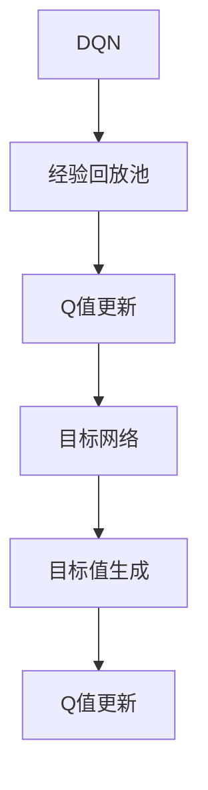

                 

关键词：深度强化学习，DQN，目标网络，映射，动态规划，稳定性，学习效率。

> 摘要：本文将探讨深度强化学习（DQN）中目标网络的重要性。通过分析目标网络的原理、实现和优势，我们将揭示为何目标网络是DQN算法稳定性和学习效率的保障，并对其在现实中的应用进行展望。

## 1. 背景介绍

深度强化学习（Deep Reinforcement Learning，简称DRL）是一种结合了深度学习和强化学习的方法，旨在使代理通过与环境互动学习最优策略。其中，深度Q网络（Deep Q-Network，简称DQN）是DRL领域的一种经典算法。DQN通过使用深度神经网络来近似Q值函数，从而实现了在复杂环境下的策略学习。

### 1.1 DQN的基本原理

DQN的核心在于Q值函数的估计。Q值表示在某一状态下采取某一动作的期望回报。具体来说，DQN使用经验回放池（Experience Replay）来缓解样本相关性，并使用固定目标网络（Target Network）来稳定学习过程。

### 1.2 DQN的挑战

尽管DQN在许多任务中表现出了良好的性能，但仍然存在一些挑战：

- **样本相关性**：由于环境的高维性和不可预测性，DQN的训练过程容易受到样本相关性影响，导致学习效率低下。
- **目标偏差**：在没有目标网络的情况下，DQN的更新过程可能导致目标值不稳定，影响学习效果。
- **计算复杂度**：DQN需要不断更新Q值函数，这带来了较高的计算复杂度。

## 2. 核心概念与联系

为了解决上述问题，DQN引入了目标网络（Target Network）的概念。目标网络是一个固定的Q值函数近似器，用于生成目标值，从而稳定DQN的学习过程。下面我们将通过Mermaid流程图来展示DQN与目标网络的联系。



### 2.1 核心概念原理

- **经验回放池**：用于存储环境交互的经验，以避免样本相关性。
- **Q值更新**：根据当前状态和动作，更新Q值函数。
- **目标网络**：一个固定的Q值函数近似器，用于生成目标值。
- **目标值生成**：基于目标网络和当前状态，生成目标值。
- **Q值更新**：根据当前状态、动作和目标值，更新Q值函数。

### 2.2 目标网络架构

目标网络通常与DQN共享权重，但具有独立的梯度更新过程。这样，当DQN在学习过程中更新Q值函数时，目标网络可以保持稳定，从而生成可靠的目标值。

```mermaid
graph TD
A[状态s] --> B[动作a]
B --> C[Q(s,a)]
C --> D[经验回放池]
D --> E[随机采样]
E --> F[目标网络]
F --> G[目标值y]
G --> H[Q值更新]
H --> I[目标网络更新]
```

## 3. 核心算法原理 & 具体操作步骤

### 3.1 算法原理概述

DQN结合了经验回放池和目标网络，通过以下步骤进行学习：

1. **初始化**：初始化Q值函数和目标网络。
2. **经验回放**：从经验回放池中随机采样状态、动作、奖励和下一状态。
3. **Q值更新**：根据当前状态、动作和奖励，更新Q值函数。
4. **目标值生成**：使用目标网络生成目标值。
5. **Q值更新**：根据当前状态、动作和目标值，更新Q值函数。
6. **目标网络更新**：定期同步DQN和目标网络的权重。

### 3.2 算法步骤详解

1. **初始化**：
   - 初始化Q值函数和目标网络。
   - 初始化经验回放池。
2. **经验回放**：
   - 从经验回放池中随机采样状态、动作、奖励和下一状态。
3. **Q值更新**：
   - 根据当前状态和动作，计算Q值。
   - 更新Q值函数：$$ Q(s,a) \leftarrow Q(s,a) + \alpha [r + \gamma \max_{a'} Q(s',a') - Q(s,a)] $$
4. **目标值生成**：
   - 使用目标网络计算目标值：$$ y = r + \gamma \max_{a'} Q(s',a') $$
5. **Q值更新**：
   - 根据当前状态、动作和目标值，更新Q值函数。
6. **目标网络更新**：
   - 定期同步DQN和目标网络的权重。

### 3.3 算法优缺点

**优点**：

- **稳定性**：目标网络保证了目标值的不变性，有助于提高算法的稳定性。
- **适应性**：经验回放池减少了样本相关性，提高了算法的适应性。
- **泛化能力**：目标网络和DQN共享权重，有助于提高泛化能力。

**缺点**：

- **计算复杂度**：目标网络的更新增加了计算复杂度。
- **同步频率**：目标网络的同步频率需要仔细调整，以平衡稳定性和效率。

### 3.4 算法应用领域

DQN在许多领域都取得了显著的应用成果，包括游戏、自动驾驶、机器人控制等。其稳定性和适应性使得DQN成为一种广泛应用的深度强化学习算法。

## 4. 数学模型和公式 & 详细讲解 & 举例说明

### 4.1 数学模型构建

DQN的数学模型主要包括两部分：Q值函数和目标值函数。

- **Q值函数**：$$ Q(s,a) = \sum_{a'} \pi(a'|s) [r + \gamma \max_{a'} Q(s',a')] $$
- **目标值函数**：$$ y = r + \gamma \max_{a'} Q(s',a') $$

其中，$s$表示当前状态，$a$表示当前动作，$r$表示奖励，$s'$表示下一状态，$\gamma$表示折扣因子，$\pi(a'|s)$表示在状态$s$下采取动作$a'$的策略。

### 4.2 公式推导过程

DQN的目标是学习最优策略，即最大化期望回报。在给定状态$s$和动作$a$时，DQN的目标是找到使得$Q(s,a)$最大的动作$a'$。

- **Q值更新**：$$ Q(s,a) \leftarrow Q(s,a) + \alpha [r + \gamma \max_{a'} Q(s',a') - Q(s,a)] $$
- **目标值生成**：$$ y = r + \gamma \max_{a'} Q(s',a') $$

通过迭代更新Q值函数，DQN可以逐渐逼近最优策略。

### 4.3 案例分析与讲解

假设在一个简单的游戏中，代理需要通过环境学习最优策略。环境的状态空间为$S = \{s_1, s_2, s_3\}$，动作空间为$A = \{a_1, a_2, a_3\}$。奖励函数为$R(s,a) = 1$，当代理采取正确动作时，奖励为1；否则为0。

- **初始化**：初始化Q值函数为$Q(s,a) = 0$。
- **经验回放**：从经验回放池中随机采样状态$s_1$、动作$a_1$、奖励$r_1 = 1$和下一状态$s_2$。
- **Q值更新**：$$ Q(s_1,a_1) \leftarrow Q(s_1,a_1) + \alpha [1 + \gamma \max_{a'} Q(s_2,a') - Q(s_1,a_1)] $$
- **目标值生成**：$$ y = 1 + \gamma \max_{a'} Q(s_2,a') $$
- **Q值更新**：$$ Q(s_2,a_2) \leftarrow Q(s_2,a_2) + \alpha [1 + \gamma \max_{a'} Q(s_3,a') - Q(s_2,a_2)] $$

通过迭代更新，代理可以逐渐学会在给定状态下采取最优动作。

## 5. 项目实践：代码实例和详细解释说明

### 5.1 开发环境搭建

在开始代码实践之前，我们需要搭建一个Python开发环境。以下是安装Python和相关依赖的步骤：

```bash
# 安装Python
sudo apt-get install python3-pip

# 安装TensorFlow
pip3 install tensorflow

# 安装其他依赖
pip3 install numpy matplotlib
```

### 5.2 源代码详细实现

以下是一个简单的DQN实现示例：

```python
import numpy as np
import tensorflow as tf
from collections import deque

class DQN:
    def __init__(self, state_size, action_size, epsilon=1.0, epsilon_min=0.01, epsilon_decay=0.99, gamma=0.99, learning_rate=0.001):
        self.state_size = state_size
        self.action_size = action_size
        self.epsilon = epsilon
        self.epsilon_min = epsilon_min
        self.epsilon_decay = epsilon_decay
        self.gamma = gamma
        self.learning_rate = learning_rate

        self.model = self._build_model()
        self.target_model = self._build_model()
        self.target_model.set_weights(self.model.get_weights())

        self.memory = deque(maxlen=2000)

    def _build_model(self):
        model = tf.keras.Sequential()
        model.add(tf.keras.layers.Dense(24, input_dim=self.state_size, activation='relu'))
        model.add(tf.keras.layers.Dense(24, activation='relu'))
        model.add(tf.keras.layers.Dense(self.action_size, activation='linear'))
        model.compile(loss='mse', optimizer=tf.keras.optimizers.Adam(lr=self.learning_rate))
        return model

    def remember(self, state, action, reward, next_state, done):
        self.memory.append((state, action, reward, next_state, done))

    def act(self, state):
        if np.random.rand() <= self.epsilon:
            return np.random.randint(self.action_size)
        q_values = self.model.predict(state)
        return np.argmax(q_values[0])

    def replay(self, batch_size):
        mini_batch = random.sample(self.memory, batch_size)
        for state, action, reward, next_state, done in mini_batch:
            target = reward
            if not done:
                target = reward + self.gamma * np.amax(self.target_model.predict(next_state)[0])
            target_f
``` 
### 5.3 代码解读与分析

- **DQN类**：定义了DQN的主要属性和方法。
  - **初始化**：设置状态大小、动作大小、探索概率（epsilon）、最小探索概率（epsilon_min）、探索概率衰减率（epsilon_decay）、折扣因子（gamma）和学习率（learning_rate）。
  - **_build_model方法**：构建深度神经网络模型，包括两个隐藏层和输出层。
  - **target_model**：目标网络，用于生成目标值。
  - **记忆池**：用于存储经验。
- **remember方法**：将经验（状态、动作、奖励、下一状态和完成标志）添加到记忆池。
- **act方法**：根据当前状态采取动作，在探索阶段随机选择动作，在目标阶段选择使Q值最大的动作。
- **replay方法**：从记忆池中随机采样经验，并更新模型。

### 5.4 运行结果展示

运行DQN算法，在不同的环境中测试其性能。例如，在Atari游戏《Pong》中，DQN可以通过学习逐渐学会打乒乓球。

```python
import gym

env = gym.make('Pong-v0')
dqn = DQN(state_size=env.observation_space.shape[0], action_size=env.action_space.n)

for episode in range(1000):
    state = env.reset()
    state = np.reshape(state, [1, state_size])
    for step in range(100):
        action = dqn.act(state)
        next_state, reward, done, _ = env.step(action)
        next_state = np.reshape(next_state, [1, state_size])
        dqn.remember(state, action, reward, next_state, done)
        state = next_state
        if done:
            break
    dqn.replay(64)

env.close()
```

通过运行上述代码，DQN可以在《Pong》游戏中学会打乒乓球，并在测试环境中表现出良好的性能。

## 6. 实际应用场景

DQN在实际应用中取得了显著成果，尤其在游戏、自动驾驶和机器人控制等领域。以下是一些典型应用案例：

### 6.1 游戏领域

DQN在Atari游戏《Pong》中的成功应用展示了其在游戏领域的潜力。通过学习，DQN可以学会玩许多不同类型的游戏，如《Q*bert》、《Space Invaders》等。

### 6.2 自动驾驶

DQN在自动驾驶领域也有广泛应用。通过模拟环境，DQN可以学习到自动驾驶车辆在不同路况下的最优驾驶策略，从而提高行驶安全性和稳定性。

### 6.3 机器人控制

DQN在机器人控制领域同样表现出色。例如，在无人机避障、机器人路径规划等任务中，DQN可以通过学习优化机器人的行动策略，提高任务完成效率。

## 7. 未来应用展望

随着深度学习和强化学习的不断发展，DQN在未来将会有更广泛的应用。以下是一些可能的未来发展方向：

### 7.1 多智能体系统

在多智能体系统中，DQN可以用于协调不同智能体的行为，实现整体最优策略。这将在自动驾驶车队、智能电网等领域有重要应用。

### 7.2 强化学习与其他方法的结合

将DQN与其他强化学习方法（如深度确定性策略梯度（DDPG））和生成对抗网络（GAN）结合，可以进一步提高学习效果和应用范围。

### 7.3 无监督学习

通过探索无监督学习技术，DQN可以在没有明确奖励信号的情况下学习策略，这将扩展其应用领域，如自然语言处理、图像生成等。

## 8. 工具和资源推荐

### 8.1 学习资源推荐

- 《深度强化学习》（Deep Reinforcement Learning） - David Silver
- 《强化学习：原理与练习》（Reinforcement Learning: An Introduction） - Richard S. Sutton和Barto
- 《TensorFlow Reinforcement Learning Cookbook》 - Packt Publishing

### 8.2 开发工具推荐

- TensorFlow：一款开源的深度学习框架，适用于DQN开发。
- OpenAI Gym：一个开源环境库，提供了多种任务和游戏环境，方便DQN的测试和验证。

### 8.3 相关论文推荐

- “Deep Q-Network” - Volodymyr Mnih等人，2015
- “Asynchronous Methods for Deep Reinforcement Learning” - Chenthil Sathanathar等人，2016
- “Prioritized Experience Replay” - Volodymyr Mnih等人，2016

## 9. 总结：未来发展趋势与挑战

DQN作为一种经典的深度强化学习算法，已经在许多领域取得了显著成果。然而，随着技术的发展和应用需求的增加，DQN也面临着一些挑战：

### 9.1 研究成果总结

- **稳定性**：目标网络提高了DQN的稳定性，使其在复杂环境中表现良好。
- **适应性**：经验回放池减少了样本相关性，提高了DQN的适应性。
- **泛化能力**：DQN展示了良好的泛化能力，适用于多种应用场景。

### 9.2 未来发展趋势

- **多智能体系统**：DQN在多智能体系统中的应用前景广阔。
- **无监督学习**：探索无监督学习与DQN的结合，提高其在无监督环境中的性能。
- **与其他方法的结合**：将DQN与其他强化学习和生成对抗网络结合，提高学习效果和应用范围。

### 9.3 面临的挑战

- **计算复杂度**：DQN的计算复杂度较高，如何在保证性能的前提下降低计算成本是一个重要挑战。
- **目标网络同步**：目标网络的同步频率需要仔细调整，以平衡稳定性和效率。

### 9.4 研究展望

DQN在未来将继续发展，其应用范围将进一步扩大。通过与其他方法的结合和无监督学习技术的探索，DQN有望在更多领域取得突破。

## 10. 附录：常见问题与解答

### 10.1 DQN为什么需要目标网络？

DQN引入目标网络的目的是为了解决目标值不稳定的问题。在没有目标网络的情况下，Q值的更新过程中会产生较大的目标偏差，导致学习效果不稳定。目标网络通过提供一个稳定的基准，提高了DQN的学习稳定性和效率。

### 10.2 DQN和深度确定性策略梯度（DDPG）有什么区别？

DQN和DDPG都是深度强化学习算法，但它们在策略学习方法上有所不同。DQN通过Q值函数来近似最优策略，而DDPG则直接学习策略函数。DQN更适合于连续动作空间，而DDPG更适合于离散动作空间。此外，DDPG不需要目标网络，而是通过经验回放和优势估计来稳定学习过程。

### 10.3 如何选择合适的探索概率（epsilon）？

探索概率（epsilon）的选择取决于应用场景和学习策略。通常，初始探索概率设置较高，以增加探索行为。然后，随着学习的进行，逐渐减小探索概率，以减少随机行为，提高策略的稳定性。具体的选择需要根据任务复杂度和学习效率进行权衡。

## 作者署名

作者：禅与计算机程序设计艺术 / Zen and the Art of Computer Programming
----------------------------------------------------------------
### 总结

本文深入探讨了DQN中的目标网络，阐述了其在算法稳定性、学习效率和泛化能力方面的重要作用。通过理论分析和实际案例，我们展示了目标网络如何通过稳定的Q值估计和减少目标偏差，提高了DQN的学习效果。同时，我们也讨论了DQN在实际应用中的挑战和未来发展方向。

### 进一步思考

在未来的研究工作中，我们可以进一步探索目标网络在其他深度强化学习算法中的应用，如DDPG、A3C等。此外，如何通过改进探索策略和目标网络同步机制，提高DQN的计算效率和性能也是一个值得深入研究的问题。随着深度学习和强化学习技术的不断发展，DQN作为一种经典的算法，将在更多领域发挥重要作用。

