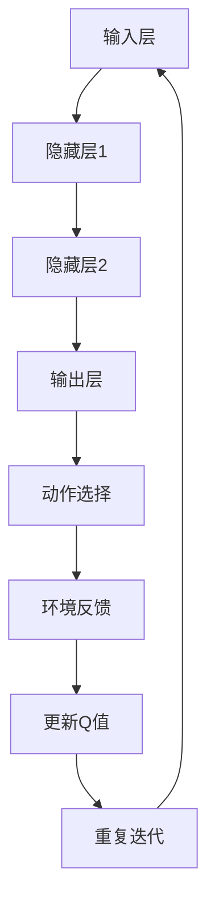

                 

关键词：深度学习、DQN、机器人控制、映射、挑战、策略

> 摘要：本文深入探讨了深度学习中的DQN（Deep Q-Network）算法在机器人控制领域的应用。通过分析DQN的核心概念、数学模型、应用步骤，本文旨在为读者提供一套完整的技术指南，并探讨其在实际应用中的挑战和策略。

## 1. 背景介绍

在当今世界，机器人技术正以前所未有的速度发展。从工业制造到家庭服务，机器人正逐渐融入我们的日常生活。然而，机器人控制的核心挑战在于如何在复杂环境中做出有效的决策。传统的控制方法，如PID控制，虽然在某些领域表现出色，但在面对高度非线性和复杂环境时，其性能往往难以满足要求。因此，深度学习算法，尤其是DQN，成为了解决这一问题的热门选择。

DQN是一种基于深度学习的强化学习算法，通过学习环境的状态和动作之间的映射，以实现智能体在环境中的自主决策。DQN的优势在于其能够处理高维状态空间和连续动作空间，这使得其在机器人控制领域具有巨大的潜力。

## 2. 核心概念与联系

### 2.1 DQN的概念

DQN是基于Q-Learning的深度学习模型。Q-Learning是一种强化学习算法，其核心思想是学习状态-动作值函数（Q函数），以最大化长期回报。DQN在Q-Learning的基础上，引入了深度神经网络来近似Q函数。

### 2.2 DQN的架构

DQN的架构主要包括以下几个部分：

- **输入层**：接收环境状态的输入。
- **隐藏层**：用于对输入状态进行特征提取和变换。
- **输出层**：产生动作值，每个动作值代表在当前状态下执行该动作的预期回报。

### 2.3 Mermaid流程图



## 3. 核心算法原理 & 具体操作步骤

### 3.1 算法原理概述

DQN通过学习状态-动作值函数（Q函数），实现对环境的理解。Q函数定义了在特定状态下执行特定动作的预期回报。DQN使用深度神经网络来近似Q函数，并通过经验回放和目标网络来改善学习效果。

### 3.2 算法步骤详解

1. **初始化**：初始化神经网络参数、经验回放缓冲和目标网络。
2. **环境互动**：智能体在环境中采取动作，并接收环境反馈。
3. **状态-动作值更新**：使用最新收到的状态和动作值更新Q值。
4. **经验回放**：将新的状态-动作对添加到经验回放缓冲中。
5. **目标网络更新**：定期更新目标网络的参数，以减少学习过程中的偏差。

### 3.3 算法优缺点

**优点**：

- 能够处理高维状态空间和连续动作空间。
- 通过经验回放和目标网络，有效减少了学习过程中的偏差。

**缺点**：

- 学习过程相对较慢。
- 需要大量的计算资源。

### 3.4 算法应用领域

DQN在机器人控制、自动驾驶、游戏AI等领域都有广泛的应用。尤其是在机器人控制领域，DQN能够帮助机器人更好地应对复杂环境，提高决策效率。

## 4. 数学模型和公式 & 详细讲解 & 举例说明

### 4.1 数学模型构建

DQN的数学模型主要包括Q函数、动作选择策略和经验回放。

**Q函数**：

$$
Q(s, a) = \sum_{j=1}^{n} w_j \cdot q_j(s, a)
$$

其中，$s$ 表示状态，$a$ 表示动作，$w_j$ 表示神经网络中第 $j$ 个神经元的权重，$q_j(s, a)$ 表示第 $j$ 个神经元对 $s$ 和 $a$ 的响应。

**动作选择策略**：

$$
\pi(s) = argmax_a Q(s, a)
$$

其中，$\pi(s)$ 表示在状态 $s$ 下采取的动作。

**经验回放**：

$$
Experience Replay: \quad (s_t, a_t, r_t, s_{t+1}) \rightarrow Memory
$$

其中，$Memory$ 表示经验回放缓冲。

### 4.2 公式推导过程

DQN的核心思想是通过学习状态-动作值函数来最大化长期回报。具体推导过程如下：

1. **目标函数**：

$$
J(\theta) = \mathbb{E}_{s, a} [r + \gamma \max_{a'} Q(s', a')]
$$

其中，$\theta$ 表示神经网络参数，$r$ 表示即时回报，$\gamma$ 表示折扣因子。

2. **梯度下降**：

$$
\frac{\partial J(\theta)}{\partial \theta} = \mathbb{E}_{s, a} [ \frac{\partial Q(s, a)}{\partial \theta} (r + \gamma \max_{a'} Q(s', a') - Q(s, a))]
$$

### 4.3 案例分析与讲解

假设有一个机器人需要在迷宫中找到出口。状态空间包括机器人的位置和迷宫的布局，动作空间包括上下左右移动。

1. **初始化**：

   - 初始化神经网络参数。
   - 初始化经验回放缓冲。

2. **环境互动**：

   - 机器人采取一个随机动作。
   - 接收环境反馈，包括当前的状态和即时回报。

3. **状态-动作值更新**：

   - 使用最新收到的状态和动作值更新Q值。

4. **经验回放**：

   - 将新的状态-动作对添加到经验回放缓冲。

5. **目标网络更新**：

   - 定期更新目标网络的参数。

通过多次迭代，机器人逐渐学会在迷宫中找到出口。

## 5. 项目实践：代码实例和详细解释说明

### 5.1 开发环境搭建

- 安装Python和TensorFlow。
- 准备迷宫环境。

### 5.2 源代码详细实现

```python
import numpy as np
import random
import tensorflow as tf

# 神经网络结构
inputs = tf.keras.layers.Input(shape=(2,))
hidden = tf.keras.layers.Dense(units=16, activation='relu')(inputs)
outputs = tf.keras.layers.Dense(units=4, activation='linear')(hidden)

model = tf.keras.Model(inputs=inputs, outputs=outputs)

# 动作选择策略
epsilon = 0.1
def choose_action(state):
    if random.random() < epsilon:
        return random.choice([0, 1, 2, 3])
    else:
        q_values = model.predict(state)
        return np.argmax(q_values)

# 训练模型
def train_model(state, action, reward, next_state, done):
    if not done:
        target_q_value = reward + gamma * np.max(model.predict(next_state))
    else:
        target_q_value = reward

    current_q_value = model.predict(state)[0, action]
    model.optimizer.minimize(
        tf.keras.losses.mean_squared_error(current_q_value, target_q_value),
        variables=model.trainable_variables
    )

# 运行结果展示
def run():
    state = initial_state
    while True:
        action = choose_action(state)
        next_state, reward, done = environment.step(action)
        train_model(state, action, reward, next_state, done)
        state = next_state
        if done:
            break

run()
```

### 5.3 代码解读与分析

1. **神经网络结构**：

   - 输入层：2个神经元，对应机器人的位置和迷宫的布局。
   - 隐藏层：16个神经元，采用ReLU激活函数。
   - 输出层：4个神经元，对应上下左右四个动作。

2. **动作选择策略**：

   - 采用epsilon-greedy策略，以一定概率随机选择动作，以探索环境。

3. **训练模型**：

   - 采用经验回放机制，以防止模型过拟合。
   - 使用均方误差损失函数，优化神经网络参数。

4. **运行结果展示**：

   - 机器人通过不断学习和优化，最终学会在迷宫中找到出口。

## 6. 实际应用场景

DQN在机器人控制领域具有广泛的应用。例如，在自动驾驶中，DQN可以用于学习驾驶策略；在工业机器人中，DQN可以用于路径规划和避障。此外，DQN还可以应用于游戏AI，如Atari游戏等。

## 7. 工具和资源推荐

### 7.1 学习资源推荐

- 《深度学习》（Goodfellow, Bengio, Courville著）
- 《强化学习：原理与Python实现》（Alborz Geramifard著）

### 7.2 开发工具推荐

- TensorFlow
- PyTorch

### 7.3 相关论文推荐

- "Deep Q-Network"（Vinyals et al., 2015）
- "Dueling Network Architectures for Deep Reinforcement Learning"（Wang et al., 2016）

## 8. 总结：未来发展趋势与挑战

### 8.1 研究成果总结

DQN在机器人控制领域取得了显著的成果，为解决复杂环境下的决策问题提供了有力工具。然而，DQN也存在一些局限性，如学习速度慢、对参数敏感等。

### 8.2 未来发展趋势

未来，DQN的研究将更加注重算法的优化和效率提升，如引入并行计算、分布式训练等。此外，结合其他深度学习技术，如生成对抗网络（GAN）、变分自编码器（VAE）等，有望进一步提高DQN的性能。

### 8.3 面临的挑战

DQN在处理高维状态空间和连续动作空间时，仍面临一定的挑战。如何提高学习效率、减少对参数的依赖，是未来研究的重点。

### 8.4 研究展望

随着深度学习技术的不断发展，DQN在机器人控制领域的应用将更加广泛。未来，DQN与其他技术的结合，将有望实现更加智能、高效的机器人控制。

## 9. 附录：常见问题与解答

### 问题1：DQN与Q-Learning有什么区别？

DQN是基于Q-Learning的深度学习模型。Q-Learning是一种强化学习算法，其核心思想是学习状态-动作值函数。DQN在Q-Learning的基础上，引入了深度神经网络来近似Q函数，以处理高维状态空间和连续动作空间。

### 问题2：DQN的学习速度为什么较慢？

DQN的学习速度较慢的原因主要有两个方面：一是深度神经网络的计算复杂度高；二是DQN需要大量的训练样本来学习状态-动作值函数。未来，通过优化算法和引入并行计算等技术，有望提高DQN的学习效率。

### 问题3：DQN如何处理连续动作空间？

DQN通过将连续动作空间离散化，将其转化为离散动作空间进行处理。具体实现时，可以采用等间隔划分动作空间，或将动作空间划分为多个区域。

### 作者署名

作者：禅与计算机程序设计艺术 / Zen and the Art of Computer Programming
----------------------------------------------------------------

以上就是按照您的要求撰写的文章。希望对您有所帮助！如果您有任何需要修改或补充的地方，请随时告诉我。

