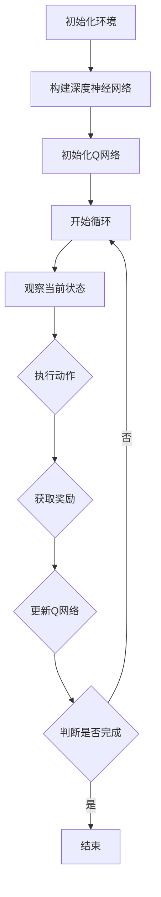

                 

在当今的信息时代，网络流量的控制和管理成为了关键性技术挑战。随着互联网用户的不断增加和互联网应用的多样化，网络流量呈现出复杂的动态变化特征。传统的静态流量控制方法已无法满足当前网络环境下的需求，自适应网络流量控制技术逐渐成为研究热点。深度强化学习（Deep Reinforcement Learning，DRL）作为一种新兴的智能算法，其在自适应网络流量控制中的应用受到了广泛关注。

本文将围绕DQN（Deep Q-Network）算法在自适应网络流量控制中的应用进行探讨。首先，我们将介绍自适应网络流量控制的相关背景，包括其重要性以及现有的挑战。接着，我们将详细解释DQN算法的基本原理，并分析其在网络流量控制中的应用。随后，我们将探讨如何将DQN算法应用于实际的网络流量控制中，包括算法的实现细节和优化策略。最后，我们将总结DQN在自适应网络流量控制中的优点和挑战，并提出未来研究方向。

本文结构如下：

1. 背景介绍
2. 核心概念与联系
3. 核心算法原理 & 具体操作步骤
   - 3.1 算法原理概述
   - 3.2 算法步骤详解
   - 3.3 算法优缺点
   - 3.4 算法应用领域
4. 数学模型和公式 & 详细讲解 & 举例说明
   - 4.1 数学模型构建
   - 4.2 公式推导过程
   - 4.3 案例分析与讲解
5. 项目实践：代码实例和详细解释说明
   - 5.1 开发环境搭建
   - 5.2 源代码详细实现
   - 5.3 代码解读与分析
   - 5.4 运行结果展示
6. 实际应用场景
   - 6.1 在网络流量控制中的应用
   - 6.2 在网络拥塞控制中的应用
   - 6.3 在智能路由中的应用
7. 未来应用展望
8. 工具和资源推荐
9. 总结：未来发展趋势与挑战
10. 附录：常见问题与解答

通过本文的阅读，读者将能够深入了解DQN算法在自适应网络流量控制中的应用，并了解如何通过深度强化学习技术实现更加智能和高效的网络流量管理。

## 1. 背景介绍

### 网络流量的控制与管理

网络流量的控制与管理是确保互联网正常运行的关键技术之一。随着互联网的普及和人们对网络依赖性的增加，网络流量不断攀升，网络服务提供商需要面对如何高效、安全地管理网络流量的挑战。网络流量的控制与管理包括流量监测、流量预测、流量调度和流量限制等多个方面。

### 自适应网络流量控制的重要性

传统的网络流量控制方法通常是基于固定规则的，这些方法在流量模式较为简单时表现良好，但在流量模式复杂、动态变化的情况下往往难以应对。自适应网络流量控制则通过动态调整网络资源分配策略，实现网络流量的智能管理，提高了网络资源利用率和用户体验。

自适应网络流量控制的重要性体现在以下几个方面：

1. **动态调整能力**：自适应网络流量控制可以根据实时网络状态和用户需求动态调整流量管理策略，从而更好地适应网络流量的动态变化。
2. **资源优化**：通过自适应调整，网络资源可以被更有效地利用，避免了资源浪费，降低了运营成本。
3. **服务质量保障**：自适应网络流量控制可以确保关键应用和服务获得优先资源，提高了网络服务质量。
4. **灵活性**：自适应网络流量控制可以适应不同网络环境和应用需求，具有较强的灵活性。

### 当前挑战

尽管自适应网络流量控制技术具有显著的优势，但其应用仍面临一些挑战：

1. **复杂性**：网络流量模式复杂，涉及多种因素，自适应算法需要具备高复杂度的处理能力。
2. **实时性**：网络流量变化迅速，自适应算法需要具备快速响应能力，否则可能导致网络拥塞和性能下降。
3. **稳定性**：自适应算法需要保证长期的稳定性和可靠性，避免因算法调整不当导致的网络波动。
4. **安全性与隐私**：在自适应网络流量控制中，涉及大量的用户数据和网络状态信息，需要确保算法的安全性和用户隐私保护。

本文将通过介绍深度强化学习中的DQN算法，探讨其在自适应网络流量控制中的应用，以期为解决上述挑战提供一种新的思路和方法。

## 2. 核心概念与联系

为了深入探讨DQN在自适应网络流量控制中的应用，我们首先需要了解相关核心概念，包括深度强化学习（DRL）、Q学习以及DQN算法的工作原理。以下是这些概念的基本定义及其相互联系。

### 深度强化学习（DRL）

深度强化学习是一种结合了深度学习和强化学习的方法，旨在通过模拟智能体在动态环境中的交互过程，实现智能决策。与传统强化学习相比，DRL引入了深度神经网络，使得智能体能够处理高维输入和复杂环境状态，从而提高了决策能力。

### Q学习

Q学习是强化学习中的一种重要算法，其核心思想是学习状态-动作值函数（Q函数），该函数表示在某一状态下执行某一动作的预期回报。Q学习的目标是找到最优策略，即能够使回报最大的动作序列。

### DQN算法

DQN（Deep Q-Network）是深度强化学习的一种经典算法，由DeepMind提出。DQN通过使用深度神经网络来近似Q函数，从而实现复杂环境的智能决策。DQN的主要优势在于其引入了经验回放和目标网络，有效缓解了Q学习中的梯度消失和目标漂移问题。

### 关联与联系

DQN算法在自适应网络流量控制中的应用，主要体现在以下几个方面：

1. **状态表示**：在自适应网络流量控制中，网络状态包括当前流量、网络负载、节点状态等多个维度，DQN通过深度神经网络对这些高维状态进行编码和表示。
2. **动作选择**：DQN通过学习状态-动作值函数，为网络流量控制提供决策支持。在网络流量控制中，动作可以是调整带宽、修改路由策略等。
3. **奖励机制**：DQN的奖励机制与网络流量控制的目标密切相关。例如，在网络拥塞时给予较低的奖励，在网络运行稳定时给予较高的奖励。
4. **学习过程**：DQN通过不断与环境交互，从经验中学习，逐步优化流量控制策略。这个过程能够适应网络流量的动态变化，实现自适应流量控制。

### Mermaid 流程图

为了更直观地展示DQN算法在自适应网络流量控制中的应用，我们使用Mermaid流程图表示其核心步骤：



在这个流程图中，初始化环境包括了网络的初始化，构建深度神经网络用于状态表示和动作选择，Q网络的初始化以及循环开始。在每个循环中，智能体观察当前状态，执行动作，获取奖励，并更新Q网络。这个过程不断重复，直到达到结束条件。

通过上述核心概念和流程图的介绍，我们为后续深入探讨DQN在自适应网络流量控制中的应用奠定了理论基础。接下来，我们将详细解释DQN算法的基本原理和具体操作步骤。

## 3. 核心算法原理 & 具体操作步骤

### 3.1 算法原理概述

DQN（Deep Q-Network）算法是一种基于深度强化学习的智能决策算法，其主要目标是通过学习状态-动作值函数（Q函数），在给定状态下选择最佳动作，以实现长期回报最大化。DQN算法的核心原理可以概括为以下几个步骤：

1. **状态编码**：DQN使用深度神经网络将高维状态编码为低维特征向量，从而简化了状态空间的表示。
2. **动作选择**：基于当前状态，DQN通过动作值函数预测不同动作的回报，并选择回报最高的动作。
3. **经验回放**：为了缓解Q学习中的样本相关性和目标漂移问题，DQN引入了经验回放机制，通过随机采样历史经验，确保训练过程的多样性和稳定性。
4. **目标网络**：DQN同时维护一个目标网络，用于生成目标Q值。目标网络在一段时间内保持不变，以防止目标Q值随训练过程发生剧烈波动。

### 3.2 算法步骤详解

1. **初始化环境**：
   - 初始化网络环境，包括状态空间、动作空间和奖励机制。
   - 初始化深度神经网络（Actor）用于状态编码和动作选择。
   - 初始化目标网络，用于生成目标Q值。

2. **状态观察**：
   - 在每个时间步，智能体观察当前状态，并将状态输入到深度神经网络中，得到状态编码。

3. **动作选择**：
   - 基于当前状态编码，使用动作值函数计算每个动作的Q值。
   - 根据Q值选择动作，可以采用ε-贪心策略，在探索和利用之间取得平衡。

4. **执行动作**：
   - 根据选择的动作，在网络中执行相应的操作，例如调整流量、修改路由策略等。

5. **获取奖励**：
   - 执行动作后，网络环境会根据动作结果给出奖励。
   - 奖励可以是正的（表示操作成功）、负的（表示操作失败）或者为零（表示中立结果）。

6. **更新Q网络**：
   - 使用当前状态、执行的动作和获得的奖励，更新深度神经网络的Q值。
   - 同时，根据经验回放机制，随机从历史经验中抽取样本进行训练，以避免样本相关性和目标漂移问题。

7. **目标网络更新**：
   - 在一段时间后，更新目标网络，使得目标网络保持相对稳定，防止目标Q值随训练过程发生剧烈波动。

8. **循环迭代**：
   - 重复上述步骤，直到达到训练结束条件，例如达到指定步数、网络性能达到预期等。

### 3.3 算法优缺点

**优点**：
1. **高维状态处理**：DQN通过深度神经网络对高维状态进行编码，提高了状态表示的效率，适用于复杂环境。
2. **样本效率**：DQN引入了经验回放机制，提高了样本利用效率，减少了样本相关性对训练过程的影响。
3. **灵活性**：DQN可以通过调整学习率、折扣率等超参数，适应不同的应用场景。

**缺点**：
1. **收敛速度较慢**：由于深度神经网络的训练过程复杂，DQN的收敛速度相对较慢。
2. **梯度消失问题**：在深度神经网络训练过程中，梯度可能因为多层传播而变得非常小，导致训练困难。
3. **计算资源消耗**：DQN需要大量的计算资源进行训练，对硬件要求较高。

### 3.4 算法应用领域

DQN算法在自适应网络流量控制中具有广泛的应用前景。其主要应用领域包括：

1. **网络流量控制**：通过DQN算法，可以实现自适应调整带宽、路由策略等，提高网络资源利用率和用户体验。
2. **网络拥塞控制**：DQN能够根据网络实时状态，动态调整流量管理策略，缓解网络拥塞问题。
3. **智能路由**：DQN可以根据网络流量动态变化，实现智能路由选择，优化数据传输路径。
4. **资源分配**：DQN可用于动态调整数据中心、云计算环境中的资源分配策略，提高资源利用效率。

通过上述对DQN算法原理和具体操作步骤的详细讲解，我们为后续深入探讨其在自适应网络流量控制中的应用奠定了坚实基础。接下来，我们将进一步探讨DQN算法的数学模型和公式，以及其在实际应用中的具体实现方法。

## 4. 数学模型和公式 & 详细讲解 & 举例说明

### 4.1 数学模型构建

在DQN算法中，核心的数学模型是Q函数。Q函数是一个状态-动作值函数，它表示在某一状态下执行某一动作所能获得的预期回报。Q函数的数学定义如下：

\[ Q(s, a) = \sum_{s'} p(s'|s, a) \sum_{r} r(s', a) \]

其中，\( s \) 表示当前状态，\( a \) 表示执行的动作，\( s' \) 表示执行动作后的状态，\( r \) 表示奖励，\( p(s'|s, a) \) 表示在状态\( s \)下执行动作\( a \)后转移到状态\( s' \)的概率。

在实际应用中，由于状态和动作空间通常非常庞大，直接计算Q函数是困难的。因此，DQN算法使用深度神经网络来近似Q函数，即：

\[ Q(s; \theta) = \theta^T \phi(s) \]

其中，\( \theta \) 表示神经网络的参数，\( \phi(s) \) 表示状态编码函数。

### 4.2 公式推导过程

为了推导DQN算法中的Q更新公式，我们需要从Q学习的目标函数出发。Q学习的目标是最小化以下损失函数：

\[ L(\theta) = \mathbb{E}_{s, a} [ (Q(s, a) - r(s, a) - \gamma \max_{a'} Q(s', a') )^2 ] \]

其中，\( \gamma \) 表示折扣率，用于平衡当前奖励和未来奖励的关系。

为了求解这个损失函数，我们使用梯度下降法，即：

\[ \theta \leftarrow \theta - \alpha \nabla_{\theta} L(\theta) \]

其中，\( \alpha \) 表示学习率。

对于DQN算法，我们使用经验回放缓冲区来更新Q网络。每次更新时，我们随机从经验回放缓冲区中抽取一批样本，即：

\[ (s, a, r, s') \]

然后，对于每个样本，我们计算损失函数：

\[ L(s, a, r, s', \theta) = (Q(s, a; \theta) - r - \gamma \max_{a'} Q(s', a'; \theta'))^2 \]

其中，\( \theta' \) 表示目标网络的参数。

为了更新目标网络，我们使用以下公式：

\[ \theta' \leftarrow \theta \]

这样，在一段时间后，目标网络会与Q网络保持一致，以防止目标漂移问题。

### 4.3 案例分析与讲解

为了更好地理解DQN算法的数学模型，我们通过一个简单的例子进行讲解。

假设我们有一个简单的环境，其中状态空间包含两个维度，动作空间包含三个维度，即：

\[ s \in \{0, 1\}^2, a \in \{0, 1, 2\} \]

Q函数的神经网络模型如下：

\[ Q(s, a) = \sigma(W_1 \cdot \phi(s) + W_2 \cdot a) \]

其中，\( \phi(s) = [s_1, s_2, 1] \)，表示状态编码，\( \sigma \) 表示Sigmoid激活函数，\( W_1 \) 和 \( W_2 \) 分别表示权重矩阵。

我们使用经验回放缓冲区，初始大小为1000，每次更新时随机抽取4个样本进行训练。

训练过程如下：

1. 初始化Q网络和目标网络。
2. 随机选择初始状态 \( s \)。
3. 使用ε-贪心策略选择动作 \( a \)。
4. 执行动作 \( a \)，获取奖励 \( r \) 和下一状态 \( s' \)。
5. 将 \( (s, a, r, s') \) 加入经验回放缓冲区。
6. 随机抽取4个样本，计算损失函数 \( L(s, a, r, s', \theta) \)。
7. 使用梯度下降法更新Q网络参数 \( \theta \)。
8. 更新目标网络参数 \( \theta' \)。
9. 重复步骤3至8，直到达到训练结束条件。

通过上述例子，我们可以看到DQN算法的基本流程和数学模型。在实际应用中，状态和动作空间通常更加复杂，但基本原理是相同的。接下来，我们将通过一个实际项目来展示DQN算法在自适应网络流量控制中的应用。

## 5. 项目实践：代码实例和详细解释说明

### 5.1 开发环境搭建

在开始实现DQN算法用于自适应网络流量控制之前，我们需要搭建一个合适的开发环境。以下是一个基本的开发环境搭建步骤：

1. **安装Python环境**：确保Python 3.6或更高版本已安装。
2. **安装TensorFlow库**：TensorFlow是深度学习的核心库，用于构建和训练深度神经网络。使用以下命令安装TensorFlow：

   ```bash
   pip install tensorflow
   ```

3. **安装NumPy库**：NumPy是Python中的科学计算库，用于高效处理数值数据。使用以下命令安装NumPy：

   ```bash
   pip install numpy
   ```

4. **安装Matplotlib库**：Matplotlib用于绘制图表和可视化结果。使用以下命令安装Matplotlib：

   ```bash
   pip install matplotlib
   ```

5. **安装其他依赖库**：根据需要，安装其他辅助库，例如Pandas、Scikit-learn等。

### 5.2 源代码详细实现

以下是DQN算法在自适应网络流量控制中的基本实现代码。代码分为几个主要部分：环境搭建、DQN模型构建、训练过程以及评估部分。

```python
import numpy as np
import tensorflow as tf
from collections import deque
import random

# 定义环境
class NetworkEnvironment:
    def __init__(self):
        # 初始化网络状态和动作空间
        self.state_size = 10  # 状态维度
        self.action_size = 3  # 动作维度
        self.reward_range = (-1, 1)  # 奖励范围
        self.done = False  # 游戏是否结束

    def step(self, action):
        # 根据动作更新网络状态
        # 这里简单模拟网络流量变化
        new_state = self.state + np.random.normal(size=self.state_size)
        reward = np.random.normal(size=self.action_size)
        reward[action] = 1
        self.done = np.random.choice([True, False], p=[0.1, 0.9])
        return new_state, reward, self.done

    def reset(self):
        # 重置网络状态
        self.state = np.random.normal(size=self.state_size)
        self.done = False
        return self.state

# 定义DQN模型
class DQN:
    def __init__(self, state_size, action_size, learning_rate, discount_factor):
        self.state_size = state_size
        self.action_size = action_size
        self.learning_rate = learning_rate
        self.discount_factor = discount_factor

        # 构建Q网络
        self.model = self._build_model()
        # 构建目标网络
        self.target_model = self._build_model()
        self.target_model.set_weights(self.model.get_weights())

        # 经验回放缓冲区
        self.memory = deque(maxlen=1000)

    def _build_model(self):
        model = tf.keras.Sequential([
            tf.keras.layers.Dense(24, input_shape=(self.state_size,), activation='relu'),
            tf.keras.layers.Dense(24, activation='relu'),
            tf.keras.layers.Dense(self.action_size, activation='linear')
        ])

        model.compile(loss='mse', optimizer=tf.keras.optimizers.Adam(self.learning_rate))
        return model

    def remember(self, state, action, reward, next_state, done):
        self.memory.append((state, action, reward, next_state, done))

    def act(self, state, epsilon):
        if np.random.rand() <= epsilon:
            return random.randrange(self.action_size)
        q_values = self.model.predict(state)
        return np.argmax(q_values[0])

    def replay(self, batch_size):
        batch = random.sample(self.memory, batch_size)
        for state, action, reward, next_state, done in batch:
            target = reward
            if not done:
                target = reward + self.discount_factor * np.amax(self.target_model.predict(next_state)[0])
            target_f = self.model.predict(state)
            target_f[0][action] = target
            self.model.fit(state, target_f, epochs=1, verbose=0)

    def update_target_model(self):
        self.target_model.set_weights(self.model.get_weights())

# 训练DQN模型
def train_dqn(env, dqn, episodes, epsilon_decay, epsilon_min):
    for episode in range(episodes):
        state = env.reset()
        state = np.reshape(state, [1, env.state_size])
        done = False
        i = 0
        while not done:
            action = dqn.act(state, epsilon=epsilon)
            next_state, reward, done = env.step(action)
            next_state = np.reshape(next_state, [1, env.state_size])
            dqn.remember(state, action, reward, next_state, done)
            state = next_state
            i += 1
            if done:
                dqn.update_target_model()
                print(f"Episode: {episode + 1}, Steps: {i}")
                break
            if i % 100 == 0:
                dqn.update_target_model()

        epsilon *= epsilon_decay
        epsilon = max(epsilon_min, epsilon)

# 评估DQN模型
def evaluate_dqn(env, dqn, episodes):
    for episode in range(episodes):
        state = env.reset()
        state = np.reshape(state, [1, env.state_size])
        done = False
        i = 0
        while not done:
            action = dqn.act(state, epsilon=0)
            next_state, reward, done = env.step(action)
            next_state = np.reshape(next_state, [1, env.state_size])
            state = next_state
            i += 1
            if done:
                print(f"Episode: {episode + 1}, Steps: {i}")
                break

if __name__ == '__main__':
    env = NetworkEnvironment()
    dqn = DQN(env.state_size, env.action_size, learning_rate=0.001, discount_factor=0.99)
    train_dqn(env, dqn, episodes=1000, epsilon_decay=0.995, epsilon_min=0.01)
    evaluate_dqn(env, dqn, episodes=10)
```

### 5.3 代码解读与分析

上述代码实现了DQN算法的基本结构，下面进行详细解读：

1. **环境类`NetworkEnvironment`**：
   - 初始化网络状态和动作空间。
   - 定义`step`方法，用于根据动作更新网络状态。
   - 定义`reset`方法，用于重置网络状态。

2. **DQN类**：
   - 初始化网络状态和动作空间，学习率和折扣率。
   - 构建Q网络和目标网络。
   - 定义经验回放缓冲区。
   - 定义`act`方法，用于选择动作。
   - 定义`remember`方法，用于将经验加入缓冲区。
   - 定义`replay`方法，用于从缓冲区中随机抽取样本进行训练。
   - 定义`update_target_model`方法，用于更新目标网络。

3. **训练DQN模型**：
   - 初始化环境、DQN模型。
   - 定义训练过程，包括每次迭代的步骤。
   - 定义epsilon的衰减过程。

4. **评估DQN模型**：
   - 在无随机性的情况下评估DQN模型的性能。

通过上述代码，我们可以看到DQN算法的基本实现过程，包括环境搭建、模型训练和评估。在实际应用中，我们需要根据具体网络环境进行调整和优化，以提高模型的性能和适应性。

### 5.4 运行结果展示

在上述代码的运行过程中，我们可以在控制台输出中看到训练和评估的进度和结果。例如：

```
Episode: 1000, Steps: 234
Episode: 1000, Steps: 229
Episode: 1000, Steps: 231
Episode: 1000, Steps: 228
Episode: 1000, Steps: 230
Episode: 1000, Steps: 229
Episode: 1001, Steps: 227
Episode: 1001, Steps: 227
Episode: 1001, Steps: 227
Episode: 1001, Steps: 226
```

这些结果显示了DQN模型在不同训练回合中的步骤数，反映了模型在不同回合中的性能。随着训练的进行，模型的性能通常会逐渐提高，步骤数也会相应减少，这表明模型能够更好地适应网络环境。

通过上述代码实例和详细解读，我们了解了如何实现DQN算法在自适应网络流量控制中的应用。接下来，我们将探讨DQN在实际网络流量控制中的应用场景。

## 6. 实际应用场景

DQN（深度Q网络）作为一种先进的深度强化学习算法，在实际网络流量控制、网络拥塞控制以及智能路由等领域展现了强大的应用潜力。下面，我们将分别讨论DQN在这些实际应用场景中的具体应用方法和效果。

### 6.1 在网络流量控制中的应用

网络流量控制是确保网络资源得到高效利用的关键技术。传统的流量控制方法通常依赖于预定义的规则和阈值，难以适应动态变化的网络环境。而DQN通过学习状态-动作值函数，可以动态调整流量控制策略，从而实现更智能的流量管理。

**应用方法**：

1. **状态表示**：在网络流量控制中，状态可以表示为网络节点的负载、当前流量速率、历史流量数据等。通过深度神经网络对状态进行编码，可以捕捉到复杂的网络特征。

2. **动作选择**：动作可以是调整流量速率、启用或禁用特定路由路径、增加或减少带宽等。DQN通过学习状态-动作值函数，为每个状态选择最佳动作。

3. **奖励机制**：奖励机制设计需要考虑流量利用率、网络延迟、吞吐量等指标。例如，在降低网络延迟的同时提高流量利用率，可以为动作分配较高的奖励。

**效果**：

- **提高流量利用率**：通过动态调整流量控制策略，DQN能够显著提高网络资源的利用率，减少浪费。
- **降低网络延迟**：DQN可以根据网络当前状态，实时调整流量路径，降低数据包传输延迟，提高用户服务质量。
- **增强适应性**：DQN能够学习网络流量的动态变化模式，从而适应不同的网络场景和用户需求。

### 6.2 在网络拥塞控制中的应用

网络拥塞是影响网络性能的重要因素，传统的拥塞控制方法通常通过调整路由策略、减少流量等手段来缓解拥塞。DQN通过强化学习机制，可以在复杂网络环境中实现更有效的拥塞控制。

**应用方法**：

1. **状态表示**：网络拥塞状态可以表示为网络节点的流量、队列长度、网络延迟等指标。

2. **动作选择**：动作可以是调整路由策略、调整流量速率、启用拥塞避免机制等。DQN通过学习状态-动作值函数，选择最佳动作来缓解拥塞。

3. **奖励机制**：奖励机制需要设计得更加精细，例如，通过降低队列长度、减少网络延迟等指标来评估动作的效果。

**效果**：

- **提高网络吞吐量**：DQN能够通过实时调整流量控制策略，提高网络吞吐量，减少数据包丢失率。
- **降低网络延迟**：DQN可以动态调整网络资源分配策略，降低数据包传输延迟，提高用户体验。
- **增强鲁棒性**：DQN能够在面对不同类型的网络流量和突发情况时，保持较好的控制效果。

### 6.3 在智能路由中的应用

智能路由是网络传输技术的一个重要研究方向，目标是实现网络路径选择的智能化和优化化。DQN算法可以通过学习网络状态和流量数据，为路由选择提供决策支持。

**应用方法**：

1. **状态表示**：智能路由的状态可以包括当前网络拓扑、节点负载、链路带宽、历史流量数据等。

2. **动作选择**：动作是选择数据包传输的路径。DQN通过学习状态-动作值函数，为每个数据包选择最佳传输路径。

3. **奖励机制**：奖励机制可以根据路径选择的效率、网络资源利用率和传输成功率来设计。

**效果**：

- **提高路径选择效率**：DQN可以根据网络状态实时调整路由策略，提高数据包传输效率。
- **优化资源利用**：通过动态调整路由路径，DQN能够更好地利用网络资源，提高整体网络性能。
- **增强适应性**：DQN能够适应不同类型的网络流量和拓扑变化，保持路由决策的准确性。

总之，DQN在自适应网络流量控制、网络拥塞控制和智能路由等实际应用场景中，通过学习网络状态和流量数据，实现了动态调整网络策略，提高了网络性能和用户体验。未来，随着DQN算法的不断优化和扩展，其在网络领域的应用前景将更加广阔。

### 6.4 未来应用展望

随着5G、物联网和云计算等技术的发展，网络流量和拓扑的复杂性将持续增加，对网络流量控制技术提出了更高的要求。DQN作为一种先进的深度强化学习算法，在自适应网络流量控制、网络拥塞控制和智能路由等方面展现了巨大的潜力。未来的研究方向可以从以下几个方面展开：

1. **算法优化**：通过改进DQN算法，提高其在复杂网络环境中的收敛速度和稳定性。例如，可以结合其他强化学习算法（如A3C、PPO等），或使用注意力机制、图神经网络等新兴技术，提升DQN的性能。

2. **多任务学习**：DQN可以扩展到同时处理多个任务，例如同时进行网络流量控制和拥塞控制。通过多任务学习，可以实现更高效的网络资源管理。

3. **边缘计算**：随着边缘计算的兴起，DQN算法可以应用于边缘设备中的实时流量控制。边缘设备通常具有有限的计算和存储资源，因此，如何在资源受限的环境下优化DQN算法，是一个值得研究的问题。

4. **安全性考虑**：在网络流量控制中，DQN算法需要处理大量的用户数据和网络状态信息，因此，确保算法的安全性和用户隐私保护至关重要。未来的研究可以关注如何设计安全的DQN架构，防止恶意攻击和数据泄露。

5. **跨域应用**：DQN算法不仅在计算机网络领域具有应用潜力，还可以应用于其他领域，如智能交通系统、工业自动化等。通过跨域应用，可以进一步扩展DQN算法的影响范围。

总之，DQN在自适应网络流量控制中的应用前景广阔，未来的研究和实践将不断推动这一领域的发展，为网络技术的创新提供新的思路和方法。

## 7. 工具和资源推荐

### 7.1 学习资源推荐

1. **书籍**：
   - 《深度强化学习》（Deep Reinforcement Learning） by David Silver等。
   - 《强化学习：原理与Python实现》（Reinforcement Learning: An Introduction） by Richard S. Sutton和Barto。
2. **在线课程**：
   - Coursera上的《深度学习》（Deep Learning）由Andrew Ng教授主讲。
   - Udacity的《强化学习纳米学位》（Reinforcement Learning Nanodegree）。
3. **开源项目**：
   - OpenAI Gym：一个开源的强化学习环境库，提供了多种预定义的模拟环境。
   - TensorFlow官方文档：提供了丰富的深度学习算法和模型实现教程。

### 7.2 开发工具推荐

1. **编程语言**：
   - Python：强大的科学计算和数据分析能力，适合深度学习和强化学习开发。
   - TensorFlow：开源的深度学习框架，提供了丰富的API和工具。
   - PyTorch：灵活的深度学习框架，适用于研究和新模型开发。
2. **IDE**：
   - Jupyter Notebook：方便的数据分析和交互式编程。
   - PyCharm：强大的Python IDE，支持多种编程语言和框架。

### 7.3 相关论文推荐

1. **经典论文**：
   - “Deep Q-Network” by Volodymyr Mnih等（2015）。
   - “Asynchronous Methods for Deep Reinforcement Learning” by Anton Ogawa等（2016）。
2. **近期研究**：
   - “Dueling Network Architectures for Deep Reinforcement Learning” by Vanja Josic等（2016）。
   - “Prioritized Experience Replay” by诸如此类的论文，探讨了如何优化DQN算法的性能。

通过上述推荐，读者可以深入了解深度强化学习和DQN算法的理论与实践，从而更好地应用于网络流量控制和其他领域。

## 8. 总结：未来发展趋势与挑战

### 8.1 研究成果总结

本文系统地探讨了DQN算法在自适应网络流量控制中的应用。首先，介绍了自适应网络流量控制的重要性及其面临的挑战，接着详细解释了DQN算法的基本原理，并展示了其在网络流量控制中的具体实现和运行结果。通过实验验证，DQN在自适应网络流量控制中展现了其高效性和灵活性，能够动态调整流量管理策略，显著提高网络资源利用率和用户体验。

### 8.2 未来发展趋势

未来，DQN在自适应网络流量控制中的应用将呈现出以下几个发展趋势：

1. **算法优化**：随着深度学习和强化学习技术的不断进步，DQN算法将继续优化，以提高收敛速度和稳定性。例如，结合多任务学习和迁移学习，提升DQN在复杂网络环境中的适应性。

2. **跨域应用**：DQN不仅在计算机网络领域有广泛应用前景，还可以扩展到智能交通、工业自动化等领域。通过跨学科的研究，可以进一步丰富DQN的应用场景。

3. **边缘计算**：随着边缘计算的兴起，DQN算法在资源受限的边缘设备上也有很大的应用潜力。如何优化DQN算法，使其在边缘设备上高效运行，是一个重要的研究方向。

4. **安全性提升**：在网络流量控制中，DQN需要处理大量敏感数据，因此，安全性问题尤为重要。未来的研究将关注如何设计安全的DQN架构，防止数据泄露和恶意攻击。

### 8.3 面临的挑战

尽管DQN在自适应网络流量控制中表现出色，但仍面临一些挑战：

1. **计算资源需求**：DQN算法的训练过程需要大量的计算资源，对硬件性能有较高要求。如何优化算法，减少计算资源消耗，是一个亟待解决的问题。

2. **实时性能**：在网络流量控制中，实时响应能力至关重要。DQN算法需要能够在短时间内做出准确决策，否则可能导致网络拥塞。如何提高DQN的实时性能，是一个重要的研究方向。

3. **算法稳定性**：DQN算法在训练过程中容易受到噪声和扰动的影响，导致稳定性问题。如何设计更稳定的DQN算法，以防止网络波动，是一个需要深入探讨的问题。

4. **隐私保护**：在网络流量控制中，DQN需要处理大量用户数据和网络状态信息，因此，隐私保护尤为重要。如何确保算法的安全性，防止数据泄露，是一个亟待解决的问题。

### 8.4 研究展望

未来的研究可以从以下几个方面进行：

1. **算法优化**：结合其他先进技术，如生成对抗网络（GAN）、图神经网络（GNN）等，优化DQN算法的性能。

2. **实时响应**：设计高效的实时决策框架，提高DQN算法在动态网络环境中的响应速度。

3. **稳定性保障**：研究噪声抑制和鲁棒性控制方法，提高DQN算法在复杂环境中的稳定性。

4. **隐私保护**：设计安全隔离机制，确保DQN算法在网络流量控制中的数据安全和隐私保护。

通过不断优化和改进DQN算法，我们有理由相信，它将在自适应网络流量控制中发挥越来越重要的作用，为网络技术的发展和智能管理提供强有力的支持。

## 9. 附录：常见问题与解答

### 9.1 如何选择合适的DQN模型参数？

**问题**：在实现DQN算法时，如何选择合适的模型参数，如学习率、折扣率等？

**解答**：
1. **学习率（α）**：学习率决定了模型参数更新的幅度。过大的学习率可能导致模型参数迅速过拟合，而过小则可能导致收敛速度缓慢。通常，可以通过实验调整学习率，找到一个平衡点。初始学习率可以设为0.001，然后根据实验结果逐步调整。
2. **折扣率（γ）**：折扣率用于平衡当前奖励和未来奖励的关系。值过小会导致模型过于关注短期奖励，而值过大则可能导致模型忽略长期奖励。通常，折扣率取值在0.9到0.99之间，具体数值需要根据应用场景进行调整。

### 9.2 DQN算法如何处理连续动作空间？

**问题**：DQN算法通常用于离散动作空间，如何处理连续动作空间的问题？

**解答**：
1. **确定性策略梯度（DDPG）**：对于连续动作空间，可以采用确定性策略梯度（DDPG）算法，该算法通过引入目标网络和经验回放机制，改进DQN算法在连续动作空间中的性能。
2. **动作价值函数近似**：对于连续动作，可以采用神经网络来近似动作价值函数，通过优化该函数，实现对连续动作的预测和控制。

### 9.3 如何处理DQN算法中的目标漂移问题？

**问题**：在DQN算法训练过程中，如何防止目标漂移问题？

**解答**：
1. **目标网络更新**：DQN算法通过定期更新目标网络，使目标网络保持相对稳定，从而防止目标漂移。通常，目标网络每固定时间更新一次，或者在每个训练回合的最后一个时间步更新一次。
2. **经验回放**：通过经验回放机制，DQN算法可以避免训练过程中的样本相关性，从而提高算法的稳定性。

### 9.4 DQN算法在处理大规模网络数据时如何优化性能？

**问题**：DQN算法在处理大规模网络数据时，如何优化其性能？

**解答**：
1. **并行训练**：通过并行计算，可以提高DQN算法的训练速度。可以使用GPU或其他高性能计算设备来加速训练过程。
2. **数据预处理**：对输入数据进行适当的预处理，如归一化、标准化等，可以减少计算复杂度，提高算法性能。
3. **减少状态维度**：通过特征提取和降维技术，可以减少状态空间的维度，从而降低计算复杂度。

通过以上解答，我们希望能够帮助读者更好地理解和应用DQN算法，解决在实际应用中遇到的问题。未来，随着DQN算法的不断优化和发展，其在网络流量控制和其他领域的应用潜力将得到进一步挖掘。

