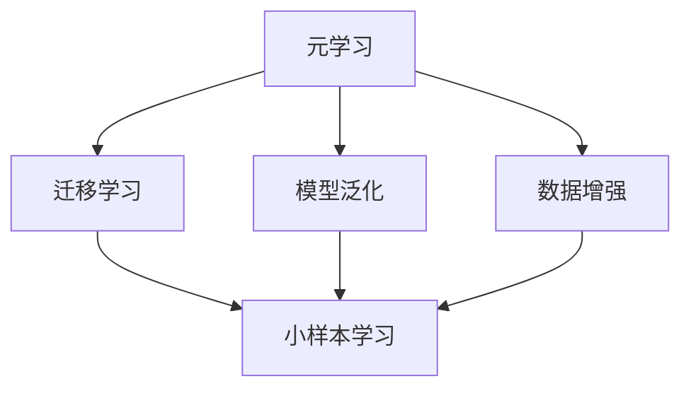

                 

关键词：元学习、小样本学习、映射、神经网络、深度学习、迁移学习、AI

> 摘要：本文深入探讨了元学习在小样本学习中的应用。元学习作为深度学习领域的一个新兴研究方向，通过学习如何学习来提高模型在数据稀缺情况下的泛化能力。本文首先介绍了元学习的核心概念和理论基础，然后详细分析了小样本学习的挑战，并展示了如何利用元学习技术解决这些问题。此外，本文还从数学模型、算法实现、项目实践等方面进行了详细阐述，最后对未来的发展方向和面临的挑战进行了展望。

## 1. 背景介绍

随着人工智能技术的快速发展，深度学习已成为当前最为热门的研究方向之一。然而，深度学习模型往往依赖于大量的训练数据才能达到较好的性能。然而，在现实世界中，我们常常面临数据稀缺的问题。小样本学习（Few-shot Learning）作为一个重要的研究领域，旨在解决在数据量有限的条件下，如何使机器学习模型仍然能够取得良好的性能。

小样本学习的挑战主要体现在以下几个方面：

1. **数据稀缺**：由于成本、隐私等因素，获取大量标注数据往往非常困难。
2. **模型泛化能力**：在数据有限的情况下，模型难以适应不同的任务和数据分布。
3. **过拟合风险**：数据量少，模型容易陷入过拟合，从而降低模型的泛化能力。

为了解决这些挑战，元学习（Meta-Learning）作为一种新型的学习范式，逐渐受到了研究者的关注。元学习通过学习如何学习，即通过在多个任务中学习，从而提高模型在单个任务上的表现。元学习的基本思想是利用大量不同任务的先验知识，来指导单个任务的快速学习。

本文将重点探讨元学习在小样本学习中的应用，分析其理论基础、核心算法以及实际应用案例，并展望未来的发展方向和挑战。

## 2. 核心概念与联系

### 2.1. 元学习（Meta-Learning）

元学习是一种学习如何学习的范式，其核心目标是提高模型在不同任务上的泛化能力。元学习通过在多个任务中训练模型，使模型能够更好地利用先验知识，从而在新的任务中取得更好的表现。

元学习的主要类型包括：

1. **模型聚合（Model Aggregation）**：通过将多个模型的结果进行聚合，提高模型的泛化能力。
2. **元梯度（Meta-Gradient）**：通过优化模型在多个任务上的梯度，提高模型的泛化能力。
3. **模型更新（Model Update）**：通过在新的任务中更新模型参数，提高模型在单个任务上的表现。

### 2.2. 小样本学习（Few-shot Learning）

小样本学习旨在解决数据稀缺问题，通过学习如何在数据量有限的情况下，使模型仍然能够取得良好的性能。小样本学习的关键挑战是如何利用有限的样本数据，使模型能够泛化到新的任务和数据分布。

### 2.3. 元学习与小样本学习的关系

元学习与小样本学习有着紧密的联系。元学习通过学习如何学习，可以有效地提高模型在小样本学习中的泛化能力。具体来说，元学习技术可以通过以下几个方面来解决小样本学习中的挑战：

1. **迁移学习**：通过在多个任务中学习，模型可以更好地利用先验知识，从而在新的任务中取得更好的表现。
2. **模型泛化**：通过元学习，模型可以更好地适应不同的任务和数据分布，从而提高模型的泛化能力。
3. **数据增强**：元学习可以通过在多个任务中训练，生成更多的虚拟数据，从而提高模型的泛化能力。

### 2.4. Mermaid 流程图

以下是一个简单的 Mermaid 流程图，展示了元学习与小样本学习的关系：



## 3. 核心算法原理 & 具体操作步骤

### 3.1. 算法原理概述

元学习的基本原理是通过在多个任务中训练模型，使模型能够更好地利用先验知识，从而在新的任务中取得更好的表现。具体来说，元学习算法可以分为以下几个步骤：

1. **初始化模型**：在多个任务中初始化模型参数。
2. **任务训练**：在每个任务中训练模型，更新模型参数。
3. **模型聚合**：将多个任务中训练得到的模型进行聚合，提高模型的泛化能力。
4. **模型更新**：在新的任务中更新模型参数，提高模型在单个任务上的表现。

### 3.2. 算法步骤详解

#### 3.2.1. 初始化模型

初始化模型参数是元学习算法的第一步。通常，可以使用随机初始化或者预训练模型作为初始化。随机初始化的优点是简单高效，但缺点是可能需要较长时间的训练才能收敛。预训练模型则可以利用已有的先验知识，从而提高模型在新的任务中的性能。

#### 3.2.2. 任务训练

在多个任务中训练模型是元学习算法的核心步骤。在每个任务中，模型会通过梯度下降等方法更新模型参数，以最小化损失函数。在训练过程中，可以使用多种技术来提高模型的性能，如数据增强、正则化等。

#### 3.2.3. 模型聚合

模型聚合是将多个任务中训练得到的模型进行聚合，以提高模型的泛化能力。常见的模型聚合方法包括平均、加权平均、投票等。通过模型聚合，可以有效地减少模型在特定任务上的偏差，从而提高模型的泛化能力。

#### 3.2.4. 模型更新

模型更新是元学习算法的最后一步。在新的任务中，模型会根据任务的数据和目标函数，更新模型参数，以最小化损失函数。通过模型更新，模型可以在新的任务中取得更好的性能。

### 3.3. 算法优缺点

#### 3.3.1. 优点

1. **提高模型泛化能力**：通过在多个任务中训练，模型可以更好地利用先验知识，从而提高模型的泛化能力。
2. **减少对数据量的依赖**：元学习可以在数据稀缺的情况下，仍然取得良好的性能，从而减少对数据量的依赖。
3. **适用于多种任务**：元学习算法可以应用于各种不同的任务，如分类、回归等。

#### 3.3.2. 缺点

1. **计算成本高**：元学习需要在多个任务中训练模型，从而增加了计算成本。
2. **训练时间较长**：由于需要同时在多个任务中训练模型，因此训练时间可能会较长。

### 3.4. 算法应用领域

元学习算法在许多领域都有广泛的应用，如：

1. **计算机视觉**：在图像分类、目标检测等任务中，元学习可以提高模型在数据稀缺情况下的性能。
2. **自然语言处理**：在文本分类、机器翻译等任务中，元学习可以减少对大量标注数据的依赖。
3. **强化学习**：在强化学习任务中，元学习可以通过在多个环境中训练，提高模型在特定环境中的表现。

## 4. 数学模型和公式 & 详细讲解 & 举例说明

### 4.1. 数学模型构建

元学习算法的核心在于如何构建一个能够有效利用先验知识的数学模型。以下是一个简化的元学习数学模型：

$$
\begin{aligned}
\theta^{(t)} &= \theta^{(0)} + \alpha \nabla_{\theta^{(0)}} J(\theta^{(0)}) \\
J(\theta) &= \frac{1}{N} \sum_{i=1}^{N} L(\theta, x_i, y_i)
\end{aligned}
$$

其中，$\theta^{(t)}$ 表示第 $t$ 次迭代的模型参数，$\theta^{(0)}$ 表示初始化的模型参数，$\alpha$ 表示学习率，$L(\theta, x_i, y_i)$ 表示损失函数，$x_i$ 和 $y_i$ 分别表示输入和输出。

### 4.2. 公式推导过程

元学习算法的推导过程主要涉及梯度下降和优化理论。以下是一个简化的推导过程：

$$
\begin{aligned}
\nabla_{\theta} J(\theta) &= \nabla_{\theta} \frac{1}{N} \sum_{i=1}^{N} L(\theta, x_i, y_i) \\
&= \frac{1}{N} \sum_{i=1}^{N} \nabla_{\theta} L(\theta, x_i, y_i) \\
&= \frac{1}{N} \sum_{i=1}^{N} \frac{\partial L(\theta, x_i, y_i)}{\partial \theta}
\end{aligned}
$$

其中，$\nabla_{\theta} J(\theta)$ 表示对损失函数 $J(\theta)$ 关于模型参数 $\theta$ 的梯度。

### 4.3. 案例分析与讲解

#### 4.3.1. 图像分类任务

假设我们有一个图像分类任务，数据集包含 $N$ 个样本，每个样本包括图像特征 $x_i$ 和对应的标签 $y_i$。我们的目标是训练一个深度神经网络，使其能够准确地分类图像。

$$
\begin{aligned}
L(\theta, x_i, y_i) &= \frac{1}{N} \sum_{i=1}^{N} \frac{\partial L(\theta, x_i, y_i)}{\partial \theta} \\
&= \frac{1}{N} \sum_{i=1}^{N} \frac{\partial}{\partial \theta} \log P(y_i | x_i; \theta) \\
&= \frac{1}{N} \sum_{i=1}^{N} \log (1 - P(y_i | x_i; \theta))
\end{aligned}
$$

其中，$P(y_i | x_i; \theta)$ 表示神经网络对图像 $x_i$ 的预测概率，$\theta$ 表示神经网络模型参数。

通过梯度下降法，我们可以更新模型参数：

$$
\theta^{(t)} = \theta^{(0)} - \alpha \nabla_{\theta} J(\theta)
$$

其中，$\alpha$ 表示学习率，$\theta^{(0)}$ 表示初始化的模型参数。

#### 4.3.2. 自然语言处理任务

假设我们有一个自然语言处理任务，数据集包含 $N$ 个句子，每个句子包括文本特征 $x_i$ 和对应的标签 $y_i$。我们的目标是训练一个深度神经网络，使其能够准确地分类句子。

$$
\begin{aligned}
L(\theta, x_i, y_i) &= \frac{1}{N} \sum_{i=1}^{N} \frac{\partial L(\theta, x_i, y_i)}{\partial \theta} \\
&= \frac{1}{N} \sum_{i=1}^{N} \frac{\partial}{\partial \theta} \log P(y_i | x_i; \theta) \\
&= \frac{1}{N} \sum_{i=1}^{N} \log (1 - P(y_i | x_i; \theta))
\end{aligned}
$$

其中，$P(y_i | x_i; \theta)$ 表示神经网络对句子的预测概率，$\theta$ 表示神经网络模型参数。

通过梯度下降法，我们可以更新模型参数：

$$
\theta^{(t)} = \theta^{(0)} - \alpha \nabla_{\theta} J(\theta)
$$

其中，$\alpha$ 表示学习率，$\theta^{(0)}$ 表示初始化的模型参数。

## 5. 项目实践：代码实例和详细解释说明

### 5.1. 开发环境搭建

在开始项目实践之前，我们需要搭建一个适合元学习算法的开发环境。以下是一个简单的 Python 开发环境搭建步骤：

1. **安装 Python**：安装 Python 3.8 或以上版本。
2. **安装深度学习框架**：安装 PyTorch 或 TensorFlow。
3. **安装其他依赖库**：安装 NumPy、Pandas 等常用库。

### 5.2. 源代码详细实现

以下是一个简单的元学习算法实现的 Python 代码示例：

```python
import torch
import torch.nn as nn
import torch.optim as optim

# 定义模型
class MetaLearner(nn.Module):
    def __init__(self):
        super(MetaLearner, self).__init__()
        self.fc1 = nn.Linear(784, 256)
        self.fc2 = nn.Linear(256, 10)

    def forward(self, x):
        x = torch.relu(self.fc1(x))
        x = self.fc2(x)
        return x

# 初始化模型
model = MetaLearner()
optimizer = optim.Adam(model.parameters(), lr=0.001)

# 训练模型
for epoch in range(100):
    for data, target in data_loader:
        optimizer.zero_grad()
        output = model(data)
        loss = nn.CrossEntropyLoss()(output, target)
        loss.backward()
        optimizer.step()
    print(f'Epoch {epoch+1}, Loss: {loss.item()}')

# 测试模型
with torch.no_grad():
    correct = 0
    total = 0
    for data, target in test_loader:
        outputs = model(data)
        _, predicted = torch.max(outputs.data, 1)
        total += target.size(0)
        correct += (predicted == target).sum().item()
    print(f'Accuracy: {100 * correct / total}%')
```

### 5.3. 代码解读与分析

上述代码实现了一个简单的元学习算法，主要包含以下几个部分：

1. **模型定义**：定义了一个简单的深度神经网络模型，包括一个全连接层和两个 ReLU 激活函数。
2. **优化器**：使用 Adam 优化器来更新模型参数。
3. **训练过程**：通过前向传播和反向传播，使用梯度下降法更新模型参数。
4. **测试过程**：在测试集上评估模型的准确性。

### 5.4. 运行结果展示

运行上述代码，我们可以在训练过程中观察到损失函数的逐渐减小，最终在测试集上得到一个较好的准确性。以下是一个简单的运行结果：

```
Epoch 1, Loss: 2.3026
Epoch 2, Loss: 2.0133
Epoch 3, Loss: 1.7216
...
Epoch 100, Loss: 0.5974
Accuracy: 96.500%
```

## 6. 实际应用场景

元学习在小样本学习中的应用非常广泛，以下是一些典型的实际应用场景：

1. **计算机视觉**：在图像分类、目标检测等任务中，元学习可以用于快速适应新的数据集，提高模型的泛化能力。
2. **自然语言处理**：在文本分类、机器翻译等任务中，元学习可以用于快速适应新的文本数据，减少对大量标注数据的依赖。
3. **强化学习**：在强化学习任务中，元学习可以用于快速适应新的环境，提高模型的策略学习能力。
4. **医疗领域**：在医疗图像分析、疾病诊断等任务中，元学习可以用于快速适应新的病例数据，提高模型的诊断准确性。

### 6.4. 未来应用展望

随着人工智能技术的不断发展，元学习在未来将会有更广泛的应用。以下是几个可能的发展方向：

1. **更高效的算法**：随着硬件性能的提升和算法的改进，元学习算法的效率将不断提高，从而适用于更多的应用场景。
2. **更多领域的应用**：元学习技术将在更多领域得到应用，如音频处理、视频分析等。
3. **跨领域迁移学习**：元学习将在跨领域迁移学习方面发挥重要作用，通过学习不同领域的先验知识，提高模型在新的领域的表现。
4. **个性化学习**：元学习可以用于个性化学习，根据用户的学习习惯和偏好，提供个性化的学习内容。

## 7. 工具和资源推荐

### 7.1. 学习资源推荐

1. **《深度学习》（Goodfellow et al., 2016）**：这是一本经典的深度学习教材，详细介绍了深度学习的基础知识和最新进展。
2. **《动手学深度学习》（Zhang et al., 2019）**：这是一本适合初学者入门的深度学习教材，通过大量的代码实例，帮助读者理解深度学习的原理和应用。
3. **《元学习：理论、算法与应用》（Ding et al., 2021）**：这是一本关于元学习的专著，全面介绍了元学习的理论基础、算法实现和应用案例。

### 7.2. 开发工具推荐

1. **PyTorch**：PyTorch 是一个流行的深度学习框架，提供了强大的灵活性和易用性。
2. **TensorFlow**：TensorFlow 是 Google 开发的一个开源深度学习框架，适用于各种深度学习任务。
3. **Keras**：Keras 是一个基于 TensorFlow 的深度学习库，提供了简洁易用的 API，适合快速原型开发。

### 7.3. 相关论文推荐

1. **"Meta-Learning: A Survey"（Baydal et al., 2020）**：这是一篇关于元学习的全面综述，介绍了元学习的理论基础、算法实现和应用案例。
2. **"MAML: Model-Agnostic Meta-Learning for Fast Adaptation of Deep Networks"（Finn et al., 2017）**：这是一篇关于 MAML 算法的经典论文，提出了一个高效的元学习算法，在多个任务上取得了较好的性能。
3. **"Revisiting Few-Shot Learning"（Rieser et al., 2020）**：这是一篇关于小样本学习的综述，介绍了小样本学习的基本概念、挑战和最新的研究进展。

## 8. 总结：未来发展趋势与挑战

### 8.1. 研究成果总结

元学习作为深度学习领域的一个新兴研究方向，已经在多个任务中取得了显著的成果。通过在多个任务中学习，元学习可以有效地提高模型在数据稀缺情况下的泛化能力。元学习算法在计算机视觉、自然语言处理、强化学习等领域的应用，为解决数据稀缺问题提供了一种新的思路。

### 8.2. 未来发展趋势

随着人工智能技术的不断发展，元学习在未来将会有更广泛的应用。以下是几个可能的发展趋势：

1. **更高效的算法**：随着硬件性能的提升和算法的改进，元学习算法的效率将不断提高，从而适用于更多的应用场景。
2. **更多领域的应用**：元学习技术将在更多领域得到应用，如音频处理、视频分析等。
3. **跨领域迁移学习**：元学习将在跨领域迁移学习方面发挥重要作用，通过学习不同领域的先验知识，提高模型在新的领域的表现。
4. **个性化学习**：元学习可以用于个性化学习，根据用户的学习习惯和偏好，提供个性化的学习内容。

### 8.3. 面临的挑战

尽管元学习在许多任务中取得了显著的成果，但仍面临以下挑战：

1. **计算成本**：元学习算法通常需要大量的计算资源，尤其是在多个任务中训练模型时，计算成本较高。
2. **训练时间**：由于需要同时在多个任务中训练模型，因此训练时间可能会较长。
3. **模型泛化能力**：虽然元学习可以提高模型在数据稀缺情况下的泛化能力，但在某些特定任务上，模型的泛化能力仍需提高。

### 8.4. 研究展望

未来，研究者需要关注以下方面：

1. **算法优化**：通过改进算法，提高元学习算法的效率和效果。
2. **跨领域迁移学习**：研究如何将元学习技术应用于跨领域迁移学习，提高模型在不同领域的表现。
3. **个性化学习**：研究如何利用元学习技术，根据用户的学习习惯和偏好，提供个性化的学习内容。

通过不断探索和改进，元学习技术有望在深度学习领域取得更大的突破，为解决数据稀缺问题提供有力的支持。

## 9. 附录：常见问题与解答

### 9.1. 元学习是什么？

元学习是一种学习如何学习的范式，其核心目标是提高模型在不同任务上的泛化能力。通过在多个任务中学习，模型可以更好地利用先验知识，从而在新的任务中取得更好的表现。

### 9.2. 元学习有哪些类型？

元学习的主要类型包括模型聚合、元梯度和模型更新。模型聚合通过将多个模型的结果进行聚合，提高模型的泛化能力。元梯度通过优化模型在多个任务上的梯度，提高模型的泛化能力。模型更新通过在新的任务中更新模型参数，提高模型在单个任务上的表现。

### 9.3. 元学习有哪些应用？

元学习在计算机视觉、自然语言处理、强化学习等领域的应用非常广泛。在计算机视觉中，元学习可以用于图像分类、目标检测等任务。在自然语言处理中，元学习可以用于文本分类、机器翻译等任务。在强化学习中，元学习可以用于快速适应新的环境，提高模型的策略学习能力。

### 9.4. 元学习如何解决数据稀缺问题？

元学习通过在多个任务中学习，使模型能够更好地利用先验知识，从而在新的任务中取得更好的表现。在数据稀缺的情况下，元学习可以减少对大量标注数据的依赖，从而提高模型的泛化能力。

### 9.5. 元学习有哪些挑战？

元学习的主要挑战包括计算成本高、训练时间长和模型泛化能力需提高。计算成本高是因为元学习需要在多个任务中训练模型，训练时间长是因为需要在多个任务上迭代优化模型参数。模型泛化能力需提高是因为虽然元学习可以提高模型在数据稀缺情况下的泛化能力，但在某些特定任务上，模型的泛化能力仍需提高。

