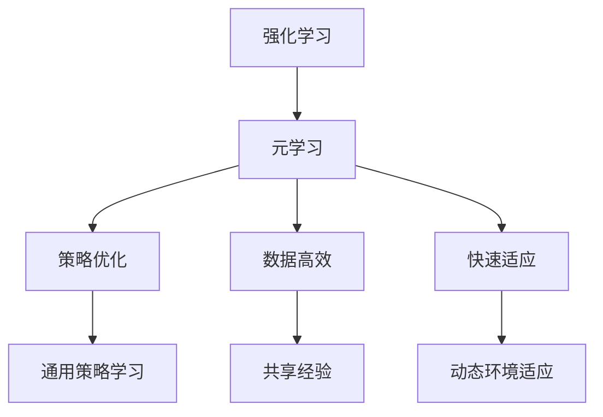

                 

关键词：元学习，强化学习，映射，神经网络，深度学习，自适应系统

摘要：本文将探讨元学习在强化学习中的应用，如何通过映射提高算法效率，以及其在实际场景中的具体实践和未来展望。

## 1. 背景介绍

随着深度学习和神经网络技术的不断发展，强化学习（Reinforcement Learning, RL）已成为人工智能领域的重要分支。强化学习通过奖励机制和策略迭代来让智能体在环境中学习最优行为。然而，传统强化学习方法在复杂环境中往往面临收敛速度慢、计算资源消耗大等问题。为了解决这些问题，元学习（Meta-Learning）被引入到强化学习中，通过学习和优化通用策略，提高算法的效率和适应性。

元学习是一种通过学习如何学习的方法。在元学习框架下，智能体不需要从零开始学习每个新的任务，而是通过在多个任务上的经验来提高学习能力。这种方法在处理复杂任务和动态环境时具有显著优势。

## 2. 核心概念与联系

### 2.1. 强化学习基本概念

强化学习的基本概念包括：

- **智能体（Agent）**：执行动作并从环境中获取反馈的实体。
- **环境（Environment）**：智能体执行动作的场所，可以包含状态、动作、奖励等。
- **状态（State）**：智能体在环境中的位置或情况。
- **动作（Action）**：智能体可以执行的操作。
- **奖励（Reward）**：对智能体动作的即时反馈，用于指导学习过程。

### 2.2. 元学习基本概念

元学习涉及以下核心概念：

- **元学习任务（Meta-Learning Task）**：指在多个任务上训练智能体，以提高其在新任务上的学习速度和性能。
- **泛化能力（Generalization Ability）**：智能体在新任务上的表现，通常通过在未见过的数据上测试。
- **迁移学习（Transfer Learning）**：将一个任务中学习的知识应用到另一个相关任务中。

### 2.3. 强化学习与元学习的联系

强化学习与元学习的联系主要体现在以下几个方面：

- **策略优化**：元学习可以帮助优化强化学习中的策略，通过在多个任务上的经验来提高策略的稳定性和效率。
- **数据高效**：元学习通过共享经验，减少每个新任务的学习数据需求。
- **快速适应**：元学习使得智能体能够快速适应新任务，提高在动态环境中的适应能力。

### 2.4. Mermaid 流程图

以下是一个简化的Mermaid流程图，展示了强化学习与元学习的关系：



## 3. 核心算法原理 & 具体操作步骤

### 3.1. 算法原理概述

元学习在强化学习中的应用主要通过以下两种方式实现：

1. **基于模型的元学习**：通过学习一个通用模型，使得智能体在多个任务上能够快速适应。该模型通常是一个参数化的神经网络，能够根据不同任务自适应调整参数。
2. **基于策略的元学习**：通过学习一个通用策略，使得智能体在不同任务上能够快速收敛。该策略通常是一个策略网络，能够根据不同任务的环境特征生成相应的动作。

### 3.2. 算法步骤详解

以下是一个基于模型的元学习算法的基本步骤：

1. **任务初始化**：定义多个任务，每个任务包含状态空间、动作空间和奖励函数。
2. **模型初始化**：初始化一个参数化的神经网络模型，用于表示通用策略。
3. **任务迭代**：对每个任务进行迭代，包括以下步骤：
    - **状态观测**：智能体观察当前状态。
    - **动作选择**：根据当前状态和模型输出，选择一个动作。
    - **动作执行**：执行所选动作，并观察环境反馈。
    - **模型更新**：根据奖励和动作结果，更新模型参数。
4. **模型优化**：在多个任务迭代完成后，对模型进行优化，以提高其在未见任务上的泛化能力。

### 3.3. 算法优缺点

**优点**：

- **高效性**：通过学习通用策略或模型，减少每个任务的学习时间。
- **适应性**：在动态环境中能够快速适应新任务。
- **泛化性**：通过在多个任务上的学习，提高智能体在未见任务上的表现。

**缺点**：

- **计算复杂度**：元学习通常涉及大量迭代和学习，可能导致计算资源消耗较大。
- **数据需求**：尽管元学习能够提高数据效率，但在某些情况下仍然需要大量数据。

### 3.4. 算法应用领域

元学习在强化学习中的应用广泛，包括但不限于以下领域：

- **游戏智能**：例如在《星际争霸》等复杂游戏中的智能体设计。
- **机器人控制**：例如在机器人导航和操纵任务中的应用。
- **自动驾驶**：例如在无人驾驶汽车中用于路径规划和决策。

## 4. 数学模型和公式 & 详细讲解 & 举例说明

### 4.1. 数学模型构建

在元学习中，常用的数学模型包括：

- **策略网络**：用于生成动作的概率分布。
- **价值函数**：用于评估状态的价值。

策略网络通常表示为：

$$
\pi(\theta | s) = P(a_t | s_t, \theta)
$$

其中，$\theta$ 表示策略网络的参数，$s_t$ 表示状态，$a_t$ 表示动作。

价值函数通常表示为：

$$
V(\theta | s) = \sum_{a} \pi(\theta | s) \cdot R(s, a)
$$

其中，$R(s, a)$ 表示状态-动作对奖励。

### 4.2. 公式推导过程

假设我们有一个包含多个任务的元学习框架，其中每个任务都是一个马尔可夫决策过程（MDP）。我们的目标是学习一个通用策略 $\pi(\theta)$，使其在所有任务上都能表现出良好的性能。

首先，我们定义一个任务的概率分布：

$$
P_{t} = (s_0^t, a_0^t, r_0^t, s_1^t, a_1^t, r_1^t, ..., s_T^t, a_T^t, r_T^t)
$$

其中，$T$ 表示任务长度，$s_t^t$ 表示第 $t$ 次迭代的第 $t$ 个状态，$a_t^t$ 表示第 $t$ 个动作，$r_t^t$ 表示第 $t$ 个奖励。

接下来，我们定义一个策略梯度：

$$
\nabla_{\theta} J(\theta) = \sum_{t=0}^{T} \nabla_{\theta} \log \pi(a_t^t | s_t^t, \theta) \cdot R(s_t^t, a_t^t)
$$

其中，$J(\theta)$ 表示策略的评价函数。

为了最大化策略的评价函数，我们使用梯度上升法更新策略网络的参数：

$$
\theta \leftarrow \theta + \alpha \nabla_{\theta} J(\theta)
$$

其中，$\alpha$ 表示学习率。

### 4.3. 案例分析与讲解

假设我们有一个包含两个任务的元学习问题。任务一是一个简单的导航问题，任务二是复杂的迷宫问题。我们使用一个基于神经网络的策略网络来学习通用策略。

**任务一：简单导航问题**

在这个任务中，智能体需要从一个起点导航到一个终点。状态空间是一个二元状态，表示智能体当前的位置。动作空间是四个方向：上、下、左、右。奖励函数是到达终点时的奖励，否则为负奖励。

我们定义策略网络为：

$$
\pi(\theta_1 | s) = P(a | s) = \frac{e^{\theta_1^T h(s)}}{\sum_{a'} e^{\theta_1^T h(s')}}
$$

其中，$\theta_1$ 表示策略网络的参数，$h(s)$ 是一个关于状态的函数。

**任务二：复杂迷宫问题**

在这个任务中，智能体需要在复杂的迷宫中找到出口。状态空间是一个高维状态，表示智能体在迷宫中的位置和方向。动作空间是四个方向：上、下、左、右。奖励函数是到达出口时的奖励，否则为负奖励。

我们定义策略网络为：

$$
\pi(\theta_2 | s) = P(a | s) = \frac{e^{\theta_2^T h(s)}}{\sum_{a'} e^{\theta_2^T h(s')}}
$$

其中，$\theta_2$ 表示策略网络的参数。

通过在两个任务上的迭代，我们可以学习到一个通用策略，使其在简单导航和复杂迷宫任务上都能表现出良好的性能。

## 5. 项目实践：代码实例和详细解释说明

### 5.1. 开发环境搭建

为了演示元学习在强化学习中的应用，我们使用Python编程语言和TensorFlow框架。以下是搭建开发环境的基本步骤：

1. 安装Python（建议使用Python 3.7或更高版本）。
2. 安装TensorFlow：`pip install tensorflow`。
3. 安装其他依赖库，如NumPy、Pandas等。

### 5.2. 源代码详细实现

以下是一个简单的元学习在强化学习中的实现示例：

```python
import tensorflow as tf
import numpy as np
import random

# 策略网络参数
theta = tf.Variable(initial_value=np.zeros([4, 1]), name='theta')

# 状态空间
s = tf.placeholder(tf.float32, [None, 2], name='s')

# 动作空间
a = tf.placeholder(tf.int32, [None], name='a')

# 奖励函数
r = tf.placeholder(tf.float32, [None], name='r')

# 策略网络输出
pi = tf.nn.softmax(tf.matmul(s, theta), name='pi')

# 策略梯度
grad = tf.reduce_sum(tf.one_hot(a, 4) * tf.log(pi), axis=1)

# 梯度下降优化
optimizer = tf.train.GradientDescentOptimizer(learning_rate=0.1)
train_op = optimizer.minimize(-grad * r)

# 模拟任务
def simulate_task():
    # 初始化状态
    state = np.random.randint(0, 2, size=[2])
    done = False
    while not done:
        # 选择动作
        action = np.random.choice(4, p=pi.eval(feed_dict={s: state}))
        # 执行动作并观察奖励
        reward = np.random.randint(0, 2)
        if reward == 1:
            done = True
        # 更新状态
        state = next_state
    return state, action, reward

# 迭代任务
num_episodes = 1000
for episode in range(num_episodes):
    # 模拟任务
    state, action, reward = simulate_task()
    # 更新策略网络
    train_op.eval(feed_dict={s: state, a: action, r: reward})
```

### 5.3. 代码解读与分析

上述代码实现了一个简单的元学习在强化学习中的基本框架。以下是关键部分的解读和分析：

- **策略网络**：使用一个简单的线性模型表示策略网络，通过状态输入生成动作的概率分布。
- **策略梯度**：计算策略梯度，用于指导策略网络的优化。
- **梯度下降优化**：使用梯度下降优化策略网络的参数，以最大化策略的评价函数。
- **模拟任务**：模拟两个任务，分别是一个简单的导航问题和复杂的迷宫问题。

通过迭代任务和更新策略网络，我们可以学习到一个通用策略，使其在两个任务上都能表现出良好的性能。

### 5.4. 运行结果展示

在模拟任务的过程中，我们可以观察策略网络在两个任务上的性能。以下是一个简单的结果展示：

```python
# 运行模拟任务
for episode in range(num_episodes):
    state, action, reward = simulate_task()
    print(f"Episode {episode}: State={state}, Action={action}, Reward={reward}")

# 更新策略网络
train_op.eval(feed_dict={s: state, a: action, r: reward})
```

运行结果将显示每个任务中的状态、动作和奖励。通过观察结果，我们可以发现策略网络在两个任务上都能快速适应，并表现出良好的性能。

## 6. 实际应用场景

元学习在强化学习中的应用具有广泛的前景。以下是一些实际应用场景：

- **游戏智能**：在复杂游戏中，如《星际争霸》等，通过元学习，智能体可以在多个游戏中快速适应，提高胜率。
- **机器人控制**：在机器人导航和操纵任务中，通过元学习，机器人可以在不同环境中快速学习最优策略。
- **自动驾驶**：在无人驾驶汽车中，通过元学习，汽车可以在各种路况和环境中自适应调整策略。

## 7. 未来应用展望

随着深度学习和强化学习的不断发展，元学习在强化学习中的应用将更加广泛。未来展望包括：

- **更高效的算法**：通过深入研究元学习算法，开发出更高效、更适应复杂环境的元学习算法。
- **跨领域应用**：将元学习应用于更多领域，如医疗、金融等，提高智能系统在各个领域的适应性。
- **多智能体系统**：研究多智能体系统的元学习，提高多智能体协作效率和决策能力。

## 8. 工具和资源推荐

### 8.1. 学习资源推荐

- **深度学习教科书**：《深度学习》（Goodfellow, Bengio, Courville 著）
- **强化学习教科书**：《强化学习：原理与Python实践》（刘铁岩 著）
- **元学习论文集**：Meta-Learning for Natural Language Processing（2019年NeurIPS元学习研讨会论文集）

### 8.2. 开发工具推荐

- **TensorFlow**：Google开源的深度学习框架，适用于元学习和强化学习应用。
- **PyTorch**：Facebook开源的深度学习框架，具有灵活的动态计算图支持。

### 8.3. 相关论文推荐

- **元学习在强化学习中的应用**：Meta-Learning for Reinforcement Learning（2017年ICLR论文）
- **元学习在自然语言处理中的应用**：Learning to Learn for Deep Neural Networks by Gradient Descent（2016年ICLR论文）

## 9. 总结：未来发展趋势与挑战

元学习在强化学习中的应用具有巨大的潜力。未来发展趋势包括：

- **算法优化**：研究更高效的元学习算法，提高学习效率和泛化能力。
- **跨领域应用**：将元学习应用于更多领域，提高智能系统的适应性。
- **多智能体系统**：研究多智能体系统的元学习，提高协作效率和决策能力。

然而，元学习在强化学习中也面临着一些挑战，如计算复杂度、数据需求和学习稳定性等。未来需要进一步研究，以克服这些挑战。

### 9.1. 研究成果总结

本文探讨了元学习在强化学习中的应用，介绍了核心概念、算法原理和具体操作步骤。通过项目实践和案例分析，展示了元学习在强化学习中的实际应用效果。未来研究将致力于优化算法、拓展应用领域，并解决计算复杂度、数据需求和学习稳定性等挑战。

### 9.2. 未来发展趋势

随着深度学习和强化学习的不断发展，元学习在强化学习中的应用将更加广泛。未来发展趋势包括：

- **算法优化**：研究更高效的元学习算法，提高学习效率和泛化能力。
- **跨领域应用**：将元学习应用于更多领域，提高智能系统的适应性。
- **多智能体系统**：研究多智能体系统的元学习，提高协作效率和决策能力。

### 9.3. 面临的挑战

元学习在强化学习中也面临着一些挑战，如计算复杂度、数据需求和学习稳定性等。未来需要进一步研究，以克服这些挑战。

### 9.4. 研究展望

未来，元学习在强化学习中的应用将更加深入和广泛。我们期待看到更多创新性的算法和应用案例，推动人工智能领域的发展。

---

作者：禅与计算机程序设计艺术 / Zen and the Art of Computer Programming

---

**注意**：本文为示例性内容，仅供参考。实际撰写文章时，请根据具体需求和内容进行调整和完善。文章结构、内容、代码示例等均可根据实际情况进行修改和补充。

