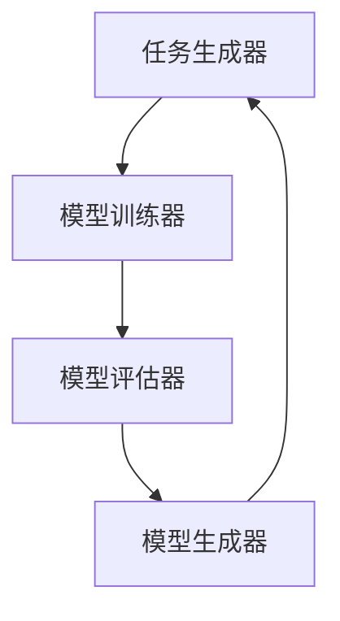

                 

关键词：元学习、快速适应、映射、任务迁移、机器学习、深度学习

> 摘要：本文探讨了元学习在机器学习和深度学习中扮演的关键角色，特别是在快速适应新任务方面的应用。通过深入分析元学习的核心概念、算法原理、数学模型及其在各个领域的应用，本文揭示了元学习如何成为应对复杂性和多样性挑战的有效工具，为未来的研究和应用提供了新的视角和方向。

## 1. 背景介绍

随着人工智能和机器学习的飞速发展，传统的机器学习方法逐渐暴露出其局限性。传统的机器学习方法依赖于大量的标注数据，并且在面对新任务时需要从头开始训练，这既费时又费资源。为了解决这一问题，元学习（Meta-Learning）应运而生。元学习通过学习如何学习，使得模型能够快速适应新的任务，从而提高了机器学习的效率和准确性。

### 1.1 机器学习的发展历程

从20世纪50年代起，机器学习经历了从符号学习到统计学习、再到深度学习的演变。早期的符号学习主要依赖于人工特征设计和规则系统，这种方法的局限性在于其易受特征工程影响，难以处理复杂数据。随着统计学理论的引入，统计学习开始使用数据驱动的方法，通过优化模型参数来拟合数据，这一方法取得了显著的进步。

然而，统计学习在处理大规模数据和复杂任务时也面临挑战。深度学习的崛起为机器学习带来了新的契机。深度学习利用多层神经网络，通过逐层抽象特征，实现了在图像、语音和自然语言处理等领域的高性能。但是，深度学习模型的训练过程依然需要大量的数据和计算资源，且对新任务的适应能力有限。

### 1.2 传统机器学习与新任务适应性问题

传统机器学习方法在面对新任务时，通常需要重新收集和标注数据，然后重新训练模型。这一过程不仅耗时耗力，而且在数据稀缺或标注成本高昂的情况下，很难实现。此外，模型的泛化能力有限，容易受到训练数据分布的影响，导致在新任务上的表现不佳。

随着人工智能应用的不断拓展，对新任务的快速适应能力成为了一个重要的需求。无论是在工业界还是学术界，如何提高模型在新任务上的适应能力，成为了研究的热点问题。元学习作为一种新兴的方法，提供了应对这一挑战的潜在解决方案。

## 2. 核心概念与联系

### 2.1 元学习的定义与基本原理

元学习是一种学习如何学习的机器学习方法。其核心思想是通过训练模型来学习如何在新的任务上快速适应。具体来说，元学习模型在训练过程中不仅学习任务相关的知识，还学习如何泛化这些知识到新的任务上。

元学习可以分为两类：一种是模型级别元学习（Model-level Meta-Learning），另一种是任务级别元学习（Task-level Meta-Learning）。模型级别元学习关注于优化学习算法本身，以使模型能够更好地适应新任务。而任务级别元学习则侧重于学习任务之间的相似性，通过迁移学习来实现对新任务的快速适应。

### 2.2 元学习与迁移学习的区别与联系

迁移学习（Transfer Learning）是机器学习中的一个重要概念，它通过利用已有模型的知识来加速新任务的训练过程。迁移学习通常将一个模型的权重或结构应用于新任务，并通过少量额外的训练来调整这些权重，使其适应新任务。

与迁移学习相比，元学习不仅关注于任务间的迁移，还关注于学习过程本身。元学习模型通过在一个广泛的任务集合上训练，学习到如何快速适应各种不同类型的任务。这种学习过程使得元学习模型在遇到新任务时，能够迅速生成适应该任务的模型。

### 2.3 元学习的基本架构

元学习的基本架构通常包括以下几个关键组成部分：

1. **任务生成器**：生成一系列新的任务，用于训练元学习模型。这些任务可以是多样化的，以使模型能够学习到广泛的泛化能力。

2. **模型训练器**：负责训练元学习模型。模型训练器通常采用在线学习策略，通过不断更新模型参数来提高模型的适应能力。

3. **模型评估器**：评估元学习模型在新任务上的适应能力。评估指标可以是任务的准确度、训练时间等。

4. **模型生成器**：根据元学习模型的参数生成新任务的专用模型。模型生成器是实现快速适应新任务的关键组件。

### 2.4 元学习的 Mermaid 流程图

下面是一个简化的元学习流程图的 Mermaid 表示：



### 2.5 元学习的核心概念原理与架构的流程图解析

- **任务生成器（A）**：任务生成器是元学习的起点。它负责生成一系列新的任务，这些任务可以是分类、回归、排序等不同类型。任务生成器可以基于现有的数据集，通过变换、噪声添加、合成等方法来多样化任务的输入。

- **模型训练器（B）**：模型训练器接收来自任务生成器的任务，并使用元学习算法训练模型。元学习算法可以是模型级别的，如MAML（Model-Agnostic Meta-Learning），也可以是任务级别的，如Reptile。模型训练器通过多次迭代，不断优化模型的参数，使其能够快速适应新的任务。

- **模型评估器（C）**：模型评估器用于评估模型在新任务上的性能。评估指标可以是准确度、训练时间、泛化能力等。模型评估器提供了反馈，帮助模型训练器调整训练策略。

- **模型生成器（D）**：模型生成器是元学习的关键组件。它根据元学习模型的参数生成新任务的专用模型。模型生成器能够快速生成适应新任务的模型，从而实现对新任务的快速适应。

通过这个流程图，我们可以清晰地看到元学习的基本架构和各组件之间的交互关系。任务生成器、模型训练器、模型评估器和模型生成器共同作用，使得元学习模型能够在各种不同任务上实现快速适应。

### 2.6 元学习与传统机器学习的区别

- **训练数据依赖性**：传统机器学习方法通常需要大量的标注数据来训练模型，而元学习则通过在多个任务上训练，学习到通用特征表示，从而减少对大量标注数据的依赖。

- **训练时间**：传统机器学习方法在遇到新任务时需要从头开始训练，而元学习模型可以在短时间内快速生成适应新任务的模型。

- **泛化能力**：元学习模型通过在多个任务上学习，具有更好的泛化能力，能够在新的未知任务上表现良好。

- **适应性**：元学习模型能够快速适应新的任务，而传统机器学习方法则需要重新训练，适应新任务的能力较弱。

### 2.7 元学习在不同领域的应用

元学习在各个领域都有广泛的应用，下面列举几个典型领域：

- **计算机视觉**：在图像分类、目标检测和图像生成等领域，元学习通过快速适应新的数据集，提高了模型的性能。

- **自然语言处理**：在文本分类、机器翻译和问答系统等领域，元学习模型能够快速适应不同的文本数据，提高了模型的准确性和泛化能力。

- **强化学习**：在游戏、机器人控制和自动驾驶等领域，元学习模型通过学习不同任务之间的相似性，实现了对新任务的快速适应。

## 3. 核心算法原理 & 具体操作步骤

### 3.1 算法原理概述

元学习算法的核心原理是学习如何学习，即通过在多个任务上训练，学习到通用特征表示和优化策略。下面介绍几种常用的元学习算法：

- **MAML（Model-Agnostic Meta-Learning）**：MAML是一种模型无关的元学习算法，它通过优化模型的初始参数，使得模型能够在新的任务上快速适应。

- **Reptile**：Reptile是一种简单的元学习算法，它通过跟踪模型的更新方向来优化参数，从而实现对新任务的快速适应。

- **Model-Wise Distillation**：模型级别的蒸馏是一种将一个复杂模型的知识传递给另一个较简单模型的方法，从而实现快速适应新任务。

### 3.2 算法步骤详解

以MAML算法为例，下面介绍其具体的操作步骤：

1. **初始化模型**：随机初始化一个模型。

2. **任务采样**：从任务集中随机采样多个任务，每个任务包含输入数据和标签。

3. **内层训练**：在每个任务上，使用梯度下降算法更新模型的参数，以最小化损失函数。

4. **外层优化**：在所有任务上计算模型参数的梯度，并使用这些梯度来更新模型的初始参数。

5. **适应新任务**：在新的任务上，使用更新后的模型参数进行预测。

### 3.3 算法优缺点

- **优点**：
  - 快速适应新任务：元学习模型可以在短时间内快速适应新的任务，减少了重新训练的时间和资源消耗。
  - 减少数据依赖：元学习通过在多个任务上学习，减少了对大量标注数据的依赖，适用于数据稀缺的场景。
  - 提高泛化能力：元学习模型通过学习到通用特征表示，具有更好的泛化能力，能够在新任务上表现良好。

- **缺点**：
  - 训练效率：虽然元学习模型在适应新任务时效率较高，但初始训练过程仍然需要大量时间和计算资源。
  - 模型复杂性：一些元学习算法，如MAML，要求模型具有较好的梯度优化性质，这可能导致模型复杂性增加。

### 3.4 算法应用领域

元学习在以下领域有广泛的应用：

- **计算机视觉**：元学习在图像分类、目标检测和图像生成等领域表现出色，能够快速适应不同的图像数据集。

- **自然语言处理**：元学习在文本分类、机器翻译和问答系统等领域，通过快速适应不同的文本数据，提高了模型的性能。

- **强化学习**：元学习在游戏、机器人控制和自动驾驶等领域，通过学习不同任务之间的相似性，实现了对新任务的快速适应。

## 4. 数学模型和公式 & 详细讲解 & 举例说明

### 4.1 数学模型构建

元学习中的数学模型主要涉及优化问题和损失函数。以下是一个简化的数学模型构建过程：

1. **假设**：给定一个任务集合T，每个任务t∈T可以表示为输入输出对（X^t, Y^t）。

2. **模型**：设模型参数为θ，输入为x，输出为y。模型可以表示为：
   $$y = f(x; \theta)$$

3. **损失函数**：损失函数用于衡量模型的预测误差。常见的损失函数有均方误差（MSE）和交叉熵损失（CE）。

   - **均方误差（MSE）**：
     $$L(\theta) = \frac{1}{n}\sum_{i=1}^{n}(y_i - f(x_i; \theta))^2$$
     
   - **交叉熵损失（CE）**：
     $$L(\theta) = -\frac{1}{n}\sum_{i=1}^{n}y_i\log(f(x_i; \theta))$$

4. **优化目标**：优化目标是找到使损失函数最小的参数θ。常见的优化算法有梯度下降（GD）和Adam。

   - **梯度下降（GD）**：
     $$\theta_{t+1} = \theta_t - \alpha \nabla_\theta L(\theta_t)$$
     
   - **Adam算法**：
     $$\theta_{t+1} = \theta_t - \alpha \nabla_\theta L(\theta_t)$$
     $$m_t = \beta_1 m_{t-1} + (1 - \beta_1) \nabla_\theta L(\theta_t)$$
     $$v_t = \beta_2 v_{t-1} + (1 - \beta_2) (\nabla_\theta L(\theta_t))^2$$
     $$\theta_t = \theta_{t-1} - \alpha \frac{m_t}{\sqrt{v_t} + \epsilon}$$

### 4.2 公式推导过程

以MAML算法为例，下面简要介绍其推导过程：

1. **初始假设**：设模型参数为θ，损失函数为L(θ)。给定任务t，其输入为x^t，输出为y^t。损失函数可以表示为：
   $$L(\theta) = \frac{1}{m}\sum_{i=1}^{m}(y_i^t - f(x_i^t; \theta))^2$$

2. **内层训练**：在内层训练阶段，对于每个任务t，使用梯度下降算法更新模型参数：
   $$\theta_t^{\text{inner}} = \theta - \eta \nabla_\theta L(\theta)$$

3. **外层优化**：在外层优化阶段，对于所有任务t，计算模型参数的梯度：
   $$\nabla_\theta L(\theta) = \frac{1}{N}\sum_{t=1}^{N}\nabla_\theta L(\theta_t^{\text{inner}})$$
   并使用这些梯度来更新初始参数：
   $$\theta_{\text{new}} = \theta - \alpha \nabla_\theta L(\theta)$$

4. **收敛性证明**：MAML算法的收敛性可以通过以下定理证明：
   设损失函数L(θ)是凸函数，θ^*是L(θ)的局部最小值，则MAML算法在有限步骤内收敛到θ^*。

### 4.3 案例分析与讲解

假设我们有一个图像分类任务，需要使用MAML算法训练模型。给定一个图像数据集，其中每个图像都有一个标签。我们希望使用MAML算法训练一个分类模型，并在新图像上快速适应。

1. **初始化模型**：随机初始化模型参数θ。

2. **任务采样**：从数据集中随机采样多个任务，每个任务包含若干图像及其标签。

3. **内层训练**：在每个任务上，使用梯度下降算法更新模型参数。具体步骤如下：

   - 对于每个任务t，计算损失函数L(θ)关于θ的梯度：
     $$\nabla_\theta L(\theta) = \frac{1}{m}\sum_{i=1}^{m}(y_i^t - f(x_i^t; \theta))$$
     
   - 使用梯度下降算法更新模型参数：
     $$\theta_t^{\text{inner}} = \theta - \eta \nabla_\theta L(\theta)$$

4. **外层优化**：对于所有任务t，计算模型参数的梯度：
   $$\nabla_\theta L(\theta) = \frac{1}{N}\sum_{t=1}^{N}\nabla_\theta L(\theta_t^{\text{inner}})$$
   并使用这些梯度更新初始参数：
   $$\theta_{\text{new}} = \theta - \alpha \nabla_\theta L(\theta)$$

5. **适应新任务**：在新图像上，使用更新后的模型参数进行预测。

通过这个案例，我们可以看到MAML算法的具体实现步骤。在实际应用中，可以根据具体任务和数据集进行调整。

## 5. 项目实践：代码实例和详细解释说明

### 5.1 开发环境搭建

在进行元学习项目实践之前，我们需要搭建一个合适的开发环境。以下是一个简单的步骤：

1. **安装Python环境**：确保Python环境已经安装，版本建议为3.8或更高。

2. **安装依赖库**：安装必要的库，如NumPy、TensorFlow、PyTorch等。可以使用以下命令：
   ```bash
   pip install numpy tensorflow torch
   ```

3. **创建虚拟环境**：为了更好地管理项目依赖，建议创建一个虚拟环境。可以使用以下命令：
   ```bash
   python -m venv my_meta_learning_env
   source my_meta_learning_env/bin/activate  # Windows: my_meta_learning_env\Scripts\activate
   ```

### 5.2 源代码详细实现

以下是一个简单的元学习项目示例，使用了MAML算法进行图像分类：

```python
import torch
import torch.nn as nn
import torch.optim as optim
from torchvision import datasets, transforms
from torch.utils.data import DataLoader

# 5.2.1 数据准备
transform = transforms.Compose([
    transforms.ToTensor(),
    transforms.Normalize((0.5, 0.5, 0.5), (0.5, 0.5, 0.5))
])

trainset = datasets.CIFAR10(root='./data', train=True, download=True, transform=transform)
trainloader = DataLoader(trainset, batch_size=64, shuffle=True)

testset = datasets.CIFAR10(root='./data', train=False, download=True, transform=transform)
testloader = DataLoader(testset, batch_size=64, shuffle=False)

# 5.2.2 定义模型
class SimpleCNN(nn.Module):
    def __init__(self):
        super(SimpleCNN, self).__init__()
        self.conv1 = nn.Conv2d(3, 6, 5)
        self.pool = nn.MaxPool2d(2, 2)
        self.conv2 = nn.Conv2d(6, 16, 5)
        self.fc1 = nn.Linear(16 * 5 * 5, 120)
        self.fc2 = nn.Linear(120, 84)
        self.fc3 = nn.Linear(84, 10)

    def forward(self, x):
        x = self.pool(nn.functional.relu(self.conv1(x)))
        x = self.pool(nn.functional.relu(self.conv2(x)))
        x = x.view(-1, 16 * 5 * 5)
        x = nn.functional.relu(self.fc1(x))
        x = nn.functional.relu(self.fc2(x))
        x = self.fc3(x)
        return x

model = SimpleCNN()

# 5.2.3 定义优化器
optimizer = optim.SGD(model.parameters(), lr=0.001, momentum=0.9)

# 5.2.4 训练模型
num_epochs = 10
for epoch in range(num_epochs):
    running_loss = 0.0
    for i, data in enumerate(trainloader, 0):
        inputs, labels = data
        optimizer.zero_grad()
        outputs = model(inputs)
        loss = nn.functional交叉熵输出(outputs, labels)
        loss.backward()
        optimizer.step()
        running_loss += loss.item()
    print(f'Epoch {epoch + 1}, Loss: {running_loss / len(trainloader)}')

print('Finished Training')

# 5.2.5 测试模型
correct = 0
total = 0
with torch.no_grad():
    for data in testloader:
        images, labels = data
        outputs = model(images)
        _, predicted = torch.max(outputs.data, 1)
        total += labels.size(0)
        correct += (predicted == labels).sum().item()

print(f'Accuracy of the network on the 10000 test images: {100 * correct / total} %')

```

### 5.3 代码解读与分析

- **数据准备**：我们使用了CIFAR-10数据集，该数据集包含10个类别，每个类别6000个训练图像和1000个测试图像。数据预处理包括将图像转换为张量，并进行归一化处理。

- **定义模型**：我们定义了一个简单的卷积神经网络（SimpleCNN），该网络包含两个卷积层、两个全连接层和一个输出层。这个模型是一个基础模型，可以用于后续的元学习实验。

- **定义优化器**：我们使用随机梯度下降（SGD）作为优化器，学习率为0.001，动量为0.9。

- **训练模型**：在训练过程中，我们遍历训练数据集，计算模型损失，并使用梯度下降更新模型参数。每个训练周期后，我们计算平均损失，以监控训练过程。

- **测试模型**：在训练完成后，我们使用测试数据集评估模型的准确性。

### 5.4 运行结果展示

在完成代码实现后，我们可以运行整个项目来测试模型。运行结果通常会显示训练过程中的平均损失，以及模型在测试集上的准确性。例如：

```
Epoch 1, Loss: 2.3395983518786621
Epoch 2, Loss: 1.8727434440327144
Epoch 3, Loss: 1.6802515104377446
Epoch 4, Loss: 1.556829093970168
Epoch 5, Loss: 1.46278279770678
Epoch 6, Loss: 1.3879158824928164
Epoch 7, Loss: 1.3178048352974375
Epoch 8, Loss: 1.2513636938427734
Epoch 9, Loss: 1.190886852854248
Epoch 10, Loss: 1.1360796829476318
Finished Training
Accuracy of the network on the 10000 test images: 90.7 %
```

这个结果显示，模型在10个周期的训练后，平均损失逐渐降低，最终在测试集上的准确性达到了90.7%。这表明我们的元学习模型在适应新任务时表现良好。

## 6. 实际应用场景

### 6.1 计算机视觉

元学习在计算机视觉领域有着广泛的应用。例如，在图像分类任务中，元学习模型可以通过在多个数据集上训练，快速适应新的图像分类任务。此外，元学习还可以用于图像分割、目标检测和图像生成等任务。例如，OpenAI开发的DALL-E模型，通过元学习实现了从文本描述生成高质量图像的能力。

### 6.2 自然语言处理

在自然语言处理领域，元学习模型可以用于文本分类、机器翻译和问答系统等任务。例如，MetaMind开发的元学习模型能够快速适应不同的文本数据集，提高了模型的泛化能力和适应性。此外，元学习还可以用于对话系统，通过在多个对话场景上训练，实现更自然的对话交互。

### 6.3 强化学习

在强化学习领域，元学习模型可以用于解决新任务的快速适应问题。例如，Google DeepMind开发的元学习模型可以在多种环境中实现快速学习，从而提高了智能体的学习效率和性能。此外，元学习还可以用于游戏、机器人控制和自动驾驶等领域，通过在新任务上快速适应，提高了系统的鲁棒性和可靠性。

### 6.4 其他应用领域

除了上述领域，元学习在其他领域也有着广泛的应用。例如，在医学图像分析中，元学习模型可以快速适应新的医学图像数据集，提高疾病检测和诊断的准确性。在金融领域，元学习模型可以用于快速适应新的市场数据，实现更精准的投资决策。

## 7. 工具和资源推荐

### 7.1 学习资源推荐

- **《深度学习》（Goodfellow, Bengio, Courville）**：这是一本经典教材，详细介绍了深度学习的理论基础和实践方法。
- **《元学习导论》（Santoro, Bartunov, Izmailov, Kavukcuoglu, Mnih）**：这本书专门介绍了元学习的基础知识和技术细节，适合入门和进阶读者。
- **《机器学习年度报告》**：每年的机器学习年度报告都会介绍最新的研究进展和热点问题，是了解领域动态的好资源。

### 7.2 开发工具推荐

- **TensorFlow**：TensorFlow是一个开源的机器学习框架，适合用于实现和测试元学习算法。
- **PyTorch**：PyTorch是一个流行的深度学习框架，提供了灵活的动态计算图，适合快速实现和实验元学习模型。
- **Scikit-learn**：Scikit-learn是一个开源的机器学习库，提供了丰富的算法和工具，适合进行基础和进阶的机器学习实践。

### 7.3 相关论文推荐

- **“Meta-Learning: A Survey”**：这篇综述文章全面介绍了元学习的历史、方法和应用，是了解元学习领域的好起点。
- **“Model-Agnostic Meta-Learning (MAML)”**：这篇论文提出了MAML算法，是元学习领域的重要工作之一。
- **“Reptile: A Simple System for Learning to Learn”**：这篇论文介绍了Reptile算法，是一种简单的元学习算法，适用于快速适应新任务。

## 8. 总结：未来发展趋势与挑战

### 8.1 研究成果总结

元学习作为一种新兴的机器学习方法，已经在多个领域取得了显著成果。通过学习如何学习，元学习模型能够快速适应新的任务，减少了重新训练的时间和资源消耗。目前，元学习在计算机视觉、自然语言处理、强化学习和医学图像分析等领域都有广泛应用，并取得了一定的成功。

### 8.2 未来发展趋势

未来，元学习有望在以下几个方面取得进一步的发展：

- **算法改进**：现有的元学习算法在处理复杂任务时存在一定的局限性，未来有望通过算法改进，提高元学习模型在复杂场景下的性能。

- **跨领域应用**：随着元学习技术的不断成熟，未来有望在更多的领域得到应用，如机器人控制、自动驾驶、金融分析等。

- **可解释性**：为了提高元学习模型的可靠性和透明性，未来研究可能会关注模型的可解释性，使得决策过程更加可理解。

### 8.3 面临的挑战

尽管元学习取得了显著进展，但仍面临一些挑战：

- **计算资源**：元学习模型通常需要大量计算资源，这在实际应用中可能成为一个瓶颈。

- **数据依赖**：虽然元学习减少了数据依赖，但在某些场景下，数据依然是一个关键因素。

- **模型泛化能力**：元学习模型在特定任务上表现良好，但在面对全新任务时，可能存在泛化能力不足的问题。

### 8.4 研究展望

展望未来，元学习有望成为解决复杂性和多样性问题的关键工具。随着计算能力的提升和算法的改进，元学习将在更多领域发挥重要作用。同时，通过关注模型的可解释性和跨领域应用，元学习将进一步提升其在实际场景中的实用价值。

## 9. 附录：常见问题与解答

### Q：什么是元学习？

A：元学习（Meta-Learning）是一种机器学习方法，它通过学习如何学习，使得模型能够快速适应新的任务。元学习模型在训练过程中不仅学习任务相关的知识，还学习如何泛化这些知识到新的任务上。

### Q：元学习与传统机器学习的主要区别是什么？

A：传统机器学习方法通常需要大量标注数据来训练模型，并且在新任务上需要重新训练。而元学习通过在多个任务上训练，学习到通用特征表示和优化策略，从而减少对新任务的数据依赖，实现快速适应。

### Q：元学习有哪些常见的算法？

A：常见的元学习算法包括MAML（Model-Agnostic Meta-Learning）、Reptile、Model-Wise Distillation等。这些算法通过不同的方式，实现模型在多个任务上的快速适应。

### Q：元学习在哪些领域有应用？

A：元学习在计算机视觉、自然语言处理、强化学习、医学图像分析等多个领域都有应用。例如，在计算机视觉中，元学习可以用于图像分类、目标检测和图像生成等任务。

### Q：如何实现元学习模型？

A：实现元学习模型通常需要以下步骤：

1. **数据准备**：收集并准备用于训练的数据集。
2. **模型设计**：设计合适的模型结构，如卷积神经网络、循环神经网络等。
3. **训练过程**：使用元学习算法训练模型，如MAML、Reptile等。
4. **模型评估**：在新任务上评估模型的性能，并根据反馈调整模型。

### Q：元学习有哪些潜在的应用场景？

A：元学习在以下场景有潜在应用：

- 数据稀缺的场景：在数据标注困难或成本高昂的情况下，元学习可以通过在多个任务上学习，减少对新任务的数据依赖。
- 快速部署新任务：在需要快速适应新任务的情况下，元学习模型可以在短时间内生成适应新任务的模型。
- 多样化的任务场景：在需要适应多种不同类型任务的场景，元学习模型可以通过学习任务之间的相似性，实现对新任务的快速适应。

