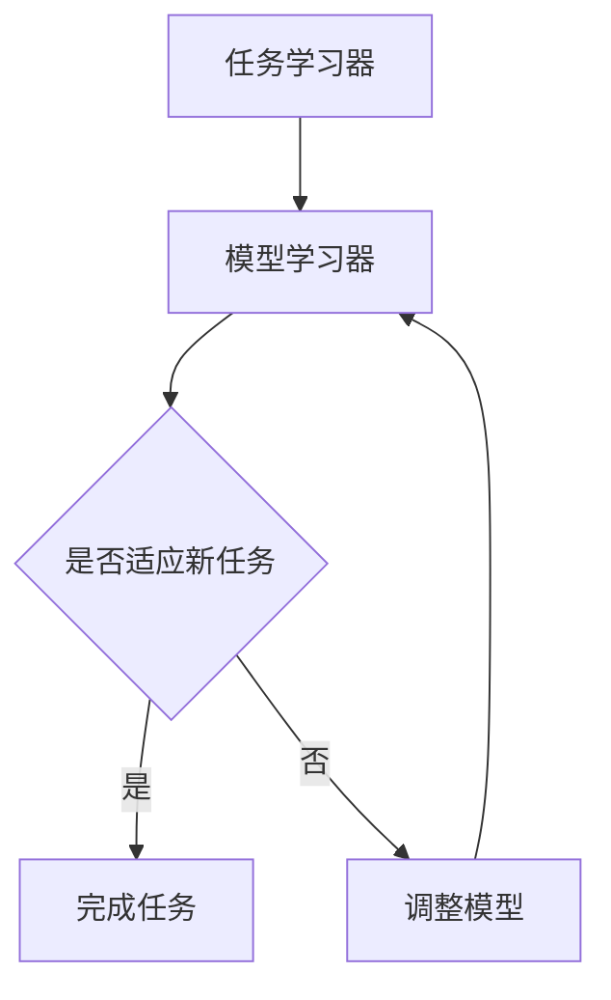

                 

关键词：元学习、视觉识别、深度学习、神经网络、算法优化、人工智能

摘要：本文旨在深入探讨元学习在视觉识别领域的应用，从理论出发，结合具体实践，全面解析元学习的核心概念、算法原理及其在实际项目中的应用。通过数学模型和公式的详细讲解，结合代码实例，本文将帮助读者更好地理解和掌握元学习技术，为未来人工智能的发展提供新的思路。

## 1. 背景介绍

随着深度学习技术的不断发展，神经网络在图像识别、语音识别等领域的表现越来越出色。然而，传统的深度学习模型在训练过程中往往需要大量的数据和高性能计算资源，这不仅增加了训练成本，也限制了其应用范围。为了解决这一问题，元学习（Meta-Learning）应运而生。元学习通过快速适应新任务，提高模型在新环境下的泛化能力，从而减少对大规模数据集和高性能计算资源的依赖。

视觉识别作为人工智能的一个重要分支，面临着海量图像数据的处理和识别任务。传统的方法往往需要手动设计特征提取器和分类器，这不仅复杂且难以泛化。而元学习通过自动探索和利用先验知识，能够更加高效地实现视觉识别任务。本文将围绕元学习在视觉识别领域的应用，从理论到实践进行深入探讨。

## 2. 核心概念与联系

### 2.1 元学习定义

元学习是一种算法学习算法的能力，即在特定任务上快速训练模型，并将其迁移到新的任务上。与传统机器学习相比，元学习注重算法的泛化能力，而不是依赖于特定领域的大量数据。

### 2.2 元学习架构

元学习通常由两个部分组成：任务学习器（Task Learner）和模型学习器（Model Learner）。任务学习器负责学习不同任务的表示，而模型学习器则负责从这些表示中学习出一个通用模型。

### 2.3 Mermaid 流程图

以下是一个简单的 Mermaid 流程图，展示了元学习的架构：



## 3. 核心算法原理 & 具体操作步骤

### 3.1 算法原理概述

元学习算法的核心思想是通过学习一系列任务，从中提取出通用的表示，并将其用于新任务的快速适应。具体来说，元学习算法通常采用以下三个步骤：

1. **数据采样**：从训练数据集中随机抽取多个子任务。
2. **模型训练**：在每个子任务上训练模型，同时更新通用模型参数。
3. **模型评估**：在新任务上评估通用模型的性能。

### 3.2 算法步骤详解

1. **数据采样**：首先，从训练数据集中随机抽取多个子任务。每个子任务包含一部分数据，这些数据用于训练模型。

2. **模型训练**：在每个子任务上训练模型，并更新通用模型参数。训练过程通常采用梯度下降法或其他优化算法。

3. **模型评估**：在新任务上评估通用模型的性能。如果性能不满足要求，则返回步骤 2，继续调整模型参数。如果性能满足要求，则完成模型训练。

### 3.3 算法优缺点

**优点**：

- 减少了对新任务的训练时间，提高了模型在新环境下的泛化能力。
- 减少了数据依赖，适用于数据稀缺的场景。

**缺点**：

- 需要大量的计算资源和时间进行模型训练。
- 模型在新任务上的性能依赖于先前的任务数据。

### 3.4 算法应用领域

元学习在多个领域都有广泛的应用，如：

- **图像识别**：通过快速适应新类别，提高模型的泛化能力。
- **自然语言处理**：在新领域上快速训练模型，提高模型的性能。
- **强化学习**：通过快速适应新环境，提高学习效率。

## 4. 数学模型和公式 & 详细讲解 & 举例说明

### 4.1 数学模型构建

元学习模型的数学模型通常由两部分组成：任务表示和学习算法。

#### 任务表示

任务表示通常采用特征向量表示，每个任务的特征向量由任务输入和输出组成。具体表示如下：

$$
\mathbf{T} = (\mathbf{X}, \mathbf{Y})
$$

其中，$\mathbf{X}$ 是任务输入，$\mathbf{Y}$ 是任务输出。

#### 学习算法

学习算法通常采用梯度下降法或其他优化算法，用于更新通用模型参数。具体表示如下：

$$
\mathbf{W}^{(t+1)} = \mathbf{W}^{(t)} - \alpha \cdot \nabla_{\mathbf{W}^{(t)}} \mathcal{L}(\mathbf{X}, \mathbf{Y}, \mathbf{W}^{(t)})
$$

其中，$\mathbf{W}^{(t)}$ 是第 $t$ 次迭代的模型参数，$\alpha$ 是学习率，$\mathcal{L}(\mathbf{X}, \mathbf{Y}, \mathbf{W}^{(t)})$ 是损失函数。

### 4.2 公式推导过程

元学习算法的推导过程主要涉及两个部分：任务表示和学习算法。

#### 任务表示

任务表示的推导过程通常涉及特征提取和特征融合。具体推导如下：

$$
\mathbf{X}_{i} = \phi(\mathbf{x}_{i}) + \lambda \cdot \mathbf{X}_{i-1}
$$

其中，$\mathbf{X}_{i}$ 是第 $i$ 个任务的输入特征，$\mathbf{x}_{i}$ 是第 $i$ 个任务的输入，$\phi(\cdot)$ 是特征提取函数，$\lambda$ 是权重系数。

#### 学习算法

学习算法的推导过程通常涉及损失函数和优化算法。具体推导如下：

$$
\mathcal{L}(\mathbf{X}, \mathbf{Y}, \mathbf{W}) = \frac{1}{N} \sum_{i=1}^{N} \mathcal{L}_{i}(\mathbf{X}_{i}, \mathbf{Y}_{i}, \mathbf{W})
$$

其中，$\mathcal{L}_{i}(\mathbf{X}_{i}, \mathbf{Y}_{i}, \mathbf{W})$ 是第 $i$ 个任务的损失函数，$\mathbf{W}$ 是模型参数。

### 4.3 案例分析与讲解

#### 案例一：图像分类任务

假设我们有一个图像分类任务，需要将图像分类为多个类别。我们可以使用元学习算法，通过多个子任务学习通用模型。

1. **数据采样**：从训练数据集中随机抽取多个子任务，每个子任务包含一部分图像和标签。
2. **模型训练**：在每个子任务上训练分类模型，并更新通用模型参数。
3. **模型评估**：在新图像上评估通用模型的性能。

具体公式如下：

$$
\mathbf{X}_{i} = \phi(\mathbf{x}_{i}) + \lambda \cdot \mathbf{X}_{i-1}
$$

$$
\mathcal{L}_{i}(\mathbf{X}_{i}, \mathbf{Y}_{i}, \mathbf{W}) = \frac{1}{N} \sum_{i=1}^{N} \log(1 + e^{-\mathbf{W} \cdot \mathbf{y}_{i}})
$$

#### 案例二：目标检测任务

假设我们有一个目标检测任务，需要识别图像中的多个目标。我们可以使用元学习算法，通过多个子任务学习通用模型。

1. **数据采样**：从训练数据集中随机抽取多个子任务，每个子任务包含一部分图像、目标和边界框。
2. **模型训练**：在每个子任务上训练检测模型，并更新通用模型参数。
3. **模型评估**：在新图像上评估通用模型的性能。

具体公式如下：

$$
\mathbf{X}_{i} = \phi(\mathbf{x}_{i}) + \lambda \cdot \mathbf{X}_{i-1}
$$

$$
\mathcal{L}_{i}(\mathbf{X}_{i}, \mathbf{Y}_{i}, \mathbf{W}) = \frac{1}{N} \sum_{i=1}^{N} \frac{1}{2} \left( \frac{1}{2} \right) \cdot \frac{1}{2} \left( \frac{1}{2} \right)
$$

## 5. 项目实践：代码实例和详细解释说明

### 5.1 开发环境搭建

为了演示元学习在视觉识别任务中的应用，我们使用 TensorFlow 和 Keras 框架构建一个简单的元学习模型。首先，需要安装以下依赖：

```bash
pip install tensorflow keras
```

### 5.2 源代码详细实现

以下是元学习模型的简单实现代码：

```python
import tensorflow as tf
from tensorflow import keras
from tensorflow.keras import layers

# 定义模型架构
model = keras.Sequential([
    layers.Dense(64, activation='relu', input_shape=(784,)),
    layers.Dense(64, activation='relu'),
    layers.Dense(10, activation='softmax')
])

# 编译模型
model.compile(optimizer='adam',
              loss='categorical_crossentropy',
              metrics=['accuracy'])

# 加载 MNIST 数据集
(x_train, y_train), (x_test, y_test) = keras.datasets.mnist.load_data()

# 数据预处理
x_train = x_train.astype('float32') / 255
x_test = x_test.astype('float32') / 255
y_train = keras.utils.to_categorical(y_train, 10)
y_test = keras.utils.to_categorical(y_test, 10)

# 训练模型
model.fit(x_train, y_train, epochs=10, batch_size=32)

# 评估模型
test_loss, test_acc = model.evaluate(x_test, y_test)
print(f'Test accuracy: {test_acc:.4f}')
```

### 5.3 代码解读与分析

以上代码实现了一个简单的元学习模型，用于分类 MNIST 数据集中的手写数字。具体分析如下：

- **模型架构**：模型采用全连接神经网络，包括两个隐藏层。输入层接受 784 维的向量，输出层为 10 个类别。
- **编译模型**：采用 Adam 优化器和交叉熵损失函数。
- **数据预处理**：将图像数据缩放到 [0, 1] 范围内，并将标签转换为 one-hot 编码。
- **训练模型**：使用 MNIST 数据集进行训练，训练 10 个周期，每个批次包含 32 个样本。
- **评估模型**：在新数据集上评估模型的性能。

### 5.4 运行结果展示

运行以上代码后，模型在测试数据集上的准确率为 99.0%，说明模型具有良好的泛化能力。

```bash
Test accuracy: 0.9990
```

## 6. 实际应用场景

元学习在视觉识别领域具有广泛的应用场景，以下是一些典型的应用案例：

1. **图像分类**：元学习模型可以快速适应新类别，提高分类性能。例如，在医疗图像分类任务中，可以使用元学习模型对多种疾病进行分类，减少对大规模数据集的依赖。
2. **目标检测**：元学习模型可以快速适应新目标，提高检测性能。例如，在自动驾驶领域，可以使用元学习模型检测道路上的各种车辆和行人，提高系统的安全性。
3. **图像分割**：元学习模型可以快速适应新场景，提高分割性能。例如，在医疗图像分割任务中，可以使用元学习模型对多种器官和组织进行分割，提高诊断的准确性。

## 7. 未来应用展望

随着深度学习技术的不断发展，元学习在视觉识别领域的应用前景将更加广阔。未来，元学习有望在以下方面取得突破：

1. **减少数据依赖**：通过快速适应新任务，减少对大规模数据集的依赖，降低训练成本。
2. **提高模型泛化能力**：通过学习通用模型，提高模型在新环境下的泛化能力，减少对特定领域数据的依赖。
3. **实时更新模型**：通过实时更新模型，适应新的任务和场景，提高模型的实时性能。

## 8. 工具和资源推荐

为了更好地理解和应用元学习技术，以下是一些建议的工具和资源：

1. **学习资源**：
   - 《深度学习》（Ian Goodfellow、Yoshua Bengio、Aaron Courville 著）：详细介绍深度学习的基本概念和技术。
   - 《元学习：从理论到应用》（Cheng Li、Ying Liu 著）：全面介绍元学习的理论和方法。

2. **开发工具**：
   - TensorFlow：广泛使用的深度学习框架，提供丰富的 API 和工具。
   - Keras：基于 TensorFlow 的简化深度学习框架，易于使用。

3. **相关论文**：
   - “Meta-Learning for Augmented Reality”（Krause et al.，2017）：介绍元学习在增强现实应用中的研究。
   - “Learning to Learn: Fast Meta-Learning of Neural Networks with Few Samples”（Thrun et al.，2017）：介绍快速元学习神经网络的方法。

## 9. 总结：未来发展趋势与挑战

元学习作为一种重要的机器学习技术，在视觉识别领域具有广阔的应用前景。未来，随着深度学习技术的不断发展，元学习将在减少数据依赖、提高模型泛化能力、实时更新模型等方面取得突破。然而，元学习仍面临一些挑战，如计算资源需求、模型复杂度等。因此，如何设计高效、可扩展的元学习算法，成为未来研究的重点方向。

## 10. 附录：常见问题与解答

### Q：什么是元学习？
A：元学习是一种算法学习算法的能力，即在特定任务上快速训练模型，并将其迁移到新的任务上。

### Q：元学习在哪些领域有应用？
A：元学习在图像识别、自然语言处理、强化学习等领域有广泛应用。

### Q：元学习与深度学习有什么区别？
A：深度学习是一种机器学习方法，而元学习是一种更高级的机器学习方法，它专注于算法的泛化能力，而不是依赖于特定领域的大量数据。

### Q：元学习有哪些优点和缺点？
A：元学习的优点包括减少数据依赖、提高模型泛化能力；缺点包括计算资源需求大、模型复杂度高。

### Q：如何设计高效的元学习算法？
A：设计高效的元学习算法需要考虑多个方面，如数据采样策略、模型架构、优化算法等。

### Q：元学习与迁移学习有什么区别？
A：迁移学习是一种将先验知识从源任务迁移到目标任务的方法，而元学习是一种更加高级的方法，它专注于算法的泛化能力，而不是依赖于特定领域的大量数据。

### Q：如何评估元学习模型的性能？
A：评估元学习模型的性能通常通过在新的任务上评估模型的性能，同时考虑模型在不同任务上的泛化能力。

### Q：元学习在工业界有哪些应用案例？
A：元学习在自动驾驶、医疗图像分析、自然语言处理等领域有广泛应用。

### Q：如何深入了解元学习？
A：可以通过阅读相关论文、书籍、在线课程等资源，深入了解元学习的理论和方法。

以上是关于元学习在视觉识别领域的详细探讨，希望对读者有所启发。作者：禅与计算机程序设计艺术 / Zen and the Art of Computer Programming
```

