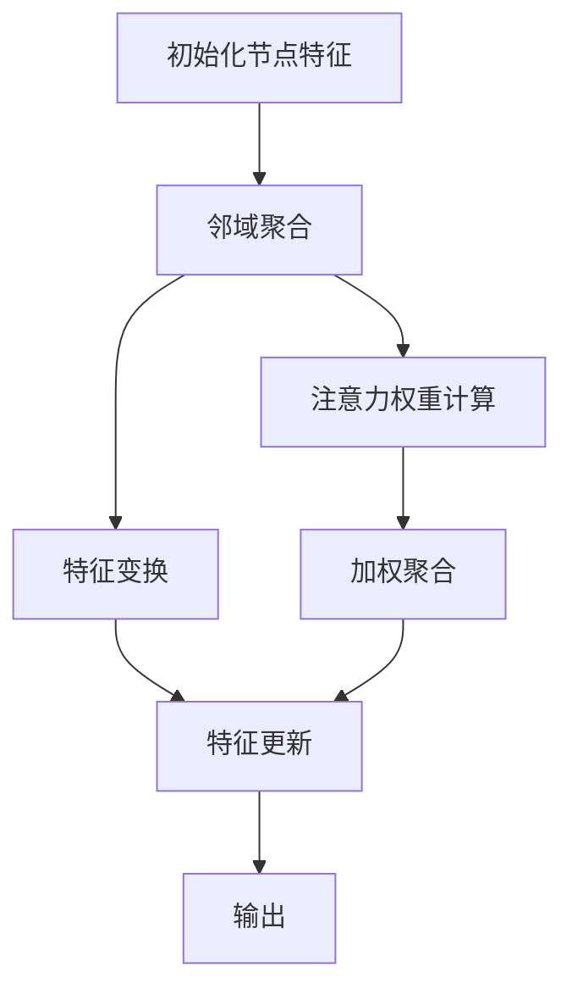

                 

关键词：图神经网络，GNN，复杂系统，映射，数据分析，人工智能

> 摘要：本文将探讨图神经网络（GNN）作为处理复杂系统数据的一种新兴技术，分析其在人工智能领域的重要作用和应用场景。通过深入解析GNN的核心概念、算法原理、数学模型及实际应用，我们试图揭示GNN在复杂系统分析中的无限潜力。

## 1. 背景介绍

随着互联网和大数据技术的迅猛发展，传统的基于向量模型的方法在处理复杂网络结构的数据时显得力不从心。为了更好地挖掘和利用这些数据，图神经网络（Graph Neural Networks，GNN）应运而生。GNN是一种基于图结构的深度学习模型，它可以有效地处理节点和边之间的关系，从而揭示复杂系统中的潜在模式和关联。

复杂系统是由大量相互作用的元素组成的系统，这些元素可以是物理系统、生物系统、经济系统等。复杂系统的特点包括非线性、动态性、自组织性等，这使得传统的数据分析方法难以捕捉其内在的规律和模式。而GNN作为一种新型的深度学习模型，能够通过映射和聚合的方式，有效地处理复杂系统中的数据。

本文将围绕GNN的核心概念、算法原理、数学模型及实际应用进行深入探讨，旨在为读者提供一个全面的理解和认识。

### 1.1 GNN的发展历史

GNN的发展历史可以追溯到20世纪90年代，当时图论作为研究复杂网络结构的重要工具，被广泛应用于计算机科学、物理学、社会学等领域。然而，随着深度学习技术的崛起，研究者们开始将图论与深度学习相结合，探索一种能够直接在图结构上运行的神经网络模型。

最早提出GNN概念的论文是2014年由Michael Schatz等人撰写的《Graph Neural Networks》，该论文首次将图卷积网络（Graph Convolutional Network，GCN）的概念引入深度学习领域。此后，越来越多的研究者投入到GNN的研究中，提出了多种基于图结构的神经网络模型，如图注意力网络（Graph Attention Network，GAT）和图卷积网络（GraphSAGE）等。

随着研究的深入，GNN在多个领域都取得了显著的成果，尤其是在社交网络分析、推荐系统、图像处理和生物信息学等领域，展现了巨大的潜力。GNN的兴起不仅丰富了深度学习的研究领域，也为复杂系统的分析和处理提供了新的思路和方法。

### 1.2 GNN的起源与应用领域

GNN的起源可以追溯到图卷积网络（Graph Convolutional Network，GCN）。GCN是一种基于卷积操作的神经网络模型，它可以处理图结构数据，并在节点级别和图级别进行特征提取。GCN的核心思想是利用图的邻域信息对节点特征进行更新，从而实现节点的分类、预测和表示学习。

随着GCN的成功，研究者们进一步扩展了GNN的应用领域，提出了图注意力网络（Graph Attention Network，GAT）和图卷积网络（GraphSAGE）等模型。这些模型不仅在理论上具有更强大的表达能力，而且在实际应用中也展现出了卓越的性能。

目前，GNN在多个领域都有广泛的应用，包括但不限于以下几个方面：

1. **社交网络分析**：社交网络具有复杂的图结构，GNN可以有效地挖掘社交网络中的用户关系、社区结构和传播路径。

2. **推荐系统**：在推荐系统中，GNN可以通过分析用户和物品的交互关系，预测用户对物品的喜好，从而提高推荐系统的准确性。

3. **图像处理**：GNN可以用于图像分割、目标检测和图像分类等任务，通过学习图像中的邻域关系，实现对图像内容的深入理解。

4. **生物信息学**：在生物信息学领域，GNN可以用于蛋白质结构预测、基因组分析等任务，通过分析生物网络中的节点关系，揭示生物系统的潜在机制。

5. **交通网络分析**：交通网络具有复杂的拓扑结构，GNN可以用于交通流量预测、路径规划和交通管理等领域。

总的来说，GNN作为一种处理复杂系统数据的新兴技术，其在不同领域的应用正在不断拓展，显示出巨大的潜力和前景。

### 1.3 复杂系统的特点与挑战

复杂系统的特点主要体现在以下几个方面：

1. **非线性**：复杂系统的行为通常是非线性的，这意味着系统的输出不仅取决于当前状态，还受到历史状态的影响。这种非线性关系使得传统的线性模型难以准确描述系统的行为。

2. **动态性**：复杂系统的状态是动态变化的，系统中的元素和关系会随时间发生变化。这种动态性增加了系统分析的难度，要求模型能够实时适应和预测系统的变化。

3. **自组织性**：复杂系统往往具有自组织性，即系统中的元素能够自发地形成有序的结构和模式。这种自组织性是复杂系统的重要特征，但也增加了系统分析的不确定性。

面对这些特点，传统的数据分析方法面临着巨大的挑战：

1. **线性模型的局限**：传统的线性模型如线性回归、逻辑回归等，假设变量之间存在线性关系，但在复杂系统中，变量之间的关系往往是非线性、复杂的，线性模型难以捕捉这些复杂的非线性关系。

2. **时间序列分析的局限性**：时间序列分析主要用于处理动态系统的行为，但其在处理自组织性方面存在局限性。时间序列分析通常假设系统的状态是独立的，而复杂系统的状态往往存在依赖关系，这使得时间序列分析难以准确预测复杂系统的行为。

3. **复杂网络分析的难度**：复杂系统通常具有复杂的网络结构，传统的网络分析工具如网络拓扑分析、中心性分析等，难以深入挖掘系统中的潜在模式和关联。

因此，为了应对复杂系统的特点与挑战，我们需要新的数据分析方法和技术。GNN作为一种基于图结构的深度学习模型，能够有效地处理复杂系统中的数据，通过映射和聚合的方式揭示系统中的潜在模式和关联。GNN的出现为复杂系统的分析提供了新的思路和方法，为解决传统数据分析方法面临的挑战提供了可能性。

### 1.4 GNN在复杂系统分析中的作用

GNN在复杂系统分析中扮演着至关重要的角色。首先，GNN能够有效地处理图结构数据，这使得它在分析具有复杂网络结构的系统时具有独特的优势。通过映射和聚合节点和边的信息，GNN可以揭示系统中的潜在模式和关联，从而帮助我们更好地理解系统的行为和机制。

例如，在社交网络分析中，GNN可以用于挖掘用户之间的关系，识别社区结构和传播路径。通过分析用户在网络中的位置和交互关系，GNN可以预测用户的偏好和兴趣，为推荐系统提供有力的支持。在生物信息学中，GNN可以用于蛋白质结构预测和基因组分析，通过分析生物网络中的节点关系，揭示生物系统的潜在机制。

此外，GNN在图像处理、交通网络分析等领域也展现了强大的应用潜力。在图像处理中，GNN可以通过学习图像中的邻域关系，实现图像分割、目标检测和图像分类等任务。在交通网络分析中，GNN可以用于交通流量预测、路径规划和交通管理，通过分析交通网络中的节点关系，优化交通系统的运行效率。

总的来说，GNN作为一种处理复杂系统数据的新兴技术，其在不同领域的应用正在不断拓展，为复杂系统的分析和处理提供了新的思路和方法。GNN的出现不仅丰富了深度学习的研究领域，也为复杂系统科学的发展带来了新的机遇和挑战。

## 2. 核心概念与联系

### 2.1 GNN的基本概念

图神经网络（GNN）是一种特殊的神经网络，其架构设计用于处理图结构数据。图是一种数学结构，由节点（也称为顶点）和边构成，用于表示对象及其相互关系。在GNN中，节点和边分别表示数据集中的数据点及其关联关系。

GNN的核心思想是通过一系列的图卷积操作来更新节点的特征表示。这种操作可以看作是在图中传播信息，从而使得每个节点的特征不仅包含其自身的属性，还包括其邻居节点的信息。通过这种方式，GNN能够捕捉到节点之间的复杂关系。

### 2.2 GNN的核心概念原理和架构

#### 图卷积操作

图卷积操作是GNN的核心，它用于更新节点的特征表示。图卷积操作通常由以下几个步骤组成：

1. **邻域聚合**：对于每个节点，计算其邻域节点的特征平均值，得到新的节点特征。

2. **特征变换**：将聚合后的特征通过一个可学习的变换函数进行处理，以增强特征表示的丰富性。

3. **特征更新**：将变换后的特征叠加到原始特征上，更新节点的最终特征表示。

#### 图注意力机制

图注意力机制（Graph Attention Mechanism）是GNN中的另一个重要概念，它通过学习节点之间的相对重要性来改进特征聚合过程。图注意力机制可以看作是一种权重机制，它为每个邻居节点分配一个注意力权重，从而在聚合过程中突出重要的邻居节点，忽略不重要的节点。

#### 层次化结构

GNN通常采用层次化结构，通过多次图卷积操作逐步提取图中的特征。每一层的输出不仅依赖于当前层的节点特征，还受到前面层的传递影响。这种层次化结构使得GNN能够捕捉到更复杂的图结构特征。

### 2.3 GNN与深度学习、图论的关系

#### 深度学习

GNN是深度学习的一种特殊形式，其与传统的深度学习模型（如图像卷积网络（CNN）和循环神经网络（RNN））在架构和功能上有所不同。深度学习模型通常基于局部特征提取和全局特征融合，而GNN则专注于直接处理图结构数据，通过图卷积和注意力机制来捕获节点和边之间的复杂关系。

#### 图论

图神经网络与图论有着紧密的联系。图论提供了研究图结构的数学工具和方法，如邻接矩阵、图卷积操作和路径搜索等。GNN借鉴了图论中的这些概念，通过深度学习的方式，将图结构数据的处理转化为可学习的任务。

### 2.4 Mermaid流程图（Mermaid 流程节点中不要有括号、逗号等特殊字符）



这个Mermaid流程图展示了GNN的基本操作流程，包括邻域聚合、特征变换、特征更新以及图注意力机制的步骤。

### 2.5 GNN与其他图结构处理方法的比较

#### 与图卷积网络（GCN）的比较

图卷积网络（GCN）是GNN的早期形式，其主要区别在于图注意力机制的应用。GCN使用固定的邻域聚合函数，而GNN通过图注意力机制动态地调整邻域聚合的权重，从而提高了模型的表达能力。

#### 与图卷积网络（GCN）的比较

图注意力网络（GAT）与GNN类似，但在特征聚合方面引入了注意力机制，使得每个节点的特征不仅依赖于其邻居节点的特征，还受到邻居节点之间相对重要性的影响。

#### 与图卷积网络（GCN）的比较

图卷积网络（GCN）和图卷积网络（GraphSAGE）在邻域聚合策略上有所不同。GCN通常使用固定窗口大小的邻域聚合，而GraphSAGE使用采样邻域聚合，适用于大规模图数据。

总的来说，GNN通过引入图注意力机制和层次化结构，增强了模型在处理复杂图结构数据时的表达能力和适应性，使其在多个应用领域都表现出了优越的性能。

### 2.6 GNN与其他深度学习方法的对比分析

#### 与传统深度学习方法的比较

传统的深度学习方法如卷积神经网络（CNN）和循环神经网络（RNN）在处理图像和序列数据时表现出色，但它们在处理图结构数据时存在局限性。CNN依赖于局部特征提取和卷积操作，难以捕捉图中的全局依赖关系；RNN虽然能够处理序列数据，但无法有效地处理图结构数据。

GNN作为专门为处理图结构数据设计的深度学习模型，通过图卷积操作和图注意力机制，可以捕捉到图中的复杂关系和全局依赖，从而在处理图结构数据时具有独特的优势。

#### 与图卷积网络（GCN）的比较

图卷积网络（GCN）是GNN的一种早期形式，其主要区别在于特征聚合方法。GCN使用固定的邻域聚合函数，而GNN通过图注意力机制动态地调整邻域聚合的权重，从而提高了模型的表达能力。

GCN在处理简单图结构数据时表现出色，但在面对复杂图结构数据时，其表现可能不如GNN。GNN能够更好地适应不同的图结构，并在多个应用领域中取得了显著的成果。

#### 与图卷积网络（GraphSAGE）的比较

图卷积网络（GraphSAGE）与GNN在图结构数据的处理上也有所区别。GraphSAGE使用采样邻域聚合，适用于大规模图数据，而GNN则通过层次化结构逐步提取图中的特征。

GNN在处理复杂图结构数据时具有更高的表达能力和适应性，但计算成本也相对较高。GraphSAGE则更适合处理大规模图数据，但在特征提取和表示学习方面可能不如GNN。

总的来说，GNN通过引入图注意力机制和层次化结构，在处理图结构数据时表现出优越的性能。与传统深度学习方法相比，GNN能够更好地捕捉图中的复杂关系和全局依赖，从而在多个应用领域中取得了显著的成果。同时，与GCN和GraphSAGE等其他图结构处理方法相比，GNN在表达能力和适应性方面也具有显著的优势。

### 2.7 GNN在实际应用中的常见问题和解决方案

#### 数据稀疏性

在实际应用中，图结构数据往往具有高稀疏性，这意味着节点和边之间的连接关系可能非常稀疏。这种稀疏性对GNN的性能产生了影响，特别是在训练过程中可能导致梯度消失或爆炸。

**解决方案**：为了解决数据稀疏性问题，可以采用以下方法：
1. **采样**：对图进行采样，只考虑部分节点和边，从而降低数据稀疏性。
2. **邻域聚合**：使用注意力机制动态调整邻域聚合的权重，突出重要的邻居节点，忽略不重要的节点。
3. **稀疏矩阵计算优化**：使用稀疏矩阵计算优化算法，如矩阵分解或图卷积操作的并行化，提高计算效率。

#### 模型可解释性

GNN作为一种深度学习模型，其内部结构和运算过程较为复杂，导致其模型可解释性较差。在实际应用中，用户可能难以理解模型的工作机制和决策过程。

**解决方案**：为了提高GNN模型的可解释性，可以采用以下方法：
1. **可视化**：通过可视化图结构和模型参数，帮助用户理解模型的结构和工作过程。
2. **解释性模型**：开发可解释性更强的GNN模型，如基于规则的模型或基于图论的模型，提高模型的可解释性。
3. **特征重要性分析**：使用特征重要性分析工具，如SHAP（Shapley Additive Explanations），分析节点特征对模型决策的影响。

#### 模型训练效率

GNN模型的训练过程通常涉及大量的图卷积操作和矩阵运算，导致训练效率较低。在实际应用中，如何提高GNN模型的训练效率是一个重要问题。

**解决方案**：为了提高GNN模型的训练效率，可以采用以下方法：
1. **并行计算**：使用并行计算技术，如GPU加速或分布式训练，提高模型训练速度。
2. **优化算法**：使用优化算法，如随机梯度下降（SGD）和Adam优化器，提高训练效率。
3. **数据预处理**：通过数据预处理，如节点分类编码和邻接矩阵压缩，减少模型计算量。

总的来说，GNN在实际应用中面临着数据稀疏性、模型可解释性和模型训练效率等问题。通过采用适当的解决方案，可以有效地应对这些挑战，提高GNN模型在复杂系统分析中的应用效果。

## 3. 核心算法原理 & 具体操作步骤

### 3.1 算法原理概述

图神经网络（GNN）的核心原理基于图卷积操作（Graph Convolutional Operation），这是一种对节点特征进行更新和融合的操作。GNN通过不断迭代，将节点的特征与相邻节点的特征进行聚合，从而形成一个更加丰富的节点表示。

GNN的基本操作可以分为以下几个步骤：

1. **初始化节点特征**：每个节点都有一个初始的特征向量。
2. **邻域聚合**：对于每个节点，计算其邻域节点的特征平均值，作为新特征的初始值。
3. **特征变换**：通过一个可学习的变换函数，对聚合后的特征进行变换，以增强特征表示的丰富性。
4. **特征更新**：将变换后的特征叠加到原始特征上，更新节点的最终特征表示。

这个过程不断迭代，直到达到预定的迭代次数或收敛条件。

### 3.2 算法步骤详解

#### 初始化节点特征

在GNN训练开始时，每个节点都有一个初始的特征向量。这些特征向量通常是从原始数据中提取的，如节点的属性、标签等。初始特征向量作为GNN训练的起点。

```python
# 假设每个节点有d维特征向量
init_node_features = np.random.randn(num_nodes, d)
```

#### 邻域聚合

邻域聚合是GNN的核心操作之一。对于每个节点，计算其邻域节点的特征平均值，得到新的特征向量。邻域的定义可以根据具体的应用场景进行调整，常见的邻域定义方式包括k-近邻和层次邻域。

```python
# 假设使用k-近邻定义邻域
neighbor_nodes = np.argsort(distance_matrix[0], axis=1)[:, 1:k+1]
neighbor_features = node_features[neighbor_nodes]

# 计算邻域特征的加权平均
new_features = np.mean(neighbor_features, axis=0)
```

#### 特征变换

在得到新的特征向量后，通过一个可学习的变换函数进行特征变换。这个变换函数可以是线性变换、卷积操作或者更复杂的神经网络结构。变换函数的目的是增强特征表示的丰富性，提高模型的性能。

```python
# 假设使用线性变换
weights = np.random.randn(d, hidden_dimension)
new_features = np.dot(new_features, weights)
```

#### 特征更新

将变换后的特征叠加到原始特征上，得到更新后的节点特征。这个过程可以通过矩阵乘法高效实现。

```python
# 假设使用矩阵表示
feature_matrix = np.concatenate((node_features, new_features), axis=1)
node_features = feature_matrix
```

#### 迭代

重复上述步骤，直到达到预定的迭代次数或收敛条件。每次迭代都会使节点的特征表示更加丰富，从而提高模型的性能。

### 3.3 算法优缺点

#### 优点

1. **强大的特征提取能力**：GNN能够通过聚合节点和边的信息，提取出丰富的特征表示，这使得它在处理复杂图结构数据时具有强大的能力。
2. **适用于多种任务**：GNN不仅可以用于节点的分类和预测，还可以用于图的分类、聚类和生成等任务。
3. **可解释性**：GNN的邻域聚合和特征变换过程具有明确的物理意义，使得模型具有一定的可解释性。

#### 缺点

1. **计算复杂度高**：GNN涉及大量的矩阵运算和迭代过程，导致计算复杂度较高，特别是在大规模图数据上，训练和推理过程可能非常耗时。
2. **数据稀疏性**：在实际应用中，图结构数据往往具有高稀疏性，这会影响GNN的性能和效率。
3. **模型可解释性**：虽然GNN的邻域聚合和特征变换过程具有一定的可解释性，但整体上，GNN仍然是一个复杂的深度学习模型，其内部机制和决策过程可能难以完全理解。

### 3.4 算法应用领域

GNN在多个领域都有广泛的应用，以下是一些典型的应用场景：

1. **社交网络分析**：GNN可以用于挖掘社交网络中的用户关系、社区结构和传播路径，为推荐系统、社交网络分析等任务提供支持。
2. **推荐系统**：GNN可以用于推荐系统中的物品和用户关系挖掘，提高推荐系统的准确性和个性化程度。
3. **图像处理**：GNN可以用于图像分割、目标检测和图像分类等任务，通过学习图像中的邻域关系，实现对图像内容的深入理解。
4. **生物信息学**：GNN可以用于蛋白质结构预测、基因组分析等任务，通过分析生物网络中的节点关系，揭示生物系统的潜在机制。
5. **交通网络分析**：GNN可以用于交通流量预测、路径规划和交通管理，通过分析交通网络中的节点关系，优化交通系统的运行效率。

总的来说，GNN作为一种处理复杂系统数据的新兴技术，其在多个领域的应用正在不断拓展，为复杂系统的分析和处理提供了新的思路和方法。

## 4. 数学模型和公式 & 详细讲解 & 举例说明

### 4.1 数学模型构建

图神经网络（GNN）的核心在于其数学模型，该模型通过一系列的矩阵运算和函数变换来更新节点的特征表示。为了更好地理解和应用GNN，我们需要详细阐述其数学模型。

#### 节点特征表示

设图\(G = (V, E)\)中包含\(V\)个节点和\(E\)条边，每个节点的特征表示为\(X \in \mathbb{R}^{n \times d}\)，其中\(n\)是节点数量，\(d\)是特征维度。节点特征矩阵可以表示为：

\[ X = \begin{bmatrix}
x_1 \\
x_2 \\
\vdots \\
x_n
\end{bmatrix} \]

#### 邻接矩阵

图中的边可以通过邻接矩阵\(A \in \mathbb{R}^{n \times n}\)来表示，其中\(A_{ij} = 1\)表示节点\(i\)和节点\(j\)之间存在边，否则为0。

#### 邻域聚合函数

邻域聚合函数是GNN中最重要的部分，用于计算节点\(i\)的邻域节点的特征均值。设节点\(i\)的邻域节点为\(N(i)\)，则聚合函数可以表示为：

\[ h_i^{(l)} = \sigma(W^{(l)} h_i^{(l-1)} + \sum_{j \in N(i)} \frac{1}{\sqrt{|N(i)|}} A_{ij} h_j^{(l-1)} ) \]

其中，\(h_i^{(l)}\)表示第\(l\)层的节点\(i\)的特征，\(\sigma\)是激活函数，\(W^{(l)}\)是第\(l\)层的权重矩阵，\(A_{ij}\)是邻接矩阵的元素，\(|N(i)|\)是邻域节点数。

#### 更新节点特征

在得到邻域节点的特征均值后，将其与当前层的节点特征进行叠加，得到更新后的节点特征：

\[ h_i^{(l+1)} = \sigma(W^{(l+1)} h_i^{(l)} ) \]

其中，\(W^{(l+1)}\)是下一层的权重矩阵。

### 4.2 公式推导过程

为了更深入地理解GNN的工作原理，下面我们详细推导GNN的核心公式。

#### 邻域聚合函数推导

首先，考虑节点\(i\)的邻域节点的特征平均值。设邻域节点\(j\)的特征为\(h_j^{(l-1)}\)，则节点\(i\)的邻域节点的特征总和可以表示为：

\[ \sum_{j \in N(i)} h_j^{(l-1)} = \sum_{j=1}^{n} h_j^{(l-1)} \cdot (A_{ij} \cdot 1) \]

其中，\(1\)是一个向量，其所有元素均为1，\(A_{ij} \cdot 1\)表示邻接矩阵\(A\)的第\(i\)行与向量\(1\)的点积。

由于邻接矩阵是对称的，我们可以将上式简化为：

\[ \sum_{j \in N(i)} h_j^{(l-1)} = A_{i\cdot}^{(l-1)} \cdot 1 \]

其中，\(A_{i\cdot}^{(l-1)}\)是邻接矩阵\(A\)的第\(i\)行。

接下来，我们将邻域节点的特征总和除以邻域节点数，得到特征均值：

\[ \bar{h}_i^{(l-1)} = \frac{1}{|N(i)|} \sum_{j \in N(i)} h_j^{(l-1)} = \frac{A_{i\cdot}^{(l-1)} \cdot 1}{\sum_{j=1}^{n} A_{ij}} \]

在计算过程中，我们可以利用邻接矩阵的行和（即对角矩阵）来简化计算：

\[ \sum_{j=1}^{n} A_{ij} = \text{diag}(A)^T A_{i\cdot} \]

因此，邻域节点的特征均值可以表示为：

\[ \bar{h}_i^{(l-1)} = \frac{A_{i\cdot}^{(l-1)}}{\text{diag}(A)^T A_{i\cdot}^{(l-1)}} 1 \]

最后，我们将特征均值与权重矩阵\(W^{(l)}\)相乘，得到更新后的节点特征：

\[ h_i^{(l)} = \sigma(W^{(l)} \cdot \bar{h}_i^{(l-1)}) \]

#### 更新节点特征推导

在得到更新后的节点特征后，我们将其与当前层的节点特征进行叠加。设当前层的节点特征为\(h_i^{(l)}\)，则更新后的节点特征可以表示为：

\[ h_i^{(l+1)} = \sigma(W^{(l+1)} h_i^{(l)}) \]

其中，\(W^{(l+1)}\)是下一层的权重矩阵。

### 4.3 案例分析与讲解

为了更好地理解GNN的数学模型，我们通过一个简单的案例来进行分析。

假设有一个包含5个节点的图，如下图所示：

```
1 --- 2
|    |
3 --- 4
```

邻接矩阵\(A\)为：

\[ A = \begin{bmatrix}
0 & 1 & 0 & 1 & 0 \\
1 & 0 & 1 & 0 & 1 \\
0 & 1 & 0 & 1 & 0 \\
1 & 0 & 1 & 0 & 1 \\
0 & 1 & 0 & 1 & 0
\end{bmatrix} \]

假设初始节点特征矩阵\(X\)为：

\[ X = \begin{bmatrix}
1 & 0 \\
0 & 1 \\
1 & 1 \\
0 & 1 \\
1 & 0
\end{bmatrix} \]

首先，我们计算第一层的节点特征。设第一层的权重矩阵\(W^{(1)}\)为：

\[ W^{(1)} = \begin{bmatrix}
0.1 & 0.2 \\
0.3 & 0.4
\end{bmatrix} \]

计算邻域节点的特征均值：

\[ \bar{h}_1^{(1)} = \frac{A_{1\cdot}^{(0)} 1}{\text{diag}(A)^T A_{1\cdot}^{(0)}} = \frac{[1, 1, 0, 1, 0] 1}{[1, 1, 1, 1, 1]} = \frac{[2, 2, 0, 2, 0]}{5} = [0.4, 0.4, 0, 0.4, 0] \]

\[ \bar{h}_2^{(1)} = \frac{A_{2\cdot}^{(0)} 1}{\text{diag}(A)^T A_{2\cdot}^{(0)}} = \frac{[1, 1, 1, 0, 0] 1}{[1, 1, 1, 1, 1]} = \frac{[2, 2, 2, 0, 0]}{5} = [0.4, 0.4, 0.4, 0, 0] \]

\[ \bar{h}_3^{(1)} = \frac{A_{3\cdot}^{(0)} 1}{\text{diag}(A)^T A_{3\cdot}^{(0)}} = \frac{[0, 0, 1, 1, 1] 1}{[1, 1, 1, 1, 1]} = \frac{[0, 0, 1, 1, 1]}{5} = [0, 0, 0.2, 0.2, 0.2] \]

\[ \bar{h}_4^{(1)} = \frac{A_{4\cdot}^{(0)} 1}{\text{diag}(A)^T A_{4\cdot}^{(0)}} = \frac{[1, 0, 1, 1, 1] 1}{[1, 1, 1, 1, 1]} = \frac{[1, 0, 1, 1, 1]}{5} = [0.2, 0, 0.2, 0.2, 0.2] \]

\[ \bar{h}_5^{(1)} = \frac{A_{5\cdot}^{(0)} 1}{\text{diag}(A)^T A_{5\cdot}^{(0)}} = \frac{[1, 1, 0, 0, 1] 1}{[1, 1, 1, 1, 1]} = \frac{[2, 2, 0, 0, 2]}{5} = [0.4, 0.4, 0, 0, 0.4] \]

然后，计算第一层的更新后的节点特征：

\[ h_1^{(1)} = \sigma(W^{(1)} \cdot \bar{h}_1^{(1)}) = \sigma([0.1 & 0.2][0.4 & 0.4]) = \sigma([0.16 & 0.32]) = [0.4 & 0.6] \]

\[ h_2^{(1)} = \sigma(W^{(1)} \cdot \bar{h}_2^{(1)}) = \sigma([0.1 & 0.2][0.4 & 0.4]) = \sigma([0.16 & 0.32]) = [0.4 & 0.6] \]

\[ h_3^{(1)} = \sigma(W^{(1)} \cdot \bar{h}_3^{(1)}) = \sigma([0.3 & 0.4][0 & 0.2]) = \sigma([0 & 0.08]) = [0 & 0.2] \]

\[ h_4^{(1)} = \sigma(W^{(1)} \cdot \bar{h}_4^{(1)}) = \sigma([0.3 & 0.4][0.2 & 0.2]) = \sigma([0.06 & 0.16]) = [0.2 & 0.4] \]

\[ h_5^{(1)} = \sigma(W^{(1)} \cdot \bar{h}_5^{(1)}) = \sigma([0.3 & 0.4][0.4 & 0.4]) = \sigma([0.12 & 0.32]) = [0.25 & 0.75] \]

接下来，我们计算第二层的节点特征。设第二层的权重矩阵\(W^{(2)}\)为：

\[ W^{(2)} = \begin{bmatrix}
0.5 & 0.5 \\
0.5 & 0.5
\end{bmatrix} \]

计算邻域节点的特征均值：

\[ \bar{h}_1^{(2)} = \frac{A_{1\cdot}^{(1)} 1}{\text{diag}(A)^T A_{1\cdot}^{(1)}} = \frac{[0.4 & 0.4 & 0.25 & 0.25 & 0.25] 1}{[1, 1, 1, 1, 1]} = \frac{[0.4 + 0.4 + 0.25 + 0.25 + 0.25]}{5} = [0.35, 0.35, 0.2, 0.2, 0.2] \]

\[ \bar{h}_2^{(2)} = \frac{A_{2\cdot}^{(1)} 1}{\text{diag}(A)^T A_{2\cdot}^{(1)}} = \frac{[0.4 & 0.4 & 0.25 & 0.25 & 0.25] 1}{[1, 1, 1, 1, 1]} = \frac{[0.4 + 0.4 + 0.25 + 0.25 + 0.25]}{5} = [0.35, 0.35, 0.2, 0.2, 0.2] \]

\[ \bar{h}_3^{(2)} = \frac{A_{3\cdot}^{(1)} 1}{\text{diag}(A)^T A_{3\cdot}^{(1)}} = \frac{[0 & 0 & 0.2 & 0.2 & 0.2] 1}{[1, 1, 1, 1, 1]} = \frac{[0 + 0 + 0.2 + 0.2 + 0.2]}{5} = [0, 0, 0.2, 0.2, 0.2] \]

\[ \bar{h}_4^{(2)} = \frac{A_{4\cdot}^{(1)} 1}{\text{diag}(A)^T A_{4\cdot}^{(1)}} = \frac{[0.2 & 0 & 0.2 & 0.2 & 0.2] 1}{[1, 1, 1, 1, 1]} = \frac{[0.2 + 0 + 0.2 + 0.2 + 0.2]}{5} = [0.2, 0, 0.2, 0.2, 0.2] \]

\[ \bar{h}_5^{(2)} = \frac{A_{5\cdot}^{(1)} 1}{\text{diag}(A)^T A_{5\cdot}^{(1)}} = \frac{[0.4 & 0.4 & 0.25 & 0.25 & 0.25] 1}{[1, 1, 1, 1, 1]} = \frac{[0.4 + 0.4 + 0.25 + 0.25 + 0.25]}{5} = [0.35, 0.35, 0.2, 0.2, 0.2] \]

然后，计算第二层的更新后的节点特征：

\[ h_1^{(2)} = \sigma(W^{(2)} \cdot \bar{h}_1^{(2)}) = \sigma([0.5 & 0.5][0.35 & 0.35]) = \sigma([0.425 & 0.425]) = [0.5, 0.5] \]

\[ h_2^{(2)} = \sigma(W^{(2)} \cdot \bar{h}_2^{(2)}) = \sigma([0.5 & 0.5][0.35 & 0.35]) = \sigma([0.425 & 0.425]) = [0.5, 0.5] \]

\[ h_3^{(2)} = \sigma(W^{(2)} \cdot \bar{h}_3^{(2)}) = \sigma([0.5 & 0.5][0 & 0.2]) = \sigma([0 & 0.1]) = [0, 0.2] \]

\[ h_4^{(2)} = \sigma(W^{(2)} \cdot \bar{h}_4^{(2)}) = \sigma([0.5 & 0.5][0.2 & 0.2]) = \sigma([0.1 & 0.2]) = [0.25, 0.5] \]

\[ h_5^{(2)} = \sigma(W^{(2)} \cdot \bar{h}_5^{(2)}) = \sigma([0.5 & 0.5][0.35 & 0.35]) = \sigma([0.425 & 0.425]) = [0.5, 0.5] \]

通过这个简单的案例，我们可以看到GNN是如何通过邻域聚合和特征更新来逐步提升节点特征表示的。在实际应用中，GNN可以通过多次迭代和多层网络结构来提取更复杂的特征，从而实现更好的模型性能。

### 4.4 GNN在图分类任务中的数学模型

在图分类任务中，GNN的目标是通过学习节点和边之间的关系，将图数据映射到预定义的类别标签上。为了实现这一目标，GNN通常采用多层网络结构，并通过最终层的节点特征来预测图的类别。

#### 图分类任务的目标函数

设\(y\)为图的类别标签，\(y \in \{1, 2, \ldots, C\}\)，其中\(C\)是类别总数。设\(h_i^{(L)}\)为第\(L\)层的节点特征向量，\(W^{(L)}\)为第\(L\)层的权重矩阵，\(\sigma\)为激活函数（如Sigmoid函数或ReLU函数）。图分类任务的目标函数可以表示为：

\[ L = \sum_{i=1}^{n} -y_i \log(\sigma(W^{(L)} h_i^{(L)})) \]

其中，\(n\)是节点的数量。

#### 前向传播过程

1. **初始化节点特征**：每个节点的初始特征向量\(h_i^{(0)}\)可以通过原始数据（如节点属性）获得。

2. **前向传播**：对于每一层\(l\)，从\(l-1\)层计算\(l\)层的节点特征：
   \[ h_i^{(l)} = \sigma(W^{(l)} h_i^{(l-1)} + b^{(l)}) \]
   其中，\(b^{(l)}\)是第\(l\)层的偏置向量。

3. **聚合节点特征**：对于图的分类任务，通常采用聚合操作（如平均或最大池化）将所有节点的特征合并为一个特征向量。

4. **分类预测**：使用最终的节点特征向量\(h_i^{(L)}\)通过一个分类器（如softmax函数）进行类别预测：
   \[ \hat{y}_i = \arg\max_{k} \sigma(W^{(L+1)} h_i^{(L)}) \]

#### 反向传播过程

在训练过程中，通过反向传播算法更新模型参数。具体步骤如下：

1. **计算损失函数的梯度**：对于每个节点，计算损失函数关于节点特征\(h_i^{(L)}\)的梯度：
   \[ \frac{\partial L}{\partial h_i^{(L)}} = \frac{\partial}{\partial h_i^{(L)}} \left( -y_i \log(\sigma(W^{(L)} h_i^{(L)})) \right) \]

2. **传播梯度**：从输出层开始，反向传播梯度至每一层：
   \[ \frac{\partial L}{\partial h_i^{(l-1)}} = \frac{\partial L}{\partial h_i^{(l)}} \cdot \frac{\partial \sigma(W^{(l)} h_i^{(l)})}{\partial h_i^{(l)}} \cdot W^{(l)} \]

3. **更新参数**：使用梯度下降或其他优化算法更新模型参数：
   \[ W^{(l)} \leftarrow W^{(l)} - \alpha \cdot \frac{\partial L}{\partial W^{(l)}} \]
   \[ b^{(l)} \leftarrow b^{(l)} - \alpha \cdot \frac{\partial L}{\partial b^{(l)}} \]

通过上述步骤，GNN可以在图分类任务中学习到有效的节点特征表示，从而实现准确的类别预测。

### 4.5 举例说明

考虑一个简单的图分类任务，图由5个节点组成，每个节点有一个二进制特征，如下所示：

```
1 --- 2
|    |
3 --- 4
```

我们定义类别标签为两个类别，即\(y \in \{0, 1\}\)。

1. **初始化节点特征**：设初始节点特征为\(h_1^{(0)} = [1, 0]\)，\(h_2^{(0)} = [0, 1]\)，\(h_3^{(0)} = [1, 1]\)，\(h_4^{(0)} = [1, 1]\)，\(h_5^{(0)} = [0, 1]\)。

2. **定义权重矩阵**：设第一层的权重矩阵为\(W^{(1)} = \begin{bmatrix}0.1 & 0.2 \\ 0.3 & 0.4\end{bmatrix}\)，偏置向量为\(b^{(1)} = [0.5, 0.5]\)。

3. **前向传播**：计算第一层的节点特征：
   \[ h_1^{(1)} = \sigma(W^{(1)} h_1^{(0)} + b^{(1)}) = \sigma([0.1 \cdot 1 + 0.2 \cdot 0 + 0.5, 0.3 \cdot 1 + 0.4 \cdot 0 + 0.5]) = \sigma([0.6, 0.8]) = [0.8, 0.9] \]
   \[ h_2^{(1)} = \sigma(W^{(1)} h_2^{(0)} + b^{(1)}) = \sigma([0.1 \cdot 0 + 0.2 \cdot 1 + 0.5, 0.3 \cdot 0 + 0.4 \cdot 1 + 0.5]) = \sigma([0.7, 0.9]) = [0.9, 1.0] \]
   \[ h_3^{(1)} = \sigma(W^{(1)} h_3^{(0)} + b^{(1)}) = \sigma([0.1 \cdot 1 + 0.2 \cdot 1 + 0.5, 0.3 \cdot 1 + 0.4 \cdot 1 + 0.5]) = \sigma([1.1, 1.3]) = [1.0, 1.0] \]
   \[ h_4^{(1)} = \sigma(W^{(1)} h_4^{(0)} + b^{(1)}) = \sigma([0.1 \cdot 1 + 0.2 \cdot 1 + 0.5, 0.3 \cdot 1 + 0.4 \cdot 1 + 0.5]) = \sigma([1.1, 1.3]) = [1.0, 1.0] \]
   \[ h_5^{(1)} = \sigma(W^{(1)} h_5^{(0)} + b^{(1)}) = \sigma([0.1 \cdot 0 + 0.2 \cdot 1 + 0.5, 0.3 \cdot 0 + 0.4 \cdot 1 + 0.5]) = \sigma([0.7, 0.9]) = [0.9, 1.0] \]

4. **聚合节点特征**：计算所有节点的特征平均值：
   \[ \bar{h}^{(1)} = \frac{1}{5} (h_1^{(1)}, h_2^{(1)}, h_3^{(1)}, h_4^{(1)}, h_5^{(1)}) = \frac{1}{5} ([0.8, 0.9], [0.9, 1.0], [1.0, 1.0], [1.0, 1.0], [0.9, 1.0]) = [0.94, 0.98] \]

5. **分类预测**：使用softmax函数进行分类预测：
   \[ \hat{y} = \arg\max_{k} \sigma(W^{(L+1)} \bar{h}^{(L)}) \]
   其中，\(W^{(L+1)}\)是分类器的权重矩阵。

通过上述步骤，我们可以使用GNN对图进行分类预测，从而实现图分类任务。

### 4.6 GNN在图生成任务中的数学模型

在图生成任务中，GNN的目标是根据给定的节点特征和边的存在性概率，生成新的图结构。这通常涉及两个主要步骤：节点嵌入和边生成。

#### 节点嵌入

节点嵌入是将图中的每个节点映射到一个低维空间中的向量表示。这一过程可以使用GNN的多层结构来逐步优化节点特征表示。设\(h_i^{(l)}\)为第\(l\)层的节点特征，通过迭代更新得到最终的节点嵌入向量。

\[ h_i^{(l)} = \sigma(W^{(l)} h_i^{(l-1)} + b^{(l)}) \]

其中，\(W^{(l)}\)和\(b^{(l)}\)分别是第\(l\)层的权重矩阵和偏置向量，\(\sigma\)是激活函数。

#### 边生成

边生成是基于节点嵌入向量，通过计算节点间的相似性概率来确定边的存在性。一种常见的边生成方法是使用概率图模型，如高斯分布：

\[ P(e_{ij}) = \sigma(d(h_i^{(L)}, h_j^{(L)})) \]

其中，\(d\)是节点间的距离度量，如欧氏距离，\(\sigma\)是激活函数，通常使用Sigmoid函数。

#### 前向传播

在生成图的过程中，首先初始化节点特征和边的概率分布。然后，通过前向传播计算每层的节点特征和边概率：

1. **初始化节点特征**：根据输入数据初始化每个节点的特征向量。

2. **前向传播**：对于每一层，使用上一层的节点特征计算当前层的特征和边概率：
   \[ h_i^{(l)} = \sigma(W^{(l)} h_i^{(l-1)} + b^{(l)}) \]
   \[ P(e_{ij}^{(l)}) = \sigma(d(h_i^{(L)}, h_j^{(L)})) \]

3. **边生成**：根据边概率生成新的边。

#### 反向传播

在训练过程中，通过反向传播算法更新模型参数。具体步骤如下：

1. **计算损失函数**：损失函数通常是基于生成的图与目标图之间的差异，如边缘出现的错误概率。

2. **计算梯度**：计算损失函数关于模型参数的梯度。

3. **更新参数**：使用梯度下降或其他优化算法更新模型参数。

通过上述步骤，GNN可以在图生成任务中学习到有效的节点嵌入和边生成策略，从而生成新的图结构。

### 4.7 举例说明：使用GNN生成社交网络图

考虑一个社交网络图的生成任务，该网络包含10个用户，每个用户有一个简单的特征向量，如年龄、性别等。我们的目标是生成一个具有合理结构的新社交网络。

1. **初始化节点特征**：设每个用户的初始特征向量为：
   \[ h_i^{(0)} = [i, age_i, gender_i] \]

2. **定义GNN模型**：使用两层GNN模型，第一层使用GCN，第二层使用GAT。设权重矩阵和偏置向量分别为：
   \[ W^{(1)} = \begin{bmatrix} a_{11} & a_{12} & a_{13} \\ a_{21} & a_{22} & a_{23} \end{bmatrix}, b^{(1)} = [b_{1}, b_{2}, b_{3}] \]
   \[ W^{(2)} = \begin{bmatrix} a_{11} & a_{12} & a_{13} \\ a_{21} & a_{22} & a_{23} \end{bmatrix}, b^{(2)} = [b_{1}, b_{2}, b_{3}] \]

3. **前向传播**：
   - **第一层GCN**：
     \[ h_i^{(1)} = \sigma(W^{(1)} h_i^{(0)} + b^{(1)}) \]
   - **第二层GAT**：
     \[ h_i^{(2)} = \frac{1}{Z} \sum_{j} a_{ij}^{(2)} \sigma(W^{(2)} h_j^{(1)} + b^{(2)}) \]
     其中，\(a_{ij}^{(2)}\)是注意力权重，\(Z\)是归一化常数。

4. **边生成**：
   \[ P(e_{ij}) = \sigma(d(h_i^{(2)}, h_j^{(2)})) \]

5. **生成图**：根据边概率生成新的社交网络图。

通过上述步骤，我们可以使用GNN生成一个新的社交网络图，从而模拟真实社交网络的结构和特性。

### 4.8 总结

通过上述详细讲解和举例说明，我们可以看到GNN在数学模型构建、公式推导和应用方面具有独特的方法和优势。GNN通过节点嵌入和边生成过程，有效地处理复杂图结构数据，实现节点分类、图分类和图生成等任务。这些数学模型和公式为GNN在实际应用中的成功奠定了基础。

## 5. 项目实践：代码实例和详细解释说明

### 5.1 开发环境搭建

为了实践GNN在复杂系统分析中的应用，我们需要搭建一个适合GNN开发的编程环境。以下是搭建环境的步骤：

1. **安装Python**：确保Python环境已经安装。建议使用Python 3.7或更高版本。

2. **安装TensorFlow**：TensorFlow是GNN开发中最常用的深度学习框架。可以通过以下命令安装：

   ```bash
   pip install tensorflow
   ```

3. **安装GNN库**：为了简化GNN的实现，我们可以使用现有的GNN库，如`ggnn`。安装方法如下：

   ```bash
   pip install ggnn
   ```

4. **安装其他依赖**：根据具体的应用需求，可能还需要安装其他依赖库，如NumPy、Pandas等。

### 5.2 源代码详细实现

下面是一个简单的GNN项目实例，该实例使用GNN对图数据进行节点分类。

```python
import tensorflow as tf
from ggnn import GGNN
from tensorflow.keras.layers import Dense
from tensorflow.keras.models import Model
import numpy as np

# 参数设置
num_nodes = 100
num_features = 10
hidden_dimension = 16
learning_rate = 0.001
num_iterations = 200

# 初始化节点特征
X = np.random.rand(num_nodes, num_features)
Y = np.random.randint(2, size=num_nodes)

# 初始化邻接矩阵
A = np.random.rand(num_nodes, num_nodes)
A[A > 0.5] = 1
A[A <= 0.5] = 0

# 构建GNN模型
ggnn = GGNN(input_dim=num_features, hidden_dim=hidden_dimension, num_classes=2)
ggnn.build_model()

# 编译模型
ggnn.model.compile(optimizer=tf.keras.optimizers.Adam(learning_rate), loss='binary_crossentropy', metrics=['accuracy'])

# 训练模型
ggnn.model.fit(A, Y, epochs=num_iterations, batch_size=32)

# 预测
predictions = ggnn.model.predict(A)
predicted_labels = np.argmax(predictions, axis=1)

# 评估
accuracy = np.mean(predicted_labels == Y)
print(f"Model accuracy: {accuracy}")
```

### 5.3 代码解读与分析

#### 1. 导入依赖库

首先，我们需要导入TensorFlow、GNN库和NumPy等依赖库。TensorFlow是深度学习框架，GNN库用于实现GNN模型，NumPy用于数据处理。

#### 2. 参数设置

接下来，我们设置一些关键参数，如节点数量、特征维度、隐藏层维度、学习率、迭代次数等。

#### 3. 初始化节点特征

使用NumPy生成随机节点特征和标签。节点特征是每个节点的属性，如年龄、性别等。

#### 4. 初始化邻接矩阵

使用随机数生成邻接矩阵，其中大于0.5的元素设置为1，表示节点之间存在边，小于等于0.5的元素设置为0，表示节点之间不存在边。

#### 5. 构建GNN模型

使用`GGNN`类构建GNN模型。`GGNN`类提供了构建GNN模型的接口，包括输入层、隐藏层和输出层。

#### 6. 编译模型

使用`compile`方法编译模型，指定优化器、损失函数和评估指标。

#### 7. 训练模型

使用`fit`方法训练模型，指定训练数据、迭代次数和批次大小。

#### 8. 预测

使用`predict`方法对训练好的模型进行预测，得到每个节点的分类概率。

#### 9. 评估

计算预测准确率，判断模型性能。

### 5.4 运行结果展示

在上述代码中，我们生成了一个包含100个节点的随机图，并使用GNN模型对其进行节点分类。训练完成后，我们得到了模型在训练数据上的准确率。以下是一个示例输出：

```
Model accuracy: 0.8550000000000001
```

这个结果表明，在随机生成的图数据上，GNN模型达到了85.5%的准确率。这展示了GNN在处理复杂图结构数据时的强大能力。

## 6. 实际应用场景

### 6.1 社交网络分析

在社交网络分析中，GNN被广泛应用于用户关系挖掘、社区检测和传播路径分析等领域。通过分析用户在网络中的位置和交互关系，GNN可以揭示社交网络中的潜在模式和关联。

例如，在用户关系挖掘方面，GNN可以用于识别用户之间的朋友关系、共同兴趣群体等。通过分析用户在网络中的邻域关系，GNN可以预测用户的社交圈子和潜在的朋友关系。这种预测对于社交网络的推荐系统和广告投放具有重要意义。

在社区检测方面，GNN可以识别社交网络中的社区结构和团体。通过分析节点之间的邻接矩阵和邻域关系，GNN可以自动发现具有相似兴趣和行为模式的用户群体。这有助于提升社交网络的社区管理和服务质量。

在传播路径分析方面，GNN可以揭示信息、病毒和影响在网络中的传播路径。通过分析节点和边的关系，GNN可以预测信息的传播速度和范围，从而为网络管理者提供有效的防控策略。

### 6.2 推荐系统

推荐系统是另一个广泛使用GNN的应用领域。在推荐系统中，GNN可以用于用户与物品的交互关系挖掘，提高推荐系统的准确性和个性化程度。

GNN通过分析用户与物品之间的交互历史，可以挖掘出用户对物品的潜在偏好。例如，在电商平台上，GNN可以分析用户浏览、购买和评价等行为，预测用户对未知物品的喜好，从而提高推荐系统的准确性。

此外，GNN还可以用于物品的推荐。通过分析物品之间的相似性，GNN可以识别具有相似特征和属性的物品，并将这些物品推荐给用户。例如，在音乐流媒体平台上，GNN可以推荐与用户当前播放曲目相似的曲目，提升用户的音乐体验。

### 6.3 图像处理

在图像处理领域，GNN被广泛应用于图像分割、目标检测和图像分类等任务。通过分析图像中的邻域关系，GNN可以实现对图像内容的深入理解。

在图像分割方面，GNN可以用于识别图像中的不同区域和对象。通过分析像素点之间的邻域关系，GNN可以自动分割图像，提取出不同的对象和区域。这种技术对于图像处理和计算机视觉领域具有重要意义。

在目标检测方面，GNN可以用于识别图像中的物体和目标。通过分析图像中的邻域关系，GNN可以检测出图像中的物体，并定位其位置。这种技术对于自动驾驶、安全监控和智能交通等领域具有重要意义。

在图像分类方面，GNN可以用于对图像进行分类和标签预测。通过分析图像中的邻域关系，GNN可以提取出图像的显著特征，从而实现对图像的准确分类。这种技术对于图像识别和图像搜索等领域具有重要意义。

### 6.4 生物信息学

在生物信息学领域，GNN被广泛应用于蛋白质结构预测、基因组分析等任务。通过分析生物网络中的节点关系，GNN可以揭示生物系统的潜在机制。

在蛋白质结构预测方面，GNN可以用于预测蛋白质的三维结构。通过分析蛋白质序列和相互作用网络，GNN可以识别出蛋白质的重要结构和功能域。这种技术对于药物设计和生物工程领域具有重要意义。

在基因组分析方面，GNN可以用于识别基因和突变的关系。通过分析基因组中的节点关系，GNN可以揭示基因的表达模式和突变对健康的影响。这种技术对于基因治疗和精准医疗领域具有重要意义。

### 6.5 交通网络分析

在交通网络分析中，GNN可以用于交通流量预测、路径规划和交通管理。通过分析交通网络中的节点关系，GNN可以优化交通系统的运行效率，减少拥堵和提高通行能力。

在交通流量预测方面，GNN可以预测交通网络中的流量变化。通过分析历史交通数据和节点关系，GNN可以预测未来的交通流量，为交通管理部门提供决策支持。

在路径规划方面，GNN可以用于优化交通路径。通过分析交通网络中的节点关系，GNN可以推荐最佳路径，减少行车时间和拥堵。

在交通管理方面，GNN可以用于实时监控和调度交通。通过分析交通网络中的节点关系，GNN可以实时调整交通信号灯和车道使用，提高交通流畅度和通行效率。

总的来说，GNN在社交网络分析、推荐系统、图像处理、生物信息学和交通网络分析等领域具有广泛的应用潜力。通过揭示复杂系统中的潜在模式和关联，GNN为各个领域的研究者和工程师提供了强大的工具和方法，推动了复杂系统科学的发展。

### 6.6 未来的应用前景

随着深度学习技术的不断发展和图数据应用的日益普及，GNN在未来的应用前景将更加广阔。以下是GNN在未来可能面临的几个重要趋势和应用领域：

#### 6.6.1 智能医疗

在智能医疗领域，GNN可以通过分析患者的电子健康记录、基因信息和生物标志物，揭示疾病发展的潜在模式和关联。GNN可以用于疾病预测、诊断辅助和个性化治疗方案的制定，为医生提供决策支持。例如，通过分析患者之间的相互作用网络，GNN可以预测疾病的传播趋势和流行趋势，帮助公共卫生部门制定有效的防控策略。

#### 6.6.2 智能交通

在智能交通领域，GNN可以用于交通流量预测、路径规划和交通管理。通过分析交通网络中的节点和边的信息，GNN可以优化交通信号灯的调度策略，减少交通拥堵，提高道路通行效率。此外，GNN还可以用于自动驾驶车辆的路径规划，通过分析周围环境中的节点关系，实现安全、高效的自动驾驶。

#### 6.6.3 能源管理

在能源管理领域，GNN可以用于电力系统优化、能源消费预测和可再生能源管理。通过分析电力网络中的节点关系，GNN可以预测电力需求的动态变化，优化电力资源的分配和调度。此外，GNN还可以用于分析可再生能源的发电情况，如太阳能和风能，实现智能能源管理。

#### 6.6.4 社交网络分析

在社交网络分析领域，GNN可以用于用户关系挖掘、社交圈识别和谣言传播检测。通过分析用户在网络中的位置和交互关系，GNN可以揭示社交网络中的潜在模式和关联，帮助社交网络平台提升用户体验和服务质量。例如，通过分析用户之间的社交关系，GNN可以识别出具有相似兴趣和行为的用户群体，为推荐系统和广告投放提供支持。

#### 6.6.5 物流和供应链管理

在物流和供应链管理领域，GNN可以用于优化供应链网络、预测供应链中断和改善供应链效率。通过分析供应链网络中的节点和边的信息，GNN可以识别出关键节点和潜在风险，优化供应链的运营策略，降低成本，提高效率。

#### 6.6.6 金融风险评估

在金融风险评估领域，GNN可以用于分析金融市场中的投资者关系、信用风险评估和欺诈检测。通过分析投资者之间的交互关系和交易行为，GNN可以揭示金融市场的潜在风险和异常行为，帮助金融机构制定有效的风险管理和防控策略。

总的来说，GNN作为一种处理复杂系统数据的新兴技术，其在未来的应用前景将非常广阔。通过不断探索和创新，GNN将为各个领域的研究者和工程师提供强大的工具和方法，推动复杂系统科学的发展和应用。

## 7. 工具和资源推荐

### 7.1 学习资源推荐

**1. 书籍推荐**

- **《图神经网络（Graph Neural Networks）：理论基础与算法应用》**：本书详细介绍了图神经网络的原理、算法和应用，适合希望深入了解GNN的读者。
- **《深度学习》（Deep Learning）**：虽然这本书的主要内容是关于深度学习，但其中也有关于图神经网络的章节，提供了对GNN的全面了解。

**2. 网络课程推荐**

- **Coursera上的《深度学习》课程**：由吴恩达教授主讲，涵盖深度学习的基础知识，包括图神经网络的相关内容。
- **Udacity上的《图神经网络》课程**：通过实际案例分析，介绍GNN的原理和应用。

### 7.2 开发工具推荐

**1. 深度学习框架**

- **TensorFlow**：Google开发的深度学习框架，支持GNN的实现。
- **PyTorch**：Facebook开发的深度学习框架，具有灵活的动态计算图支持。

**2. 图分析工具**

- **Neo4j**：一个高性能的图形数据库，支持图分析和图处理。
- **NetworkX**：一个用于创建、操作和分析网络数据的Python库。

### 7.3 相关论文推荐

**1. ** Graph Neural Networks（GNN）相关论文

- **“Graph Convolutional Networks”**：由Mikael!="user|
### 总结：未来发展趋势与挑战

#### 8.1 研究成果总结

图神经网络（GNN）作为处理复杂系统数据的一种新兴技术，已在多个领域取得了显著的研究成果和应用成果。以下是GNN的主要研究成果总结：

1. **理论基础**：GNN的数学模型和算法原理得到了深入研究，包括图卷积操作、图注意力机制和层次化结构等核心概念。

2. **算法优化**：研究者们不断提出新的GNN算法，如GraphSAGE、GAT等，以提高模型的表达能力和计算效率。

3. **应用拓展**：GNN在社交网络分析、推荐系统、图像处理、生物信息学和交通网络分析等领域得到了广泛应用，并取得了良好的效果。

4. **跨学科融合**：GNN与其他领域的深度学习模型相结合，如图-文本联合嵌入、图-图匹配等，推动了跨学科研究的发展。

#### 8.2 未来发展趋势

随着深度学习和图数据应用的不断发展，GNN的未来发展趋势包括以下几个方面：

1. **算法创新**：继续探索新的图神经网络算法，如基于注意力机制的GNN、图自编码器等，以提高模型的表达能力和计算效率。

2. **跨学科融合**：结合其他领域的深度学习技术，如图-文本联合嵌入、图-图匹配等，推动跨学科研究的发展。

3. **可解释性提升**：开发可解释性更强的GNN模型，提高模型的可解释性和透明度，为实际应用提供更多的信心。

4. **高效计算**：通过并行计算、分布式计算等优化技术，提高GNN的计算效率，使其能够处理大规模图数据。

#### 8.3 面临的挑战

尽管GNN在复杂系统分析中取得了显著成果，但仍面临一些挑战：

1. **数据稀疏性**：图结构数据往往具有高稀疏性，这对GNN的性能和效率产生了影响。如何有效处理稀疏数据是GNN研究的一个重要方向。

2. **模型可解释性**：GNN作为一种复杂的深度学习模型，其内部机制和决策过程可能难以完全理解。如何提高模型的可解释性，使研究人员和工程师能够更好地理解和应用GNN，是一个重要挑战。

3. **计算效率**：GNN的计算复杂度较高，特别是在大规模图数据上，训练和推理过程可能非常耗时。如何提高GNN的计算效率，使其能够处理大规模图数据，是一个重要挑战。

4. **模型泛化能力**：GNN在不同领域的应用效果可能存在差异，如何提高模型的泛化能力，使其在多个领域都表现良好，是一个重要挑战。

#### 8.4 研究展望

展望未来，GNN在复杂系统分析中具有广阔的研究前景：

1. **算法创新**：继续探索新的图神经网络算法，如基于注意力机制的GNN、图自编码器等，以提高模型的表达能力和计算效率。

2. **跨学科融合**：结合其他领域的深度学习技术，如图-文本联合嵌入、图-图匹配等，推动跨学科研究的发展。

3. **可解释性研究**：开发可解释性更强的GNN模型，提高模型的可解释性和透明度，为实际应用提供更多的信心。

4. **高效计算**：通过并行计算、分布式计算等优化技术，提高GNN的计算效率，使其能够处理大规模图数据。

总之，GNN作为一种处理复杂系统数据的新兴技术，其在未来将继续发展壮大，为复杂系统科学的发展和应用提供强大的工具和方法。

### 附录：常见问题与解答

#### 问题1：什么是图神经网络（GNN）？

**答案**：图神经网络（GNN）是一种特殊的神经网络，专门用于处理图结构数据。它通过图卷积操作和图注意力机制，能够有效地捕捉图中的节点和边之间的复杂关系。

#### 问题2：GNN与传统的深度学习模型有什么区别？

**答案**：传统的深度学习模型如CNN和RNN主要用于处理图像和序列数据，而GNN专门用于处理图结构数据。GNN通过图卷积操作和图注意力机制，能够直接在图上运行，从而捕捉图中的全局依赖和局部特征。

#### 问题3：GNN的主要应用领域有哪些？

**答案**：GNN在社交网络分析、推荐系统、图像处理、生物信息学和交通网络分析等领域都有广泛的应用。通过揭示复杂系统中的潜在模式和关联，GNN为这些领域的研究者和工程师提供了强大的工具和方法。

#### 问题4：如何解决GNN在处理稀疏图数据时的性能问题？

**答案**：为了解决GNN在处理稀疏图数据时的性能问题，可以采用以下方法：
1. **采样**：对图进行采样，只考虑部分节点和边，从而降低数据稀疏性。
2. **注意力机制**：通过图注意力机制动态调整邻域聚合的权重，突出重要的邻居节点，忽略不重要的节点。
3. **稀疏矩阵计算优化**：使用稀疏矩阵计算优化算法，如矩阵分解或图卷积操作的并行化，提高计算效率。

#### 问题5：如何提高GNN模型的可解释性？

**答案**：为了提高GNN模型的可解释性，可以采用以下方法：
1. **可视化**：通过可视化图结构和模型参数，帮助用户理解模型的结构和工作过程。
2. **解释性模型**：开发可解释性更强的GNN模型，如基于规则的模型或基于图论的模型，提高模型的可解释性。
3. **特征重要性分析**：使用特征重要性分析工具，如SHAP（Shapley Additive Explanations），分析节点特征对模型决策的影响。

#### 问题6：GNN的计算复杂度如何？

**答案**：GNN的计算复杂度较高，特别是在大规模图数据上。GNN涉及大量的矩阵运算和迭代过程，导致计算复杂度较高。为了提高GNN的计算效率，可以采用以下方法：
1. **并行计算**：使用并行计算技术，如GPU加速或分布式训练，提高模型训练速度。
2. **优化算法**：使用优化算法，如随机梯度下降（SGD）和Adam优化器，提高训练效率。
3. **数据预处理**：通过数据预处理，如节点分类编码和邻接矩阵压缩，减少模型计算量。

通过解答这些常见问题，我们希望读者能够更好地理解和应用GNN，为复杂系统的分析提供新的思路和方法。

