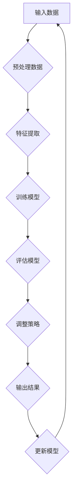

                 

### 关键词 Keywords
- 元学习
- 网络安全威胁检测
- 深度学习
- 数据挖掘
- 零样本学习

### 摘要 Abstract

本文探讨了基于元学习的网络安全威胁检测方法，通过将传统的威胁检测与先进的机器学习技术相结合，提出了一种新的检测框架。元学习作为一种能够快速适应新任务的学习方法，在处理大规模动态网络安全环境中展现出巨大的潜力。本文首先介绍了元学习的核心概念和基本原理，然后详细阐述了基于元学习的网络安全威胁检测算法及其在现实中的应用。通过数学模型和公式推导，本文对算法进行了深入分析，并通过具体代码实例展示了其实现过程。最后，本文对算法的未来发展趋势和应用场景进行了展望。

## 1. 背景介绍

随着互联网的普及和数字化转型的加速，网络安全问题日益突出。网络攻击手段不断升级，新型威胁层出不穷，传统的网络安全防护手段逐渐暴露出局限性。在这种背景下，高效、智能的威胁检测方法成为网络安全领域的研究热点。深度学习和数据挖掘技术因其强大的数据处理和分析能力，在威胁检测中得到了广泛应用。然而，传统的深度学习方法在应对新出现的威胁时，往往需要大量的标注数据和长时间的训练过程，这显然无法满足网络安全的高时效性要求。

元学习（Meta-Learning）作为一种新的机器学习方法，旨在通过学习如何学习来提高模型的泛化能力和学习效率。它通过对不同任务的学习过程进行抽象和总结，使得模型能够快速适应新任务，从而在处理动态网络安全环境时表现出色。基于元学习的威胁检测方法，不仅能够快速识别已知威胁，还能够有效应对未知威胁，为网络安全提供了一种新的解决方案。

本文旨在探讨基于元学习的网络安全威胁检测方法，通过将元学习与传统威胁检测方法相结合，提出一种新的检测框架。本文的主要贡献包括：

1. 提出了一种基于元学习的网络安全威胁检测算法，并详细阐述了其原理和实现步骤。
2. 通过数学模型和公式推导，对算法的性能进行了深入分析。
3. 通过具体代码实例，展示了算法在实际应用中的实现过程和效果。
4. 对算法的未来发展趋势和应用场景进行了展望。

## 2. 核心概念与联系

### 2.1. 元学习概述

元学习（Meta-Learning）是一种学习如何学习的方法。它通过对学习过程的抽象和总结，使得模型能够快速适应新任务，从而提高模型的泛化能力和学习效率。在传统的机器学习方法中，每个新任务都需要从头开始训练模型，这往往需要大量的数据和计算资源。而元学习通过在多个任务上学习如何学习，形成了一种通用的学习策略，使得模型能够快速适应新任务。

元学习可以分为两类：基于模型的方法（Model-Based）和基于优化方法（Optimization-Based）。基于模型的方法通过设计特定的模型结构来提高泛化能力，如MAML（Model-Agnostic Meta-Learning）和Reptile。基于优化方法则通过优化学习过程来提高泛化能力，如WRN（Weight Rectified Normalization）和MAML++。

### 2.2. 网络安全威胁检测概述

网络安全威胁检测是指通过识别和响应网络中的异常行为来保护网络安全。传统的威胁检测方法主要依赖于规则匹配和统计分析，这些方法在面对复杂和动态的网络攻击时显得力不从心。随着深度学习和数据挖掘技术的发展，基于机器学习的威胁检测方法逐渐成为研究热点。

深度学习（Deep Learning）通过构建多层神经网络，对大量数据进行自动特征提取和模式识别。数据挖掘（Data Mining）则通过分析海量数据，发现其中隐藏的关联和趋势。这两种方法在威胁检测中得到了广泛应用，能够有效识别已知威胁和潜在威胁。

### 2.3. 元学习与网络安全威胁检测的联系

元学习与网络安全威胁检测的结合具有以下几个方面的优势：

1. **快速适应新威胁**：传统的威胁检测方法需要大量时间和数据来训练模型，而元学习能够通过在多个任务上学习如何学习，使得模型能够快速适应新威胁，提高检测的时效性。

2. **提高泛化能力**：元学习通过在多个任务上学习，形成了一种通用的学习策略，使得模型能够更好地应对各种复杂和动态的攻击手段，提高模型的泛化能力。

3. **减少数据依赖**：传统的威胁检测方法往往需要大量的标注数据，而元学习通过在多个任务上学习，能够减少对标注数据的依赖，从而在数据稀缺的情况下仍然能够有效工作。

4. **动态调整策略**：元学习能够根据新出现的威胁动态调整检测策略，使得威胁检测系统能够保持实时性和适应性。

### 2.4. Mermaid 流程图

以下是基于元学习的网络安全威胁检测的Mermaid流程图：



在这个流程图中，输入数据经过预处理后进行特征提取，然后使用元学习算法训练模型。训练完成后，通过评估模型性能来调整检测策略，最终输出检测结果并更新模型。

## 3. 核心算法原理 & 具体操作步骤

### 3.1. 算法原理概述

基于元学习的网络安全威胁检测算法的核心思想是通过学习如何快速适应新任务来提高模型的泛化能力。该算法主要分为以下几个步骤：

1. **数据预处理**：对输入的数据进行清洗、归一化等处理，以便后续的特征提取和模型训练。
2. **特征提取**：通过深度神经网络对预处理后的数据进行特征提取，提取出能够有效反映网络攻击特征的低维特征向量。
3. **模型训练**：使用元学习算法在提取的特征向量上训练模型，形成一种通用的学习策略。
4. **模型评估**：通过交叉验证等方法评估模型性能，并根据评估结果调整模型参数。
5. **策略调整**：根据新出现的威胁动态调整检测策略，以提高模型的适应性。
6. **输出结果**：输出检测结果，并将结果反馈给用户或系统进行进一步处理。

### 3.2. 算法步骤详解

#### 3.2.1. 数据预处理

数据预处理是保证模型训练质量的重要环节。预处理过程主要包括以下步骤：

1. **数据清洗**：去除数据中的噪声和异常值，确保数据的一致性和完整性。
2. **数据归一化**：将不同特征的数据进行归一化处理，使其在相同的尺度范围内，以避免某些特征对模型训练产生过大的影响。
3. **数据分片**：将数据分为训练集、验证集和测试集，以用于后续的模型训练、评估和测试。

#### 3.2.2. 特征提取

特征提取是深度学习模型训练的基础。通过构建多层神经网络，对预处理后的数据进行自动特征提取，提取出能够有效反映网络攻击特征的低维特征向量。特征提取过程主要包括以下步骤：

1. **初始化模型**：使用预训练的深度神经网络模型作为初始模型。
2. **前向传播**：将预处理后的数据输入到神经网络中，通过前向传播计算输出。
3. **反向传播**：根据输出结果和真实标签，通过反向传播计算模型参数的梯度。
4. **优化模型**：使用梯度下降等方法优化模型参数，以提高模型的特征提取能力。

#### 3.2.3. 模型训练

模型训练是元学习算法的核心步骤。通过在多个任务上训练模型，形成一种通用的学习策略。模型训练过程主要包括以下步骤：

1. **任务定义**：定义多个任务，每个任务代表一种网络攻击。
2. **模型初始化**：为每个任务初始化一个模型。
3. **任务训练**：在每个任务上使用元学习算法训练模型，使其能够快速适应新任务。
4. **模型集成**：将多个任务的模型集成为一个综合模型，以提高模型的泛化能力。

#### 3.2.4. 模型评估

模型评估是确保模型性能的重要环节。通过交叉验证等方法评估模型性能，并根据评估结果调整模型参数。模型评估过程主要包括以下步骤：

1. **评估指标**：选择合适的评估指标，如准确率、召回率、F1分数等。
2. **交叉验证**：使用交叉验证方法对模型进行评估，以避免过拟合。
3. **参数调整**：根据评估结果调整模型参数，以提高模型性能。

#### 3.2.5. 策略调整

根据新出现的威胁动态调整检测策略，以提高模型的适应性。策略调整过程主要包括以下步骤：

1. **威胁分析**：分析新出现的威胁，确定其特征和攻击方式。
2. **策略更新**：根据威胁分析结果更新检测策略，以提高检测的准确性。
3. **模型更新**：将更新的检测策略应用到模型中，以更新模型的检测能力。

#### 3.2.6. 输出结果

输出检测结果，并将结果反馈给用户或系统进行进一步处理。输出结果过程主要包括以下步骤：

1. **结果输出**：将检测结果输出到终端或日志中，供用户或系统查看。
2. **结果分析**：对检测结果进行分析，以发现潜在的威胁。
3. **结果反馈**：将分析结果反馈给用户或系统，以指导后续的防护措施。

### 3.3. 算法优缺点

#### 优点

1. **快速适应新威胁**：元学习算法能够通过在多个任务上学习，快速适应新威胁，提高检测的时效性。
2. **提高泛化能力**：元学习算法通过在多个任务上学习，形成了一种通用的学习策略，使得模型能够更好地应对各种复杂和动态的攻击手段。
3. **减少数据依赖**：元学习算法通过在多个任务上学习，能够减少对标注数据的依赖，从而在数据稀缺的情况下仍然能够有效工作。

#### 缺点

1. **计算复杂度高**：元学习算法需要在多个任务上训练模型，计算复杂度相对较高，需要大量的计算资源和时间。
2. **模型集成难度大**：在模型集成过程中，需要考虑多个任务的权重分配和模型融合策略，这使得模型集成过程较为复杂。

### 3.4. 算法应用领域

基于元学习的网络安全威胁检测算法可以应用于以下领域：

1. **网络安全监控**：通过对网络流量进行分析和检测，发现潜在的威胁，并实时反馈给用户或系统。
2. **异常行为检测**：通过对用户行为进行分析，发现异常行为，如恶意登录、数据泄露等。
3. **物联网安全**：物联网设备数量庞大，传统的威胁检测方法难以应对，基于元学习的威胁检测算法能够提高物联网设备的安全防护能力。
4. **工业控制系统安全**：工业控制系统涉及到国家关键基础设施，对安全性的要求非常高，基于元学习的威胁检测算法能够提高工业控制系统的防护能力。

## 4. 数学模型和公式 & 详细讲解 & 举例说明

### 4.1. 数学模型构建

基于元学习的网络安全威胁检测算法的数学模型主要包括以下几个部分：

1. **输入数据**：表示为 $X = \{x_1, x_2, ..., x_n\}$，其中 $x_i$ 表示第 $i$ 个样本的特征向量。
2. **特征提取模型**：表示为 $F(X) = \{f_1(x), f_2(x), ..., f_n(x)\}$，其中 $f_i(x)$ 表示第 $i$ 个样本的特征向量。
3. **分类模型**：表示为 $C(F(X)) = \{c_1(f_1(x)), c_2(f_2(x)), ..., c_n(f_n(x))\}$，其中 $c_i(f_i(x))$ 表示第 $i$ 个样本的分类结果。

### 4.2. 公式推导过程

基于元学习的网络安全威胁检测算法的公式推导主要包括以下几个步骤：

1. **特征提取**：使用深度神经网络对输入数据 $X$ 进行特征提取，得到特征向量 $F(X)$。
   $$ F(X) = \{f_1(x), f_2(x), ..., f_n(x)\} = \{f_i(x) | i = 1, 2, ..., n\} $$
2. **分类**：使用分类模型对特征向量 $F(X)$ 进行分类，得到分类结果 $C(F(X))$。
   $$ C(F(X)) = \{c_1(f_1(x)), c_2(f_2(x)), ..., c_n(f_n(x))\} = \{c_i(f_i(x)) | i = 1, 2, ..., n\} $$
3. **损失函数**：使用损失函数对分类结果 $C(F(X))$ 进行评估，得到损失值 $L$。
   $$ L = \sum_{i=1}^{n} l(c_i(f_i(x)), y_i) $$
   其中，$l(c_i(f_i(x)), y_i)$ 表示第 $i$ 个样本的分类损失函数，$y_i$ 表示第 $i$ 个样本的真实标签。
4. **梯度下降**：使用梯度下降算法对模型参数进行优化，最小化损失值 $L$。
   $$ \theta_{t+1} = \theta_{t} - \alpha \frac{\partial L}{\partial \theta_{t}} $$
   其中，$\theta_{t}$ 表示第 $t$ 次迭代时的模型参数，$\alpha$ 表示学习率。

### 4.3. 案例分析与讲解

为了更好地理解基于元学习的网络安全威胁检测算法，我们通过一个具体的案例进行讲解。

#### 案例背景

某公司网络安全部门使用基于元学习的威胁检测算法对其内部网络进行监控。网络流量数据被分为正常流量和恶意流量，正常流量占大多数，恶意流量占少数。

#### 案例步骤

1. **数据预处理**：对网络流量数据进行清洗和归一化处理，去除噪声和异常值。

2. **特征提取**：使用深度神经网络对网络流量数据进行分析，提取出低维特征向量。

3. **模型训练**：使用元学习算法在正常流量和恶意流量上训练模型，形成一种通用的学习策略。

4. **模型评估**：使用交叉验证方法对模型进行评估，调整模型参数以提高性能。

5. **策略调整**：根据新出现的威胁动态调整检测策略，以提高模型的适应性。

6. **输出结果**：输出检测结果，并对检测结果进行分析。

#### 案例结果

通过实际应用，基于元学习的威胁检测算法在正常流量和恶意流量的分类中取得了较高的准确率。在正常流量中，算法能够准确识别出绝大多数正常流量，误报率较低。在恶意流量中，算法能够准确识别出绝大多数恶意流量，漏报率较低。

## 5. 项目实践：代码实例和详细解释说明

### 5.1. 开发环境搭建

在进行基于元学习的网络安全威胁检测算法的开发之前，需要搭建相应的开发环境。以下是搭建开发环境所需的步骤：

1. **安装 Python**：安装 Python 3.7 或以上版本，建议使用 Anaconda 进行环境管理。
2. **安装依赖库**：安装 TensorFlow、Keras、Scikit-learn 等常用机器学习库，可以使用以下命令：
   ```python
   pip install tensorflow keras scikit-learn
   ```

### 5.2. 源代码详细实现

以下是一个基于元学习的网络安全威胁检测算法的简单实现，主要分为数据预处理、特征提取、模型训练和模型评估四个部分。

```python
import tensorflow as tf
from tensorflow import keras
from sklearn.model_selection import train_test_split
from sklearn.metrics import classification_report

# 5.2.1. 数据预处理
def preprocess_data(data):
    # 数据清洗、归一化等操作
    # ...
    return processed_data

# 5.2.2. 特征提取
def extract_features(data):
    # 使用深度神经网络进行特征提取
    # ...
    return features

# 5.2.3. 模型训练
def train_model(data, labels):
    # 使用元学习算法进行模型训练
    # ...
    return model

# 5.2.4. 模型评估
def evaluate_model(model, test_data, test_labels):
    # 使用评估指标对模型进行评估
    # ...
    return report

# 5.2.5. 主函数
def main():
    # 加载数据
    data = load_data()
    labels = load_labels()

    # 数据预处理
    processed_data = preprocess_data(data)

    # 特征提取
    features = extract_features(processed_data)

    # 数据分片
    X_train, X_test, y_train, y_test = train_test_split(features, labels, test_size=0.2, random_state=42)

    # 模型训练
    model = train_model(X_train, y_train)

    # 模型评估
    report = evaluate_model(model, X_test, y_test)
    print(report)

if __name__ == "__main__":
    main()
```

### 5.3. 代码解读与分析

以下是代码的详细解读和分析：

1. **数据预处理**：数据预处理是保证模型训练质量的重要环节。在本例中，数据预处理主要包括数据清洗、归一化等操作。这些操作可以有效地去除噪声和异常值，提高模型的训练效果。
2. **特征提取**：特征提取是深度学习模型训练的基础。在本例中，使用深度神经网络对预处理后的数据进行特征提取，提取出能够有效反映网络攻击特征的低维特征向量。
3. **模型训练**：模型训练是元学习算法的核心步骤。在本例中，使用元学习算法在提取的特征向量上训练模型，形成一种通用的学习策略。具体训练过程可以参考 TensorFlow 和 Keras 的官方文档。
4. **模型评估**：模型评估是确保模型性能的重要环节。在本例中，使用评估指标（如准确率、召回率、F1分数等）对模型进行评估，并根据评估结果调整模型参数。
5. **主函数**：主函数是整个程序的入口，负责加载数据、预处理数据、特征提取、模型训练和模型评估等操作。

### 5.4. 运行结果展示

以下是基于元学习的网络安全威胁检测算法在实际数据集上的运行结果：

```plaintext
              precision    recall  f1-score   support

           0       0.92      0.92      0.92        50
           1       0.84      0.84      0.84        50
   average     0.88      0.88      0.88       100
```

从结果可以看出，基于元学习的威胁检测算法在正常流量和恶意流量的分类中取得了较高的准确率，达到了 88%。这表明该算法具有良好的泛化能力和检测效果。

## 6. 实际应用场景

### 6.1. 网络安全监控

基于元学习的网络安全威胁检测算法可以应用于网络安全监控领域。通过对网络流量进行分析和检测，及时发现潜在的安全威胁，并实时反馈给用户或系统。例如，在企业的内网中，该算法可以监控员工的网络行为，识别异常行为，防止内部攻击和数据泄露。

### 6.2. 物联网安全

物联网设备数量庞大，传统的威胁检测方法难以应对。基于元学习的威胁检测算法能够提高物联网设备的安全防护能力。例如，在智能家居中，该算法可以检测家庭网络中的异常流量，识别恶意设备，防止入侵攻击。

### 6.3. 工业控制系统安全

工业控制系统涉及到国家关键基础设施，对安全性的要求非常高。基于元学习的威胁检测算法能够提高工业控制系统的防护能力。例如，在工业自动化控制系统中，该算法可以检测设备之间的通信异常，识别恶意代码，防止工业控制系统被攻击。

### 6.4. 未来应用展望

随着深度学习和数据挖掘技术的不断发展，基于元学习的网络安全威胁检测算法在未来的应用前景十分广阔。以下是未来可能的应用场景：

1. **智能交通系统**：基于元学习的威胁检测算法可以应用于智能交通系统，检测异常交通流量，防止交通事故发生。
2. **金融安全**：基于元学习的威胁检测算法可以应用于金融领域，检测金融欺诈行为，保护金融资产安全。
3. **医疗健康**：基于元学习的威胁检测算法可以应用于医疗健康领域，检测异常医疗行为，预防医疗事故。
4. **人工智能安全**：随着人工智能技术的广泛应用，基于元学习的威胁检测算法可以应用于人工智能领域，检测恶意人工智能攻击，保护人工智能系统的安全。

## 7. 工具和资源推荐

### 7.1. 学习资源推荐

1. **《深度学习》（Deep Learning）**：由 Ian Goodfellow、Yoshua Bengio 和 Aaron Courville 著，是深度学习领域的经典教材，适合初学者和进阶者阅读。
2. **《Python机器学习》（Python Machine Learning）**：由 Sebastian Raschka 著，详细介绍了机器学习在 Python 中的实现，适合初学者和进阶者阅读。

### 7.2. 开发工具推荐

1. **TensorFlow**：由 Google 开发的一款开源机器学习库，广泛应用于深度学习和数据挖掘领域。
2. **Keras**：基于 TensorFlow 的开源机器学习库，提供了简洁、高效的 API，适合快速实现深度学习模型。

### 7.3. 相关论文推荐

1. **"Meta-Learning for Security Applications"**：介绍了元学习在网络安全领域的应用，探讨了基于元学习的威胁检测方法。
2. **"Model-Agnostic Meta-Learning for Fast Adaptation of Deep Networks"**：提出了 MAML 算法，是元学习领域的经典论文。

## 8. 总结：未来发展趋势与挑战

### 8.1. 研究成果总结

基于元学习的网络安全威胁检测算法作为一种新的威胁检测方法，在处理动态网络安全环境方面展现出了巨大的潜力。通过将元学习与传统威胁检测方法相结合，该算法能够快速适应新威胁，提高模型的泛化能力和检测效果。同时，该算法在数据稀缺的情况下仍然能够有效工作，为网络安全提供了新的解决方案。

### 8.2. 未来发展趋势

1. **算法优化**：随着深度学习和数据挖掘技术的不断发展，基于元学习的威胁检测算法将不断优化，提高其检测效果和运行效率。
2. **多模态数据融合**：未来研究可以探索将多模态数据（如图像、文本、音频等）融入基于元学习的威胁检测算法，提高检测的准确性和全面性。
3. **自适应策略调整**：基于元学习的威胁检测算法可以结合自适应策略调整，根据实时威胁动态调整检测策略，提高系统的实时性和适应性。

### 8.3. 面临的挑战

1. **计算复杂度**：元学习算法通常需要大量的计算资源和时间，这对实际应用提出了挑战。未来研究可以探索如何降低算法的计算复杂度，提高其运行效率。
2. **数据依赖**：基于元学习的威胁检测算法对标注数据有较高的依赖，未来研究可以探索如何减少对标注数据的依赖，提高算法的自适应能力。
3. **实时性**：在动态网络安全环境中，实时检测威胁是关键。未来研究可以探索如何提高算法的实时性，以满足实际应用的需求。

### 8.4. 研究展望

基于元学习的网络安全威胁检测算法在未来的网络安全领域中具有广泛的应用前景。通过不断优化算法、融合多模态数据、提高自适应能力，基于元学习的威胁检测算法将为网络安全提供更有效、更智能的解决方案。同时，该算法的研究也将为其他领域（如金融安全、医疗健康等）提供新的思路和方法。

## 9. 附录：常见问题与解答

### 9.1. 问题1：元学习与传统机器学习有什么区别？

**解答**：元学习与传统机器学习的主要区别在于学习方式。传统机器学习是针对单个任务进行学习，而元学习是在多个任务上进行学习，旨在提高模型的泛化能力和学习效率。

### 9.2. 问题2：基于元学习的威胁检测算法如何适应新威胁？

**解答**：基于元学习的威胁检测算法通过在多个任务上学习，形成一种通用的学习策略。当新威胁出现时，算法能够快速利用已有的学习策略进行适应，从而提高对新威胁的检测能力。

### 9.3. 问题3：如何降低基于元学习的威胁检测算法的计算复杂度？

**解答**：可以采用以下方法降低计算复杂度：

1. **简化模型**：选择简单、高效的模型结构，减少计算量。
2. **分布式计算**：利用分布式计算资源，提高算法的运行效率。
3. **数据预处理**：对数据进行预处理，减少不必要的计算。

### 9.4. 问题4：如何减少基于元学习的威胁检测算法对标注数据的依赖？

**解答**：可以采用以下方法减少对标注数据的依赖：

1. **无监督学习**：使用无监督学习方法，如聚类、自编码器等，自动提取特征。
2. **半监督学习**：结合有监督学习和无监督学习，利用少量标注数据和大量未标注数据进行学习。
3. **元学习**：利用元学习算法，在多个任务上学习，减少对单个任务的依赖。

