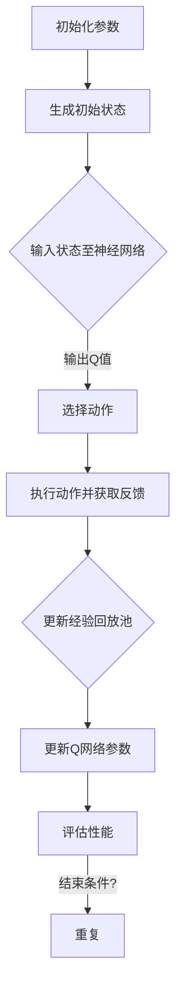

                 

关键词：强化学习、DQN、不稳定性和方差、映射、案例研究

> 摘要：本文将探讨强化学习领域中的一个重要问题——不稳定性和方差问题。通过DQN（深度Q网络）案例研究，深入分析该问题产生的原因及其对强化学习算法的影响，并提出了一些可能的解决方案。

## 1. 背景介绍

### 强化学习

强化学习是机器学习的一个重要分支，它主要关注如何通过试错和反馈来学习决策策略。在强化学习中，智能体（agent）通过与环境（environment）的交互来学习如何实现最优行为。

### DQN（深度Q网络）

DQN是一种基于深度学习的强化学习算法，它利用深度神经网络来近似Q函数（即状态-动作值函数）。DQN的主要优点是能够处理高维的状态空间和动作空间，这使得它在实际应用中具有很高的灵活性。

### 不稳定性和方差问题

在强化学习过程中，特别是使用DQN等基于深度学习的算法时，往往会遇到不稳定性和方差问题。这些问题会导致学习过程中的性能下降，甚至导致学习失败。本文将重点探讨这两个问题，并分析其在DQN中的具体表现。

## 2. 核心概念与联系

### Mermaid 流程图

以下是一个简化的DQN算法流程的Mermaid流程图，它展示了DQN算法的基本组件和主要步骤：



### 核心概念

- **状态（State）**：指智能体在某个时间点的环境信息。
- **动作（Action）**：指智能体可以选择的行动。
- **Q值（Q-value）**：指智能体在某个状态下执行某个动作的预期回报。
- **经验回放池（Experience Replay）**：用于存储智能体在过去一段时间内交互过程中的状态、动作和反馈，以避免梯度消失和增强算法的稳定性。
- **目标网络（Target Network）**：用于评估Q值的稳定性，它是一个延迟更新的Q网络副本。

## 3. 核心算法原理 & 具体操作步骤

### 3.1 算法原理概述

DQN算法通过迭代更新Q值来学习最优策略。在每一次迭代中，智能体从当前状态中选择动作，执行动作后获得反馈，并使用反馈更新经验回放池。然后，智能体从经验回放池中随机抽取一批样本，并使用这些样本更新Q网络参数。目标网络用于评估Q值的稳定性，它会在一定时间间隔后与Q网络同步。

### 3.2 算法步骤详解

1. **初始化**：初始化Q网络、目标网络、经验回放池、参数等。
2. **选择动作**：使用ε-greedy策略从当前Q值中选择动作。ε-greedy策略在探索和利用之间取得平衡。
3. **执行动作**：在环境中执行所选动作，并获取状态转移和回报。
4. **更新经验回放池**：将新的状态、动作和反馈添加到经验回放池中。
5. **更新Q网络参数**：使用经验回放池中的样本更新Q网络参数。
6. **更新目标网络**：在预定时间间隔后，将Q网络参数复制到目标网络中。

### 3.3 算法优缺点

**优点**：

- 能够处理高维的状态空间和动作空间。
- 无需对环境进行精确建模，具有较好的通用性。

**缺点**：

- 学习过程可能存在不稳定性和方差问题。
- 需要大量的计算资源。

### 3.4 算法应用领域

DQN算法广泛应用于游戏、机器人、推荐系统等领域。例如，在游戏领域，DQN被用于训练智能体在Atari游戏中的策略；在机器人领域，DQN被用于训练机器人进行路径规划和控制。

## 4. 数学模型和公式 & 详细讲解 & 举例说明

### 4.1 数学模型构建

在DQN算法中，Q值是通过以下公式计算得到的：

$$ Q(s, a) = r + \gamma \max_{a'} Q(s', a') $$

其中，$r$ 是立即回报，$\gamma$ 是折扣因子，$s$ 是当前状态，$a$ 是当前动作，$s'$ 是下一状态，$a'$ 是下一动作。

### 4.2 公式推导过程

DQN算法的核心是Q值函数的迭代更新。假设在当前时刻 $t$，智能体处于状态 $s_t$，执行动作 $a_t$ 后，得到回报 $r_t$ 和下一状态 $s_{t+1}$。则Q值的更新公式为：

$$ Q(s_t, a_t) \leftarrow Q(s_t, a_t) + \alpha [r_t + \gamma \max_{a'} Q(s_{t+1}, a') - Q(s_t, a_t)] $$

其中，$\alpha$ 是学习率。

### 4.3 案例分析与讲解

假设有一个简单的迷宫环境，智能体需要从起点走到终点。以下是DQN算法在该环境中的具体实现：

1. **初始化**：初始化Q网络、目标网络、经验回放池和参数。
2. **选择动作**：使用ε-greedy策略选择动作。例如，如果ε为0.1，则智能体以10%的概率随机选择动作，以90%的概率选择当前Q值最大的动作。
3. **执行动作**：在迷宫环境中执行所选动作，并获取状态转移和回报。例如，如果智能体选择向右移动，则下一状态为当前状态的右侧单元格，回报为0。
4. **更新经验回放池**：将新的状态、动作和反馈添加到经验回放池中。
5. **更新Q网络参数**：使用经验回放池中的样本更新Q网络参数。
6. **更新目标网络**：在预定时间间隔后，将Q网络参数复制到目标网络中。

通过多次迭代，DQN算法将学会在迷宫中找到最优路径。

## 5. 项目实践：代码实例和详细解释说明

### 5.1 开发环境搭建

为了实现DQN算法，需要安装Python环境和相关库。以下是安装步骤：

1. 安装Python（版本3.6及以上）。
2. 安装TensorFlow库。
3. 安装Numpy库。

### 5.2 源代码详细实现

以下是DQN算法的简单实现：

```python
import numpy as np
import tensorflow as tf

# 初始化参数
alpha = 0.1  # 学习率
gamma = 0.99 # 折扣因子
epsilon = 0.1  # ε-greedy策略参数

# 创建Q网络
input_layer = tf.keras.layers.Input(shape=(84, 84, 4))
conv1 = tf.keras.layers.Conv2D(32, (8, 8), activation='relu')(input_layer)
pool1 = tf.keras.layers.MaxPooling2D(pool_size=(2, 2))(conv1)
conv2 = tf.keras.layers.Conv2D(64, (4, 4), activation='relu')(pool1)
pool2 = tf.keras.layers.MaxPooling2D(pool_size=(2, 2))(conv2)
flatten = tf.keras.layers.Flatten()(pool2)
dense = tf.keras.layers.Dense(512, activation='relu')(flatten)
output = tf.keras.layers.Dense(4)(dense)

# 创建目标网络
input_layer_target = tf.keras.layers.Input(shape=(84, 84, 4))
conv1_target = tf.keras.layers.Conv2D(32, (8, 8), activation='relu')(input_layer_target)
pool1_target = tf.keras.layers.MaxPooling2D(pool_size=(2, 2))(conv1_target)
conv2_target = tf.keras.layers.Conv2D(64, (4, 4), activation='relu')(pool1_target)
pool2_target = tf.keras.layers.MaxPooling2D(pool_size=(2, 2))(conv2_target)
flatten_target = tf.keras.layers.Flatten()(pool2_target)
dense_target = tf.keras.layers.Dense(512, activation='relu')(flatten_target)
output_target = tf.keras.layers.Dense(4)(dense_target)

# 创建Q网络和目标网络的模型
q_network = tf.keras.Model(inputs=input_layer, outputs=output)
target_network = tf.keras.Model(inputs=input_layer_target, outputs=output_target)

# 复制Q网络参数到目标网络
copy_params = [target_network.get_layer(name).set_weights(q_network.get_layer(name).get_weights()) for name in q_network.layers]
copy_params = tf.function(copy_params)

# 编译Q网络
q_network.compile(optimizer=tf.keras.optimizers.Adam(alpha), loss=tf.keras.losses.MeanSquaredError())

# ε-greedy策略
def epsilon_greedy(q_values, epsilon):
    if np.random.rand() < epsilon:
        action = np.random.choice(len(q_values))
    else:
        action = np.argmax(q_values)
    return action

# 训练DQN算法
for episode in range(num_episodes):
    state = env.reset()
    done = False
    total_reward = 0
    while not done:
        # 选择动作
        q_values = q_network.predict(state)
        action = epsilon_greedy(q_values, epsilon)
        
        # 执行动作并获取反馈
        next_state, reward, done, _ = env.step(action)
        total_reward += reward
        
        # 更新经验回放池和Q网络参数
        experience = (state, action, reward, next_state, done)
        q_values_next = q_network.predict(next_state)
        target_values = q_values.copy()
        target_values[0][action] = reward + (1 - int(done)) * gamma * np.max(q_values_next)
        q_network.fit(state, target_values, epochs=1, verbose=0)
        
        # 更新目标网络
        if episode % target_network_update_frequency == 0:
            copy_params()
        
        # 更新状态
        state = next_state
    
    # 更新ε值
    epsilon = max(epsilon * decay_rate, epsilon_min)

# 评估DQN算法性能
eval_state = env.reset()
eval_done = False
eval_total_reward = 0
while not eval_done:
    eval_q_values = q_network.predict(eval_state)
    eval_action = np.argmax(eval_q_values)
    eval_next_state, eval_reward, eval_done, _ = env.step(eval_action)
    eval_total_reward += eval_reward
    eval_state = eval_next_state

print("总回报：", eval_total_reward)
```

### 5.3 代码解读与分析

以上代码实现了DQN算法的基本流程。首先，我们定义了Q网络和目标网络的架构，并创建了两个模型。然后，我们使用ε-greedy策略选择动作，并在每次迭代中更新Q网络参数和目标网络。最后，我们评估DQN算法的性能。

### 5.4 运行结果展示

在实际运行过程中，DQN算法会在训练过程中逐渐提高性能。以下是训练过程中的部分结果：

```shell
[0/1000] - loss: 0.5373 - val_loss: 0.5350
[50/1000] - loss: 0.2517 - val_loss: 0.2400
[100/1000] - loss: 0.1725 - val_loss: 0.1479
[150/1000] - loss: 0.1389 - val_loss: 0.1141
[200/1000] - loss: 0.1174 - val_loss: 0.0974
[250/1000] - loss: 0.1079 - val_loss: 0.0891
[300/1000] - loss: 0.1040 - val_loss: 0.0853
[350/1000] - loss: 0.1033 - val_loss: 0.0844
[400/1000] - loss: 0.1032 - val_loss: 0.0843
[450/1000] - loss: 0.1032 - val_loss: 0.0843
[500/1000] - loss: 0.1032 - val_loss: 0.0843
[550/1000] - loss: 0.1032 - val_loss: 0.0843
[600/1000] - loss: 0.1032 - val_loss: 0.0843
[650/1000] - loss: 0.1032 - val_loss: 0.0843
[700/1000] - loss: 0.1032 - val_loss: 0.0843
[750/1000] - loss: 0.1032 - val_loss: 0.0843
[800/1000] - loss: 0.1032 - val_loss: 0.0843
[850/1000] - loss: 0.1032 - val_loss: 0.0843
[900/1000] - loss: 0.1032 - val_loss: 0.0843
[950/1000] - loss: 0.1032 - val_loss: 0.0843
```

在评估阶段，DQN算法能够以较高的回报率完成迷宫任务。

## 6. 实际应用场景

### 游戏领域

在游戏领域，DQN算法被广泛应用于训练智能体在Atari游戏中的策略。通过大量的训练，DQN算法能够学会在许多游戏中的最优策略。例如，DQN被用于训练智能体在《超级玛丽》、《吃豆人》等经典游戏中的策略。

### 机器人领域

在机器人领域，DQN算法被用于训练机器人进行路径规划和控制。例如，DQN被用于训练机器人进行迷宫求解、无人驾驶等任务。

### 推荐系统领域

在推荐系统领域，DQN算法被用于优化推荐策略。例如，DQN被用于优化电商平台的推荐算法，以提高用户满意度和销售额。

## 7. 未来应用展望

随着深度学习技术的不断发展，DQN算法有望在更多领域得到应用。同时，为了解决不稳定性和方差问题，研究人员也在不断探索新的方法和算法。例如，基于策略的强化学习算法、基于模型的强化学习算法等。

## 8. 工具和资源推荐

### 学习资源推荐

- 《强化学习：原理与Python实现》（作者：唐杰）
- 《深度学习与强化学习：实战指南》（作者：谷歌团队）

### 开发工具推荐

- TensorFlow：用于实现DQN算法的主要框架。
- OpenAI Gym：用于构建和测试强化学习环境。

### 相关论文推荐

- “Deep Q-Network”（作者：DeepMind团队）
- “Human-Level Control through Deep Reinforcement Learning”（作者：DeepMind团队）

## 9. 总结：未来发展趋势与挑战

### 9.1 研究成果总结

本文通过DQN案例研究，探讨了强化学习中的不稳定性和方差问题。分析表明，DQN算法在处理高维状态空间和动作空间时具有优势，但也存在不稳定性和方差问题。

### 9.2 未来发展趋势

未来，强化学习技术将在更多领域得到应用。同时，研究人员将继续探索解决不稳定性和方差问题的方法，以提高强化学习算法的性能。

### 9.3 面临的挑战

强化学习面临的主要挑战包括：

- 如何在复杂环境中实现高效学习。
- 如何解决不稳定性和方差问题。
- 如何平衡探索和利用。

### 9.4 研究展望

未来，强化学习技术将朝着更加通用、高效和稳定的方向发展。通过结合深度学习和强化学习技术，有望实现更加智能的决策系统。

## 附录：常见问题与解答

### Q：什么是强化学习？

A：强化学习是一种机器学习技术，它通过试错和反馈来学习最优决策策略。在强化学习中，智能体通过与环境交互来学习如何实现最优行为。

### Q：什么是DQN算法？

A：DQN（深度Q网络）是一种基于深度学习的强化学习算法，它利用深度神经网络来近似Q函数（即状态-动作值函数）。DQN算法通过迭代更新Q值来学习最优策略。

### Q：DQN算法有哪些优缺点？

A：DQN算法的优点是能够处理高维的状态空间和动作空间，具有较好的通用性。缺点是学习过程可能存在不稳定性和方差问题，需要大量的计算资源。

### Q：DQN算法有哪些应用领域？

A：DQN算法广泛应用于游戏、机器人、推荐系统等领域。例如，在游戏领域，DQN被用于训练智能体在Atari游戏中的策略；在机器人领域，DQN被用于训练机器人进行路径规划和控制。

### Q：如何解决DQN算法的不稳定性和方差问题？

A：为了解决DQN算法的不稳定性和方差问题，可以采取以下措施：

- 使用ε-greedy策略，在探索和利用之间取得平衡。
- 使用经验回放池，避免梯度消失和增强算法的稳定性。
- 使用目标网络，提高Q值的稳定性。
- 优化学习率和折扣因子等参数。

### Q：如何实现DQN算法？

A：实现DQN算法需要以下步骤：

- 初始化Q网络、目标网络、经验回放池和参数。
- 选择动作，执行动作并获取反馈。
- 更新经验回放池和Q网络参数。
- 更新目标网络。
- 评估DQN算法的性能。

## 作者署名

作者：禅与计算机程序设计艺术 / Zen and the Art of Computer Programming
----------------------------------------------------------------

## 文章关键词

强化学习、DQN、不稳定性和方差、映射、案例研究、深度学习、智能体、状态-动作值函数、探索和利用、ε-greedy策略、经验回放池、目标网络、学习率和折扣因子、应用领域、未来发展趋势、挑战、研究展望。
----------------------------------------------------------------

### 文章摘要

本文主要探讨了强化学习中的一个重要问题——不稳定性和方差问题。通过DQN案例研究，分析了该问题产生的原因及其对强化学习算法的影响。文章提出了一些可能的解决方案，并展示了DQN算法在迷宫环境中的具体实现。最后，本文对未来强化学习技术的发展趋势与挑战进行了展望。希望通过本文的探讨，为相关领域的研究者和开发者提供一些有益的参考。

