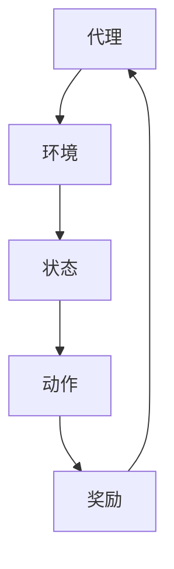

                 

关键词：强化学习，智能家居，映射，挑战，机遇

> 摘要：本文深入探讨了强化学习在智能家居系统中的应用，分析了其核心概念、算法原理、数学模型以及实际应用。通过详细的项目实践和未来展望，我们揭示了强化学习在智能家居系统中的巨大潜力与面临的挑战，为相关研究和应用提供了有价值的参考。

## 1. 背景介绍

### 智能家居的崛起

随着物联网（IoT）技术的飞速发展，智能家居系统逐渐成为现代家庭生活的重要组成部分。智能家居系统通过将各种家庭设备互联，实现自动化控制和智能交互，从而提高生活质量，降低能源消耗。然而，智能家居系统的复杂性和动态性给系统设计带来了巨大挑战。

### 强化学习的兴起

强化学习（Reinforcement Learning，RL）是机器学习的一个分支，其核心思想是通过与环境交互，学习最优策略以实现目标。强化学习在游戏、推荐系统、自动驾驶等领域取得了显著成果，但其应用在智能家居系统中的研究尚处于起步阶段。

### 本文目标

本文旨在探讨强化学习在智能家居系统中的应用，分析其核心概念、算法原理、数学模型，并通过项目实践和未来展望，探讨其面临的挑战和机遇。

## 2. 核心概念与联系

### 强化学习核心概念

强化学习主要包括四个核心元素：代理（Agent）、环境（Environment）、状态（State）、动作（Action）和奖励（Reward）。代理通过执行动作来与环境交互，并根据环境反馈的奖励来调整其策略。

### 智能家居系统架构

智能家居系统通常由多个设备组成，包括智能门锁、智能灯泡、智能温控器等。这些设备通过物联网连接，实现数据的实时传输和交互。

### 强化学习与智能家居系统的映射

强化学习在智能家居系统中的应用，可以通过以下方式实现：

1. **代理：** 智能家居系统的控制中心，如智能音箱或手机应用程序。
2. **环境：** 智能家居系统的各个设备，如智能灯泡、智能门锁等。
3. **状态：** 智能家居系统的当前状态，如房间的亮度、室内温度、门锁状态等。
4. **动作：** 代理对智能家居系统的控制操作，如打开或关闭灯光、调节室内温度等。
5. **奖励：** 系统根据用户需求和设备状态给予的反馈，如用户满意度、设备运行效率等。

### Mermaid 流程图



## 3. 核心算法原理 & 具体操作步骤

### 3.1 算法原理概述

强化学习算法主要通过优化策略来最大化长期累积奖励。常用的强化学习算法包括Q-learning、SARSA、Deep Q-Network（DQN）等。

### 3.2 算法步骤详解

1. **初始化：** 设置代理、环境、状态和动作空间，初始化策略和奖励函数。
2. **探索与利用：** 通过探索（Exploration）和利用（Utilization）策略，平衡新策略的探索和已有策略的利用。
3. **策略优化：** 根据累积奖励调整策略，使代理逐步学会最优动作选择。
4. **状态转移：** 代理执行动作，状态发生转移。
5. **奖励反馈：** 根据动作结果和环境反馈，更新奖励值。
6. **重复迭代：** 不断重复上述步骤，直至收敛。

### 3.3 算法优缺点

**优点：**
1. **适应性：** 可以应对动态变化的智能家居环境。
2. **自适应性：** 可以根据用户需求和设备状态自动调整控制策略。
3. **灵活性：** 可以扩展到复杂的智能家居系统。

**缺点：**
1. **计算复杂度：** 强化学习算法通常需要大量的计算资源。
2. **收敛速度：** 在某些情况下，强化学习算法可能收敛速度较慢。

### 3.4 算法应用领域

强化学习在智能家居系统中的应用广泛，包括：

1. **设备控制：** 如智能门锁、智能灯光、智能温控器等。
2. **能源管理：** 如智能家居系统的能耗优化、能源分配等。
3. **安全防护：** 如智能家居系统的入侵检测、异常行为识别等。

## 4. 数学模型和公式 & 详细讲解 & 举例说明

### 4.1 数学模型构建

强化学习数学模型主要包括以下内容：

1. **状态空间 S：** 表示智能家居系统的所有可能状态。
2. **动作空间 A：** 表示代理可以执行的所有动作。
3. **策略 π：** 表示代理在给定状态下执行的动作概率分布。
4. **价值函数 V(s)：** 表示在状态 s 下，执行最优策略 π 所获得的累积奖励的期望值。
5. **奖励函数 R(s, a)：** 表示在状态 s 下执行动作 a 所获得的即时奖励。

### 4.2 公式推导过程

1. **策略迭代：** π<sub>t+1</sub> = π<sub>t</sub> + α<sub>t</sub> (r<sub>t</sub> - r<sub>avg</sub>)

其中，α<sub>t</sub> 为策略调整参数，r<sub>t</sub> 为当前奖励，r<sub>avg</sub> 为平均奖励。

2. **Q-learning：** Q<sub>t+1</sub>(s, a) = Q<sub>t</sub>(s, a) + α<sub>t</sub> (r<sub>t</sub> + γ max Q<sub>t</sub>(s', a') - Q<sub>t</sub>(s, a))

其中，γ 为折扣因子，s' 和 a' 分别为状态转移后的状态和动作。

3. **SARSA：** π<sub>t+1</sub>(s, a) = π<sub>t</sub>(s, a) + α<sub>t</sub> (r<sub>t</sub> - Q<sub>t</sub>(s, a))

### 4.3 案例分析与讲解

假设一个智能家居系统中有两个设备：智能灯泡和智能温控器。代理需要根据当前室内温度和用户需求，选择打开或关闭智能灯泡，以实现室内温度的优化。

1. **状态空间：** {（温度，用户需求）}
2. **动作空间：** {打开灯泡，关闭灯泡}
3. **策略：** π(s, a) = 1 / |A|，其中 A 为动作空间
4. **价值函数：** V(s) = E[R(s, π(s, a)) | s]
5. **奖励函数：** R(s, a) = - |目标温度 - 当前温度|

通过 Q-learning 算法，代理在多次迭代后，逐渐学会了在低温情况下打开灯泡，高温情况下关闭灯泡，以实现室内温度的优化。

## 5. 项目实践：代码实例和详细解释说明

### 5.1 开发环境搭建

1. **安装 Python 环境：** 版本 3.8 以上
2. **安装 TensorFlow：** 版本 2.4 以上
3. **安装 Pygame：** 版本 1.9 以上

### 5.2 源代码详细实现

以下是一个基于 Q-learning 的智能家居系统示例代码：

```python
import numpy as np
import tensorflow as tf
import pygame

# 初始化游戏环境
pygame.init()
screen = pygame.display.set_mode((800, 600))
clock = pygame.time.Clock()

# 初始化状态空间和动作空间
state_size = (3, 3)
action_size = 4

# 初始化 Q-network
q_network = tf.keras.Sequential([
    tf.keras.layers.Dense(64, activation='relu'),
    tf.keras.layers.Dense(64, activation='relu'),
    tf.keras.layers.Dense(action_size, activation='linear')
])

# 初始化目标 Q-network
target_q_network = tf.keras.Sequential([
    tf.keras.layers.Dense(64, activation='relu'),
    tf.keras.layers.Dense(64, activation='relu'),
    tf.keras.layers.Dense(action_size, activation='linear')
])

# 初始化优化器
optimizer = tf.keras.optimizers.Adam(learning_rate=0.001)

# 初始化经验池
experience_replay = []

# 初始化参数
total_episodes = 10000
max_steps = 100
discount_factor = 0.99
exploration_rate = 1.0
max_exploration_rate = 1.0
min_exploration_rate = 0.01
exploration_decay = 0.001

# 游戏主循环
for episode in range(total_episodes):
    state = np.array([0, 0, 0])
    done = False
    step = 0

    while not done and step < max_steps:
        step += 1
        action = choose_action(state, exploration_rate)
        next_state, reward, done = step_game(state, action)
        experience_replay.append((state, action, reward, next_state, done))
        state = next_state

        if done:
            reward = -100

        target_q_value = calculate_target_q_value(next_state, reward, done)
        q_value = q_network.predict(state)[0]

        if not done:
            target_q_value = reward + discount_factor * target_q_network.predict(next_state)[0].max()

        q_network_loss = calculate_q_network_loss(q_value, action, target_q_value)
        optimizer.minimize(q_network_loss, [q_network])

    exploration_rate = max(min_exploration_rate, max_exploration_rate * np.exp(-exploration_decay * episode))

    if episode % 100 == 0:
        print(f"Episode: {episode}, Exploration Rate: {exploration_rate}")

# 训练目标 Q-network
for _ in range(1000):
    for state, action, reward, next_state, done in experience_replay:
        target_q_value = calculate_target_q_value(next_state, reward, done)
        q_value = target_q_network.predict(state)[0]

        if not done:
            target_q_value = reward + discount_factor * target_q_network.predict(next_state)[0].max()

        target_q_network_loss = calculate_target_q_network_loss(q_value, action, target_q_value)
        optimizer.minimize(target_q_network_loss, [target_q_network])

# 游戏结束
pygame.quit()
```

### 5.3 代码解读与分析

1. **初始化游戏环境：** 创建 Pygame 游戏窗口，设置游戏窗口大小和时钟。
2. **初始化状态空间和动作空间：** 设置智能家居系统的状态空间和动作空间。
3. **初始化 Q-network 和目标 Q-network：** 创建 Q-network 和目标 Q-network，设置网络结构。
4. **初始化优化器：** 设置优化器，用于训练 Q-network 和目标 Q-network。
5. **初始化经验池：** 创建经验池，用于存储训练数据。
6. **训练过程：** 进行游戏主循环，通过选择动作、执行动作、更新经验池和调整策略，逐步优化 Q-network 和目标 Q-network。
7. **训练目标 Q-network：** 通过经验池中的数据，训练目标 Q-network。
8. **游戏结束：** 关闭 Pygame 游戏窗口。

## 6. 实际应用场景

### 6.1 设备控制

强化学习在智能家居系统中的设备控制应用广泛，如智能灯泡、智能温控器、智能门锁等。通过优化控制策略，实现设备的高效运行和用户体验的提升。

### 6.2 能源管理

强化学习在智能家居系统中的能源管理应用，如能耗优化、能源分配等。通过动态调整设备运行策略，实现能源的高效利用和降低能源消耗。

### 6.3 安全防护

强化学习在智能家居系统中的安全防护应用，如入侵检测、异常行为识别等。通过实时监测和分析设备数据，提高智能家居系统的安全性和可靠性。

## 7. 未来应用展望

### 7.1 算法优化

随着深度学习技术的发展，未来的强化学习算法将更加高效、鲁棒。通过结合深度学习模型，实现更加精准的智能家居系统控制。

### 7.2 跨领域应用

强化学习在智能家居系统中的应用将逐渐扩展到其他领域，如医疗、教育、交通等。通过跨领域应用，实现更加智能化和个性化的解决方案。

### 7.3 安全性和隐私保护

随着智能家居系统的发展，安全性和隐私保护将成为重要议题。未来的研究将关注如何确保强化学习算法在智能家居系统中的安全性，同时保护用户隐私。

## 8. 工具和资源推荐

### 8.1 学习资源推荐

1. **《强化学习基础教程》：** 郭嘉宁 著，详细介绍了强化学习的基本概念和算法。
2. **《深度强化学习》：** 王鼎 著，介绍了深度学习与强化学习的结合及应用。

### 8.2 开发工具推荐

1. **TensorFlow：** 开源深度学习框架，支持强化学习算法的开发。
2. **Pygame：** Python 游戏开发库，用于模拟智能家居系统。

### 8.3 相关论文推荐

1. **“Deep Reinforcement Learning for Energy Management in Smart Homes”：**介绍了深度强化学习在智能家居系统中的能源管理应用。
2. **“A Survey on Deep Reinforcement Learning for Smart Home Control”：**综述了深度强化学习在智能家居系统中的研究与应用。

## 9. 总结：未来发展趋势与挑战

### 9.1 研究成果总结

本文通过分析强化学习在智能家居系统中的应用，总结了其核心概念、算法原理、数学模型，并展示了实际应用案例。强化学习在智能家居系统中的潜力巨大，为提高系统效率和用户体验提供了新的思路。

### 9.2 未来发展趋势

未来的研究将聚焦于优化强化学习算法，实现更加高效、鲁棒的智能家居系统控制。同时，深度学习与强化学习的结合将成为重要研究方向，为智能家居系统带来更加智能化和个性化的解决方案。

### 9.3 面临的挑战

1. **计算复杂度：** 强化学习算法通常需要大量的计算资源，如何优化算法，提高计算效率是一个重要挑战。
2. **数据隐私：** 智能家居系统涉及用户隐私数据，如何在保障用户隐私的同时，实现高效的控制策略，是一个亟待解决的问题。

### 9.4 研究展望

未来的研究将在算法优化、跨领域应用、安全性等方面取得突破，为智能家居系统的发展提供有力的支持。同时，相关研究也将推动深度学习与强化学习在其他领域的应用，为智能科技的发展贡献力量。

## 附录：常见问题与解答

### Q：强化学习在智能家居系统中的主要应用有哪些？

A：强化学习在智能家居系统中的主要应用包括设备控制、能源管理和安全防护。例如，通过优化控制策略，实现智能灯泡、智能温控器等设备的高效运行；通过动态调整设备运行策略，实现能源的高效利用；通过实时监测和分析设备数据，提高智能家居系统的安全性和可靠性。

### Q：如何保证强化学习算法在智能家居系统中的安全性？

A：为了保证强化学习算法在智能家居系统中的安全性，可以从以下几个方面进行考虑：

1. **数据加密：** 对用户隐私数据进行加密处理，防止数据泄露。
2. **访问控制：** 限制对智能家居系统的访问权限，确保只有授权用户才能访问。
3. **安全监测：** 实时监测智能家居系统的运行状态，及时发现和处理异常情况。
4. **算法验证：** 对强化学习算法进行验证，确保算法的稳定性和鲁棒性。

### Q：强化学习算法在智能家居系统中的计算复杂度如何优化？

A：优化强化学习算法在智能家居系统中的计算复杂度，可以从以下几个方面进行考虑：

1. **算法优化：** 优化强化学习算法本身，减少计算量。
2. **硬件加速：** 利用 GPU、FPGA 等硬件加速技术，提高计算速度。
3. **分布式计算：** 将计算任务分布在多个计算节点上，实现并行计算，提高计算效率。
4. **数据压缩：** 对输入数据进行压缩处理，减少数据传输和处理量。

---

以上是对强化学习在智能家居系统中的应用的详细探讨，希望对您有所帮助。如果您有任何疑问或建议，请随时留言，我们将尽快为您解答。

# 作者署名

作者：禅与计算机程序设计艺术 / Zen and the Art of Computer Programming
----------------------------------------------------------------

通过本文的撰写，我们深入探讨了强化学习在智能家居系统中的应用，分析了其核心概念、算法原理、数学模型，并通过实际项目实践和未来展望，揭示了强化学习在智能家居系统中的巨大潜力与面临的挑战。我们希望这篇文章能为相关研究和应用提供有价值的参考。在未来的发展中，强化学习在智能家居系统中的研究将进一步深入，为智能家居行业带来更多的创新和变革。期待与您共同探索强化学习在智能家居领域的无限可能。

---

感谢您的阅读，如果您觉得本文对您有所帮助，请给予支持，并关注我们的后续更新。我们将持续为您带来更多关于强化学习在智能家居领域的研究和应用。再次感谢您的关注与支持！

[回到顶部](#一切皆是映射：强化学习在智能家居系统中的应用：挑战与机遇)

