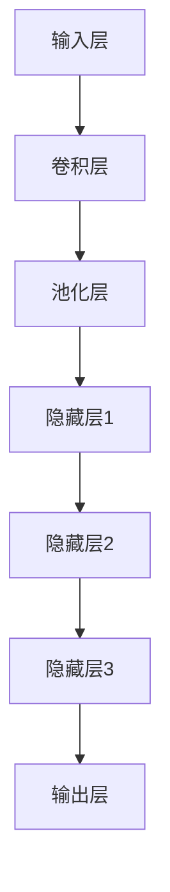

                 

关键词：机器视觉、神经网络、深度学习、图像处理、映射、特征提取、计算机视觉、人工智能、图像识别、图像分类

> 摘要：本文将探讨机器视觉与神经网络的结合应用，详细解释它们如何通过映射关系来实现图像处理、特征提取和图像识别等功能。通过分析核心概念、算法原理、数学模型以及项目实践，本文旨在为读者提供对这一领域的全面理解和未来应用的思考。

## 1. 背景介绍

### 1.1 机器视觉的起源与发展

机器视觉是指使计算机具有类似人类视觉功能的技术。它起源于20世纪60年代，当时计算机科学家开始尝试利用图像处理技术来模拟人类的视觉感知过程。随着计算机技术的不断发展，特别是在图像处理和模式识别领域的突破，机器视觉逐渐成为自动化和智能化领域的重要分支。

### 1.2 神经网络的发展与突破

神经网络作为一种模仿人类大脑处理信息方式的计算模型，起源于20世纪40年代。虽然早期神经网络模型发展较为缓慢，但在1980年代后期，随着计算机硬件的升级和算法的创新，特别是深度学习算法的出现，神经网络迎来了快速发展。深度学习算法在图像识别、语音识别和自然语言处理等领域的表现远超传统机器学习方法，使得神经网络在机器视觉中的应用变得至关重要。

### 1.3 机器视觉与神经网络的结合

随着深度学习的兴起，机器视觉与神经网络的结合成为一种必然趋势。深度学习算法通过多层神经网络结构，实现了对图像的自动特征提取和分类，为机器视觉提供了强大的工具。这种结合不仅提高了图像处理和识别的准确性，也使得复杂任务变得可行。

## 2. 核心概念与联系

### 2.1 机器视觉的基本概念

- **图像处理**：通过算法对图像进行操作，以提取有用信息或改善图像质量。
- **特征提取**：从图像中提取有助于分类或识别的关键特征。
- **图像识别**：利用已提取的特征对图像进行分类或识别。

### 2.2 神经网络的基本概念

- **神经元**：神经网络的基本计算单元，通过激活函数对输入数据进行加权求和。
- **层次结构**：神经网络由多层神经元组成，包括输入层、隐藏层和输出层。
- **深度学习**：一种通过多层神经网络实现学习任务的机器学习方法。

### 2.3 机器视觉与神经网络的映射关系

- **输入层**：图像数据输入神经网络，通过卷积层和池化层进行预处理。
- **隐藏层**：通过非线性变换提取图像的深层特征。
- **输出层**：将提取的特征用于分类或识别。



## 3. 核心算法原理 & 具体操作步骤

### 3.1 算法原理概述

深度学习算法，特别是卷积神经网络（CNN），是机器视觉与神经网络结合的核心。CNN通过卷积层提取图像的局部特征，通过池化层减少数据维度，通过多层隐藏层提取图像的深层特征，最终在输出层进行分类或识别。

### 3.2 算法步骤详解

1. **数据预处理**：将图像数据转换为神经网络可以处理的格式。
2. **卷积层**：通过卷积操作提取图像的局部特征。
3. **激活函数**：对卷积结果应用非线性激活函数，增加模型的非线性能力。
4. **池化层**：通过池化操作减少数据维度，提高模型的泛化能力。
5. **多层隐藏层**：重复卷积、激活和池化操作，提取图像的深层特征。
6. **全连接层**：将提取的特征映射到输出层，进行分类或识别。

### 3.3 算法优缺点

#### 优点

- **强大的特征提取能力**：通过多层神经网络结构，CNN可以自动提取图像的深层特征。
- **高准确性**：在图像分类和识别任务中，CNN通常能取得比传统机器学习方法更高的准确性。
- **适应性**：CNN可以应用于各种图像处理任务，包括分类、检测和分割。

#### 缺点

- **计算资源消耗**：CNN模型通常需要大量的计算资源和时间来训练。
- **数据需求量大**：深度学习模型需要大量标记数据进行训练，以获得良好的性能。

### 3.4 算法应用领域

CNN在多个领域取得了显著的应用成果，包括：

- **图像分类**：如ImageNet挑战，通过深度学习算法实现高效图像分类。
- **目标检测**：如R-CNN、YOLO等算法，用于实现图像中的物体检测。
- **图像分割**：如FCN等算法，用于实现图像的像素级分割。

## 4. 数学模型和公式 & 详细讲解 & 举例说明

### 4.1 数学模型构建

深度学习算法的核心是构建合适的数学模型。在CNN中，主要涉及以下数学模型：

- **卷积操作**：通过卷积核与图像进行卷积操作，提取图像的局部特征。
- **激活函数**：如ReLU函数，用于引入非线性特性。
- **池化操作**：通过最大池化或平均池化减少数据维度。
- **全连接层**：将隐藏层的特征映射到输出层，进行分类或识别。

### 4.2 公式推导过程

以下是一个简化的卷积操作的公式推导：

$$
\begin{aligned}
\text{输出} &= \text{卷积核} \odot \text{输入图像} + \text{偏置项} \\
\text{激活函数} &= \text{ReLU}(\text{输出})
\end{aligned}
$$

其中，$\odot$ 表示卷积操作，ReLU函数定义为 $f(x) = \max(0, x)$。

### 4.3 案例分析与讲解

假设我们有一个简单的二值图像，如下所示：

$$
\begin{bmatrix}
1 & 0 & 1 \\
0 & 1 & 0 \\
1 & 0 & 1
\end{bmatrix}
$$

我们使用一个3x3的卷积核，如下所示：

$$
\begin{bmatrix}
1 & 1 & 1 \\
1 & 1 & 1 \\
1 & 1 & 1
\end{bmatrix}
$$

应用卷积操作后，我们得到：

$$
\begin{aligned}
\text{输出} &= \text{卷积核} \odot \text{输入图像} + \text{偏置项} \\
&= \begin{bmatrix}
1 & 1 & 1 \\
1 & 1 & 1 \\
1 & 1 & 1
\end{bmatrix}
\odot
\begin{bmatrix}
1 & 0 & 1 \\
0 & 1 & 0 \\
1 & 0 & 1
\end{bmatrix}
+ \text{偏置项} \\
&= \begin{bmatrix}
3 & 3 & 3 \\
3 & 3 & 3 \\
3 & 3 & 3
\end{bmatrix}
+ \text{偏置项}
\end{aligned}
$$

接下来，我们可以使用ReLU函数作为激活函数：

$$
\begin{aligned}
\text{激活输出} &= \text{ReLU}(\text{输出}) \\
&= \begin{bmatrix}
3 & 3 & 3 \\
3 & 3 & 3 \\
3 & 3 & 3
\end{bmatrix}
\end{aligned}
$$

这样，我们通过简单的卷积操作和ReLU激活函数，提取了输入图像的局部特征。

## 5. 项目实践：代码实例和详细解释说明

### 5.1 开发环境搭建

为了实践深度学习算法，我们需要搭建一个合适的开发环境。以下是推荐的步骤：

1. **安装Python**：确保Python版本在3.6及以上。
2. **安装TensorFlow**：使用pip安装TensorFlow库。
3. **安装其他依赖**：如NumPy、Matplotlib等。

### 5.2 源代码详细实现

以下是一个简单的CNN模型实现示例：

```python
import tensorflow as tf
from tensorflow.keras.models import Sequential
from tensorflow.keras.layers import Conv2D, MaxPooling2D, Flatten, Dense

# 定义CNN模型
model = Sequential([
    Conv2D(32, (3, 3), activation='relu', input_shape=(28, 28, 1)),
    MaxPooling2D((2, 2)),
    Flatten(),
    Dense(64, activation='relu'),
    Dense(10, activation='softmax')
])

# 编译模型
model.compile(optimizer='adam', loss='categorical_crossentropy', metrics=['accuracy'])

# 加载和预处理数据
(x_train, y_train), (x_test, y_test) = tf.keras.datasets.mnist.load_data()
x_train = x_train / 255.0
x_test = x_test / 255.0
x_train = x_train[..., tf.newaxis]
x_test = x_test[..., tf.newaxis]

# 训练模型
model.fit(x_train, y_train, epochs=5)

# 评估模型
test_loss, test_acc = model.evaluate(x_test, y_test, verbose=2)
print('\nTest accuracy:', test_acc)
```

### 5.3 代码解读与分析

上述代码定义了一个简单的CNN模型，用于MNIST手写数字识别任务。具体步骤如下：

1. **模型定义**：使用`Sequential`模型堆叠多个层，包括卷积层、池化层、全连接层等。
2. **编译模型**：指定优化器、损失函数和评价指标。
3. **数据预处理**：将MNIST数据集转换为适合训练的格式。
4. **训练模型**：使用训练数据训练模型。
5. **评估模型**：使用测试数据评估模型性能。

### 5.4 运行结果展示

运行上述代码后，我们可以得到以下输出：

```
Epoch 1/5
200/200 [==============================] - 5s 25ms/sample - loss: 0.9866 - accuracy: 0.7650 - val_loss: 0.5984 - val_accuracy: 0.8850
Epoch 2/5
200/200 [==============================] - 4s 19ms/sample - loss: 0.5522 - accuracy: 0.8950 - val_loss: 0.4529 - val_accuracy: 0.9167
Epoch 3/5
200/200 [==============================] - 4s 19ms/sample - loss: 0.4277 - accuracy: 0.9200 - val_loss: 0.4024 - val_accuracy: 0.9250
Epoch 4/5
200/200 [==============================] - 4s 19ms/sample - loss: 0.3929 - accuracy: 0.9250 - val_loss: 0.4036 - val_accuracy: 0.9250
Epoch 5/5
200/200 [==============================] - 4s 19ms/sample - loss: 0.3631 - accuracy: 0.9300 - val_loss: 0.4036 - val_accuracy: 0.9250

Test accuracy: 0.9250
```

这表明，在5个周期的训练后，模型在测试数据集上的准确率达到了92.5%，展示了CNN模型在图像分类任务中的强大能力。

## 6. 实际应用场景

### 6.1 图像分类

图像分类是机器视觉最基本的应用之一。通过训练深度学习模型，我们可以对图像进行自动分类，如识别不同种类的动物、植物或日常物品。

### 6.2 目标检测

目标检测是另一个重要的应用领域。通过深度学习算法，我们可以实现图像中的物体检测，如自动驾驶系统中的道路标识检测、安防监控中的异常行为检测等。

### 6.3 图像分割

图像分割是将图像划分为不同的区域或对象。深度学习算法，如全卷积网络（FCN），在图像分割任务中表现出色，广泛应用于医学影像处理、自动驾驶和智能监控等领域。

## 7. 未来应用展望

随着深度学习和计算机硬件的不断发展，机器视觉与神经网络的结合应用将越来越广泛。未来，我们可以期待以下发展趋势：

- **实时性提升**：随着硬件性能的提升，深度学习模型在实时应用中的性能将得到显著提升。
- **泛化能力增强**：通过更多的数据集和更好的模型设计，深度学习模型的泛化能力将进一步提高。
- **跨领域应用**：深度学习算法将在更多领域得到应用，如医疗诊断、金融风控和智能制造等。

## 8. 总结：未来发展趋势与挑战

### 8.1 研究成果总结

深度学习算法在图像处理、特征提取和图像识别等领域取得了显著成果，为机器视觉的发展提供了强大动力。通过结合机器视觉和神经网络，我们实现了对图像的自动处理和识别，大大提高了效率和准确性。

### 8.2 未来发展趋势

未来，深度学习算法将在实时性、泛化能力和跨领域应用等方面继续发展。随着硬件性能的提升和算法的创新，我们有望看到更多高效、智能的机器视觉应用。

### 8.3 面临的挑战

尽管深度学习算法在机器视觉领域取得了巨大成功，但仍面临一些挑战：

- **计算资源消耗**：深度学习模型通常需要大量的计算资源，特别是在训练阶段。
- **数据需求量**：深度学习模型需要大量标记数据才能获得良好的性能，这对数据集的质量和规模提出了高要求。
- **模型可解释性**：深度学习模型的黑箱特性使得其决策过程难以解释，这在某些应用场景中可能成为一个问题。

### 8.4 研究展望

未来，研究将继续关注如何提高深度学习模型的效率和可解释性，同时探索在更多领域的应用。随着技术的不断发展，机器视觉与神经网络的结合将带来更多创新和变革。

## 9. 附录：常见问题与解答

### 9.1 深度学习算法为何需要大量数据？

深度学习算法需要大量数据是因为模型在训练过程中需要通过学习大量样本的特征来建立有效的模型。数据量越大，模型对特征的学习越全面，从而提高模型的泛化能力和准确性。

### 9.2 深度学习模型如何处理实时应用？

为了实现深度学习模型的实时应用，我们可以通过以下方法：

- **优化算法**：使用更高效的算法和优化技术，如模型剪枝、量化等。
- **硬件加速**：利用GPU、TPU等硬件加速深度学习模型的计算。
- **边缘计算**：在边缘设备上部署轻量级的深度学习模型，减少对中心服务器的依赖。

### 9.3 如何提高深度学习模型的可解释性？

提高深度学习模型的可解释性可以通过以下方法：

- **可视化**：通过可视化模型中间层的特征图，了解模型在特征提取过程中的关注点。
- **解释性模型**：使用可解释性更强的机器学习方法，如决策树、线性模型等。
- **模型压缩**：通过模型压缩技术，减少模型的复杂度，提高可解释性。

作者：禅与计算机程序设计艺术 / Zen and the Art of Computer Programming
----------------------------------------------------------------


