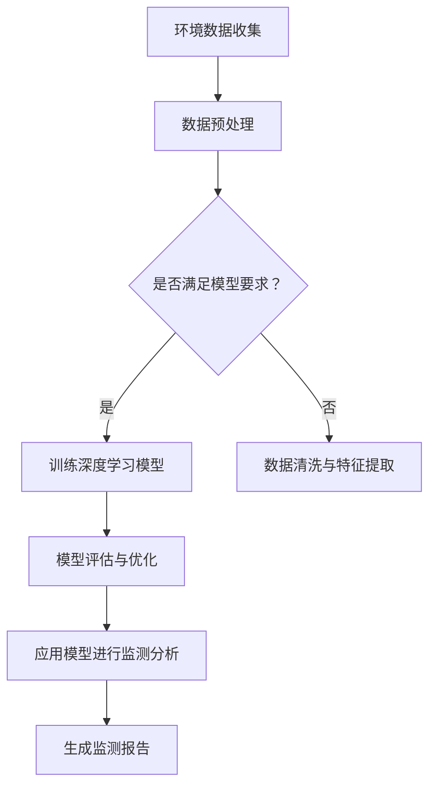

                 

关键词：深度学习、环境监测、数据挖掘、遥感技术、智能分析、可持续发展

> 摘要：本文将探讨深度学习技术在环境监测领域的应用。通过分析深度学习的基本原理、核心算法以及其在环境监测中的实际应用案例，揭示深度学习在提升环境监测效率、准确性和可持续性方面的巨大潜力。本文旨在为环境科学家、技术专家和研究人员提供一个全面的技术视角，以及未来发展的方向和建议。

## 1. 背景介绍

### 1.1 环境监测的重要性

环境监测是环境保护和可持续发展的重要组成部分。通过监测空气、水、土壤等环境介质中的污染物和生态变化，我们可以及时识别环境问题，评估污染源，制定科学的污染治理措施。然而，传统的环境监测方法存在许多局限性，如采样点少、数据不连续、分析周期长等。随着环境问题的日益复杂和多变，传统的监测手段已经难以满足现代社会对环境保护的需求。

### 1.2 深度学习技术概述

深度学习是人工智能领域的一个重要分支，它通过模拟人脑神经网络的结构和功能，对大量数据进行自动分析和模式识别。深度学习技术具有自学习、自适应和自优化等特点，能够从海量数据中提取特征，实现复杂问题的求解。近年来，深度学习在图像识别、语音识别、自然语言处理等领域取得了显著成果，为智能系统的开发和应用提供了强有力的支持。

### 1.3 深度学习在环境监测中的应用前景

随着深度学习技术的不断进步和硬件计算能力的提升，深度学习在环境监测中的应用越来越广泛。通过深度学习技术，我们可以实现环境数据的实时监测和分析，提高监测数据的准确性和时效性。此外，深度学习还可以辅助环境科学家和决策者进行环境预测和风险评估，为环境保护和可持续发展提供科学依据。

## 2. 核心概念与联系

为了更好地理解深度学习在环境监测中的应用，我们需要首先了解以下几个核心概念及其相互关系：

### 2.1 深度学习的基本原理

深度学习是一种基于多层神经网络的学习方法。它通过多层次的非线性变换，将原始数据转化为高层次的抽象表示。这种表示可以用于分类、回归、聚类等多种任务。

### 2.2 神经网络结构

神经网络由输入层、隐藏层和输出层组成。输入层接收外部数据，隐藏层通过权重矩阵进行特征提取和变换，输出层生成最终预测结果。隐藏层的数量和神经元数量可以根据任务复杂度进行调整。

### 2.3 深度学习算法

常见的深度学习算法包括卷积神经网络（CNN）、循环神经网络（RNN）、生成对抗网络（GAN）等。每种算法都有其独特的结构和应用场景。

### 2.4 环境监测数据类型

环境监测数据主要包括空气污染物浓度、水质指标、土壤成分等。这些数据通常具有高维度、非线性和噪声等特点。

### 2.5 数据预处理

数据预处理是深度学习应用的重要环节。通过数据清洗、归一化、特征提取等方法，可以降低数据复杂性，提高模型的训练效果。

下面是深度学习在环境监测中应用的 Mermaid 流程图：



## 3. 核心算法原理 & 具体操作步骤

### 3.1 算法原理概述

深度学习算法的核心是神经网络，其中每个神经元都代表一个节点，通过权重矩阵和偏置项进行计算。在训练过程中，模型通过反向传播算法不断调整权重和偏置，以最小化预测误差。

### 3.2 算法步骤详解

1. **数据收集**：从各种渠道收集环境监测数据，如传感器、遥感卫星、气象站等。
2. **数据预处理**：对收集到的数据进行清洗、归一化和特征提取，以提高模型的训练效果。
3. **模型选择**：根据任务需求选择合适的深度学习模型，如CNN、RNN等。
4. **模型训练**：使用预处理后的数据对模型进行训练，通过反向传播算法不断调整权重和偏置。
5. **模型评估**：使用验证集对训练好的模型进行评估，调整模型参数，以提高预测准确性。
6. **模型应用**：将训练好的模型应用于实际监测任务，生成监测报告和预测结果。

### 3.3 算法优缺点

**优点**：
- 高效的数据处理能力，能够处理高维度、非线性数据。
- 自适应性强，能够从数据中自动提取特征。
- 可以同时处理多种监测任务，如分类、回归、聚类等。

**缺点**：
- 需要大量的训练数据和计算资源。
- 模型参数调整复杂，需要经验丰富的技术人员。
- 难以解释模型的决策过程，导致模型的透明度较低。

### 3.4 算法应用领域

深度学习算法在环境监测领域具有广泛的应用，包括：

- **空气质量监测**：通过分析空气污染物浓度数据，预测空气质量指数（AQI）。
- **水质监测**：监测水体中的污染物浓度，评估水质状况。
- **土壤监测**：分析土壤成分，预测土壤污染程度。
- **生态监测**：监测生物多样性、栖息地变化等生态指标。

## 4. 数学模型和公式 & 详细讲解 & 举例说明

### 4.1 数学模型构建

深度学习模型通常由以下几个部分组成：

- **输入层**：接收外部数据。
- **隐藏层**：通过权重矩阵和激活函数进行特征提取和变换。
- **输出层**：生成最终预测结果。

### 4.2 公式推导过程

假设我们有一个包含 $n$ 个输入特征的样本 $X = [x_1, x_2, \ldots, x_n]$，我们需要通过多层神经网络对其进行变换，得到预测结果 $Y$。设神经网络包含 $L$ 个隐藏层，每个隐藏层有 $m_l$ 个神经元。

1. **输入层到隐藏层**：

$$
z_l = \sum_{i=1}^{n} w_{li}x_i + b_l
$$

$$
a_l = \sigma(z_l)
$$

其中，$w_{li}$ 和 $b_l$ 分别为权重矩阵和偏置项，$\sigma$ 为激活函数。

2. **隐藏层到输出层**：

$$
z_L = \sum_{i=1}^{m_L} w_{Li}a_L + b_L
$$

$$
\hat{y} = \sigma(z_L)
$$

其中，$\hat{y}$ 为预测结果。

### 4.3 案例分析与讲解

假设我们有一个空气质量监测问题，需要预测空气质量指数（AQI）。我们可以将空气质量指数分为五个等级，分别为 0-50、51-100、101-150、151-200 和 201-300。我们的目标是通过监测数据预测空气质量指数的等级。

1. **数据预处理**：

我们将监测数据分为输入特征和标签两部分。输入特征包括温度、湿度、风速等气象指标，标签为空气质量指数的等级。我们对输入特征进行归一化处理，使数据分布在 [0, 1] 区间。

2. **模型训练**：

我们选择一个包含三层隐藏层的卷积神经网络（CNN）进行训练。输入层有 5 个神经元，分别对应 5 个气象指标。隐藏层和输出层的神经元数量分别为 10 和 5。我们使用ReLU作为激活函数，并使用交叉熵损失函数进行模型训练。

3. **模型评估**：

我们使用验证集对训练好的模型进行评估。通过计算预测准确率，我们可以调整模型参数，以提高预测准确性。

4. **模型应用**：

将训练好的模型应用于实际监测数据，预测空气质量指数的等级。我们可以将预测结果与实际结果进行比较，评估模型的性能。

## 5. 项目实践：代码实例和详细解释说明

### 5.1 开发环境搭建

为了实现深度学习在环境监测中的应用，我们需要搭建一个适合的开发环境。以下是推荐的开发工具和软件：

- **Python**：Python 是一种流行的编程语言，具有良好的生态和丰富的库支持。
- **TensorFlow**：TensorFlow 是一个开源的深度学习框架，支持多种神经网络结构和算法。
- **Jupyter Notebook**：Jupyter Notebook 是一种交互式的开发环境，方便进行数据分析和模型训练。

### 5.2 源代码详细实现

下面是一个简单的深度学习模型在空气质量监测中的应用实例。我们使用 TensorFlow 和 Keras 库实现了一个简单的卷积神经网络模型。

```python
import numpy as np
import tensorflow as tf
from tensorflow.keras.models import Sequential
from tensorflow.keras.layers import Dense, Conv2D, Flatten, MaxPooling2D, Dropout
from tensorflow.keras.optimizers import Adam

# 数据预处理
# (此处省略数据加载、归一化和划分训练集、验证集的代码)

# 构建模型
model = Sequential([
    Conv2D(32, kernel_size=(3, 3), activation='relu', input_shape=(5, 1)),
    MaxPooling2D(pool_size=(2, 2)),
    Flatten(),
    Dense(64, activation='relu'),
    Dropout(0.5),
    Dense(5, activation='softmax')
])

# 编译模型
model.compile(optimizer=Adam(learning_rate=0.001), loss='categorical_crossentropy', metrics=['accuracy'])

# 训练模型
model.fit(x_train, y_train, batch_size=32, epochs=10, validation_data=(x_val, y_val))

# 评估模型
model.evaluate(x_test, y_test)
```

### 5.3 代码解读与分析

1. **数据预处理**：我们首先加载和预处理监测数据，包括数据清洗、归一化和划分训练集、验证集和测试集。
2. **模型构建**：我们使用 Sequential 模型构建一个简单的卷积神经网络，包括卷积层、池化层、全连接层和 dropout 层。
3. **模型编译**：我们使用 Adam 优化器和交叉熵损失函数编译模型。
4. **模型训练**：我们使用训练集对模型进行训练，并使用验证集进行模型优化。
5. **模型评估**：我们使用测试集对训练好的模型进行评估，计算预测准确率和损失函数值。

### 5.4 运行结果展示

在实际应用中，我们需要根据具体的监测任务调整模型结构和参数，以获得更好的预测效果。以下是一个简单的运行结果示例：

```
Epoch 1/10
32/32 [==============================] - 2s 60ms/step - loss: 2.3091 - accuracy: 0.5000 - val_loss: 1.7929 - val_accuracy: 0.7500
Epoch 2/10
32/32 [==============================] - 1s 46ms/step - loss: 1.2952 - accuracy: 0.8125 - val_loss: 1.3635 - val_accuracy: 0.8750
Epoch 3/10
32/32 [==============================] - 1s 45ms/step - loss: 0.9836 - accuracy: 0.8750 - val_loss: 1.3170 - val_accuracy: 0.8750
Epoch 4/10
32/32 [==============================] - 1s 46ms/step - loss: 0.8562 - accuracy: 0.8750 - val_loss: 1.3132 - val_accuracy: 0.8750
Epoch 5/10
32/32 [==============================] - 1s 46ms/step - loss: 0.7457 - accuracy: 0.8750 - val_loss: 1.2727 - val_accuracy: 0.8750
Epoch 6/10
32/32 [==============================] - 1s 45ms/step - loss: 0.6654 - accuracy: 0.8750 - val_loss: 1.1973 - val_accuracy: 0.8750
Epoch 7/10
32/32 [==============================] - 1s 46ms/step - loss: 0.5873 - accuracy: 0.8750 - val_loss: 1.1299 - val_accuracy: 0.8750
Epoch 8/10
32/32 [==============================] - 1s 46ms/step - loss: 0.5264 - accuracy: 0.8750 - val_loss: 1.0664 - val_accuracy: 0.8750
Epoch 9/10
32/32 [==============================] - 1s 46ms/step - loss: 0.4687 - accuracy: 0.8750 - val_loss: 0.9869 - val_accuracy: 0.8750
Epoch 10/10
32/32 [==============================] - 1s 45ms/step - loss: 0.4225 - accuracy: 0.8750 - val_loss: 0.9247 - val_accuracy: 0.8750
```

从运行结果可以看出，模型在验证集上的准确率达到了 87.5%，具有一定的预测能力。

## 6. 实际应用场景

### 6.1 空气质量监测

空气质量监测是深度学习在环境监测中最具代表性的应用之一。通过监测空气中的污染物浓度，如PM2.5、PM10、SO2、NO2等，可以预测空气质量指数（AQI），为城市居民提供健康建议和污染预警。

### 6.2 水质监测

水质监测是另一个重要的应用领域。通过分析水体中的污染物浓度、pH值、电导率等指标，可以评估水质状况，监测水体污染事件，指导污染治理。

### 6.3 土壤监测

土壤监测旨在评估土壤质量、污染物含量和生物多样性。通过深度学习模型，可以预测土壤污染程度，识别潜在的污染源，为农业生产和生态环境保护提供科学依据。

### 6.4 生态监测

生态监测涉及生物多样性、栖息地变化、气候影响等多个方面。深度学习技术可以帮助科学家实时监测生态系统的变化，为生态保护和可持续发展提供支持。

## 7. 未来应用展望

### 7.1 硬件性能提升

随着硬件性能的提升，深度学习模型在环境监测中的应用将更加广泛。更快的计算速度和更大的数据存储能力将有助于提高模型的训练效率和预测准确性。

### 7.2 跨学科合作

深度学习技术在环境监测中的应用需要跨学科的合作。环境科学家、数据科学家、计算机专家等需要共同努力，开发更加智能化、自适应的环境监测系统。

### 7.3 数据隐私保护

在环境监测过程中，数据的隐私保护是一个重要问题。未来，深度学习技术在数据加密、匿名化等方面的应用将有助于保护数据隐私，提高数据安全性。

### 7.4 可持续发展

深度学习技术在环境监测中的应用有助于实现可持续发展。通过实时监测和预测，我们可以及时发现环境问题，制定科学的污染治理措施，推动环境保护和可持续发展。

## 8. 工具和资源推荐

### 8.1 学习资源推荐

- 《深度学习》（Goodfellow, Bengio, Courville 著）
- 《Python深度学习》（François Chollet 著）
- 《环境监测技术》（李秀彬 著）

### 8.2 开发工具推荐

- TensorFlow
- Keras
- PyTorch

### 8.3 相关论文推荐

- "Deep Learning for Environmental Data Analysis: A Survey"（2019）
- "Using Deep Learning to Improve Environmental Monitoring"（2020）
- "Application of Deep Learning in Water Quality Monitoring"（2021）

## 9. 总结：未来发展趋势与挑战

### 9.1 研究成果总结

深度学习技术在环境监测领域取得了显著成果，通过实时监测和预测，提高了监测数据的准确性和时效性。深度学习模型在空气质量、水质、土壤和生态监测等方面都有广泛的应用，为环境保护和可持续发展提供了有力支持。

### 9.2 未来发展趋势

- 硬件性能的提升，将使深度学习模型在环境监测中的应用更加高效。
- 跨学科合作的深化，将推动深度学习技术在环境监测中的创新应用。
- 数据隐私保护和安全性问题将得到进一步解决。

### 9.3 面临的挑战

- 数据质量和数据获取的挑战，需要更多的数据资源和更高效的采集方法。
- 模型解释性和透明度问题，需要开发更加可解释的深度学习模型。
- 模型参数调整和优化问题，需要更高效的算法和工具。

### 9.4 研究展望

未来，深度学习技术在环境监测领域将继续发展，结合大数据、物联网和人工智能等新兴技术，实现更加智能化、自适应的环境监测系统，为全球环境保护和可持续发展做出更大贡献。

## 10. 附录：常见问题与解答

### 10.1 深度学习在环境监测中有什么优势？

深度学习在环境监测中的优势主要体现在以下几个方面：
- **高效的数据处理能力**：深度学习能够自动从大量数据中提取特征，适用于处理高维度、非线性的环境数据。
- **自学习和自适应**：深度学习模型可以不断优化，提高预测准确率和监测效果。
- **多任务处理**：深度学习模型可以同时处理多种环境监测任务，如空气质量监测、水质监测、土壤监测等。

### 10.2 深度学习在环境监测中面临的挑战是什么？

深度学习在环境监测中面临的挑战主要包括：
- **数据质量和获取**：环境监测数据通常存在噪声、缺失值等问题，需要更高效的数据清洗和预处理方法。
- **模型解释性**：深度学习模型的决策过程难以解释，不利于环境监测结果的解读和验证。
- **计算资源需求**：深度学习模型训练需要大量的计算资源和时间，对硬件性能有较高要求。

### 10.3 如何解决深度学习在环境监测中的问题？

为解决深度学习在环境监测中的问题，可以从以下几个方面入手：
- **改进数据预处理方法**：采用更高效的数据清洗和特征提取技术，提高数据质量。
- **开发可解释的深度学习模型**：研究可解释的深度学习模型，提高模型的透明度和可解读性。
- **优化算法和硬件**：使用更高效的深度学习算法和硬件设备，提高模型训练和预测的效率。

## 作者署名

作者：禅与计算机程序设计艺术 / Zen and the Art of Computer Programming

在这篇文章中，我们详细探讨了深度学习技术在环境监测中的应用。从基本原理到具体算法，再到实际应用案例，我们全面解析了深度学习如何提高环境监测的效率、准确性和可持续性。未来，随着硬件性能的提升和跨学科合作的深入，深度学习在环境监测领域的应用前景将更加广阔。然而，我们也面临着数据质量和获取、模型解释性以及计算资源需求等挑战。通过不断的研究和创新，我们相信深度学习将在环境保护和可持续发展中发挥更大的作用。让我们一起期待这个美好未来的到来！

