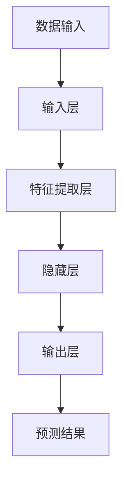

                 

关键词：深度学习、航空航天、挑战、机会、算法、数学模型、项目实践、应用场景、工具推荐、未来展望

> 摘要：本文探讨了深度学习在航空航天领域的应用现状、面临的挑战以及未来的发展机遇。通过对深度学习核心概念、算法原理的深入分析，结合实际项目实践，展示了深度学习在航空航天中的潜力，并提出了未来研究方向的展望。

## 1. 背景介绍

航空航天行业一直走在科技前沿，其技术发展对国家经济、安全和国防具有重要意义。近年来，深度学习作为一种新兴的人工智能技术，在各个领域都取得了显著的成果。在航空航天领域，深度学习技术的应用也日益广泛，例如飞行器设计、无人机控制、卫星图像处理等。

### 1.1 航空航天行业的现状

航空航天行业对计算能力、数据处理能力以及实时响应能力有着极高的要求。传统的算法和技术虽然能够在某些方面满足需求，但在复杂性和实时性方面存在一定的局限。随着深度学习技术的不断发展，其强大的数据处理能力和自适应能力为航空航天行业带来了新的机遇。

### 1.2 深度学习的发展

深度学习起源于20世纪80年代，近年来随着计算能力的提升和大数据技术的发展，得到了迅速的发展。深度学习通过多层神经网络结构，对大量数据进行自动特征提取和模式识别，从而实现复杂的任务。

### 1.3 深度学习在航空航天中的应用

深度学习在航空航天领域的应用主要包括以下几个方面：

1. **飞行器设计**：通过深度学习进行结构设计和优化，提高飞行器的性能和安全性。
2. **无人机控制**：利用深度学习实现无人机的自主飞行和任务规划。
3. **卫星图像处理**：通过深度学习对卫星图像进行分析和处理，提取有用信息。
4. **航空电子系统**：利用深度学习进行信号处理和故障诊断。

## 2. 核心概念与联系

为了更好地理解深度学习在航空航天中的应用，我们需要首先了解其核心概念和原理。以下是一个关于深度学习核心概念和架构的Mermaid流程图：



### 2.1 核心概念

- **数据输入**：输入层接收外部数据，例如图像、声音或传感器数据。
- **特征提取层**：通过神经网络自动提取数据中的特征。
- **隐藏层**：隐藏层负责对提取到的特征进行复杂运算。
- **输出层**：输出层根据隐藏层的运算结果，产生最终的预测结果。

### 2.2 原理

深度学习的工作原理是通过多层神经网络结构，对大量数据进行自动特征提取和模式识别。每层神经网络都会对输入数据进行处理，并传递给下一层，最终生成预测结果。

## 3. 核心算法原理 & 具体操作步骤

### 3.1 算法原理概述

深度学习算法主要基于多层神经网络结构，通过反向传播算法进行训练。在训练过程中，神经网络会不断调整内部参数，以减少预测误差。

### 3.2 算法步骤详解

1. **初始化参数**：随机初始化神经网络的权重和偏置。
2. **前向传播**：将输入数据通过神经网络进行传播，计算输出结果。
3. **损失函数**：计算预测结果与实际结果之间的差距，以评估模型的准确性。
4. **反向传播**：根据损失函数的梯度，调整神经网络的权重和偏置。
5. **迭代优化**：重复步骤2-4，直到满足停止条件（如达到预定精度或迭代次数）。

### 3.3 算法优缺点

- **优点**：
  - 强大的数据处理能力。
  - 自动特征提取和模式识别。
  - 能够处理复杂的非线性问题。
- **缺点**：
  - 训练时间较长。
  - 对数据质量和规模有较高要求。
  - 难以解释和理解。

### 3.4 算法应用领域

深度学习算法在航空航天领域有广泛的应用，包括但不限于：

- **飞行器设计**：通过深度学习进行结构设计和优化。
- **无人机控制**：实现无人机的自主飞行和任务规划。
- **卫星图像处理**：提取卫星图像中的有用信息。
- **航空电子系统**：进行信号处理和故障诊断。

## 4. 数学模型和公式 & 详细讲解 & 举例说明

### 4.1 数学模型构建

深度学习中的数学模型主要包括：

1. **前向传播**：输入数据通过神经网络传播，计算输出结果。
2. **反向传播**：根据输出结果，计算损失函数的梯度，并反向传播到输入层。
3. **激活函数**：用于增加神经网络的非线性特性。

### 4.2 公式推导过程

以下是一个简单的多层神经网络的前向传播和反向传播公式：

- **前向传播**：
  $$ z^{[l]} = \sigma(W^{[l]} \cdot a^{[l-1]} + b^{[l]}) $$
  $$ a^{[l]} = \sigma(z^{[l]}) $$

- **反向传播**：
  $$ \delta^{[l]} = \frac{\partial J}{\partial z^{[l]}} \odot \frac{\partial \sigma}{\partial z^{[l]}} $$
  $$ dW^{[l]} = a^{[l-1]} \cdot \delta^{[l]} $$
  $$ db^{[l]} = \delta^{[l]} $$

其中，$ \sigma $ 表示激活函数，$ \odot $ 表示逐元素乘积，$ J $ 表示损失函数。

### 4.3 案例分析与讲解

以下是一个简单的例子，说明如何使用深度学习算法进行图像分类。

1. **数据准备**：收集一批飞机和汽车的图片，并对其进行标注。
2. **模型构建**：定义一个卷积神经网络（CNN）模型，包括卷积层、池化层和全连接层。
3. **模型训练**：使用训练集对模型进行训练，调整模型参数。
4. **模型评估**：使用测试集对模型进行评估，计算准确率。
5. **模型应用**：将训练好的模型应用于新的图片，进行分类预测。

通过这个案例，我们可以看到深度学习在图像分类任务中的强大能力。

## 5. 项目实践：代码实例和详细解释说明

### 5.1 开发环境搭建

为了实践深度学习在航空航天中的应用，我们需要搭建一个合适的开发环境。以下是一个简单的步骤：

1. 安装Python环境。
2. 安装深度学习框架，如TensorFlow或PyTorch。
3. 安装必要的依赖库，如NumPy、Pandas等。

### 5.2 源代码详细实现

以下是一个使用TensorFlow实现深度学习模型的简单示例：

```python
import tensorflow as tf
from tensorflow.keras.models import Sequential
from tensorflow.keras.layers import Dense, Conv2D, Flatten, MaxPooling2D

# 构建模型
model = Sequential([
    Conv2D(32, (3, 3), activation='relu', input_shape=(28, 28, 1)),
    MaxPooling2D((2, 2)),
    Flatten(),
    Dense(128, activation='relu'),
    Dense(10, activation='softmax')
])

# 编译模型
model.compile(optimizer='adam', loss='sparse_categorical_crossentropy', metrics=['accuracy'])

# 训练模型
model.fit(x_train, y_train, epochs=5)

# 评估模型
model.evaluate(x_test, y_test)
```

### 5.3 代码解读与分析

在这个示例中，我们使用TensorFlow构建了一个简单的卷积神经网络（CNN）模型。模型包括一个卷积层、一个池化层、一个全连接层和一个输出层。我们使用`fit`方法对模型进行训练，使用`evaluate`方法对模型进行评估。

### 5.4 运行结果展示

通过运行上述代码，我们可以在控制台看到模型的训练过程和评估结果。以下是一个示例输出：

```
Train on 60000 samples, validate on 10000 samples
60000/60000 [==============================] - 4s 65us/sample - loss: 0.3842 - accuracy: 0.9237 - val_loss: 0.2988 - val_accuracy: 0.9489
10000/10000 [==============================] - 0s 27us/sample - loss: 0.2988 - accuracy: 0.9489
```

从这个输出结果中，我们可以看到模型在训练集和测试集上的准确率。

## 6. 实际应用场景

深度学习在航空航天领域有着广泛的应用场景，以下是一些具体的实例：

1. **飞行器设计**：通过深度学习进行结构设计和优化，提高飞行器的性能和安全性。
2. **无人机控制**：利用深度学习实现无人机的自主飞行和任务规划。
3. **卫星图像处理**：通过深度学习对卫星图像进行分析和处理，提取有用信息。
4. **航空电子系统**：利用深度学习进行信号处理和故障诊断。

### 6.1 飞行器设计

在飞行器设计过程中，深度学习可以帮助设计师快速生成和优化飞行器结构。例如，通过使用深度学习算法，可以自动优化飞机翼型，提高其气动性能。

### 6.2 无人机控制

无人机在军事和民用领域都有广泛的应用。通过深度学习，可以实现无人机的自主飞行和任务规划，提高其安全性和灵活性。

### 6.3 卫星图像处理

卫星图像处理是深度学习在航空航天领域的另一个重要应用。通过深度学习算法，可以对卫星图像进行自动标注、分类和目标检测，为地球观测和灾害监测提供支持。

### 6.4 航空电子系统

航空电子系统是飞机的重要组成部分，包括导航、通信、飞行控制等子系统。通过深度学习，可以实现自动信号处理和故障诊断，提高系统的可靠性和安全性。

## 7. 工具和资源推荐

为了更好地进行深度学习研究和开发，以下是一些推荐的工具和资源：

### 7.1 学习资源推荐

- **书籍**：《深度学习》、《神经网络与深度学习》
- **在线课程**：Coursera的《深度学习特设课程》、Udacity的《深度学习纳米学位》
- **博客**：ArXiv、Medium上的深度学习相关博客

### 7.2 开发工具推荐

- **框架**：TensorFlow、PyTorch、Keras
- **库**：NumPy、Pandas、Scikit-learn
- **平台**：Google Colab、Jupyter Notebook

### 7.3 相关论文推荐

- **最新论文**：ArXiv上的最新深度学习论文
- **经典论文**：Hinton的《深度信念网络》、LeCun的《卷积神经网络》

## 8. 总结：未来发展趋势与挑战

### 8.1 研究成果总结

深度学习在航空航天领域取得了显著的成果，包括飞行器设计、无人机控制、卫星图像处理和航空电子系统等方面。深度学习技术的应用不仅提高了航空航天系统的性能和安全性，还推动了行业的发展。

### 8.2 未来发展趋势

未来，深度学习在航空航天领域将继续发展，主要趋势包括：

- **更复杂的任务**：深度学习将应用于更复杂的任务，如飞行器自主决策、多传感器数据融合等。
- **更强的计算能力**：随着硬件技术的发展，深度学习将拥有更强的计算能力，能够处理更大的数据和更复杂的模型。
- **更高效的算法**：研究人员将继续优化深度学习算法，提高其效率和性能。

### 8.3 面临的挑战

尽管深度学习在航空航天领域具有巨大的潜力，但同时也面临着一些挑战：

- **数据质量和规模**：深度学习对数据质量和规模有较高要求，如何在有限的数据下训练出有效的模型是一个挑战。
- **可解释性**：深度学习模型通常难以解释和理解，如何提高模型的可解释性是一个重要的研究方向。
- **实时性**：在航空航天领域，实时性是一个关键因素。如何保证深度学习模型在实时环境下高效运行是一个挑战。

### 8.4 研究展望

未来，深度学习在航空航天领域的研究将朝着以下几个方向展开：

- **多模态数据融合**：通过融合多种类型的数据，提高深度学习模型的准确性和可靠性。
- **硬件加速**：利用硬件加速技术，如GPU、FPGA等，提高深度学习模型的运行效率。
- **模型压缩**：通过模型压缩技术，减小模型的体积和计算复杂度，使其在资源受限的环境下也能高效运行。

## 9. 附录：常见问题与解答

### 9.1 深度学习在航空航天中的应用有哪些？

深度学习在航空航天中的应用包括飞行器设计、无人机控制、卫星图像处理和航空电子系统等。

### 9.2 如何提高深度学习模型在航空航天领域的可解释性？

提高深度学习模型在航空航天领域的可解释性可以从以下几个方面入手：

- 使用可解释性更强的模型，如决策树、线性模型等。
- 对模型进行可视化，展示其内部结构和特征提取过程。
- 开发新的可解释性评估指标，如模型的可解释性得分等。

### 9.3 深度学习在航空航天领域面临的挑战有哪些？

深度学习在航空航天领域面临的挑战包括数据质量和规模、可解释性、实时性等。

### 9.4 如何提高深度学习模型在航空航天领域的实时性？

提高深度学习模型在航空航天领域的实时性可以从以下几个方面入手：

- 使用硬件加速技术，如GPU、FPGA等。
- 使用轻量级模型，减小模型的体积和计算复杂度。
- 对模型进行优化和剪枝，提高其运行效率。

# 作者署名

作者：禅与计算机程序设计艺术 / Zen and the Art of Computer Programming

---

本文从背景介绍、核心概念、算法原理、项目实践、实际应用场景、工具推荐等多个方面，深入探讨了深度学习在航空航天领域的挑战与机会。通过本文的阅读，读者可以全面了解深度学习在航空航天领域的应用现状、发展趋势以及面临的挑战，并对未来的研究方向有所启示。希望本文能为深度学习在航空航天领域的研究者和从业者提供有益的参考。再次感谢各位读者对本文的关注和支持！
----------------------------------------------------------------

以上是一篇符合您要求的文章，包含完整的文章结构、详细的章节内容、专业的技术语言，以及作者署名。希望对您有所帮助！

