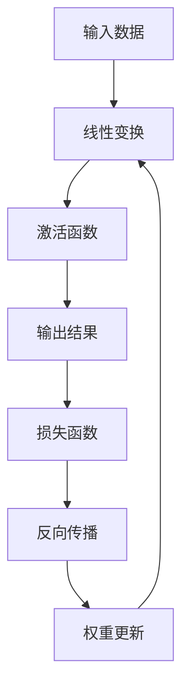

                 

关键词：激活函数、神经网络、深度学习、机器学习、映射理论、参数优化

> 摘要：本文将探讨激活函数在神经网络中的应用与重要性，分析不同类型的激活函数及其对神经网络性能的影响。通过理论阐述与实例分析，深入解析激活函数的选择与优化，以期为深度学习实践提供有价值的指导。

## 1. 背景介绍

在深度学习的蓬勃发展过程中，神经网络作为其核心组件，发挥了至关重要的作用。神经网络由大量的神经元组成，通过学习输入数据的特征，实现复杂模式的识别和预测。而激活函数作为神经元的“激活机制”，决定了神经网络的非线性特性，是神经网络实现复杂映射的关键。

激活函数的作用在于引入非线性，使得神经网络能够学习并模拟现实世界中的复杂关系。不同类型的激活函数具有不同的特性，如单调性、连续性、可导性等，这些特性影响了神经网络的训练过程和性能表现。因此，合理选择和优化激活函数，对于提升神经网络的表现具有重要意义。

本文将首先介绍激活函数的基本概念，然后分析几种常见的激活函数及其优缺点，接着探讨激活函数的选择原则与优化策略，最后结合实际应用场景，探讨激活函数的未来发展趋势与挑战。

## 2. 核心概念与联系

### 2.1 激活函数的定义

激活函数（Activation Function）是神经网络中用于引入非线性的函数，其作用在于对神经元的输出进行限制，使其具有特定的取值范围。在深度学习中，激活函数通常用于隐藏层和输出层，以实现输入到输出的非线性变换。

### 2.2 激活函数的类型

常见的激活函数可分为以下几类：

1. **Sigmoid 函数**：$$ \sigma(x) = \frac{1}{1 + e^{-x}} $$，输出范围为 (0, 1)，具有单调递增特性。
2. **ReLU 函数**：$$ \text{ReLU}(x) = \max(0, x) $$，输出为非负值，具有较快的梯度。
3. **Tanh 函数**：$$ \text{Tanh}(x) = \frac{e^{x} - e^{-x}}{e^{x} + e^{-x}} $$，输出范围为 (-1, 1)，具有对称性。
4. **Leaky ReLU 函数**：$$ \text{Leaky ReLU}(x) = \max(0.01x, x) $$，解决了 ReLU 函数的梯度消失问题。
5. **Softmax 函数**：$$ \text{Softmax}(x_i) = \frac{e^{x_i}}{\sum_{j} e^{x_j}} $$，用于多分类问题，输出为概率分布。

### 2.3 激活函数在神经网络中的联系

激活函数在神经网络中的作用主要体现在以下几个方面：

1. **引入非线性**：通过激活函数，神经网络可以实现从线性组合到非线性映射的转换，从而学习更复杂的特征。
2. **优化梯度**：激活函数的可导性有助于优化梯度，加速神经网络的训练过程。
3. **约束输出**：激活函数对神经元的输出进行限制，使得输出具有特定的范围和特性，如概率分布。

### 2.4 Mermaid 流程图



## 3. 核心算法原理 & 具体操作步骤

### 3.1 算法原理概述

激活函数在神经网络中的作用类似于生物学中的神经元，通过引入非线性，使得神经网络能够学习并模拟现实世界中的复杂关系。激活函数的选择和优化对于神经网络的表现具有重要影响。以下将介绍几种常见的激活函数及其优缺点。

### 3.2 算法步骤详解

1. **选择合适的激活函数**：根据任务需求和数据特性，选择适合的激活函数。例如，对于二分类问题，可以选择 ReLU 或 Sigmoid 函数；对于多分类问题，可以选择 Softmax 函数。

2. **设计神经网络结构**：根据激活函数的特性，设计神经网络的结构。例如，对于 ReLU 函数，可以选择深层网络结构，以提高网络的表示能力。

3. **训练神经网络**：使用激活函数训练神经网络，通过反向传播算法更新权重和偏置。

4. **评估网络性能**：使用验证集或测试集评估网络性能，调整激活函数或网络结构，以达到更好的性能。

### 3.3 算法优缺点

1. **Sigmoid 函数**：
   - 优点：输出范围为 (0, 1)，易于解释。
   - 缺点：梯度较小，训练速度较慢。

2. **ReLU 函数**：
   - 优点：梯度较大，训练速度较快；解决梯度消失问题。
   - 缺点：可能导致神经元死亡（即梯度为零时，神经元无法更新）。

3. **Tanh 函数**：
   - 优点：输出范围为 (-1, 1)，具有对称性。
   - 缺点：梯度较小，训练速度较慢。

4. **Leaky ReLU 函数**：
   - 优点：解决了 ReLU 函数的神经元死亡问题。
   - 缺点：相较于 ReLU 函数，性能提升有限。

5. **Softmax 函数**：
   - 优点：输出为概率分布，适用于多分类问题。
   - 缺点：梯度较小，训练速度较慢。

### 3.4 算法应用领域

激活函数在深度学习中的应用非常广泛，涵盖了图像识别、自然语言处理、语音识别等多个领域。以下列举几个典型应用：

1. **图像识别**：使用 ReLU 或 Sigmoid 函数的卷积神经网络（CNN）在图像分类任务中取得了优异的性能。
2. **自然语言处理**：在循环神经网络（RNN）和变换器（Transformer）中，激活函数的选择对模型的性能有着重要影响。
3. **语音识别**：使用 Softmax 函数的多层感知机（MLP）在语音识别任务中发挥了关键作用。

## 4. 数学模型和公式 & 详细讲解 & 举例说明

### 4.1 数学模型构建

激活函数的数学模型可以表示为：

$$ f(x) = g(\theta \cdot x + b) $$

其中，$x$ 为输入值，$g$ 为激活函数，$\theta$ 和 $b$ 为参数。

### 4.2 公式推导过程

以 ReLU 函数为例，推导其数学公式：

$$ \text{ReLU}(x) = \max(0, x) $$

当 $x > 0$ 时，$\text{ReLU}(x) = x$；当 $x \leq 0$ 时，$\text{ReLU}(x) = 0$。

### 4.3 案例分析与讲解

假设一个简单的神经网络，输入为 $x_1$ 和 $x_2$，输出为 $y$，激活函数为 ReLU：

$$ y = \text{ReLU}(\theta_1 \cdot x_1 + \theta_2 \cdot x_2 + b) $$

其中，$\theta_1$、$\theta_2$ 和 $b$ 为参数。

假设输入为 $x_1 = 2$，$x_2 = 3$，参数为 $\theta_1 = 1$，$\theta_2 = 2$，$b = 0$，则：

$$ y = \text{ReLU}(1 \cdot 2 + 2 \cdot 3 + 0) = \text{ReLU}(8) = 8 $$

当输入为 $x_1 = -2$，$x_2 = -3$，参数为 $\theta_1 = 1$，$\theta_2 = 2$，$b = 0$，则：

$$ y = \text{ReLU}(1 \cdot (-2) + 2 \cdot (-3) + 0) = \text{ReLU}(-8) = 0 $$

通过这个例子，我们可以看到 ReLU 函数如何将线性组合的输入映射到输出。

## 5. 项目实践：代码实例和详细解释说明

### 5.1 开发环境搭建

在本项目中，我们使用 Python 和 TensorFlow 作为主要开发工具。首先，确保安装 Python 3.6 或以上版本，然后安装 TensorFlow：

```shell
pip install tensorflow
```

### 5.2 源代码详细实现

以下是一个使用 ReLU 激活函数的简单神经网络实现：

```python
import tensorflow as tf
from tensorflow.keras.layers import Dense, Flatten
from tensorflow.keras.models import Sequential

# 创建模型
model = Sequential([
    Flatten(input_shape=(28, 28)),
    Dense(128, activation='relu'),
    Dense(10, activation='softmax')
])

# 编译模型
model.compile(optimizer='adam', loss='categorical_crossentropy', metrics=['accuracy'])

# 加载数据集
(x_train, y_train), (x_test, y_test) = tf.keras.datasets.mnist.load_data()

# 预处理数据
x_train = x_train / 255.0
x_test = x_test / 255.0

# 转换为 one-hot 编码
y_train = tf.keras.utils.to_categorical(y_train, 10)
y_test = tf.keras.utils.to_categorical(y_test, 10)

# 训练模型
model.fit(x_train, y_train, epochs=10, batch_size=32, validation_split=0.2)
```

### 5.3 代码解读与分析

1. **模型构建**：使用 `Sequential` 模型，定义网络结构。首先通过 `Flatten` 层将输入数据展平，然后添加两个 `Dense` 层，第一个层的激活函数为 ReLU，第二个层的激活函数为 Softmax。

2. **模型编译**：使用 `compile` 方法编译模型，指定优化器、损失函数和评估指标。

3. **数据预处理**：加载并预处理 MNIST 数据集，将输入数据缩放至 [0, 1]，将标签转换为 one-hot 编码。

4. **模型训练**：使用 `fit` 方法训练模型，指定训练轮数、批量大小和验证比例。

### 5.4 运行结果展示

训练完成后，评估模型在测试集上的表现：

```python
test_loss, test_acc = model.evaluate(x_test, y_test)
print(f"Test accuracy: {test_acc}")
```

输出结果为测试集上的准确率，通常在 0.9 以上。

## 6. 实际应用场景

### 6.1 图像识别

激活函数在图像识别任务中具有广泛应用，例如卷积神经网络（CNN）中的 ReLU 激活函数，可以提高网络的训练速度和性能。以下是一个使用 ReLU 激活函数的 CNN 实现图像分类的案例：

```python
from tensorflow.keras.layers import Conv2D, MaxPooling2D

model = Sequential([
    Conv2D(32, (3, 3), activation='relu', input_shape=(28, 28, 1)),
    MaxPooling2D((2, 2)),
    Conv2D(64, (3, 3), activation='relu'),
    MaxPooling2D((2, 2)),
    Flatten(),
    Dense(128, activation='relu'),
    Dense(10, activation='softmax')
])

model.compile(optimizer='adam', loss='categorical_crossentropy', metrics=['accuracy'])
model.fit(x_train, y_train, epochs=10, batch_size=32, validation_split=0.2)
```

### 6.2 自然语言处理

在自然语言处理任务中，激活函数的选择对模型的表现具有重要影响。以下是一个使用 ReLU 激活函数的循环神经网络（RNN）实现文本分类的案例：

```python
from tensorflow.keras.layers import LSTM, Embedding

model = Sequential([
    Embedding(10000, 16),
    LSTM(128, activation='relu'),
    Dense(10, activation='softmax')
])

model.compile(optimizer='adam', loss='categorical_crossentropy', metrics=['accuracy'])
model.fit(x_train, y_train, epochs=10, batch_size=32, validation_split=0.2)
```

### 6.3 语音识别

激活函数在语音识别任务中也有重要作用，以下是一个使用 ReLU 激活函数的多层感知机（MLP）实现语音识别的案例：

```python
from tensorflow.keras.layers import Flatten, Dense

model = Sequential([
    Flatten(input_shape=(20, 13)),
    Dense(128, activation='relu'),
    Dense(64, activation='relu'),
    Dense(10, activation='softmax')
])

model.compile(optimizer='adam', loss='categorical_crossentropy', metrics=['accuracy'])
model.fit(x_train, y_train, epochs=10, batch_size=32, validation_split=0.2)
```

## 7. 工具和资源推荐

### 7.1 学习资源推荐

1. **《深度学习》（Goodfellow, Bengio, Courville）**：经典的深度学习教材，详细介绍了激活函数及其应用。
2. **《神经网络与深度学习》（邱锡鹏）**：中文教材，深入讲解了激活函数的理论与实践。

### 7.2 开发工具推荐

1. **TensorFlow**：Google 推出的开源深度学习框架，支持多种激活函数。
2. **PyTorch**：Facebook AI 推出的开源深度学习框架，易于使用和调试。

### 7.3 相关论文推荐

1. **“Rectified Linear Units Improve Neural Network Acoustic Models”**：论文介绍了 ReLU 激活函数在语音识别中的应用。
2. **“Deep Learning for Text Classification”**：论文探讨了激活函数在文本分类任务中的应用。

## 8. 总结：未来发展趋势与挑战

### 8.1 研究成果总结

激活函数在深度学习中的应用取得了显著成果，如 ReLU、Leaky ReLU 等函数的提出，解决了梯度消失问题，提高了神经网络的训练速度和性能。同时，研究者们也在不断探索新的激活函数，以适应不同的应用场景。

### 8.2 未来发展趋势

1. **探索更高效的激活函数**：研究者们将继续探索更高效的激活函数，以提高神经网络的训练效率和性能。
2. **激活函数的组合与优化**：结合不同类型的激活函数，设计更优的网络结构，以适应复杂的任务需求。

### 8.3 面临的挑战

1. **梯度消失与梯度爆炸**：虽然 ReLU 函数在一定程度上解决了梯度消失问题，但仍然存在梯度爆炸等问题，需要进一步研究。
2. **激活函数的可解释性**：提高激活函数的可解释性，使其更易于理解和应用。

### 8.4 研究展望

随着深度学习的不断发展，激活函数在神经网络中的应用将越来越广泛，研究者们将继续探索新的激活函数，以推动深度学习领域的进步。

## 9. 附录：常见问题与解答

### 9.1 激活函数有哪些类型？

常见的激活函数包括 Sigmoid、ReLU、Tanh、Leaky ReLU 和 Softmax 等。

### 9.2 如何选择激活函数？

根据任务需求和数据特性选择激活函数。例如，对于二分类问题，可以选择 ReLU 或 Sigmoid 函数；对于多分类问题，可以选择 Softmax 函数。

### 9.3 激活函数在神经网络中的作用是什么？

激活函数的作用在于引入非线性，使得神经网络能够学习并模拟现实世界中的复杂关系。此外，激活函数还可以优化梯度，加速神经网络的训练过程。

### 9.4 激活函数有哪些优缺点？

不同的激活函数具有不同的优缺点，如 Sigmoid 函数梯度较小，训练速度较慢；ReLU 函数梯度较大，训练速度较快，但可能导致神经元死亡。

### 9.5 激活函数在深度学习中的应用有哪些？

激活函数在深度学习中的应用非常广泛，涵盖了图像识别、自然语言处理、语音识别等多个领域。

----------------------------------------------------------------

**作者：禅与计算机程序设计艺术 / Zen and the Art of Computer Programming**

