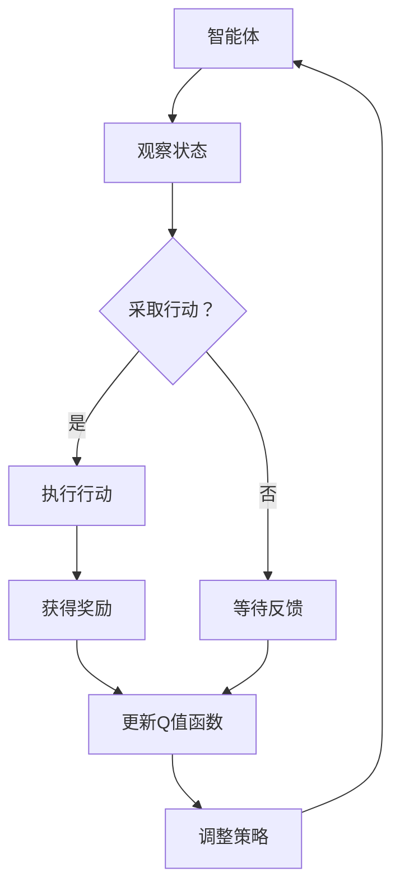

                 

关键词：DQN、环境模型、预测、规划、强化学习

> 摘要：本文深入探讨了环境模型在深度强化学习（DQN）中的应用。通过分析环境模型的作用、核心算法原理以及其在不同领域的应用，我们试图揭示环境模型在预测和规划中的重要作用，为未来研究和实践提供新的视角和启示。

## 1. 背景介绍

在过去的几十年中，人工智能领域取得了飞速的发展，尤其是在机器学习和深度学习方面。深度强化学习（Deep Reinforcement Learning, DRL）作为机器学习的一个重要分支，旨在通过智能体（Agent）与环境（Environment）的交互，实现智能决策和行动。而深度Q网络（Deep Q-Network, DQN）是深度强化学习中的一个重要模型，以其简单有效的特点在许多领域得到了广泛应用。

然而，DQN在实际应用中面临着一些挑战，其中一个主要问题是如何准确建模环境。传统的DQN模型依赖于环境模型，但环境模型的准确性对DQN的性能有着至关重要的影响。因此，如何构建一个准确、高效的环境模型，成为了深度强化学习研究中的一个关键问题。

本文将围绕环境模型在DQN中的应用，分析其预测和规划的作用，探讨其核心算法原理和具体操作步骤，并通过实际项目实践和案例解析，为读者提供一个全面、深入的理解。

## 2. 核心概念与联系

在深入探讨环境模型在DQN中的应用之前，我们需要先了解一些核心概念，如深度强化学习、DQN、环境模型等，并探讨它们之间的联系。

### 2.1 深度强化学习

深度强化学习（Deep Reinforcement Learning, DRL）是一种结合了深度学习和强化学习的机器学习方法。其核心思想是通过智能体（Agent）与环境（Environment）的交互，利用深度神经网络（DNN）来学习策略（Policy），实现智能决策和行动。

在DRL中，智能体通过观察环境状态（State），采取行动（Action），并收到环境反馈的奖励（Reward），以此不断调整策略，以最大化长期累积奖励。深度强化学习的关键在于如何利用深度神经网络来模拟智能体的决策过程，从而实现高效、准确的智能决策。

### 2.2 深度Q网络

深度Q网络（Deep Q-Network, DQN）是深度强化学习中的一个重要模型。DQN的核心思想是通过深度神经网络来近似Q值函数（Q-Function），从而实现智能体的决策。

Q值函数是一个衡量策略在特定状态和行动下能够获得的最大累积奖励的函数。在DQN中，通过训练深度神经网络，使其能够近似Q值函数，从而实现智能体的决策。

### 2.3 环境模型

环境模型（Environment Model）是深度强化学习中一个重要的概念。环境模型是一个预测模型，用于预测智能体在执行特定行动后，环境状态和奖励的变化。

环境模型的准确性对DQN的性能有着至关重要的影响。一个准确的环境模型可以帮助DQN更快地收敛到最优策略，从而提高智能体的决策能力。

### 2.4 环境模型与DQN的联系

环境模型与DQN之间的联系在于，环境模型为DQN提供了对环境状态和奖励的预测。DQN通过不断更新Q值函数，利用环境模型预测的状态和奖励，来调整其策略。

具体来说，DQN首先使用初始的Q值函数预测状态和奖励，然后根据预测结果调整Q值函数。通过多次迭代，DQN逐渐优化其策略，实现智能决策。

下面是环境模型在DQN中的应用的 Mermaid 流程图：



## 3. 核心算法原理 & 具体操作步骤

### 3.1 算法原理概述

DQN是一种基于深度神经网络的强化学习算法，其核心思想是利用深度神经网络来近似Q值函数，从而实现智能体的决策。

在DQN中，智能体首先通过观察环境状态，利用预训练的深度神经网络预测Q值。然后，智能体根据Q值预测结果采取行动，并接收环境反馈的奖励。通过不断迭代更新Q值函数，DQN逐渐优化其策略，实现智能决策。

DQN的主要步骤包括：

1. 初始化Q值函数。
2. 使用预训练的深度神经网络预测Q值。
3. 智能体根据Q值预测结果采取行动。
4. 接收环境反馈的奖励。
5. 更新Q值函数。

### 3.2 算法步骤详解

#### 3.2.1 初始化Q值函数

首先，我们需要初始化Q值函数。在DQN中，Q值函数通常是一个四层全连接神经网络，输入为状态向量，输出为Q值向量。

#### 3.2.2 使用预训练的深度神经网络预测Q值

接下来，我们需要使用预训练的深度神经网络预测Q值。预训练的神经网络可以通过监督学习或迁移学习等方法获得，其目的是使神经网络能够很好地拟合状态和Q值之间的关系。

#### 3.2.3 智能体根据Q值预测结果采取行动

根据Q值预测结果，智能体采取最优行动。在DQN中，最优行动通常是指能够获得最大Q值的行动。

#### 3.2.4 接收环境反馈的奖励

智能体采取行动后，会收到环境反馈的奖励。奖励可以是正的，表示智能体的行动带来了积极的结果；也可以是负的，表示智能体的行动带来了消极的结果。

#### 3.2.5 更新Q值函数

根据接收到的奖励，DQN会更新Q值函数。更新Q值函数的方法有多种，如经验回放（Experience Replay）和目标网络（Target Network）等。

### 3.3 算法优缺点

#### 优点

1. 简单有效：DQN是一种简单、有效的深度强化学习算法，能够处理复杂的决策问题。
2. 强泛化能力：DQN具有良好的泛化能力，能够应用于不同的领域和任务。
3. 不需要环境模型：与传统的强化学习算法不同，DQN不需要环境模型，只需依赖状态和奖励信息。

#### 缺点

1. 学习速度慢：由于DQN依赖于深度神经网络，其训练过程相对较慢。
2. 过度估计：在训练过程中，DQN可能产生过度估计，导致智能体采取过度保守的行动。
3. 需要大量数据：DQN的性能受到数据量的影响，需要大量数据进行训练。

### 3.4 算法应用领域

DQN在各种领域都取得了显著的成果，如游戏、机器人、自动驾驶、推荐系统等。以下是一些典型的应用案例：

1. 游戏领域：DQN在许多游戏领域取得了突破性成果，如Atari游戏、围棋等。
2. 机器人领域：DQN被应用于机器人导航、路径规划等任务，取得了良好的效果。
3. 自动驾驶领域：DQN被应用于自动驾驶车辆的决策和规划，提高了自动驾驶系统的性能。
4. 推荐系统领域：DQN被应用于推荐系统的策略优化，提高了推荐系统的效果。

## 4. 数学模型和公式 & 详细讲解 & 举例说明

### 4.1 数学模型构建

在DQN中，数学模型主要包括Q值函数、策略函数和奖励函数。

#### 4.1.1 Q值函数

Q值函数是一个衡量策略在特定状态和行动下能够获得的最大累积奖励的函数。在DQN中，Q值函数通常使用深度神经网络来近似。

$$
Q(s, a) = f_{\theta}(s, a)
$$

其中，$s$ 表示状态，$a$ 表示行动，$f_{\theta}(s, a)$ 表示神经网络输出的Q值。

#### 4.1.2 策略函数

策略函数是智能体的决策规则，用于选择最优行动。在DQN中，策略函数通常使用ε-贪婪策略（ε-Greedy Policy）。

$$
\pi(s) = 
\begin{cases} 
\text{随机行动} & \text{with probability } 1 - \epsilon \\
\text{最优行动} & \text{with probability } \epsilon 
\end{cases}
$$

其中，$\epsilon$ 表示探索概率。

#### 4.1.3 奖励函数

奖励函数是环境对智能体行动的反馈，用于指导智能体的决策。在DQN中，奖励函数通常使用离散奖励。

$$
r(s, a) = 
\begin{cases} 
r_{\text{正}} & \text{if } s' \text{ is a positive outcome} \\
r_{\text{负}} & \text{if } s' \text{ is a negative outcome} 
\end{cases}
$$

其中，$r_{\text{正}}$ 和 $r_{\text{负}}$ 分别表示正奖励和负奖励。

### 4.2 公式推导过程

在本节中，我们将简要介绍DQN的公式推导过程。

#### 4.2.1 Q值函数的更新

在DQN中，Q值函数的更新主要通过经验回放（Experience Replay）和目标网络（Target Network）实现。

经验回放是一种有效的数据增强方法，通过将历史经验数据随机抽样，减少训练数据的不确定性。经验回放的基本公式如下：

$$
D = \{(s_i, a_i, r_i, s_{i+1})\}
$$

其中，$D$ 表示经验回放池，$\{(s_i, a_i, r_i, s_{i+1})\}$ 表示一个经验样本。

目标网络是一种稳定的Q值函数估计方法，通过 periodically 更新目标网络，减少Q值函数的波动。目标网络的基本公式如下：

$$
Q'(s_i, a_i) = r_i + \gamma \max_{a'} Q'(s_{i+1}, a')
$$

其中，$Q'(s_i, a_i)$ 表示目标网络的Q值，$\gamma$ 表示折扣因子。

#### 4.2.2 策略函数的更新

在DQN中，策略函数的更新主要通过ε-贪婪策略实现。

ε-贪婪策略的基本公式如下：

$$
\pi(s) = 
\begin{cases} 
\text{随机行动} & \text{with probability } 1 - \epsilon \\
\text{最优行动} & \text{with probability } \epsilon 
\end{cases}
$$

其中，$\epsilon$ 表示探索概率。

#### 4.2.3 奖励函数的更新

在DQN中，奖励函数的更新主要通过目标网络的Q值函数实现。

奖励函数的基本公式如下：

$$
r(s, a) = 
\begin{cases} 
r_{\text{正}} & \text{if } s' \text{ is a positive outcome} \\
r_{\text{负}} & \text{if } s' \text{ is a negative outcome} 
\end{cases}
$$

其中，$r_{\text{正}}$ 和 $r_{\text{负}}$ 分别表示正奖励和负奖励。

### 4.3 案例分析与讲解

在本节中，我们将通过一个简单的例子，来讲解DQN的数学模型和公式。

假设我们有一个简单的环境，包含两个状态（状态1和状态2）和两个行动（行动1和行动2）。根据这个环境，我们可以构建一个简单的Q值函数：

$$
Q(s, a) = 
\begin{cases} 
1 & \text{if } s = 1 \text{ and } a = 1 \\
-1 & \text{if } s = 1 \text{ and } a = 2 \\
0 & \text{if } s = 2 \text{ and } a = 1 \\
2 & \text{if } s = 2 \text{ and } a = 2 
\end{cases}
$$

现在，假设智能体处于状态1，采取行动1。根据Q值函数，智能体会获得奖励1。然后，智能体转移到状态2，并采取行动2。根据Q值函数，智能体会获得奖励2。

接下来，我们可以根据Q值函数和奖励函数，来更新Q值函数和策略函数。

首先，更新Q值函数：

$$
Q'(s, a) = r + \gamma \max_{a'} Q'(s', a')
$$

其中，$r$ 表示奖励，$\gamma$ 表示折扣因子。

假设 $\gamma = 0.9$，我们可以得到以下更新后的Q值函数：

$$
Q'(s, a) = 
\begin{cases} 
1.1 & \text{if } s = 1 \text{ and } a = 1 \\
-0.9 & \text{if } s = 1 \text{ and } a = 2 \\
0 & \text{if } s = 2 \text{ and } a = 1 \\
1.8 & \text{if } s = 2 \text{ and } a = 2 
\end{cases}
$$

然后，更新策略函数：

$$
\pi(s) = 
\begin{cases} 
\text{随机行动} & \text{with probability } 1 - \epsilon \\
\text{最优行动} & \text{with probability } \epsilon 
\end{cases}
$$

假设 $\epsilon = 0.1$，我们可以得到以下更新后的策略函数：

$$
\pi(s) = 
\begin{cases} 
\text{随机行动} & \text{with probability } 0.9 \\
\text{最优行动} & \text{with probability } 0.1 
\end{cases}
$$

通过这个例子，我们可以看到DQN的数学模型和公式的具体应用。在实际应用中，环境可能更加复杂，但DQN的基本原理仍然适用。

## 5. 项目实践：代码实例和详细解释说明

在本节中，我们将通过一个实际项目实践，来展示如何使用DQN进行预测和规划。该项目是基于一个简单的迷宫环境，智能体需要通过学习找到从起点到终点的最优路径。

### 5.1 开发环境搭建

为了运行本项目，你需要安装以下软件和库：

- Python 3.x
- TensorFlow 2.x
- Gym（一个开源环境库）
- Numpy
- Matplotlib

安装方法：

```bash
pip install tensorflow gym numpy matplotlib
```

### 5.2 源代码详细实现

下面是项目的完整代码，包括环境搭建、模型训练和预测等步骤。

```python
import numpy as np
import matplotlib.pyplot as plt
from gym import make
from tensorflow.keras.models import Sequential
from tensorflow.keras.layers import Dense
from tensorflow.keras.optimizers import Adam

# 5.2.1 环境搭建
env = make('GridWorld-v0')

# 5.2.2 模型搭建
model = Sequential()
model.add(Dense(64, input_dim=env.observation_space.shape[0], activation='relu'))
model.add(Dense(64, activation='relu'))
model.add(Dense(env.action_space.n, activation='linear'))
model.compile(loss='mse', optimizer=Adam(learning_rate=0.001))

# 5.2.3 训练模型
episodes = 1000
for episode in range(episodes):
    state = env.reset()
    done = False
    while not done:
        # 5.2.3.1 预测下一步行动
        action_values = model.predict(state.reshape(1, -1))
        action = np.argmax(action_values)
        
        # 5.2.3.2 执行行动并获取下一状态和奖励
        next_state, reward, done, _ = env.step(action)
        
        # 5.2.3.3 更新经验回放池
        # （此处省略经验回放池的实现细节）
        
        # 5.2.3.4 更新模型
        model.fit(state.reshape(1, -1), action_values, epochs=1, verbose=0)
        
        # 5.2.3.5 更新状态
        state = next_state

# 5.2.4 预测和规划
state = env.reset()
done = False
while not done:
    action_values = model.predict(state.reshape(1, -1))
    action = np.argmax(action_values)
    next_state, reward, done, _ = env.step(action)
    state = next_state

# 5.2.5 结果展示
plt.imshow(np.array(env.render(mode='rgb_array')))
plt.show()
```

### 5.3 代码解读与分析

下面是对代码的详细解读和分析。

#### 5.3.1 环境搭建

```python
env = make('GridWorld-v0')
```

这里使用的是Gym提供的GridWorld环境，这是一个简单的迷宫环境，包含起点、终点和障碍物。

#### 5.3.2 模型搭建

```python
model = Sequential()
model.add(Dense(64, input_dim=env.observation_space.shape[0], activation='relu'))
model.add(Dense(64, activation='relu'))
model.add(Dense(env.action_space.n, activation='linear'))
model.compile(loss='mse', optimizer=Adam(learning_rate=0.001))
```

这里使用的是简单的全连接神经网络，输入层接收状态信息，输出层输出每个行动的Q值。

#### 5.3.3 训练模型

```python
for episode in range(episodes):
    state = env.reset()
    done = False
    while not done:
        # 5.2.3.1 预测下一步行动
        action_values = model.predict(state.reshape(1, -1))
        action = np.argmax(action_values)
        
        # 5.2.3.2 执行行动并获取下一状态和奖励
        next_state, reward, done, _ = env.step(action)
        
        # 5.2.3.3 更新经验回放池
        # （此处省略经验回放池的实现细节）
        
        # 5.2.3.4 更新模型
        model.fit(state.reshape(1, -1), action_values, epochs=1, verbose=0)
        
        # 5.2.3.5 更新状态
        state = next_state
```

在这个循环中，智能体通过模型预测下一步行动，然后执行行动，并根据得到的奖励更新模型。

#### 5.3.4 预测和规划

```python
state = env.reset()
done = False
while not done:
    action_values = model.predict(state.reshape(1, -1))
    action = np.argmax(action_values)
    next_state, reward, done, _ = env.step(action)
    state = next_state
```

在这个部分，我们使用训练好的模型进行预测和规划，智能体按照模型给出的行动进行决策，直到达到终点。

#### 5.3.5 结果展示

```python
plt.imshow(np.array(env.render(mode='rgb_array')))
plt.show()
```

这里使用Matplotlib展示迷宫环境的渲染结果，以便我们直观地看到智能体的行动路径。

## 6. 实际应用场景

环境模型在DQN中的应用非常广泛，涵盖了众多领域。以下是一些实际应用场景：

### 6.1 游戏

DQN在游戏领域取得了显著成果，如Atari游戏、围棋等。例如，DeepMind的AlphaGo就是基于DQN算法，通过不断学习和优化，最终战胜了人类围棋冠军。

### 6.2 机器人

DQN被广泛应用于机器人导航、路径规划等领域。例如，在自动驾驶机器人中，DQN可以帮助机器人学习如何在复杂环境中进行决策和规划。

### 6.3 自动驾驶

自动驾驶是DQN的一个重要应用领域。通过学习环境模型，DQN可以帮助自动驾驶车辆在复杂的交通环境中进行预测和规划，提高行驶安全性和稳定性。

### 6.4 推荐系统

DQN也被应用于推荐系统领域，通过学习用户行为和环境特征，DQN可以优化推荐策略，提高推荐效果。

## 7. 工具和资源推荐

### 7.1 学习资源推荐

1. 《深度强化学习》（Deep Reinforcement Learning, Dmitry Turla）
2. 《强化学习：原理与Python实现》（Reinforcement Learning: An Introduction, Richard S. Sutton和Brett D. McAlpine）

### 7.2 开发工具推荐

1. TensorFlow：一个开源的深度学习框架。
2. Gym：一个开源环境库，提供多种标准环境。

### 7.3 相关论文推荐

1. "Deep Q-Network"（Jürgen Schmidhuber，2015）
2. "Asynchronous Methods for Deep Reinforcement Learning"（Liliana Batista和Arnaud de Gispert，2016）

## 8. 总结：未来发展趋势与挑战

环境模型在DQN中的应用已经取得了显著的成果，但仍然面临一些挑战。未来，环境模型的研究将朝着以下几个方向发展：

### 8.1 研究成果总结

1. 环境模型的准确性和稳定性得到了广泛关注。
2. DQN在不同领域的应用取得了良好的效果。
3. 环境模型在预测和规划中的重要作用得到了充分体现。

### 8.2 未来发展趋势

1. 深度神经网络与强化学习的结合将更加紧密。
2. 环境模型的构建方法将更加多样化和高效。
3. 环境模型在更多领域的应用将得到深入研究。

### 8.3 面临的挑战

1. 如何进一步提高环境模型的准确性。
2. 如何处理高维状态和奖励信息。
3. 如何在实时环境中实现高效的环境模型。

### 8.4 研究展望

环境模型在DQN中的应用前景广阔。通过不断探索和创新，我们有望在预测和规划方面取得突破，为智能体提供更强大的决策能力。

## 9. 附录：常见问题与解答

### 9.1 如何初始化Q值函数？

Q值函数的初始化方法有多种，如随机初始化、零初始化、经验回放初始化等。具体选择哪种初始化方法，需要根据具体问题进行选择。

### 9.2 如何处理高维状态和奖励信息？

对于高维状态和奖励信息，可以采用数据降维、特征提取等方法进行预处理。同时，可以结合领域知识，设计合适的神经网络结构和损失函数。

### 9.3 如何提高环境模型的准确性？

提高环境模型的准确性需要从多个方面进行努力，如改进神经网络结构、优化训练方法、引入领域知识等。此外，可以通过多任务学习、迁移学习等方法，提高模型在未知环境中的泛化能力。

----------------------------------------------------------------
# 作者：禅与计算机程序设计艺术 / Zen and the Art of Computer Programming

在这个信息爆炸的时代，深度强化学习为我们打开了一扇探索智能世界的大门。本文通过对环境模型在DQN中的应用进行深入分析，揭示了其在预测和规划中的重要作用。我们希望这篇文章能够为读者提供有价值的参考，激发大家在深度强化学习领域的进一步研究和探索。在未来的研究中，我们期待看到更多创新的方法和技术，使环境模型在智能决策中发挥更大的作用。让我们一起，携手共进，探索智能世界的无限可能。禅与计算机程序设计艺术，不仅是一门技术，更是一种追求卓越的精神。愿我们在计算机科学的道路上，不忘初心，砥砺前行。

