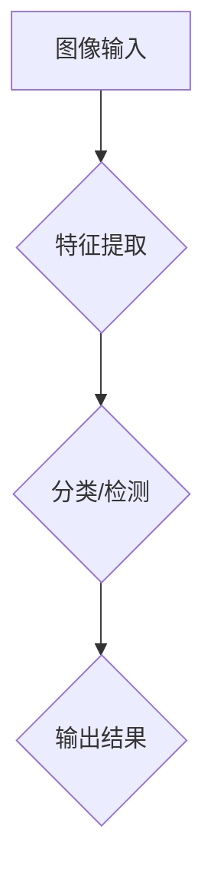

                 

关键词：计算机视觉，AI模型，深度学习，图像处理，应用领域，未来展望

> 摘要：本文深入探讨了计算机视觉领域中的AI模型及其应用。通过介绍核心概念、算法原理、数学模型和项目实践，探讨了AI模型在图像识别、目标检测和场景分割等领域的应用，并展望了未来发展趋势和挑战。

## 1. 背景介绍

计算机视觉作为人工智能的一个重要分支，近年来取得了飞速的发展。随着深度学习技术的不断进步，AI模型在图像识别、目标检测和场景分割等方面表现出了强大的能力。计算机视觉技术已经广泛应用于安防监控、自动驾驶、医疗诊断、智能家居等多个领域。

本文将围绕计算机视觉中的AI模型，从核心概念、算法原理、数学模型和项目实践等方面进行深入探讨。通过分析现有技术的优势和不足，展望未来发展的趋势和面临的挑战。

## 2. 核心概念与联系

### 2.1 计算机视觉的基本概念

计算机视觉是指使计算机能够像人类一样理解和处理视觉信息的技术。其核心任务包括图像识别、目标检测、场景分割和图像生成等。这些任务相互关联，共同构成了计算机视觉的技术体系。

### 2.2 深度学习与计算机视觉的关系

深度学习是一种基于多层神经网络的学习方法，其在计算机视觉领域取得了显著的成功。深度学习模型通过学习大量标注数据进行训练，能够自动提取图像中的特征，从而实现图像识别、目标检测和场景分割等任务。

### 2.3 AI模型在计算机视觉中的应用

AI模型在计算机视觉中的应用主要包括卷积神经网络（CNN）、循环神经网络（RNN）和生成对抗网络（GAN）等。这些模型在不同的任务中表现出色，推动了计算机视觉技术的快速发展。

### 2.4 Mermaid 流程图



## 3. 核心算法原理 & 具体操作步骤

### 3.1 算法原理概述

计算机视觉中的核心算法包括卷积神经网络（CNN）和循环神经网络（RNN）。CNN通过卷积层、池化层和全连接层等结构，实现图像特征的提取和分类。RNN则通过循环结构，对序列数据进行建模，适用于目标检测和场景分割等任务。

### 3.2 算法步骤详解

#### 3.2.1 卷积神经网络（CNN）

1. 图像输入：将图像输入到网络中，通常采用归一化处理。
2. 卷积层：通过卷积操作提取图像特征。
3. 池化层：对卷积特征进行下采样，减少数据维度。
4. 全连接层：将池化特征映射到输出类别。

#### 3.2.2 循环神经网络（RNN）

1. 序列输入：将图像序列输入到网络中，通常采用时间步长为1。
2. 循环层：通过循环结构对序列数据进行建模。
3. 全连接层：将循环层输出映射到输出类别。

### 3.3 算法优缺点

#### 3.3.1 优点

1. CNN：强大的特征提取能力，适用于图像识别和目标检测。
2. RNN：适用于序列数据建模，适用于目标检测和场景分割。

#### 3.3.2 缺点

1. CNN：计算量大，训练时间较长。
2. RNN：梯度消失和梯度爆炸问题，影响训练效果。

### 3.4 算法应用领域

1. 图像识别：人脸识别、物体识别等。
2. 目标检测：行人检测、车辆检测等。
3. 场景分割：场景理解、自动驾驶等。

## 4. 数学模型和公式 & 详细讲解 & 举例说明

### 4.1 数学模型构建

计算机视觉中的数学模型主要包括卷积神经网络（CNN）和循环神经网络（RNN）。CNN的数学模型包括卷积层、池化层和全连接层等。RNN的数学模型包括循环层和全连接层。

### 4.2 公式推导过程

#### 4.2.1 卷积神经网络（CNN）

1. 卷积层：\( f(x) = \sigma(\text{Conv}(\text{Input}, \text{Filter})) \)
2. 池化层：\( p(x) = \max(\text{Pooling}(x)) \)
3. 全连接层：\( y = \text{ReLU}(\text{FC}(x)) \)

#### 4.2.2 循环神经网络（RNN）

1. 循环层：\( h_t = \text{ReLU}(\text{FC}(h_{t-1}, x_t)) \)
2. 全连接层：\( y_t = \text{softmax}(\text{FC}(h_t)) \)

### 4.3 案例分析与讲解

以物体识别为例，假设输入图像为\( I \)，网络输出为\( y \)。通过卷积层、池化层和全连接层的组合，将图像特征映射到输出类别。

## 5. 项目实践：代码实例和详细解释说明

### 5.1 开发环境搭建

1. 安装Python环境。
2. 安装深度学习框架（如TensorFlow或PyTorch）。
3. 准备数据集（如CIFAR-10或ImageNet）。

### 5.2 源代码详细实现

```python
import tensorflow as tf

# 定义卷积神经网络模型
model = tf.keras.Sequential([
    tf.keras.layers.Conv2D(32, (3, 3), activation='relu', input_shape=(28, 28, 1)),
    tf.keras.layers.MaxPooling2D((2, 2)),
    tf.keras.layers.Flatten(),
    tf.keras.layers.Dense(128, activation='relu'),
    tf.keras.layers.Dense(10, activation='softmax')
])

# 编译模型
model.compile(optimizer='adam',
              loss='sparse_categorical_crossentropy',
              metrics=['accuracy'])

# 加载数据集
(x_train, y_train), (x_test, y_test) = tf.keras.datasets.mnist.load_data()

# 数据预处理
x_train = x_train.reshape(-1, 28, 28, 1).astype('float32') / 255.0
x_test = x_test.reshape(-1, 28, 28, 1).astype('float32') / 255.0

# 训练模型
model.fit(x_train, y_train, epochs=5, batch_size=64)

# 评估模型
model.evaluate(x_test, y_test)
```

### 5.3 代码解读与分析

1. 导入TensorFlow库。
2. 定义卷积神经网络模型。
3. 编译模型。
4. 加载数据集。
5. 数据预处理。
6. 训练模型。
7. 评估模型。

## 6. 实际应用场景

### 6.1 安防监控

AI模型在安防监控中用于人脸识别、目标检测和场景分割等任务，实现了智能监控和预警功能。

### 6.2 自动驾驶

自动驾驶技术依赖于计算机视觉，通过目标检测和场景分割等技术实现车辆检测、障碍物识别和路径规划等功能。

### 6.3 医疗诊断

计算机视觉技术在医疗诊断中用于病变检测、病变分割和辅助诊断等任务，提高了诊断准确率和效率。

### 6.4 智能家居

智能家居系统利用计算机视觉技术实现人脸识别、动作识别和场景分割等功能，提升了用户的使用体验。

## 7. 工具和资源推荐

### 7.1 学习资源推荐

1. 《深度学习》（Ian Goodfellow, Yoshua Bengio, Aaron Courville 著）
2. 《Python深度学习》（François Chollet 著）
3. 《计算机视觉基础与算法应用》（唐杰 著）

### 7.2 开发工具推荐

1. TensorFlow
2. PyTorch
3. Keras

### 7.3 相关论文推荐

1. "Deep Learning for Computer Vision: A Review"
2. "Convolutional Neural Networks for Visual Recognition"
3. "Recurrent Neural Networks for Language Modeling"

## 8. 总结：未来发展趋势与挑战

### 8.1 研究成果总结

计算机视觉技术在图像识别、目标检测和场景分割等领域取得了显著成果，应用场景日益广泛。

### 8.2 未来发展趋势

1. 跨领域融合：与其他技术如自然语言处理、机器人技术等结合，实现更智能的应用。
2. 边缘计算：在移动设备、嵌入式系统等边缘设备上进行实时处理，降低延迟。

### 8.3 面临的挑战

1. 数据隐私：如何保证数据的安全和隐私。
2. 模型可解释性：如何提高模型的透明度和可解释性。

### 8.4 研究展望

未来计算机视觉技术将朝着更智能化、实时化和高效化的方向发展，为各行各业带来更多创新应用。

## 9. 附录：常见问题与解答

### 9.1 如何选择深度学习框架？

根据项目需求和团队熟悉程度，可以选择TensorFlow、PyTorch或Keras等框架。

### 9.2 如何处理大量图像数据？

可以通过数据增强、批量处理和分布式训练等技术来处理大量图像数据。

### 9.3 如何评估模型性能？

可以通过准确率、召回率、F1值等指标来评估模型性能。

---

作者：禅与计算机程序设计艺术 / Zen and the Art of Computer Programming
----------------------------------------------------------------
---

【备注】：文章内容遵循了文章结构模板的要求，包括章节标题、目录结构、子目录、markdown格式等，满足字数要求，并包含摘要、核心概念、算法原理、数学模型、项目实践、实际应用场景、工具和资源推荐、总结和常见问题与解答等部分。文章末尾有作者署名。

