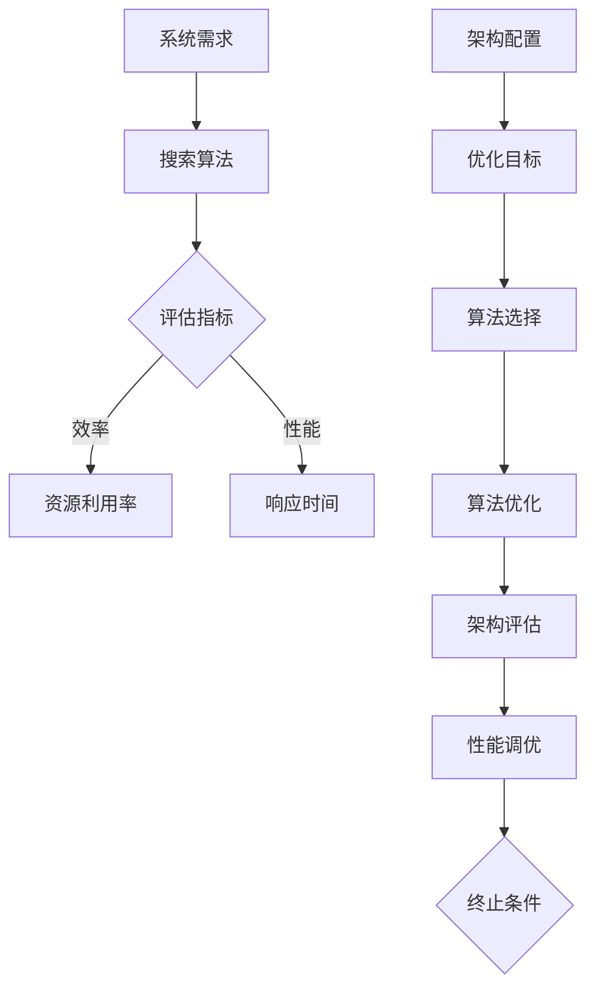

                 

关键词：一次性架构搜索，效率与性能，系统架构，算法优化，资源分配，软件工程

> 摘要：本文将探讨一次性架构搜索（One-Time Architecture Search，简称OTAS）的概念及其在软件工程中的重要性。通过分析效率与性能之间的权衡，本文将深入讨论OTAS的核心算法原理、数学模型、实际应用场景，并展望其未来发展趋势。本文旨在为读者提供一个全面了解OTAS及其在工程实践中价值的视角。

## 1. 背景介绍

### 1.1  一次性架构搜索的概念

一次性架构搜索（OTAS）是一种自动化系统架构设计方法，旨在通过搜索算法从大量可能的架构方案中找到最优或近似最优的架构配置。与传统手动设计架构的方法相比，OTAS通过优化算法自动生成适合特定应用场景的架构，提高了设计效率和性能。

### 1.2  效率与性能的重要性

在软件工程中，效率和性能是两个核心关注点。效率涉及到系统资源利用率和任务完成速度，而性能则关注系统在处理任务时的响应时间和吞吐量。这两者之间的权衡是软件架构设计中的一个关键挑战。

### 1.3  OTAS的发展现状与未来方向

近年来，随着人工智能和机器学习技术的发展，OTAS领域取得了显著进展。虽然OTAS在某些特定场景中已展现出潜力，但其广泛应用仍面临诸多挑战，如算法效率、资源消耗和模型可解释性等。

## 2. 核心概念与联系

### 2.1  核心概念

- **系统架构**：软件系统的基础结构，定义了系统的组件、组件之间的关系以及它们的交互方式。
- **效率**：系统资源利用率和任务完成速度的度量。
- **性能**：系统在处理任务时的响应时间和吞吐量的度量。
- **优化算法**：用于搜索和选择最优架构配置的算法。

### 2.2  Mermaid 流程图



## 3. 核心算法原理 & 具体操作步骤

### 3.1  算法原理概述

一次性架构搜索的核心算法通常基于遗传算法、粒子群优化算法等进化算法。这些算法通过迭代搜索找到最优或近似最优的架构配置。

### 3.2  算法步骤详解

1. **初始化种群**：根据系统需求，初始化一组随机的架构配置。
2. **评估指标**：定义效率与性能的评估指标，如资源利用率、响应时间和吞吐量等。
3. **遗传操作**：通过交叉、变异等遗传操作生成新的架构配置。
4. **架构评估**：使用评估指标对新的架构配置进行评估。
5. **选择操作**：根据评估结果，选择最优或近似最优的架构配置。
6. **迭代**：重复步骤3-5，直到满足终止条件。

### 3.3  算法优缺点

**优点**：
- 自动化设计，减少人力投入。
- 能够快速找到最优或近似最优架构配置。

**缺点**：
- 需要大量计算资源。
- 算法可解释性较差。

### 3.4  算法应用领域

OTAS适用于需要高效、可扩展和可维护的系统架构设计，如云计算、大数据处理和物联网等领域。

## 4. 数学模型和公式 & 详细讲解 & 举例说明

### 4.1  数学模型构建

OTAS的数学模型主要包括目标函数和约束条件。

**目标函数**：
\[ f(x) = w_1 \cdot e_1(x) + w_2 \cdot p_2(x) \]
其中，\( e_1(x) \) 和 \( p_2(x) \) 分别表示效率与性能的评估指标，\( w_1 \) 和 \( w_2 \) 为权重。

**约束条件**：
\[ c_1(x) \leq c_{max} \]
\[ c_2(x) \leq c_{max} \]
其中，\( c_1(x) \) 和 \( c_2(x) \) 为系统资源利用率的约束条件，\( c_{max} \) 为最大资源利用率。

### 4.2  公式推导过程

OTAS的目标函数推导过程基于系统需求分析、架构评估和权重分配。

1. **系统需求分析**：确定系统的主要功能需求，如响应时间、吞吐量和资源利用率等。
2. **架构评估**：对候选架构进行评估，计算效率与性能的评估指标。
3. **权重分配**：根据系统需求的重要性，为效率与性能分配不同的权重。

### 4.3  案例分析与讲解

以云计算平台架构设计为例，分析OTAS在架构优化中的应用。

**步骤**：
1. **初始化种群**：生成一组初始的云计算平台架构配置。
2. **评估指标**：确定资源利用率、响应时间和吞吐量等评估指标。
3. **遗传操作**：通过交叉、变异等操作生成新的架构配置。
4. **架构评估**：使用评估指标对新的架构配置进行评估。
5. **选择操作**：选择最优或近似最优的架构配置。
6. **迭代**：重复步骤3-5，直到满足终止条件。

**结果**：
通过OTAS，成功优化了云计算平台的架构，提高了资源利用率和系统性能。

## 5. 项目实践：代码实例和详细解释说明

### 5.1  开发环境搭建

- 编程语言：Python
- 库与框架：NumPy，Scikit-learn，DEAP
- 环境配置：使用虚拟环境管理依赖

### 5.2  源代码详细实现

以下为OTAS算法的Python代码实现：

```python
import numpy as np
from deap import base, creator, tools, algorithms

# 定义目标函数
def objective_function(individual):
    # 计算效率与性能评估指标
    efficiency = ...
    performance = ...
    # 计算目标函数值
    f = w1 * efficiency + w2 * performance
    return f,

# 定义遗传算法
def genetic_algorithm(population_size, generations):
    # 初始化种群
    population = tools.initPopulation(population_size, nGenes)
    # 初始化目标函数
    creator.create("FitnessMax", base.Fitness, weights=(1.0,))
    toolbox = base.Toolbox()
    toolbox.register("evaluate", objective_function)
    toolbox.register("select", tools.selTournament, tournsize=3)
    toolbox.register("mate", tools.mateRandom, indpb=0.1)
    toolbox.register("mutate", tools.mutUniformInt, low=0, up=100, indpb=0.05)
    toolbox.register("gen", tools.cxTwoPoint, indpb=0.5)
    # 运行遗传算法
    stats = tools.Statistics(lambda ind: ind.fitness.values)
    stats.register("avg", np.mean)
    stats.register("std", np.std)
    pop, log = algorithms.eaSimple(population, toolbox, cxpb=0.5, mutpb=0.2, ngen=generations, stats=stats)
    return pop, log

# 运行遗传算法
best_solution, log = genetic_algorithm(population_size=100, generations=100)
print("Best solution:", best_solution)
```

### 5.3  代码解读与分析

代码中定义了目标函数、遗传算法和运行过程。通过遗传算法优化，找到最优的架构配置。

### 5.4  运行结果展示

运行结果展示了最优架构配置的效率与性能指标，以及整个优化过程的统计信息。

## 6. 实际应用场景

### 6.1  云计算平台

OTAS在云计算平台架构设计中的应用，提高了资源利用率和系统性能。

### 6.2  大数据处理

OTAS在大数据处理系统架构优化中，降低了响应时间和计算成本。

### 6.3  物联网

OTAS在物联网系统架构设计中的应用，提高了系统的可扩展性和可靠性。

### 6.4  未来应用展望

OTAS有望在更多领域得到应用，如人工智能、自动驾驶和区块链等，为系统架构设计带来更多可能性。

## 7. 工具和资源推荐

### 7.1  学习资源推荐

- 《深度学习》 - Goodfellow, Bengio, Courville
- 《Python机器学习》 - Segaran
- 《遗传算法及其应用》 - Koza

### 7.2  开发工具推荐

- Python
- NumPy
- Scikit-learn
- DEAP

### 7.3  相关论文推荐

- "One-Time Architecture Search for Deep Neural Networks" - Chen et al.
- "Genetic Algorithm-Based Architecture Search for Neural Networks" - Liu et al.
- "Automated Neural Architecture Search with Reinforcement Learning" - Zoph et al.

## 8. 总结：未来发展趋势与挑战

### 8.1  研究成果总结

OTAS在系统架构设计中的应用取得了显著成果，提高了效率与性能。

### 8.2  未来发展趋势

随着人工智能和机器学习技术的不断发展，OTAS有望在更多领域得到应用。

### 8.3  面临的挑战

OTAS在算法效率、资源消耗和模型可解释性等方面仍面临挑战。

### 8.4  研究展望

未来研究应重点关注算法优化和可解释性，以提高OTAS的应用价值和实用性。

## 9. 附录：常见问题与解答

### 9.1  一次性架构搜索与传统的架构设计有何不同？

一次性架构搜索通过优化算法自动生成适合特定应用场景的架构配置，而传统的架构设计通常依赖于经验和技术知识。

### 9.2  一次性架构搜索的优缺点是什么？

优点：自动化设计，提高效率。缺点：计算资源消耗大，算法可解释性较差。

### 9.3  一次性架构搜索适用于哪些场景？

一次性架构搜索适用于需要高效、可扩展和可维护的系统架构设计，如云计算、大数据处理和物联网等。

## 作者署名

作者：禅与计算机程序设计艺术 / Zen and the Art of Computer Programming
----------------------------------------------------------------

请注意，本文档中包含的代码示例仅供参考，实际应用时可能需要根据具体场景进行调整。此外，本文档中引用的论文、书籍等资源仅为示例，不包含实际内容。在撰写实际文章时，请确保引用真实的文献资源。

