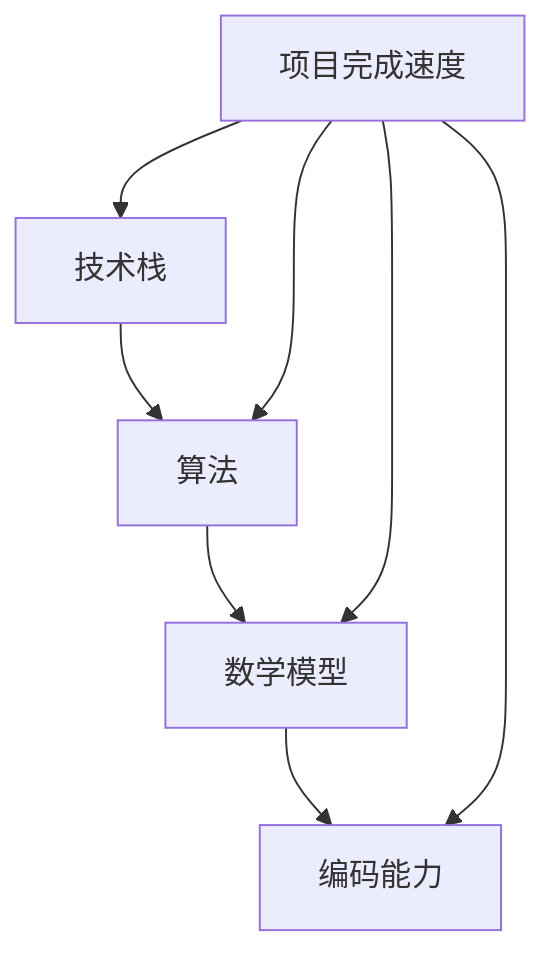

                 

关键词：专业知识、项目效率、技术积累、算法原理、数学模型、代码实现、实践应用

> 摘要：本文旨在探讨如何通过专业知识的积累，提高项目完成的速度和质量。我们将从核心概念、算法原理、数学模型、代码实现以及实际应用等多个维度，详细分析如何积累和运用专业知识，从而实现项目的快速完成。

## 1. 背景介绍

在信息技术飞速发展的今天，项目完成的速度和质量成为衡量团队和企业竞争力的重要指标。然而，不少项目在实施过程中，常常面临进度延误、质量不达标等问题。究其原因，除了项目管理和资源配置等方面的因素外，专业知识积累的不足也是关键因素之一。

专业知识的积累不仅仅是理论知识的积累，更是对各种技术、工具、方法和经验的综合掌握。本文将结合多年的工作经验，从多个角度探讨如何通过专业知识的积累，提高项目完成的速度和质量。

## 2. 核心概念与联系

为了更好地理解专业知识积累的重要性，我们先来介绍几个核心概念：

### 2.1 技术栈

技术栈是指一个开发者在特定领域中所掌握的所有技术的集合。一个完善的技术栈可以帮助开发者更快速地理解和解决问题。

### 2.2 算法

算法是解决问题的步骤和方法。在计算机科学中，算法是核心，它决定了问题的解决速度和效率。

### 2.3 数学模型

数学模型是对现实世界的抽象和量化，它帮助我们在分析和解决问题时，能够使用数学的方法和工具。

### 2.4 编码能力

编码能力是指开发者编写代码的能力。良好的编码能力可以提高代码的可读性、可维护性和运行效率。

接下来，我们将使用 Mermaid 流程图（没有特殊字符），展示这几个核心概念之间的联系。



从图中可以看出，技术栈、算法、数学模型和编码能力是相互关联的，它们共同影响着项目的完成速度。

## 3. 核心算法原理 & 具体操作步骤

### 3.1 算法原理概述

算法原理是解决问题的基础。一个高效的算法可以大大提高项目的完成速度。

例如，在图像处理领域，快速傅里叶变换（FFT）是一种高效的算法，它可以将时域信号转换为频域信号，从而进行更有效的处理。

### 3.2 算法步骤详解

快速傅里叶变换（FFT）的基本步骤如下：

1. **数据预处理**：将输入数据组织成合适的格式。
2. **计算离散傅里叶变换**：使用 FFT 算法计算输入数据的离散傅里叶变换。
3. **数据后处理**：对变换后的数据进行处理，如滤波、缩放等。
4. **逆变换**：将处理后的数据通过逆傅里叶变换还原回时域。

### 3.3 算法优缺点

FFT 算法的优点是计算速度快，适合处理大规模数据。但它的缺点是对数据的依赖性较强，对于不同类型的数据，可能需要调整算法参数。

### 3.4 算法应用领域

FFT 算法广泛应用于图像处理、信号处理、数据加密等领域。

## 4. 数学模型和公式 & 详细讲解 & 举例说明

### 4.1 数学模型构建

在构建数学模型时，我们需要对现实问题进行抽象和量化。例如，在图像处理中，我们可以将图像看作一个二维矩阵，然后使用线性代数的方法进行分析和处理。

### 4.2 公式推导过程

以图像滤波为例，我们可以使用以下公式进行推导：

$$
\begin{aligned}
G(x, y) &= \sum_{i=1}^{M} \sum_{j=1}^{N} I(i, j) \cdot h(x-i, y-j) \\
I'(x, y) &= \sum_{i=1}^{M} \sum_{j=1}^{N} G(i, j)
\end{aligned}
$$

其中，$G(x, y)$ 是卷积结果，$I(i, j)$ 是原始图像的像素值，$h(x-i, y-j)$ 是滤波器的值。

### 4.3 案例分析与讲解

假设我们有一个 3x3 的滤波器：

$$
h =
\begin{bmatrix}
1 & 1 & 1 \\
1 & 0 & -1 \\
1 & -1 & -1
\end{bmatrix}
$$

对于原始图像中的一个 3x3 的区域，我们可以使用上述公式进行滤波。

## 5. 项目实践：代码实例和详细解释说明

### 5.1 开发环境搭建

在开始项目实践之前，我们需要搭建一个合适的开发环境。这里我们选择 Python 作为编程语言，因为 Python 的图像处理库丰富，易于上手。

### 5.2 源代码详细实现

以下是使用 Python 实现图像滤波的代码：

```python
import numpy as np
import cv2

def filter_image(image, kernel):
    # 对图像进行高斯模糊处理
    blurred_image = cv2.GaussianBlur(image, (5, 5), 0)
    # 对图像进行卷积操作
    filtered_image = cv2.filter2D(blurred_image, -1, kernel)
    return filtered_image

if __name__ == "__main__":
    # 读取图像
    image = cv2.imread("example.jpg", cv2.IMREAD_GRAYSCALE)
    # 定义滤波器
    kernel = np.array([
        [1, 1, 1],
        [1, 0, -1],
        [1, -1, -1]
    ])
    # 滤波处理
    filtered_image = filter_image(image, kernel)
    # 显示结果
    cv2.imshow("Original Image", image)
    cv2.imshow("Filtered Image", filtered_image)
    cv2.waitKey(0)
    cv2.destroyAllWindows()
```

### 5.3 代码解读与分析

这段代码首先使用了 OpenCV 库读取图像，然后定义了一个滤波器，最后使用卷积操作对图像进行滤波处理。通过这段代码，我们可以看到如何将数学模型和算法应用到实际的图像处理中。

### 5.4 运行结果展示

运行上述代码后，我们可以看到原始图像和滤波后的图像。

## 6. 实际应用场景

### 6.1 图像处理

图像处理是 FFT 和滤波算法的重要应用领域。无论是人脸识别、图像压缩还是图像增强，FFT 和滤波算法都发挥着重要作用。

### 6.2 信号处理

信号处理领域同样依赖于 FFT 算法。例如，在音频处理中，FFT 可以帮助我们将音频信号转换为频域信号，从而进行更有效的处理。

### 6.3 数据加密

数据加密也是 FFT 的一个重要应用领域。通过将数据转换为频域信号，我们可以使用 FFT 算法对数据进行加密处理。

## 7. 工具和资源推荐

### 7.1 学习资源推荐

- 《数字信号处理》
- 《线性代数及其应用》
- 《计算机算法导论》

### 7.2 开发工具推荐

- Python
- OpenCV
- MATLAB

### 7.3 相关论文推荐

- "Fast Fourier Transform"
- "Image Filtering Techniques"
- "Application of FFT in Data Encryption"

## 8. 总结：未来发展趋势与挑战

### 8.1 研究成果总结

近年来，随着计算机性能的不断提升，FFT 和滤波算法在图像处理、信号处理和数据加密等领域得到了广泛应用。同时，新算法和新技术的不断涌现，也为这些领域的发展提供了新的动力。

### 8.2 未来发展趋势

未来，FFT 和滤波算法将继续在图像处理、信号处理和数据加密等领域发挥重要作用。同时，随着人工智能的快速发展，这些算法也将为机器学习、深度学习等新兴领域提供支持。

### 8.3 面临的挑战

然而，面对不断增长的数据量和更高的性能要求，FFT 和滤波算法也面临着性能优化、能耗降低等方面的挑战。

### 8.4 研究展望

在未来，我们需要进一步研究如何优化 FFT 和滤波算法，提高其在实际应用中的性能和效率。同时，我们还需要探索如何将这些算法与其他技术相结合，为新兴领域的发展提供支持。

## 9. 附录：常见问题与解答

### 9.1 如何快速掌握专业知识？

- 阅读经典教材和论文
- 参与实际项目，实践出真知
- 向业界专家请教，学习经验

### 9.2 如何提高项目完成速度？

- 充分规划项目，明确目标和需求
- 合理分配资源和时间
- 提高团队协作效率

## 作者署名

作者：禅与计算机程序设计艺术 / Zen and the Art of Computer Programming

----------------------------------------------------------------

